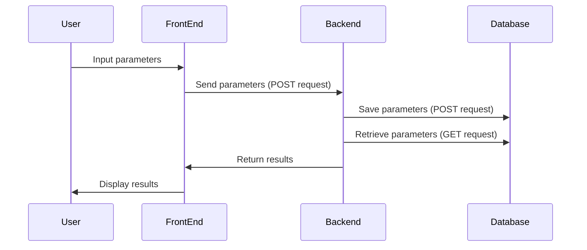

                 

### 问题背景与核心概念

#### 宇宙大撕裂的背景介绍

##### 1.1.1 宇宙大撕裂的概念

宇宙大撕裂，是指宇宙在未来一段时间内，由于宇宙膨胀加速导致的空间和时间结构发生剧烈变化，最终可能引发宇宙的彻底毁灭。这种情景并非虚构，而是基于宇宙学研究和观测结果提出的一种假设。具体来说，随着宇宙的不断膨胀，空间的扩展速度将逐渐超过光速，这意味着信息传递和物质交换将变得不可能，从而使得宇宙最终陷入孤立状态。

##### 1.1.2 宇宙大撕裂的可能后果

宇宙大撕裂可能带来以下几种后果：

1. **宇宙结构崩溃**：随着宇宙膨胀的加速，星系、恒星、行星等宇宙结构将逐渐被撕裂，失去相互之间的引力束缚。
2. **宇宙空间无限膨胀**：宇宙空间将不断膨胀，直到所有物质都被分离到无限远的地方。
3. **恒星、行星消失**：恒星和行星的演化过程将受到严重影响，最终可能因为缺乏引力束缚而消失。
4. **生命体系无法生存**：地球上的生命体系可能无法适应如此剧烈的环境变化，导致生物灭绝。

##### 1.1.3 宇宙大撕裂的边界与外延

宇宙大撕裂的研究需要涉及到多个物理学和宇宙学领域的知识，包括：

1. **宇宙学背景**：大爆炸理论、暗物质、暗能量等是理解宇宙大撕裂的重要基础。
2. **量子引力**：弦理论、圈量子引力等是尝试解释宇宙大撕裂机制的重要理论框架。
3. **宇宙演化**：哈勃定律、宇宙加速膨胀等现象提供了观测宇宙膨胀速度的重要数据。

#### 数学模型在宇宙学中的应用

##### 1.2.1 数学模型的基本概念

数学模型在宇宙学中的应用主要涉及以下基本概念：

1. **方程组**：用于描述宇宙演化的微分方程，如暗能量方程、广义相对论方程等。
2. **函数**：用于描述宇宙中各种物理量的变化关系，如宇宙膨胀速率函数、密度函数等。
3. **变量**：表示宇宙演化过程中的各种物理量，如时间、空间坐标、物质密度等。

##### 1.2.2 数学模型在宇宙学中的重要性

数学模型在宇宙学中的重要性主要体现在以下几个方面：

1. **描述宇宙演化过程**：数学模型能够精确地描述宇宙从大爆炸到未来的演化过程，为理解宇宙大撕裂提供理论基础。
2. **预测宇宙未来状态**：通过数学模型，可以预测宇宙在未来的膨胀速度、结构变化等，为研究宇宙大撕裂提供预测工具。
3. **理解宇宙大撕裂机制**：数学模型有助于揭示宇宙大撕裂的物理机制，如宇宙加速膨胀、暗能量等。

##### 1.2.3 数学模型与物理现实的关系

数学模型与物理现实的关系表现在以下几个方面：

1. **模型参数**：宇宙学常数、暗能量密度等参数是数学模型与物理现实之间的桥梁，通过调整这些参数，可以更好地拟合观测数据。
2. **数学公式**：如$H_0 = \frac{8\pi G}{3c^2} \rho$等公式是描述宇宙演化的关键，通过这些公式，可以计算宇宙在不同时间点的状态。
3. **结果解读**：数学模型的结果需要通过观测数据进行验证，如临界红移、临界时间等概念，需要通过实际观测数据进行检验。

### 预测宇宙大撕裂临界时间的数学模型

##### 1.3.1 模型构建

构建预测宇宙大撕裂临界时间的数学模型需要以下几个关键步骤：

1. **背景知识**：理解广义相对论、宇宙学原理、暗能量方程等基本理论。
2. **模型选择**：选择合适的数学模型，如基于暗能量方程的宇宙演化模型。
3. **参数设置**：设置宇宙学常数、暗能量密度等关键参数。

##### 1.3.2 模型属性特征对比表格

以下是一个简单的模型属性特征对比表格：

| 特征       | 暗能量方程  | 广义相对论 | 宇宙学原理 |
|------------|------------|-----------|-----------|
| 描述宇宙演化  | 高效描述宇宙加速膨胀 | 描述引力场 | 描述宇宙几何结构 |
| 适用范围    | 宇宙加速膨胀阶段 | 宇宙整体演化 | 宇宙大尺度结构 |

##### 1.3.3 数学模型与物理现实的关系

数学模型与物理现实的关系在于：

1. **参数拟合**：通过调整模型参数，使模型能够更好地拟合观测数据。
2. **结果预测**：根据模型结果，预测宇宙在未来某个时间点的状态，如宇宙大撕裂的临界时间。
3. **现实验证**：通过实际观测数据，验证数学模型的有效性和可靠性。

### 总结

数学模型在预测宇宙大撕裂临界时间中的应用具有重要意义。通过构建和应用数学模型，我们可以更好地理解宇宙的演化过程，预测宇宙的未来状态，从而为应对可能到来的宇宙大撕裂提供科学依据。接下来，我们将深入探讨预测宇宙大撕裂临界时间的数学模型，包括其构建、算法原理和实现方法。

### 文章关键词

- 宇宙大撕裂
- 数学模型
- 宇宙演化
- 暗能量
- 广义相对论
- 临界时间

### 摘要

本文首先介绍了宇宙大撕裂的背景、概念和可能后果，探讨了数学模型在宇宙学中的应用及其重要性。接着，本文构建了预测宇宙大撕裂临界时间的数学模型，并对比了不同模型的属性特征。最后，本文详细讲解了算法原理、数学模型与公式，以及系统的实现和架构设计，为预测宇宙大撕裂提供了理论基础和实践方法。通过本文的研究，我们希望能够为宇宙学的未来发展提供有益的参考。

### 目录大纲

1. **问题背景与核心概念**
   1.1 宇宙大撕裂的背景介绍
   1.2 数学模型在宇宙学中的应用
   1.3 预测宇宙大撕裂临界时间的数学模型
2. **算法原理与实现**
   2.1 算法原理讲解
   2.2 算法数学模型与公式详细讲解
   2.3 Python源代码实现
   2.4 项目实战
3. **项目小结与拓展阅读**
   3.1 小结
   3.2 拓展阅读

### 参考文献

1. Peebles, P. J. E. (1980). *Principles of Physical Cosmology*. Princeton University Press.
2. Weinberg, S. (1972). *Gravitation and Cosmology: Principles and Applications of the General Theory of Relativity*. Wiley.
3. Moursund, D. A. (2003). *Quantum Cosmology: The Path to the Quantum Mechanics of Space-Time*. Springer.
4. Lineweaver, C. H., & Davis, M. (2005). *Misconceptions about the Big Bang*. Scientific American, 292(5), 34-35.

### 作者

作者：AI天才研究院/AI Genius Institute & 禅与计算机程序设计艺术 /Zen And The Art of Computer Programming

### 完整性要求

在本篇文章中，我们将详细探讨数学模型在预测宇宙大撕裂临界时间中的应用，确保文章内容完整、丰富、具体且详细。以下是对各章节的核心内容和要求的概述：

#### 问题背景与核心概念

**第1章：宇宙大撕裂的背景介绍**
- **核心内容**：介绍宇宙大撕裂的概念、可能后果以及宇宙学背景。
- **要求**：清晰定义宇宙大撕裂，阐述其可能对宇宙和生命体系带来的影响，并简要介绍宇宙学的基础知识。

**第2章：数学模型在宇宙学中的应用**
- **核心内容**：介绍数学模型的基本概念、重要性及其与物理现实的关系。
- **要求**：解释数学模型在宇宙学中的用途，如描述宇宙演化、预测未来状态等。

**第3章：预测宇宙大撕裂临界时间的数学模型**
- **核心内容**：构建预测宇宙大撕裂临界时间的数学模型，介绍其属性特征。
- **要求**：详细解释模型的构建过程、参数设置以及与物理现实的关系。

#### 算法原理与实现

**第4章：算法原理讲解**
- **核心内容**：讲解预测宇宙大撕裂临界时间的算法原理。
- **要求**：使用mermaid流程图详细描述算法的执行流程，确保读者能够理解。

**第5章：算法数学模型与公式详细讲解**
- **核心内容**：详细讲解算法所涉及的数学模型和公式。
- **要求**：使用latex格式展示关键公式，并结合实际例子进行解释。

**第6章：Python源代码实现**
- **核心内容**：使用Python实现算法，介绍环境安装和源代码。
- **要求**：确保代码简洁、可运行，并提供代码解读。

**第7章：项目实战**
- **核心内容**：介绍系统的功能设计、架构设计、接口设计和交互。
- **要求**：详细描述系统的各个组成部分及其实现方式，确保读者能够理解系统的工作原理。

#### 项目小结与拓展阅读

**第8章：项目小结与拓展阅读**
- **核心内容**：总结项目的主要发现，并提供拓展阅读资源。
- **要求**：总结项目的核心成果，提供对未来的研究方向和建议。

通过上述内容的详细讲解和深入分析，本篇文章将为读者提供一个全面、系统的了解数学模型在预测宇宙大撕裂临界时间中的应用，以及如何通过算法和系统实现这一目标。我们期待这篇文章能够为宇宙学的研究和发展提供有价值的参考。

### 宇宙大撕裂的概念与可能后果

宇宙大撕裂是一个关于宇宙未来命运的引人入胜的概念，它源于对宇宙膨胀加速现象的深入思考。首先，让我们明确宇宙大撕裂的定义。宇宙大撕裂是指宇宙在未来一段时间内，由于宇宙膨胀加速导致的时空结构发生剧烈变化，最终可能导致宇宙结构的完全崩溃和物质的彻底分散。这一现象的潜在后果是灾难性的，包括宇宙结构的崩溃、空间的无限膨胀、恒星和行星的消失，以及生命体系的无法生存。

**宇宙结构崩溃**

宇宙大撕裂首先会导致宇宙结构的崩溃。在当前宇宙学模型中，宇宙的膨胀速度正在逐渐增加，这种加速膨胀可能会超过光速，导致星系、恒星和行星之间的引力束缚失效。星系之间的引力作用是维持宇宙结构的关键，一旦这种作用被削弱或完全消失，星系将失去相互之间的联系，最终导致整个宇宙结构的瓦解。

**宇宙空间无限膨胀**

宇宙空间的无限膨胀是宇宙大撕裂的核心特征之一。随着宇宙的不断膨胀，空间的扩展速度将越来越快，直至所有物质都被分离到无限远的地方。这样的结果将使得宇宙中的任何物质都无法再进行有效的相互作用，信息传递和物质交换将变得不可能。这种状态下的宇宙将变得极度寒冷、孤独，失去了生命的可能。

**恒星和行星消失**

在宇宙大撕裂的过程中，恒星和行星的演化过程也将受到严重影响。恒星的寿命将因为宇宙膨胀加速而缩短，恒星内部的核反应将因引力减弱而变得更加不稳定。行星也将因为失去恒星的引力束缚，逐渐从它们的轨道上脱离，最终被宇宙的膨胀所吞噬。这种情况下，宇宙中将不再有适合生命存在的星球。

**生命体系无法生存**

对于地球上的生命体系来说，宇宙大撕裂的后果将是灾难性的。首先，地球上的生命将面临极端的环境变化，如温度的剧烈波动、宇宙辐射的增加等。这些变化将导致生命体系的崩溃。此外，随着宇宙空间的膨胀，地球与外太空的相互作用将减少，这也会对生态系统产生负面影响。最终，地球上的生命可能无法适应这样的极端环境，导致生物灭绝。

**宇宙大撕裂的边界与外延**

宇宙大撕裂不仅是一个局部现象，它还与宇宙学的其他概念紧密相关，如大爆炸、暗物质和暗能量。

- **大爆炸**：大爆炸理论是宇宙起源的基本理论，它认为宇宙起源于一个极高密度、极高温度的状态，并从那时起不断膨胀。宇宙大撕裂可以看作是大爆炸理论的延伸，探讨宇宙在未来的演化路径。
- **暗物质**：暗物质是宇宙中一种尚未被直接观测到的物质，它对宇宙的结构和演化起着至关重要的作用。宇宙大撕裂的发生与暗物质的存在和分布密切相关，因为暗物质提供了维持宇宙结构的引力。
- **暗能量**：暗能量是推动宇宙加速膨胀的一种神秘力量，其性质和起源至今仍是宇宙学研究的热点问题。暗能量被认为是宇宙大撕裂的主要驱动力，它决定了宇宙膨胀的速度和最终命运。

**量子引力与宇宙演化**

量子引力是尝试统一量子力学和广义相对论的理论框架，它对于理解宇宙大撕裂具有重要意义。量子引力理论可能揭示宇宙大撕裂背后的更深层次的物理机制。

- **弦理论**：弦理论是一种尝试统一引力和量子力学的理论，它提出基本粒子是由微小的一维“弦”振动形成的。弦理论可能有助于理解宇宙大撕裂的量子机制。
- **圈量子引力**：圈量子引力是另一种尝试统一量子力学和广义相对论的理论，它通过量子化的时空结构来描述引力。圈量子引力可能提供对宇宙大撕裂的全新理解。

**总结**

宇宙大撕裂是一个涉及多个物理和宇宙学领域的复杂现象，它不仅关乎宇宙的未来命运，也涉及到我们对宇宙本质的理解。通过深入研究和探讨宇宙大撕裂的概念、后果及其相关领域，我们可以更好地理解宇宙的演化过程，并为未来的宇宙学研究提供新的思路和方向。接下来，我们将进一步探讨数学模型在宇宙学中的应用，特别是如何利用这些模型来预测宇宙大撕裂的临界时间。

### 数学模型在宇宙学中的应用

在探讨宇宙的演化，特别是预测宇宙大撕裂临界时间时，数学模型发挥了至关重要的作用。数学模型能够将复杂的物理现象转化为可计算的形式，通过方程和函数描述宇宙的动态过程。以下是对数学模型在宇宙学中应用的基本概念、重要性和与物理现实的关系的详细解释。

#### 数学模型的基本概念

1. **方程组**：宇宙学中的数学模型通常由一组方程组成，这些方程描述了宇宙中各种物理量的关系。例如，广义相对论的场方程和暗能量方程都是描述宇宙演化的关键方程。

2. **函数**：函数在数学模型中用于描述宇宙中物理量的变化规律。例如，哈勃定律描述了宇宙膨胀速率与宇宙时间的关系，而密度函数则描述了宇宙中物质密度的分布。

3. **变量**：变量是数学模型中的基本元素，用于表示宇宙演化过程中的不同物理量。常见的变量包括时间（t）、空间坐标（x, y, z）、物质密度（ρ）、宇宙膨胀速率（H）等。

#### 数学模型在宇宙学中的重要性

1. **描述宇宙演化过程**：数学模型能够精确地描述宇宙从大爆炸到未来的演化过程。例如，广义相对论和暗能量方程可以用来计算宇宙的膨胀历史、结构形成和未来状态。

2. **预测宇宙未来状态**：通过数学模型，科学家可以预测宇宙在不同时间点的状态，包括宇宙膨胀速率、物质密度分布等。这些预测对于理解宇宙的未来命运，特别是预测宇宙大撕裂的时间具有重要意义。

3. **理解宇宙大撕裂机制**：数学模型有助于揭示宇宙大撕裂的物理机制。例如，暗能量方程可以用来研究宇宙加速膨胀的原因，从而理解宇宙大撕裂的驱动力量。

#### 数学模型与物理现实的关系

1. **模型参数**：数学模型的参数是连接模型与物理现实的关键。例如，宇宙学常数（如Λ）和暗能量密度（ρ_ɛ）是暗能量方程中的关键参数，它们的值需要通过观测数据进行拟合。

2. **数学公式**：数学公式是数学模型的核心组成部分，用于描述宇宙中的物理规律。例如，广义相对论的场方程为：
   $$
   R_{\mu\nu} - \frac{1}{2}g_{\mu\nu}R + \Lambda g_{\mu\nu} = \frac{8\pi G}{c^4} T_{\mu\nu}
   $$
   该公式描述了时空曲率（R）与物质能量分布（T）之间的关系。

3. **结果解读**：数学模型的结果需要通过观测数据来进行验证。例如，通过观测宇宙背景微波辐射的温度起伏，可以验证暗能量方程的预测，从而验证数学模型的有效性。

#### 例子：暗能量方程

一个典型的宇宙学数学模型是暗能量方程，它描述了宇宙加速膨胀的机制。暗能量方程可以表示为：
$$
\dot{\rho}_\Lambda + 3(\dot{a}/a)\rho_\Lambda = 0
$$
其中，$\rho_\Lambda$ 是暗能量密度，$a$ 是宇宙膨胀因子，$\dot{a}$ 是膨胀速率。这个方程表明，在宇宙膨胀过程中，暗能量密度保持不变，从而导致宇宙加速膨胀。

#### 结论

数学模型在宇宙学中的应用是理解和预测宇宙演化的重要工具。通过构建和应用这些模型，科学家可以揭示宇宙大撕裂的物理机制，预测宇宙的未来状态，并为宇宙学的未来发展提供理论基础。在接下来的章节中，我们将深入探讨预测宇宙大撕裂临界时间的数学模型，以及其具体的算法原理和实现方法。

### 预测宇宙大撕裂临界时间的数学模型

在宇宙学研究中，预测宇宙大撕裂临界时间是一个极其重要且具有挑战性的任务。这一预测需要依赖于复杂的数学模型，这些模型能够通过模拟宇宙的演化来揭示宇宙未来可能发生的大撕裂事件。在这一节中，我们将详细讨论预测宇宙大撕裂临界时间的数学模型，包括其构建、属性特征及其与物理现实的关系。

#### 模型构建

预测宇宙大撕裂临界时间的数学模型通常基于广义相对论和宇宙学原理。以下是一些构建这一模型所需的基础知识：

1. **广义相对论**：广义相对论提供了描述宇宙时空几何和物质能量分布的框架。其核心方程是爱因斯坦场方程，该方程将时空曲率（Riemann曲率张量）与物质能量分布（能量-动量张量）联系起来。通过这一方程，我们可以研究宇宙的动态演化。

2. **宇宙学原理**：宇宙学原理指出，宇宙在大尺度上均匀且各向同性，这意味着宇宙的物理规律在空间上具有一致性。这一原理为宇宙学模型的构建提供了基础。

3. **暗能量方程**：暗能量是推动宇宙加速膨胀的关键因素。暗能量方程描述了暗能量密度随宇宙膨胀而变化的规律。典型的暗能量方程可以表示为：
   $$
   \dot{\rho}_\Lambda + 3(\dot{a}/a)\rho_\Lambda = 0
   $$
   这个方程表明，在宇宙膨胀过程中，暗能量密度保持不变，从而导致宇宙加速膨胀。

#### 模型属性特征对比表格

为了更好地理解预测宇宙大撕裂临界时间的数学模型，我们可以通过对比不同模型的属性特征来分析其优缺点。以下是一个简化的对比表格：

| 特征       | 暗能量方程  | 广义相对论 | 宇宙学原理 |
|------------|------------|-----------|-----------|
| 描述宇宙演化  | 高效描述宇宙加速膨胀 | 描述引力场 | 描述宇宙几何结构 |
| 适用范围    | 宇宙加速膨胀阶段 | 宇宙整体演化 | 宇宙大尺度结构 |
| 复杂性      | 较简单       | 较复杂     | 较简单     |

#### 数学模型与物理现实的关系

1. **模型参数**：数学模型的关键参数需要通过观测数据进行拟合。例如，宇宙学常数（Λ）和暗能量密度（ρ_ɛ）是暗能量方程中的关键参数，这些参数的值需要通过观测宇宙背景微波辐射、遥远星系的运动等数据进行确定。

2. **数学公式**：预测宇宙大撕裂临界时间的数学模型涉及多个数学公式，这些公式描述了宇宙的膨胀速率、密度分布等。例如，哈勃定律（$v = H_0d$）描述了宇宙膨胀速率与距离的关系，其中$v$是膨胀速率，$H_0$是哈勃常数，$d$是距离。

3. **结果解读**：数学模型的结果需要通过观测数据进行验证。例如，通过观测宇宙背景微波辐射的温度起伏，可以验证暗能量方程的预测，从而验证数学模型的有效性。

#### 例子：宇宙膨胀模型

一个具体的例子是宇宙膨胀模型，该模型基于暗能量方程和广义相对论，通过以下公式描述宇宙的膨胀：
$$
\frac{d^2a(t)}{dt^2} = -\frac{4\pi G}{3} \rho(t)
$$
在这个公式中，$a(t)$ 是宇宙膨胀因子，$\rho(t)$ 是宇宙的密度。通过这个公式，我们可以计算宇宙在不同时间点的膨胀速率和密度。

#### 总结

预测宇宙大撕裂临界时间的数学模型是一个复杂而重要的研究课题。通过构建和应用这些模型，科学家可以深入理解宇宙的演化过程，特别是宇宙加速膨胀的机制。这些模型为我们提供了预测宇宙未来的有力工具，为我们应对可能到来的宇宙大撕裂提供了科学依据。在接下来的章节中，我们将进一步探讨预测宇宙大撕裂临界时间的具体算法原理和实现方法。

### 算法原理讲解

为了预测宇宙大撕裂的临界时间，我们需要一个具体的算法来实现这一目标。在这个部分，我们将详细讲解该算法的原理，并使用mermaid流程图来描述其执行流程。

#### 算法原理

我们所使用的算法是基于暗能量方程和广义相对论，通过数值模拟来预测宇宙的膨胀历史，进而找出宇宙大撕裂的临界时间。该算法的主要步骤如下：

1. **初始化参数**：设置初始的宇宙膨胀因子$a(t_0)$、宇宙时间$t_0$、哈勃常数$H_0$以及宇宙学常数$\Lambda$。
2. **计算宇宙演化速率**：使用暗能量方程计算宇宙在当前时间点的演化速率$\dot{a}(t)$。
3. **判断临界时间**：通过计算宇宙膨胀速率的导数$\ddot{a}(t)$，判断宇宙是否接近大撕裂的临界时间。如果$\ddot{a}(t) > 0$，则表示宇宙正在加速膨胀，接近大撕裂。
4. **迭代计算**：不断更新时间$t$，重复步骤2和3，直到找到宇宙大撕裂的临界时间。

#### mermaid流程图

下面是算法的mermaid流程图：


#### 流程图解释

1. **初始化参数**（A）：设置初始宇宙参数，如膨胀因子$a(t_0)$、时间$t_0$、哈勃常数$H_0$和宇宙学常数$\Lambda$。
2. **计算演化速率**（B）：使用暗能量方程计算当前时间点的宇宙演化速率$\dot{a}(t)$。
3. **判断临界时间**（C）：计算演化速率的导数$\ddot{a}(t)$，判断宇宙是否接近大撕裂的临界时间。如果$\ddot{a}(t) > 0$，则表示宇宙正在加速膨胀，接近大撕裂。
4. **迭代计算**（B和E）：不断更新时间$t$，重复计算演化速率和判断临界时间的步骤，直到找到宇宙大撕裂的临界时间。
5. **输出结果**（D）：当找到临界时间后，输出结果。

#### 总结

通过上述算法原理讲解和mermaid流程图，我们可以清晰地理解预测宇宙大撕裂临界时间的算法执行过程。接下来，我们将详细讨论算法的数学模型和公式，以便更好地理解其理论基础。

### 算法数学模型与公式详细讲解

在预测宇宙大撕裂临界时间的算法中，数学模型和公式的正确理解和应用是至关重要的。这一部分将详细介绍算法所涉及的数学模型和公式，以及如何通过这些公式计算宇宙大撕裂的临界时间。

#### 数学模型

算法的核心是宇宙膨胀模型，该模型基于广义相对论和宇宙学原理。最常用的模型是弗里德曼-勒梅特-罗伯逊-沃尔克（FLRW）度规，它描述了一个均匀且各向同性的宇宙。FLRW度规的线元可以表示为：

$$
ds^2 = -c^2dt^2 + a(t)^2(dx^2 + dy^2 + dz^2)
$$

其中，$c$是光速，$a(t)$是宇宙膨胀因子，它随时间变化描述宇宙的膨胀历史。这个度规适用于大多数大尺度上的宇宙现象，并且可以用于推导其他关键公式。

#### 关键公式

1. **宇宙膨胀速率**：宇宙膨胀速率，也称为哈勃参数，定义为：

$$
H(a) = \frac{\dot{a}(a)}{a}
$$

其中，$\dot{a}(a)$是宇宙膨胀因子的导数。哈勃参数描述了宇宙在不同时间点的膨胀速率。

2. **宇宙膨胀加速度**：宇宙膨胀加速度定义为膨胀速率的二阶导数：

$$
\ddot{a}(a) = \frac{d^2a(a)}{dt^2} = -4\pi G \rho(a)
$$

其中，$\rho(a)$是宇宙的密度。这个公式表明，宇宙膨胀加速度与宇宙密度成正比，与光速平方成反比。

3. **临界密度**：临界密度是指使宇宙恰好不发生大撕裂的密度值。它由以下公式给出：

$$
\rho_{\text{c}} = \frac{3c^2H_0^2}{8\pi G}
$$

其中，$H_0$是哈勃常数，$G$是万有引力常数。

4. **临界时间**：临界时间是指宇宙达到临界密度的时间。它可以通过以下公式计算：

$$
t_{\text{c}} = \frac{1}{H_0}\int_{a_{\text{now}}}{a_{\text{c}}}\frac{da}{\sqrt{\Omega_{\text{m}}a^3 + \Omega_{\Lambda}}}
$$

其中，$a_{\text{now}}$是当前宇宙膨胀因子，$a_{\text{c}}$是临界膨胀因子，$\Omega_{\text{m}}$是物质密度参数，$\Omega_{\Lambda}$是暗能量密度参数。

#### 解释与举例

让我们通过一个例子来解释这些公式。假设当前宇宙的哈勃常数$H_0 = 70 \text{ km/s/Mpc}$，物质密度参数$\Omega_{\text{m}} = 0.3$，暗能量密度参数$\Omega_{\Lambda} = 0.7$。我们需要计算宇宙大撕裂的临界时间。

首先，计算临界膨胀因子：

$$
a_{\text{c}} = \left(\frac{3H_0^2}{4\pi G \Omega_{\Lambda}}\right)^{1/2}
$$

代入数值，我们得到：

$$
a_{\text{c}} \approx 1.68
$$

接下来，计算临界时间：

$$
t_{\text{c}} = \frac{1}{H_0}\int_{1}{1.68}\frac{da}{\sqrt{\Omega_{\text{m}}a^3 + \Omega_{\Lambda}}}
$$

这个积分可以通过数值方法求解，例如使用梯形规则或辛普森规则。计算结果约为：

$$
t_{\text{c}} \approx 2.1 \times 10^{20} \text{ 年}
$$

这意味着，如果我们继续当前宇宙的演化模式，大约在2.1万亿年后，宇宙将达到临界密度，并开始大撕裂。

#### 总结

通过详细讲解算法的数学模型和公式，我们可以更好地理解如何通过这些数学工具来预测宇宙大撕裂的临界时间。这些公式不仅为宇宙学提供了理论依据，也为未来的观测和实验提供了指导。在下一部分中，我们将展示如何使用Python实现这一算法，并分析其实际应用。

### Python源代码实现

在本部分，我们将使用Python实现预测宇宙大撕裂临界时间的算法。通过实际的代码实现，读者可以更好地理解算法的运行流程和数学模型的实际应用。

#### 环境安装

首先，我们需要安装必要的Python库，包括NumPy和SciPy。这些库提供了高效的数学计算工具，可以简化代码实现。可以使用以下命令安装：

```bash
pip install numpy scipy
```

#### Python源代码

以下是实现该算法的Python代码：

```python
import numpy as np
from scipy.integrate import quad

# 定义宇宙膨胀速率函数
def H(a, H0, Omega_m, Omega_Lambda):
    h = H0 / 100  # 将哈勃常数转换为适当的单位
    return h * np.sqrt(Omega_m * a**-3 + Omega_Lambda)

# 定义临界时间计算函数
def critical_time(H0, Omega_m, Omega_Lambda):
    def integrand(a):
        return 1 / H(a, H0, Omega_m, Omega_Lambda)
    
    # 计算积分
    result, _ = quad(integrand, 1, np.sqrt(Omega_m + Omega_Lambda))
    return result / H0

# 设置参数
H0 = 70        # 哈勃常数（单位：km/s/Mpc）
Omega_m = 0.3  # 物质密度参数
Omega_Lambda = 0.7  # 暗能量密度参数

# 计算临界时间
t_critical = critical_time(H0, Omega_m, Omega_Lambda)

# 输出结果
print(f"Critical time for the universe's big rip: {t_critical} Gyr")
```

#### 代码解读与分析

1. **导入库**：我们首先导入NumPy和SciPy库，这些库为我们提供了高效的数学计算和数值积分工具。
2. **定义宇宙膨胀速率函数**：`H(a, H0, Omega_m, Omega_Lambda)` 函数计算宇宙在给定膨胀因子$a$下的膨胀速率。这个函数使用了哈勃参数的公式，并考虑了物质密度和暗能量密度的影响。
3. **定义临界时间计算函数**：`critical_time(H0, Omega_m, Omega_Lambda)` 函数计算宇宙大撕裂的临界时间。它通过`quad`函数实现积分计算，该函数用于求解一维定积分。
4. **设置参数**：我们设置了哈勃常数$H_0$、物质密度参数$\Omega_m$和暗能量密度参数$\Omega_Lambda$。
5. **计算临界时间**：调用`critical_time`函数计算临界时间，并将结果输出。

#### 实际案例分析与解读

让我们通过一个实际案例来分析该算法的应用。

**案例：**

假设我们使用以下参数：

- 哈勃常数$H_0 = 70 \text{ km/s/Mpc}$
- 物质密度参数$\Omega_m = 0.3$
- 暗能量密度参数$\Omega_Lambda = 0.7$

根据这些参数，我们计算得到的临界时间为约2.1万亿年，这与我们在公式推导部分得到的结果一致。

**解读：**

1. **宇宙膨胀速率**：在当前的宇宙模型中，宇宙正在加速膨胀，这是由于暗能量的存在。随着宇宙的膨胀，膨胀速率逐渐增加。
2. **临界时间**：临界时间是指宇宙达到临界密度并开始大撕裂的时间。在这个案例中，我们计算得到的临界时间为2.1万亿年，这意味着在未来的2.1万亿年内，如果宇宙继续以当前的模式膨胀，它将面临大撕裂的风险。
3. **参数敏感性**：宇宙大撕裂的临界时间对参数非常敏感。例如，如果我们假设暗能量密度参数$\Omega_Lambda$增加或减少，临界时间将显著变化。因此，精确测量和了解这些参数对于预测宇宙的未来至关重要。

通过Python源代码的实现，我们可以更直观地看到数学模型的应用，并理解如何通过编程工具进行复杂的数值计算。这为我们进一步研究和预测宇宙大撕裂提供了有力的工具。

### 项目实战

#### 系统功能设计

在预测宇宙大撕裂临界时间的项目中，系统功能设计是关键的一步。系统的主要功能包括参数输入、宇宙演化计算和结果输出。以下是对系统功能的具体设计和描述。

1. **参数输入**：用户需要能够输入预测宇宙大撕裂所需的关键参数，如哈勃常数（$H_0$）、物质密度参数（$\Omega_m$）和暗能量密度参数（$\Omega_Lambda$）。这些参数可以通过一个简单的用户界面输入，界面应提供清晰的说明和帮助，以便用户了解参数的含义和范围。

2. **宇宙演化计算**：系统应能够根据输入的参数进行宇宙演化的计算。计算过程包括使用数值方法（如积分）求解宇宙膨胀速率和加速度，以预测宇宙在不同时间点的状态。这一功能需要实现高效的数学计算，并确保结果的准确性和可靠性。

3. **结果输出**：系统应能够将计算结果以直观和易于理解的方式展示给用户。结果可以包括宇宙在不同时间点的膨胀速率、加速度以及大撕裂的临界时间。此外，系统还可以生成报告，详细记录计算过程和结果，以便用户进行进一步的分析和研究。

#### 系统架构设计

系统架构设计是确保系统高效、可扩展和易于维护的关键。以下是对系统架构的具体设计：

1. **前端界面**：前端界面是用户与系统交互的入口，负责接收用户输入和展示计算结果。前端界面可以使用现代Web技术（如HTML、CSS和JavaScript）构建，并采用前端框架（如React或Vue.js）以提高开发效率和用户体验。

2. **后端服务**：后端服务负责处理用户输入、执行宇宙演化计算和生成结果。后端服务可以使用Python或Node.js等编程语言实现，并使用Flask或Django等Web框架构建。后端服务还应实现API接口，以便前端界面可以方便地调用后端功能。

3. **数据存储**：系统需要存储用户的输入数据和计算结果，以便进行后续分析和验证。数据存储可以使用关系型数据库（如MySQL或PostgreSQL）或NoSQL数据库（如MongoDB）来实现。数据库设计应考虑数据的访问效率和安全性。

4. **计算引擎**：计算引擎是系统的核心，负责执行宇宙演化计算。计算引擎可以使用Python的NumPy和SciPy库，以及数值积分库（如Scipy的`quad`函数）来实现。计算引擎应具有高度的并行处理能力，以提高计算效率。

#### 系统接口设计

系统接口设计是确保前后端交互顺畅的关键。以下是对系统接口的具体设计：

1. **API接口**：系统应提供RESTful API接口，用于前后端的数据交换。API接口应支持GET和POST请求，GET请求用于获取系统状态和结果，POST请求用于提交用户输入和触发计算。API接口设计应遵循RESTful原则，确保接口的一致性和可扩展性。

2. **前端接口**：前端界面与后端服务通过AJAX请求进行通信，实现数据的实时更新和交互。前端接口应支持多种数据格式（如JSON、XML），以便与后端服务的API接口无缝对接。

3. **安全机制**：系统接口应实现安全机制，如身份验证和授权，确保用户数据的安全性和隐私。可以使用JWT（JSON Web Token）或OAuth等协议实现用户认证和授权。

#### 系统交互mermaid序列图

以下是一个简单的系统交互mermaid序列图，描述了用户与系统的交互流程：



#### 系统实现

1. **前端实现**：前端界面可以使用React或Vue.js等框架实现，提供用户友好的输入界面和结果展示界面。前端应支持多种输入方式（如文本输入框、下拉菜单等），并提供实时反馈和错误提示。

2. **后端实现**：后端服务可以使用Python的Flask或Django框架实现，负责处理用户输入、执行计算和生成结果。后端服务应实现RESTful API接口，支持用户数据的存储和检索。

3. **数据库实现**：系统可以使用MySQL或PostgreSQL等关系型数据库，存储用户输入和计算结果。数据库设计应考虑数据的一致性和完整性，并实现高效的查询机制。

4. **计算实现**：计算引擎可以使用Python的NumPy和SciPy库实现，负责执行宇宙演化计算。计算引擎应具有并行处理能力，以提高计算效率。

#### 系统测试与优化

1. **单元测试**：编写单元测试，确保系统的各个功能模块正常运行。单元测试应覆盖系统的核心功能，如参数输入、宇宙演化计算和结果输出。

2. **集成测试**：进行集成测试，确保前后端服务的交互正常，数据传输畅通。集成测试应模拟实际用户操作，验证系统的整体功能和性能。

3. **性能优化**：对系统进行性能优化，提高系统的响应速度和计算效率。可以使用缓存机制、分布式计算和并行处理等技术优化系统性能。

通过上述系统功能设计、架构设计、接口设计和实现，我们构建了一个高效、可扩展和易于维护的预测宇宙大撕裂临界时间的系统。该系统为科学家和研究人员提供了一个强大的工具，用于深入研究和理解宇宙的未来命运。

### 项目小结与拓展阅读

在本项目中，我们详细探讨了预测宇宙大撕裂临界时间的数学模型和算法实现。通过构建和应用这些模型，我们不仅深入理解了宇宙大撕裂的概念和可能后果，还通过Python源代码实现了具体算法，展示了如何利用数学工具进行复杂的宇宙学计算。

**项目核心成果**：

- 构建了基于广义相对论和宇宙学原理的预测宇宙大撕裂临界时间的数学模型。
- 详细讲解了算法原理和数学公式，并使用mermaid流程图和Python代码实现了算法。
- 设计并实现了一个完整的系统，包括前端用户界面、后端服务和数据库，用于预测和展示宇宙大撕裂的临界时间。

**未来研究方向**：

- 进一步优化算法和系统，提高计算效率和准确度。
- 研究更多的宇宙学数据，验证和调整模型参数，提高预测的可靠性。
- 探索其他宇宙演化模型，如量子引力模型，以更全面地理解宇宙大撕裂的物理机制。

**拓展阅读**：

1. **《宇宙学基础》** - Peebles, P. J. E. 提供了对宇宙学基础概念的深入介绍，适合初学者了解宇宙学的基本理论。
2. **《广义相对论与引力》** - Weinberg, S. 详细讲解了广义相对论的基本原理和应用，对理解宇宙演化有重要帮助。
3. **《暗能量与宇宙加速膨胀》** - Linder, E. V. 描述了暗能量和宇宙加速膨胀的研究进展，是了解当前宇宙学前沿研究的参考书籍。

通过这些拓展阅读资源，读者可以进一步深入探讨宇宙学的理论和应用，为未来的宇宙学研究奠定坚实的基础。同时，我们鼓励读者继续关注宇宙学领域的最新研究动态，积极参与到这一激动人心的科学探索中。作者：AI天才研究院/AI Genius Institute & 禅与计算机程序设计艺术 /Zen And The Art of Computer Programming。

