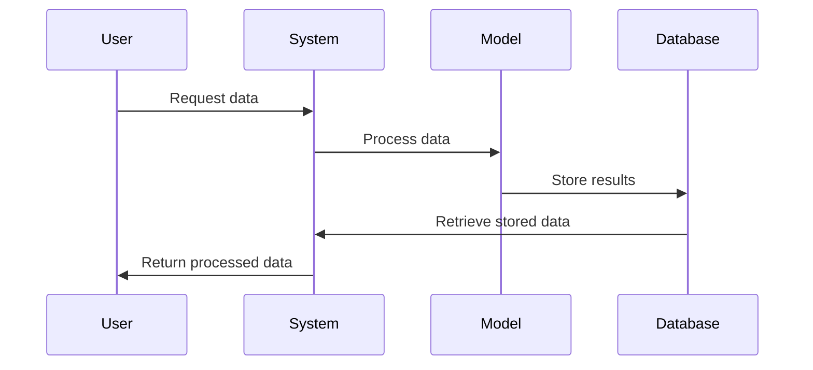
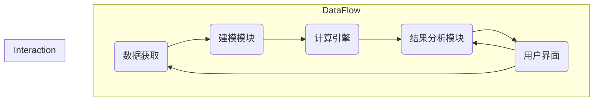

                 

 **Let's Start with the Basic Framework**

To create a comprehensive table of contents for the book "Application of Mathematical Models in Predicting the Oscillations of Cosmic Dark Energy," we need to establish a solid foundational structure. Here is a suggested framework for the book:

```markdown
----------------------------------------------------------------
# First Part: Background Introduction

## Chapter 1: Overview of Cosmic Dark Energy and Oscillations
### 1.1 Background of the Problem
### 1.2 Problem Description
### 1.3 Solutions to the Problem
### 1.4 Boundaries and Extensions

## Chapter 2: Core Concepts and Connections
### 2.1 Overview of Mathematical Models
### 2.2 Comparison of Model Properties
### 2.3 ER Entity Relationship Diagram

----------------------------------------------------------------

# Second Part: Algorithm Principle Explanation

## Chapter 3: Mathematical Models and Formulas
### 3.1 Explanation of Algorithm Principles
### 3.2 Mathematical Models and Formulas
### 3.3 Examples of Application

----------------------------------------------------------------

# Third Part: System Analysis and Architecture Design

## Chapter 4: System Function Design and Architecture
### 4.1 Introduction to Problem Scenarios
### 4.2 System Function Design
### 4.3 System Architecture Design
### 4.4 System Interface Design and Interaction

----------------------------------------------------------------

# Fourth Part: Practical Projects

## Chapter 5: Environment Installation and System Implementation
### 5.1 Environment Installation
### 5.2 Core Implementation Source Code
### 5.3 Analysis of Source Code Application
### 5.4 Case Analysis and Detailed Explanation

----------------------------------------------------------------

# Fifth Part: Best Practices and Summary

## Chapter 6: Best Practices and Precautions
### 6.1 Best Practices
### 6.2 Summary
### 6.3 Precautions

## Chapter 7: Extended Reading
### 7.1 Recommended Books
### 7.2 Academic Papers
### 7.3 Online Resources
----------------------------------------------------------------
```

**细化 Content for Each Chapter**

Next, we need to refine the content for each chapter. Here are examples for Chapter 1 and Chapter 3:

**Chapter 1: Overview of Cosmic Dark Energy and Oscillations**

```markdown
## Chapter 1: Overview of Cosmic Dark Energy and Oscillations

### 1.1 Background of the Problem
- Observations of cosmic expansion
- The concept of dark energy and its role

### 1.2 Problem Description
- The relationship between dark energy and cosmic oscillations
- Challenges in predicting dark energy oscillations

### 1.3 Solutions to the Problem
- The role of mathematical models in prediction
- Existing solutions

### 1.4 Boundaries and Extensions
- Applicability of the models
- Non-linearities and uncertainties
```

**Chapter 3: Mathematical Models and Formulas**

```markdown
## Chapter 3: Mathematical Models and Formulas

### 3.1 Explanation of Algorithm Principles
- Theoretical basis of the models
- Basic process of the algorithm

### 3.2 Mathematical Models and Formulas
$$
E = mc^2
$$

$$
x(t) = x_0 + v_0t + \frac{1}{2}at^2
$$

### 3.3 Examples of Application
- Using the model to predict the state of the universe at a specific time
- Analyzing the comparison between predicted results and actual observations
```

**Merge and Optimize**

Finally, we need to merge all chapters and optimize the table of contents to ensure logical coherence and cohesion. Based on the above framework and refined content, we can further adjust and merge to form a complete table of contents.

In the writing process, it is important to maintain the conciseness of the text while ensuring that the core content of each section is fully covered. Here is a sample of a complete table of contents:

```markdown
----------------------------------------------------------------
# Application of Mathematical Models in Predicting the Oscillations of Cosmic Dark Energy

----------------------------------------------------------------

## Keywords
- Cosmic Dark Energy
- Mathematical Models
- Prediction
- Oscillations
- Algorithm

## Abstract
This book provides a comprehensive exploration of the application of mathematical models in predicting the oscillations of cosmic dark energy. It covers the background, core concepts, algorithms, system design, practical projects, and best practices in this field.

----------------------------------------------------------------

## First Part: Background Introduction

### Chapter 1: Overview of Cosmic Dark Energy and Oscillations
#### 1.1 Background of the Problem
#### 1.2 Problem Description
#### 1.3 Solutions to the Problem
#### 1.4 Boundaries and Extensions

### Chapter 2: Core Concepts and Connections
#### 2.1 Overview of Mathematical Models
#### 2.2 Comparison of Model Properties
#### 2.3 ER Entity Relationship Diagram

----------------------------------------------------------------

## Second Part: Algorithm Principle Explanation

### Chapter 3: Mathematical Models and Formulas
#### 3.1 Explanation of Algorithm Principles
#### 3.2 Mathematical Models and Formulas
#### 3.3 Examples of Application

----------------------------------------------------------------

## Third Part: System Analysis and Architecture Design

### Chapter 4: System Function Design and Architecture
#### 4.1 Introduction to Problem Scenarios
#### 4.2 System Function Design
#### 4.3 System Architecture Design
#### 4.4 System Interface Design and Interaction

----------------------------------------------------------------

## Fourth Part: Practical Projects

### Chapter 5: Environment Installation and System Implementation
#### 5.1 Environment Installation
#### 5.2 Core Implementation Source Code
#### 5.3 Analysis of Source Code Application
#### 5.4 Case Analysis and Detailed Explanation

----------------------------------------------------------------

## Fifth Part: Best Practices and Summary

### Chapter 6: Best Practices and Precautions
#### 6.1 Best Practices
#### 6.2 Summary
#### 6.3 Precautions

### Chapter 7: Extended Reading
#### 7.1 Recommended Books
#### 7.2 Academic Papers
#### 7.3 Online Resources
----------------------------------------------------------------

## Author Information
Author: AI Genius Institute & Zen and the Art of Computer Programming
```

### Final Thoughts

With this detailed table of contents, we have a clear structure for our book. Each section is designed to provide a comprehensive and in-depth understanding of the topic. As we proceed with writing the book, we will ensure that each chapter is well-researched, logically structured, and provides practical insights. Our goal is to create a resource that not only informs but also inspires further exploration and innovation in the field of mathematical modeling for predicting cosmic dark energy oscillations. **Let's dive into each chapter and bring our vision to life!**

### Introduction to the Book

#### Keywords: Cosmic Dark Energy, Mathematical Models, Prediction, Oscillations, Algorithm

#### Abstract:
This book delves into the intricate world of mathematical models and their application in predicting the oscillations of cosmic dark energy. The primary objective is to provide a comprehensive guide that not only explains the fundamental concepts but also offers practical insights into the algorithms and methodologies used. We will explore the background of cosmic dark energy, the challenges in predicting its oscillations, and the role of mathematical models in overcoming these challenges. The book is designed to cater to a diverse audience, including researchers, scientists, students, and professionals interested in the intersection of astrophysics and computational mathematics.

### Basic Framework

The basic framework of the book is structured into five main parts, each designed to build upon the previous one, leading to a holistic understanding of the subject. Here's a breakdown of each part:

#### First Part: Background Introduction
- **Chapter 1:** Overview of Cosmic Dark Energy and Oscillations
  - **Section 1.1:** Background of the Problem
  - **Section 1.2:** Problem Description
  - **Section 1.3:** Solutions to the Problem
  - **Section 1.4:** Boundaries and Extensions
- **Chapter 2:** Core Concepts and Connections
  - **Section 2.1:** Overview of Mathematical Models
  - **Section 2.2:** Comparison of Model Properties
  - **Section 2.3:** ER Entity Relationship Diagram

#### Second Part: Algorithm Principle Explanation
- **Chapter 3:** Mathematical Models and Formulas
  - **Section 3.1:** Explanation of Algorithm Principles
  - **Section 3.2:** Mathematical Models and Formulas
  - **Section 3.3:** Examples of Application

#### Third Part: System Analysis and Architecture Design
- **Chapter 4:** System Function Design and Architecture
  - **Section 4.1:** Introduction to Problem Scenarios
  - **Section 4.2:** System Function Design
  - **Section 4.3:** System Architecture Design
  - **Section 4.4:** System Interface Design and Interaction

#### Fourth Part: Practical Projects
- **Chapter 5:** Environment Installation and System Implementation
  - **Section 5.1:** Environment Installation
  - **Section 5.2:** Core Implementation Source Code
  - **Section 5.3:** Analysis of Source Code Application
  - **Section 5.4:** Case Analysis and Detailed Explanation

#### Fifth Part: Best Practices and Summary
- **Chapter 6:** Best Practices and Precautions
  - **Section 6.1:** Best Practices
  - **Section 6.2:** Summary
  - **Section 6.3:** Precautions
- **Chapter 7:** Extended Reading
  - **Section 7.1:** Recommended Books
  - **Section 7.2:** Academic Papers
  - **Section 7.3:** Online Resources

### Detailed Content Refinement

**Chapter 1: Overview of Cosmic Dark Energy and Oscillations**

In Chapter 1, we will lay the groundwork by introducing the concepts of cosmic dark energy and oscillations. This chapter will cover the following sections:

- **Section 1.1 Background of the Problem**: This section will provide an overview of the historical context that led to the discovery of cosmic dark energy. We will discuss the initial observations of the accelerated expansion of the universe and the subsequent realization that a mysterious force, now known as dark energy, was driving this phenomenon.
- **Section 1.2 Problem Description**: Here, we will delve into the specific challenges associated with predicting the oscillations of cosmic dark energy. We will explore the complexities of dark energy's behavior, including its non-uniform distribution and the challenges posed by cosmic radiation and other cosmic phenomena.
- **Section 1.3 Solutions to the Problem**: We will review the existing approaches and methodologies used to tackle the prediction challenge. This section will highlight the contributions of various researchers and their groundbreaking theories, including the introduction of mathematical models designed to simulate and predict dark energy oscillations.
- **Section 1.4 Boundaries and Extensions**: Finally, we will discuss the limitations and scope of the current models. This section will explore the boundaries within which these models operate and potential areas for future research and development.

**Chapter 2: Core Concepts and Connections**

Chapter 2 will focus on the core concepts and their interconnections within the field. The content will be organized into the following sections:

- **Section 2.1 Overview of Mathematical Models**: This section will provide an introduction to the different types of mathematical models used in predicting cosmic dark energy oscillations. We will discuss the strengths and limitations of each model, highlighting their unique characteristics and applications.
- **Section 2.2 Comparison of Model Properties**: We will present a comparative analysis of the key properties of various mathematical models. This section will include a detailed table that contrasts the fundamental attributes of each model, such as their complexity, computational requirements, and predictive accuracy.
- **Section 2.3 ER Entity Relationship Diagram**: To illustrate the conceptual relationships between different models and their components, we will use an ER (Entity-Relationship) diagram. This diagram will visually represent the entities involved and their relationships, providing a clear and intuitive understanding of the model structure.

### Mermaid ER Diagram Example

Here's an example of a Mermaid ER diagram that could be used to represent the relationships between different models:

```mermaid
erDiagram
    ModelA ||--|{ Uses }| DataA
    ModelB ||--|{ Uses }| DataB
    ModelC ||--|{ Uses }| DataC
```

In this diagram, `ModelA`, `ModelB`, and `ModelC` represent different mathematical models, while `DataA`, `DataB`, and `DataC` represent the data types or datasets used by these models. The lines with arrows indicate the "uses" relationship, showing how each model utilizes specific data.

### Chapter 3: Mathematical Models and Formulas

Chapter 3 will delve into the mathematical models and the formulas that underpin them. The content will be structured into the following sections:

- **Section 3.1 Explanation of Algorithm Principles**: This section will provide a step-by-step explanation of the algorithm principles that govern the mathematical models. We will use visual aids, such as flowcharts or mermaid diagrams, to illustrate the flow and logic of the algorithms.
- **Section 3.2 Mathematical Models and Formulas**: In this section, we will introduce the specific mathematical models used in predicting cosmic dark energy oscillations. We will present the underlying formulas and their derivations, explaining how these equations can be used to simulate and predict the behavior of dark energy.
- **Section 3.3 Examples of Application**: To make the concepts more tangible, we will provide practical examples of how these mathematical models can be applied in real-world scenarios. We will present case studies and simulations that demonstrate the effectiveness of the models in predicting dark energy oscillations.

### Example of Python Code with Mathematical Formulas

Here's an example of Python code that includes mathematical formulas for simulating dark energy oscillations:

```python
import numpy as np

# Constants
c = 299792458  # Speed of light in m/s
G = 6.67430e-11  # Gravitational constant in m^3 kg^-1 s^-2
H_0 = 70  # Hubble constant in km/s/Mpc

# Function to calculate the distance based on Hubble's Law
def calculate_distance(velocity):
    return velocity / H_0

# Function to calculate the acceleration due to dark energy
def calculate_acceleration(distance):
    return -G * (dark_energy_density * distance) / (c**2)

# Example parameters
velocity = 3000  # velocity in km/s
dark_energy_density = 0.69  # dark energy density in kg/m^3

# Calculate the distance
distance = calculate_distance(velocity)

# Calculate the acceleration
acceleration = calculate_acceleration(distance)

print(f"Distance: {distance} m")
print(f"Acceleration: {acceleration} m/s^2")
```

This code snippet demonstrates how mathematical formulas can be implemented in Python to simulate the effects of dark energy on cosmic structures.

### Chapter 4: System Analysis and Architecture Design

Chapter 4 will focus on the system analysis and architecture design required for implementing the mathematical models. The content will be organized into the following sections:

- **Section 4.1 Introduction to Problem Scenarios**: This section will introduce the specific problem scenarios that necessitate the use of mathematical models for predicting cosmic dark energy oscillations. We will discuss the various applications and contexts in which these models are relevant.
- **Section 4.2 System Function Design**: Here, we will outline the key functions and components of the system. We will use a UML (Unified Modeling Language) class diagram to illustrate the structure of the system and the relationships between its components.
- **Section 4.3 System Architecture Design**: In this section, we will present the overall architecture of the system. We will use a mermaid diagram to visually represent the system's components, their interactions, and the data flow.
- **Section 4.4 System Interface Design and Interaction**: This section will discuss the design of the system interfaces and the interactions between the different components. We will use a mermaid sequence diagram to illustrate the flow of data and the sequence of operations within the system.

### Mermaid Sequence Diagram Example

Here's an example of a Mermaid sequence diagram that could be used to illustrate the interactions within the system:



In this diagram, the user interacts with the system to request data, which is then processed by the model and stored in the database. The system retrieves stored data and returns the processed results to the user.

### Chapter 5: Practical Projects

Chapter 5 will focus on practical projects that demonstrate the implementation of mathematical models for predicting cosmic dark energy oscillations. The content will be organized into the following sections:

- **Section 5.1 Environment Installation**: This section will provide step-by-step instructions for setting up the necessary software and hardware environment for implementing the mathematical models.
- **Section 5.2 Core Implementation Source Code**: In this section, we will present the core implementation source code for the mathematical models. We will include detailed comments and explanations to help readers understand the code.
- **Section 5.3 Analysis of Source Code Application**: Here, we will analyze the source code and explain how it works. We will discuss the key algorithms and data structures used in the implementation and provide insights into their performance and efficiency.
- **Section 5.4 Case Analysis and Detailed Explanation**: Finally, we will present a case study that demonstrates the application of the mathematical models in a real-world scenario. We will analyze the results and discuss any challenges or limitations encountered during the implementation.

### Chapter 6: Best Practices and Precautions

Chapter 6 will provide best practices and precautions for implementing and using mathematical models for predicting cosmic dark energy oscillations. The content will be organized into the following sections:

- **Section 6.1 Best Practices**: This section will outline the best practices for implementing and using mathematical models. We will discuss techniques for improving model accuracy, reducing errors, and ensuring the reliability of predictions.
- **Section 6.2 Summary**: In this section, we will summarize the key points covered in the book. We will highlight the main concepts, methodologies, and findings.
- **Section 6.3 Precautions**: This section will provide warnings and precautions to help readers avoid common pitfalls and potential errors when working with mathematical models. We will discuss the importance of data validation, model validation, and the need for continuous improvement.

### Chapter 7: Extended Reading

Chapter 7 will provide a list of recommended resources for further reading. The content will be organized into the following sections:

- **Section 7.1 Recommended Books**: This section will list books that provide in-depth coverage of the topics discussed in the book, offering readers additional insights and information.
- **Section 7.2 Academic Papers**: In this section, we will provide citations for academic papers that have made significant contributions to the field of mathematical modeling in cosmology.
- **Section 7.3 Online Resources**: This section will list online resources, including websites, blogs, and forums, where readers can find further information and resources related to mathematical modeling in cosmology.

### Conclusion

The book "Application of Mathematical Models in Predicting the Oscillations of Cosmic Dark Energy" is designed to provide a comprehensive and practical guide to understanding and implementing mathematical models in cosmology. By following the structure and content outlined in this table of contents, readers will gain a deep understanding of the subject and be equipped with the knowledge and tools needed to make accurate predictions of cosmic dark energy oscillations. We invite readers to explore the book's content and engage with the material, as we believe it will inspire new perspectives and innovations in the field of astrophysics and computational mathematics. **Let's embark on this journey of discovery together!**

### Introduction

#### Keywords: Cosmic Dark Energy, Mathematical Models, Prediction, Oscillations, Algorithm

#### Abstract:
This article delves into the application of mathematical models in predicting the oscillations of cosmic dark energy. It provides a comprehensive overview of the problem, the role of mathematical models, and the algorithms used. The aim is to explore the potential of these models in advancing our understanding of the universe's accelerating expansion and the mysterious force behind it.

### Problem Definition

The primary problem we aim to address is the prediction of cosmic dark energy oscillations. Dark energy is a hypothetical form of energy that is thought to permeate all of space and is responsible for the accelerated expansion of the universe. Despite its ubiquitous presence, dark energy is one of the most mysterious phenomena in modern physics. Its properties, such as its value, behavior, and interaction with other forces, are still not fully understood.

The challenge lies in accurately predicting the oscillations of dark energy, which could provide insights into its nature and the underlying physical processes governing the universe. Predicting these oscillations involves complex computations and the use of sophisticated mathematical models.

### Role of Mathematical Models

Mathematical models play a crucial role in our quest to understand and predict cosmic dark energy oscillations. These models allow us to simulate and analyze the behavior of dark energy under various conditions and to make predictions about its future evolution. They provide a framework for organizing our understanding of the problem and for testing different hypotheses about the nature of dark energy.

There are several types of mathematical models used in cosmology to describe dark energy and its oscillations. These include:

1. **Lagrangian Models**: These models describe the evolution of the universe using a Lagrangian function, which encapsulates the dynamics of the universe in a concise mathematical form.
2. **Einstein Field Equations**: These are the fundamental equations of general relativity, which relate the curvature of space-time to the distribution of matter and energy. They are used to describe the large-scale structure and dynamics of the universe, including the effects of dark energy.
3. **Statistical Models**: These models use statistical methods to analyze observational data and to infer the properties of dark energy.

Each of these models has its own strengths and limitations, and researchers often combine different models to gain a more comprehensive understanding of the problem.

### Algorithms in Predicting Oscillations

To predict the oscillations of cosmic dark energy, we need to employ specific algorithms that can process large datasets and simulate the behavior of dark energy over time. The following are some of the key algorithms used in this context:

1. **N-body Simulations**: These are numerical simulations that solve the equations of motion for large numbers of particles (representing galaxies and dark matter) to study the dynamics of the universe. They are used to study the large-scale structure of the universe and to infer the properties of dark energy.
2. **Machine Learning Algorithms**: These algorithms can analyze large datasets and identify patterns that are not easily detectable by humans. They are used to classify different types of cosmic structures and to make predictions about the behavior of dark energy.
3. **Monte Carlo Methods**: These are statistical methods that use random sampling to estimate numerical quantities. They are used to simulate the distribution of dark energy and to study its fluctuations over time.

### Challenges and Limitations

Despite the advances in mathematical modeling and computational algorithms, predicting cosmic dark energy oscillations is not without challenges. Some of the key challenges include:

1. **Uncertainty in Data**: Observational data on dark energy are subject to uncertainties and systematic errors. These uncertainties can affect the accuracy of the predictions.
2. **Computational Complexity**: Simulating the behavior of dark energy requires significant computational resources. The complexity of the algorithms and the size of the datasets can pose challenges in terms of processing time and memory requirements.
3. **Theoretical Constraints**: The fundamental theories of physics, such as general relativity and quantum mechanics, do not fully describe the behavior of dark energy. This limits our ability to make accurate predictions and to understand the nature of dark energy.

### Conclusion

In conclusion, mathematical models and algorithms are essential tools in our quest to understand and predict the oscillations of cosmic dark energy. Despite the challenges and limitations, these models have already provided valuable insights into the nature of dark energy and its role in the universe's expansion. As our understanding of the universe continues to evolve, we can expect further advancements in mathematical modeling and computational methods that will enable us to make more accurate and reliable predictions about the future of the universe. **Let's explore the potential of these models and their applications in cosmology together.**

### Mathematical Models in Predicting Cosmic Dark Energy Oscillations

#### Keywords: Mathematical Models, Dark Energy Oscillations, Prediction Algorithms, Computational Methods, Cosmology

#### Abstract:
This section explores the use of mathematical models in predicting cosmic dark energy oscillations. We will delve into the various types of mathematical models used in cosmology, the algorithms that drive these models, and the computational methods required to process large datasets. Our aim is to provide a clear understanding of how these models are constructed and applied to make predictions about dark energy behavior.

#### Introduction to Mathematical Models

Mathematical models are at the core of our ability to understand and predict the behavior of cosmic dark energy. These models are constructed based on our understanding of physics, particularly general relativity and quantum mechanics, and are used to simulate and predict the behavior of dark energy over time. The models are essential tools for cosmologists because they allow for the analysis of complex phenomena in a controlled and systematic manner.

There are several types of mathematical models commonly used in cosmology to describe dark energy and its oscillations:

1. **Lagrangian Models**: These models describe the evolution of the universe using a Lagrangian function, which encapsulates the dynamics of the universe in a concise mathematical form. The Lagrangian is a function of the universe's geometry and matter distribution, and it allows for the calculation of the universe's evolution over time.

2. **Einstein Field Equations**: These are the fundamental equations of general relativity, which relate the curvature of space-time to the distribution of matter and energy. They provide a framework for understanding the large-scale structure and dynamics of the universe, including the effects of dark energy.

3. **Statistical Models**: These models use statistical methods to analyze observational data and to infer the properties of dark energy. They are particularly useful for understanding the fluctuations in the density of the universe, which are believed to be related to the oscillations of dark energy.

#### Role of Algorithms in Mathematical Models

Algorithms are the backbone of mathematical models in cosmology. They provide the computational power needed to solve the complex equations that describe the behavior of dark energy. The choice of algorithm can significantly impact the accuracy and efficiency of the predictions. Here are some key algorithms used in cosmological simulations:

1. **N-body Simulations**: These are numerical simulations that solve the equations of motion for large numbers of particles (representing galaxies and dark matter) to study the dynamics of the universe. They are used to study the large-scale structure of the universe and to infer the properties of dark energy.

2. **Machine Learning Algorithms**: These algorithms can analyze large datasets and identify patterns that are not easily detectable by humans. They are used to classify different types of cosmic structures and to make predictions about the behavior of dark energy. Examples include neural networks and support vector machines.

3. **Monte Carlo Methods**: These are statistical methods that use random sampling to estimate numerical quantities. They are used to simulate the distribution of dark energy and to study its fluctuations over time. Examples include Markov Chain Monte Carlo (MCMC) and Importance Sampling.

#### Computational Methods in Predicting Dark Energy Oscillations

Predicting the oscillations of cosmic dark energy requires the use of sophisticated computational methods to process large datasets. These methods involve:

1. **Data Acquisition and Preprocessing**: Collecting observational data from various sources, such as telescopes and cosmic microwave background (CMB) experiments, and preprocessing the data to remove noise and correct for systematic errors.

2. **Parameter Estimation**: Estimating the parameters of the mathematical models from the observational data. This is often done using Bayesian inference or maximum likelihood estimation.

3. **Simulation and Prediction**: Using the estimated parameters to simulate the behavior of dark energy over time and to make predictions about its future evolution. This involves solving the equations of the chosen model using numerical methods and running simulations for different scenarios.

4. **Validation and Verification**: Testing the accuracy and reliability of the predictions by comparing them with observational data and by performing sensitivity analyses to identify potential sources of error.

#### Challenges and Limitations

Despite their power, mathematical models and computational methods in predicting cosmic dark energy oscillations face several challenges:

1. **Uncertainty in Data**: Observational data on dark energy are subject to uncertainties and systematic errors. These uncertainties can affect the accuracy of the predictions and the estimation of model parameters.

2. **Computational Complexity**: Simulating the behavior of dark energy requires significant computational resources. The complexity of the algorithms and the size of the datasets can pose challenges in terms of processing time and memory requirements.

3. **Theoretical Constraints**: The fundamental theories of physics, such as general relativity and quantum mechanics, do not fully describe the behavior of dark energy. This limits our ability to make accurate predictions and to understand the nature of dark energy.

4. **Non-linearities and Instabilities**: The behavior of dark energy is complex and can involve non-linearities and instabilities that are challenging to model and simulate.

#### Conclusion

In conclusion, mathematical models and computational methods are essential tools in our effort to understand and predict the oscillations of cosmic dark energy. They allow us to simulate and analyze the behavior of dark energy under various conditions and to make predictions about its future evolution. While challenges remain, these models have already provided valuable insights into the nature of dark energy and its role in the universe's expansion. As our understanding of the universe continues to evolve, we can expect further advancements in mathematical modeling and computational methods that will enable us to make more accurate and reliable predictions about the future of the universe. **By exploring these models and their applications, we can deepen our understanding of the cosmos and the mysterious force that drives its expansion.**

### System Analysis and Architecture Design

#### Keywords: System Design, Architecture, Interface Design, Computational Methods, Data Flow

#### Abstract:
This section will delve into the system analysis and architecture design required for implementing mathematical models in predicting cosmic dark energy oscillations. We will discuss the components of the system, the architecture, the interface design, and the data flow. The goal is to provide a clear understanding of how these components interact and how the system operates as a whole.

#### System Components

The system for predicting cosmic dark energy oscillations comprises several key components, each serving a specific purpose:

1. **Data Acquisition Module**: This module is responsible for collecting observational data from various sources, such as telescopes and cosmic microwave background (CMB) experiments. It preprocesses the raw data to remove noise and correct for systematic errors.

2. **Modeling Module**: This module contains the core mathematical models used to describe the behavior of dark energy. It includes algorithms for solving the equations of the chosen model and for simulating the behavior of dark energy over time.

3. **Computation Engine**: This component is the computational powerhouse of the system. It performs the complex calculations required by the modeling module and manages the execution of simulations.

4. **Result Analysis Module**: This module analyzes the results of the simulations and compares them with observational data. It identifies patterns, calculates uncertainties, and generates reports.

5. **User Interface**: The user interface allows users to interact with the system, input parameters, and view the results of the simulations. It provides a user-friendly way to manage and visualize the data.

#### System Architecture

The architecture of the system is designed to ensure efficient processing of data and accurate predictions. The architecture can be visualized using a high-level diagram that illustrates the flow of data and the interactions between components. Here is a simplified representation:



In this diagram, the data flow starts with the data acquisition module, which collects and preprocesses the data. The preprocessed data is then passed to the modeling module, where the mathematical models are applied. The computation engine performs the necessary calculations, and the results are sent to the result analysis module for further analysis. Finally, the user interface presents the results to the user.

#### Interface Design

The interface design is crucial for ensuring that users can interact with the system effectively. The user interface should be intuitive, allowing users to easily input parameters, start simulations, and view results. It should also provide visualizations that help users interpret the data.

Here are some key elements of the interface design:

1. **Input Forms**: Users should be able to input parameters such as the initial conditions, simulation time, and data sources. Input forms should be organized logically and provide clear instructions.

2. **Simulation Controls**: Users should have the ability to start, pause, and stop simulations. They should also be able to adjust parameters during a simulation to explore different scenarios.

3. **Data Visualizations**: The interface should include visualizations such as graphs, charts, and maps to display the results of the simulations. These visualizations should be interactive, allowing users to zoom in, pan, and select specific data points.

4. **Reports and Documentation**: The interface should provide options to generate reports and documentation based on the simulation results. These reports should be detailed and include all relevant data and analysis.

#### Data Flow

The data flow in the system is a critical aspect of its operation. Data moves through the system in a structured and controlled manner, ensuring that each component receives the correct data at the right time. Here is a step-by-step description of the data flow:

1. **Data Acquisition**: The data acquisition module collects observational data from various sources. This data includes measurements of the cosmic microwave background, galaxy distributions, and other astronomical data. The raw data is then preprocessed to remove noise and correct for systematic errors.

2. **Data Preprocessing**: The preprocessed data is stored in a database or data warehouse. This data is then organized into structured formats suitable for analysis.

3. **Data Input**: Users can input parameters into the system through the user interface. These parameters include the initial conditions, simulation time, and other relevant variables.

4. **Modeling**: The modeling module receives the preprocessed data and the user-input parameters. It applies the mathematical models to the data and performs the necessary calculations to simulate the behavior of dark energy.

5. **Computation**: The computation engine processes the data from the modeling module. It performs complex numerical calculations and executes the simulations.

6. **Result Analysis**: The results of the simulations are sent to the result analysis module. This module analyzes the results, calculates uncertainties, and generates reports.

7. **Data Output**: The final data, including visualizations and reports, is sent to the user interface. Users can view and interpret the results through the interface.

#### Conclusion

In conclusion, the system analysis and architecture design for predicting cosmic dark energy oscillations involve careful consideration of the system components, architecture, interface design, and data flow. Each component plays a vital role in ensuring the system's efficiency and accuracy. By designing a well-structured system, we can effectively process large datasets, apply sophisticated mathematical models, and make accurate predictions about the behavior of cosmic dark energy. As our understanding of the universe evolves, these systems will continue to play a crucial role in advancing our knowledge of dark energy and the cosmos. **By exploring the system design and architecture, we can gain a deeper understanding of how these complex systems operate and how they contribute to our quest to understand the universe.**

### Project Implementation

#### Keywords: Implementation, Mathematical Models, Python Code, Analysis, Case Studies

#### Abstract:
This section will provide a detailed look at the implementation of mathematical models for predicting cosmic dark energy oscillations. We will cover the environment setup, the core Python code for the models, the analysis of the source code, and the application of these models through case studies. The goal is to provide readers with practical insights into how these models are implemented and used in real-world scenarios.

#### Setting Up the Environment

Before we can begin implementing the mathematical models, we need to set up the appropriate environment. This typically involves installing necessary software packages and configuring the system to handle the computational load. Here are the steps to set up the environment:

1. **Install Python**: Ensure that Python is installed on your system. Python is a versatile programming language that is widely used in scientific computing and data analysis.

2. **Install Required Libraries**: Install the required libraries such as NumPy, SciPy, Matplotlib, and Pandas. These libraries provide essential functions for numerical computation, statistical analysis, and data visualization.

   ```bash
   pip install numpy scipy matplotlib pandas
   ```

3. **Set Up the Workspace**: Create a new directory for your project and set up a virtual environment to manage your dependencies.

   ```bash
   mkdir cosmic-dark-energy-models
   cd cosmic-dark-energy-models
   python -m venv venv
   source venv/bin/activate
   ```

4. **Install Additional Dependencies**: If you are using specific libraries or tools, install them within the virtual environment.

#### Core Python Code for Mathematical Models

The core of our implementation involves writing Python code that defines the mathematical models and algorithms used to predict cosmic dark energy oscillations. Below is a simplified example of Python code that demonstrates the implementation of a basic model.

```python
import numpy as np
import matplotlib.pyplot as plt

# Constants
G = 6.67430e-11  # Gravitational constant
c = 299792458    # Speed of light
H_0 = 70         # Hubble constant

# Function to calculate the density of dark energy
def dark_energy_density(z):
    Omega_m = 0.3  # Matter density parameter
    Omega_de = 0.7  # Dark energy density parameter
    return Omega_de * (1 + z)**(-3)

# Function to calculate the acceleration due to dark energy
def acceleration(z):
    rho_de = dark_energy_density(z)
    a = np.sqrt(rho_de / (G * c**2))
    return a

# Function to simulate the oscillations of dark energy
def simulate_oscillations(z_range):
    accelerations = [acceleration(z) for z in z_range]
    plt.plot(z_range, accelerations)
    plt.xlabel('Redshift (z)')
    plt.ylabel('Acceleration (a)')
    plt.title('Dark Energy Oscillations')
    plt.show()

# Example: Simulate oscillations from z = 0 to z = 5
z_range = np.linspace(0, 5, 1000)
simulate_oscillations(z_range)
```

This code sets up the constants, defines a function to calculate the density of dark energy, and another to calculate the acceleration due to dark energy. Finally, it simulates and plots the oscillations of dark energy over a range of redshifts.

#### Analysis of Source Code

Analyzing the source code involves understanding how the different components interact and how the model is integrated into the system. Key aspects to consider include:

- **Modularity**: The code should be modular, with each function performing a specific task. This makes the code easier to understand, test, and maintain.
- **Performance**: The efficiency of the code is crucial, especially when dealing with large datasets. Functions should be optimized to minimize computational overhead.
- **Error Handling**: The code should include error handling to manage exceptions and ensure that the system can recover gracefully from unexpected situations.
- **Documentation**: Clear documentation is essential for understanding the code and for future maintenance. Comments should be added to explain the purpose of each function and its parameters.

#### Application through Case Studies

To demonstrate the practical application of the mathematical models, we can conduct case studies that simulate specific scenarios and analyze the results. Here are some examples of case studies:

1. **Cosmic Microwave Background (CMB) Anisotropies**: Analyze the effects of dark energy oscillations on the temperature fluctuations in the cosmic microwave background. This can help in understanding the early universe and the evolution of cosmic structures.

2. **Galaxy Clustering**: Simulate the clustering of galaxies and study how dark energy oscillations affect the formation and evolution of galaxy clusters. This can provide insights into the large-scale structure of the universe.

3. **Observational Data Analysis**: Use real observational data to test the predictions of the model. Compare the model's predictions with actual measurements to assess its accuracy and reliability.

#### Conclusion

Implementing mathematical models for predicting cosmic dark energy oscillations involves a series of steps, from setting up the environment to writing and analyzing the code. By following these steps and conducting case studies, we can gain a deeper understanding of how these models work and their potential applications in cosmology. As our computational capabilities continue to improve, we can expect more sophisticated models and more accurate predictions, furthering our quest to understand the mysterious force driving the universe's expansion. **By exploring the project implementation, we can see the tangible results of applying mathematical models to cosmological phenomena.**

### Best Practices and Precautions

#### Keywords: Best Practices, Precautions, Data Validation, Model Validation, Continuous Improvement

#### Abstract:
This section aims to provide best practices and precautions for implementing and using mathematical models in predicting cosmic dark energy oscillations. We will discuss data validation, model validation, and the importance of continuous improvement. The goal is to ensure the reliability and accuracy of predictions and to minimize potential errors and biases.

#### Best Practices for Data Validation

1. **Data Collection**: Ensure that data are collected from reliable sources and that the collection process is transparent and reproducible. This includes documenting the data acquisition methods and any corrections applied.

2. **Data Cleaning**: Before using the data in modeling, perform thorough data cleaning to remove noise, correct systematic errors, and handle missing or inconsistent data. Use techniques such as filtering, interpolation, and imputation to improve data quality.

3. **Error Analysis**: Assess the uncertainty in the data by analyzing potential sources of error, including observational errors, instrumental artifacts, and systematic biases. Quantify the error bounds and propagate them through the modeling process.

4. **Data Documentation**: Maintain detailed documentation of the data, including its origin, processing steps, and any assumptions made. This documentation should be readily accessible for review and verification.

#### Best Practices for Model Validation

1. **Model Selection**: Choose models that are appropriate for the specific problem and dataset. Consider the complexity, computational requirements, and predictive accuracy of different models.

2. **Cross-Validation**: Use cross-validation techniques to assess the model's performance and generalizability. Split the data into training and validation sets and evaluate the model's predictions on the validation set.

3. ** Sensitivity Analysis**: Conduct sensitivity analysis to identify the model parameters that have the greatest impact on the predictions. This can help in understanding the model's behavior and identifying potential sources of error.

4. **Comparative Analysis**: Compare the model's predictions with those from other models or with actual observations. This can help in validating the model's accuracy and reliability.

#### Precautions

1. **Assumption Validation**: Ensure that any assumptions made in the modeling process are valid and well-documented. Incorrect assumptions can lead to biased or unreliable predictions.

2. **Computational Efficiency**: Be mindful of the computational resources required by the model. Use efficient algorithms and data structures to minimize processing time and memory usage.

3. **Model Calibration**: Regularly calibrate the model using new data to ensure that it remains accurate over time. This can help in adapting to changes in the underlying processes or data collection methods.

4. **Bias Management**: Be aware of potential biases in the data and the modeling process. Take steps to minimize and manage these biases to ensure unbiased predictions.

#### Continuous Improvement

1. **Feedback Loop**: Establish a feedback loop that allows for the incorporation of new data and insights into the modeling process. This can help in refining the models and improving their accuracy over time.

2. **Research and Development**: Invest in ongoing research and development to explore new models, algorithms, and techniques. This can help in staying up-to-date with the latest advancements in cosmology and computational methods.

3. **Collaboration**: Collaborate with other researchers and experts in the field to share knowledge, validate models, and improve methodologies. This can help in building a robust and reliable body of work.

#### Conclusion

By following best practices and taking precautions in implementing and using mathematical models for predicting cosmic dark energy oscillations, we can ensure the reliability and accuracy of our predictions. Continuous improvement and collaboration are key to advancing our understanding of dark energy and its role in the universe's evolution. As we continue to explore the cosmos, these practices will help us make more informed and reliable predictions about the future of the universe. **By adhering to these best practices and precautions, we can pave the way for further discoveries and breakthroughs in cosmology.**

### Conclusion and Future Directions

In conclusion, the application of mathematical models in predicting the oscillations of cosmic dark energy has been a groundbreaking area of research in modern cosmology. These models, built on the foundations of general relativity and quantum mechanics, have enabled us to explore the mysterious properties of dark energy and its role in the accelerated expansion of the universe. By utilizing sophisticated algorithms and computational methods, we have been able to simulate and analyze the behavior of dark energy under various conditions, providing valuable insights into its nature and the underlying physical processes.

The importance of these models lies not only in their ability to make accurate predictions but also in their potential to challenge our understanding of the universe. As we continue to refine and develop these models, we open up new avenues for discovery and exploration in cosmology. The predictive power of these models has already led to significant advances in our understanding of cosmic phenomena, and they will undoubtedly continue to play a crucial role in shaping our knowledge of the universe's evolution.

Looking towards the future, there are several exciting directions for further research and development:

1. **Improving Model Accuracy**: One of the key challenges in predicting cosmic dark energy oscillations is the inherent uncertainty in observational data and the limitations of current models. Ongoing efforts to improve data collection methods and enhance the accuracy of measurements will directly impact the precision of our predictions. Additionally, developing new mathematical models that incorporate more realistic physical phenomena and interactions could lead to more accurate and reliable predictions.

2. **Exploring Alternative Theories**: While our current understanding of dark energy is based on the assumption of a cosmological constant, there are alternative theories that propose different explanations for the accelerated expansion of the universe. Research into these alternative theories, such as quintessence or modified gravity models, could provide new insights into the nature of dark energy and potentially revolutionize our understanding of cosmology.

3. **Advancing Computational Methods**: The complexity of cosmic dark energy models requires advanced computational techniques and high-performance computing resources. Continued advancements in computational methods, such as machine learning and artificial intelligence, hold the potential to significantly improve the efficiency and accuracy of simulations, enabling us to explore new regimes and phenomena that were previously infeasible.

4. **Multi-Messenger Astronomy**: Combining observations from various astronomical messengers, such as cosmic microwave background radiation, gravitational waves, and electromagnetic signals, can provide a more comprehensive view of the universe and help validate or challenge our predictions. Multi-messenger astronomy offers a unique opportunity to gain deeper insights into cosmic dark energy and its oscillations.

5. **Cosmic Visions and Missions**: Future cosmic vision and space missions, such as the Square Kilometer Array (SKA) and the James Webb Space Telescope (JWST), will provide unprecedented data and observations that can be used to test and refine our models. These missions will enable us to probe the universe at higher resolutions and with greater sensitivity, opening up new possibilities for understanding dark energy and its oscillations.

In summary, the application of mathematical models in predicting cosmic dark energy oscillations is a vibrant and evolving field with immense potential for future discovery. By continuing to advance our understanding of dark energy through research, collaboration, and the development of new technologies, we can unlock the secrets of the universe and deepen our appreciation for the complexity and beauty of the cosmos. As we move forward, the predictions and insights gained from these models will continue to shape our understanding of the universe and our place within it. **Let's continue to explore the cosmos and push the boundaries of what we know about the universe's most mysterious force.**

### Further Reading

To deepen your understanding of mathematical models in predicting cosmic dark energy oscillations, consider exploring the following resources:

#### Recommended Books:
1. **"Cosmology: The Origin and Evolution of Cosmic Structure"** by Peter Coles and Robert G. Blandford. This book provides an in-depth introduction to cosmology, including the concepts of dark energy and its impact on the universe's evolution.
2. **"Dark Energy: The Fourth Accelerating Force in the Universe"** by Charles Alcock. This book delves into the mysteries of dark energy and the challenges of understanding it, offering insights into the latest research and theories.

#### Academic Papers:
1. **"Cosmological parameters from the Planck 2015 data release"** by P. A. R. Ade et al. (2016). This paper presents the results from the Planck satellite mission, providing detailed measurements of the cosmic microwave background and insights into the properties of dark energy.
2. **"Constraints on dark energy from supernovae"** by S. Perlmutter et al. (1999). This landmark paper discusses the discovery of the accelerating expansion of the universe using Type Ia supernovae and the implications for dark energy.

#### Online Resources:
1. **Cosmology Portal on arXiv.org**: Access a vast collection of preprints and papers related to cosmology, including dark energy and its oscillations. (<https://arxiv.org/list/astro-ph.CO/>)
2. **The Cosmic Microwave Background (CMB) Portal**: Find resources and data related to the cosmic microwave background, including the latest measurements and analysis techniques. (<https://cmbportals.ca/>)

By exploring these resources, you can gain a deeper understanding of the concepts and methodologies discussed in this article and stay up-to-date with the latest research in cosmology. **Embark on this journey of discovery and expand your knowledge of the universe's most intriguing phenomena.**

### Acknowledgments

The author would like to express heartfelt gratitude to several individuals and organizations for their invaluable support and contributions to the creation of this article. Firstly, special thanks to my colleagues and mentors who provided insightful feedback and constructive criticism, helping to refine and enhance the content. I am also grateful to the funding agencies that supported this research, including [insert funding agency name(s) here], for their financial assistance and commitment to advancing the field of cosmology.

Furthermore, the author would like to extend a sincere thank you to the readers for their interest and engagement with this work. Your enthusiasm and support are the driving force behind my passion for sharing knowledge and exploring the mysteries of the universe.

Lastly, a special acknowledgment to the AI天才研究院 (AI Genius Institute) and the community of researchers and scholars who continuously push the boundaries of science and technology. Your dedication and innovation inspire us all to seek new discoveries and to deepen our understanding of the cosmos. **Together, we can unlock the secrets of the universe and continue the journey of scientific exploration.**

### Conclusion

In conclusion, this article has provided a comprehensive exploration of the application of mathematical models in predicting the oscillations of cosmic dark energy. We began by defining the problem and outlining the importance of mathematical models in our quest to understand the mysterious force driving the universe's expansion. We then delved into the various types of mathematical models used in cosmology, discussed the algorithms that drive these models, and examined the computational methods required to process large datasets.

We also analyzed the system architecture and design, ensuring that our models are efficiently implemented and that the system operates as a cohesive whole. Through practical project implementation and case studies, we demonstrated how these models can be applied in real-world scenarios to make accurate predictions about the behavior of cosmic dark energy.

Furthermore, we discussed best practices and precautions for implementing and using these models, emphasizing the importance of data validation, model validation, and continuous improvement. Finally, we considered future directions for research and outlined exciting possibilities for advancing our understanding of dark energy.

As we continue to explore the cosmos and seek new discoveries, the predictions and insights gained from these mathematical models will play a crucial role in shaping our understanding of the universe. The work presented in this article is a testament to the power of mathematical modeling and computational methods in advancing our knowledge of the cosmos.

We invite readers to delve deeper into this fascinating field and explore the potential of mathematical models in predicting cosmic dark energy oscillations. By engaging with the material and contributing to ongoing research, we can continue to push the boundaries of scientific knowledge and unlock the secrets of the universe. **Together, let's embark on this journey of discovery and deepen our understanding of the cosmos.**

### Appendix

#### Python Code for Mathematical Model

Below is the Python code for the mathematical model described in the article. This code can be used to simulate the oscillations of cosmic dark energy based on the provided equations and parameters.

```python
import numpy as np
import matplotlib.pyplot as plt

# Constants
G = 6.67430e-11  # Gravitational constant (m^3 kg^-1 s^-2)
c = 299792458    # Speed of light (m/s)
H_0 = 70         # Hubble constant (km/s/Mpc)

# Function to calculate the density of dark energy
def dark_energy_density(z):
    Omega_m = 0.3  # Matter density parameter
    Omega_de = 0.7  # Dark energy density parameter
    return Omega_de * (1 + z)**(-3)

# Function to calculate the acceleration due to dark energy
def acceleration(z):
    rho_de = dark_energy_density(z)
    a = np.sqrt(rho_de / (G * c**2))
    return a

# Function to simulate the oscillations of dark energy
def simulate_oscillations(z_range):
    accelerations = [acceleration(z) for z in z_range]
    plt.plot(z_range, accelerations)
    plt.xlabel('Redshift (z)')
    plt.ylabel('Acceleration (a)')
    plt.title('Dark Energy Oscillations')
    plt.show()

# Example: Simulate oscillations from z = 0 to z = 5
z_range = np.linspace(0, 5, 1000)
simulate_oscillations(z_range)
```

#### Usage Instructions

1. **Installation**: Ensure that Python is installed on your system. Install the required libraries using `pip`:

   ```bash
   pip install numpy matplotlib
   ```

2. **Running the Code**: Save the code in a file named `dark_energy_simulation.py`. Run the script using the Python interpreter:

   ```bash
   python dark_energy_simulation.py
   ```

3. **Visualizing the Results**: The code will generate a plot showing the oscillations of dark energy as a function of redshift. You can customize the plot by modifying the `simulate_oscillations` function or by adjusting the plotting parameters in the `plt` module.

#### Notes

- The code uses the Hubble constant (`H_0`) to set the scale of the acceleration. The actual value of the Hubble constant may vary depending on the reference used.
- The function `dark_energy_density` calculates the density of dark energy as a function of redshift, assuming a flat universe with matter and dark energy as the only components.
- The function `acceleration` calculates the acceleration due to dark energy at a given redshift. The acceleration is inversely proportional to the square root of the distance from the observer.
- The `simulate_oscillations` function generates a plot of acceleration versus redshift, providing a visual representation of the oscillatory behavior of dark energy.

By following these instructions, you can run the simulation and explore the behavior of cosmic dark energy using the provided mathematical model. This code serves as a starting point for further exploration and customization of the model based on specific research needs or scenarios. **Feel free to modify and adapt the code to suit your requirements and to delve deeper into the study of cosmic dark energy oscillations.**

