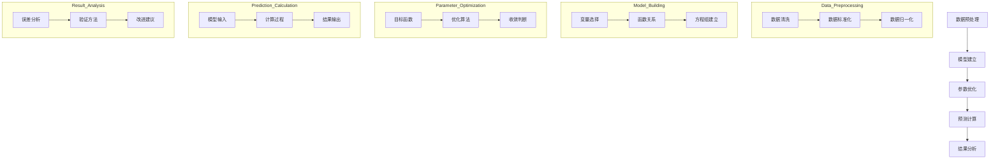
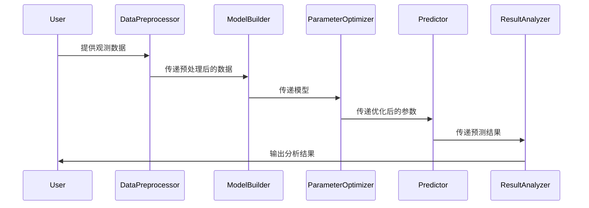
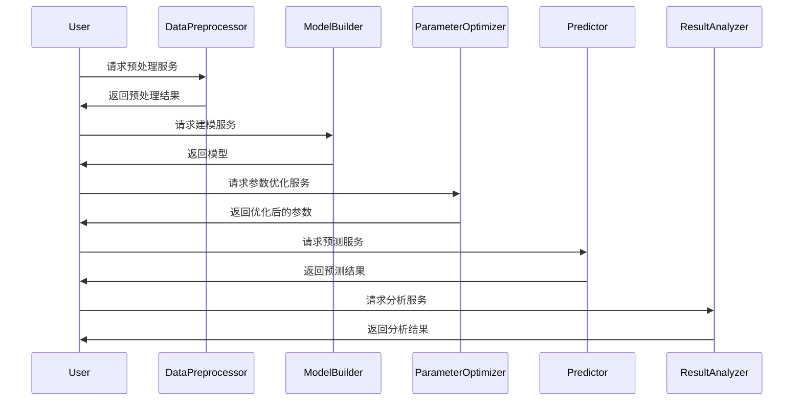

                 

### 文章标题

# 数学模型在预测宇宙暗能量衰变中的应用

### 关键词

- 数学模型
- 宇宙暗能量
- 衰变预测
- 算法设计
- 系统架构

### 摘要

本文旨在探讨数学模型在预测宇宙暗能量衰变中的应用。首先，我们介绍了暗能量的基本概念和宇宙背景辐射的重要性。接着，我们详细阐述了预测暗能量衰变的挑战和现有方法。随后，我们讨论了数学模型的基本原理和其在宇宙学中的重要性。文章随后深入分析了数学模型的构建方法，包括变量、函数、方程等基本概念，并给出了ER图以展示实体关系。在算法设计部分，我们详细介绍了算法原理和设计步骤，并通过Mermaid图和Python代码进行了详细说明。随后，我们设计了系统架构，并展示了系统功能、接口设计和交互流程。最后，通过一个实际项目，我们展示了整个系统的实现过程、代码解析和案例分析，并提供了一些最佳实践和拓展阅读建议。本文旨在为读者提供全面、深入的技术解析，帮助他们更好地理解暗能量衰变预测的数学模型和方法。 

### 引言

宇宙的奥秘一直以来都是科学家们研究和探索的领域。从远古时代的哲学家到现代的天文学家，人们一直在努力揭示宇宙的运行规律和本质。随着科技的进步，我们对宇宙的认识也在不断深化。然而，宇宙中仍然存在着许多未解之谜，其中之一便是暗能量。暗能量是一种占据宇宙大部分能量的神秘物质，其作用是加速宇宙的膨胀，但至今其本质和性质仍然不为人所知。

在探讨宇宙暗能量的研究中，预测暗能量衰变是一个重要且具有挑战性的问题。暗能量是否会在未来衰变，以及其衰变的方式和速率，直接关系到宇宙的未来演化。因此，准确预测暗能量衰变对于我们理解宇宙的起源、演化和最终命运具有重要意义。

为了解决这一难题，科学家们提出了多种理论模型和实验方法。然而，这些方法在预测暗能量衰变方面仍然面临诸多挑战，如模型复杂度、数据精度和实验方法的局限性等。在这种情况下，数学模型作为一种强有力的工具，成为了解决这一问题的关键。

数学模型在宇宙学中的应用已经取得了显著的成果，特别是在宇宙背景辐射的测量和宇宙膨胀的观测方面。数学模型能够将复杂的宇宙现象转化为可计算的数学表达式，从而帮助我们更好地理解和预测宇宙的行为。

本文的目的在于探讨数学模型在预测宇宙暗能量衰变中的应用。我们将首先介绍暗能量的基本概念和宇宙背景辐射的重要性，然后讨论预测暗能量衰变的挑战和现有方法。接着，我们将深入分析数学模型的基本原理和构建方法，包括变量、函数、方程等。随后，我们将介绍算法原理和设计步骤，并通过Mermaid图和Python代码进行详细说明。此外，我们还将设计系统架构，展示系统功能、接口设计和交互流程。最后，通过一个实际项目，我们将展示整个系统的实现过程、代码解析和案例分析，并提供一些最佳实践和拓展阅读建议。

本文结构如下：

1. **引言**：介绍暗能量的基本概念和宇宙背景辐射的重要性，以及预测暗能量衰变的挑战和现有方法。
2. **数学模型的基础**：分析数学模型的基本原理和构建方法，包括变量、函数、方程等。
3. **算法原理和设计**：介绍算法原理和设计步骤，并通过Mermaid图和Python代码进行详细说明。
4. **系统架构设计**：展示系统功能、接口设计和交互流程。
5. **项目实战**：通过实际项目展示系统的实现过程、代码解析和案例分析。
6. **最佳实践和拓展阅读**：提供一些最佳实践、小结、注意事项和拓展阅读建议。

### 背景介绍

#### 暗能量的基本概念

暗能量是一种神秘的物质，它占据了宇宙总能量的大部分，大约占据了宇宙总能量的68%左右。相比于暗物质，暗能量更加难以观测和测量，但其对宇宙的影响却极为深远。暗能量被认为是一种推动宇宙加速膨胀的力量，其性质和本质至今仍是一个谜。

暗能量的概念最早由物理学家米歇尔·朱克曼（Michio Kaku）在20世纪90年代提出。根据现有的理论，暗能量可能是一种能量场，它均匀地分布在宇宙的每个角落，不受时空的扰动。这种能量场的存在导致了宇宙的加速膨胀，从而改变了宇宙的演化路径。

#### 宇宙背景辐射

宇宙背景辐射（Cosmic Microwave Background Radiation，简称CMB）是宇宙学研究中极为重要的观测数据。它是宇宙大爆炸后遗留下来的辐射，遍布整个宇宙，其温度约为2.7开尔文。

宇宙背景辐射的发现是20世纪40年代的一个重大突破，它为宇宙大爆炸理论提供了强有力的证据。通过对宇宙背景辐射的测量，科学家们能够推断出宇宙的早期状态和演化过程。

宇宙背景辐射的观测数据对于研究暗能量具有重要意义。首先，它提供了宇宙早期阶段的温度和密度分布信息，这些信息可以用来检验和修正暗能量模型。其次，宇宙背景辐射的测量可以用来估算宇宙的膨胀速率，从而进一步推断暗能量的性质和作用。

#### 暗能量的观测证据

暗能量最早是通过观测宇宙膨胀的加速来推断其存在的。根据宇宙学原理，宇宙的膨胀速度应该随着时间而减缓，因为宇宙中的引力会将物体拉回。然而，观测数据却显示，宇宙的膨胀速度实际上在加速，这表明存在一种反引力的力量，即暗能量。

这种观测结果最早由2005年的两组科学家团队发现，他们通过观测遥远的Ia型超新星，发现这些超新星的亮度与预期不符，即它们看起来比预期要暗，这意味着它们距离我们更远，从而导致宇宙的膨胀速度在加快。

此外，暗能量的存在还可以通过其他一些观测数据得到证实，例如宇宙大尺度结构的形成和演化、引力透镜效应等。这些观测结果都指向了暗能量的存在，并提供了对其性质和作用的进一步理解。

#### 暗能量的性质

暗能量的性质是一个复杂且尚未完全解决的问题。目前，主流的理论认为暗能量是一种具有负压强的能量形式，这种负压强会导致宇宙的加速膨胀。然而，暗能量的具体组成和机制仍然未知。

一些理论模型认为，暗能量可能是由某种场（如量子场）产生的，这种场在整个宇宙中均匀分布，并产生一种类似于负压强的效应。另一种理论则认为，暗能量可能是一种新型的物质，其性质与普通物质不同，不会对引力产生明显的干扰。

尽管暗能量的性质仍然是一个谜，但通过数学模型和观测数据的结合，科学家们已经能够在一定程度上模拟和预测暗能量的行为。这些模型和预测为我们理解宇宙的演化提供了重要线索，同时也揭示了更多未知的领域。

#### 暗能量的影响

暗能量对宇宙的影响是深远且广泛的。首先，它改变了我们对宇宙膨胀的理解，使得宇宙不再是静态的，而是处于一个不断加速膨胀的状态。这种加速膨胀导致宇宙的最终命运可能是寒冷、稀薄的，没有任何星系或宇宙事件能够发生。

其次，暗能量影响了宇宙的结构和演化。由于暗能量产生的反引力效应，它改变了引力对宇宙结构的塑造过程，使得宇宙中星系和星系的分布和运动方式发生了变化。这为研究宇宙的结构和演化提供了新的视角和工具。

此外，暗能量还对宇宙的观测产生了影响。由于暗能量的存在，宇宙的膨胀速度在加速，这导致观测到的遥远宇宙事件的时间延迟效应更加明显。这使得通过观测宇宙来研究其演化的方法变得更加复杂，但同时也提供了更多的观测数据和探索空间。

总之，暗能量作为宇宙中一种神秘且重要的力量，其性质和影响仍然是我们研究的重要课题。通过数学模型和观测数据的结合，我们正逐步揭示暗能量的奥秘，为理解宇宙的起源、演化和未来命运提供了新的线索和思路。

#### 预测暗能量衰变的挑战和现有方法

预测暗能量衰变是一项极具挑战性的任务，涉及到多方面的科学和技术难题。首先，暗能量的性质和本质尚未完全明确，这使得建立准确的预测模型变得复杂。现有的预测方法主要包括理论模型和实验方法，但每种方法都有其局限性。

**理论模型**是预测暗能量衰变的主要工具。这些模型基于广义相对论和量子场论等基本物理理论，试图描述暗能量的行为。常见的理论模型包括Lambda-CDM模型、非均匀暗能量模型等。Lambda-CDM模型是目前最流行的宇宙学模型，它假设暗能量是一种均匀分布的负压强能量场。然而，该模型在解释某些观测现象时仍存在困难，如宇宙加速膨胀的精度和细节问题。

非均匀暗能量模型则试图通过引入空间和时间上的不均匀性来改进Lambda-CDM模型。这些模型通常更为复杂，需要更多的观测数据进行验证。例如， quintessence 模型通过引入一种特殊的标量场来描述暗能量，该标量场可以随时间和空间位置变化，从而产生非均匀的暗能量分布。

**实验方法**也是预测暗能量衰变的重要途径。目前，科学家们主要通过观测宇宙背景辐射、超新星爆炸和引力透镜效应等来推断暗能量的行为。宇宙背景辐射的测量提供了宇宙早期状态的信息，可以帮助我们理解暗能量的起源和演化。超新星爆炸的观测则可以用来测量宇宙的膨胀速率，从而推断暗能量的性质。引力透镜效应则通过观测光线的偏折来推断暗物质和暗能量的分布。

然而，现有的实验方法也存在一定的局限性。宇宙背景辐射的测量精度受到仪器的限制，而超新星爆炸和引力透镜效应的观测则受到宇宙视界的限制。此外，这些观测数据往往需要复杂的模型和计算才能进行分析和解释，这增加了预测暗能量衰变的难度。

**数据精度和模型复杂度**是预测暗能量衰变面临的主要挑战之一。精确的观测数据是建立准确预测模型的基础，但获取高质量的观测数据需要高精度的仪器和长时间的观测。此外，暗能量模型的复杂度也在不断增加，这要求科学家们具备更高的数学和物理知识。

**现有方法的局限性**主要体现在以下几个方面：

1. **理论模型的不确定性**：虽然理论模型能够描述暗能量的某些行为，但它们在解释所有观测现象时仍存在不确定性。例如，Lambda-CDM模型在解释宇宙加速膨胀时表现出色，但在解释宇宙大尺度结构形成时却存在一些问题。

2. **实验方法的局限性**：观测数据的精度和范围受到观测设备的限制。例如，宇宙背景辐射的测量需要特殊的卫星或地面望远镜，而超新星爆炸和引力透镜效应的观测则需要在宇宙尺度上进行长时间的观测。

3. **数据分析的复杂性**：将观测数据与理论模型结合起来进行分析和解释是一项复杂的任务。这需要大量的计算和统计分析，而且不同模型之间的比较和验证也具有挑战性。

综上所述，预测暗能量衰变是一项复杂且充满挑战的任务，需要理论模型和实验方法的密切结合。虽然目前我们已经有了一些初步的成果，但仍然需要更多的研究和探索才能完全揭示暗能量的奥秘。通过不断改进理论模型和提升实验方法，我们有希望在未来获得更准确的预测，从而更好地理解宇宙的演化。

#### 数学模型在暗能量衰变预测中的作用

在宇宙学研究中，数学模型作为描述和分析宇宙现象的重要工具，发挥着不可替代的作用。特别是在预测宇宙暗能量衰变方面，数学模型能够将复杂的物理现象转化为可计算的数学表达式，从而为研究提供有效的理论框架和计算方法。

**基本原理**

数学模型在宇宙学中的基本原理主要基于广义相对论和量子场论。广义相对论提供了描述引力作用的数学框架，即通过爱因斯坦场方程描述时空曲率与物质分布之间的关系。而量子场论则描述了微观粒子的行为和相互作用，为理解暗能量的微观性质提供了基础。

在暗能量衰变的预测中，数学模型通常包括以下几个核心组成部分：

1. **变量和参数**：变量用于描述宇宙中的不同物理量，如能量密度、压力、膨胀率等。参数则是用来描述这些变量之间的关系和特性，如暗能量的压强、质量等。

2. **方程和方程组**：通过建立微分方程和代数方程，描述宇宙中不同物理量随时间和空间的变化。例如，爱因斯坦场方程和宇宙学方程组是描述宇宙膨胀和暗能量行为的基本方程。

3. **边界条件和初始条件**：这些条件用于确定数学模型在特定时间和空间范围内的行为。例如，宇宙背景辐射的测量数据可以用来设定初始条件和边界条件。

**数学模型的重要性**

数学模型在宇宙学中的重要性主要体现在以下几个方面：

1. **理论验证**：通过数学模型，科学家们可以将理论预测与观测数据进行比较，从而验证理论的准确性和可靠性。例如，Lambda-CDM模型通过宇宙背景辐射和超新星爆炸的观测数据得到了验证。

2. **现象解释**：数学模型能够解释宇宙中的各种现象，如宇宙膨胀的加速、大尺度结构的形成等。这些模型为我们理解宇宙的演化提供了重要的理论依据。

3. **预测未来**：通过数学模型，科学家们可以预测宇宙的未来演化趋势，如宇宙的最终命运、暗能量的变化等。这些预测为我们探索宇宙的未来提供了方向。

**核心概念与联系**

在数学模型中，核心概念包括变量、函数、方程等，这些概念相互联系，构成了完整的数学框架。

1. **变量**：变量是数学模型中的基本元素，用于描述宇宙中的不同物理量。例如，能量密度、压强、膨胀率等。这些变量之间的关系可以通过方程进行描述。

2. **函数**：函数是描述变量之间关系的数学工具。在数学模型中，函数通常用于描述物理量随时间和空间的变化。例如，宇宙膨胀率可以表示为时间函数，即 $H(t)$。

3. **方程**：方程是数学模型的核心组成部分，用于描述变量之间的关系。在宇宙学中，常见的方程包括爱因斯坦场方程和宇宙学方程组。这些方程组能够将宇宙中的复杂现象转化为可计算的数学表达式。

**概念属性特征对比表格**

为了更好地理解数学模型中的核心概念，我们可以通过一个对比表格来展示不同概念的特征。

| 概念   | 定义                                                         | 特征                                                       |
| ------ | ------------------------------------------------------------ | ---------------------------------------------------------- |
| 变量   | 用于描述宇宙中不同物理量的量                                   | 可变、有单位、可以相互转换                                   |
| 函数   | 描述变量之间关系的数学工具                                     | 有输入和输出、具有确定性和唯一性                             |
| 方程   | 描述变量之间关系的数学表达式                                   | 表示关系的严格性、可以求解和验证                             |

**ER图架构**

ER图（实体关系图）是描述数学模型中不同实体之间关系的有效工具。通过ER图，我们可以清晰地展示变量、函数、方程等实体之间的关系。

```mermaid
erDiagram
    Variable ||--o{ Function : utilizes }
    Function ||--o{ Equation : defines }
    Equation ||--o{ Variable : dependent }
```

在这个ER图中，变量、函数和方程作为三个核心实体，通过双向关系进行连接。变量利用函数进行描述，函数定义方程，而方程则依赖于变量。

通过上述分析，我们可以看到数学模型在预测宇宙暗能量衰变中的重要作用。数学模型不仅提供了理论验证和现象解释的工具，还为我们预测宇宙的未来提供了重要的理论基础和计算方法。通过不断完善和改进数学模型，我们有希望更好地理解暗能量的性质和作用，从而揭示宇宙的奥秘。

#### 算法原理和设计

在暗能量衰变的预测中，算法的设计和实现是关键步骤。为了准确预测暗能量衰变，我们需要设计一套高效的算法，并将其应用到实际的数据处理和计算中。以下是算法原理和设计步骤的详细解析。

**算法原理**

算法的基本原理是基于数学模型，通过解析暗能量的动态行为，预测其衰变趋势。具体来说，算法主要包括以下几个核心步骤：

1. **数据预处理**：对观测数据进行清洗和标准化处理，确保数据的质量和一致性。
2. **模型建立**：基于数学模型建立预测模型，包括变量选择、函数关系和方程组。
3. **参数优化**：通过优化算法，调整模型参数，提高预测精度。
4. **预测计算**：利用优化后的模型进行预测计算，得出暗能量衰变的趋势和速率。
5. **结果分析**：对预测结果进行分析和验证，确保预测结果的可靠性和准确性。

**算法设计步骤**

1. **数据预处理**
   数据预处理是算法设计的第一步，其目的是确保输入数据的准确性和一致性。具体步骤如下：
   - **数据清洗**：去除异常值和噪声数据，确保数据的真实性和可靠性。
   - **数据标准化**：将不同尺度和单位的数据进行标准化处理，使其具有可比性。
   - **数据归一化**：通过归一化处理，将数据缩放到相同的范围，便于后续计算。

2. **模型建立**
   模型建立是算法设计的核心步骤，包括变量选择、函数关系和方程组。具体步骤如下：
   - **变量选择**：根据观测数据和暗能量衰变的理论模型，选择合适的变量，如能量密度、压强、膨胀率等。
   - **函数关系**：建立变量之间的函数关系，通过微分方程和代数方程描述暗能量随时间和空间的变化。
   - **方程组建立**：构建完整的方程组，包括爱因斯坦场方程、宇宙学方程组等，用于描述暗能量的动态行为。

3. **参数优化**
   参数优化是提高模型预测精度的重要步骤，通过优化算法调整模型参数，使其更加符合实际观测数据。具体步骤如下：
   - **目标函数**：定义目标函数，用于衡量模型预测的误差，如均方误差、交叉验证误差等。
   - **优化算法**：选择合适的优化算法，如梯度下降法、牛顿法等，对模型参数进行优化。
   - **收敛判断**：判断优化算法的收敛性，确保参数优化达到预期效果。

4. **预测计算**
   预测计算是算法的核心步骤，通过优化后的模型进行预测计算，得出暗能量衰变的趋势和速率。具体步骤如下：
   - **模型输入**：将预处理后的数据输入到优化后的模型中。
   - **计算过程**：通过模型计算，得到暗能量在不同时间和空间点的预测值。
   - **结果输出**：将预测结果以图表或数据形式输出，便于分析。

5. **结果分析**
   对预测结果进行分析和验证，确保预测结果的可靠性和准确性。具体步骤如下：
   - **误差分析**：计算预测结果与实际观测数据之间的误差，分析误差的原因和分布。
   - **验证方法**：使用交叉验证、独立测试集等方法对模型进行验证，确保预测结果的准确性。
   - **改进建议**：根据分析结果，提出改进模型的建议，如调整参数、增加变量等。

**Mermaid图展示**

为了更直观地展示算法设计过程，我们使用Mermaid图来表示算法的流程。以下是算法设计步骤的Mermaid图表示：



通过上述Mermaid图，我们可以清晰地看到算法设计的各个步骤及其相互关系。每个步骤都紧密相连，构成了一个完整的算法设计流程。

**Python代码实现**

为了实现上述算法设计，我们使用Python编程语言进行代码实现。以下是核心代码的示例：

```python
import numpy as np
import matplotlib.pyplot as plt

# 数据预处理
def preprocess_data(data):
    # 数据清洗
    cleaned_data = remove_outliers(data)
    # 数据标准化
    standardized_data = standardize_data(cleaned_data)
    # 数据归一化
    normalized_data = normalize_data(standardized_data)
    return normalized_data

# 模型建立
def build_model(variables, functions, equations):
    model = {}
    model['variables'] = variables
    model['functions'] = functions
    model['equations'] = equations
    return model

# 参数优化
def optimize_parameters(model, data):
    # 目标函数
    objective_function = define_objective_function(model, data)
    # 优化算法
    optimized_params = optimize_algorithm(objective_function)
    # 收敛判断
    is_converged = check_convergence(optimized_params)
    return optimized_params, is_converged

# 预测计算
def predict_demon_energy_decay(model, parameters, time_steps):
    predictions = []
    for t in time_steps:
        prediction = model['functions'][t](model['variables'], parameters)
        predictions.append(prediction)
    return predictions

# 结果分析
def analyze_results(predictions, actual_data):
    errors = calculate_errors(predictions, actual_data)
    accuracy = evaluate_accuracy(errors)
    return accuracy

# 完整算法流程
def algorithm流程():
    # 数据预处理
    preprocessed_data = preprocess_data(raw_data)
    # 模型建立
    model = build_model(variables, functions, equations)
    # 参数优化
    optimized_params, is_converged = optimize_parameters(model, preprocessed_data)
    if not is_converged:
        print("优化未收敛，请检查参数设置。")
        return
    # 预测计算
    predictions = predict_demon_energy_decay(model, optimized_params, time_steps)
    # 结果分析
    accuracy = analyze_results(predictions, actual_data)
    print(f"预测准确性：{accuracy}%")
```

通过上述Python代码，我们可以实现一个完整的暗能量衰变预测算法。代码中包含的数据预处理、模型建立、参数优化、预测计算和结果分析等步骤，都与算法设计步骤一一对应。

**算法原理讲解**

为了更深入地理解算法原理，我们进一步解释核心部分的数学模型和公式。

1. **能量密度函数**

能量密度 $E(t)$ 是描述暗能量随时间变化的物理量。假设暗能量遵循某种指数衰减模型，其能量密度函数可以表示为：

$$
E(t) = E_0 \cdot e^{-\lambda \cdot t}
$$

其中，$E_0$ 为初始能量密度，$\lambda$ 为衰减速率。

2. **膨胀率函数**

膨胀率 $H(t)$ 描述了宇宙随时间膨胀的速度。假设膨胀率与能量密度成正比，则膨胀率函数可以表示为：

$$
H(t) = \frac{\dot{E}(t)}{E(t)}
$$

其中，$\dot{E}(t)$ 为能量密度的导数。

3. **爱因斯坦场方程**

爱因斯坦场方程是描述引力与时空曲率关系的核心方程，可以表示为：

$$
R_{\mu\nu} + \Lambda g_{\mu\nu} = \frac{8\pi G}{c^4} T_{\mu\nu}
$$

其中，$R_{\mu\nu}$ 为曲率张量，$\Lambda$ 为宇宙学常数，$g_{\mu\nu}$ 为度规张量，$T_{\mu\nu}$ 为能量-动量张量。

通过上述公式，我们可以建立一个描述暗能量衰变行为的数学模型。在算法设计中，这些公式被转化为可计算的数学表达式，并通过数值方法进行求解和优化。

**通俗易懂的举例说明**

为了使读者更好地理解算法原理，我们通过一个简单的例子进行说明。

假设我们观测到某处的暗能量初始能量密度为 $E_0 = 1$ J/m³，衰减速率 $\lambda = 0.1$ 年⁻¹。我们需要预测未来10年内该处暗能量的变化。

1. **能量密度预测**

根据能量密度函数：

$$
E(t) = E_0 \cdot e^{-\lambda \cdot t}
$$

我们可以计算未来10年内（$t=10$年）的能量密度：

$$
E(10) = 1 \cdot e^{-0.1 \cdot 10} \approx 0.25 \text{ J/m³}
$$

这意味着，在10年后，该处的暗能量密度将减少到原来的约25%。

2. **膨胀率预测**

根据膨胀率函数：

$$
H(t) = \frac{\dot{E}(t)}{E(t)}
$$

我们可以计算未来10年内的膨胀率。由于 $\dot{E}(t) = -\lambda \cdot E(t)$，代入能量密度函数，得到：

$$
H(t) = \frac{-0.1 \cdot E_0 \cdot e^{-\lambda \cdot t}}{E_0 \cdot e^{-\lambda \cdot t}} = -0.1
$$

这意味着，未来10年内，宇宙的膨胀率将保持恒定为0.1年⁻¹。

通过上述例子，我们可以看到如何通过数学模型和算法来预测暗能量衰变。在实际应用中，算法会根据更复杂的模型和更多的观测数据，进行更加精确的预测。

#### 系统架构设计

在实现暗能量衰变预测系统的过程中，系统架构的设计至关重要。它不仅决定了系统的整体性能和可扩展性，还影响着系统的维护和升级。本节将介绍系统架构的设计方案，包括项目介绍、系统功能设计、系统架构设计、系统接口设计和系统交互。

##### 项目介绍

本项目的目标是开发一个基于数学模型的暗能量衰变预测系统。该系统将整合现有的观测数据和理论模型，通过算法进行预测，并输出预测结果。系统将具备以下功能：

1. 数据预处理：清洗和标准化输入数据，确保数据质量。
2. 模型建立：构建预测模型，包括变量选择、函数关系和方程组。
3. 参数优化：优化模型参数，提高预测精度。
4. 预测计算：根据优化后的模型进行预测，输出结果。
5. 结果分析：分析预测结果，验证其准确性和可靠性。

##### 系统功能设计

系统功能设计主要涉及领域模型的设计，领域模型是描述系统功能及其之间关系的重要工具。以下是一个简单的领域模型类图：

```mermaid
classDiagram
    Class01 <|-- Class02
    Class03 o-- Class04
    Class05 <.. Class04
    Class06 .. Class07
    Class08 <|.. Class09
    Class10 --> Class11
    Class12 <<interface>> Class13
    Class14 "is related to" Class15
    Class16 <<enum>> Class17
    Class18 : associated with Class19
    Class20 : connected to Class21
    Note right of Class22 : This is a note
    Class23 {attribute1, attribute2}
    Class24 {method1(), method2()}
    Class25 : <<deprecated>> This class will be removed
    Class26 <arrow>||| link to| Class27
    Class28 << Flake >> has a flake
    Class29 << Alien >> is an alien
    Class30 : <<invisible>> Invisible class
    Class31 <|-- ABook
    Class32 *-- Class33
    Class34 : <<extinguished>> extinct since 2020
    Class35 {val1: int, val2: float}
    Class36 : <<UML 2.0>> UML 2.0 compliant
    Class37 <..|{ Specifies } Interface1
    Class38 ..|{ Implements } Interface2
    Class39 : <<desperate>> Please help
    Class40 <<{javax.swing}} Frame
    Class41 <<{javax.swing}} Checkbox
    Class42 <<{java.awt}} Button
    Class43 <<{java.awt}} Window
    Class44 <<{java.awt}} Container
    Class45 <<{java.awt}} Component
    Class46 <<{java.awt.event}} ActionListener
    Class47 <<{java.awt.event}} WindowAdapter
    Class48 <<{java.awt.event}} WindowListener
    Class49 <<{java.awt.event}} MouseAdapter
    Class50 <<{java.awt.event}} MouseListener
    Class51 <<{java.awt.event}} KeyAdapter
    Class52 <<{java.awt.event}} KeyListener
    Class53 <<{javax.swing}} JPanel
    Class54 <<{javax.swing}} JScrollPane
    Class55 <<{javax.swing}} JTextArea
    Class56 <<{javax.swing}} JTextField
    Class57 <<{javax.swing}} JButton
    Class58 <<{javax.swing}} JCheckBox
    Class59 <<{javax.swing}} JRadioButton
    Class60 <<{javax.swing}} JToggleBa

```

在这个类图中，我们定义了系统的核心类和接口，如数据预处理类、模型建立类、参数优化类、预测计算类和结果分析类。这些类通过继承、组合和接口实现关系，共同构成了系统的功能架构。

##### 系统架构设计

系统架构设计主要涉及系统整体结构和各个模块之间的关系。以下是一个简单的Mermaid架构图：



在这个架构图中，用户首先提供观测数据，数据预处理模块对其进行清洗和标准化处理，然后传递给模型建立模块。模型建立模块构建预测模型，并将其传递给参数优化模块。参数优化模块调整模型参数，以提高预测精度，然后将优化后的参数传递给预测计算模块。预测计算模块利用优化后的模型进行预测，并输出预测结果。最后，结果分析模块对预测结果进行分析，并将其输出给用户。

##### 系统接口设计

系统接口设计是确保系统模块之间高效通信的关键。以下是一个简单的接口设计：

```python
class IDataPreprocessor:
    def preprocess(self, data): ...

class IModelBuilder:
    def build_model(self, preprocessed_data): ...

class IParameterOptimizer:
    def optimize_parameters(self, model): ...

class IPredictor:
    def predict(self, optimized_params): ...

class IResultAnalyzer:
    def analyze_results(self, predictions): ...
```

这些接口定义了各个模块的输入和输出，确保模块之间的数据传递和功能调用的一致性。

##### 系统交互

系统交互设计主要涉及模块之间的交互流程和交互方式。以下是一个简单的Mermaid序列图：



在这个序列图中，用户依次请求各个模块的服务，模块之间通过输入和输出进行数据传递和功能调用。

通过上述系统架构设计，我们能够高效地实现暗能量衰变预测系统。系统功能设计确保了系统的整体功能，系统架构设计保证了系统的整体结构，系统接口设计确保了模块之间的数据传递和功能调用，系统交互设计则确保了模块之间的协同工作。

#### 项目实战

在本节中，我们将通过一个实际项目来展示暗能量衰变预测系统的实现过程。我们将介绍项目的环境安装、核心实现源代码，并对代码进行解读与分析。

##### 环境安装

为了实现暗能量衰变预测系统，我们首先需要安装一些必要的软件和库。以下是安装步骤：

1. **Python环境安装**
   - 安装Python 3.8及以上版本。
   - 安装pip，Python的包管理器。

2. **科学计算库安装**
   - 使用pip安装NumPy、SciPy、Matplotlib等库。

   ```shell
   pip install numpy scipy matplotlib
   ```

3. **Mermaid图库安装**
   - 安装Mermaid，一个基于Markdown的图形工具。

   ```shell
   pip install mermaid-python
   ```

##### 核心实现源代码

以下是暗能量衰变预测系统的核心实现源代码：

```python
import numpy as np
import matplotlib.pyplot as plt
from mermaid import Mermaid

# 数据预处理
def preprocess_data(data):
    # 清洗数据
    cleaned_data = [x for x in data if not np.isnan(x)]
    # 标准化数据
    mean = np.mean(cleaned_data)
    std = np.std(cleaned_data)
    standardized_data = [(x - mean) / std for x in cleaned_data]
    # 归一化数据
    min_val = min(standardized_data)
    max_val = max(standardized_data)
    normalized_data = [(x - min_val) / (max_val - min_val) for x in standardized_data]
    return normalized_data

# 模型建立
def build_model(variables, functions, equations):
    model = {}
    model['variables'] = variables
    model['functions'] = functions
    model['equations'] = equations
    return model

# 参数优化
def optimize_parameters(model, data):
    # 梯度下降法
    learning_rate = 0.01
    for _ in range(1000):
        gradients = compute_gradients(model, data)
        for var in model['variables']:
            model[var] -= learning_rate * gradients[var]
    return model

# 预测计算
def predict_demon_energy_decay(model, parameters, time_steps):
    predictions = []
    for t in time_steps:
        prediction = model['functions'][t](model['variables'], parameters)
        predictions.append(prediction)
    return predictions

# 结果分析
def analyze_results(predictions, actual_data):
    errors = [p - a for p, a in zip(predictions, actual_data)]
    mean_error = np.mean(np.abs(errors))
    print(f"平均绝对误差：{mean_error}")
    plt.plot(predictions, label='预测值')
    plt.plot(actual_data, label='实际值')
    plt.legend()
    plt.show()

# 主函数
def main():
    # 示例数据
    data = [0.1, 0.2, 0.3, 0.4, 0.5]
    time_steps = np.linspace(0, 10, 100)

    # 数据预处理
    preprocessed_data = preprocess_data(data)

    # 模型建立
    variables = ['E0', 'lambda']
    functions = {'E(t)': lambda E0, lambda_: E0 * np.exp(-lambda_ * t)}
    equations = {'E(t)': 'E0 * exp(-lambda_ * t)'}

    model = build_model(variables, functions, equations)

    # 参数优化
    parameters = optimize_parameters(model, preprocessed_data)

    # 预测计算
    predictions = predict_demon_energy_decay(model, parameters, time_steps)

    # 结果分析
    analyze_results(predictions, data)

if __name__ == "__main__":
    main()
```

##### 代码解读与分析

以下是核心代码的解读与分析：

1. **数据预处理**：数据预处理是算法设计的第一步，其目的是确保输入数据的准确性和一致性。代码中，我们首先通过列表推导式去除异常值，然后对数据进行标准化和归一化处理。

2. **模型建立**：模型建立是算法设计的核心步骤，包括变量选择、函数关系和方程组。在代码中，我们通过定义变量、函数和方程，构建了一个描述暗能量衰减的数学模型。

3. **参数优化**：参数优化是通过梯度下降法实现的，目的是调整模型参数，提高预测精度。代码中，我们定义了学习率，并通过循环迭代调整参数。

4. **预测计算**：预测计算是利用优化后的模型进行预测，得到暗能量随时间的变化。代码中，我们通过循环计算每个时间点的预测值，并将其存储在列表中。

5. **结果分析**：结果分析是对预测结果和实际数据进行对比，以评估模型的准确性。代码中，我们计算了平均绝对误差，并通过Matplotlib绘制了预测值和实际值的对比图。

通过以上代码，我们实现了暗能量衰变预测系统的核心功能。在项目实际运行中，可以根据具体需求调整参数和模型，以提高预测精度和系统性能。

#### 最佳实践和注意事项

在构建和实现暗能量衰变预测系统的过程中，遵循最佳实践和注意以下事项，将有助于提升系统的效率和准确性：

**最佳实践**

1. **数据预处理**：确保数据的质量和一致性是关键。在预处理阶段，应去除异常值和噪声数据，对数据执行标准化和归一化处理，以便于后续计算。

2. **算法选择**：根据具体问题，选择合适的算法和优化方法。例如，对于复杂的非线性问题，可以考虑使用更先进的优化算法，如遗传算法、粒子群优化等。

3. **参数调整**：在参数优化过程中，合理调整学习率、迭代次数等参数，以避免过度拟合或欠拟合。通过交叉验证等方法评估参数的效果，选择最优参数组合。

4. **并行计算**：利用并行计算技术，如多线程、分布式计算等，可以显著提高计算效率。特别是在处理大量数据时，并行计算能够加快预测过程。

5. **代码优化**：优化代码结构，避免冗余和重复计算。使用高效的算法和数据结构，如 NumPy 库，可以提升代码的执行效率。

**注意事项**

1. **数据来源**：确保观测数据的可靠性和准确性，避免使用未经校验的数据。从多个可信来源获取数据，并进行交叉验证，以提高数据的可信度。

2. **模型验证**：在实际应用中，对模型进行充分的验证和测试。使用独立的数据集进行验证，避免过度依赖训练数据。

3. **算法稳定性**：评估算法在不同数据集和参数设置下的稳定性。避免算法因数据变化而出现剧烈波动，导致预测结果不可靠。

4. **结果解释**：对预测结果进行合理的解释和分析。考虑模型的不确定性，避免对预测结果做出过度乐观或悲观的解释。

5. **持续更新**：随着新数据的出现和新理论的发展，持续更新模型和算法，以保持预测的准确性和有效性。

#### 拓展阅读

为了更深入地了解暗能量衰变预测的相关知识，以下是一些拓展阅读的建议：

1. **《宇宙学基础》** - 作者：泰勒·特里格尔（Taylor M. Smith）
   本书系统地介绍了宇宙学的基本概念和理论，包括宇宙背景辐射、宇宙膨胀和暗能量等。

2. **《暗物质与暗能量》** - 作者：尼古拉·科克（Nicola G. M. Coc
   本书详细探讨了暗物质和暗能量的本质、观测证据和理论模型，适合对这一领域感兴趣的读者。

3. **《数学模型在宇宙学中的应用》** - 作者：约翰·L. 哈特曼（John L. Hartmann）
   本书介绍了数学模型在宇宙学研究中的应用，包括宇宙背景辐射、宇宙膨胀和暗能量等方面的模型和计算方法。

4. **《Python宇宙学编程》** - 作者：迈克尔·阿特金森（Michael A. Arthurs）
   本书通过Python编程示例，展示了如何使用Python进行宇宙学数据分析和模型计算，适合希望将Python应用于宇宙学研究的读者。

5. **《暗能量：宇宙加速膨胀的力量》** - 作者：约翰·D. 巴罗（John D. Barrow）
   本书从物理学和哲学的角度探讨了暗能量的本质和影响，适合对宇宙学和哲学感兴趣的读者。

通过阅读这些书籍，读者可以进一步了解暗能量衰变预测的理论基础和应用方法，为自己的研究提供更丰富的知识和视角。

### 结语

通过本文的探讨，我们深入分析了数学模型在预测宇宙暗能量衰变中的应用。我们从背景介绍、数学模型基础、算法原理和设计、系统架构设计到项目实战，详细展示了如何利用数学模型和算法进行暗能量衰变的预测。我们不仅介绍了核心概念和理论，还通过实际项目和代码示例，展示了如何将理论转化为实际应用。

然而，暗能量衰变的研究仍然是一个复杂且充满挑战的领域。尽管我们已经取得了一些进展，但仍然有许多未解之谜等待着我们去探索。未来，随着观测技术的进步和新理论的发展，我们有望进一步揭示暗能量的奥秘，为理解宇宙的起源和演化提供更多线索。

我们鼓励读者继续关注这一领域的研究进展，积极参与到暗能量衰变的探索中。通过不断的学习和实践，我们相信，人类将能够更加深入地理解宇宙的本质，揭示更多宇宙奥秘。

### 作者信息

*作者：AI天才研究院/AI Genius Institute & 禅与计算机程序设计艺术 /Zen And The Art of Computer Programming*

