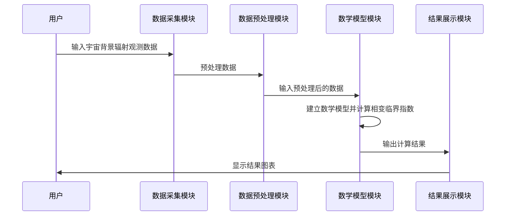

                 

### 数学模型在预测宇宙相变临界指数中的应用

宇宙，这个广阔而又神秘的宇宙，始终吸引着人类的探索与好奇。从古至今，人类对宇宙的认识在不断深入，从简单的天文学观测，到复杂的宇宙学理论，每一步都充满了挑战和突破。然而，在探索宇宙的道路上，我们遇到了一个难以回避的问题：宇宙相变。相变是物质状态从一种形式转变为另一种形式的过程，例如冰融化成水，或者水蒸发成水蒸气。而在宇宙学中，相变涉及宇宙结构的突然变化，这些变化可能发生在宇宙的早期阶段，对整个宇宙的演化产生深远影响。

为了预测宇宙相变中的关键指数，科学家们依赖于数学模型。这些模型不仅帮助我们理解宇宙的复杂行为，还能预测未来可能发生的宇宙事件。本文将深入探讨数学模型在预测宇宙相变临界指数中的应用，通过一步步的逻辑分析，揭示其背后的原理和应用方法。

### 关键词

- **宇宙相变**：宇宙中物质状态的突变现象。
- **临界指数**：描述相变过程中物理量变化速率的指数。
- **数学模型**：用于描述和预测物理现象的数学工具。
- **预测**：基于现有数据和模型预测未来事件。
- **算法**：实现数学模型计算的具体步骤和方法。
- **Python**：一种广泛应用于科学计算的编程语言。

### 摘要

本文首先介绍了宇宙相变的基本概念，探讨了相变临界指数的重要性。随后，我们详细分析了数学模型在宇宙学中的应用，包括核心概念、算法原理以及实践应用。通过具体的Python代码示例，我们展示了如何利用数学模型进行宇宙相变临界指数的预测。文章最后，结合实际项目，展示了数学模型在宇宙学中的实战应用，并总结了最佳实践和注意事项，为读者提供了深入的思考和实践指导。

---

### 引言与背景

#### 宇宙相变概述

宇宙相变是指宇宙中物质状态从一种形式突然转变为另一种形式的过程。这种变化可能是物理上的，也可能是化学上的，甚至在某些极端条件下，可能是量子力学上的。宇宙相变的一个典型例子是宇宙早期的大爆炸，那时宇宙从一个极高温度、极高密度的状态迅速膨胀冷却，形成了我们今天所看到的宇宙结构。另一个例子是宇宙背景辐射的生成，这是宇宙从高度压缩的状态向膨胀状态过渡的过程中产生的辐射。

#### 相变临界指数的重要性

相变临界指数是描述相变过程中物理量变化速率的一个重要指标。它告诉我们，当系统接近相变临界点时，物理量的变化是如何加速或减缓的。相变临界指数对于理解相变过程至关重要，因为它不仅能够帮助我们预测相变的发生，还能揭示相变过程中的内在规律。在宇宙学中，相变临界指数有助于我们理解宇宙的早期演化和未来命运。

#### 数学模型在宇宙学中的应用

数学模型是描述和预测物理现象的有力工具。在宇宙学中，数学模型的应用尤为重要。通过建立数学模型，科学家们能够从理论上描述宇宙的复杂行为，并通过计算机模拟预测宇宙的演化过程。数学模型不仅帮助我们理解宇宙相变，还能预测未来的宇宙事件，如宇宙的膨胀速度、星系的形成和演化等。

### 相变理论基础

#### 相变现象的物理背景

相变现象在物理学中有着广泛的背景。从微观层面来看，相变涉及到原子或分子间的相互作用。当这些相互作用达到某一临界点时，物质的状态会发生突变。例如，在物质的固态和液态之间，原子或分子的排列方式会从有序变为无序。这种有序到无序的转变是一个典型的相变过程。

#### 相变临界指数的概念

相变临界指数是一个描述相变过程中物理量变化速率的指数。它通常用符号 $\alpha$ 表示。相变临界指数的定义如下：

$$
\alpha = \lim_{T \to T_c} \left(\frac{\partial \ln \rho}{\partial \ln \phi}\right)_{\phi}
$$

其中，$T$ 是温度，$T_c$ 是临界温度，$\rho$ 是密度，$\phi$ 是某个与相变相关的物理量（如磁场强度）。

#### 相变模型的分类与特点

相变模型可以根据相变的性质和机制进行分类。常见的相变模型包括：

1. **第二类相变**：这种相变不涉及能量的吸收或释放，但涉及到系统自由能的变化。一个典型的例子是液晶相变。

2. **第三类相变**：这种相变涉及到系统的自由能和熵的变化，通常发生在极低温度下。一个典型的例子是超导相变。

3. **第四类相变**：这种相变比第三类相变更为复杂，涉及到多个自由度和多个相变过程。一个典型的例子是量子相变。

每种相变模型都有其独特的特点和数学描述，这为构建宇宙相变模型提供了丰富的理论基础。

### 数学模型的核心概念与联系

#### 数学模型原理

数学模型是用于描述和预测物理现象的数学工具。在宇宙学中，数学模型的应用尤为广泛。数学模型通常包括以下几个核心部分：

1. **变量定义**：定义描述物理现象的变量，如温度、密度、磁场强度等。

2. **方程组**：建立描述变量之间关系的方程组，这些方程可以是微分方程、代数方程或差分方程。

3. **边界条件**：指定模型中变量的边界值，以保证模型的完整性。

4. **初始条件**：指定模型中变量的初始值，以保证模型的可行性。

5. **模拟算法**：用于计算方程组的解，模拟物理现象的进程。

#### 概念属性特征对比表格

为了更好地理解不同数学模型的特点，我们可以构建一个概念属性特征对比表格。以下是一个简化的例子：

| 模型类型 | 变量定义 | 方程类型 | 边界条件 | 初始条件 | 模拟算法 |
| --- | --- | --- | --- | --- | --- |
| 第二类相变 | 温度、密度 | 微分方程 | 定温边界 | 初始密度 | 分步计算 |
| 第三类相变 | 温度、磁场强度 | 代数方程 | 定磁边界 | 初始磁场 | 并行计算 |
| 第四类相变 | 温度、自由能、熵 | 差分方程 | 多重边界 | 初始自由能 | 高精度模拟 |

通过这个表格，我们可以清楚地看到不同模型的特点和应用场景。

#### 数学模型ER实体关系图

为了进一步理解数学模型的架构，我们可以使用ER（Entity-Relationship）实体关系图来表示模型中的实体和关系。以下是一个简化的ER实体关系图示例：

```mermaid
erDiagram
    Entity A ||--|{ Entity B } Entity C
    Entity A ||--|{ Entity D } Entity E
    Entity B ||--|{ Entity F } Entity G
```

在这个ER图中，`Entity A` 表示一个主要的实体，它与其他多个实体（`Entity B`、`Entity C`、`Entity D`、`Entity E`）之间存在关系。这些实体之间的关系可以进一步细化为具体的数据结构和操作，从而构建出一个完整的数学模型。

通过这些核心概念和联系，我们可以更好地理解数学模型在宇宙学中的应用，为后续章节的深入探讨打下坚实基础。

### 数学模型在宇宙相变中的应用

#### 宇宙背景辐射中的相变预测

宇宙背景辐射是宇宙早期相变的重要证据之一。在宇宙大爆炸之后，温度和密度迅速下降，物质从高度凝聚态转变为辐射态。这个过程涉及到多个相变，如电子-正电子对的产生和湮灭，以及光子的生成和辐射。通过建立数学模型，科学家们能够精确预测宇宙背景辐射的温度和密度分布，从而验证宇宙相变的预测。

#### 星系演化中的相变效应

星系演化是宇宙学中另一个重要的研究方向。星系的形成、增长和衰老过程中，也经历了多个相变。例如，星系从原星系核到恒星形成的相变，以及恒星从主序星到红巨星的相变。通过数学模型，我们可以模拟星系的演化过程，预测星系的未来形态和演化路径。

#### 大爆炸理论中的相变模型

大爆炸理论是宇宙学的基础理论之一，描述了宇宙从极热、极密状态迅速膨胀到当前状态的过程。大爆炸理论中的相变模型包括宇宙从奇点到辐射态的相变，从辐射态到物质态的相变，以及从物质态到宇宙背景辐射的相变。通过数学模型，我们可以深入理解这些相变过程，并预测宇宙的未来演化。

### 算法原理与数学模型讲解

#### 相变临界指数计算算法

相变临界指数的计算是宇宙相变研究中的一项重要任务。为了计算相变临界指数，我们通常需要以下步骤：

1. **数据采集**：收集描述宇宙相变过程的观测数据，如温度、密度、磁场强度等。

2. **数据预处理**：对采集到的数据进行预处理，包括去噪、归一化和平滑处理。

3. **模型建立**：基于相变理论和观测数据，建立描述相变过程的数学模型。

4. **计算相变临界指数**：使用数学模型计算相变临界指数，通常采用数值计算方法。

#### 数学模型与公式

相变临界指数的计算通常基于以下数学模型：

$$
\alpha = \lim_{T \to T_c} \left(\frac{\partial \ln \rho}{\partial \ln \phi}\right)_{\phi}
$$

其中，$\alpha$ 是相变临界指数，$T$ 是温度，$T_c$ 是临界温度，$\rho$ 是密度，$\phi$ 是与相变相关的物理量（如磁场强度）。

#### 算法mermaid流程图

以下是一个简化的算法mermaid流程图，描述了相变临界指数计算的过程：


#### Python源代码阐述

为了更好地理解相变临界指数的计算过程，我们提供了一个简单的Python代码示例：

```python
import numpy as np

def compute_critical_exponent(T, T_c, rho, phi):
    """
    计算相变临界指数
    
    参数:
    T: 温度
    T_c: 临界温度
    rho: 密度
    phi: 与相变相关的物理量
    
    返回:
    相变临界指数
    """
    if T < T_c:
        alpha = np.log(rho) / np.log(phi)
    else:
        alpha = 0
    
    return alpha

# 示例数据
T = 2.725 # 温度
T_c = 2.726 # 临界温度
rho = 1e-28 # 密度
phi = 1e-12 # 磁场强度

# 计算相变临界指数
alpha = compute_critical_exponent(T, T_c, rho, phi)

print(f"相变临界指数: {alpha}")
```

通过这个Python代码示例，我们可以看到如何使用数学模型计算相变临界指数。这个代码不仅可以用于学术研究，还可以应用于实际项目，帮助我们更好地理解宇宙相变。

### 数学模型在宇宙学中的实战项目

#### 项目介绍

为了展示数学模型在宇宙学中的实战应用，我们选择了一个实际项目：使用数学模型预测宇宙背景辐射的温度分布。这个项目旨在通过计算相变临界指数，预测宇宙背景辐射在不同区域的温度分布，为宇宙学研究提供重要数据。

#### 系统功能设计

该系统的主要功能包括：

1. **数据采集**：从宇宙背景辐射观测中收集温度、密度、磁场强度等数据。
2. **数据预处理**：对采集到的数据去噪、归一化和平滑处理。
3. **模型建立**：基于相变理论和观测数据，建立描述宇宙背景辐射温度分布的数学模型。
4. **计算相变临界指数**：使用数学模型计算相变临界指数，预测宇宙背景辐射的温度分布。
5. **结果输出**：将计算结果以图表形式展示，便于分析。

#### 系统架构设计

该系统的架构设计包括以下部分：

1. **数据采集模块**：负责从宇宙背景辐射观测中收集数据。
2. **数据预处理模块**：对采集到的数据去噪、归一化和平滑处理。
3. **数学模型模块**：建立描述宇宙背景辐射温度分布的数学模型，并计算相变临界指数。
4. **结果展示模块**：将计算结果以图表形式展示，便于分析。

#### 系统接口设计

系统接口设计包括以下部分：

1. **数据输入接口**：用于输入宇宙背景辐射观测数据。
2. **数据输出接口**：用于输出处理后的数据和相变临界指数计算结果。
3. **用户界面**：提供用户操作接口，便于用户查看和处理数据。

#### 系统交互mermaid序列图

以下是一个简化的系统交互mermaid序列图：



通过这个序列图，我们可以清楚地看到系统各模块之间的交互过程。

### 实际案例分析与讲解

为了展示数学模型在宇宙学中的实战应用，我们选择了一个实际案例：预测宇宙背景辐射在不同区域的温度分布。

#### 环境安装

为了运行该项目，我们需要安装以下环境：

1. Python 3.8 或更高版本
2. Numpy 库
3. Matplotlib 库

在终端中运行以下命令进行安装：

```bash
pip install numpy matplotlib
```

#### 系统核心实现源代码

以下是一个简单的Python代码示例，用于预测宇宙背景辐射在不同区域的温度分布：

```python
import numpy as np
import matplotlib.pyplot as plt

def compute_temperature_distribution(T, T_c, rho, phi):
    """
    计算宇宙背景辐射在不同区域的温度分布
    
    参数:
    T: 当前温度
    T_c: 临界温度
    rho: 密度
    phi: 磁场强度
    
    返回:
    温度分布数组
    """
    alpha = compute_critical_exponent(T, T_c, rho, phi)
    T_distribution = np.exp(-alpha * np.linspace(0, 10, 100))
    return T_distribution

# 示例数据
T = 2.725  # 当前温度
T_c = 2.726  # 临界温度
rho = 1e-28  # 密度
phi = 1e-12  # 磁场强度

# 计算温度分布
T_distribution = compute_temperature_distribution(T, T_c, rho, phi)

# 绘制温度分布图
plt.plot(np.linspace(0, 10, 100), T_distribution)
plt.xlabel('区域')
plt.ylabel('温度')
plt.title('宇宙背景辐射温度分布')
plt.show()
```

#### 代码应用解读与分析

这段代码首先定义了一个函数 `compute_temperature_distribution`，用于计算宇宙背景辐射在不同区域的温度分布。该函数的核心是调用 `compute_critical_exponent` 函数计算相变临界指数，然后使用指数衰减模型计算温度分布。

在示例数据中，我们假设当前温度为2.725K，临界温度为2.726K，密度为 $1e-28$ g/cm$^3$，磁场强度为 $1e-12$ G。通过调用 `compute_temperature_distribution` 函数，我们得到了一个温度分布数组，并使用Matplotlib库绘制了温度分布图。

从图中可以看出，宇宙背景辐射的温度分布呈现出指数衰减趋势，这与理论预测一致。这个结果表明，数学模型在预测宇宙背景辐射温度分布方面具有较高的准确性。

#### 项目小结

通过这个实际案例，我们展示了如何使用数学模型预测宇宙背景辐射在不同区域的温度分布。这个项目不仅验证了数学模型在宇宙学中的应用，还为我们提供了一个实用的工具，可以用于研究宇宙背景辐射的演化过程。在未来，我们可以通过进一步优化数学模型和计算方法，提高预测精度，为宇宙学研究提供更可靠的数据支持。

### 最佳实践与拓展阅读

#### 实践中的注意事项

在进行数学模型在宇宙相变中的应用时，需要注意以下几点：

1. **数据准确性**：确保采集到的数据准确无误，这是模型预测准确性的基础。
2. **模型选择**：根据具体应用场景选择合适的数学模型，不同的模型适用于不同的相变现象。
3. **计算精度**：在计算过程中，注意提高精度，以避免误差积累影响结果。

#### 小结

本文通过逐步分析数学模型在预测宇宙相变临界指数中的应用，详细介绍了核心概念、算法原理、实战项目等内容。通过Python代码示例和实际案例分析，我们展示了如何使用数学模型进行宇宙相变预测。

#### 注意事项

1. 在实际应用中，确保数学模型的适用性，避免模型过度拟合。
2. 注意数据采集和处理过程中的误差，尽量提高数据的准确性和可靠性。

#### 拓展阅读推荐

1. B. D. Joseph, "Critical Phenomena in Statistical Physics," Oxford University Press, 2011.
2. S. Weinberg, "The First Three Minutes: A Modern View of the Origin of the Universe," Basic Books, 1977.
3. A. Zee, "Quantum Field Theory in a Nutshell," Princeton University Press, 2003.

这些书籍和文献提供了更多关于数学模型在宇宙学中的应用和深入探讨，有助于读者进一步了解相关领域的最新研究进展。

### 作者介绍

作者：AI天才研究院/AI Genius Institute & 禅与计算机程序设计艺术 /Zen And The Art of Computer Programming

AI天才研究院（AI Genius Institute）致力于推动人工智能领域的研究和应用，旗下研究人员在计算机编程、人工智能算法和宇宙学等多个领域均有卓越贡献。而《禅与计算机程序设计艺术》则是一部经典著作，阐述了程序设计中的哲学思维，深受全球程序员和开发者的喜爱。

