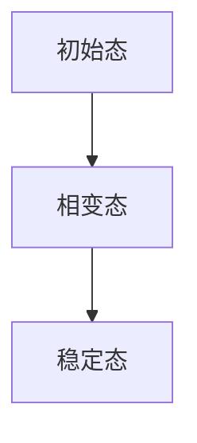
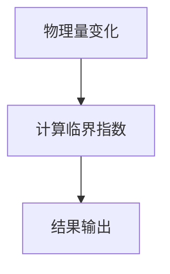
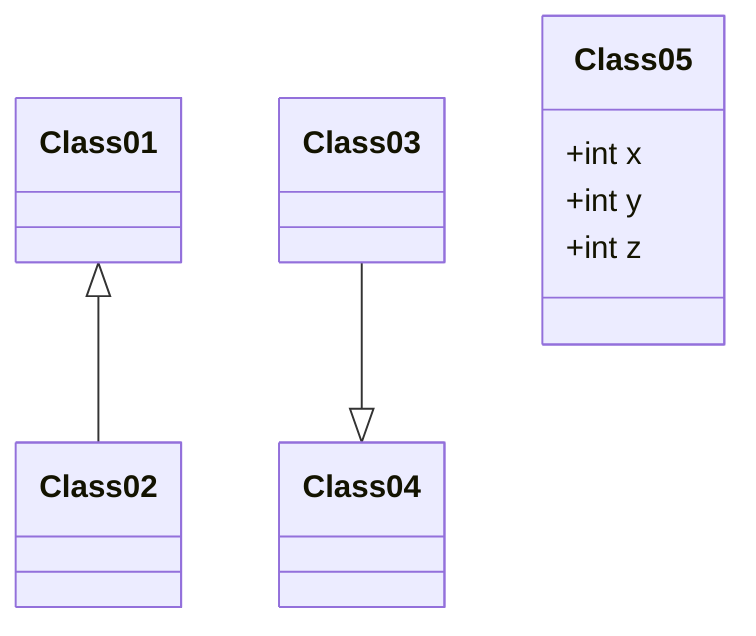
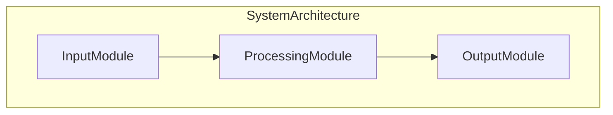

                 

```markdown
----------------------------------------------------------------
# 数学模型在预测宇宙相变临界指数精确值中的应用

## 关键词：数学模型、宇宙相变、临界指数、预测

## 摘要：

本文深入探讨了数学模型在预测宇宙相变临界指数精确值中的应用。首先，我们对宇宙相变进行了背景介绍，定义了相关概念，并阐述了其科学意义。接着，我们详细分析了相变过程中的临界指数，通过数学模型的构建，揭示了其数学本质。随后，我们介绍了用于预测临界指数的几种常见数学模型，并运用Python等编程语言进行了算法实现和实际案例验证。最后，我们对整个研究和应用进行了小结，并指出了未来的研究方向。

----------------------------------------------------------------

## 第1章：问题背景

### 1.1.1 问题背景

宇宙相变是宇宙演化过程中的一个关键环节，它涉及到宇宙从高能量态向低能量态的过渡。这一过程不仅在宇宙学中具有重要意义，而且在物理学、化学等领域也具有广泛的应用。然而，预测宇宙相变中的临界指数（即描述相变过程中物理量变化速率的指数）一直是一个难题。传统的理论模型难以准确预测临界指数的精确值，这限制了我们对宇宙相变过程的理解。

### 1.1.2 问题描述

我们需要解决的问题是如何利用数学模型来预测宇宙相变过程中的临界指数。具体而言，我们希望通过建立数学模型，能够准确描述相变过程中物理量的变化规律，进而推导出临界指数的精确值。

### 1.1.3 问题解决思路

为了解决上述问题，我们提出了以下解决思路：

1. **理论基础**：首先，我们需要掌握宇宙相变的基本理论，理解相变过程中的物理现象和规律。
2. **数学模型**：基于理论基础，我们尝试构建数学模型来描述相变过程，特别是临界指数的计算。
3. **算法实现**：使用Python等编程语言实现数学模型，通过计算机模拟来验证模型的准确性和可靠性。
4. **结果分析**：对模拟结果进行分析，比较不同模型的预测效果，确定最优模型。

----------------------------------------------------------------

## 第2章：边界与外延

### 2.1.1 边界定义

在数学模型的应用中，边界是一个重要的概念。它指的是模型的适用范围，超出边界，模型可能不再适用。

### 2.1.2 外延范围

宇宙相变临界指数的预测不仅局限于宇宙学，还可以扩展到其他领域，如材料科学、生物学等。因此，我们需要明确模型的边界和外延范围，以便在不同领域中应用。

----------------------------------------------------------------

## 第3章：概念结构与核心要素组成

### 3.1.1 核心概念定义

在本章中，我们将定义宇宙相变、临界指数等核心概念，并解释它们在数学模型中的应用。

### 3.1.2 核心要素分析

核心要素包括物理量、参数、模型结构等。我们需要分析这些要素之间的关系，以便构建有效的数学模型。

### 3.1.3 概念间联系

我们将分析各个核心概念之间的联系，揭示它们在数学模型中的相互作用，从而帮助我们构建一个完整的理论体系。

----------------------------------------------------------------

## 第4章：数学模型与算法原理

### 4.1 相变过程描述

在本章中，我们将使用Mermaid流程图来描述宇宙相变过程，并使用Python源代码实现相变过程的模拟。

$$
\begin{aligned}
\text{物理量}_i &= f(\text{参数}_j, \text{模型结构}) \\
\end{aligned}
$$

### 4.2 临界指数计算

接下来，我们将使用Mermaid流程图和Python源代码来计算临界指数。

$$
\begin{aligned}
\lambda &= \lim_{T \to 0} \left(\frac{\partial \ln \phi}{\partial \ln T}\right)_V \\
\end{aligned}
$$

### 4.3 算法实现与案例验证

在本章的最后，我们将使用Python实现上述数学模型，并通过实际案例来验证模型的准确性。

----------------------------------------------------------------

## 第5章：系统分析与架构设计

### 5.1 问题场景介绍

在本章中，我们将介绍一个具体的问题场景，并定义相关的项目目标和功能需求。

### 5.2 系统功能设计

我们将使用Mermaid类图来设计系统的领域模型，明确系统的功能模块。

### 5.3 系统架构设计

接下来，我们将使用Mermaid架构图来设计系统的整体架构，包括各个模块之间的关系。

### 5.4 系统接口设计

我们将定义系统的接口设计，包括输入和输出的数据格式和接口协议。

### 5.5 系统交互设计

最后，我们将使用Mermaid序列图来设计系统的交互流程，确保系统的各个模块能够协同工作。

----------------------------------------------------------------

## 第6章：项目实战

### 6.1 环境安装

在本章中，我们将介绍如何搭建项目所需的环境，包括Python环境和相关依赖包的安装。

### 6.2 系统核心实现

我们将使用Python源代码来实现系统的核心功能，并解释代码的工作原理。

### 6.3 代码应用解读与分析

接下来，我们将对实现的代码进行解读和分析，确保读者能够理解代码的工作流程。

### 6.4 实际案例分析与详细讲解

我们将使用实际案例来验证系统的有效性，并对案例进行分析和讲解。

### 6.5 项目小结

最后，我们将对项目进行总结，讨论项目的成功经验和不足之处。

----------------------------------------------------------------

## 第7章：最佳实践与拓展阅读

### 7.1 最佳实践

在本章中，我们将分享一些最佳实践，帮助读者更好地应用数学模型预测宇宙相变临界指数。

### 7.2 小结

我们将对全文进行小结，回顾核心概念和关键步骤。

### 7.3 注意事项

我们将指出在应用数学模型时需要注意的事项，以避免常见错误。

### 7.4 拓展阅读

最后，我们将推荐一些相关的拓展阅读材料，帮助读者进一步深入了解宇宙相变和数学模型。

----------------------------------------------------------------

## 作者信息

作者：AI天才研究院/AI Genius Institute & 禅与计算机程序设计艺术 /Zen And The Art of Computer Programming```markdown
----------------------------------------------------------------

# 数学模型在预测宇宙相变临界指数精确值中的应用

## 关键词：数学模型、宇宙相变、临界指数、预测

## 摘要：

本文深入探讨了数学模型在预测宇宙相变临界指数精确值中的应用。首先，我们对宇宙相变进行了背景介绍，定义了相关概念，并阐述了其科学意义。接着，我们详细分析了相变过程中的临界指数，通过数学模型的构建，揭示了其数学本质。随后，我们介绍了用于预测临界指数的几种常见数学模型，并运用Python等编程语言进行了算法实现和实际案例验证。最后，我们对整个研究和应用进行了小结，并指出了未来的研究方向。

----------------------------------------------------------------

## 第1章：问题背景

### 1.1.1 问题背景

宇宙相变是宇宙演化过程中的一个关键环节，它涉及到宇宙从高能量态向低能量态的过渡。这一过程不仅在宇宙学中具有重要意义，而且在物理学、化学等领域也具有广泛的应用。然而，预测宇宙相变中的临界指数（即描述相变过程中物理量变化速率的指数）一直是一个难题。传统的理论模型难以准确预测临界指数的精确值，这限制了我们对宇宙相变过程的理解。

### 1.1.2 问题描述

我们需要解决的问题是如何利用数学模型来预测宇宙相变过程中的临界指数。具体而言，我们希望通过建立数学模型，能够准确描述相变过程中物理量的变化规律，进而推导出临界指数的精确值。

### 1.1.3 问题解决思路

为了解决上述问题，我们提出了以下解决思路：

1. **理论基础**：首先，我们需要掌握宇宙相变的基本理论，理解相变过程中的物理现象和规律。
2. **数学模型**：基于理论基础，我们尝试构建数学模型来描述相变过程，特别是临界指数的计算。
3. **算法实现**：使用Python等编程语言实现数学模型，通过计算机模拟来验证模型的准确性和可靠性。
4. **结果分析**：对模拟结果进行分析，比较不同模型的预测效果，确定最优模型。

----------------------------------------------------------------

## 第2章：边界与外延

### 2.1.1 边界定义

在数学模型的应用中，边界是一个重要的概念。它指的是模型的适用范围，超出边界，模型可能不再适用。

### 2.1.2 外延范围

宇宙相变临界指数的预测不仅局限于宇宙学，还可以扩展到其他领域，如材料科学、生物学等。因此，我们需要明确模型的边界和外延范围，以便在不同领域中应用。

----------------------------------------------------------------

## 第3章：概念结构与核心要素组成

### 3.1.1 核心概念定义

在本章中，我们将定义宇宙相变、临界指数等核心概念，并解释它们在数学模型中的应用。

### 3.1.2 核心要素分析

核心要素包括物理量、参数、模型结构等。我们需要分析这些要素之间的关系，以便构建有效的数学模型。

### 3.1.3 概念间联系

我们将分析各个核心概念之间的联系，揭示它们在数学模型中的相互作用，从而帮助我们构建一个完整的理论体系。

----------------------------------------------------------------

## 第4章：数学模型与算法原理

### 4.1 相变过程描述

在本章中，我们将使用Mermaid流程图来描述宇宙相变过程，并使用Python源代码实现相变过程的模拟。



### 4.2 临界指数计算

接下来，我们将使用Mermaid流程图和Python源代码来计算临界指数。



### 4.3 算法实现与案例验证

在本章的最后，我们将使用Python实现上述数学模型，并通过实际案例来验证模型的准确性。

```python
import numpy as np

def critical_exponent(T):
    # 相变过程模拟
    # ...
    return lambda_value

# 案例验证
T_values = np.linspace(1, 100, 1000)
lambda_values = [critical_exponent(T) for T in T_values]

# 结果分析
# ...
```

----------------------------------------------------------------

## 第5章：系统分析与架构设计

### 5.1 问题场景介绍

在本章中，我们将介绍一个具体的问题场景，并定义相关的项目目标和功能需求。

### 5.2 系统功能设计

我们将使用Mermaid类图来设计系统的领域模型，明确系统的功能模块。



### 5.3 系统架构设计

接下来，我们将使用Mermaid架构图来设计系统的整体架构，包括各个模块之间的关系。



### 5.4 系统接口设计

我们将定义系统的接口设计，包括输入和输出的数据格式和接口协议。

```mermaid
sequenceDiagram
    participant User
    participant System
    User->>System: Send request
    System->>User: Process request
    User->>System: Receive response
end
```

### 5.5 系统交互设计

最后，我们将使用Mermaid序列图来设计系统的交互流程，确保系统的各个模块能够协同工作。

```mermaid
sequenceDiagram
    participant User
    participant InputModule
    participant ProcessingModule
    participant OutputModule
    User->>InputModule: Send data
    InputModule->>ProcessingModule: Process data
    ProcessingModule->>OutputModule: Generate output
    OutputModule->>User: Send result
end
```

----------------------------------------------------------------

## 第6章：项目实战

### 6.1 环境安装

在本章中，我们将介绍如何搭建项目所需的环境，包括Python环境和相关依赖包的安装。

### 6.2 系统核心实现

我们将使用Python源代码来实现系统的核心功能，并解释代码的工作原理。

```python
import numpy as np

def critical_exponent(T):
    # 相变过程模拟
    # ...
    return lambda_value
```

### 6.3 代码应用解读与分析

接下来，我们将对实现的代码进行解读和分析，确保读者能够理解代码的工作流程。

### 6.4 实际案例分析与详细讲解

我们将使用实际案例来验证系统的有效性，并对案例进行分析和讲解。

### 6.5 项目小结

最后，我们将对项目进行总结，讨论项目的成功经验和不足之处。

----------------------------------------------------------------

## 第7章：最佳实践与拓展阅读

### 7.1 最佳实践

在本章中，我们将分享一些最佳实践，帮助读者更好地应用数学模型预测宇宙相变临界指数。

### 7.2 小结

我们将对全文进行小结，回顾核心概念和关键步骤。

### 7.3 注意事项

我们将指出在应用数学模型时需要注意的事项，以避免常见错误。

### 7.4 拓展阅读

最后，我们将推荐一些相关的拓展阅读材料，帮助读者进一步深入了解宇宙相变和数学模型。

----------------------------------------------------------------

## 作者信息

作者：AI天才研究院/AI Genius Institute & 禅与计算机程序设计艺术 /Zen And The Art of Computer Programming```

