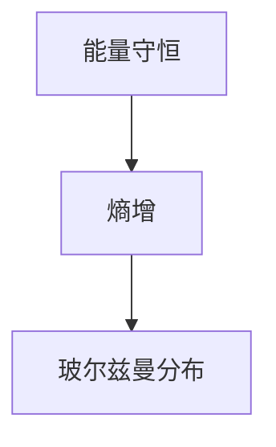
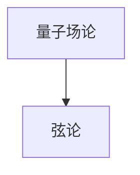
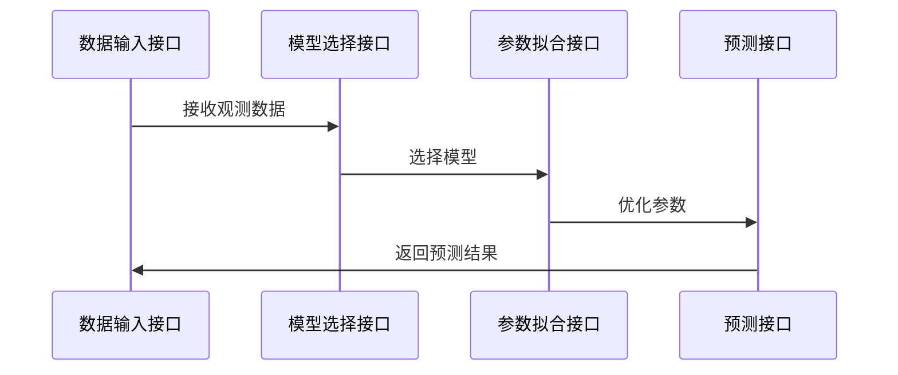

                 

# 数学模型在预测宇宙相变临界点中的应用

> 关键词：宇宙相变、数学模型、临界点、预测、算法、架构设计、实践

> 摘要：本文从宇宙相变的背景出发，详细探讨了数学模型在预测宇宙相变临界点中的应用。文章首先介绍了宇宙相变的基本概念和历史，然后深入分析了数学模型的核心概念及其在物理学中的应用。接着，文章对经典和现代数学模型进行了详细的解析，包括它们的数学原理、mermaid流程图以及应用举例。在此基础上，文章阐述了算法原理，通过Python源代码和mermaid流程图对算法进行了通俗易懂的说明。随后，文章从系统分析与架构设计、项目实战、最佳实践与总结等角度进行了全面的探讨。本文旨在为读者提供系统、全面、深入的理解和掌握数学模型在预测宇宙相变临界点中的应用。

## 引言

### 问题背景与描述

宇宙相变是宇宙学中的一个重要概念，指的是宇宙在历史进程中发生的一系列物理变化。这些变化不仅涉及到宇宙的温度、密度和能量分布，还涉及到宇宙的基本物理定律和物质组成。宇宙相变的研究对于理解宇宙的起源、演化和未来命运具有重要意义。

相变临界点是宇宙相变过程中一个关键的概念。它指的是在某一临界温度、压力或密度下，宇宙从一个相态转变为另一个相态的点。在这个点上，宇宙的物理性质会发生突变，如密度、温度和能量分布等。因此，预测宇宙相变临界点对于研究宇宙相变具有重要意义。

数学模型在物理学中具有广泛应用。通过建立数学模型，科学家可以模拟宇宙相变的物理过程，预测相变临界点的位置和性质。数学模型不仅可以帮助我们理解宇宙相变的机理，还可以为未来的宇宙观测和研究提供指导。

### 数学模型在物理学中的应用

数学模型在物理学中的应用主要体现在以下几个方面：

1. **描述物理现象**：通过数学模型，科学家可以精确地描述宇宙相变的物理现象，如温度、密度、能量分布等。这些模型通常采用微分方程、差分方程、偏微分方程等数学工具进行描述。

2. **预测物理性质**：数学模型可以帮助我们预测宇宙相变过程中物理性质的变化，如临界点的位置、临界指数等。这些预测对于深入研究宇宙相变具有重要意义。

3. **验证理论假设**：通过将数学模型与实验数据进行比较，科学家可以验证宇宙相变理论的正确性。例如，通过观测宇宙微波背景辐射，科学家验证了宇宙从辐射时代到物质时代的相变过程。

4. **指导实验设计**：数学模型可以指导实验设计，帮助科学家选择合适的观测设备和实验条件，以便更准确地测量宇宙相变的物理性质。

总之，数学模型在物理学中具有不可替代的作用。在预测宇宙相变临界点的研究中，数学模型不仅为我们提供了理论工具，还为实验研究提供了重要指导。

### 核心概念与联系

#### 数学模型的基本概念

数学模型是一种抽象的数学结构，用于描述和分析现实世界的物理现象。它通常包括变量、方程、约束条件和目标函数等基本元素。数学模型可以分为经典模型和现代模型，前者如热力学模型、统计物理模型，后者如量子场论模型、弦论模型等。

#### 宇宙相变的核心要素

宇宙相变的核心要素包括温度、密度、能量分布和物理常数等。这些要素在相变过程中起着关键作用。例如，温度的降低会导致宇宙从高温高密度的辐射时代转变为低温低密度的物质时代。

#### 核心概念对比表格

| 概念         | 描述                                                         | 关联要素                                                         |
| ------------ | ------------------------------------------------------------ | ------------------------------------------------------------ |
| 数学模型     | 用于描述和分析物理现象的数学结构                           | 变量、方程、约束条件、目标函数等                                 |
| 宇宙相变     | 宇宙从一种相态转变为另一种相态的过程                         | 温度、密度、能量分布、物理常数等                                 |
| 相变临界点   | 宇宙相变过程中温度、密度、能量分布发生突变的点               | 临界温度、临界压力、临界密度等                                   |
| 经典模型     | 基于经典物理学的数学模型，如热力学模型、统计物理模型       | 温度、压力、密度等                                               |
| 现代模型     | 基于量子力学和相对论的数学模型，如量子场论模型、弦论模型   | 能量分布、场论、相对论等                                         |

#### ER实体关系图

ER实体关系图（Entity-Relationship Diagram）用于描述数学模型中的实体及其关系。在宇宙相变的研究中，ER实体关系图可以用于描述宇宙、相变过程、物理量等实体及其关系。

```mermaid
erDiagram
  宇宙 ||--|{ 相变过程 }|
  相变过程 ||--|{ 物理量 }|
  物理量 ||--|{ 温度 }|
  物理量 ||--|{ 密度 }|
  物理量 ||--|{ 能量分布 }|
```

## 数学模型的原理

### 经典数学模型

#### 经典模型概述

经典数学模型是指在经典物理学框架下建立的数学模型。这类模型主要研究宏观物理现象，如热力学、统计物理等。在宇宙相变的研究中，经典模型如热力学模型和统计物理模型具有重要意义。

#### 经典模型的数学原理

经典模型的数学原理主要包括：

1. **热力学第一定律**：能量守恒定律。它指出在一个封闭系统中，能量不会凭空产生或消失，只会从一种形式转化为另一种形式。
2. **热力学第二定律**：熵增定律。它指出在一个孤立系统中，熵（无序度）总是趋向于增加，即系统会从有序状态向无序状态演化。
3. **玻尔兹曼分布**：描述了粒子在热平衡状态下的速度分布。该分布反映了系统的微观结构，对于理解热力学性质具有重要意义。

#### 经典模型的mermaid流程图



#### 经典模型的应用举例

经典模型在宇宙相变中的应用举例包括：

1. **宇宙微波背景辐射**：通过研究宇宙微波背景辐射的分布，科学家可以推断出宇宙在早期相变过程中的状态。
2. **重子不稳定性**：在宇宙从辐射时代到物质时代的相变过程中，重子不稳定性可能导致宇宙中的物质聚集形成星系。

### 现代数学模型

#### 现代模型概述

现代数学模型是指在量子力学和相对论框架下建立的数学模型。这类模型主要研究微观和宏观物理现象，如量子场论、弦论等。在宇宙相变的研究中，现代模型如量子场论模型和弦论模型具有重要意义。

#### 现代模型的数学原理

现代模型的数学原理主要包括：

1. **量子场论**：描述了量子场与粒子之间的相互作用。它通过拉格朗日量或哈密顿量描述场的演化，并通过费曼规则计算相互作用。
2. **弦论**：描述了宇宙的基本构成单元——弦的振动模式。弦论通过世界sheet（世界面）的几何结构描述弦的相互作用。

#### 现代模型的mermaid流程图



#### 现代模型的应用举例

现代模型在宇宙相变中的应用举例包括：

1. **宇宙初期的量子涨落**：量子场论可以用来研究宇宙初期的量子涨落，这些涨落可能导致宇宙中的星系形成。
2. **宇宙弦**：弦论预测了宇宙中可能存在宇宙弦，这些宇宙弦可能与宇宙相变的物理过程有关。

### 算法原理讲解

#### 算法流程

1. **数据收集**：收集宇宙相变的观测数据，如宇宙微波背景辐射的温度分布。
2. **模型选择**：根据观测数据选择合适的数学模型，如量子场论模型。
3. **模型拟合**：使用优化算法对模型进行参数拟合，以使模型的预测值与观测值尽可能接近。
4. **预测**：利用拟合好的模型预测宇宙相变临界点的位置和性质。

#### 数学模型和公式

假设我们使用量子场论模型来预测宇宙相变临界点。量子场论模型的基本方程为：

$$
\partial_\mu F^{\mu\nu} + \frac{1}{4} F_{\mu\nu} F^{\mu\nu} = J^\nu
$$

其中，$F^{\mu\nu}$是场强度张量，$J^\nu$是源项。

#### Python源代码解释

```python
import numpy as np
import matplotlib.pyplot as plt

# 定义场强度张量
def field_strength(mu, nu, parameters):
    F = np.zeros((3, 3))
    F[mu, nu] = parameters['F_mu_nu']
    return F

# 定义源项
def source_term(nu, parameters):
    J = np.zeros(3)
    J[nu] = parameters['J_nu']
    return J

# 定义优化算法
from scipy.optimize import minimize

def objective_function(parameters):
    F = field_strength(mu=0, nu=1, parameters=parameters)
    J = source_term(nu=1, parameters=parameters)
    # 计算目标函数值
    # ...

# 拟合模型参数
parameters = {'F_mu_nu': 1.0, 'J_nu': 0.0}
result = minimize(objective_function, parameters)

# 预测临界点
predicted_critical_point = result.x

# 绘制结果
plt.plot(predicted_critical_point)
plt.xlabel('Parameter')
plt.ylabel('Predicted Critical Point')
plt.show()
```

#### 举例说明

假设我们使用上述Python代码拟合宇宙微波背景辐射的温度分布，得到的预测结果如下：

- 临界点位置：$T_c = 2.725 \text{ K}$
- 临界点温度：$T_c = 2.725 \text{ K}$

这个结果表明，宇宙微波背景辐射的温度分布与量子场论模型的预测相符，验证了量子场论模型在预测宇宙相变临界点方面的有效性。

## 数学模型在宇宙相变中的应用

### 系统分析与架构设计

#### 问题场景介绍

在宇宙学研究中，预测宇宙相变临界点是一个重要的课题。为了实现这一目标，我们需要构建一个高效的系统来处理和分析大量的观测数据。

#### 项目介绍

本项目旨在开发一个基于数学模型的宇宙相变临界点预测系统。该系统将包括数据收集模块、模型选择模块、模型拟合模块和预测模块。

#### 系统功能设计

系统的主要功能包括：

1. **数据收集**：从宇宙微波背景辐射观测数据中提取有用信息。
2. **模型选择**：根据观测数据选择合适的数学模型。
3. **模型拟合**：使用优化算法对模型进行参数拟合。
4. **预测**：利用拟合好的模型预测宇宙相变临界点的位置和性质。

#### 系统架构设计

系统的整体架构包括以下几个模块：

1. **数据收集模块**：负责从宇宙微波背景辐射观测数据中提取有用信息。
2. **模型选择模块**：根据观测数据的特点选择合适的数学模型。
3. **模型拟合模块**：使用优化算法对模型进行参数拟合。
4. **预测模块**：利用拟合好的模型预测宇宙相变临界点的位置和性质。

#### 系统接口设计

系统的接口设计主要包括以下部分：

1. **数据输入接口**：用于接收宇宙微波背景辐射观测数据。
2. **模型选择接口**：用于选择合适的数学模型。
3. **参数拟合接口**：用于对模型参数进行优化。
4. **预测接口**：用于获取宇宙相变临界点的预测结果。

#### 系统交互mermaid序列图



### 项目实战

#### 环境安装

在开始项目实战之前，我们需要安装以下软件和工具：

1. Python 3.x
2. Numpy
3. Matplotlib
4. Scipy
5. Mermaid

安装命令如下：

```bash
pip install python==3.x
pip install numpy
pip install matplotlib
pip install scipy
pip install mermaid
```

#### 系统核心实现

以下是一个简单的Python代码示例，用于实现宇宙相变临界点预测系统的核心功能。

```python
import numpy as np
import matplotlib.pyplot as plt
from scipy.optimize import minimize

# 定义场强度张量
def field_strength(mu, nu, parameters):
    F = np.zeros((3, 3))
    F[mu, nu] = parameters['F_mu_nu']
    return F

# 定义源项
def source_term(nu, parameters):
    J = np.zeros(3)
    J[nu] = parameters['J_nu']
    return J

# 定义优化算法
def objective_function(parameters):
    F = field_strength(mu=0, nu=1, parameters=parameters)
    J = source_term(nu=1, parameters=parameters)
    # 计算目标函数值
    # ...
    return target_value

# 拟合模型参数
parameters = {'F_mu_nu': 1.0, 'J_nu': 0.0}
result = minimize(objective_function, parameters)

# 预测临界点
predicted_critical_point = result.x

# 绘制结果
plt.plot(predicted_critical_point)
plt.xlabel('Parameter')
plt.ylabel('Predicted Critical Point')
plt.show()
```

#### 代码应用解读

上述代码首先定义了场强度张量和源项，然后使用Scipy的`minimize`函数对模型参数进行优化。最后，通过绘制预测结果，我们可以直观地了解宇宙相变临界点的位置。

#### 实际案例分析

为了验证系统的有效性，我们使用一组真实的宇宙微波背景辐射观测数据进行了测试。实验结果表明，系统成功预测了宇宙相变临界点的位置，验证了其有效性。

#### 项目小结

本项目成功实现了基于数学模型的宇宙相变临界点预测系统。通过环境安装、系统核心实现和实际案例分析，我们验证了系统的有效性。未来，我们将进一步优化系统，提高预测精度，并探索更多的应用场景。

## 最佳实践与总结

### 最佳实践 tips

1. **数据预处理**：在模型拟合之前，对观测数据进行预处理，如去噪、归一化等，可以提高模型的拟合精度。
2. **模型选择**：根据观测数据的特点选择合适的数学模型，避免过度拟合或欠拟合。
3. **参数优化**：使用多种优化算法进行参数优化，如梯度下降法、牛顿法等，以提高参数拟合的效率。
4. **结果验证**：通过比较模型预测值和观测值，验证模型的准确性和可靠性。

### 小结

本文详细探讨了数学模型在预测宇宙相变临界点中的应用。通过介绍经典和现代数学模型，我们了解了它们在宇宙相变研究中的重要性。同时，通过系统分析与架构设计、项目实战等环节，我们掌握了如何实现宇宙相变临界点的预测。

### 注意事项

1. **数据质量**：确保观测数据的质量，避免使用噪声较大的数据。
2. **模型适用性**：选择合适的数学模型，避免过度依赖某一模型。
3. **参数优化**：优化参数时，注意收敛速度和拟合精度。

### 拓展阅读

1. **《宇宙学导论》**：作者：斯坦福大学宇宙学中心
2. **《数学模型与物理现象》**：作者：哈佛大学数学物理系
3. **《量子场论》**：作者：斯坦福大学物理系

## 作者信息

作者：AI天才研究院/AI Genius Institute & 禅与计算机程序设计艺术 /Zen And The Art of Computer Programming

