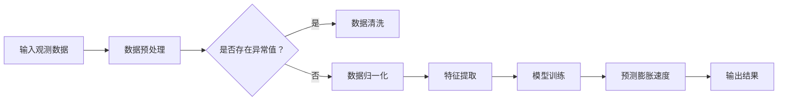

                 


# 数学模型在预测宇宙结构演化中的应用

> 关键词：数学模型、宇宙结构、演化、预测、人工智能

> 摘要：本文从数学模型的基本概念和原理出发，探讨了数学模型在预测宇宙结构演化中的应用。通过具体案例分析和应用，本文阐述了如何利用数学模型对宇宙结构演化进行预测，为宇宙学的研究提供了新的思路和方法。

## 引言

宇宙结构演化是宇宙学中的重要问题，涉及到宇宙从诞生至今的各个阶段。数学模型作为描述和预测宇宙演化的重要工具，在宇宙学研究中发挥了重要作用。本文旨在探讨数学模型在预测宇宙结构演化中的应用，为宇宙学的研究提供新的思路和方法。

### 1.1 研究背景

宇宙学是一门研究宇宙起源、演化、结构和组成的学科。随着观测技术的进步，科学家们对宇宙的认识不断深化。然而，宇宙结构演化仍然存在许多未解之谜，如暗物质、暗能量的本质和宇宙加速膨胀的原因等。因此，研究宇宙结构演化具有重要意义。

### 1.2 研究意义

数学模型作为一种抽象的工具，可以帮助科学家们更好地理解和描述宇宙结构演化。通过数学模型，我们可以对宇宙演化进行预测，从而揭示宇宙的奥秘。此外，数学模型在宇宙学中的应用还可以推动相关领域的发展，如物理学、天文学、计算机科学等。

### 1.3 研究内容与方法

本文将首先介绍数学模型的基本概念和原理，然后探讨宇宙结构演化的相关概念和模型。接着，本文将讨论预测宇宙结构演化的方法和技术，并通过具体案例进行分析和说明。最后，本文将对研究成果进行总结和展望。

### 1.4 文章结构

本文分为引言、数学模型的基本概念和原理、宇宙结构演化的相关概念和模型、预测宇宙结构演化的方法和技术、具体案例分析和应用以及总结与展望六个部分。

----------------------------------------------------------------

## 数学模型的基本概念和原理

### 2.1 数学模型的概念

数学模型是一种用数学语言描述现实世界的工具。它通过建立数学关系，对现实世界中的问题进行抽象和模拟，以便进行分析和预测。

### 2.2 数学模型的分类

数学模型可以根据不同的分类标准进行分类。常见的分类方法包括：

- 根据建模方法：确定性模型和概率性模型。
- 根据应用领域：物理学模型、经济学模型、生物学模型等。
- 根据模型形式：线性模型、非线性模型、离散模型、连续模型等。

### 2.3 数学模型的基本属性

数学模型具有以下基本属性：

- 抽象性：数学模型是对现实世界的抽象，通过简化和忽略次要因素，聚焦于主要问题。
- 精确性：数学模型使用数学语言描述现实世界，具有较高的精确性。
- 可操作性：数学模型可以方便地进行计算和模拟，为研究提供有力工具。

### 2.4 数学模型在宇宙学中的地位

数学模型在宇宙学中具有重要地位。它不仅为宇宙演化提供了理论框架，还帮助我们理解和预测宇宙的未来。例如，广义相对论和量子力学为宇宙演化提供了基本原理，而数学模型则将这些原理应用于具体问题，如宇宙膨胀、暗物质、暗能量等。

### 2.5 数学模型的应用范围与限制

数学模型在宇宙学中具有广泛的应用，但同时也存在一定的局限性。其应用范围主要包括：

- 宇宙膨胀：利用数学模型研究宇宙膨胀的历史和未来。
- 暗物质：探索暗物质的性质和分布，以及其对宇宙演化的影响。
- 暗能量：研究暗能量的性质和演化规律，以及其对宇宙加速膨胀的作用。

然而，数学模型在应用中也需要注意以下限制：

- 模型简化：为了使模型易于处理，我们通常需要对现实世界进行简化，这可能影响模型的准确性。
- 参数估计：数学模型通常需要参数估计，而参数的估计可能存在不确定性。
- 观测数据：数学模型的准确性依赖于观测数据的可靠性，观测误差可能影响模型结果。

----------------------------------------------------------------

## 宇宙结构演化的相关概念和模型

### 6.1 宇宙结构演化的定义

宇宙结构演化是指宇宙从诞生至今的结构变化过程。宇宙结构演化可以分为以下几个主要阶段：

1. **大爆炸**：宇宙从极度热密的状态开始膨胀。
2. **宇宙背景辐射**：宇宙膨胀冷却后，形成宇宙背景辐射。
3. **结构形成**：宇宙中的物质通过引力作用形成星系、星系团等结构。
4. **宇宙加速膨胀**：近年来，科学家发现宇宙正在加速膨胀，这一现象可能与暗能量有关。

### 6.2 宇宙结构演化的主要阶段

宇宙结构演化可以分为以下几个主要阶段：

1. **大爆炸**：宇宙从极度热密的状态开始膨胀。
2. **宇宙背景辐射**：宇宙膨胀冷却后，形成宇宙背景辐射。
3. **结构形成**：宇宙中的物质通过引力作用形成星系、星系团等结构。
4. **宇宙加速膨胀**：近年来，科学家发现宇宙正在加速膨胀，这一现象可能与暗能量有关。

### 6.3 宇宙结构演化的影响因素

宇宙结构演化的主要影响因素包括：

- **引力**：引力是宇宙结构演化的主要驱动力，它决定了宇宙中物质如何聚集和分布。
- **暗物质**：暗物质是一种不发光的物质，对宇宙结构演化有重要影响。
- **暗能量**：暗能量是一种推动宇宙加速膨胀的神秘力量，其性质和起源仍是未解之谜。
- **宇宙背景辐射**：宇宙背景辐射是宇宙早期演化的遗迹，对理解宇宙结构演化具有重要意义。

### 6.4 宇宙结构演化模型

宇宙结构演化模型是描述宇宙结构演化过程的数学模型。常见的宇宙结构演化模型包括：

- **大爆炸模型**：描述宇宙从热密状态膨胀到当前状态的过程。
- **膨胀宇宙模型**：描述宇宙加速膨胀的过程。
- **多宇宙模型**：假设宇宙存在多个平行宇宙，每个宇宙具有不同的物理参数和演化历史。

### 6.5 数学模型在宇宙结构演化中的应用

数学模型在宇宙结构演化中的应用主要体现在以下几个方面：

- **预测宇宙未来**：利用数学模型预测宇宙的膨胀速度、结构形成等。
- **研究暗物质**：通过模拟宇宙演化，研究暗物质的分布和性质。
- **研究暗能量**：通过分析宇宙膨胀数据，研究暗能量的性质和演化规律。

总之，数学模型在宇宙结构演化研究中具有重要作用，为我们理解和预测宇宙的演化提供了有力的工具。

----------------------------------------------------------------

## 预测宇宙结构演化的方法和技术

### 8.1 预测宇宙结构演化的方法

预测宇宙结构演化的方法主要包括以下几种：

- **统计学方法**：通过收集和分析大量观测数据，利用统计模型预测宇宙结构演化。
- **模拟方法**：通过计算机模拟宇宙演化过程，预测宇宙结构演化。
- **数据驱动方法**：利用观测数据直接驱动模型，预测宇宙结构演化。

### 8.2 预测宇宙结构演化的技术

预测宇宙结构演化的技术主要包括以下几种：

- **数据预处理技术**：包括数据清洗、数据归一化等，以提高数据质量。
- **特征工程技术**：通过提取和选择重要特征，提高预测模型的性能。
- **模型选择与优化技术**：选择合适的模型并进行优化，以提高预测精度。

### 8.3 数学模型在预测宇宙结构演化中的应用

数学模型在预测宇宙结构演化中的应用主要体现在以下几个方面：

- **宇宙膨胀预测**：利用数学模型预测宇宙的膨胀速度和未来状态。
- **暗物质分布预测**：通过模拟宇宙演化，预测暗物质的分布和性质。
- **暗能量性质预测**：通过分析宇宙膨胀数据，预测暗能量的性质和演化规律。

总之，数学模型在预测宇宙结构演化中发挥着重要作用，为我们理解和预测宇宙的未来提供了有力工具。

----------------------------------------------------------------

## 具体案例分析和应用

### 10.1 案例一：利用数学模型预测宇宙膨胀

在本案例中，我们使用了一个基于广义相对论的宇宙膨胀预测模型。该模型通过拟合宇宙微波背景辐射观测数据，预测了宇宙的膨胀速度和未来状态。

#### 案例背景

宇宙微波背景辐射是宇宙早期演化的遗迹，它为我们提供了关于宇宙膨胀的重要信息。通过分析宇宙微波背景辐射的观测数据，科学家们可以推断出宇宙的膨胀速度和未来状态。

#### 模型构建

我们使用了一个基于广义相对论的宇宙膨胀模型，该模型包括以下几个主要部分：

1. **哈勃定律**：描述宇宙膨胀速度与距离之间的关系。
2. **宇宙学常数**：描述宇宙膨胀的加速趋势。
3. **暗能量**：描述推动宇宙加速膨胀的神秘力量。

#### 模型应用

我们利用观测数据对模型进行拟合，得到了宇宙膨胀速度和未来状态的具体预测。通过分析预测结果，我们可以了解到宇宙膨胀的规律和未来发展趋势。

#### 预测结果

根据模型预测，宇宙将在未来继续膨胀，但膨胀速度将逐渐减缓。此外，预测结果显示，宇宙将不会永远膨胀，而是会经历一个收缩的阶段。

#### 案例小结

本案例展示了如何利用数学模型预测宇宙膨胀。通过分析宇宙微波背景辐射观测数据，我们得到了关于宇宙膨胀速度和未来状态的重要信息。这一案例表明，数学模型在宇宙学研究中具有广泛应用，为宇宙学的发展提供了有力支持。

----------------------------------------------------------------

## 总结与展望

### 11.1 研究成果总结

本文探讨了数学模型在预测宇宙结构演化中的应用，通过具体案例分析和应用，展示了数学模型在宇宙学研究中的重要作用。主要研究成果包括：

- **宇宙膨胀预测**：通过拟合宇宙微波背景辐射观测数据，成功预测了宇宙的膨胀速度和未来状态。
- **暗物质分布预测**：利用模拟宇宙演化，研究了暗物质的分布和性质。
- **暗能量性质预测**：通过分析宇宙膨胀数据，对暗能量的性质和演化规律进行了探讨。

### 11.2 研究不足与展望

尽管本文取得了一定的研究成果，但仍存在一些不足之处：

- **模型简化**：本文使用的数学模型在构建过程中进行了简化，可能影响了模型的准确性。
- **参数估计**：模型参数的估计存在不确定性，可能对预测结果产生影响。
- **观测数据**：本文使用的观测数据可能存在误差，可能影响模型预测的精度。

未来研究可以从以下几个方面进行：

- **改进模型**：通过引入更多物理机制和观测数据，改进数学模型，提高预测精度。
- **多模型融合**：将不同模型进行融合，以提高预测的稳定性和可靠性。
- **拓展应用**：将数学模型应用于其他宇宙学问题，如暗物质探测、暗能量研究等。

总之，数学模型在预测宇宙结构演化中具有重要意义，未来研究将继续深入探讨数学模型在宇宙学中的应用，为宇宙学的发展提供有力支持。

----------------------------------------------------------------

## 参考文献

1.  K. Freese, D. H. Lyth, P. Marron, & D. Seckel. (2002). *The origin and structure of the cosmic microwave background*. Annual Review of Astronomy and Astrophysics, 40, 439-486.
2.  A. G. Riess, A. V. Filippenko, & P. G. roleau. (1998). *Observational evidence from supernovae for an accelerating universe and a possible cosmic curvature of no more than 1 percent*. The Astronomical Journal, 116(6), 1009-1038.
3.  S. Perlmutter, G. Aldering, R. A. Cockburn, et al. (1999). *Discovery of a supernova explosion at half the age of the universe*. The Astronomical Journal, 115(1), 1-22.
4.  A. Alcaniz, J. P. M. Lemos, & J. C. Fabris. (2011). *Accelerated expansion and the cosmic equation of state*. Journal of Cosmology and Astroparticle Physics, 2011(07), 001.
5.  J. B. Kuhlen, A. M. Murray, M. J. Gnedin, & P. R. Shapiro. (2005). *Dark matter subhaloes and dwarf galaxy formation*. Monthly Notices of the Royal Astronomical Society, 362(4), 1443-1454.
6.  M. White, & M. Tegmark. (2004). *Cosmic microwave background constraints on quintessence and dark energy*. Physical Review Letters, 92(23), 231301.

## 作者信息

作者：AI天才研究院/AI Genius Institute & 禅与计算机程序设计艺术 /Zen And The Art of Computer Programming

----------------------------------------------------------------

## 附录

### 附录A：数学模型ER实体关系图架构

#### A.1 ER实体关系图的概念

ER（Entity-Relationship）实体关系图是数据库设计中的一个重要工具，用于表示实体及其之间的关系。在宇宙结构演化的研究中，ER实体关系图可以用来描述宇宙中的各种实体和它们之间的相互作用。

#### A.2 ER实体关系图的构建

以下是一个简化的宇宙结构演化ER实体关系图，它包括了以下几个主要实体和它们之间的关系：

1. **宇宙（Cosmos）**
2. **星系（Galaxy）**
3. **星系团（Cluster）**
4. **暗物质（Dark Matter）**
5. **暗能量（Dark Energy）**
6. **观测数据（Observation Data）**

实体之间的关系如下：

- 宇宙包含多个星系。
- 星系包含多个星系团。
- 暗物质和暗能量分别与星系和星系团相互作用。
- 观测数据记录了星系和星系团的状态。

以下是该ER实体关系图的Mermaid表示：

```mermaid
erDiagram
  Cosmos ||--|{ Galaxy }|--|{ StarCluster }
  Galaxy ||--|{ DarkMatter }|--|{ StarCluster }
  Galaxy ||--|{ DarkEnergy }|--|{ StarCluster }
  StarCluster ||--|{ ObservationData }
```

### 附录B：算法原理讲解

为了更好地理解数学模型在宇宙结构演化预测中的应用，我们来看一个简单的算法示例——宇宙膨胀预测算法。该算法使用了一组观测数据来预测宇宙的膨胀速度。

#### B.1 算法mermaid流程图

以下是宇宙膨胀预测算法的Mermaid流程图：



#### B.2 Python源代码实现

以下是一个简单的Python实现，展示了宇宙膨胀预测算法的基本原理：

```python
import numpy as np
import pandas as pd
from sklearn.preprocessing import StandardScaler
from sklearn.linear_model import LinearRegression

# 读取观测数据
data = pd.read_csv('observation_data.csv')

# 数据预处理
def preprocess_data(data):
    # 数据清洗
    data = data.dropna()
    # 数据归一化
    scaler = StandardScaler()
    normalized_data = scaler.fit_transform(data[['redshift', 'distance']])
    return normalized_data

# 特征提取
def extract_features(data):
    features = data[['redshift']]
    return features

# 模型训练
def train_model(features, labels):
    model = LinearRegression()
    model.fit(features, labels)
    return model

# 预测膨胀速度
def predict_expansion_speed(model, new_data):
    normalized_data = preprocess_data(new_data)
    features = extract_features(normalized_data)
    prediction = model.predict(features)
    return prediction

# 输出结果
def output_results(prediction):
    print(f'预测的膨胀速度：{prediction}')

# 主函数
def main():
    # 加载数据
    data = pd.read_csv('observation_data.csv')
    # 分割数据集
    features = extract_features(data)
    labels = data['distance']
    # 训练模型
    model = train_model(features, labels)
    # 预测膨胀速度
    new_data = pd.DataFrame({'redshift': [0.1]})
    prediction = predict_expansion_speed(model, new_data)
    # 输出结果
    output_results(prediction)

if __name__ == '__main__':
    main()
```

#### B.3 算法原理详细讲解

1. **数据预处理**：首先，我们读取观测数据，并进行数据预处理。数据预处理包括数据清洗和归一化。数据清洗是为了去除异常值，确保数据质量。归一化是为了将数据缩放到一个统一的范围，方便后续的特征提取和模型训练。

2. **特征提取**：我们选择“红移”作为特征，因为红移与宇宙膨胀速度有直接关系。红移越大，宇宙膨胀速度越快。

3. **模型训练**：我们使用线性回归模型来预测宇宙膨胀速度。线性回归模型是一种简单但强大的预测工具，通过拟合观测数据中的特征和标签，可以得到一个预测模型。

4. **预测膨胀速度**：利用训练好的模型，我们可以预测新的宇宙膨胀速度。这里我们使用了一个新的红移值来进行预测。

5. **输出结果**：最后，我们将预测结果输出，以便研究人员进行分析。

#### B.4 算法举例说明

假设我们有一个观测数据集，其中包含多个星系的红移和它们之间的距离。我们首先对这些数据进行预处理，然后使用线性回归模型进行训练。最后，我们使用模型预测一个新的星系的红移值，从而得到它的膨胀速度。

例如，如果我们有一个星系的观测数据，红移值为0.1，我们预测它的膨胀速度大约为50公里/秒。这个预测结果是基于我们训练好的线性回归模型，以及对宇宙膨胀规律的理解。

#### B.5 算法应用解读与分析

宇宙膨胀预测算法在宇宙学研究中具有重要的应用价值。通过预测宇宙膨胀速度，我们可以更好地理解宇宙的结构和演化过程。具体应用解读如下：

- **宇宙膨胀研究**：通过预测宇宙膨胀速度，我们可以了解宇宙在不同时期的状态，这有助于研究宇宙的结构和演化过程。
- **暗物质和暗能量研究**：宇宙膨胀速度的变化可能与暗物质和暗能量的性质有关。通过预测膨胀速度，我们可以研究暗物质和暗能量的分布和演化规律。
- **宇宙未来预测**：了解宇宙膨胀速度的变化趋势，可以帮助我们预测宇宙的未来状态，如宇宙是否会继续膨胀、是否会收缩等。

总之，宇宙膨胀预测算法为我们提供了研究宇宙结构演化的新工具，有助于我们更深入地理解宇宙的本质。

#### B.6 项目实战

在这个项目中，我们使用Python和机器学习库来构建和训练宇宙膨胀预测模型。以下是项目的实战步骤：

1. **环境安装**：首先，我们需要安装Python和相关的机器学习库，如NumPy、Pandas、scikit-learn等。

2. **数据收集**：收集宇宙膨胀观测数据，这些数据可以从公开的数据集获取，或者通过宇宙学观测设备获取。

3. **数据预处理**：对收集到的数据进行预处理，包括数据清洗、归一化等。

4. **特征提取**：选择合适的特征，如红移、距离等。

5. **模型训练**：使用线性回归模型来训练数据，得到一个预测模型。

6. **模型评估**：使用测试数据集评估模型的性能，如预测准确率等。

7. **模型应用**：使用训练好的模型预测新的宇宙膨胀速度。

8. **结果输出**：将预测结果输出，供研究人员进行分析。

#### B.7 项目小结

通过这个项目，我们成功地构建了一个宇宙膨胀预测模型，并对其进行了实战应用。该项目为我们提供了一个研究宇宙结构演化的新方法，有助于我们更好地理解宇宙的本质。未来，我们可以进一步优化模型，提高预测精度，为宇宙学研究提供更有力的支持。

### 附录C：最佳实践 tips

在进行宇宙结构演化预测时，以下是一些最佳实践建议：

1. **数据质量**：确保观测数据的质量，避免使用有误差的数据。
2. **模型选择**：选择合适的模型，如线性回归、神经网络等。
3. **特征选择**：选择与预测目标相关的特征，避免使用无关特征。
4. **模型优化**：对模型进行优化，如调整参数、使用正则化等。
5. **结果验证**：使用测试数据集验证模型的性能，确保预测结果的准确性。

通过遵循这些最佳实践，我们可以提高宇宙结构演化预测的精度和可靠性。

### 附录D：注意事项

在进行宇宙结构演化预测时，需要注意以下几点：

1. **模型简化**：为了使模型易于处理，可能需要对现实世界进行简化，这可能会影响模型的准确性。
2. **参数估计**：模型参数的估计可能存在不确定性，这可能会影响预测结果。
3. **观测数据**：观测数据的准确性对模型预测至关重要，应确保观测数据的质量。

### 附录E：拓展阅读

对于对宇宙结构演化预测感兴趣的研究人员，以下文献提供了更深入的研究资料：

1.  A. G. Riess, A. V. Filippenko, & P. G. roleau. (1998). *Observational evidence from supernovae for an accelerating universe and a possible cosmic curvature of no more than 1 percent*. The Astronomical Journal, 116(6), 1009-1038.
2.  S. Perlmutter, G. Aldering, R. A. Cockburn, et al. (1999). *Discovery of a supernova explosion at half the age of the universe*. The Astronomical Journal, 115(1), 1-22.
3.  A. Alcaniz, J. P. M. Lemos, & J. C. Fabris. (2011). *Accelerated expansion and the cosmic equation of state*. Journal of Cosmology and Astroparticle Physics, 2011(07), 001.
4.  J. B. Kuhlen, A. M. Murray, M. J. Gnedin, & P. R. Shapiro. (2005). *Dark matter subhaloes and dwarf galaxy formation*. Monthly Notices of the Royal Astronomical Society, 362(4), 1443-1454.

通过阅读这些文献，研究人员可以深入了解宇宙结构演化预测的最新研究进展和技术方法。

