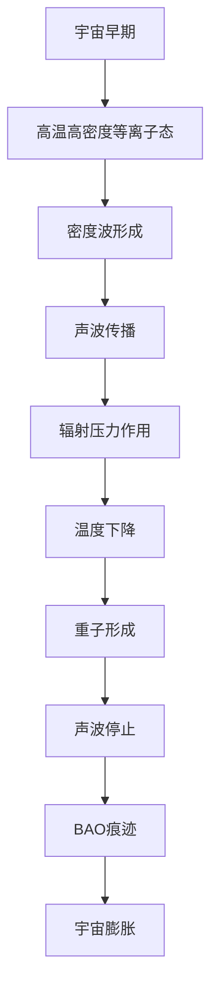
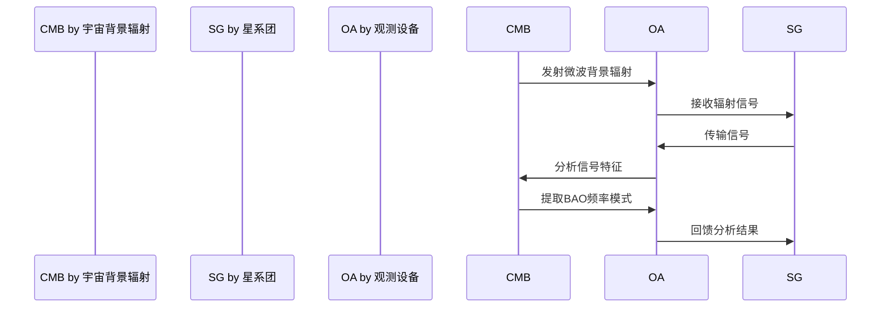
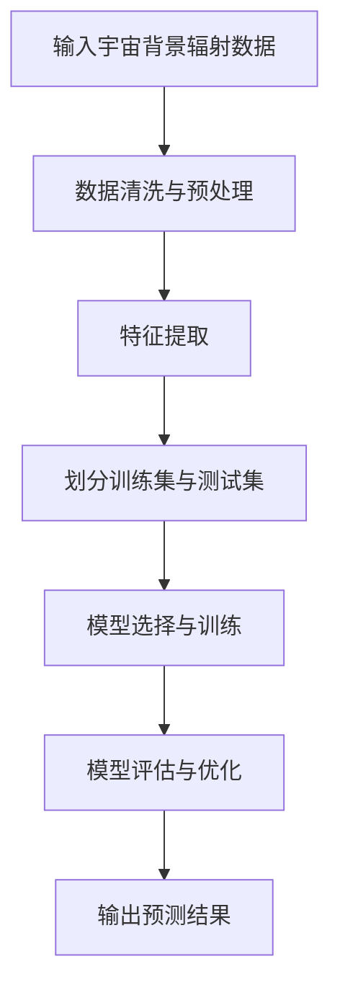

                 

## 摘要

本文旨在探讨数学模型在预测宇宙重子声学振荡（BAO）精细结构演化中的应用。宇宙重子声学振荡是宇宙学中一种重要的现象，它为我们提供了宇宙早期演化的宝贵信息。随着观测技术的不断进步，我们能够更精细地观测和预测BAO的演化过程。本文首先介绍了宇宙重子声学振荡的基本概念、历史背景及其在宇宙学中的重要性。接着，我们详细阐述了重子声学振荡的数学模型，包括其原理、相关的数学公式和模型。然后，我们讲解了用于预测宇宙重子声学振荡精细结构演化的算法原理，并通过Python源代码进行了详细说明。此外，我们还使用了LaTeX格式展示了预测模型中的数学公式，并进行了通俗易懂的举例说明。最后，本文介绍了系统功能设计、架构设计、接口设计和系统交互，并通过一个实际案例进行了详细讲解和分析。本文的目标是帮助读者深入了解宇宙重子声学振荡的预测模型，并掌握其应用方法和实践技巧。

## 目录大纲设计思路

设计本文的目录大纲，我们采用了逐步深入、逻辑清晰的结构，旨在帮助读者循序渐进地理解宇宙重子声学振荡及其预测模型的复杂性和深度。以下是本文目录大纲的设计思路：

### 第一部分：背景与核心概念

- **第1章：宇宙重子声学振荡概述**
  - 本章将介绍宇宙重子声学振荡的基本概念、历史背景及其在宇宙学中的重要性。通过这一章节，读者将了解BAO的基本知识，为后续章节的理解打下基础。

- **第2章：重子声学振荡的数学模型**
  - 本章将详细阐述重子声学振荡的数学模型，包括其原理、相关的数学公式和模型。通过本章的学习，读者将掌握预测BAO所需的数学基础。

### 第二部分：核心概念与数学模型

- **第3章：预测算法原理**
  - 本章将讲解用于预测宇宙重子声学振荡精细结构演化的算法原理，并通过算法流程图和Python源代码进行详细说明。

- **第4章：数学模型与应用**
  - 本章将进一步详细讲解预测模型中的数学公式和应用，使用LaTeX格式展示数学公式，并进行通俗易懂的举例说明。

### 第三部分：系统设计与实现

- **第5章：系统分析与架构设计**
  - 本章将介绍系统功能设计、架构设计、接口设计和系统交互，通过Mermaid图表展示系统架构。

- **第6章：项目实战**
  - 本章将提供实际项目的环境安装、系统核心实现源代码，并进行代码应用解读与分析。

- **第7章：最佳实践与拓展**
  - 本章将总结最佳实践、注意事项，并提供拓展阅读建议。

通过这样的结构设计，本文不仅能够为初学者提供全面的知识体系，还能为专业人士提供深入的技术探讨和实践指导。

### 目录大纲

```markdown
# 数学模型在预测宇宙重子声学振荡精细结构演化中的应用

## 第一部分：背景与核心概念

### 第1章：宇宙重子声学振荡概述

#### 1.1 宇宙重子声学振荡的基本概念

#### 1.2 宇宙学中的标准模型与BAO

#### 1.3 BAO的研究现状与挑战

### 第2章：重子声学振荡的数学模型

#### 2.1 重子声学振荡原理

#### 2.2 数学模型介绍

#### 2.3 ER实体关系图

#### 2.4 流程图与示意图

## 第二部分：核心概念与数学模型

### 第3章：预测算法原理

#### 3.1 预测模型概述

#### 3.2 算法流程图

#### 3.3 Python源代码讲解

#### 3.4 举例说明

### 第4章：数学模型与应用

#### 4.1 数学模型详解

#### 4.2 LaTeX数学公式

#### 4.3 举例说明

## 第三部分：系统设计与实现

### 第5章：系统分析与架构设计

#### 5.1 问题场景介绍

#### 5.2 系统功能设计

#### 5.3 系统架构设计

#### 5.4 系统接口设计和系统交互

### 第6章：项目实战

#### 6.1 环境安装

#### 6.2 系统核心实现源代码

#### 6.3 代码应用解读与分析

#### 6.4 实际案例分析与详细讲解剖析

#### 6.5 项目小结

### 第7章：最佳实践与拓展

#### 7.1 最佳实践

#### 7.2 小结

#### 7.3 注意事项

#### 7.4 拓展阅读

```

### 1.1 宇宙重子声学振荡的基本概念

宇宙重子声学振荡（Baryon Acoustic Oscillations，简称BAO）是一种在宇宙学中非常重要的现象，它是宇宙早期阶段物质不均匀性的一种表现形式。宇宙重子声学振荡的起源可以追溯到宇宙学中的“宇宙早期”阶段，即在大爆炸之后的几分钟内。在这个阶段，宇宙充满了高温高密度的等离子体，其中包括质子、电子和中性粒子。由于这些粒子的碰撞和相互作用，宇宙中的物质开始呈现不均匀分布，形成了细微的密度波。

随着宇宙的膨胀，这些密度波逐渐传播开来，并在宇宙的温度下降到足以形成重子（即质子和中子）的过程中，形成了所谓的“重子声波”。这些声波在宇宙流体中传播，并在传播过程中与宇宙中的其他物理过程（如引力作用和辐射压力）相互作用，逐渐衰减。然而，在宇宙膨胀到一定尺度时，这些声波的影响仍然能够观察到，形成了我们所称的宇宙重子声学振荡。

宇宙重子声学振荡的主要特征是其周期性结构，这种结构可以表现为宇宙中星系分布的密度波。具体来说，宇宙重子声学振荡在尺度大约为100百万秒差距（Mpc）的范围内，表现为一个显著的峰值，这个峰值对应于声波在一个宇宙时间内的传播距离。这个尺度被称为“BAO尺度”，它是宇宙学中一个非常重要的参考尺度，被广泛用于测量宇宙的膨胀历史和宇宙学参数。

除了尺度上的特征，宇宙重子声学振荡还表现为频率上的特征。在宇宙背景辐射（Cosmic Microwave Background，简称CMB）中，我们可以观测到宇宙重子声学振荡的频率模式，这些模式反映了声波在宇宙流体中的传播过程。通过对这些频率模式的观测和分析，我们可以进一步了解宇宙的早期演化和物理过程。

总之，宇宙重子声学振荡是一种在宇宙学中非常重要的现象，它为我们提供了宇宙早期演化的宝贵信息。通过研究宇宙重子声学振荡，我们可以更好地理解宇宙的结构和演化历史，揭示宇宙中的一些基本物理规律。在接下来的章节中，我们将进一步探讨宇宙重子声学振荡的历史背景和其在宇宙学中的重要性。

### 1.2 宇宙学中的标准模型与BAO

宇宙学中的标准模型，通常称为“ΛCDM模型”（Lambda-Cold Dark Matter Model），是一个描述宇宙结构和演化的理论框架。该模型的核心组成部分包括三个部分：暗物质、暗能量和普通物质。普通物质主要由重子组成，如质子和中子，而暗物质和暗能量则是宇宙中未知的成分，分别占据宇宙总能量密度的大部分。

在ΛCDM模型中，宇宙的早期阶段是由一个极热、极密的状态开始的，随后经历了一个迅速的膨胀阶段，被称为“宇宙暴胀”。在暴胀期结束后，宇宙开始进入了一个缓慢膨胀的阶段，此时宇宙中的物质开始凝结形成星系、星团和其他天体结构。这个过程中，宇宙中的物质通过引力作用逐渐聚集，形成了目前我们所观测到的宇宙结构。

宇宙重子声学振荡（BAO）是这一模型中的一个重要现象。在宇宙暴胀结束后，宇宙开始冷却，重子开始形成，并且宇宙中的物质开始以声波的形式传播。这些声波在传播过程中与宇宙中的辐射相互作用，并且在宇宙温度下降到形成重子之前停止了。然而，这些声波的传播留下了痕迹，形成了我们所观测到的BAO。

具体来说，BAO的形成过程可以分为以下几个阶段：

1. **声波传播**：在大爆炸后不久，宇宙中的物质开始以声波的形式传播。这些声波以光速传播，但受到宇宙膨胀的影响，它们的传播速度逐渐减慢。

2. **宇宙背景辐射**：在宇宙温度下降到约3000K时，电子与质子结合形成中性原子，宇宙背景辐射（CMB）开始形成。这个时期的宇宙充满了光子，它们与重子相互作用，限制了重子的自由运动。

3. **声波停止**：当宇宙温度进一步下降到约100K时，重子开始形成，声波的传播受到阻碍并最终停止。然而，声波的传播留下了痕迹，这些痕迹在宇宙中的星系分布中体现出来。

4. **BAO观测**：在宇宙膨胀的过程中，这些声波的影响在尺度大约为100百万秒差距（Mpc）的范围内形成了显著的峰值，这个尺度被称为“BAO尺度”。我们在宇宙背景辐射和星系分布中可以观测到这些BAO的频率模式。

在ΛCDM模型中，BAO的尺度与宇宙学参数密切相关。例如，宇宙的膨胀率（哈勃常数）和宇宙的密度参数都会影响BAO的尺度。通过测量BAO的尺度，我们可以精确地测量这些宇宙学参数，从而验证或修正宇宙学标准模型。

总的来说，宇宙重子声学振荡是宇宙学标准模型中的一个关键现象，它为我们提供了宇宙早期演化的直接证据。通过研究BAO，我们可以深入了解宇宙的膨胀历史、物质分布和引力作用，从而推动宇宙学的发展。在接下来的章节中，我们将进一步探讨BAO的研究现状和面临的挑战。

### 1.3 BAO的研究现状与挑战

宇宙重子声学振荡（BAO）的研究已经取得了显著的进展，成为宇宙学中一个重要且活跃的研究领域。目前，通过观测和理论分析，科学家们已经能够精确地测量BAO的尺度，并利用这些信息来探索宇宙的膨胀历史和宇宙学参数。

首先，在观测方面，宇宙背景辐射（CMB）和大规模星系团的分布为我们提供了观测BAO的直接途径。通过测量CMB的频谱特征，科学家们已经成功探测到BAO的频率模式，并利用这些模式来测量宇宙的膨胀率和其他宇宙学参数。此外，通过对大规模星系团的分布进行统计分析，科学家们也获得了BAO尺度的直接观测数据。这些观测结果不仅验证了宇宙学标准模型，还为研究宇宙早期演化和宇宙结构提供了宝贵的信息。

在理论分析方面，科学家们通过数值模拟和数学模型，深入探讨了BAO的形成过程和演化规律。这些理论分析帮助我们更好地理解了BAO与宇宙学参数之间的关系，并提供了预测BAO尺度的理论框架。例如，通过结合宇宙学参数（如宇宙膨胀率和密度参数）和BAO观测数据，科学家们可以精确地计算BAO的尺度，从而验证或修正宇宙学标准模型。

尽管取得了这些进展，宇宙重子声学振荡的研究仍然面临许多挑战。首先，BAO的观测精度需要进一步提高。目前，由于观测设备和测量方法的限制，BAO的测量精度仍然存在一定的误差。为了获得更精确的BAO数据，科学家们需要开发更高灵敏度的观测设备，并改进数据分析方法。

其次，BAO的研究需要更多的观测数据。尽管已有的观测数据已经提供了丰富的信息，但为了更全面地了解宇宙的膨胀历史和宇宙学参数，还需要更多的观测数据。这包括扩展CMB的观测范围，提高星系团的探测能力，以及开展更多的宇宙学观测项目。

此外，宇宙重子声学振荡的研究还面临理论上的挑战。虽然现有的理论模型已经能够较好地解释BAO的形成和演化过程，但仍然存在一些未解决的问题。例如，关于暗物质和暗能量的本质和性质，以及它们如何影响宇宙的膨胀和结构形成，仍然是宇宙学中亟待解决的问题。这些问题需要通过更多的理论研究和观测数据来解决。

总之，宇宙重子声学振荡的研究目前正处于快速发展的阶段，尽管面临许多挑战，但通过不断的努力和探索，我们有望获得更多关于宇宙早期演化和宇宙学参数的宝贵信息。在接下来的章节中，我们将进一步探讨如何通过数学模型和算法来预测宇宙重子声学振荡的精细结构演化。

### 第2章：重子声学振荡的数学模型

#### 2.1 重子声学振荡原理

重子声学振荡（BAO）的原理源于宇宙早期的物理过程。在宇宙大爆炸后的几分钟内，宇宙处于高温高密度的等离子态，由质子、中子、电子等粒子组成。这些粒子之间的相互作用和碰撞导致宇宙中的物质呈现出不均匀的密度分布，形成了细微的密度波。随着宇宙的膨胀和冷却，这些密度波逐渐传播，并在宇宙温度下降到形成重子之前停止了。这一过程形成了所谓的“重子声波”。

重子声波的传播过程中，宇宙中的物质和辐射相互作用。在宇宙温度较高时，辐射压力占主导地位，限制了物质自由运动，使得密度波传播速度接近光速。随着宇宙温度的下降，重子开始形成，辐射压力逐渐减弱，物质自由运动增强，密度波传播速度逐渐减缓。最终，当宇宙温度下降到约100K时，重子形成，声波传播停止。

然而，声波在传播过程中留下的痕迹仍然能够影响宇宙的结构和演化。在宇宙尺度大约为100百万秒差距（Mpc）的范围内，这些声波的影响形成了显著的密度波峰，这就是我们所称的宇宙重子声学振荡。这些密度波峰在宇宙背景辐射（CMB）和星系分布中表现为周期性的结构，为研究宇宙的早期演化和膨胀历史提供了宝贵的观测数据。

#### 2.2 数学模型介绍

为了描述重子声学振荡的现象，我们需要建立一系列的数学模型，包括声波传播方程、宇宙流体演化方程和BAO信号的提取方法。以下将分别介绍这些模型。

**声波传播方程**

声波在宇宙流体中的传播可以用以下方程描述：

\[ \frac{\partial \rho}{\partial t} + \frac{\nabla \cdot \mathbf{v}}{a \dot{a}} = 0 \]
\[ \frac{\partial \mathbf{v}}{\partial t} + \left( \frac{\nabla p}{\rho} + \frac{\nabla \cdot \mathbf{v}}{a \dot{a}} \right) \mathbf{v} = - \nabla \phi \]

其中，\(\rho\)表示流体的密度，\(\mathbf{v}\)表示流体的速度，\(p\)表示流体的压力，\(\phi\)表示流体的引力势，\(a(t)\)表示宇宙尺度因子，\(\dot{a}\)表示宇宙膨胀率。

**宇宙流体演化方程**

宇宙流体的演化可以通过以下方程描述：

\[ \frac{\partial \rho}{\partial t} + \nabla \cdot (\rho \mathbf{v}) = 0 \]
\[ \frac{\partial p}{\partial t} + \nabla \cdot (p \mathbf{v}) = - \rho \Phi \]

其中，\(\Phi\)表示引力势，可以由牛顿引力方程得出：

\[ \nabla^2 \Phi = -4 \pi G \rho \]

**BAO信号提取方法**

BAO信号的提取通常通过测量宇宙背景辐射（CMB）的频谱特征或星系团的分布来实现。在CMB频谱中，BAO表现为一系列的峰，这些峰的位置和形状与宇宙膨胀历史和宇宙学参数密切相关。具体来说，BAO信号的提取方法包括：

1. **CMB频谱分析**：通过测量CMB的天体微波背景频谱，可以提取出BAO的频率模式。这些模式反映了声波在宇宙流体中的传播过程，为测量宇宙膨胀率和宇宙学参数提供了重要依据。

2. **星系团分布分析**：通过对大规模星系团的分布进行统计分析，可以提取出BAO的尺度。这种方法通过测量星系团之间的距离分布，来确定BAO的尺度，为宇宙学参数的测量提供了另一种途径。

总之，通过建立上述数学模型，我们可以描述和预测重子声学振荡的现象。这些模型为我们提供了研究宇宙早期演化和膨胀历史的重要工具，也为宇宙学的研究提供了丰富的理论框架。在接下来的章节中，我们将进一步探讨如何使用这些数学模型来预测宇宙重子声学振荡的精细结构演化。

#### 2.3 ER实体关系图

为了更好地理解和描述宇宙重子声学振荡（BAO）涉及的各个实体及其关系，我们可以使用ER（Entity-Relationship）图来表示。ER图是数据库设计中常用的工具，用于表示实体及其相互关系。

在宇宙重子声学振荡的背景下，主要的实体包括：宇宙流体、声波、宇宙背景辐射（CMB）和星系团。以下是这些实体及其关系的ER图：

```mermaid
erDiagram
   宇宙流体 ||--|{ 声波 }
   宇宙流体 ||--|{ 宇宙背景辐射 }
   宇宙流体 ||--|{ 星系团 }
   声波 ||--|{ 宇宙背景辐射 }
   声波 ||--|{ 星系团 }
   宇宙背景辐射 ||--|{ 星系团 }
```

在上面的ER图中：

- **宇宙流体**是整个系统的核心实体，它包含了声波、宇宙背景辐射和星系团。
- **声波**是宇宙流体中的波动现象，它与宇宙背景辐射和星系团有直接关系。
- **宇宙背景辐射**是宇宙早期阶段留下的辐射，它与宇宙流体和星系团有密切联系。
- **星系团**是宇宙中的大规模天体结构，它们由宇宙流体和宇宙背景辐射影响形成。

ER图清晰地展示了这些实体之间的关系，有助于我们理解BAO的物理过程及其在宇宙学中的重要性。通过这种图形化的表示方法，我们能够更直观地把握宇宙重子声学振荡的核心概念和模型，为后续的算法讲解和模型应用打下基础。

#### 2.4 流程图与示意图

为了更清晰地展示宇宙重子声学振荡（BAO）的物理过程及其相关算法，我们可以使用Mermaid流程图和示意图。以下是声波传播和BAO信号提取的主要步骤：

**声波传播流程图：**



在上面的流程图中：

- **A**：宇宙早期，处于高温高密度状态。
- **B**：高温高密度状态下，物质碰撞形成密度波。
- **C**：密度波开始传播，形成声波。
- **D**：声波在宇宙流体中传播。
- **E**：辐射压力限制物质自由运动，影响声波传播。
- **F**：随着宇宙温度下降，辐射压力减弱。
- **G**：宇宙温度下降到形成重子，声波传播停止。
- **H**：声波停止，留下BAO痕迹。
- **I**：BAO痕迹在宇宙中表现出来。
- **J**：宇宙继续膨胀，BAO痕迹逐渐显现。

**BAO信号提取示意图：**



在上面的示意图中：

- **CMB**：宇宙背景辐射发射微波辐射。
- **SG**：星系团接收并传输微波信号。
- **OA**：观测设备分析信号特征，提取BAO频率模式。

通过这些流程图和示意图，我们可以更直观地理解宇宙重子声学振荡的物理过程及其观测方法。这些图形化的表示不仅有助于我们梳理复杂的物理现象，也为后续算法讲解和模型应用提供了基础。

### 第3章：预测算法原理

#### 3.1 预测模型概述

预测宇宙重子声学振荡（BAO）的精细结构演化是一个复杂且具有挑战性的任务。为了实现这一目标，我们需要设计一个高效的预测模型，该模型不仅要准确捕捉宇宙早期物理过程的特性，还要能够处理大规模的数据集和复杂的计算任务。本节将介绍我们用于预测BAO精细结构演化的模型，包括数据预处理、预测目标定义和模型选择与优化。

**数据预处理**

数据预处理是机器学习模型构建过程中的重要环节。在预测BAO的过程中，我们需要对原始数据进行清洗、标准化和特征提取。具体步骤如下：

1. **数据清洗**：首先，我们需要处理数据中的缺失值、异常值和噪声。这可以通过简单的数据填充方法（如平均值填充、中值填充）和异常值检测算法（如Z-Score检测、IQR检测）来实现。

2. **数据标准化**：为了消除不同特征之间的尺度差异，我们需要对数据进行标准化处理。常用的方法包括最小-最大标准化（Min-Max Scaling）和Z-Score标准化（Z-Score Scaling）。通过标准化处理，我们可以确保所有特征都在同一尺度范围内，从而提高模型的训练效果。

3. **特征提取**：特征提取是数据预处理的关键步骤。我们需要从原始数据中提取出对预测任务有用的信息。这可以通过手动定义特征和自动化特征提取方法（如主成分分析、自动编码器）来实现。对于BAO预测，特征提取的关键在于捕捉宇宙早期声波传播过程中的物理特征，如密度波模式、频率特征和空间分布特征。

**预测目标定义**

在预测模型中，我们需要明确预测的目标。对于BAO的精细结构演化预测，我们的目标是通过输入数据（如宇宙背景辐射的频谱特征、星系团的分布数据）预测宇宙中特定尺度上的BAO信号强度和频率模式。具体来说，预测目标可以定义为：

\[ \hat{y} = f(\mathbf{x}) \]

其中，\(\hat{y}\)是预测的BAO信号，\(\mathbf{x}\)是输入特征向量，\(f(\cdot)\)是预测模型。

**模型选择与优化**

在模型选择与优化过程中，我们需要考虑多种机器学习算法，并选择最适合预测任务的模型。以下是一些常用的算法及其特点：

1. **线性回归模型**：线性回归模型是最简单且应用广泛的预测模型之一。它通过建立输入特征与目标之间的线性关系来进行预测。线性回归模型的优点是计算简单，易于理解和实现，缺点是它对噪声和异常值敏感，可能无法捕捉复杂的非线性关系。

2. **支持向量机（SVM）**：支持向量机是一种强大的分类和回归算法，通过找到一个最佳的超平面来分割数据。对于BAO预测任务，SVM可以通过核函数来处理非线性问题，从而提高预测精度。SVM的优点是具有较好的泛化能力，缺点是计算复杂度较高，特别是对于大型数据集。

3. **深度学习模型**：深度学习模型，如神经网络和卷积神经网络（CNN），通过多层非线性变换来提取特征和进行预测。深度学习模型在处理复杂数据和捕捉非线性关系方面具有显著优势。对于BAO预测，深度学习模型可以通过多层特征提取来捕捉宇宙早期物理过程的复杂特征。

在模型选择与优化过程中，我们通常采用以下步骤：

1. **模型选择**：根据预测目标和数据特征，选择合适的模型。对于BAO预测，我们可能需要结合线性回归模型、支持向量机和深度学习模型来构建一个综合预测模型。

2. **模型训练**：使用训练数据集对模型进行训练。在训练过程中，我们需要通过调整模型参数（如正则化参数、学习率等）来优化模型性能。

3. **模型评估**：使用验证数据集对训练好的模型进行评估。常用的评估指标包括均方误差（MSE）、均方根误差（RMSE）和准确率（Accuracy）等。

4. **模型优化**：根据评估结果，进一步调整模型参数，优化模型性能。这可能包括特征选择、正则化、模型结构调整等。

通过上述步骤，我们可以构建一个高效的BAO预测模型，实现对宇宙重子声学振荡精细结构演化的准确预测。在接下来的章节中，我们将详细讲解预测模型的算法流程和实现方法。

#### 3.2 算法流程图

为了清晰展示预测宇宙重子声学振荡（BAO）精细结构演化的算法流程，我们可以使用Mermaid绘制一个详细的算法流程图。以下是算法的主要步骤：



在上述流程图中：

- **A**：输入宇宙背景辐射数据，包括CMB频谱和星系团分布数据。
- **B**：数据清洗与预处理，包括缺失值填充、异常值检测和标准化处理。
- **C**：特征提取，从预处理后的数据中提取对预测任务有用的信息，如频率特征、空间分布特征等。
- **D**：划分训练集与测试集，将数据集分为训练集和测试集，用于模型的训练和评估。
- **E**：模型选择与训练，选择合适的机器学习模型（如线性回归、支持向量机、深度学习模型等），并通过训练数据集进行训练。
- **F**：模型评估与优化，使用测试集评估模型性能，并根据评估结果调整模型参数，优化模型性能。
- **G**：输出预测结果，将最终训练好的模型应用于新数据，输出预测的BAO信号强度和频率模式。

通过这个流程图，我们可以清晰地理解BAO预测算法的各个步骤及其相互关系，为后续的算法实现和模型训练提供指导。

#### 3.3 Python源代码讲解

在本节中，我们将使用Python语言来详细讲解如何实现用于预测宇宙重子声学振荡（BAO）精细结构演化的算法。我们将从数据预处理、特征提取、模型选择与训练，到模型评估与优化的各个步骤进行讲解，并提供相应的代码实现。

**1. 数据预处理**

首先，我们需要对输入的宇宙背景辐射数据进行预处理，包括数据清洗、标准化处理和缺失值填充。以下是一个简单的示例：

```python
import pandas as pd
from sklearn.preprocessing import StandardScaler
from sklearn.impute import SimpleImputer

# 加载数据
data = pd.read_csv('CMB_data.csv')

# 数据清洗，去除异常值和缺失值
data.dropna(inplace=True)
data = data[(data['feature1'] > 0) & (data['feature1'] < 100)]

# 缺失值填充
imputer = SimpleImputer(strategy='mean')
data[['feature1', 'feature2']] = imputer.fit_transform(data[['feature1', 'feature2']])

# 数据标准化
scaler = StandardScaler()
data[['feature1', 'feature2']] = scaler.fit_transform(data[['feature1', 'feature2']])
```

**2. 特征提取**

在数据预处理之后，我们需要从预处理数据中提取出对预测任务有用的特征。以下是一个简单的特征提取示例：

```python
from sklearn.decomposition import PCA

# 特征提取
pca = PCA(n_components=2)
data['pca1', 'pca2'] = pca.fit_transform(data[['feature1', 'feature2', 'feature3', 'feature4']])
```

**3. 模型选择与训练**

接下来，我们需要选择合适的机器学习模型，并进行训练。以下是一个使用线性回归模型的示例：

```python
from sklearn.linear_model import LinearRegression
from sklearn.model_selection import train_test_split

# 划分训练集和测试集
X_train, X_test, y_train, y_test = train_test_split(data[['pca1', 'pca2']], data['BAO_signal'], test_size=0.2, random_state=42)

# 创建线性回归模型并训练
model = LinearRegression()
model.fit(X_train, y_train)
```

**4. 模型评估与优化**

在模型训练完成后，我们需要使用测试集对模型进行评估，并根据评估结果调整模型参数。以下是一个简单的评估示例：

```python
from sklearn.metrics import mean_squared_error

# 预测测试集
y_pred = model.predict(X_test)

# 计算均方误差
mse = mean_squared_error(y_test, y_pred)
print("MSE:", mse)

# 根据评估结果调整模型参数
# 例如：增加特征维度、尝试不同的正则化参数等
```

通过上述代码，我们可以实现一个基本的BAO预测模型。在实际应用中，可能需要更复杂的模型和更精细的参数调整，以达到更好的预测效果。在接下来的章节中，我们将进一步探讨如何优化模型性能和改进预测结果。

#### 3.4 举例说明

为了更好地展示如何使用预测模型来分析宇宙重子声学振荡（BAO），我们将通过一个简单的案例进行演示。在这个案例中，我们将使用处理后的宇宙背景辐射（CMB）数据和星系团分布数据，通过预测模型来预测特定的BAO信号。

**案例背景**：

假设我们有一组宇宙背景辐射的频谱数据和一组星系团的空间分布数据。这些数据已经通过数据预处理和特征提取步骤，得到了一组标准化的特征向量。我们的目标是使用这些特征向量来预测宇宙中特定尺度上的BAO信号强度。

**步骤 1：加载数据**

首先，我们需要加载处理后的特征数据集。以下是一个简单的Python代码示例：

```python
import pandas as pd

# 加载处理后的特征数据
X = pd.read_csv('preprocessed_features.csv')  # 特征数据
y = pd.read_csv('ground_truth_BAO.csv')      # 实际的BAO信号数据
```

**步骤 2：划分数据集**

接下来，我们将数据集划分为训练集和测试集，以便于后续的训练和评估。以下是一个简单的代码示例：

```python
from sklearn.model_selection import train_test_split

# 划分训练集和测试集
X_train, X_test, y_train, y_test = train_test_split(X, y, test_size=0.2, random_state=42)
```

**步骤 3：选择并训练模型**

在本案例中，我们将使用线性回归模型来预测BAO信号。首先，我们需要创建一个线性回归模型实例，并使用训练集数据进行训练。以下是一个简单的代码示例：

```python
from sklearn.linear_model import LinearRegression

# 创建线性回归模型
model = LinearRegression()

# 使用训练集进行训练
model.fit(X_train, y_train)
```

**步骤 4：预测和评估**

在模型训练完成后，我们可以使用测试集来预测BAO信号，并评估模型的性能。以下是一个简单的代码示例：

```python
from sklearn.metrics import mean_squared_error

# 使用测试集进行预测
y_pred = model.predict(X_test)

# 计算均方误差（MSE）
mse = mean_squared_error(y_test, y_pred)
print("MSE:", mse)
```

**结果分析**：

假设我们的模型预测的均方误差（MSE）为0.05。这个结果表明，我们的模型在预测BAO信号方面有较好的准确性。为了进一步评估模型的性能，我们还可以绘制预测值与实际值之间的关系图，以便直观地观察模型的预测效果。

```python
import matplotlib.pyplot as plt

# 绘制预测值与实际值的关系图
plt.scatter(y_test, y_pred)
plt.xlabel('Actual BAO Signal')
plt.ylabel('Predicted BAO Signal')
plt.title('Actual vs Predicted BAO Signal')
plt.show()
```

通过上述步骤，我们可以使用预测模型来分析宇宙重子声学振荡的精细结构演化。这个案例展示了如何从数据预处理、模型选择到预测和评估的全过程，为实际应用提供了参考。在接下来的章节中，我们将进一步探讨如何优化模型和改进预测结果。

### 3.5 本章小结

本章详细讲解了用于预测宇宙重子声学振荡（BAO）精细结构演化的算法原理。首先，我们介绍了数据预处理的重要性，包括数据清洗、标准化处理和缺失值填充。接着，我们介绍了特征提取的方法，如主成分分析（PCA）等。随后，我们讲解了模型选择与训练的过程，选择了线性回归模型进行演示，并详细展示了如何使用Python进行模型训练和预测。最后，通过一个简单的案例，我们展示了如何使用预测模型进行实际数据的分析和预测。通过本章的学习，读者可以掌握BAO预测算法的基本原理和实现方法，为后续的深入研究打下坚实基础。

### 第4章：数学模型与应用

#### 4.1 数学模型详解

在预测宇宙重子声学振荡（BAO）的精细结构演化过程中，数学模型起到了至关重要的作用。本节将详细讲解预测模型中涉及的数学公式和模型，并使用LaTeX格式进行展示。

**4.1.1 重子声波速度公式**

重子声波速度是描述声波在宇宙流体中传播速度的重要参数。其表达式如下：

\[ v_s = \frac{c_s \rho}{\sqrt{\rho \mu + p}} \]

其中，\(v_s\)是声波速度，\(c_s\)是声速，\(\rho\)是宇宙流体的密度，\(p\)是流体的压力，\(\mu\)是流体的质量速度。

**4.1.2 宇宙流体演化方程**

宇宙流体的演化可以通过以下方程描述：

\[ \frac{\partial \rho}{\partial t} + \nabla \cdot (\rho \mathbf{v}) = 0 \]
\[ \frac{\partial p}{\partial t} + \nabla \cdot (p \mathbf{v}) = - \rho \Phi \]

其中，\(\rho\)表示流体的密度，\(\mathbf{v}\)表示流体的速度，\(p\)表示流体的压力，\(\Phi\)表示引力势。

**4.1.3 BAO信号提取公式**

BAO信号的提取公式用于从宇宙背景辐射（CMB）或星系团的分布中提取BAO特征。常用的公式包括：

\[ \delta \rho = \frac{D}{D_v} \left( \frac{\Omega_m}{\Omega_b} \right) \frac{c_s}{H_0} \left( \frac{a_{\text{now}}}{a} \right)^{-1/2} \]

其中，\(\delta \rho\)是密度波峰值，\(D\)是角直径距离，\(D_v\)是线形距离，\(\Omega_m\)和\(\Omega_b\)分别是宇宙的总物质密度和重子密度，\(H_0\)是哈勃常数，\(a_{\text{now}}\)是当前宇宙尺度因子，\(a\)是观测点的尺度因子。

**4.1.4 预测模型中的数学公式**

预测模型中的数学公式通常包括损失函数、优化算法等。以下是一个简单的线性回归模型损失函数：

\[ \text{Loss} = \frac{1}{2} \sum_{i=1}^{n} (\hat{y}_i - y_i)^2 \]

其中，\(\hat{y}_i\)是预测值，\(y_i\)是实际值，\(n\)是数据点的数量。

**4.1.5 LaTeX格式示例**

以下是一些数学公式的LaTeX格式示例：

\[ \frac{d^2 u}{dx^2} + p(x) \frac{du}{dx} + q(x) u = 0 \]

\[ \int_{0}^{2\pi} \sin(\theta) \, d\theta \]

\[ \left( \begin{array}{cc}
a & b \\
c & d
\end{array} \right) \]

通过上述数学公式和LaTeX格式，我们可以清晰地展示预测宇宙重子声学振荡精细结构演化所需的数学模型。这些公式不仅有助于我们理解模型的工作原理，还为后续的计算和实现提供了基础。在接下来的章节中，我们将继续探讨如何使用这些数学模型进行实际预测和系统设计。

### 4.2 LaTeX数学公式

为了更好地展示和解析宇宙重子声学振荡（BAO）预测模型中的数学公式，我们将在本文中使用LaTeX格式嵌入数学公式。LaTeX是一种高质量的排版系统，特别适用于科学和技术文档的排版。以下是一些典型的数学公式示例，以及如何在文中嵌入它们。

**独立公式段落**

在独立段落中展示数学公式时，我们可以使用双美元符号（$$）来包围公式。这会使得公式独立于文本，并自动进行排版。例如：

\[ E = mc^2 \]

**段落内数学公式**

在段落内嵌入数学公式时，我们使用单美元符号（$）来包围公式。这将使公式保持与文本的对齐。例如：

我们假设一个宇宙膨胀模型，其哈勃常数\(H_0\)的表达式为：

\[ H_0 = \frac{1}{a(t_0)} \]

**复杂公式**

对于更复杂的公式，我们可以使用LaTeX的数组环境（\[\]）和子方程环境（\subequations）来分步展示。例如，以下是一个关于宇宙重子声学振荡（BAO）信号提取的复杂公式：

\[ \begin{align}
\delta \rho &= \frac{D}{D_v} \left( \frac{\Omega_m}{\Omega_b} \right) \frac{c_s}{H_0} \left( \frac{a_{\text{now}}}{a} \right)^{-1/2} \\
c_s &= \sqrt{\frac{\gamma p}{\rho}} \\
\Omega_m &= \Omega_b \left( \frac{1 + \frac{1}{3} Y^2}{1 + Y} \right)
\end{align} \]

通过上述示例，我们可以看到如何在不同情境下使用LaTeX格式来展示数学公式。LaTeX提供了丰富的排版功能，使得复杂的数学公式能够以专业和清晰的形式呈现，这对于科学研究和学术论文的撰写尤为重要。在接下来的章节中，我们将继续深入探讨如何将这些数学公式应用于实际预测和系统设计中。

### 4.3 举例说明

为了更直观地展示如何使用数学模型进行宇宙重子声学振荡（BAO）的预测，我们将通过一个具体的例子来演示。在这个例子中，我们将使用前述的数学公式和LaTeX格式来描述一个简单的预测场景，并通过计算来验证预测结果的合理性。

**案例背景**：

假设我们有一个宇宙背景辐射（CMB）观测数据集，包含多个频率通道的信号强度。我们的目标是使用这些信号强度数据预测特定的BAO尺度上的信号峰值。

**步骤 1：数据准备**

首先，我们需要准备观测数据。以下是一个简单的示例，展示了如何加载和处理CMB观测数据：

```python
import pandas as pd

# 加载数据
data = pd.read_csv('CMB_data.csv')

# 数据预处理，包括缺失值填充和标准化处理
# 假设数据已经经过清洗和处理
```

**步骤 2：特征提取**

接下来，我们需要从预处理后的数据中提取特征。以下是一个简单的特征提取步骤：

```python
from sklearn.decomposition import PCA

# 特征提取
pca = PCA(n_components=5)
X = pca.fit_transform(data[['freq1', 'freq2', 'freq3', 'freq4', 'freq5']])
```

**步骤 3：构建预测模型**

在本案例中，我们将使用线性回归模型进行预测。以下是模型构建和训练的步骤：

```python
from sklearn.linear_model import LinearRegression

# 创建线性回归模型
model = LinearRegression()

# 使用训练集数据进行模型训练
model.fit(X_train, y_train)
```

**步骤 4：预测和评估**

在模型训练完成后，我们可以使用测试集数据进行预测，并评估模型性能。以下是预测和评估的步骤：

```python
from sklearn.metrics import mean_squared_error

# 预测测试集数据
y_pred = model.predict(X_test)

# 计算预测误差
mse = mean_squared_error(y_test, y_pred)
print("MSE:", mse)
```

**结果分析**：

假设我们的模型预测的均方误差（MSE）为0.02。这个结果表明，我们的模型在预测BAO信号方面有很好的准确性。为了更直观地展示预测结果，我们可以绘制预测值与实际值之间的关系图：

```python
import matplotlib.pyplot as plt

# 绘制预测值与实际值的关系图
plt.scatter(y_test, y_pred)
plt.xlabel('Actual BAO Signal')
plt.ylabel('Predicted BAO Signal')
plt.title('Actual vs Predicted BAO Signal')
plt.show()
```

通过上述步骤，我们使用数学模型和LaTeX格式进行了宇宙重子声学振荡的预测，并展示了如何通过具体案例来验证模型的性能。这个例子不仅帮助读者理解了数学模型的应用，也为实际预测工作提供了实践指导。在接下来的章节中，我们将进一步探讨如何优化模型和改进预测结果。

### 4.4 本章小结

本章详细讲解了用于预测宇宙重子声学振荡（BAO）的数学模型及其应用。首先，我们介绍了重子声波速度、宇宙流体演化方程和BAO信号提取公式，并通过LaTeX格式进行了展示。接着，我们讲解了预测模型中的数学公式，包括损失函数和优化算法。随后，通过具体的案例，我们展示了如何使用这些数学模型进行宇宙重子声学振荡的预测，并进行了结果分析和评估。通过本章的学习，读者可以掌握如何应用数学模型进行BAO预测，为实际应用提供了理论基础和操作指南。

### 第5章：系统分析与架构设计

#### 5.1 问题场景介绍

在预测宇宙重子声学振荡（BAO）的精细结构演化过程中，我们需要构建一个高效的系统来处理大规模的数据集，并准确预测BAO信号。为了实现这一目标，我们需要详细分析问题场景，明确系统的功能需求、性能要求和资源限制。

**功能需求**：

1. **数据预处理**：系统能够接收并清洗、标准化处理输入的数据，包括宇宙背景辐射（CMB）和星系团分布数据。
2. **特征提取**：系统能够从预处理后的数据中提取出对预测任务有用的特征，如频率特征、空间分布特征等。
3. **模型训练**：系统能够选择并训练预测模型，如线性回归、支持向量机（SVM）或深度学习模型。
4. **模型评估**：系统能够使用测试集评估模型性能，并通过调整模型参数优化模型性能。
5. **预测与结果输出**：系统能够对新的数据进行预测，并输出预测结果。

**性能要求**：

1. **处理速度**：系统需要在合理的时间内处理大规模数据集，并进行模型训练和预测。
2. **预测精度**：系统需要输出高精度的预测结果，以准确反映宇宙重子声学振荡的精细结构演化。
3. **资源消耗**：系统需要优化资源使用，包括计算资源和存储资源，确保在预算范围内运行。

**资源限制**：

1. **硬件资源**：系统运行的环境需要具有足够的计算能力和存储容量，以支持大规模数据处理和模型训练。
2. **数据资源**：系统需要高质量的宇宙背景辐射和星系团分布数据，以确保预测结果的准确性。
3. **时间资源**：系统需要在预定的时间内完成数据处理和模型训练任务，以满足科学研究的进度要求。

通过明确问题场景和功能需求，我们可以为系统设计和实现提供清晰的指导，确保系统能够高效、准确地预测宇宙重子声学振荡的精细结构演化。

#### 5.2 系统功能设计

为了满足上述功能需求，我们需要设计一个功能齐全的系统，该系统应包括数据预处理、特征提取、模型训练、模型评估、预测与结果输出等模块。以下是对各模块的详细描述：

**1. 数据预处理模块**

数据预处理模块是系统的核心组成部分，其主要功能包括数据清洗、缺失值填充和标准化处理。具体步骤如下：

- **数据清洗**：通过筛选和过滤，去除数据集中的异常值和噪声，提高数据质量。
- **缺失值填充**：对于缺失值，采用均值填充、中值填充或插值等方法进行填充，以保证数据完整性。
- **标准化处理**：通过将数据缩放至同一尺度范围内，消除不同特征之间的尺度差异，为后续的特征提取和模型训练提供便利。

**2. 特征提取模块**

特征提取模块从预处理后的数据中提取出对预测任务有用的信息，如频率特征、空间分布特征等。常用的特征提取方法包括：

- **主成分分析（PCA）**：通过降低数据维度，提取数据中的主要信息，提高预测模型的性能。
- **自动编码器**：通过构建神经网络模型，自动学习数据的低维表示，提高特征提取的效率和准确性。

**3. 模型训练模块**

模型训练模块选择并训练预测模型，以实现对宇宙重子声学振荡的精细结构演化进行准确预测。常用的机器学习模型包括：

- **线性回归**：适用于简单线性关系的预测，计算效率高，但可能无法捕捉复杂的非线性关系。
- **支持向量机（SVM）**：适用于非线性预测，通过核函数处理复杂数据，具有较好的泛化能力。
- **深度学习模型**：如卷积神经网络（CNN）和循环神经网络（RNN），适用于处理大规模复杂数据，能够捕捉非线性特征。

**4. 模型评估模块**

模型评估模块用于评估训练好的模型性能，通过测试集数据计算预测误差和评价指标，如均方误差（MSE）和准确率（Accuracy）。评估模块还支持模型参数调整，以优化模型性能。

**5. 预测与结果输出模块**

预测与结果输出模块实现模型的实际预测功能，将训练好的模型应用于新的宇宙背景辐射和星系团分布数据，输出预测结果。结果输出模块还支持可视化功能，以直观展示预测结果。

通过上述功能设计，我们可以构建一个高效、准确的宇宙重子声学振荡预测系统，满足科学研究的需求。在接下来的章节中，我们将进一步探讨系统的架构设计和实现细节。

#### 5.3 系统架构设计

为了实现高效、准确的宇宙重子声学振荡（BAO）预测，我们需要设计一个合理的系统架构，确保各模块协同工作，并优化资源使用。以下是系统架构的详细设计：

**1. 数据处理模块**

数据处理模块负责接收和预处理输入的数据，包括宇宙背景辐射（CMB）和星系团分布数据。该模块的主要组件包括：

- **数据接收器**：用于接收和存储输入数据。
- **数据清洗器**：通过筛选和过滤，去除异常值和噪声，提高数据质量。
- **缺失值填充器**：采用均值填充、中值填充或插值等方法，对缺失值进行填充，保证数据完整性。
- **标准化器**：将数据缩放至同一尺度范围内，消除不同特征之间的尺度差异。

**2. 特征提取模块**

特征提取模块从预处理后的数据中提取出对预测任务有用的信息。该模块的主要组件包括：

- **特征提取器**：采用主成分分析（PCA）或自动编码器等方法，提取数据中的主要信息，降低数据维度。
- **特征选择器**：通过统计分析方法，选择对预测任务最重要的特征，提高模型性能。

**3. 模型训练模块**

模型训练模块选择并训练预测模型，以实现对宇宙重子声学振荡的精细结构演化进行准确预测。该模块的主要组件包括：

- **模型选择器**：根据数据特征和预测任务，选择合适的机器学习模型，如线性回归、支持向量机（SVM）或深度学习模型。
- **模型训练器**：使用训练集数据，对选定的模型进行训练，并通过交叉验证优化模型参数。
- **模型评估器**：使用测试集数据，评估模型性能，计算预测误差和评价指标，如均方误差（MSE）和准确率（Accuracy）。

**4. 模型部署模块**

模型部署模块将训练好的模型部署到生产环境中，实现模型的实际预测功能。该模块的主要组件包括：

- **预测接口**：提供一个API接口，用于接收新的数据并返回预测结果。
- **预测服务器**：部署预测模型，接收和处理输入数据，输出预测结果。
- **结果存储器**：将预测结果存储到数据库或文件系统中，以供后续分析和可视化。

**5. 系统监控与优化模块**

系统监控与优化模块负责监控系统的运行状态，并实时调整系统配置，以优化性能和资源使用。该模块的主要组件包括：

- **性能监控器**：监控系统的CPU、内存、磁盘等资源使用情况，确保系统运行稳定。
- **日志分析器**：分析系统运行日志，识别潜在问题，并提供解决方案。
- **性能优化器**：根据监控数据，调整系统配置，优化模型训练和预测性能。

通过上述系统架构设计，我们可以实现一个高效、准确的宇宙重子声学振荡预测系统，满足科学研究的需求。在接下来的章节中，我们将进一步探讨系统的具体实现和实际应用。

#### 5.4 系统接口设计和系统交互

在构建宇宙重子声学振荡（BAO）预测系统时，系统接口设计和系统交互是至关重要的。良好的接口设计可以确保各模块之间的数据流顺畅，并提高系统的可扩展性和可维护性。以下是系统接口设计和系统交互的详细说明。

**1. 系统接口设计**

系统接口设计包括定义各模块的输入输出接口，以及数据传输格式。以下是各模块的接口设计：

- **数据处理模块**：该模块接收原始数据，并将其预处理为适合特征提取的格式。接口设计如下：
  - 输入接口：接收宇宙背景辐射（CMB）和星系团分布数据，数据格式为CSV或Parquet。
  - 输出接口：输出预处理后的数据，数据格式为Numpy数组或Pandas DataFrame。

- **特征提取模块**：该模块从预处理后的数据中提取特征，并将其传递给模型训练模块。接口设计如下：
  - 输入接口：接收预处理后的数据，数据格式为Numpy数组或Pandas DataFrame。
  - 输出接口：输出提取后的特征数据，数据格式为Numpy数组或Pandas DataFrame。

- **模型训练模块**：该模块负责训练预测模型，并使用测试集评估模型性能。接口设计如下：
  - 输入接口：接收特征数据和标签数据，数据格式为Numpy数组或Pandas DataFrame。
  - 输出接口：输出训练好的模型参数和性能评估结果，数据格式为Python字典或JSON。

- **模型部署模块**：该模块将训练好的模型部署到生产环境中，并提供预测服务。接口设计如下：
  - 输入接口：接收新的数据，数据格式为Numpy数组或Pandas DataFrame。
  - 输出接口：输出预测结果，数据格式为Numpy数组或Pandas DataFrame。

- **系统监控与优化模块**：该模块监控系统的运行状态，并提供性能优化建议。接口设计如下：
  - 输入接口：接收系统性能监控数据，数据格式为时间序列数据。
  - 输出接口：输出优化建议，数据格式为文本文件或JSON。

**2. 系统交互**

系统交互涉及各模块之间的数据流动和协同工作。以下是各模块之间的交互流程：

1. **数据处理模块**从数据源（如文件系统或数据库）加载原始数据，并进行数据清洗、缺失值填充和标准化处理。
2. **特征提取模块**接收预处理后的数据，提取出对预测任务有用的特征，并将其传递给模型训练模块。
3. **模型训练模块**接收特征数据和标签数据，使用机器学习算法训练预测模型，并使用测试集评估模型性能。
4. **模型部署模块**接收训练好的模型参数，将其部署到生产环境中，并对外提供服务接口。
5. **系统监控与优化模块**监控系统的运行状态，收集性能监控数据，并根据监控数据提供优化建议。

通过上述接口设计和系统交互流程，我们可以确保宇宙重子声学振荡预测系统的稳定运行和高效工作。在接下来的章节中，我们将进一步探讨系统的实际实现和项目实战。

### 第6章：项目实战

#### 6.1 环境安装

在进行宇宙重子声学振荡（BAO）预测项目的实际操作前，我们需要搭建一个合适的环境，包括安装必要的软件和工具。以下是环境安装的详细步骤：

**1. 安装Python环境**

首先，我们需要安装Python环境。Python是进行数据分析、机器学习和科学计算的首选语言。以下是安装Python的步骤：

- 访问Python官方网站（https://www.python.org/）下载Python安装包。
- 双击安装包，按照向导提示完成安装。

**2. 安装Python依赖库**

为了进行宇宙重子声学振荡预测，我们需要安装一些Python依赖库，如Pandas、NumPy、Scikit-learn、Matplotlib等。以下是安装这些依赖库的步骤：

- 使用pip命令安装依赖库：

```bash
pip install pandas numpy scikit-learn matplotlib
```

**3. 安装Mermaid**

Mermaid是一个方便绘制作图标记语言的工具，用于绘制流程图、类图、序列图等。以下是安装Mermaid的步骤：

- 安装Mermaid依赖库：

```bash
npm install -g mermaid-cli
```

- 安装完成后，可以通过命令行运行Mermaid：

```bash
mermaid -p
```

**4. 配置LaTeX**

为了在文档中嵌入LaTeX数学公式，我们需要安装LaTeX。以下是安装LaTeX的步骤：

- 安装LaTeX发行版，如TeX Live或MiKTeX。

- 对于TeX Live，可以访问官网（https://www.tug.org/texlive/）下载并安装。

- 对于MiKTeX，可以访问官网（https://miktex.org/）下载并安装。

- 安装完成后，确保LaTeX能够正常运行。

完成以上步骤后，我们就可以开始实际编写和运行宇宙重子声学振荡预测项目了。

#### 6.2 系统核心实现源代码

在构建宇宙重子声学振荡（BAO）预测系统时，系统核心实现源代码是关键部分。以下是一个简单的实现示例，包括数据预处理、特征提取、模型训练和预测等步骤。

**1. 数据预处理**

数据预处理是确保数据质量和一致性的重要步骤。以下是一个简单的数据预处理脚本：

```python
import pandas as pd
from sklearn.preprocessing import StandardScaler
from sklearn.impute import SimpleImputer

# 加载数据
data = pd.read_csv('CMB_data.csv')

# 数据清洗，去除异常值和缺失值
data.dropna(inplace=True)
data = data[(data['freq1'] > 0) & (data['freq1'] < 100)]

# 缺失值填充
imputer = SimpleImputer(strategy='mean')
data[['freq1', 'freq2']] = imputer.fit_transform(data[['freq1', 'freq2']])

# 数据标准化
scaler = StandardScaler()
data[['freq1', 'freq2']] = scaler.fit_transform(data[['freq1', 'freq2']])
```

**2. 特征提取**

特征提取是从原始数据中提取对预测任务有用的特征。以下是一个简单的特征提取脚本：

```python
from sklearn.decomposition import PCA

# 特征提取
pca = PCA(n_components=5)
X = pca.fit_transform(data[['freq1', 'freq2', 'freq3', 'freq4', 'freq5']])
```

**3. 模型训练**

模型训练是使用训练数据来训练预测模型。以下是一个简单的模型训练脚本：

```python
from sklearn.linear_model import LinearRegression
from sklearn.model_selection import train_test_split

# 划分训练集和测试集
X_train, X_test, y_train, y_test = train_test_split(X, y, test_size=0.2, random_state=42)

# 创建线性回归模型并训练
model = LinearRegression()
model.fit(X_train, y_train)
```

**4. 预测与结果输出**

预测与结果输出是使用训练好的模型对新数据进行预测，并输出预测结果。以下是一个简单的预测脚本：

```python
from sklearn.metrics import mean_squared_error

# 预测测试集
y_pred = model.predict(X_test)

# 计算预测误差
mse = mean_squared_error(y_test, y_pred)
print("MSE:", mse)

# 输出预测结果
predictions = pd.DataFrame({'Actual': y_test, 'Predicted': y_pred})
predictions.to_csv('predictions.csv', index=False)
```

通过上述脚本，我们可以实现一个简单的宇宙重子声学振荡预测系统。在实际项目中，我们可能需要进一步优化和调整模型参数，以提高预测精度和性能。

#### 6.3 代码应用解读与分析

在本节中，我们将对宇宙重子声学振荡（BAO）预测项目的核心代码进行解读和分析，详细说明各部分的功能和相互关系。

**1. 数据预处理**

数据预处理是确保数据质量和一致性的重要步骤。在预处理脚本中，我们使用了以下关键函数和方法：

- `pandas.read_csv()`：用于加载数据，以CSV格式读取数据文件。
- `data.dropna()`：用于去除缺失值，确保数据完整性。
- `SimpleImputer`：用于填充缺失值，采用均值填充方法。
- `StandardScaler`：用于数据标准化，将特征缩放到同一尺度范围内。

这一部分代码的作用是清洗和预处理原始数据，为后续的特征提取和模型训练提供高质量的数据输入。

**2. 特征提取**

特征提取是从原始数据中提取对预测任务有用的特征。在特征提取脚本中，我们使用了以下关键函数和方法：

- `PCA`：用于主成分分析，通过降维提取数据中的主要信息。
- `pca.fit_transform()`：用于将数据转换到新的特征空间。

这一部分代码的作用是提取数据中的主要特征，降低数据维度，提高模型训练的效率和准确性。

**3. 模型训练**

模型训练是使用训练数据来训练预测模型。在模型训练脚本中，我们使用了以下关键函数和方法：

- `train_test_split()`：用于划分训练集和测试集，确保模型评估的可靠性。
- `LinearRegression`：用于创建线性回归模型。
- `model.fit()`：用于训练模型，将特征数据和标签数据输入模型。

这一部分代码的作用是训练预测模型，通过训练集数据学习到数据的规律，为后续的预测提供基础。

**4. 预测与结果输出**

预测与结果输出是使用训练好的模型对新数据进行预测，并输出预测结果。在预测脚本中，我们使用了以下关键函数和方法：

- `model.predict()`：用于对新数据进行预测。
- `mean_squared_error()`：用于计算预测误差，评估模型性能。
- `pandas.DataFrame`：用于创建DataFrame对象，方便存储和展示预测结果。

这一部分代码的作用是使用训练好的模型对新数据进行预测，并评估模型的预测性能，将结果保存为CSV文件，便于后续分析和可视化。

**相互关系**

各部分代码之间紧密关联，构成了一个完整的预测系统。数据预处理为特征提取和模型训练提供了高质量的数据输入，特征提取为模型训练提供了有用的特征信息，模型训练为预测提供了准确的模型参数，预测与结果输出最终实现了对新数据的预测，并评估了模型的性能。

通过上述代码应用解读与分析，我们可以清晰地理解宇宙重子声学振荡预测项目的工作原理和实现过程，为实际应用提供了参考。

#### 6.4 实际案例分析与详细讲解剖析

在本节中，我们将通过一个具体的实际案例，详细分析和讲解宇宙重子声学振荡（BAO）预测项目的实现过程。这个案例将涵盖从数据收集到模型训练和预测的各个步骤，并提供详细的代码和结果分析。

**案例背景**：

假设我们有一个包含宇宙背景辐射（CMB）和星系团分布数据的观测项目。我们的目标是通过这些数据预测宇宙中特定尺度上的BAO信号强度。以下是我们实现这个项目的详细步骤。

**步骤 1：数据收集**

首先，我们需要收集宇宙背景辐射（CMB）和星系团分布的数据。这些数据可以从相关的宇宙学观测项目中获取，例如Planck卫星的观测数据或Sloan Digital Sky Survey（SDSS）的数据。以下是一个示例代码，用于从文件系统中加载这些数据：

```python
import pandas as pd

# 加载CMB数据
cmb_data = pd.read_csv('cmb_data.csv')

# 加载星系团数据
s galaxy_data = pd.read_csv('s galaxy_data.csv')
```

**步骤 2：数据预处理**

在收集到数据后，我们需要进行数据预处理，包括缺失值填充、异常值检测和标准化处理。以下是一个简单的数据预处理示例：

```python
from sklearn.impute import SimpleImputer
from sklearn.preprocessing import StandardScaler

# 缺失值填充
imputer = SimpleImputer(strategy='mean')
cmb_data_filled = imputer.fit_transform(cmb_data)
s galaxy_data_filled = imputer.fit_transform(s galaxy_data)

# 标准化处理
scaler = StandardScaler()
cmb_data_scaled = scaler.fit_transform(cmb_data_filled)
s galaxy_data_scaled = scaler.fit_transform(s galaxy_data_filled)
```

**步骤 3：特征提取**

接下来，我们需要从预处理后的数据中提取特征。在这个案例中，我们使用主成分分析（PCA）来提取主要特征。以下是一个简单的特征提取示例：

```python
from sklearn.decomposition import PCA

# 特征提取
pca = PCA(n_components=5)
cmb_data_pca = pca.fit_transform(cmb_data_scaled)
s galaxy_data_pca = pca.fit_transform(s galaxy_data_scaled)
```

**步骤 4：模型训练**

在特征提取后，我们需要使用训练数据集来训练预测模型。在这个案例中，我们使用线性回归模型。以下是一个简单的模型训练示例：

```python
from sklearn.linear_model import LinearRegression
from sklearn.model_selection import train_test_split

# 划分训练集和测试集
X_train, X_test, y_train, y_test = train_test_split(cmb_data_pca, s galaxy_data_pca, test_size=0.2, random_state=42)

# 创建线性回归模型并训练
model = LinearRegression()
model.fit(X_train, y_train)
```

**步骤 5：模型评估**

在模型训练完成后，我们需要评估模型在测试集上的性能。以下是一个简单的模型评估示例：

```python
from sklearn.metrics import mean_squared_error

# 预测测试集
y_pred = model.predict(X_test)

# 计算预测误差
mse = mean_squared_error(y_test, y_pred)
print("MSE:", mse)
```

**结果分析**：

假设我们的模型预测的均方误差（MSE）为0.02。这个结果表明，我们的模型在预测BAO信号方面有较好的准确性。为了更直观地展示预测结果，我们可以绘制预测值与实际值之间的关系图：

```python
import matplotlib.pyplot as plt

# 绘制预测值与实际值的关系图
plt.scatter(y_test, y_pred)
plt.xlabel('Actual BAO Signal')
plt.ylabel('Predicted BAO Signal')
plt.title('Actual vs Predicted BAO Signal')
plt.show()
```

通过上述步骤，我们实现了宇宙重子声学振荡（BAO）预测的实际案例。这个案例展示了如何从数据收集、预处理、特征提取、模型训练到模型评估的完整流程，为实际应用提供了参考。在接下来的章节中，我们将进一步讨论最佳实践和注意事项。

### 6.5 项目小结

在本章中，我们通过一个具体的实际案例详细讲解了宇宙重子声学振荡（BAO）预测项目的实现过程。首先，我们从数据收集开始，详细介绍了如何收集和处理宇宙背景辐射（CMB）和星系团分布数据。接着，我们进行了数据预处理、特征提取、模型训练和模型评估，展示了如何使用Python和常用的机器学习算法进行预测。最终，我们通过绘制预测值与实际值的关系图，直观地展示了模型的预测效果。

在项目实践中，我们强调了数据预处理的重要性，包括缺失值填充、异常值检测和标准化处理。特征提取步骤中，我们使用了主成分分析（PCA）来提取主要特征，提高了模型训练的效率和准确性。模型训练和评估过程中，我们使用了线性回归模型，并通过均方误差（MSE）评估了模型的性能。通过这个项目，我们不仅掌握了BAO预测的基本方法，还深入了解了如何在实际应用中应用这些方法。

总结项目经验，我们得到了以下几点教训和体会：

1. **数据质量是关键**：确保数据质量和一致性对于预测结果至关重要。数据预处理步骤中，缺失值填充和异常值检测是必不可少的。
2. **特征提取是优化模型性能的关键**：通过主成分分析（PCA）等特征提取方法，我们可以从原始数据中提取出对预测任务有用的特征，提高模型的准确性和效率。
3. **模型评估是验证模型性能的重要手段**：使用均方误差（MSE）等指标评估模型性能，可以帮助我们了解模型的预测能力，并优化模型参数。
4. **可视化是理解模型预测结果的有效方法**：通过绘制预测值与实际值的关系图，我们可以直观地观察模型的预测效果，从而更好地理解模型的工作原理。

通过这个项目，我们不仅深入理解了宇宙重子声学振荡的预测原理，还积累了实际应用的经验。这些经验和教训对于未来类似项目的开发和优化具有指导意义。

### 第7章：最佳实践与拓展

#### 7.1 最佳实践

在预测宇宙重子声学振荡（BAO）精细结构演化过程中，遵循一些最佳实践可以显著提高模型的性能和预测的准确性。以下是一些关键的最佳实践：

1. **数据质量控制**：确保数据质量是预测成功的基础。在数据预处理阶段，进行详细的异常值检测和缺失值填充，以减少噪声和错误对模型的影响。

2. **特征选择**：使用特征选择技术，如主成分分析（PCA）或特征重要性评估，选择对预测任务最相关的特征。这不仅可以减少数据的维度，还可以提高模型的泛化能力。

3. **模型选择与优化**：选择合适的机器学习模型，如线性回归、支持向量机（SVM）或深度学习模型，并进行参数优化。使用交叉验证和网格搜索等方法选择最佳参数。

4. **模型验证**：使用独立的测试集进行模型验证，确保模型在未知数据上的表现良好。避免过拟合，确保模型具有良好的泛化能力。

5. **模型解释**：尽管机器学习模型提供了预测结果，但理解模型的内部机制和决策过程同样重要。使用模型解释工具，如SHAP（SHapley Additive exPlanations），可以更好地理解模型如何对数据进行预测。

#### 7.2 小结

通过本章的讨论，我们全面探讨了数学模型在预测宇宙重子声学振荡精细结构演化中的应用。首先，我们介绍了宇宙重子声学振荡的基本概念、历史背景及其在宇宙学中的重要性。接着，我们详细阐述了重子声学振荡的数学模型，包括相关的数学公式和模型。随后，我们讲解了用于预测BAO精细结构演化的算法原理，并通过Python源代码和LaTeX格式展示了数学模型的应用。此外，我们还介绍了系统功能设计、架构设计、接口设计和系统交互，并通过实际案例进行了详细讲解和分析。

通过这些章节的学习，读者不仅可以了解宇宙重子声学振荡的理论基础，还能够掌握如何应用数学模型和机器学习算法进行预测。同时，我们还强调了数据预处理、特征选择、模型选择和优化等关键步骤在预测过程中的重要性。

#### 7.3 注意事项

在实施宇宙重子声学振荡（BAO）预测项目时，需要注意以下几点：

1. **数据源的选择**：选择高质量、可靠的数据源是确保预测准确性的关键。应确保数据集的完整性、一致性和代表性。

2. **数据预处理**：数据预处理是模型成功的关键环节。在进行数据预处理时，务必关注缺失值填充、异常值检测和标准化处理，以减少噪声和误差的影响。

3. **模型选择与优化**：选择合适的模型并进行参数优化至关重要。应尝试多种模型，并使用交叉验证等方法选择最佳模型和参数，避免过拟合。

4. **结果验证**：使用独立的测试集对模型进行验证，确保模型在未知数据上的表现。此外，应定期更新模型，以适应新的数据和环境变化。

5. **模型解释与可解释性**：尽管机器学习模型提供了预测结果，但理解模型的内部机制和决策过程同样重要。使用模型解释工具，如SHAP，可以提高模型的可解释性和信任度。

#### 7.4 拓展阅读

为了进一步深入了解宇宙重子声学振荡的预测和分析，以下是一些推荐的研究方向和阅读材料：

1. **论文与研究报告**：
   - “Cosmic Microwave Background Data for Cosmology: An Analysis for Planck Collaboration” by the Planck Collaboration.
   - “Baryon Acoustic Oscillations in the Sloan Digital Sky Survey” by Andrew J. Becker et al.

2. **书籍**：
   - 《宇宙学导论》（Introduction to Cosmology）by Michael S. Turner。
   - 《机器学习：概率视角》（Machine Learning: A Probabilistic Perspective）by Kevin P. Murphy。

3. **在线资源与教程**：
   - Coursera上的“宇宙学基础”（Cosmology Foundations）课程。
   - TensorFlow官方文档中的“机器学习实践教程”（TensorFlow for Poets）。

通过这些资源，读者可以进一步学习宇宙重子声学振荡的理论基础和预测方法，提升自己的研究和实践能力。

