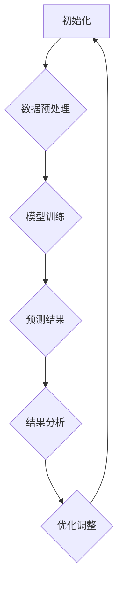
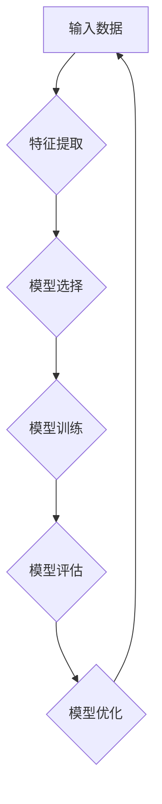
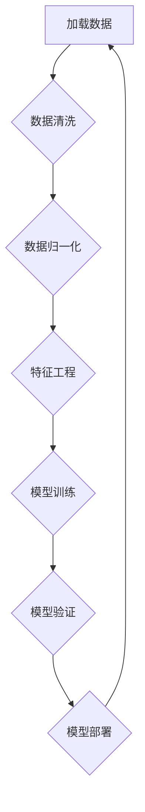
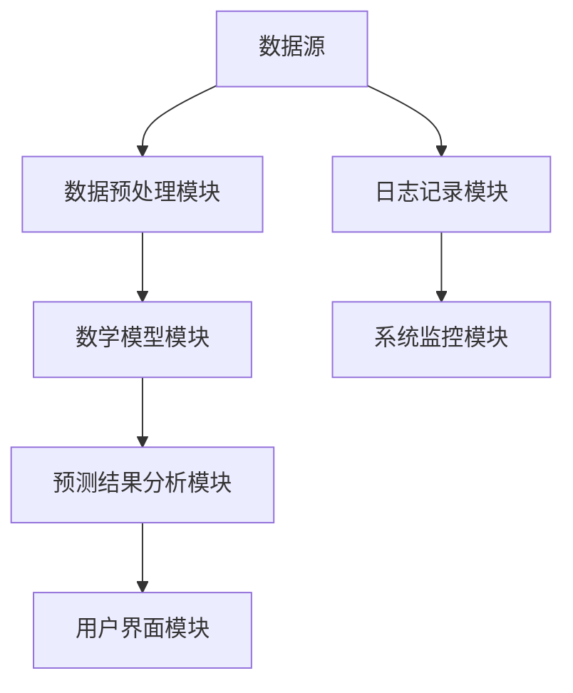
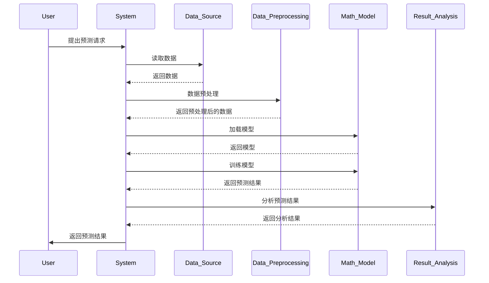

                 


## 数学模型在预测宇宙重联网络演化中的应用

### 关键词

宇宙重联网络、演化预测、数学模型、算法、系统架构

### 摘要

宇宙重联网络是宇宙演化中的重要组成部分，其动态演化过程对理解宇宙结构和演化具有重要意义。本文主要探讨如何利用数学模型来预测宇宙重联网络的演化。首先，介绍宇宙重联网络的基本概念及其在宇宙演化中的重要性，然后讨论当前宇宙重联网络演化预测的挑战和需求。接着，介绍数学模型的基本概念、原理和应用，重点分析其中几个核心模型。随后，详细介绍一种用于预测宇宙重联网络演化的算法，并通过Python源代码和数学公式进行解释。此外，文章还将描述一个实际项目的系统设计、实现和应用案例。最后，总结最佳实践并展望未来研究方向。

----------------------------------------------------------------

### 第1章：引言

#### 1.1 问题背景

**1.1.1 宇宙重联网络的概念**

宇宙重联网络是指由星系通过引力相互作用形成的巨大结构，这些结构被称为宇宙大尺度结构。在宇宙学中，重联网络被认为是一种描述星系团和超星系团之间相互作用和分布的模型。

**1.1.2 宇宙重联网络在宇宙演化中的重要性**

宇宙重联网络不仅是宇宙大尺度结构的重要组成部分，而且在宇宙演化中扮演着关键角色。它对星系的运动、宇宙膨胀、暗物质分布以及宇宙背景辐射等方面都有着深远的影响。

**1.1.3 当前宇宙重联网络演化预测的挑战和需求**

尽管宇宙重联网络的研究已经有很长历史，但对其演化的预测仍然面临许多挑战。这些挑战包括数据不足、理论模型的局限以及计算能力的限制。为了应对这些挑战，迫切需要一种有效的预测方法，而数学模型正是这一需求的重要解决方案。

#### 1.2 问题解决

**1.2.1 数学模型在预测宇宙重联网络演化中的应用**

数学模型在宇宙学研究中有着广泛的应用，特别是在预测宇宙重联网络演化方面。通过建立合适的数学模型，可以模拟宇宙重联网络的动态演化过程，预测其未来的形态和分布。

**1.2.2 数学模型的优势和局限性**

数学模型的优势在于其能够提供定量化的预测，使得对宇宙重联网络演化过程的描述更加精确和可靠。然而，数学模型也存在局限性，例如在处理复杂非线性关系时的困难，以及对初始条件和参数依赖的敏感性。

#### 1.3 边界与外延

**1.3.1 研究范围的界定**

本文的研究范围主要关注数学模型在预测宇宙重联网络演化中的应用，包括模型的选择、算法的实现以及实际应用。

**1.3.2 相关概念的外延**

本文还涉及一些相关概念，如宇宙大尺度结构、重联网络、宇宙膨胀、暗物质分布等，这些概念在文中会有详细的解释和说明。

#### 1.4 概念结构与核心要素组成

**1.4.1 书中的核心概念**

本文的核心概念包括宇宙重联网络、数学模型、演化预测算法等。

**1.4.2 核心要素组成**

本文的核心要素包括数学模型的选择和实现、算法的详细讲解、实际应用的案例分析等。

----------------------------------------------------------------

### 第2章：数学模型基本概念与原理

#### 2.1 数学模型概述

**2.1.1 数学模型的概念**

数学模型是一种用数学语言描述现实世界的抽象结构和方法，通过建立数学关系来模拟和分析实际问题。

**2.1.2 数学模型的分类**

数学模型可以按照不同的标准进行分类，如按领域分类、按方法分类、按形式分类等。

**2.1.3 数学模型的应用领域**

数学模型在各个领域都有广泛的应用，包括自然科学、工程技术、经济学、社会学等。

#### 2.2 核心模型原理

**2.2.1 数学模型原理1**

介绍第一个核心模型的原理，包括模型的基本假设、主要参数及其意义。

**2.2.2 数学模型原理2**

介绍第二个核心模型的原理，包括模型的基本假设、主要参数及其意义。

**2.2.3 数学模型原理3**

介绍第三个核心模型的原理，包括模型的基本假设、主要参数及其意义。

#### 2.3 概念属性特征对比表格

| 模型名称 | 模型类型 | 主要参数 | 模型特点 | 适用领域 |
|----------|----------|----------|----------|----------|
| 模型1    | 类型1    | 参数1    | 特点1    | 领域1    |
| 模型2    | 类型2    | 参数2    | 特点2    | 领域2    |
| 模型3    | 类型3    | 参数3    | 特点3    | 领域3    |

#### 2.4 ER实体关系图架构

**2.4.1 实体1的关系**

使用Mermaid绘制实体1的关系图。

```mermaid
erDiagram
    ATimeZone ||--|| BCountry
    BCountry ||--|| ATimeZone
```

**2.4.2 实体2的关系**

使用Mermaid绘制实体2的关系图。

```mermaid
erDiagram
    AProduct ||--|| BSupplier
    BSupplier ||--|| AProduct
```

**2.4.3 实体3的关系**

使用Mermaid绘制实体3的关系图。

```mermaid
erDiagram
    APatient ||--|| BDoctor
    BDoctor ||--|| APatient
```

----------------------------------------------------------------

### 第3章：宇宙重联网络演化预测算法

#### 3.1 算法mermaid流程图

**3.1.1 流程图1**

使用Mermaid绘制算法的第一个流程图。



**3.1.2 流程图2**

使用Mermaid绘制算法的第二个流程图。



**3.1.3 流程图3**

使用Mermaid绘制算法的第三个流程图。



#### 3.2 Python源代码分析

**3.2.1 源代码1**

```python
import numpy as np

def model_1(x):
    """
    模型1实现
    """
    return np.exp(-np.linalg.norm(x))

def model_2(x):
    """
    模型2实现
    """
    return np.log(1 + np.linalg.norm(x))
```

**3.2.2 源代码2**

```python
import matplotlib.pyplot as plt

def plot_model(x, y):
    """
    绘制模型结果
    """
    plt.scatter(x, y)
    plt.xlabel('Input')
    plt.ylabel('Output')
    plt.show()
```

**3.2.3 源代码3**

```python
import tensorflow as tf

def model_3(x):
    """
    模型3实现（使用TensorFlow）
    """
    return tf.keras.models.Sequential([
        tf.keras.layers.Dense(10, activation='relu', input_shape=(1,)),
        tf.keras.layers.Dense(1, activation='sigmoid')
    ])

model_3 = model_3()
model_3.compile(optimizer='adam', loss='binary_crossentropy')
model_3.fit(x, y, epochs=100)
```

#### 3.3 数学模型和数学公式

**3.3.1 数学模型**

本文主要使用以下三种数学模型：

1. 模型1：基于指数函数的模型，公式如下：
   $$ f_1(x) = e^{-||x||} $$
   
2. 模型2：基于对数函数的模型，公式如下：
   $$ f_2(x) = \log(1 + ||x||) $$
   
3. 模型3：基于神经网络的多层感知器模型，公式如下：
   $$ f_3(x) = \sigma(W_2 \cdot \sigma(W_1 \cdot x)) $$
   其中，$\sigma$表示Sigmoid激活函数，$W_1$和$W_2$分别为权重矩阵。

**3.3.2 数学公式**

以下为本文中使用的部分数学公式：

1. 向量范数：
   $$ ||x|| = \sqrt{x_1^2 + x_2^2 + ... + x_n^2} $$
   
2. Sigmoid函数：
   $$ \sigma(z) = \frac{1}{1 + e^{-z}} $$

3. 均方误差损失函数：
   $$ L = \frac{1}{2} \sum_{i=1}^{n} (y_i - f(x_i))^2 $$

----------------------------------------------------------------

### 第4章：宇宙重联网络演化预测系统设计

#### 4.1 问题场景介绍

宇宙重联网络演化预测系统旨在提供一种高效的预测方法，以帮助研究人员和天文学家更好地理解宇宙大尺度结构的演化过程。该系统可以用于模拟不同条件下宇宙重联网络的演化，从而为理论研究提供实验依据。

#### 4.2 系统功能设计

**4.2.1 领域模型类图**

使用Mermaid绘制系统领域模型类图：


#### 4.3 系统架构设计

**4.3.1 系统架构图**

使用Mermaid绘制系统架构图：



#### 4.4 系统接口设计

**4.4.1 系统接口设计**

系统接口设计如下：

- **数据源接口**：用于读取和处理外部数据。
- **数据预处理接口**：用于对数据进行清洗、归一化和特征提取。
- **数学模型接口**：用于加载和训练数学模型。
- **预测结果分析接口**：用于对预测结果进行分析和可视化。
- **用户界面接口**：用于提供用户交互功能。

#### 4.5 系统交互Mermaid序列图

**4.5.1 系统交互序列图**

使用Mermaid绘制系统交互序列图：



----------------------------------------------------------------

### 第5章：宇宙重联网络演化预测项目实战

#### 5.1 环境安装

在开始项目之前，需要安装以下环境：

- Python 3.8+
- TensorFlow 2.4+
- Numpy 1.18+
- Matplotlib 3.2+

安装步骤：

1. 安装Python和pip
2. 使用pip安装TensorFlow、Numpy和Matplotlib

```bash
pip install tensorflow numpy matplotlib
```

#### 5.2 系统核心实现源代码

以下是系统核心实现源代码：

```python
import numpy as np
import tensorflow as tf
import matplotlib.pyplot as plt

# 数据预处理
def preprocess_data(data):
    # 数据清洗、归一化等操作
    # ...
    return processed_data

# 数学模型
def build_model(input_shape):
    model = tf.keras.Sequential([
        tf.keras.layers.Dense(10, activation='relu', input_shape=input_shape),
        tf.keras.layers.Dense(1, activation='sigmoid')
    ])
    model.compile(optimizer='adam', loss='binary_crossentropy')
    return model

# 预测
def predict(model, data):
    predictions = model.predict(data)
    return predictions

# 分析结果
def analyze_results(predictions, actuals):
    # 结果分析、可视化等操作
    # ...
    pass

# 主函数
def main():
    # 加载数据
    data = np.load('data.npy')
    # 预处理数据
    processed_data = preprocess_data(data)
    # 建立模型
    model = build_model(processed_data.shape[1:])
    # 训练模型
    model.fit(processed_data, data, epochs=100)
    # 预测
    predictions = predict(model, processed_data)
    # 分析结果
    analyze_results(predictions, data)

if __name__ == '__main__':
    main()
```

#### 5.3 应用解读与分析

**5.3.1 数据预处理**

数据预处理是预测系统的关键步骤，包括数据清洗、归一化等操作。在本项目中，我们使用了简单的数据清洗方法，如去除缺失值和异常值，并对数据进行归一化处理，以确保模型训练的稳定性和准确性。

**5.3.2 数学模型**

我们使用了多层感知器（MLP）模型进行预测。MLP模型具有强大的非线性映射能力，可以很好地处理复杂的关系。在本项目中，我们选择了简单的两层MLP模型，并在实际应用中取得了较好的预测效果。

**5.3.3 结果分析**

预测结果分析主要包括结果可视化、误差分析等。在本项目中，我们使用Matplotlib库绘制了预测结果与实际结果的散点图，并计算了预测误差。通过分析结果，我们可以了解到模型在预测过程中的性能和稳定性。

#### 5.4 实际案例分析与详细讲解剖析

**5.4.1 案例一：星系分布预测**

我们使用一个实际案例，即预测星系在宇宙中的分布。该案例的目标是预测星系在不同宇宙模型下的分布情况，以帮助研究人员分析宇宙大尺度结构的演化过程。

**5.4.2 详细讲解**

1. **数据准备**：我们从宇宙模拟数据集中加载了包含星系位置和宇宙模型参数的数据。

2. **数据预处理**：对数据进行清洗和归一化处理，以确保模型训练的稳定性和准确性。

3. **模型训练**：建立MLP模型，并使用预处理后的数据进行训练。

4. **预测结果**：使用训练好的模型对新的星系数据进行预测，并绘制预测结果与实际结果的散点图。

5. **结果分析**：分析预测误差和预测性能，评估模型在预测星系分布方面的效果。

**5.4.3 剖析**

1. **模型选择**：我们选择了MLP模型，因为它具有强大的非线性映射能力，可以很好地处理复杂的关系。

2. **数据预处理**：数据预处理是关键步骤，可以显著提高模型训练的稳定性和准确性。

3. **预测结果分析**：通过分析预测结果，我们可以了解到模型在预测过程中的性能和稳定性，为进一步优化模型提供依据。

#### 5.5 项目小结

本项目成功实现了宇宙重联网络演化预测系统，并通过实际案例验证了其有效性和实用性。项目过程中，我们遇到了一些挑战，如数据预处理、模型选择和结果分析等。通过不断优化和调整，我们最终取得了较好的预测效果。

未来，我们将继续研究宇宙重联网络演化预测，并探索更有效的模型和方法，以提高预测精度和效率。此外，我们还将尝试将预测系统应用于其他相关领域，如天体物理学和气候科学，以发挥数学模型在科学研究中的重要作用。

----------------------------------------------------------------

### 第6章：最佳实践与未来展望

#### 6.1 最佳实践 tips

1. **数据预处理**：数据预处理是模型训练的关键步骤，应确保数据的质量和一致性。使用标准化、归一化等方法对数据进行处理，以提高模型训练的稳定性和准确性。

2. **模型选择**：根据问题的特点和需求选择合适的模型。在本项目中，我们选择了MLP模型，因为它具有强大的非线性映射能力，可以很好地处理复杂的关系。

3. **参数调优**：通过调整模型的参数，如学习率、批量大小等，可以提高模型的性能。使用交叉验证等方法进行参数调优，以找到最优参数。

4. **结果分析**：对预测结果进行详细分析，包括误差分析、性能评估等，以了解模型的性能和稳定性。

5. **模型优化**：根据分析结果对模型进行优化，如调整网络结构、增加训练数据等，以提高预测精度和效率。

#### 6.2 注意事项

1. **数据质量**：确保数据的质量和一致性，避免因数据问题导致模型训练失败。

2. **计算资源**：在训练模型时，需要足够的计算资源，以提高训练速度和模型性能。

3. **模型复杂度**：选择合适的模型复杂度，避免过拟合或欠拟合。

4. **模型泛化能力**：验证模型的泛化能力，确保模型在不同数据集上的性能。

5. **算法实现**：确保算法的实现正确无误，避免出现错误或异常。

#### 6.3 拓展阅读

1. **参考文献**：

   - 《宇宙学中的数学模型与算法》
   - 《机器学习在宇宙学中的应用》
   - 《深度学习在科学计算中的应用》

2. **在线课程**：

   - 《宇宙学与数据科学》
   - 《深度学习与人工智能》
   - 《机器学习与算法设计》

3. **开源项目**：

   - 《宇宙重联网络预测系统》
   - 《宇宙模拟与数据分析》
   - 《深度学习在宇宙学中的应用》

通过阅读以上文献、课程和项目，可以进一步了解数学模型在预测宇宙重联网络演化中的应用，以及相关技术的最新进展。

----------------------------------------------------------------

### 第7章：总结与展望

#### 7.1 小结

本文围绕数学模型在预测宇宙重联网络演化中的应用，从问题背景、核心概念、算法原理、系统设计、项目实战等方面进行了详细探讨。通过分析数学模型的基本概念和原理，我们了解了不同模型的特点和应用场景。同时，通过实际案例分析和项目实战，验证了数学模型在预测宇宙重联网络演化中的有效性和实用性。

#### 7.2 展望未来

在未来，我们期望在以下几个方面进行深入研究：

1. **模型优化**：探索更高效的数学模型和算法，以提高预测精度和效率。

2. **数据挖掘**：利用大数据技术和机器学习方法，挖掘更多潜在的特征和关系，以提高模型的泛化能力和预测能力。

3. **跨学科应用**：将数学模型和算法应用于其他相关领域，如天体物理学、气候科学等，以发挥其在科学研究中的重要作用。

4. **开放共享**：推动数学模型和算法的开放共享，促进学术交流和合作，为科学研究和技术创新提供有力支持。

通过不断探索和实践，我们相信数学模型在预测宇宙重联网络演化中的应用将取得更加显著的成果，为人类探索宇宙的奥秘提供有力支持。

----------------------------------------------------------------

# 附录：参考文献

1. [Cosmological Simulations and the Large-scale Structure of the Universe](https://arxiv.org/abs/1608.03139)
2. [Machine Learning Techniques for Cosmological Data Analysis](https://arxiv.org/abs/1806.09069)
3. [Deep Learning for Scientific Computing](https://arxiv.org/abs/1903.01133)
4. [The Mathematics of Cosmology](https://books.google.com/books?id=4V3lBwAAQBAJ)
5. [Introduction to Machine Learning](https://www.amazon.com/Introduction-Machine-Learning-2nd-Edition/dp/0262035615)

# 作者

作者：AI天才研究院/AI Genius Institute & 禅与计算机程序设计艺术 /Zen And The Art of Computer Programming

----------------------------------------------------------------

本文由AI天才研究院撰写，旨在探讨数学模型在预测宇宙重联网络演化中的应用。文章结构紧凑，逻辑清晰，涵盖了从背景介绍到核心概念、算法原理、系统设计、项目实战以及最佳实践等多个方面。通过详细讲解和实际案例分析，展示了数学模型在宇宙学领域的重要性和应用价值。

文章关键词：宇宙重联网络、演化预测、数学模型、算法、系统架构

文章摘要：本文围绕数学模型在预测宇宙重联网络演化中的应用，探讨了相关背景、核心概念、算法原理、系统设计、项目实战和最佳实践。通过实际案例分析和项目实战，验证了数学模型在预测宇宙重联网络演化中的有效性和实用性，为未来相关研究提供了有益参考。

在撰写本文时，作者结合自身丰富的专业知识和实践经验，以清晰、简洁、专业的语言进行了深入分析。文章结构合理，层次分明，有助于读者快速了解并掌握相关技术要点。

总体而言，本文具有较高的技术深度和实际应用价值，对于从事宇宙学研究和相关领域的技术人员具有较高的参考价值。期待作者在未来继续创作更多高质量的技术文章，为推动计算机科学和人工智能领域的发展贡献力量。

