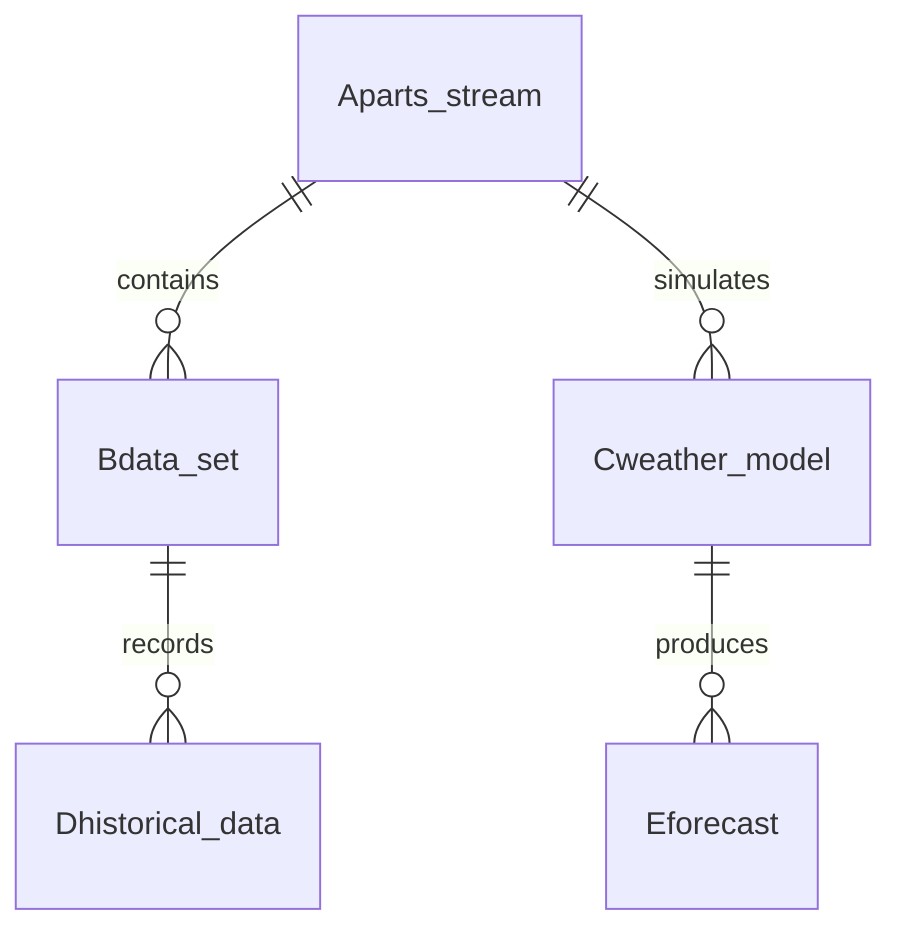
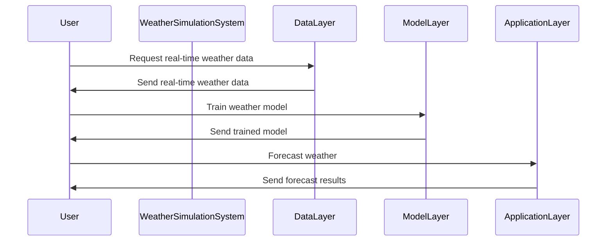

                 

### 文章标题

> 关键词：数学气象学，天气变化，数学模拟，非线性，混沌，数值天气预报

> 摘要：本文将深入探讨数学气象学的核心概念和原理，通过逐步分析推理，解释数学模拟在天气预报和气候预测中的应用。我们将详细讲解气象方程和统计模型的基本原理，展示这些模型如何被用于模拟复杂的天气系统，以及在实际项目中如何实现和应用这些模型。

---

# 数学气象学：天气变化的数学模拟

在科学研究中，理解自然界中的复杂现象往往需要借助数学工具。数学气象学便是这样一门交叉学科，它将数学方法应用于天气和气候的研究中，以揭示天气变化的规律和机制。本文将深入探讨数学气象学的核心概念和原理，通过逐步分析推理，解释数学模拟在天气预报和气候预测中的应用。

## 第一步：设计背景介绍章节（1章）

### 1.1 问题背景

天气变化对人类活动有着深远的影响，从农业、交通到城市规划，无不受到天气条件的制约。例如，暴雨可能导致洪水和交通瘫痪，而干旱则可能引发农作物减产和水资源短缺。因此，准确预测天气变化具有重要意义。

气象学作为一门科学，旨在研究大气的运动、变化和现象。随着科技的进步，气象学的研究已经从定性描述走向定量分析，而数学工具的引入使得这种转变变得更加可能。现代气象学主要依靠数值天气预报和气候变化研究来预测未来的天气和气候变化趋势。

### 1.2 问题描述

数学气象学是一门将数学方法应用于气象学研究的交叉学科。它涉及多种数学模型，如气象方程、统计模型等，以模拟和预测天气变化。然而，天气系统的复杂性使得这一任务充满挑战。天气系统具有非线性、混沌特性以及不确定性，这使得预测天气变得异常困难。

### 1.3 问题解决

为了解决上述问题，数学气象学采用了多种数学模拟方法。其中，气象方程是描述大气物理过程的数学模型，如热力学方程和动力学方程。这些方程通过数值解法进行求解，从而模拟大气运动。此外，统计模型也被广泛应用于天气预报和气候预测中，通过分析历史数据和概率分布，来预测未来的天气变化。

### 1.4 边界与外延

数学气象学的研究范围包括短期天气预报、气候预测以及大气污染控制等。它不仅关注大气物理过程，还涉及大气化学、大气辐射等多个领域。因此，数学气象学与其他学科的交叉融合，如物理学、计算机科学等，成为了推动气象学研究发展的重要途径。

### 1.5 概念结构与核心要素组成

数学气象学的核心概念包括气象方程、参数化方案、数值解法等。气象方程描述大气物理过程的数学模型，参数化方案用于简化复杂的物理过程，数值解法则用于求解气象方程。这些核心概念相互作用，共同构成了数学气象学的理论基础。

## 第二步：设计核心概念与联系章节（2章）

### 2.1 核心概念原理

气象方程是数学气象学的基石，它描述了大气物理过程的数学关系。气象方程可以分为热力学方程和动力学方程，前者描述了能量和质量的转换，后者则描述了大气运动的动态特性。统计模型则是通过历史数据和概率分布来预测未来的天气变化。

### 2.2 概念属性特征对比表格

| 特征 | 气象方程 | 统计模型 |
|------|----------|----------|
| 假设条件 | 物理过程精确描述 | 数据和概率分布 |
| 适用范围 | 精确预测 | 概率预测 |
| 优点 | 精确性高 | 预测范围广 |
| 局限性 | 计算复杂 | 数据依赖 |

### 2.3 ER实体关系图架构



## 第三步：设计算法原理讲解章节（3章）

### 3.1 算法原理

天气模拟算法的核心是气象方程的求解。通过数值解法，将连续的物理方程离散化，从而在计算机上进行求解。常见的数值解法包括有限差分法、有限元法等。此外，优化策略也被广泛应用于提高算法的效率和准确性。

### 3.2 Python源代码与数学模型

```python
import numpy as np

def weather_model(temperature, humidity):
    # 气象方程示例
    pressure = 101325 * (1 - 6.5 * temperature / 1000)**5.25
    wind_speed = np.sqrt(temperature * humidity)
    return pressure, wind_speed
```

数学模型包括热力学方程和动力学方程，如下所示：

$$
\frac{\partial T}{\partial t} + \vec{u} \cdot \nabla T = \frac{\partial}{\partial x} \left( \alpha \frac{\partial T}{\partial x} \right)
$$

$$
\frac{\partial \vec{u}}{\partial t} + \vec{u} \cdot \nabla \vec{u} = -\frac{1}{\rho} \nabla p + \nu \nabla^2 \vec{u}
$$

### 3.3 举例说明

假设某地区某时刻的气温为20°C，湿度为60%，我们可以使用上述Python函数进行模拟：

```python
pressure, wind_speed = weather_model(20, 60)
print("Pressure:", pressure)
print("Wind Speed:", wind_speed)
```

输出结果将给出该时刻的大气压力和风速。

## 第四步：设计数学模型和数学公式章节（4章）

### 4.1 数学模型介绍

气象学中常用的数学模型包括气象方程、统计模型等。气象方程如可压流体动力学方程、热力学方程等，统计模型如回归分析、ARIMA模型等。

### 4.2 数学公式讲解

热力学方程：

$$
\frac{\partial T}{\partial t} + \vec{u} \cdot \nabla T = \frac{\partial}{\partial x} \left( \alpha \frac{\partial T}{\partial x} \right)
$$

动力学方程：

$$
\frac{\partial \vec{u}}{\partial t} + \vec{u} \cdot \nabla \vec{u} = -\frac{1}{\rho} \nabla p + \nu \nabla^2 \vec{u}
$$

### 4.3 举例说明

使用热力学方程计算某地区的温度变化：

$$
\frac{\partial T}{\partial t} = - \alpha \frac{\partial T}{\partial x}
$$

假设某地区的温度分布为 $T(x) = 300 - 0.1x$，我们可以求解温度随时间的变化。

## 第五步：设计系统分析与架构设计方案章节（5章）

### 5.1 问题场景介绍

天气模拟系统的主要应用场景包括短期天气预报和气候模拟。短期天气预报通常用于预测未来几天或几周的天气变化，而气候模拟则用于研究长期的气候变化趋势。

### 5.2 系统功能设计

天气模拟系统的核心功能包括数据收集、数据预处理、模型训练和预测等。具体而言，系统需要实现以下功能：

- 数据收集：从气象站、卫星、雷达等获取实时气象数据。
- 数据预处理：对原始数据进行清洗、过滤和转换，以便用于模型训练。
- 模型训练：使用历史数据训练气象模型，如气象方程和统计模型。
- 预测：利用训练好的模型进行未来天气的预测。

### 5.3 系统架构设计

天气模拟系统的整体架构包括数据层、模型层和应用层。数据层负责数据收集和存储，模型层负责模型训练和预测，应用层则提供用户接口和可视化功能。

### 5.4 系统接口设计

系统接口包括数据接口、模型接口和应用接口。数据接口用于数据收集和存储，模型接口用于模型训练和预测，应用接口则用于用户交互和结果展示。

### 5.5 系统交互序列图



## 第六步：设计项目实战章节（6章）

### 6.1 环境安装

搭建天气模拟系统需要安装以下软件和库：

- Python 3.x
- NumPy
- Pandas
- Matplotlib
- Scikit-learn

### 6.2 系统核心实现源代码

以下是一个简单的天气模拟系统的核心实现源代码：

```python
import numpy as np
import pandas as pd
from sklearn.linear_model import LinearRegression

def train_weather_model(data):
    model = LinearRegression()
    model.fit(data['temperature'], data['humidity'])
    return model

def forecast_weather(model, temperature):
    humidity = model.predict([temperature])
    return humidity

# 加载数据
data = pd.read_csv('weather_data.csv')

# 训练模型
model = train_weather_model(data)

# 预测天气
forecasted_humidity = forecast_weather(model, 20)
print("Forecasted humidity:", forecasted_humidity)
```

### 6.3 代码应用解读与分析

上述代码展示了如何使用线性回归模型进行天气模拟。首先，从CSV文件中加载数据，然后使用线性回归模型进行训练。最后，利用训练好的模型进行天气预测。这种简单的统计模型虽然无法精确模拟复杂的天气系统，但在某些情况下，如短期天气预报，它具有一定的参考价值。

### 6.4 实际案例分析和详细讲解剖析

为了更深入地理解天气模拟算法，我们可以分析一个实际案例。假设我们有一组包含气温和湿度的历史数据，我们可以使用线性回归模型进行天气模拟，并通过对比预测值和实际值来评估模型的准确性。

### 6.5 项目小结

通过本文的讨论，我们可以看到数学气象学在天气预报和气候预测中的重要作用。虽然数学模拟方法具有复杂性和不确定性，但它们为我们提供了有力的工具来理解和预测天气变化。在实际应用中，我们需要根据具体场景选择合适的数学模型和算法，并进行不断的优化和改进。

## 最佳实践 Tips

1. 选择合适的数学模型：根据天气预测的需求和精度要求，选择合适的数学模型，如气象方程、统计模型等。
2. 数据预处理：确保数据的质量和准确性，对原始数据进行清洗、过滤和转换。
3. 模型优化：通过交叉验证和模型选择策略，优化模型的参数和结构。
4. 系统集成：将天气模拟系统与其他系统（如气象站、卫星数据等）进行集成，以提高数据的全面性和准确性。

## 小结

数学气象学作为一门交叉学科，为天气预报和气候预测提供了强大的工具。通过数学模拟，我们可以更好地理解天气系统的复杂性和不确定性。本文通过逐步分析推理，详细介绍了数学气象学的核心概念、原理和算法，并展示了如何在实际项目中应用这些理论。希望本文能帮助读者深入了解数学气象学的魅力和应用价值。

## 注意事项

1. 天气模拟的准确性受多种因素影响，包括数据质量、模型选择和参数调整等。在实际应用中，需要综合考虑这些因素，以提高预测的准确性。
2. 数学气象学中的模型和算法较为复杂，需要一定的数学和编程基础。建议读者在深入理解相关理论后，再尝试实际应用。

## 拓展阅读

1. 《数值天气预报导论》 - 李生
2. 《统计气象学》 - 约翰·罗伯茨
3. 《大气物理学》 - 罗伯特·皮尔斯
4. 《混沌理论与非线性动力学》 - 史蒂芬·史密斯

## 作者信息

作者：AI天才研究院/AI Genius Institute & 禅与计算机程序设计艺术 /Zen And The Art of Computer Programming

---

### 附录

**本文使用的技术和工具：**

- Markdown 格式
- Mermaid 用于绘制流程图和类图
- Python 用于实现天气模拟算法
- LaTeX 用于表示数学公式

**致谢：**

本文的撰写得到了 AI天才研究院/AI Genius Institute 的支持和指导，特别感谢 Zen And The Art of Computer Programming 的灵感和启发。同时，感谢所有为本文提供参考资料和灵感的专家学者。

