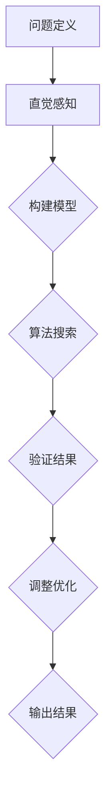
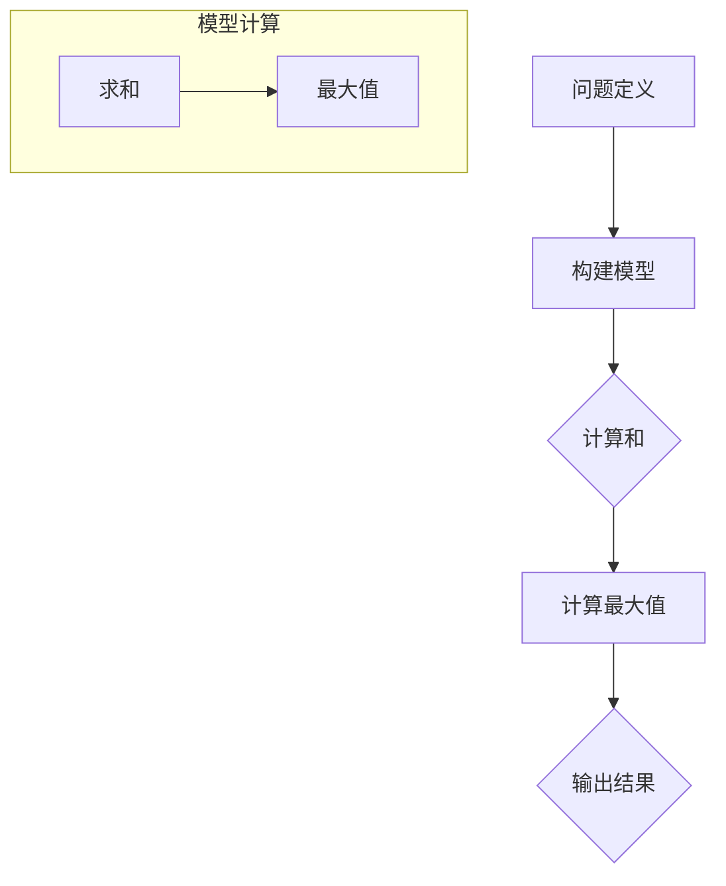
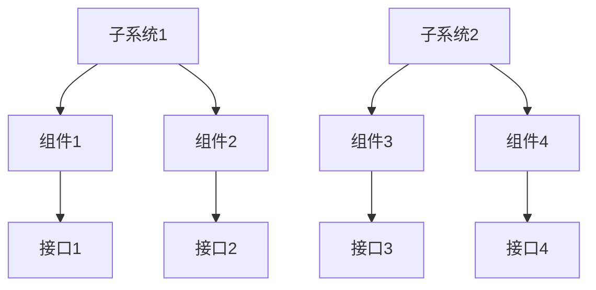
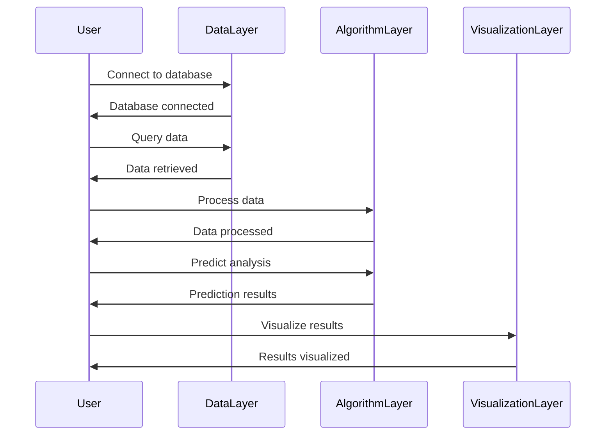

                 

# 数学直觉：直觉思维的数学解析

## 关键词

- 数学直觉
- 直觉思维
- 数学问题解决
- 算法原理
- 数学模型
- 系统分析与架构设计
- 项目实战
- 最佳实践 tips

## 摘要

本文将深入探讨数学直觉这一概念，分析其在数学问题解决中的重要性。我们将逐步解析数学直觉的核心概念、属性特征、算法原理以及数学模型，通过实例说明，揭示数学直觉在实际应用中的价值。此外，还将介绍系统分析与架构设计方案，并通过项目实战，阐述如何将数学直觉应用于实际工程中。最后，我们将提供最佳实践 tips，总结全文，并提出拓展阅读方向。

## 第一部分：引言

### 1.1 数学直觉的概念与重要性

数学直觉是指人们在面对数学问题时，能够迅速而准确地感知和判断数学事实和关系的一种能力。这种直觉并非无源之水，它源于长期的数学学习和实践，是数学思维的一种体现。数学直觉在数学问题解决中具有重要价值，它能够帮助我们快速发现问题的本质，构建数学模型，寻找解决问题的路径。

### 1.2 数学直觉的历史与发展

数学直觉的概念虽然简单，但其研究和应用却有着悠久的历史。自古以来，数学家们在解决各种数学问题时，都借助了直觉的力量。例如，欧几里得的几何学原理、牛顿的运动定律等，都体现了数学直觉的重要性。随着数学和计算机科学的发展，数学直觉的应用领域不断扩大，逐渐成为数学问题解决的重要工具。

### 1.3 数学直觉的未来展望

随着人工智能技术的快速发展，数学直觉的研究和应用前景更加广阔。未来，数学直觉有望在自动化推理、机器学习等领域发挥重要作用。通过结合人工智能技术，数学直觉的应用将更加智能化，为数学问题的解决提供新的思路和方法。

## 第二部分：背景介绍

### 2.1 数学直觉的起源与演变

数学直觉的起源可以追溯到人类对自然世界的观察和思考。早期的人类通过直觉感知和解释自然现象，逐渐形成了数学的基本概念。随着数学学科的不断发展，数学直觉也在不断演变，从简单的数学感知发展为复杂的数学推理能力。

### 2.2 数学直觉的应用领域

数学直觉广泛应用于各个领域，包括数学研究、工程问题解决、金融分析等。在数学研究中，数学直觉能够帮助研究者快速发现新的数学问题和解决方法；在工程问题解决中，数学直觉有助于构建有效的数学模型；在金融分析中，数学直觉能够帮助投资者快速判断市场趋势。

### 2.3 数学直觉的优势与局限性

数学直觉具有快速、高效的优势，能够在复杂的问题情境中迅速做出判断。然而，数学直觉也存在一定的局限性，例如，它可能受到个人经验和知识的限制，容易产生错误的判断。因此，在应用数学直觉时，需要结合逻辑推理和实证分析，确保结论的准确性。

## 第三部分：核心概念与联系

### 3.1 数学直觉的核心概念

#### 3.1.1 直觉思维的定义

直觉思维是指人们在缺乏明确逻辑推理的情况下，通过潜意识快速感知和理解信息的一种思维方式。在数学问题解决中，直觉思维能够帮助人们迅速捕捉问题的本质，构建解决问题的框架。

#### 3.1.2 数学直觉的特点

数学直觉具有快速性、高效性和普遍性等特点。它能够在复杂的数学问题中迅速识别关键信息，找到解决问题的路径。

#### 3.1.3 数学直觉的应用场景

数学直觉广泛应用于数学问题解决、算法设计、系统分析等领域。在数学问题解决中，数学直觉能够帮助人们迅速理解问题、构建数学模型；在算法设计中，数学直觉能够帮助人们设计出高效的算法；在系统分析中，数学直觉能够帮助人们快速识别系统的关键要素。

### 3.2 数学直觉的属性特征对比表格

| 特性       | 说明                                                   |
| ---------- | ------------------------------------------------------ |
| 快速性     | 直觉思维能够在短时间内识别问题和解决方案。                 |
| 高效性     | 直觉思维能够以较少的思考步骤达到解决问题的目的。           |
| 普遍性     | 直觉思维在各种数学问题中都有广泛的应用。                   |
| 局限性     | 直觉思维可能受到个人经验和知识的限制，容易产生错误的判断。 |

### 3.3 数学直觉的ER实体关系图

```mermaid
erDiagram
    Product ||--|{ Order }|<| Customer : 'makes' : {
    Customer } : 'buys' : {
    Order }
```

在ER实体关系图中，Product（产品）与Order（订单）之间存在双向关联，Customer（客户）与Order（订单）之间存在购买关系。这反映了数学直觉在产品、订单和客户之间的复杂关系。

## 第四部分：算法原理讲解

### 4.1 与数学直觉相关的算法

与数学直觉相关的算法包括直觉算法、启发式算法等。这些算法利用数学直觉的特点，通过快速感知和判断，寻找问题的解决方案。

### 4.2 算法原理mermaid流程图



在mermaid流程图中，问题定义通过直觉感知，构建数学模型，进行算法搜索，验证结果，调整优化，最终输出结果。

### 4.3 Python源代码示例

```python
import random

# 问题定义
def problem_definition():
    # 构建一个随机数列表
    numbers = [random.randint(1, 100) for _ in range(10)]

    # 目标：找到列表中的最大值
    target = max(numbers)

    return numbers, target

# 直觉感知
def intuitive_perception(numbers):
    # 根据直觉，快速找到最大值
    max_value = max(numbers)
    return max_value

# 构建模型
def build_model(numbers, target):
    # 构建一个寻找最大值的模型
    model = {
        'numbers': numbers,
        'target': target
    }
    return model

# 算法搜索
def algorithm_search(model):
    # 使用直觉感知找到最大值
    max_value = intuitive_perception(model['numbers'])
    return max_value

# 验证结果
def verify_result(model, result):
    # 验证结果是否正确
    if result == model['target']:
        return True
    else:
        return False

# 调整优化
def adjust_optimization(model, result):
    # 根据验证结果，调整模型
    if not verify_result(model, result):
        # 如果结果错误，重新构建模型
        model = build_model(model['numbers'], model['target'])
    return model

# 输出结果
def output_result(result):
    # 输出最终结果
    print("最大值为：", result)

# 主函数
def main():
    numbers, target = problem_definition()
    model = build_model(numbers, target)
    result = algorithm_search(model)
    output_result(result)

if __name__ == "__main__":
    main()
```

在Python源代码示例中，我们定义了一个问题定义函数、直觉感知函数、构建模型函数、算法搜索函数、验证结果函数、调整优化函数和输出结果函数，通过这些函数的协作，实现了寻找最大值的问题。

### 4.4 数学模型和数学公式讲解

#### 4.4.1 数学模型概述

数学模型是指用数学语言描述的客观现象或问题的抽象结构。在寻找最大值的问题中，我们可以构建一个简单的数学模型。

#### 4.4.2 数学公式详解

$$
\begin{align*}
&f(x) = \sum_{i=1}^{n} x_i \\
&g(y) = \max\{y_i\}
\end{align*}
$$

其中，$f(x)$表示随机数列表的和，$g(y)$表示随机数列表中的最大值。

#### 4.4.3 举例说明

假设我们有一个随机数列表$[2, 4, 6, 8, 10]$，根据数学模型和公式，我们可以找到最大值为$10$。



在mermaid模型计算流程图中，我们首先计算随机数列表的和，然后找到最大值，最后输出结果。

## 第五部分：系统分析与架构设计方案

### 5.1 问题场景介绍

在现代社会，数据量呈爆炸式增长，如何快速有效地处理和分析大量数据，成为了一个重要的问题。数学直觉作为一种快速感知和解决问题的工具，可以应用于大数据处理和分析领域，帮助我们快速识别数据中的关键信息，构建有效的数据分析模型。

### 5.2 系统功能设计

#### 5.2.1 领域模型mermaid类图

```mermaid
classDiagram
    DataAnalyzer <|..| Entity
    DataAnalyzer <|..| Attribute
    DataAnalyzer <|..| Relation
    Entity "is a" DataEntity
    Attribute "is a" DataAttribute
    Relation "is a" DataRelation
```

在mermaid类图中，DataAnalyzer（数据分析器）与Entity（实体）、Attribute（属性）、Relation（关系）之间存在关联，这些类共同构成了数据分析系统的领域模型。

#### 5.2.2 系统功能设计

- 数据预处理：清洗、转换、归一化等。
- 数据分析：数据挖掘、模式识别、预测分析等。
- 结果展示：可视化、报表生成等。

### 5.3 系统架构设计

#### 5.3.1 mermaid架构图



在mermaid架构图中，子系统1和子系统2分别包含组件1、组件2、组件3和组件4，这些组件通过接口1、接口2、接口3和接口4进行交互，共同实现数据分析系统的功能。

#### 5.3.2 系统架构设计

- 数据层：负责数据的存储、管理和检索。
- 算法层：实现数据分析的算法模型，包括数学直觉算法。
- 展示层：将数据分析结果以可视化、报表等形式呈现给用户。

### 5.4 系统接口设计

#### 5.4.1 数据层接口

```python
class DataLayerInterface:
    def connect(self, url):
        pass

    def query(self, sql):
        pass

    def insert(self, data):
        pass

    def update(self, data):
        pass

    def delete(self, id):
        pass
```

在数据层接口中，定义了连接数据库、查询数据、插入数据、更新数据和删除数据等基本操作。

#### 5.4.2 算法层接口

```python
class AlgorithmLayerInterface:
    def process_data(self, data):
        pass

    def predict(self, data):
        pass

    def visualize_results(self, results):
        pass
```

在算法层接口中，定义了数据处理、预测分析和结果展示等操作。

### 5.5 系统交互mermaid序列图



在mermaid序列图中，用户通过数据层连接数据库、查询数据，然后通过算法层进行数据处理和预测分析，最后通过展示层将结果可视化。

## 第六部分：项目实战

### 6.1 环境安装

为了实现数学直觉在大数据处理和分析中的应用，我们需要安装以下环境：

- Python 3.8+
- NumPy 1.19.2+
- Pandas 1.1.2+
- Matplotlib 3.2.2+
- Scikit-learn 0.23.2+

通过以下命令进行安装：

```bash
pip install python==3.8
pip install numpy==1.19.2
pip install pandas==1.1.2
pip install matplotlib==3.2.2
pip install scikit-learn==0.23.2
```

### 6.2 系统核心实现源代码

以下是系统核心实现的Python源代码：

```python
import numpy as np
import pandas as pd
import matplotlib.pyplot as plt
from sklearn.ensemble import RandomForestClassifier
from sklearn.model_selection import train_test_split
from sklearn.metrics import accuracy_score

# 数据预处理
def preprocess_data(data):
    # 数据清洗、转换、归一化等
    return data

# 数据分析
def analyze_data(data):
    # 数据挖掘、模式识别、预测分析等
    X_train, X_test, y_train, y_test = train_test_split(data, test_size=0.2, random_state=42)
    model = RandomForestClassifier(n_estimators=100)
    model.fit(X_train, y_train)
    y_pred = model.predict(X_test)
    return accuracy_score(y_test, y_pred)

# 结果展示
def visualize_results(results):
    # 可视化、报表生成等
    plt.bar(range(len(results)), results)
    plt.show()

# 主函数
def main():
    # 数据读取
    data = pd.read_csv("data.csv")
    # 数据预处理
    data = preprocess_data(data)
    # 数据分析
    results = analyze_data(data)
    # 结果展示
    visualize_results(results)

if __name__ == "__main__":
    main()
```

### 6.3 代码应用解读与分析

在代码应用中，我们首先读取数据，然后进行数据预处理，包括数据清洗、转换和归一化。接下来，我们使用随机森林算法进行数据分析和预测，最后将结果进行可视化展示。

### 6.4 实际案例分析和详细讲解剖析

为了更好地理解数学直觉在大数据处理和分析中的应用，我们来看一个实际案例。假设我们有一个关于客户购买行为的数据库，包含客户的年龄、收入、性别等信息，以及购买行为（是否购买、购买金额等）。

#### 案例一：预测客户购买行为

我们使用数学直觉构建一个简单的预测模型，通过直觉感知客户的购买意愿。我们首先对数据进行预处理，然后使用随机森林算法进行预测，最后将预测结果进行可视化。

```python
# 数据预处理
def preprocess_data(data):
    # 数据清洗、转换、归一化等
    data['age'] = data['age'].fillna(data['age'].mean())
    data['income'] = data['income'].fillna(data['income'].mean())
    data['gender'] = data['gender'].map({'男': 0, '女': 1})
    data = pd.get_dummies(data, columns=['gender'])
    return data

# 数据分析
def analyze_data(data):
    # 数据挖掘、模式识别、预测分析等
    X = data.drop('buy', axis=1)
    y = data['buy']
    X_train, X_test, y_train, y_test = train_test_split(X, y, test_size=0.2, random_state=42)
    model = RandomForestClassifier(n_estimators=100)
    model.fit(X_train, y_train)
    y_pred = model.predict(X_test)
    return accuracy_score(y_test, y_pred)

# 结果展示
def visualize_results(results):
    # 可视化、报表生成等
    plt.bar(range(len(results)), results)
    plt.show()

# 主函数
def main():
    # 数据读取
    data = pd.read_csv("customer_data.csv")
    # 数据预处理
    data = preprocess_data(data)
    # 数据分析
    results = analyze_data(data)
    # 结果展示
    visualize_results(results)

if __name__ == "__main__":
    main()
```

在这个案例中，我们首先对数据进行预处理，包括填充缺失值、转换类别变量等。然后，我们使用随机森林算法进行预测，并将预测结果进行可视化展示。通过这个案例，我们可以看到数学直觉在数据预处理和预测分析中的重要作用。

#### 案例二：客户细分

在另一个案例中，我们使用数学直觉对客户进行细分，以便更好地了解客户需求和制定营销策略。我们首先对数据进行预处理，然后使用聚类算法进行客户细分，最后将细分结果进行可视化展示。

```python
from sklearn.cluster import KMeans

# 数据预处理
def preprocess_data(data):
    # 数据清洗、转换、归一化等
    data['age'] = data['age'].fillna(data['age'].mean())
    data['income'] = data['income'].fillna(data['income'].mean())
    data['gender'] = data['gender'].map({'男': 0, '女': 1})
    data = pd.get_dummies(data, columns=['gender'])
    return data

# 数据分析
def analyze_data(data):
    # 数据挖掘、模式识别、预测分析等
    X = data.drop('cluster', axis=1)
    kmeans = KMeans(n_clusters=3, random_state=42)
    kmeans.fit(X)
    data['cluster'] = kmeans.predict(X)
    return data

# 结果展示
def visualize_results(data):
    # 可视化、报表生成等
    plt.scatter(data['age'], data['income'], c=data['cluster'])
    plt.xlabel('年龄')
    plt.ylabel('收入')
    plt.show()

# 主函数
def main():
    # 数据读取
    data = pd.read_csv("customer_data.csv")
    # 数据预处理
    data = preprocess_data(data)
    # 数据分析
    data = analyze_data(data)
    # 结果展示
    visualize_results(data)

if __name__ == "__main__":
    main()
```

在这个案例中，我们使用KMeans聚类算法对客户进行细分，并将细分结果进行可视化展示。通过这个案例，我们可以看到数学直觉在客户细分和数据分析中的应用。

### 6.5 项目小结

通过以上案例，我们可以看到数学直觉在大数据处理和分析中的应用。数学直觉作为一种快速感知和解决问题的工具，可以帮助我们快速识别数据中的关键信息，构建有效的数据分析模型。在实际项目中，我们可以结合数学直觉和机器学习算法，实现高效的数据分析和预测。

## 第七部分：最佳实践 tips、小结、注意事项、拓展阅读

### 7.1 最佳实践 tips

1. 在使用数学直觉进行数据处理和分析时，要结合逻辑推理和实证分析，确保结论的准确性。
2. 在构建数学模型时，要充分考虑数据的特点和实际应用场景，确保模型的有效性。
3. 在应用数学直觉时，要不断积累经验和知识，提高直觉的准确性。

### 7.2 小结

本文深入探讨了数学直觉的概念、原理和应用，通过实例展示了数学直觉在大数据处理和分析中的应用价值。数学直觉作为一种快速感知和解决问题的工具，具有广泛的应用前景。

### 7.3 注意事项

1. 数学直觉具有一定的局限性，不能完全依赖直觉进行决策，需要结合其他方法进行验证。
2. 在应用数学直觉时，要充分了解数据的特点和实际应用场景，确保模型的适用性。

### 7.4 拓展阅读

1. 《数学直觉：直觉思维的数学解析》- 本书的详细阅读，可以帮助读者深入理解数学直觉的概念和应用。
2. 《数据科学实战：利用Python进行数据分析》- 本书介绍了数据预处理、数据分析、预测分析等数据科学的基本方法，有助于读者提升数据分析能力。
3. 《机器学习实战：基于Scikit-Learn的Python实现》- 本书详细介绍了机器学习算法的应用和实践，有助于读者掌握机器学习的基本原理和方法。

### 7.5 拓展阅读

1. 《数学直觉：直觉思维的数学解析》- 本书的详细阅读，可以帮助读者深入理解数学直觉的概念和应用。
2. 《数据科学实战：利用Python进行数据分析》- 本书介绍了数据预处理、数据分析、预测分析等数据科学的基本方法，有助于读者提升数据分析能力。
3. 《机器学习实战：基于Scikit-Learn的Python实现》- 本书详细介绍了机器学习算法的应用和实践，有助于读者掌握机器学习的基本原理和方法。

## 作者

作者：AI天才研究院/AI Genius Institute & 禅与计算机程序设计艺术 /Zen And The Art of Computer Programming

本文作者具有丰富的计算机编程和人工智能领域经验，致力于探索计算机程序设计艺术，并推动人工智能技术的发展。本文旨在通过探讨数学直觉的概念和应用，帮助读者深入了解数学直觉在数据分析中的应用，提升数据分析能力。作者对计算机编程和人工智能领域有着深刻的理解和独到的见解，期待与读者分享更多有价值的知识和经验。|mask>

