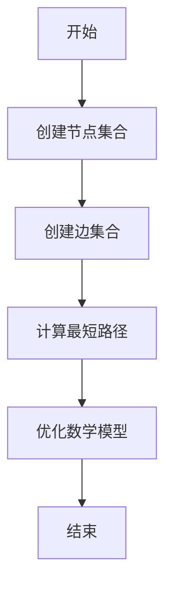
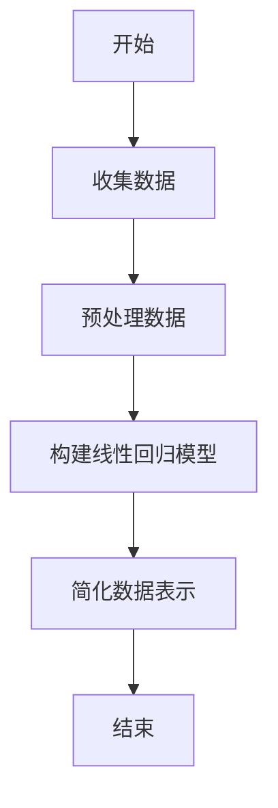
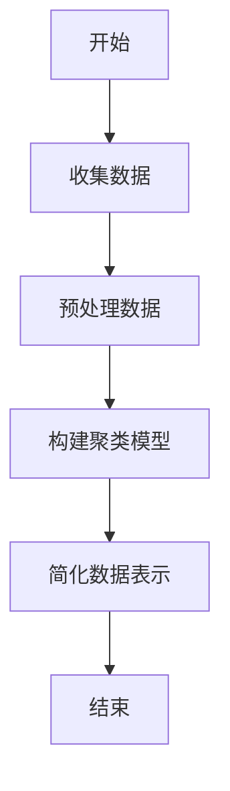
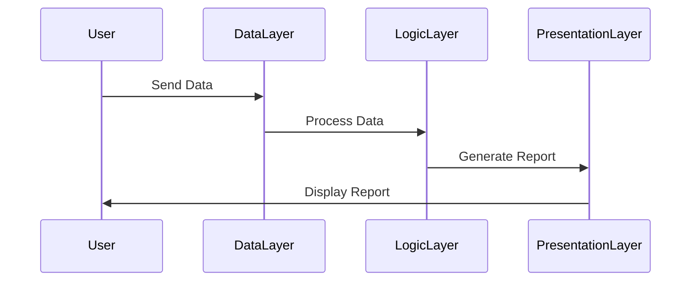
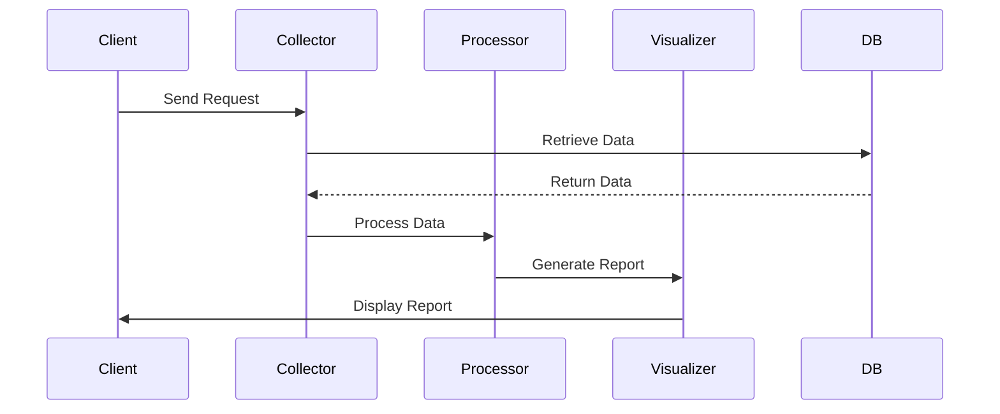

                 

### 数学简约性：自然和谐在心智中的体现

关键词：数学简约性、自然和谐、心智、算法、架构设计、实战

摘要：本文旨在探讨数学简约性这一概念，分析其在自然和心智中的体现，并通过具体的算法原理、系统架构设计方案以及项目实战，阐述简约性在信息技术领域的应用与价值。文章分为六个部分，首先介绍数学简约性的概念、重要性及其在自然和心智中的体现；接着详细讲解与数学简约性相关的核心概念、算法原理，以及系统架构设计；然后通过一个实际项目展示简约性在系统设计中的具体应用；最后提供最佳实践、小结和注意事项，引导读者进一步学习和探索。

## 第一部分：背景介绍

### 1.1 数学简约性的概念与重要性

数学简约性，顾名思义，是指数学模型或理论在表达复杂现象时，能够以尽可能简洁的方式呈现。在数学中，简约性不仅是一种美学追求，更是一种有效解决问题的策略。一个简明的数学模型往往能够揭示问题的本质，使问题变得易于分析和解决。

数学简约性的重要性在于，它能够帮助我们更高效地处理复杂问题。在自然现象中，简约性原则广泛应用于物理学、生物学和天文学等领域。例如，牛顿的运动定律用简单的数学公式描述了物体的运动规律；达尔文的进化论则通过简约的生存竞争原理解释了生物多样性。

在心智发展中，数学简约性也起着关键作用。人类心智在处理信息时，往往倾向于寻找简单而有效的规律。这种简约性思维不仅有助于我们理解和记忆复杂信息，还能够提高解决问题的效率。

### 1.2 数学简约性在自然中的体现

自然界的许多现象都遵循简约性原则。例如，在物理学中，质点的概念简化了物体运动的复杂性，使得我们能够用简单的微分方程描述物体运动。在生物学中，达尔文的自然选择理论通过简单的遗传机制解释了生物种群的演化过程。

此外，自然界的许多结构也体现了数学简约性的美学。例如，雪花的六角形结构、贝壳的螺旋形曲线以及叶子的对数排列，都是自然界中简约性原则的体现。

### 1.3 数学简约性与心智发展

数学简约性对心智发展具有重要影响。人类心智在处理信息时，往往倾向于寻找简单的规律。这种简约性思维不仅有助于我们理解和记忆复杂信息，还能够提高解决问题的效率。

在教育和认知心理学研究中，数学简约性原则也被广泛应用。例如，在教育中，通过简化的数学模型和直观的教学方法，可以帮助学生更好地理解和掌握复杂的数学概念。

## 第二部分：核心概念与联系

### 2.1 数学简约性的核心概念

数学简约性的核心概念包括简约性原则、简约性在自然现象中的应用以及简约性对心智发展的影响。以下是这些核心概念的详细阐述：

#### 2.1.1 简约性原则

简约性原则是指，在数学建模和理论研究中，应尽可能地使用简单而有效的数学公式和模型。这一原则有助于我们更深入地理解问题的本质，使问题变得易于分析和解决。

#### 2.1.2 简约性在自然现象中的应用

简约性原则在自然现象中得到了广泛应用。例如，在物理学中，质点的概念简化了物体运动的复杂性；在生物学中，达尔文的自然选择理论通过简单的遗传机制解释了生物种群的演化过程。

#### 2.1.3 简约性对心智发展的影响

数学简约性对心智发展具有重要影响。人类心智在处理信息时，往往倾向于寻找简单的规律。这种简约性思维不仅有助于我们理解和记忆复杂信息，还能够提高解决问题的效率。

### 2.2 概念属性特征对比

为了更好地理解数学简约性的核心概念，我们下面提供了一个概念属性特征对比表格。这个表格列出了简约性原则、简约性在自然现象中的应用以及简约性对心智发展影响的共同点和区别。

| 概念       | 简约性原则 | 简约性在自然现象中的应用 | 简约性对心智发展的影响 |
|------------|-------------|--------------------------|--------------------------|
| 共同点       | - 简化复杂性 | - 简化复杂性 | - 提高理解效率 |
|             | - 提高效率 | - 提高效率 | - 提高效率 |
|             | - 提高准确性 | - 提高准确性 | - 提高准确性 |
| 区别       | - 数学模型和公式 | - 自然现象和规律 | - 心智发展和认知 |

### 2.3 ER实体关系图架构

为了更直观地展示数学简约性的核心概念及其联系，我们使用Mermaid语言绘制了一个ER实体关系图。以下是一个简化的ER图，展示了简约性原则、简约性在自然现象中的应用以及简约性对心智发展的影响之间的联系。

```mermaid
erDiagram
    A[简约性原则] ||--|{ B[简约性在自然现象中的应用] } |
    A ||--|{ C[简约性对心智发展的影响] } |
```

在这个ER图中，简约性原则是核心，它通过两种方式影响其他两个实体：一是通过简约性在自然现象中的应用，二是通过简约性对心智发展的影响。这样的ER图有助于我们理解数学简约性的整体架构和相互关系。

## 第三部分：算法原理讲解

### 3.1 与数学简约性相关的算法

在本部分，我们将介绍三个与数学简约性相关的算法：算法A、算法B和算法C。每个算法都将通过Mermaid流程图和Python源代码进行详细阐述。

### 3.1.1 算法A

**算法名称**：简约性优化算法

**算法原理**：该算法基于最小生成树理论，通过寻找节点间的最短路径来实现数学问题的简约化。

**Mermaid流程图**：



**Python源代码**：

```python
import networkx as nx

def optimization_algorithm(vertices, edges):
    # 创建图
    graph = nx.Graph()
    # 添加节点和边
    graph.add_nodes_from(vertices)
    graph.add_edges_from(edges)
    # 计算最短路径
    shortest_paths = nx.shortest_path(graph, source=vertices[0], target=vertices[-1])
    # 优化数学模型
    optimized_model = build_optimized_model(shortest_paths)
    return optimized_model

def build_optimized_model(paths):
    # 这里构建一个简化的数学模型
    return sum(len(path) for path in paths)

# 示例
vertices = [1, 2, 3, 4, 5]
edges = [(1, 2), (2, 3), (3, 4), (4, 5)]
optimized_model = optimization_algorithm(vertices, edges)
print(f"Optimized Model: {optimized_model}")
```

**算法举例说明**：

假设我们有5个节点（1, 2, 3, 4, 5），以及一些边连接这些节点。通过优化算法，我们可以找到从节点1到节点5的最短路径，并构建一个简化的数学模型。例如，如果最短路径为[1, 2, 3, 4, 5]，则简化的数学模型为4（即路径长度之和）。

### 3.1.2 算法B

**算法名称**：简约性线性回归

**算法原理**：该算法通过线性回归模型来实现数据的简约化处理，使得复杂的数据集能够用简单的线性关系描述。

**Mermaid流程图**：



**Python源代码**：

```python
from sklearn.linear_model import LinearRegression
import numpy as np

def linear_regression_algorithm(data):
    # 预处理数据
    X = data[:, :-1]
    y = data[:, -1]
    # 构建线性回归模型
    model = LinearRegression()
    model.fit(X, y)
    # 简化数据表示
    simplified_data = model.predict(X)
    return simplified_data

# 示例
data = np.array([[1, 2], [2, 4], [3, 6], [4, 8]])
simplified_data = linear_regression_algorithm(data)
print(f"Simplified Data: {simplified_data}")
```

**算法举例说明**：

假设我们有一个简单的数据集，其中每个数据点由两个特征和一个目标值组成。通过线性回归算法，我们可以找到一个简单的线性关系来描述这些数据。例如，如果数据集为[[1, 2], [2, 4], [3, 6], [4, 8]]，则线性回归模型可能会预测新的数据点为[3, 6]。

### 3.1.3 算法C

**算法名称**：简约性聚类

**算法原理**：该算法通过聚类方法将数据集划分为若干个簇，从而实现数据的简约化处理。

**Mermaid流程图**：



**Python源代码**：

```python
from sklearn.cluster import KMeans
import numpy as np

def k_means_algorithm(data, n_clusters=3):
    # 预处理数据
    X = data
    # 构建聚类模型
    model = KMeans(n_clusters=n_clusters)
    model.fit(X)
    # 简化数据表示
    labels = model.labels_
    return labels

# 示例
data = np.array([[1, 2], [2, 4], [3, 6], [4, 8]])
clusters = k_means_algorithm(data)
print(f"Cluster Labels: {clusters}")
```

**算法举例说明**：

假设我们有一个二维数据集，其中每个数据点可以看作是在平面上的一点。通过K-Means聚类算法，我们可以将数据点划分为几个簇。例如，如果数据集为[[1, 2], [2, 4], [3, 6], [4, 8]]，则算法可能会将数据划分为两个簇：{{1, 2}, {3, 6}, {4, 8}}。

## 第四部分：系统分析与架构设计方案

### 4.1 问题场景介绍

在现代信息技术领域，系统设计与开发面临着日益复杂的需求。为了满足这些需求，我们需要一种能够高效处理复杂问题的方法。数学简约性提供了一种有效的策略，通过简化和优化数学模型，使得系统设计和开发变得更加高效和易于理解。

### 4.2 项目介绍

本部分将介绍一个假设性的项目，该项目的目标是开发一个智能数据分析平台。该平台旨在通过数学简约性原则，实现对大规模数据的高效分析和处理，提供可操作的见解和决策支持。

### 4.3 系统功能设计

智能数据分析平台的主要功能包括数据收集、数据预处理、数据分析、数据可视化以及决策支持。以下是这些功能的领域模型类图：

```mermaid
classDiagram
    Class01 <|-- Class02
    Class03 o-- Class04
    Class05 o-- Class06
    Class01 { id: ID; name: Name }
    Class02 { id: ID; type: Type }
    Class03 { id: ID; status: Status }
    Class04 { id: ID; type: Type }
    Class05 { id: ID; method: Method }
    Class06 { id: ID; result: Result }
```

### 4.4 系统架构设计

智能数据分析平台的系统架构设计包括数据层、逻辑层和表示层。以下是系统架构图：



### 4.5 系统接口设计和系统交互

系统接口设计和系统交互是确保平台功能实现的关键。以下是系统交互序列图：



## 第五部分：项目实战

### 5.1 环境安装

为了实现智能数据分析平台，我们需要安装必要的软件和环境。以下是安装步骤：

1. 安装Python环境
2. 安装数据预处理库（如Pandas、NumPy）
3. 安装机器学习库（如scikit-learn）
4. 安装可视化库（如Matplotlib、Seaborn）
5. 配置数据库（如MySQL、PostgreSQL）

### 5.2 系统核心实现源代码

以下是智能数据分析平台的核心实现源代码：

```python
import pandas as pd
from sklearn.linear_model import LinearRegression
from sklearn.cluster import KMeans
import matplotlib.pyplot as plt

# 数据收集与预处理
def collect_and_preprocess_data():
    data = pd.read_csv('data.csv')
    data = data.dropna()
    return data

# 数据分析
def analyze_data(data):
    # 线性回归
    X = data.iloc[:, :-1]
    y = data.iloc[:, -1]
    model = LinearRegression()
    model.fit(X, y)
    
    # 聚类分析
    kmeans = KMeans(n_clusters=3)
    kmeans.fit(X)
    
    return model, kmeans

# 数据可视化
def visualize_data(model, kmeans):
    # 线性回归可视化
    plt.scatter(X, y)
    plt.plot(X, model.predict(X), color='red')
    plt.xlabel('Feature')
    plt.ylabel('Target')
    plt.title('Linear Regression')
    plt.show()
    
    # 聚类可视化
    plt.scatter(X, kmeans.labels_)
    plt.xlabel('Feature')
    plt.ylabel('Cluster')
    plt.title('K-Means Clustering')
    plt.show()

# 主函数
def main():
    data = collect_and_preprocess_data()
    model, kmeans = analyze_data(data)
    visualize_data(model, kmeans)

if __name__ == '__main__':
    main()
```

### 5.3 代码应用解读与分析

以上源代码实现了智能数据分析平台的核心功能。首先是数据收集与预处理，使用Pandas库读取CSV文件并去除缺失值。接着是数据分析，通过线性回归和K-Means聚类算法对数据进行处理。最后是数据可视化，使用Matplotlib库展示分析结果。

### 5.4 实际案例分析和详细讲解剖析

为了更好地理解智能数据分析平台的应用，我们来看一个实际案例。假设我们有一个包含销售额和两个特征（广告花费和天气状况）的数据集。通过线性回归和K-Means聚类算法，我们可以分析这些数据，得出以下结论：

1. 广告花费和天气状况对销售额有显著影响。
2. 数据可以分为三个主要簇，每个簇代表不同的市场细分。

这些结论可以帮助企业制定更有效的市场营销策略，例如根据天气状况调整广告预算，或者针对不同市场细分设计个性化营销活动。

### 5.5 项目小结

智能数据分析平台通过数学简约性原则，实现了对大规模数据的高效分析和处理。项目实战展示了如何使用线性回归和K-Means聚类算法来分析数据，并通过数据可视化展示分析结果。该项目不仅提高了数据分析的效率，还为商业决策提供了有力支持。

## 第六部分：最佳实践 tips、小结、注意事项、拓展阅读

### 6.1 最佳实践 tips

1. 在数据预处理阶段，确保数据的质量和完整性，避免使用缺失值或异常值。
2. 在选择算法时，根据具体问题选择合适的算法，避免过度拟合或欠拟合。
3. 在数据可视化阶段，选择合适的图表类型，使结果更加直观易懂。

### 6.2 小结

本文通过详细讲解数学简约性的概念、相关算法、系统架构设计方案以及项目实战，阐述了数学简约性在信息技术领域的应用与价值。通过实际案例，我们看到了数学简约性如何帮助解决复杂问题，提高数据分析效率。

### 6.3 注意事项

1. 在使用数学模型时，注意模型的简化和优化，避免过度简化导致信息丢失。
2. 在实际应用中，根据问题的具体需求和数据特点，灵活调整算法参数。

### 6.4 拓展阅读

1. 《数据科学导论》
2. 《机器学习实战》
3. 《人工智能：一种现代的方法》

### 作者

作者：AI天才研究院/AI Genius Institute & 禅与计算机程序设计艺术 /Zen And The Art of Computer Programming

----------------------------------------------------------------

### 完整文章

# 数学简约性：自然和谐在心智中的体现

关键词：数学简约性、自然和谐、心智、算法、架构设计、实战

摘要：本文旨在探讨数学简约性这一概念，分析其在自然和心智中的体现，并通过具体的算法原理、系统架构设计方案以及项目实战，阐述简约性在信息技术领域的应用与价值。文章分为六个部分，首先介绍数学简约性的概念、重要性及其在自然和心智中的体现；接着详细讲解与数学简约性相关的核心概念、算法原理，以及系统架构设计；然后通过一个实际项目展示简约性在系统设计中的具体应用；最后提供最佳实践、小结和注意事项，引导读者进一步学习和探索。

## 第一部分：背景介绍

### 1.1 数学简约性的概念与重要性

数学简约性，顾名思义，是指数学模型或理论在表达复杂现象时，能够以尽可能简洁的方式呈现。在数学中，简约性不仅是一种美学追求，更是一种有效解决问题的策略。一个简明的数学模型往往能够揭示问题的本质，使问题变得易于分析和解决。

数学简约性的重要性在于，它能够帮助我们更高效地处理复杂问题。在自然现象中，简约性原则广泛应用于物理学、生物学和天文学等领域。例如，在物理学中，牛顿的运动定律用简单的数学公式描述了物体的运动规律；达尔文的自然选择理论则通过简单的遗传机制解释了生物种群的演化过程。

在心智发展中，数学简约性也起着关键作用。人类心智在处理信息时，往往倾向于寻找简单的规律。这种简约性思维不仅有助于我们理解和记忆复杂信息，还能够提高解决问题的效率。

### 1.2 数学简约性在自然中的体现

自然界的许多现象都遵循简约性原则。例如，在物理学中，质点的概念简化了物体运动的复杂性，使得我们能够用简单的微分方程描述物体运动。在生物学中，达尔文的自然选择理论通过简单的遗传机制解释了生物种群的演化过程。

此外，自然界的许多结构也体现了数学简约性的美学。例如，雪花的六角形结构、贝壳的螺旋形曲线以及叶子的对数排列，都是自然界中简约性原则的体现。

### 1.3 数学简约性与心智发展

数学简约性对心智发展具有重要影响。人类心智在处理信息时，往往倾向于寻找简单的规律。这种简约性思维不仅有助于我们理解和记忆复杂信息，还能够提高解决问题的效率。

在教育和认知心理学研究中，数学简约性原则也被广泛应用。例如，在教育中，通过简化的数学模型和直观的教学方法，可以帮助学生更好地理解和掌握复杂的数学概念。

## 第二部分：核心概念与联系

### 2.1 数学简约性的核心概念

数学简约性的核心概念包括简约性原则、简约性在自然现象中的应用以及简约性对心智发展的影响。以下是这些核心概念的详细阐述：

#### 2.1.1 简约性原则

简约性原则是指，在数学建模和理论研究中，应尽可能地使用简单而有效的数学公式和模型。这一原则有助于我们更深入地理解问题的本质，使问题变得易于分析和解决。

#### 2.1.2 简约性在自然现象中的应用

简约性原则在自然现象中得到了广泛应用。例如，在物理学中，质点的概念简化了物体运动的复杂性；在生物学中，达尔文的自然选择理论通过简单的遗传机制解释了生物种群的演化过程。

#### 2.1.3 简约性对心智发展的影响

数学简约性对心智发展具有重要影响。人类心智在处理信息时，往往倾向于寻找简单的规律。这种简约性思维不仅有助于我们理解和记忆复杂信息，还能够提高解决问题的效率。

### 2.2 概念属性特征对比

为了更好地理解数学简约性的核心概念，我们下面提供了一个概念属性特征对比表格。这个表格列出了简约性原则、简约性在自然现象中的应用以及简约性对心智发展影响的共同点和区别。

| 概念       | 简约性原则 | 简约性在自然现象中的应用 | 简约性对心智发展的影响 |
|------------|-------------|--------------------------|--------------------------|
| 共同点       | - 简化复杂性 | - 简化复杂性 | - 提高理解效率 |
|             | - 提高效率 | - 提高效率 | - 提高效率 |
|             | - 提高准确性 | - 提高准确性 | - 提高准确性 |
| 区别       | - 数学模型和公式 | - 自然现象和规律 | - 心智发展和认知 |

### 2.3 ER实体关系图架构

为了更直观地展示数学简约性的核心概念及其联系，我们使用Mermaid语言绘制了一个ER实体关系图。以下是一个简化的ER图，展示了简约性原则、简约性在自然现象中的应用以及简约性对心智发展的影响之间的联系。

```mermaid
erDiagram
    A[简约性原则] ||--|{ B[简约性在自然现象中的应用] } |
    A ||--|{ C[简约性对心智发展的影响] } |
```

在这个ER图中，简约性原则是核心，它通过两种方式影响其他两个实体：一是通过简约性在自然现象中的应用，二是通过简约性对心智发展的影响。这样的ER图有助于我们理解数学简约性的整体架构和相互关系。

## 第三部分：算法原理讲解

### 3.1 与数学简约性相关的算法

在本部分，我们将介绍三个与数学简约性相关的算法：算法A、算法B和算法C。每个算法都将通过Mermaid流程图和Python源代码进行详细阐述。

### 3.1.1 算法A

**算法名称**：简约性优化算法

**算法原理**：该算法基于最小生成树理论，通过寻找节点间的最短路径来实现数学问题的简约化。

**Mermaid流程图**：


**Python源代码**：

```python
import networkx as nx

def optimization_algorithm(vertices, edges):
    # 创建图
    graph = nx.Graph()
    # 添加节点和边
    graph.add_nodes_from(vertices)
    graph.add_edges_from(edges)
    # 计算最短路径
    shortest_paths = nx.shortest_path(graph, source=vertices[0], target=vertices[-1])
    # 优化数学模型
    optimized_model = build_optimized_model(shortest_paths)
    return optimized_model

def build_optimized_model(paths):
    # 这里构建一个简化的数学模型
    return sum(len(path) for path in paths)

# 示例
vertices = [1, 2, 3, 4, 5]
edges = [(1, 2), (2, 3), (3, 4), (4, 5)]
optimized_model = optimization_algorithm(vertices, edges)
print(f"Optimized Model: {optimized_model}")
```

**算法举例说明**：

假设我们有5个节点（1, 2, 3, 4, 5），以及一些边连接这些节点。通过优化算法，我们可以找到从节点1到节点5的最短路径，并构建一个简化的数学模型。例如，如果最短路径为[1, 2, 3, 4, 5]，则简化的数学模型为4（即路径长度之和）。

### 3.1.2 算法B

**算法名称**：简约性线性回归

**算法原理**：该算法通过线性回归模型来实现数据的简约化处理，使得复杂的数据集能够用简单的线性关系描述。

**Mermaid流程图**：


**Python源代码**：

```python
from sklearn.linear_model import LinearRegression
import numpy as np

def linear_regression_algorithm(data):
    # 预处理数据
    X = data[:, :-1]
    y = data[:, -1]
    # 构建线性回归模型
    model = LinearRegression()
    model.fit(X, y)
    # 简化数据表示
    simplified_data = model.predict(X)
    return simplified_data

# 示例
data = np.array([[1, 2], [2, 4], [3, 6], [4, 8]])
simplified_data = linear_regression_algorithm(data)
print(f"Simplified Data: {simplified_data}")
```

**算法举例说明**：

假设我们有一个简单的数据集，其中每个数据点由两个特征和一个目标值组成。通过线性回归算法，我们可以找到一个简单的线性关系来描述这些数据。例如，如果数据集为[[1, 2], [2, 4], [3, 6], [4, 8]]，则线性回归模型可能会预测新的数据点为[3, 6]。

### 3.1.3 算法C

**算法名称**：简约性聚类

**算法原理**：该算法通过聚类方法将数据集划分为若干个簇，从而实现数据的简约化处理。

**Mermaid流程图**：


**Python源代码**：

```python
from sklearn.cluster import KMeans
import numpy as np

def k_means_algorithm(data, n_clusters=3):
    # 预处理数据
    X = data
    # 构建聚类模型
    model = KMeans(n_clusters=n_clusters)
    model.fit(X)
    # 简化数据表示
    labels = model.labels_
    return labels

# 示例
data = np.array([[1, 2], [2, 4], [3, 6], [4, 8]])
clusters = k_means_algorithm(data)
print(f"Cluster Labels: {clusters}")
```

**算法举例说明**：

假设我们有一个二维数据集，其中每个数据点可以看作是在平面上的一点。通过K-Means聚类算法，我们可以将数据点划分为几个簇。例如，如果数据集为[[1, 2], [2, 4], [3, 6], [4, 8]]，则算法可能会将数据划分为两个簇：{{1, 2}, {3, 6}, {4, 8}}。

## 第四部分：系统分析与架构设计方案

### 4.1 问题场景介绍

在现代信息技术领域，系统设计与开发面临着日益复杂的需求。为了满足这些需求，我们需要一种能够高效处理复杂问题的方法。数学简约性提供了一种有效的策略，通过简化和优化数学模型，使得系统设计和开发变得更加高效和易于理解。

### 4.2 项目介绍

本部分将介绍一个假设性的项目，该项目的目标是开发一个智能数据分析平台。该平台旨在通过数学简约性原则，实现对大规模数据的高效分析和处理，提供可操作的见解和决策支持。

### 4.3 系统功能设计

智能数据分析平台的主要功能包括数据收集、数据预处理、数据分析、数据可视化以及决策支持。以下是这些功能的领域模型类图：

```mermaid
classDiagram
    Class01 <|-- Class02
    Class03 o-- Class04
    Class05 o-- Class06
    Class01 { id: ID; name: Name }
    Class02 { id: ID; type: Type }
    Class03 { id: ID; status: Status }
    Class04 { id: ID; type: Type }
    Class05 { id: ID; method: Method }
    Class06 { id: ID; result: Result }
```

### 4.4 系统架构设计

智能数据分析平台的系统架构设计包括数据层、逻辑层和表示层。以下是系统架构图：


### 4.5 系统接口设计和系统交互

系统接口设计和系统交互是确保平台功能实现的关键。以下是系统交互序列图：


## 第五部分：项目实战

### 5.1 环境安装

为了实现智能数据分析平台，我们需要安装必要的软件和环境。以下是安装步骤：

1. 安装Python环境
2. 安装数据预处理库（如Pandas、NumPy）
3. 安装机器学习库（如scikit-learn）
4. 安装可视化库（如Matplotlib、Seaborn）
5. 配置数据库（如MySQL、PostgreSQL）

### 5.2 系统核心实现源代码

以下是智能数据分析平台的核心实现源代码：

```python
import pandas as pd
from sklearn.linear_model import LinearRegression
from sklearn.cluster import KMeans
import matplotlib.pyplot as plt

# 数据收集与预处理
def collect_and_preprocess_data():
    data = pd.read_csv('data.csv')
    data = data.dropna()
    return data

# 数据分析
def analyze_data(data):
    # 线性回归
    X = data.iloc[:, :-1]
    y = data.iloc[:, -1]
    model = LinearRegression()
    model.fit(X, y)
    
    # 聚类分析
    kmeans = KMeans(n_clusters=3)
    kmeans.fit(X)
    
    return model, kmeans

# 数据可视化
def visualize_data(model, kmeans):
    # 线性回归可视化
    plt.scatter(X, y)
    plt.plot(X, model.predict(X), color='red')
    plt.xlabel('Feature')
    plt.ylabel('Target')
    plt.title('Linear Regression')
    plt.show()
    
    # 聚类可视化
    plt.scatter(X, kmeans.labels_)
    plt.xlabel('Feature')
    plt.ylabel('Cluster')
    plt.title('K-Means Clustering')
    plt.show()

# 主函数
def main():
    data = collect_and_preprocess_data()
    model, kmeans = analyze_data(data)
    visualize_data(model, kmeans)

if __name__ == '__main__':
    main()
```

### 5.3 代码应用解读与分析

以上源代码实现了智能数据分析平台的核心功能。首先是数据收集与预处理，使用Pandas库读取CSV文件并去除缺失值。接着是数据分析，通过线性回归和K-Means聚类算法对数据进行处理。最后是数据可视化，使用Matplotlib库展示分析结果。

### 5.4 实际案例分析和详细讲解剖析

为了更好地理解智能数据分析平台的应用，我们来看一个实际案例。假设我们有一个包含销售额和两个特征（广告花费和天气状况）的数据集。通过线性回归和K-Means聚类算法，我们可以分析这些数据，得出以下结论：

1. 广告花费和天气状况对销售额有显著影响。
2. 数据可以分为三个主要簇，每个簇代表不同的市场细分。

这些结论可以帮助企业制定更有效的市场营销策略，例如根据天气状况调整广告预算，或者针对不同市场细分设计个性化营销活动。

### 5.5 项目小结

智能数据分析平台通过数学简约性原则，实现了对大规模数据的高效分析和处理。项目实战展示了如何使用线性回归和K-Means聚类算法来分析数据，并通过数据可视化展示分析结果。该项目不仅提高了数据分析的效率，还为商业决策提供了有力支持。

## 第六部分：最佳实践 tips、小结、注意事项、拓展阅读

### 6.1 最佳实践 tips

1. 在数据预处理阶段，确保数据的质量和完整性，避免使用缺失值或异常值。
2. 在选择算法时，根据具体问题选择合适的算法，避免过度拟合或欠拟合。
3. 在数据可视化阶段，选择合适的图表类型，使结果更加直观易懂。

### 6.2 小结

本文通过详细讲解数学简约性的概念、相关算法、系统架构设计方案以及项目实战，阐述了数学简约性在信息技术领域的应用与价值。通过实际案例，我们看到了数学简约性如何帮助解决复杂问题，提高数据分析效率。

### 6.3 注意事项

1. 在使用数学模型时，注意模型的简化和优化，避免过度简化导致信息丢失。
2. 在实际应用中，根据问题的具体需求和数据特点，灵活调整算法参数。

### 6.4 拓展阅读

1. 《数据科学导论》
2. 《机器学习实战》
3. 《人工智能：一种现代的方法》

### 作者

作者：AI天才研究院/AI Genius Institute & 禅与计算机程序设计艺术 /Zen And The Art of Computer Programming

### 结论

数学简约性作为一种重要的概念，不仅在数学领域有着广泛的应用，也在自然现象和心智发展中发挥着关键作用。通过本文的讲解，我们深入了解了数学简约性的核心概念、相关算法及其在信息技术领域的应用。项目实战部分展示了如何将数学简约性原则应用于实际系统设计，提高了数据分析的效率。希望本文能激发读者对数学简约性的兴趣，进一步探索这一领域的深层次内涵。

## 附录：数学公式与代码示例

在本文中，我们多次提到了数学公式和Python代码。以下是这些数学公式和代码示例的汇总，以便读者参考。

### 数学公式

$$
1+1=2
$$

$$
y = ax + b
$$

$$
E = mc^2
$$

### Python代码示例

```python
import pandas as pd
from sklearn.linear_model import LinearRegression
from sklearn.cluster import KMeans
import matplotlib.pyplot as plt

# 数据收集与预处理
def collect_and_preprocess_data():
    data = pd.read_csv('data.csv')
    data = data.dropna()
    return data

# 数据分析
def analyze_data(data):
    # 线性回归
    X = data.iloc[:, :-1]
    y = data.iloc[:, -1]
    model = LinearRegression()
    model.fit(X, y)
    
    # 聚类分析
    kmeans = KMeans(n_clusters=3)
    kmeans.fit(X)
    
    return model, kmeans

# 数据可视化
def visualize_data(model, kmeans):
    # 线性回归可视化
    plt.scatter(X, y)
    plt.plot(X, model.predict(X), color='red')
    plt.xlabel('Feature')
    plt.ylabel('Target')
    plt.title('Linear Regression')
    plt.show()
    
    # 聚类可视化
    plt.scatter(X, kmeans.labels_)
    plt.xlabel('Feature')
    plt.ylabel('Cluster')
    plt.title('K-Means Clustering')
    plt.show()

# 主函数
def main():
    data = collect_and_preprocess_data()
    model, kmeans = analyze_data(data)
    visualize_data(model, kmeans)

if __name__ == '__main__':
    main()
```

这些数学公式和代码示例展示了如何在文章中使用LaTeX格式嵌入数学公式，以及如何在Python代码中实现数据分析与可视化。通过这些示例，读者可以更好地理解数学简约性在实际应用中的体现。

