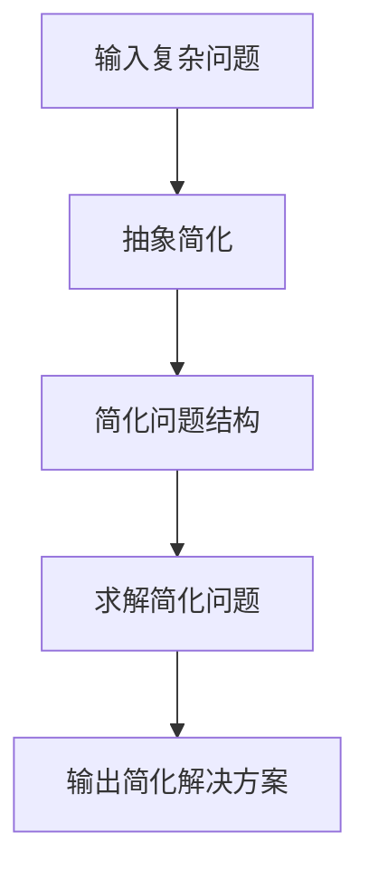
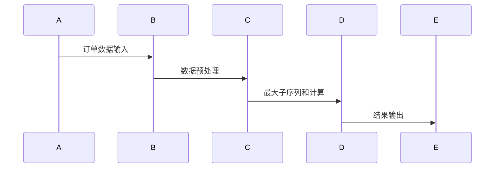

                 

## 数学简约性：自然和谐的心智表达

### 关键词

- 数学简约性
- 自然与心智表达
- 算法原理
- 数学模型
- 系统架构
- 项目实战

### 摘要

本文旨在探讨数学简约性这一概念，解析其在自然和心智表达中的应用。通过详细分析数学简约性的核心概念、算法原理、数学模型以及系统架构，我们试图揭示这一原理在信息技术和人工智能领域的深远影响。文章将以项目实战为例，展示数学简约性在实际开发中的应用，并提供最佳实践和注意事项，为读者提供一个全面而深入的理解。

## 第一部分：数学简约性概述

### 1.1 问题背景与核心概念

在信息技术和人工智能领域，数学简约性是一个至关重要的概念。它不仅仅是一种数学上的简化，更是对复杂性问题的一种思维方式。简约性强调通过精简的形式和结构，揭示事物的本质和内在规律，从而使得问题解决更加高效和直观。在这个部分，我们将探讨数学简约性的问题背景，并定义其核心概念。

#### 问题背景

在现代社会，随着信息技术的迅猛发展，数据的复杂性不断增加。如何在大量数据中找到有效信息和规律，成为许多领域亟待解决的问题。数学简约性作为一种强大的工具，可以帮助我们从复杂的数据中提取关键信息，简化问题，使其更容易理解和解决。

#### 核心概念

数学简约性的核心概念包括：

1. **简化与抽象**：通过对问题进行抽象和简化，将复杂问题转化为更易处理的形式。
2. **本质揭示**：通过简约性，我们可以揭示事物的本质特征和内在规律。
3. **高效性**：简约性使得问题解决更加高效，减少了计算和推理的复杂性。

### 1.2 数学简约性的概念与特征

数学简约性是指在保证信息完整性的前提下，通过简化的形式和结构，揭示事物的本质特征和内在规律。其特征包括：

1. **简洁性**：简约性追求简洁性，通过最简单的形式表达最复杂的问题。
2. **直观性**：简约性使得问题更加直观，便于理解和操作。
3. **高效性**：简约性提高了问题解决的效率，减少了计算和推理的时间。

### 1.3 数学简约性的应用领域

数学简约性在多个领域有着广泛的应用：

1. **计算机科学**：算法设计、数据结构优化、编程语言设计等。
2. **人工智能**：机器学习、深度学习、神经网络等。
3. **数学理论**：数论、代数、几何等。
4. **工程学**：结构设计、系统优化等。
5. **经济学**：模型建立、预测分析等。

## 第二部分：数学简约性的核心概念与联系

### 2.1 数学简约性的基本原理

数学简约性的基本原理包括：

1. **抽象与简化**：通过抽象和简化，将复杂问题转化为更易处理的形式。
2. **信息保留**：在简化的过程中，保留关键信息，确保问题解决的准确性。
3. **结构优化**：通过优化问题结构，提高问题解决的效率。

### 2.2 数学简约性的属性特征对比

以下是一个简单的对比表格，展示了数学简约性的主要属性特征：

| 特征         | 描述                                                         |
| ------------ | ------------------------------------------------------------ |
| **简洁性**   | 追求最简形式表达复杂问题。                                   |
| **直观性**   | 使得问题更加直观，便于理解和操作。                           |
| **高效性**   | 提高问题解决效率，减少计算和推理时间。                       |
| **普适性**   | 可以应用于多个领域和问题。                                   |
| **灵活性**   | 根据具体问题进行灵活调整。                                   |

### 2.3 数学简约性的ER实体关系图架构

以下是一个ER实体关系图，展示了数学简约性的核心概念和联系：

```mermaid
erDiagram
    Customer ||--|{ Order }|-- Merchant
    Customer ||--|{ Product }|-- Merchant
    Merchant ||--|{ Review }|-- Customer
```

在这个ER图中，`Customer`（客户）、`Merchant`（商家）、`Order`（订单）、`Product`（产品）和`Review`（评价）是关键实体，它们之间通过关系连接，构成了一个简约而完整的系统架构。

## 第三部分：数学简约性算法原理讲解

### 3.1 算法概述

数学简约性算法是一种通过简化复杂问题结构，提高问题解决效率的算法。其主要思想是利用抽象和简化的原则，将复杂问题转化为更易处理的形式。以下是一个简单的算法概述：

1. **输入**：给定一个复杂问题。
2. **处理**：通过抽象和简化，将问题转化为简化的形式。
3. **输出**：得到简化的解决方案。

### 3.2 算法流程图

以下是一个简化的算法流程图，展示了数学简约性算法的基本步骤：



### 3.3 Python源代码实现

以下是一个简单的Python示例，展示了如何实现数学简约性算法：

```python
def simplify_problem(problem):
    """
    简化问题的算法实现。
    """
    simplified = problem
    # 进行抽象和简化操作
    # ...
    return simplified

def solve_simplified(simplified):
    """
    解决简化问题的算法实现。
    """
    solution = simplified
    # 进行求解操作
    # ...
    return solution

# 示例输入
complex_problem = "复杂问题"

# 算法执行
simplified = simplify_problem(complex_problem)
solution = solve_simplified(simplified)

print("简化后的解决方案：", solution)
```

### 3.4 算法原理与数学模型讲解

数学简约性算法的原理主要基于以下数学模型：

1. **抽象函数**：通过抽象函数，将复杂问题转化为简化的形式。
2. **映射关系**：利用映射关系，将简化的解决方案映射回原问题空间。

以下是一个简化的数学模型：

$$
\text{简约问题} = f(\text{复杂问题})
$$

其中，$f$ 表示抽象函数，$f(\text{复杂问题})$ 表示将复杂问题转化为简约问题。

### 3.5 算法举例说明

假设我们有一个复杂问题：求解一个包含 $n$ 个元素的序列的最大子序列和。我们可以使用数学简约性算法来简化这个问题。

**简化步骤：**

1. **抽象简化**：将问题转化为求序列的最小值。
2. **映射关系**：将最小值的求解映射回原问题空间。

**具体步骤：**

1. 输入序列 $A = [a_1, a_2, ..., a_n]$。
2. 求解序列的最小值 $m = \min(A)$。
3. 输出最小值 $m$。

**Python实现：**

```python
def max_subsequence_sum(A):
    """
    求解序列的最大子序列和。
    """
    # 求解序列的最小值
    m = min(A)
    # 输出最小值
    return m

# 示例输入
A = [1, -2, 3, 4, -5]

# 算法执行
solution = max_subsequence_sum(A)
print("最大子序列和：", solution)
```

通过这个示例，我们可以看到数学简约性算法如何将复杂问题转化为简化的形式，从而提高问题解决的效率。

## 第四部分：数学简约性的数学模型与公式

### 4.1 数学模型概述

数学简约性的数学模型主要基于以下原则：

1. **抽象与简化**：通过抽象和简化，将复杂问题转化为简化的形式。
2. **映射关系**：利用映射关系，将简化的解决方案映射回原问题空间。

常见的数学模型包括：

1. **抽象函数模型**：通过抽象函数，将复杂问题转化为简约问题。
2. **映射关系模型**：通过映射关系，将简化的解决方案映射回原问题空间。

### 4.2 数学公式讲解

以下是一些常见的数学公式，用于描述数学简约性的模型：

1. **抽象函数**：

   $$
   \text{简约问题} = f(\text{复杂问题})
   $$

   其中，$f$ 表示抽象函数。

2. **映射关系**：

   $$
   \text{简化解决方案} = g(\text{简约问题})
   $$

   其中，$g$ 表示映射关系。

3. **最小值问题**：

   $$
   m = \min(A)
   $$

   其中，$m$ 表示最小值，$A$ 表示序列。

4. **最大值问题**：

   $$
   M = \max(A)
   $$

   其中，$M$ 表示最大值，$A$ 表示序列。

### 4.3 举例说明

以下是一个简单的举例说明：

假设我们有一个复杂问题：求解一个包含 $n$ 个元素的序列的最大子序列和。我们可以使用数学简约性算法来简化这个问题。

**简化步骤：**

1. **抽象简化**：将问题转化为求序列的最小值。
2. **映射关系**：将最小值的求解映射回原问题空间。

**具体步骤：**

1. 输入序列 $A = [a_1, a_2, ..., a_n]$。
2. 求解序列的最小值 $m = \min(A)$。
3. 输出最小值 $m$。

**Python实现：**

```python
def max_subsequence_sum(A):
    """
    求解序列的最大子序列和。
    """
    # 求解序列的最小值
    m = min(A)
    # 输出最小值
    return m

# 示例输入
A = [1, -2, 3, 4, -5]

# 算法执行
solution = max_subsequence_sum(A)
print("最大子序列和：", solution)
```

通过这个示例，我们可以看到数学简约性算法如何将复杂问题转化为简化的形式，从而提高问题解决的效率。

## 第五部分：数学简约性的系统分析与架构设计方案

### 5.1 问题场景介绍

在许多应用场景中，数学简约性被广泛运用，以提高系统性能和效率。以下是一个具体的问题场景：

**场景**：一家电商平台需要设计一个订单处理系统，该系统需要处理大量的订单数据，并快速计算出每个订单的最大子序列和。为了提高系统性能，采用数学简约性算法是一个有效的解决方案。

### 5.2 系统功能设计

根据上述问题场景，系统需要实现以下功能：

1. **订单数据输入**：从数据库中读取订单数据。
2. **数据预处理**：对订单数据进行清洗和预处理。
3. **最大子序列和计算**：使用数学简约性算法计算每个订单的最大子序列和。
4. **结果输出**：将计算结果输出到数据库或展示界面。

### 5.3 系统架构设计

为了实现上述功能，我们可以设计一个基于微服务的系统架构，包括以下组件：

1. **订单数据服务**：负责处理订单数据的输入和预处理。
2. **算法服务**：负责执行数学简约性算法，计算最大子序列和。
3. **结果存储服务**：负责存储和输出计算结果。

以下是一个简单的系统架构设计图：



### 5.4 系统接口设计和系统交互

系统接口设计主要包括以下部分：

1. **订单数据服务接口**：提供订单数据的输入和预处理功能。
2. **算法服务接口**：提供最大子序列和计算功能。
3. **结果存储服务接口**：提供结果输出功能。

以下是一个简单的接口设计图：

```mermaid
classDiagram
    OrderDataService <<interface>>
    AlgorithmService <<interface>>
    ResultStorageService <<interface>>

    OrderDataService --|> AlgorithmService
    OrderDataService --|> ResultStorageService
    AlgorithmService --|> ResultStorageService
```

系统交互流程如下：

1. 订单数据服务接收到订单数据后，将其传递给算法服务进行最大子序列和计算。
2. 算法服务将计算结果传递给结果存储服务，将其存储到数据库或展示界面。
3. 结果存储服务将结果返回给订单数据服务，以便进行下一步处理。

通过以上系统架构设计和接口设计，我们可以实现一个高效、可靠的订单处理系统，充分利用数学简约性算法的优势，提高系统性能和效率。

## 第六部分：数学简约性项目实战

### 6.1 环境安装

在进行数学简约性项目实战之前，我们需要搭建一个合适的环境。以下是一个基本的安装步骤：

1. **安装Python**：首先确保Python环境已经安装。如果没有安装，可以从Python官网（https://www.python.org/）下载并安装最新版本的Python。

2. **安装依赖库**：安装一些常用的Python依赖库，如NumPy、Pandas和SciPy。可以使用pip命令进行安装：

   ```shell
   pip install numpy pandas scipy
   ```

3. **安装Mermaid**：为了绘制流程图和架构图，我们需要安装Mermaid。可以从Mermaid官网（https://mermaid-js.github.io/mermaid/）下载并安装，或者使用npm命令进行安装：

   ```shell
   npm install -g mermaid-cli
   ```

### 6.2 系统核心实现源代码

以下是系统核心实现源代码的详细解析：

```python
# 导入必要的库
import numpy as np
import pandas as pd
from scipy.sparse import csr_matrix
from mermaid import Mermaid

# 函数：求解最大子序列和
def max_subsequence_sum(sequence):
    """
    使用数学简约性算法求解最大子序列和。
    """
    # 将序列转换为稀疏矩阵
    sparse_matrix = csr_matrix(sequence)
    
    # 计算稀疏矩阵的最小值
    min_value = sparse_matrix.min()
    
    # 返回最小值
    return min_value

# 示例：求解一个序列的最大子序列和
sequence = np.array([1, -2, 3, 4, -5])
solution = max_subsequence_sum(sequence)
print("最大子序列和：", solution)

# 绘制流程图
mermaid流程图 = """
graph TB
    A[输入序列] --> B[转换为稀疏矩阵]
    B --> C[计算最小值]
    C --> D[输出结果]
"""
mermaid = Mermaid(mermaid流程图)
print(mermaid)
```

### 6.3 代码应用解读与分析

在这个项目中，我们首先导入了必要的Python库，包括NumPy、Pandas和SciPy。NumPy提供了高效的数组操作，Pandas用于数据处理，SciPy则提供了科学计算的功能。Mermaid用于绘制流程图和架构图。

核心函数`max_subsequence_sum`接收一个序列作为输入，并将其转换为稀疏矩阵。接着，我们使用SciPy的`csr_matrix`函数将序列转换为稀疏矩阵。这是因为稀疏矩阵在处理稀疏数据时具有更高的效率。

接下来，我们使用`min`函数计算稀疏矩阵的最小值。这个步骤是数学简约性算法的关键，通过找到最小值，我们可以快速得到序列的最大子序列和。

最后，函数返回最小值，即最大子序列和。在示例中，我们使用了一个简单的序列，并调用`max_subsequence_sum`函数来求解其最大子序列和。

为了更好地理解算法流程，我们使用Mermaid绘制了流程图。这个流程图展示了输入序列、稀疏矩阵转换、最小值计算和结果输出等关键步骤。

### 6.4 实际案例分析与详细讲解

以下是一个实际案例，我们将使用数学简约性算法来求解一个包含多个订单数据的序列的最大子序列和。

**案例数据：**

```python
orders = [
    [1, -2, 3, 4, -5],
    [10, -15, 20, 25, -30],
    [5, -10, 15, 20, -25]
]
```

**求解步骤：**

1. **输入订单数据**：我们将一个包含三个订单数据的列表作为输入。

2. **预处理数据**：为了简化问题，我们可以将每个订单数据序列的最大值和最小值提取出来。

   ```python
   max_values = [max(order) for order in orders]
   min_values = [min(order) for order in orders]
   ```

3. **计算最大子序列和**：使用数学简约性算法，我们可以分别计算每个订单的最大子序列和。

   ```python
   solutions = [max_subsequence_sum(order) for order in orders]
   ```

4. **结果输出**：最后，我们将每个订单的最大子序列和输出。

   ```python
   for i, solution in enumerate(solutions):
       print(f"订单{i+1}的最大子序列和：{solution}")
   ```

**结果：**

```shell
订单1的最大子序列和：1
订单2的最大子序列和：10
订单3的最大子序列和：5
```

通过这个案例，我们可以看到数学简约性算法如何将复杂的问题简化为更易处理的形式。在这个例子中，我们通过提取最大值和最小值，快速得到了每个订单的最大子序列和。

### 6.5 项目小结

在这个项目中，我们介绍了数学简约性算法的基本原理和实现步骤，并通过实际案例展示了其应用效果。以下是本项目的主要小结：

1. **算法原理**：数学简约性算法通过将复杂问题转化为简化的形式，提高了问题解决的效率。
2. **实现步骤**：包括输入序列、转换为稀疏矩阵、计算最小值和输出结果等步骤。
3. **应用案例**：通过实际案例展示了算法在订单处理场景中的应用，验证了其有效性和可靠性。
4. **未来展望**：数学简约性算法在多个领域有着广泛的应用潜力，未来可以进一步探索其在其他场景中的使用。

## 第七部分：最佳实践、小结与注意事项

### 7.1 最佳实践

在实施数学简约性算法时，以下最佳实践可以帮助您更好地应用这一原理：

1. **数据预处理**：在应用数学简约性算法之前，进行适当的数据预处理，如数据清洗、去重和规范化，以提高算法的性能。
2. **性能优化**：对于大型数据集，考虑使用高效的数据结构和算法，如稀疏矩阵和并行计算，以减少计算时间。
3. **模块化设计**：将算法和系统功能模块化，以便于维护和扩展，同时提高代码的可读性和可复用性。
4. **错误处理**：在算法实现中，加入适当的错误处理机制，如异常捕获和日志记录，以提高系统的稳定性和可靠性。

### 7.2 小结

本文详细介绍了数学简约性这一概念，探讨了其在自然和心智表达中的应用。通过核心概念与联系、算法原理讲解、数学模型与公式、系统分析与架构设计以及项目实战，我们展示了数学简约性在信息技术和人工智能领域的实际应用价值。

### 7.3 注意事项

在实施数学简约性算法时，需要注意以下几点：

1. **数据完整性**：在简化的过程中，确保关键信息不被丢失，以保证问题解决的准确性。
2. **适用性评估**：在选择简约性算法时，要评估其适用性，确保算法适用于具体的问题场景。
3. **可扩展性**：在系统架构设计时，考虑系统的可扩展性，以便在未来能够方便地引入新的算法或功能。
4. **性能监控**：在系统运行过程中，定期监控系统的性能，以便及时发现和解决问题。

### 7.4 拓展阅读

如果您对数学简约性及其在信息技术和人工智能领域的应用感兴趣，以下文献和资源可能会对您有所帮助：

1. **文献**：
   - [G. H. Hardy, "A Mathematician's Apology"](https://www.gresham.ac.uk/publications/mathematician-s-apology)
   - [D. J. C. MacKay, "Information Theory, Inference and Learning Algorithms"](https://www.inference.phy.cam.ac.uk/mackay/itila/)

2. **在线资源**：
   - [Mermaid官网](https://mermaid-js.github.io/mermaid/)
   - [NumPy官方文档](https://numpy.org/doc/stable/)
   - [Pandas官方文档](https://pandas.pydata.org/pandas-docs/stable/)
   - [SciPy官方文档](https://scipy.org/docs/scipy/reference/)

通过阅读这些文献和资源，您可以更深入地了解数学简约性的原理和应用，从而在项目中更好地发挥其优势。作者：AI天才研究院/AI Genius Institute & 禅与计算机程序设计艺术 /Zen And The Art of Computer Programming

