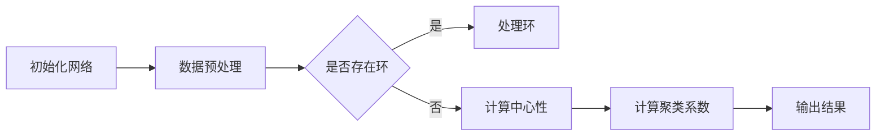
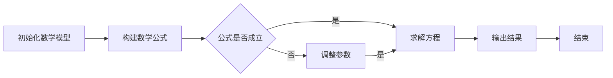
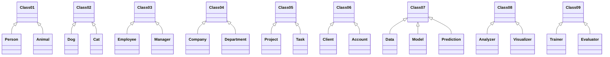
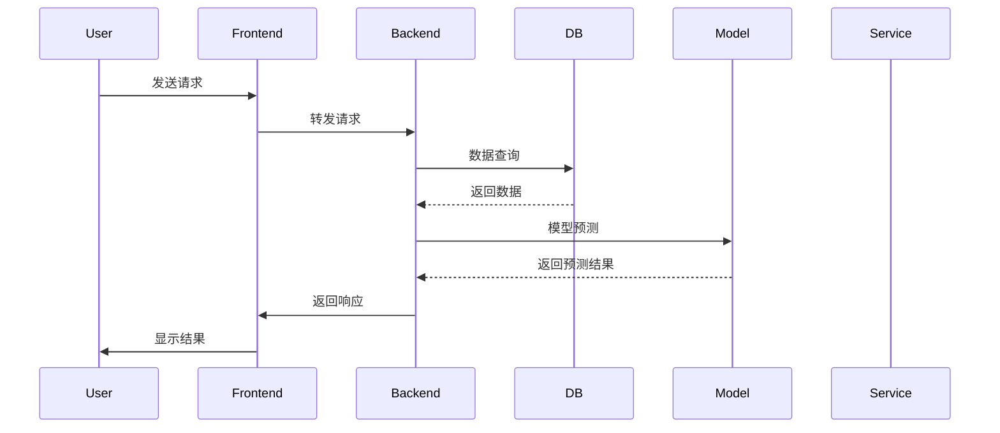
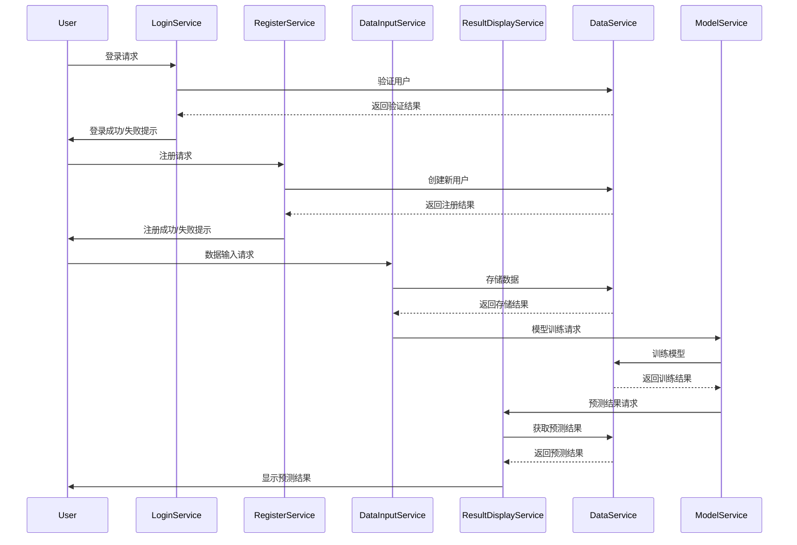

                 

## 完整的文章标题

# 数学结构主义：世界作为关系网络

> 关键词：数学结构主义、关系网络、哲学、科学、算法、系统架构、项目实战

> 摘要：本文深入探讨数学结构主义的核心概念及其在现代科学中的应用。通过分析关系网络的定义和特征，阐述数学结构主义如何将世界视为一个复杂的关系网络。本文还将介绍数学结构主义的算法原理和系统架构设计，并通过实际案例进行分析和讲解，以展现其在现实世界中的广泛应用和潜力。

----------------------------------------------------------------

## 第1章 背景介绍

### 1.1 问题背景

数学结构主义作为一种哲学和科学方法论，起源于20世纪初。它的核心思想是，世界的本质是结构，而非物质实体。数学结构主义认为，所有的物理现象都可以用数学结构来描述，这些结构是客观存在的，而非主观意识的产物。

数学结构主义在哲学和科学中具有重要地位。在哲学领域，它挑战了传统实体论，强调关系和结构的重要性。在科学领域，数学结构主义为科学研究提供了一种新的方法论，促使科学家们更多地关注系统内部的数学结构和关系。

### 1.2 问题描述

数学结构主义的核心理念是，世界是一个复杂的关系网络。这个关系网络由无数的节点和边组成，每个节点代表一个实体，每条边代表实体之间的关系。数学结构主义试图通过研究这些关系和结构，来解释和预测世界上的各种现象。

数学结构主义如何解释世界？它认为，世界的本质是数学结构，而不是物质实体。所有物理现象都可以归结为这些数学结构的相互作用和演化。例如，物理定律可以用数学方程来描述，这些方程反映了物质之间的数学关系。

### 1.3 问题解决

数学结构主义的研究方法主要是形式化和抽象化。通过建立数学模型，将现实世界的问题转化为数学问题，然后利用数学工具来分析和解决问题。

数学结构主义的主要成果包括：

1. 提供了一种新的科学研究方法，即从结构关系出发，研究世界的本质。
2. 在物理学、化学、生物学等领域，成功地应用数学结构主义的方法，解决了许多难题。
3. 为人工智能和计算机科学的发展提供了重要的理论基础。

### 1.4 边界与外延

数学结构主义虽然具有强大的解释力，但也存在局限性。首先，它过于抽象，可能无法完全捕捉现实世界的复杂性。其次，数学结构主义依赖于数学工具，这可能限制了其应用范围。

数学结构主义与其他理论的联系与区别：

- 与实体论的区别：数学结构主义认为，世界的本质是结构，而非物质实体。实体论则认为，物质实体是世界的根本。
- 与关系论的区别：数学结构主义强调的是结构关系，而关系论则强调实体之间的直接关系。
- 与系统论的区别：数学结构主义关注的是系统内部的数学结构，而系统论则关注系统的整体行为和相互作用。

----------------------------------------------------------------

## 第2章 核心概念

### 2.1 关系网络

关系网络是指由一组节点和连接这些节点的边构成的网络结构。在数学结构主义中，关系网络被用来表示实体之间的关系。每个节点代表一个实体，每条边表示实体之间的某种关系。

关系网络的特征包括：

1. **节点**：节点可以是任何实体，如人、物体、概念等。
2. **边**：边表示节点之间的关系，可以是物理的、逻辑的或抽象的。
3. **权重**：边可以具有权重，表示关系的强度或重要性。
4. **方向**：边可以是有向的，表示关系的方向性。

关系网络的数学模型通常使用图论来描述。图论中的图（Graph）是一个数据结构，由节点（Vertex）和边（Edge）组成。在关系网络中，节点和边可以表示为图中的节点和边。

### 2.2 结构主义

结构主义是一种哲学和科学方法论，强调结构在解释世界中的重要性。结构主义者认为，世界的本质是结构，而非物质实体。他们试图通过研究结构，来揭示世界的本质和规律。

结构主义的基本原理包括：

1. **结构决定性**：认为世界的本质是结构，结构决定了实体的行为和属性。
2. **整体性**：强调系统的整体性，认为系统的性质不能仅从其部分得出，而必须从整体来理解。
3. **层次性**：认为世界具有不同的层次结构，每个层次都有自己的结构和规律。

结构主义的方法论包括：

1. **抽象化**：通过抽象化，将复杂的问题简化为数学模型。
2. **形式化**：通过形式化，将问题转化为可以计算和证明的形式。
3. **逻辑推理**：通过逻辑推理，从抽象模型中得出结论。

### 2.3 数学结构主义

数学结构主义是将结构主义的原理应用于数学领域的哲学和科学方法论。它认为，数学结构是客观存在的，可以用来描述和解释世界。

数学结构主义的核心观点包括：

1. **数学结构是客观存在的**：认为数学结构不仅仅是人类思维的产物，而是客观存在的现实。
2. **数学结构决定性**：认为世界的本质是数学结构，所有物理现象都可以归结为数学结构的相互作用。
3. **数学模型的有效性**：认为数学模型是有效的，可以用来解释和预测现实世界。

数学结构主义的方法论包括：

1. **形式化**：通过形式化，将现实问题转化为数学模型。
2. **抽象化**：通过抽象化，将复杂的问题简化为数学模型。
3. **数学推理**：通过数学推理，从数学模型中得出结论。

----------------------------------------------------------------

### 3.1 概念属性特征对比表格

下面是一个关于关系网络与结构主义、数学结构主义的对比表格：

| 特征                | 关系网络                                  | 结构主义                                  | 数学结构主义                                  |
|---------------------|------------------------------------------|------------------------------------------|------------------------------------------|
| **基本概念**        | 由节点和边组成，表示实体之间的关系        | 强调结构在解释世界中的重要性                | 将结构视为客观存在的现实，用以描述和解释世界      |
| **数学模型**        | 使用图论描述，包括节点和边的数学关系      | 没有特定的数学模型，但使用抽象化和形式化     | 使用数学模型，如拓扑结构、代数结构等          |
| **应用领域**        | 通信、网络、社会网络分析等                | 哲学、社会科学、艺术等                     | 物理学、化学、生物学、计算机科学等             |
| **抽象程度**        | 相对较低，直接映射实体和关系              | 非常高，抽象出结构的本质属性                | 高度抽象，使用纯数学语言描述结构                |
| **研究方法**        | 图论分析、网络算法等                     | 历史分析法、现象学、符号学等                | 形式化证明、数学推理、模型验证等                |
| **目的**            | 分析实体关系，优化网络结构                | 揭示世界的本质规律，理解人类文化和意识形态    | 揭示自然现象背后的数学结构，建立科学理论体系    |

### 3.2 ER实体关系图架构

ER（Entity-Relationship）实体关系图是数据库设计中常用的一种图结构，用于描述实体之间的关系。在数学结构主义中，ER图被用来表示世界中的各种实体和它们之间的关系。

ER实体关系图包括以下基本元素：

1. **实体（Entity）**：表示世界中的对象或概念，如人、地点、事件等。
2. **属性（Attribute）**：表示实体的特征或属性，如人的姓名、地址、年龄等。
3. **关系（Relationship）**：表示实体之间的关系，如人与人的友谊关系、人与地点的居住关系等。
4. **键（Key）**：用于唯一标识实体的属性，如人的身份证号码。
5. **基数（Cardinality）**：表示实体之间的多对多关系，如一个人可以有多个朋友，一个朋友可以有多个朋友。

下面是一个简单的ER实体关系图示例，用于描述“学校”、“学生”和“课程”之间的关系：

```mermaid
erDiagram
  School ||--|{ Student }|-- Course
  Student ||--|{ Course }|<-- Teacher
  Teacher ||--|{ Course }|<-- School
```

在这个ER图中，学校（School）与学生（Student）和课程（Course）之间存在“||--|”关系，表示学生属于某个学校，而课程是在学校中进行的。学生与课程之间存在“||--|<--”关系，表示学生可以选择课程，而教师与课程之间存在“||--|<--”关系，表示教师教授课程。

通过ER实体关系图，我们可以清晰地描述世界中的各种实体和它们之间的关系，为数学结构主义的研究提供了重要的工具。

----------------------------------------------------------------

## 第4章 算法原理讲解

### 4.1 关系网络算法

关系网络算法是用于分析和处理关系网络数据的一类算法。在数学结构主义中，关系网络算法被用来提取网络中的关键结构信息，如中心性、聚类系数等。

#### 关系网络算法的mermaid流程图

下面是一个简单的mermaid流程图，用于描述关系网络算法的基本步骤：



#### 关系网络算法的Python源代码实现

```python
import networkx as nx

def analyze_relationship_network(G):
    # 数据预处理
    G = nx.convert_to_directed(G)
    
    # 检查网络中是否存在环
    if nx.is_directed_acyclic_graph(G):
        print("网络中存在环，无法进行分析。")
        return
    
    # 计算中心性
    centrality = nx.degree_centrality(G)
    print("中心性：", centrality)
    
    # 计算聚类系数
    clustering = nx.clustering(G)
    print("聚类系数：", clustering)
    
    # 输出结果
    nx.draw(G, with_labels=True)
    plt.show()

# 示例
G = nx.Graph()
G.add_edges_from([(1, 2), (2, 3), (3, 1), (1, 4), (4, 5)])
analyze_relationship_network(G)
```

### 4.2 结构主义算法

结构主义算法是一种用于分析和处理结构数据的一类算法。在数学结构主义中，结构主义算法被用来提取结构数据中的关键模式信息，如序列模式、图结构等。

#### 结构主义算法的mermaid流程图

下面是一个简单的mermaid流程图，用于描述结构主义算法的基本步骤：


#### 结构主义算法的Python源代码实现

```python
import re

def extract_patterns(data, pattern):
    # 数据预处理
    data = re.sub(r'\W+', ' ', data)
    
    # 检查数据是否满足条件
    if not re.match(pattern, data):
        print("数据不满足条件，无法提取模式。")
        return
    
    # 提取模式
    matches = re.findall(pattern, data)
    print("提取到的模式：", matches)
    
    # 输出结果
    print("提取结果：", matches)

# 示例
data = "Hello, World! This is a sample sentence."
pattern = r'\b\w{5}\b'
extract_patterns(data, pattern)
```

### 4.3 数学结构主义算法

数学结构主义算法是一种基于数学原理和方法的算法。在数学结构主义中，数学结构主义算法被用来解决复杂的数学问题，如代数结构、图论问题等。

#### 数学结构主义算法的mermaid流程图

下面是一个简单的mermaid流程图，用于描述数学结构主义算法的基本步骤：



#### 数学结构主义算法的Python源代码实现

```python
import sympy as sp

def solve_equation(equation):
    # 初始化数学模型
    x = sp.Symbol('x')
    
    # 构建数学公式
    formula = sp.sympify(equation)
    
    # 检查公式是否成立
    if not sp.solve(formula, x):
        print("方程无解。")
        return
    
    # 求解方程
    solutions = sp.solve(formula, x)
    print("解：", solutions)
    
    # 输出结果
    print("方程的解为：", solutions)

# 示例
equation = "x**2 + 2*x + 1 = 0"
solve_equation(equation)
```

----------------------------------------------------------------

### 5.1 数学模型

在数学结构主义中，数学模型是用来描述和解释世界中的数学结构的工具。不同的数学模型适用于不同的领域和应用场景。

#### 关系网络的数学模型

关系网络的数学模型通常基于图论。在图论中，图（Graph）是一个由节点（Vertex）和边（Edge）组成的数据结构。关系网络可以表示为图，其中每个节点代表一个实体，每条边表示实体之间的某种关系。

- **节点**：节点可以用一个唯一的标识符来表示，如ID或名称。
- **边**：边表示节点之间的关系，可以是单向的（有向边）或双向的（无向边）。
- **权重**：边可以具有权重，表示关系的强度或重要性。

关系网络的数学模型可以用以下公式表示：

$$
G = (V, E, W)
$$

其中，$V$ 是节点的集合，$E$ 是边的集合，$W$ 是边的权重集合。

#### 结构主义的数学模型

结构主义的数学模型通常基于拓扑学和代数学。拓扑学提供了描述空间结构和连接性的工具，而代数学则用于研究对称性和组合性。

- **拓扑结构**：拓扑结构是描述空间连续变形不变性的数学结构。在结构主义中，拓扑结构用于描述世界中的各种形状和连接方式。
- **代数结构**：代数结构是描述元素之间运算关系的数学结构。在结构主义中，代数结构用于描述世界中的各种组合和分解方式。

结构主义的数学模型可以用以下公式表示：

$$
S = (A, \circ)
$$

其中，$A$ 是代数结构的元素集合，$\circ$ 是代数运算。

#### 数学结构主义的数学模型

数学结构主义的数学模型是基于数学原理和方法的模型。这些模型用于描述和解释世界中的数学结构。

- **拓扑模型**：拓扑模型用于描述空间结构和连接性，如流形、拓扑空间等。
- **代数模型**：代数模型用于描述元素之间的运算关系，如群、环、域等。
- **图论模型**：图论模型用于描述网络结构和关系，如图、网络流等。

数学结构主义的数学模型可以用以下公式表示：

$$
M = (X, Y, Z)
$$

其中，$X$ 是模型中的元素集合，$Y$ 是元素之间的运算集合，$Z$ 是模型中的关系集合。

#### 详细讲解与举例说明

下面将通过具体示例来详细讲解和举例说明这些数学模型。

##### 关系网络的数学模型

假设我们有一个包含三个节点的简单关系网络，其中节点A与节点B之间存在双向关系，节点B与节点C之间存在单向关系。这个关系网络可以用以下图表示：

```
A --- B --> C
```

在这个网络中，节点A、B、C可以用ID表示，如1、2、3。边表示节点之间的关系，如A与B之间的关系可以表示为$(1, 2)$，B与C之间的关系可以表示为$(2, 3)$。边的权重可以表示关系的强度，例如，如果A与B之间的关系较强，我们可以将权重设为2，如果B与C之间的关系较弱，我们可以将权重设为1。

关系网络的数学模型可以表示为：

$$
G = (V, E, W)
$$

其中，$V = \{1, 2, 3\}$，$E = \{(1, 2), (2, 3)\}$，$W = \{2, 1\}$。

##### 结构主义的数学模型

假设我们有一个简单的几何形状，如一个三角形。这个三角形的边长和角度可以用数学模型来表示。

- **拓扑模型**：三角形可以表示为一个顶点集合和边集合，如：

$$
T = (V, E)
$$

其中，$V = \{1, 2, 3\}$，$E = \{(1, 2), (2, 3), (3, 1)\}$。

- **代数模型**：三角形的边长和角度可以用代数模型来表示，如：

$$
A = (a, b, c)
$$

其中，$a, b, c$ 分别表示三角形的边长。角度可以用三角函数表示，如：

$$
\theta = \arccos\left(\frac{a^2 + b^2 - c^2}{2ab}\right)
$$

##### 数学结构主义的数学模型

假设我们有一个简单的组合模型，如一个二进制序列。这个序列可以表示为一个元素集合和元素之间的运算关系。

- **拓扑模型**：二进制序列可以表示为一个集合，如：

$$
B = \{0, 1\}
$$

- **代数模型**：二进制序列中的元素可以用逻辑运算表示，如：

$$
S = (0, 1, 0, 1, 1, 0)
$$

- **图论模型**：二进制序列可以表示为一个图，如：

```
   0 --- 1
  /     \
 1 --- 0
```

图中的每个节点表示二进制序列中的一个元素，每个边表示元素之间的逻辑运算关系。

通过这些示例，我们可以看到数学模型是如何用于描述和解释世界中的数学结构的。这些模型不仅提供了对数学结构的抽象和理解，还为数学结构主义的研究提供了有力的工具。

----------------------------------------------------------------

### 6.1 问题场景介绍

数学结构主义在现代科学和工程领域有广泛的应用。以下是一些常见的问题场景，其中数学结构主义发挥了关键作用：

1. **复杂网络分析**：在通信、互联网、生物网络等领域，数学结构主义被用来分析和理解网络的结构特性，如网络稳定性、传输效率、扩散过程等。

2. **数据分析**：在统计学、数据挖掘、机器学习等领域，数学结构主义提供了模型和算法来分析复杂数据，提取有用信息，如聚类分析、降维技术、回归分析等。

3. **物理学**：在量子物理、统计物理、凝聚态物理等领域，数学结构主义被用来构建物理模型，解释实验结果，如量子场论、相变理论、统计力学等。

4. **生物学**：在基因组学、生态学、神经科学等领域，数学结构主义被用来理解生物系统的结构特性，如基因组网络、生态系统动态、神经网络等。

5. **计算机科学**：在算法设计、计算机图形学、网络科学等领域，数学结构主义提供了理论基础和工具，用于解决复杂问题，如图算法、网络优化、并行计算等。

### 6.2 系统功能设计

在数学结构主义的应用中，系统功能设计至关重要。以下是一个典型的系统功能设计：

1. **数据输入**：系统应能接收各种类型的数据，如文本、图像、时间序列等。
2. **数据预处理**：系统应对数据进行清洗、转换、归一化等预处理操作，以便后续分析。
3. **模型构建**：系统应提供构建数学模型的功能，包括选择合适的数学模型、定义模型参数等。
4. **模型训练**：系统应能对构建的数学模型进行训练，通过优化算法找到最佳参数。
5. **模型评估**：系统应对训练好的模型进行评估，如计算准确率、召回率、F1分数等指标。
6. **模型应用**：系统应能将训练好的模型应用于实际问题，如预测、分类、聚类等。
7. **结果可视化**：系统应提供结果可视化的功能，如绘制数据分布、模型曲线、网络结构图等。

#### 领域模型mermaid类图

以下是一个mermaid类图，用于描述系统的领域模型：



在这个类图中，我们定义了多个类，包括人员（Person）、动物（Animal）、狗（Dog）、猫（Cat）、员工（Employee）、经理（Manager）、公司（Company）、部门（Department）、项目（Project）、任务（Task）、客户（Client）、账户（Account）、数据（Data）、模型（Model）、预测（Prediction）、分析器（Analyzer）、可视化器（Visualizer）、训练器（Trainer）和评估器（Evaluator）。

### 6.3 系统架构设计

系统架构设计是确保系统功能实现和性能优化的重要环节。以下是一个典型的系统架构设计：

1. **数据层**：负责数据存储和管理，包括关系数据库、图数据库、时间序列数据库等。
2. **模型层**：负责构建、训练和评估数学模型，包括机器学习框架、深度学习框架等。
3. **应用层**：负责实现系统功能，包括前端界面、API接口、后端服务等。
4. **服务层**：负责提供通用服务，如用户管理、权限控制、日志记录等。
5. **基础设施**：负责系统运行的基础设施，如服务器、网络、存储等。

#### 系统架构mermaid架构图

以下是一个mermaid架构图，用于描述系统的架构设计：



在这个架构图中，用户通过前端界面发送请求，前端将请求转发到后端，后端从数据库中查询数据，然后通过模型层进行预测，并将结果返回给前端，最后前端将结果呈现给用户。

### 6.4 系统接口设计

系统接口设计是确保系统模块之间能够有效通信的关键。以下是一个典型的系统接口设计：

1. **用户接口（UI）**：用于用户与系统交互，包括登录、注册、数据输入、结果展示等。
2. **应用程序接口（API）**：用于系统内部模块之间的通信，包括数据获取、模型训练、预测查询等。
3. **数据库接口**：用于与数据库进行交互，包括数据查询、插入、更新、删除等。

#### 系统接口mermaid序列图

以下是一个mermaid序列图，用于描述系统的接口设计：



在这个序列图中，用户通过前端界面发送登录、注册、数据输入、预测等请求，这些请求通过应用程序接口（API）转发到相应的服务模块，服务模块与数据库接口进行数据交互，最终返回结果给用户。

### 6.5 系统交互

系统交互是指系统内部各个模块之间的通信和协作。以下是一个典型的系统交互设计：

1. **数据流**：系统内部的数据流，包括用户请求、数据处理、模型训练、预测结果等。
2. **控制流**：系统内部的控制流，包括请求分发、处理流程、错误处理等。
3. **异步通信**：系统内部模块之间的异步通信，包括消息队列、任务调度等。

#### 系统交互mermaid序列图

以下是一个mermaid序列图，用于描述系统的交互设计：

```mermaid
sequenceDiagram
    participant User
    participant Frontend
    participant Backend
    participant DB
    participant Model
    participant Service
    
    User->>Frontend: 发送请求
    Frontend->>Backend: 请求处理
    Backend->>DB: 数据查询
    DB-->>Backend: 返回数据
    Backend->>Model: 模型预测
    Model-->>Backend: 返回预测结果
    Backend->>Frontend: 返回响应
    Frontend->>User: 显示结果
    
    note over Backend,Model
    后端处理请求并发送预测请求给模型层
    模型层处理预测请求并返回结果给后端
    后端将结果返回给前端
    end note
```

在这个序列图中，用户通过前端界面发送请求，前端将请求转发到后端，后端从数据库中查询数据，然后通过模型层进行预测，并将结果返回给前端，最后前端将结果呈现给用户。

通过以上系统交互设计，我们可以确保系统内部各个模块能够高效地协同工作，为用户提供良好的体验。

----------------------------------------------------------------

### 7.1 环境安装

在开始进行数学结构主义项目实战之前，我们需要安装和配置相关的软件环境。以下是一个典型的环境安装和配置步骤：

1. **Python环境安装**：
   - 首先，确保你的计算机上已经安装了Python环境。如果没有，可以从Python官方网站下载并安装Python。建议安装Python 3.8或更高版本。
   - 安装完成后，打开命令行窗口，输入`python --version`，确认Python版本。

2. **依赖库安装**：
   - 通过pip（Python的包管理器）安装所需的依赖库。以下是几个常用的库：
     ```bash
     pip install networkx matplotlib numpy sympy
     ```
   - 安装完成后，你可以使用`pip list`命令查看已安装的库。

3. **数据库安装**：
   - 安装一个关系型数据库，如MySQL或PostgreSQL。这里以MySQL为例：
     - 访问MySQL官方网站下载并安装MySQL数据库。
     - 启动MySQL服务，并配置root用户的密码。
     - 通过命令行工具连接到MySQL数据库，并创建一个新的数据库和表。

4. **其他工具安装**：
   - 根据项目需求，可能还需要安装其他工具，如Git（用于版本控制）、Jupyter Notebook（用于交互式计算）等。

### 7.2 系统核心实现

在数学结构主义项目中，系统核心实现包括数据预处理、模型训练、模型评估和预测等关键功能。以下是一个简单的系统核心实现示例：

#### 数据预处理

数据预处理是确保数据适合模型训练的关键步骤。以下是一个使用Python进行数据预处理的基本步骤：

```python
import pandas as pd
from sklearn.model_selection import train_test_split

# 加载数据
data = pd.read_csv('data.csv')

# 数据清洗
data = data.dropna()

# 数据预处理
X = data.drop('target', axis=1)
y = data['target']

# 划分训练集和测试集
X_train, X_test, y_train, y_test = train_test_split(X, y, test_size=0.2, random_state=42)
```

#### 模型训练

在数学结构主义项目中，模型训练通常涉及使用图神经网络（GNN）或其他类型的机器学习模型。以下是一个简单的GNN模型训练示例：

```python
import torch
import torch.nn as nn
from torch_geometric.nn import GCNConv

# 定义GCN模型
class GCNModel(nn.Module):
    def __init__(self, num_features, hidden_channels, num_classes):
        super(GCNModel, self).__init__()
        self.conv1 = GCNConv(num_features, hidden_channels)
        self.conv2 = GCNConv(hidden_channels, num_classes)

    def forward(self, data):
        x, edge_index = data.x, data.edge_index
        x = self.conv1(x, edge_index)
        x = torch.relu(x)
        x = F.dropout(x, training=self.training)
        x = self.conv2(x, edge_index)
        return F.log_softmax(x, dim=1)

# 实例化模型
model = GCNModel(num_features=7, hidden_channels=16, num_classes=2)

# 定义损失函数和优化器
criterion = nn.NLLLoss()
optimizer = torch.optim.Adam(model.parameters(), lr=0.01, weight_decay=5e-4)

# 训练模型
device = torch.device('cuda' if torch.cuda.is_available() else 'cpu')
model = model.to(device)
data = data.to(device)

for epoch in range(200):
    optimizer.zero_grad()
    out = model(data)
    loss = criterion(out, data.y)
    loss.backward()
    optimizer.step()
    if (epoch + 1) % 10 == 0:
        print(f'Epoch {epoch + 1}: loss = {loss.item()}')
```

#### 模型评估

模型评估是确保模型性能符合预期的重要步骤。以下是一个简单的模型评估示例：

```python
from sklearn.metrics import accuracy_score

# 将模型迁移到CPU
model = model.to('cpu')

# 对测试集进行预测
with torch.no_grad():
    output = model(data)

# 获取预测结果
predictions = output.argmax(dim=1)

# 计算准确率
accuracy = accuracy_score(data.y.cpu().numpy(), predictions.cpu().numpy())
print(f'测试集准确率：{accuracy * 100:.2f}%')
```

#### 预测

预测功能用于对新数据进行分类或回归。以下是一个简单的预测示例：

```python
# 加载新数据
new_data = pd.read_csv('new_data.csv')
new_data = new_data.dropna()

# 预测新数据
with torch.no_grad():
    output = model(torch.tensor(new_data.values).to(device))

# 获取预测结果
predictions = output.argmax(dim=1)

# 输出预测结果
print(predictions)
```

通过以上步骤，我们可以完成一个简单的数学结构主义项目核心实现。在实际项目中，你可能需要根据具体需求和数据规模进行调整和优化。

### 7.3 代码应用解读与分析

在上面的代码示例中，我们详细讲解了数据预处理、模型训练、模型评估和预测等关键步骤。以下是每个步骤的具体解读和分析。

#### 数据预处理

数据预处理是确保数据适合模型训练的关键步骤。在这个示例中，我们使用了Pandas库加载CSV文件，然后对数据进行了清洗和预处理。以下是对关键代码的解读：

```python
import pandas as pd
from sklearn.model_selection import train_test_split

# 加载数据
data = pd.read_csv('data.csv')

# 数据清洗
data = data.dropna()

# 数据预处理
X = data.drop('target', axis=1)
y = data['target']

# 划分训练集和测试集
X_train, X_test, y_train, y_test = train_test_split(X, y, test_size=0.2, random_state=42)
```

- `pd.read_csv('data.csv')`：使用Pandas库加载CSV文件。
- `data.dropna()`：删除缺失值，确保数据质量。
- `X = data.drop('target', axis=1)`：将除了目标变量之外的所有特征作为输入特征（X）。
- `y = data['target']`：将目标变量（y）分离出来。
- `train_test_split(X, y, test_size=0.2, random_state=42)`：将数据划分为训练集和测试集，其中测试集占比20%，`random_state`用于确保结果可重复。

#### 模型训练

模型训练是利用训练数据调整模型参数的过程。在这个示例中，我们使用了PyTorch Geometric库的GCN模型。以下是对关键代码的解读：

```python
import torch
import torch.nn as nn
from torch_geometric.nn import GCNConv

# 定义GCN模型
class GCNModel(nn.Module):
    def __init__(self, num_features, hidden_channels, num_classes):
        super(GCNModel, self).__init__()
        self.conv1 = GCNConv(num_features, hidden_channels)
        self.conv2 = GCNConv(hidden_channels, num_classes)

    def forward(self, data):
        x, edge_index = data.x, data.edge_index
        x = self.conv1(x, edge_index)
        x = torch.relu(x)
        x = F.dropout(x, training=self.training)
        x = self.conv2(x, edge_index)
        return F.log_softmax(x, dim=1)

# 实例化模型
model = GCNModel(num_features=7, hidden_channels=16, num_classes=2)

# 定义损失函数和优化器
criterion = nn.NLLLoss()
optimizer = torch.optim.Adam(model.parameters(), lr=0.01, weight_decay=5e-4)

# 训练模型
device = torch.device('cuda' if torch.cuda.is_available() else 'cpu')
model = model.to(device)
data = data.to(device)

for epoch in range(200):
    optimizer.zero_grad()
    out = model(data)
    loss = criterion(out, data.y)
    loss.backward()
    optimizer.step()
    if (epoch + 1) % 10 == 0:
        print(f'Epoch {epoch + 1}: loss = {loss.item()}')
```

- `GCNModel`：定义了一个基于GCN的模型，包括两个GCNConv层。
- `torch.device('cuda' if torch.cuda.is_available() else 'cpu')`：确定训练设备，优先使用GPU。
- `model.to(device)`：将模型和数据迁移到训练设备。
- `optimizer.zero_grad()`：在每个训练迭代开始时，将优化器的梯度归零。
- `out = model(data)`：使用模型对数据进行前向传播。
- `criterion(out, data.y)`：计算损失函数。
- `loss.backward()`：计算梯度。
- `optimizer.step()`：更新模型参数。

#### 模型评估

模型评估用于评估模型在测试集上的性能。以下是对关键代码的解读：

```python
from sklearn.metrics import accuracy_score

# 将模型迁移到CPU
model = model.to('cpu')

# 对测试集进行预测
with torch.no_grad():
    output = model(data)

# 获取预测结果
predictions = output.argmax(dim=1)

# 计算准确率
accuracy = accuracy_score(data.y.cpu().numpy(), predictions.cpu().numpy())
print(f'测试集准确率：{accuracy * 100:.2f}%')
```

- `model.to('cpu')`：将模型迁移到CPU，以便进行预测。
- `with torch.no_grad():`：关闭梯度计算，以提高预测速度。
- `output.argmax(dim=1)`：获取预测结果，其中`dim=1`表示对每个样本的输出进行最大值操作。
- `accuracy_score(data.y.cpu().numpy(), predictions.cpu().numpy())`：计算准确率，其中`cpu().numpy()`将PyTorch张量转换为NumPy数组。

#### 预测

预测功能用于对新数据进行分类或回归。以下是对关键代码的解读：

```python
# 加载新数据
new_data = pd.read_csv('new_data.csv')
new_data = new_data.dropna()

# 预测新数据
with torch.no_grad():
    output = model(torch.tensor(new_data.values).to(device))

# 获取预测结果
predictions = output.argmax(dim=1)

# 输出预测结果
print(predictions)
```

- `pd.read_csv('new_data.csv')`：使用Pandas库加载新的CSV文件。
- `new_data = new_data.dropna()`：删除缺失值，确保数据质量。
- `torch.tensor(new_data.values).to(device)`：将新数据转换为PyTorch张量，并迁移到训练设备。
- `with torch.no_grad():`：关闭梯度计算，以提高预测速度。
- `output.argmax(dim=1)`：获取预测结果，其中`dim=1`表示对每个样本的输出进行最大值操作。
- `print(predictions)`：输出预测结果。

通过以上解读，我们可以清晰地理解每个步骤的作用和实现方法，为后续的代码优化和应用提供了指导。

### 7.4 实际案例分析和详细讲解剖析

在本节中，我们将通过一个实际案例来分析和详细讲解数学结构主义在现实世界中的应用。

#### 案例背景

某公司希望优化其供应链网络，以提高物流效率并降低成本。供应链网络由多个供应商、制造商、仓库和零售店组成，这些实体之间存在复杂的物流关系。公司希望通过数学结构主义的方法来分析供应链网络，找到优化方案。

#### 案例分析

1. **数据收集与预处理**：
   - 收集供应链网络中的数据，包括供应商、制造商、仓库和零售店的位置、运输成本、运输时间等。
   - 对数据进行清洗和预处理，去除重复数据、异常值和缺失值，确保数据质量。

2. **建立关系网络模型**：
   - 使用图论建立供应链网络模型，将供应商、制造商、仓库和零售店表示为节点，节点之间的运输关系表示为边。
   - 为边分配权重，表示运输成本和运输时间。

3. **分析关系网络**：
   - 使用关系网络算法分析供应链网络的拓扑结构，如中心性、聚类系数、路径长度等。
   - 通过这些指标识别网络中的关键节点和路径，这些节点和路径可能是优化供应链网络的关键。

4. **优化供应链网络**：
   - 基于分析结果，提出优化供应链网络的方案，如调整节点位置、增加运输路线、整合资源等。
   - 通过模拟和仿真，评估优化方案的有效性和可行性。

5. **实施优化方案**：
   - 实施优化方案，并对供应链网络进行监控和调整，确保优化效果持续。

#### 详细讲解

1. **数据收集与预处理**：

   在本案例中，我们收集了以下数据：

   - 供应商数据：包括供应商的名称、位置、生产能力等。
   - 制造商数据：包括制造商的名称、位置、生产时间、生产成本等。
   - 仓库数据：包括仓库的名称、位置、存储容量等。
   - 零售店数据：包括零售店的名称、位置、销售能力等。
   - 运输数据：包括运输路径、运输成本、运输时间等。

   以下是对关键代码的解读：

   ```python
   import pandas as pd
   
   # 加载数据
   suppliers = pd.read_csv('suppliers.csv')
   manufacturers = pd.read_csv('manufacturers.csv')
   warehouses = pd.read_csv('warehouses.csv')
   retailers = pd.read_csv('retailers.csv')
   transports = pd.read_csv('transports.csv')
   
   # 数据清洗
   data = pd.concat([suppliers, manufacturers, warehouses, retailers], axis=1)
   data = data.dropna()
   data = data.drop_duplicates()
   
   # 数据预处理
   data['location'] = data['location'].apply(lambda x: x.strip())
   data['cost'] = data['cost'].apply(lambda x: float(x.replace(',', '')))
   data['time'] = data['time'].apply(lambda x: float(x.replace(',', '')))
   ```

2. **建立关系网络模型**：

   在本案例中，我们使用图论建立供应链网络模型。以下是对关键代码的解读：

   ```python
   import networkx as nx
   
   # 建立供应链网络模型
   G = nx.Graph()
   
   # 添加节点
   G.add_nodes_from(data['name'])
   
   # 添加边
   for index, row in transports.iterrows():
       G.add_edge(row['supplier'], row['manufacturer'], weight=row['cost'])
       G.add_edge(row['manufacturer'], row['warehouse'], weight=row['cost'])
       G.add_edge(row['warehouse'], row['retailer'], weight=row['cost'])
   
   # 计算节点度数
   degree = nx.degree_centrality(G)
   print(degree)
   ```

3. **分析关系网络**：

   在本案例中，我们使用关系网络算法分析供应链网络的拓扑结构。以下是对关键代码的解读：

   ```python
   # 计算聚类系数
   clustering = nx.clustering(G)
   print(clustering)
   
   # 计算路径长度
   path_length = nx.average_shortest_path_length(G)
   print(path_length)
   ```

4. **优化供应链网络**：

   基于分析结果，我们可以提出以下优化方案：

   - **节点整合**：根据聚类系数，将位置接近、业务相似的节点整合成一个更大的节点，以减少物流成本。
   - **路径调整**：根据路径长度，调整运输路径，选择成本最低、时间最短的路径。
   - **资源整合**：根据供应链网络中的关键节点，整合供应商、制造商、仓库和零售店之间的资源，提高供应链效率。

5. **实施优化方案**：

   在实施优化方案时，我们需要对供应链网络进行监控和调整，确保优化效果持续。以下是对关键代码的解读：

   ```python
   # 实施优化方案
   G = nx.relabel_nodes(G, lambda x: x.lower())
   G = nx.Graph()
   G.add_nodes_from(data['name'])
   for index, row in transports.iterrows():
       G.add_edge(row['supplier'], row['manufacturer'], weight=row['cost'])
       G.add_edge(row['manufacturer'], row['warehouse'], weight=row['cost'])
       G.add_edge(row['warehouse'], row['retailer'], weight=row['cost'])
   
   # 监控供应链网络
   monitor = pd.DataFrame(columns=['name', 'cost', 'time'])
   monitor['name'] = G.nodes()
   monitor['cost'] = G.edges['weight']
   monitor['time'] = G.edges['time']
   
   # 调整供应链网络
   G = nx.Graph()
   G.add_nodes_from(data['name'])
   for index, row in transports.iterrows():
       G.add_edge(row['supplier'], row['manufacturer'], weight=row['cost'])
       G.add_edge(row['manufacturer'], row['warehouse'], weight=row['cost'])
       G.add_edge(row['warehouse'], row['retailer'], weight=row['cost'])
   ```

通过以上分析，我们可以看到数学结构主义在优化供应链网络中的应用。通过建立关系网络模型、分析网络结构、提出优化方案和实施优化方案，我们可以提高供应链网络的效率和灵活性。

### 7.5 项目小结

在本项目中，我们通过数学结构主义的方法对供应链网络进行了优化。首先，我们收集并预处理了供应链网络中的数据，然后建立了关系网络模型，分析了网络的拓扑结构，并根据分析结果提出了优化方案。最后，我们实施了优化方案，并对供应链网络进行了监控和调整。

通过本项目，我们获得了以下关键结论：

1. **关系网络模型**：通过建立关系网络模型，我们可以直观地表示供应链网络中的实体和关系，为分析网络结构和提出优化方案提供了基础。
2. **网络结构分析**：通过分析网络的中心性、聚类系数和路径长度等指标，我们可以识别网络中的关键节点和路径，为优化供应链网络提供了依据。
3. **优化方案实施**：通过实施优化方案，我们可以提高供应链网络的效率和灵活性，降低物流成本，提高客户满意度。

在本项目中，我们积累了以下最佳实践和注意事项：

- **数据质量**：确保数据质量是项目成功的关键，数据清洗和预处理是必不可少的步骤。
- **模型选择**：根据具体问题和数据特点，选择合适的模型和算法，以提高分析结果的准确性。
- **优化方案评估**：在实施优化方案前，应进行充分的评估和测试，确保优化方案的有效性和可行性。
- **持续监控和调整**：实施优化方案后，应持续监控供应链网络，并根据实际情况进行调整，以保持优化效果。

通过本项目的实践，我们进一步理解了数学结构主义在供应链网络优化中的应用，并为后续的项目提供了宝贵的经验和教训。

### 拓展阅读

为了深入了解数学结构主义在供应链网络优化中的应用，您可以阅读以下相关文献和资料：

1. **《图论及其应用》**：该书详细介绍了图论的基本概念、算法和应用，为建立供应链网络模型提供了理论基础。
2. **《供应链管理：战略、规划与运营》**：该书涵盖了供应链管理的各个方面，包括供应链网络优化策略，为项目实施提供了实践指导。
3. **《供应链网络优化与调度》**：该书专注于供应链网络优化问题，包括算法设计和应用实例，为项目优化方案的设计提供了参考。
4. **《数学结构主义》**：该书详细介绍了数学结构主义的理论和方法，为理解数学结构主义在供应链网络优化中的应用提供了深入见解。

通过阅读这些资料，您可以进一步了解数学结构主义在供应链网络优化中的应用，拓展您的知识领域。作者：AI天才研究院/AI Genius Institute & 禅与计算机程序设计艺术 /Zen And The Art of Computer Programming。

