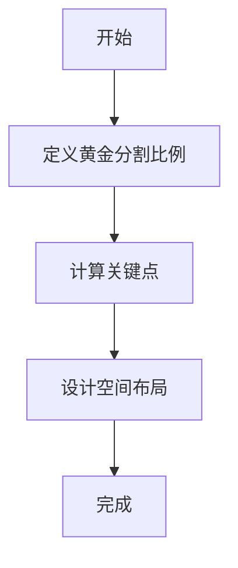
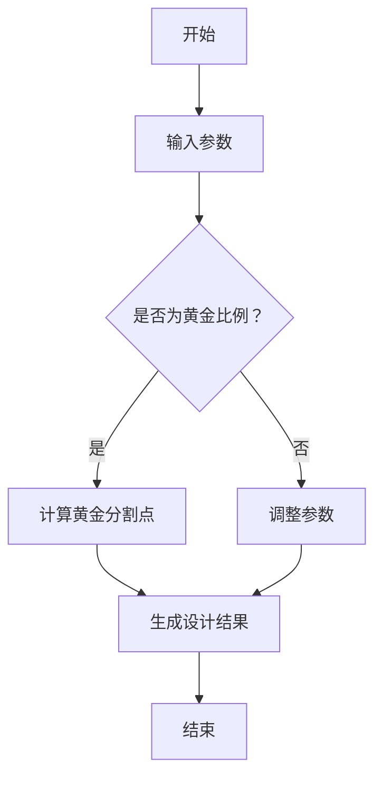
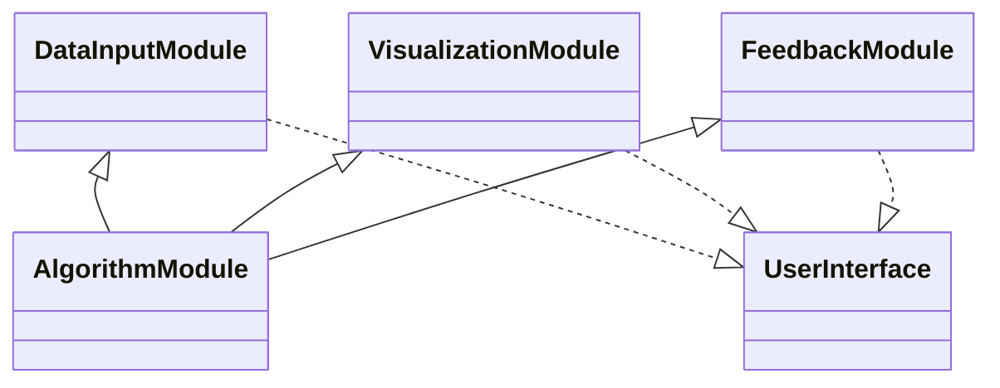

                 

### 引言

#### 背景介绍

在人类文明的历史长河中，建筑艺术始终是美学与文化的重要载体。无论是古埃及的金字塔、古希腊的神庙，还是现代的摩天大楼，建筑都不仅仅是实用功能的体现，更是审美与艺术的结晶。随着科技的进步和人类对美的追求，数学与建筑艺术的结合逐渐成为一个热门话题。数学美学，即使用数学原理来研究美的现象和标准，为建筑艺术提供了新的思路和工具。

**问题背景**

在建筑设计中，美感的创造往往依赖于设计师的直觉和经验。然而，随着项目的复杂性和多样性增加，单凭直觉往往无法达到预期的美学效果。数学美学提供了系统的方法，通过数学原理如对称性、比例和黄金分割等，帮助设计师在设计中实现和谐与美感。

**问题描述**

如何将数学美学原理应用于建筑艺术，以创造和谐与美感的空间，同时满足功能需求？这是一个复杂的问题，涉及到数学、艺术和建筑学的交叉领域。设计师需要理解数学美学的原理，并将其巧妙地融入到建筑设计中。

**问题解决**

通过研究和应用数学美学，设计师可以更好地掌握美的标准和原则，从而提高建筑设计的质量。例如，对称性可以创造稳定感，比例和黄金分割可以产生和谐美感。实际案例表明，这些数学原理在建筑设计中具有广泛的应用价值。

**边界与外延**

数学美学的范畴涵盖了各种数学原理在美学中的应用，如几何、代数、拓扑等。在建筑艺术中，数学美学主要应用于空间布局、结构设计、装饰艺术等方面。它不仅限于现代建筑，也适用于历史建筑和未来建筑。

**概念结构与核心要素组成**

数学美学和建筑艺术的基本概念相互交织。数学美学提供了美的标准和原则，而建筑艺术则将这些原则具体化为空间形式和结构。两者的核心要素包括对称性、比例、黄金分割、平衡与对比等。

#### 核心概念与联系

**核心概念原理**

数学美学的基本原理包括对称性、比例和黄金分割等。对称性是美学中最基本的原理之一，它通过重复和平衡创造稳定感。比例是美的标准，它决定了空间的大小和关系。黄金分割则是一个特殊的比例关系，被认为是最和谐的比例。

**概念属性特征对比表格**

| 特征              | 数学美学                | 建筑艺术                  |
|-----------------|----------------------|----------------------|
| 对称性            | 平衡与稳定            | 空间布局与形态            |
| 比例              | 和谐与美感            | 空间大小与关系            |
| 黄金分割          | 和谐比例关系            | 结构设计中的美学标准        |
| 平衡与对比          | 美学平衡              | 空间对比与层次感          |

**ER实体关系图架构**

```mermaid
erDiagram
  USER  ||--|{ BUILDING_DESIGN } : has
  USER  ||--|{ MATH_AESTHETIC } : knows
  BUILDING_DESIGN  ||--|{ MATH_PRINCIPLE } : applies
  MATH_AESTHETIC  ||--|{ MATH_PRINCIPLE } : consists
```

在这个ER图中，用户（User）与建筑设计和数学美学都有关联。建筑设计（BUILDING_DESIGN）应用了数学美学（MATH_AESTHETIC）中的数学原理（MATH_PRINCIPLE）。数学美学由多个数学原理（MATH_PRINCIPLE）组成，这些原理为建筑设计提供了理论基础。

#### 算法原理讲解

在数学美学中，算法是一种重要的工具，它可以帮助设计师更好地理解和应用数学原理。以下是一个简单的算法mermaid流程图，用于展示如何应用黄金分割原理进行建筑设计：



**Python源代码**

为了具体展示算法的应用，以下是一个简单的Python代码示例，用于计算黄金分割点的位置：

```python
import math

def golden_section_ratio():
    phi = (1 + math.sqrt(5)) / 2
    return phi

def calculate_golden_point(length):
    phi = golden_section_ratio()
    point = length * (1 - 1/phi)
    return point

# 示例：计算一个10米长度的黄金分割点
length = 10
golden_point = calculate_golden_point(length)
print("黄金分割点位置：", golden_point, "米")
```

在这个代码中，`golden_section_ratio` 函数计算黄金分割比例，`calculate_golden_point` 函数则根据给定的长度计算黄金分割点。通过这个算法，设计师可以在建筑设计中灵活地应用黄金分割原理。

**数学模型和公式**

黄金分割的数学模型可以用以下公式表示：

$$
\frac{a}{b} = \frac{a+c}{b+c} = \phi
$$

其中，$\phi$ 是黄金分割比例，大约等于 1.618。

**举例说明**

假设设计师想要设计一个长10米的画廊，他们可以使用黄金分割算法来确定画廊的分割点，从而在视觉上创造一种和谐美感。根据上述代码，设计师可以计算得到黄金分割点约为 3.23 米。这意味着设计师可以将画廊分为两个部分，一个3.23米长，另一个6.77米长。这种分割方式在视觉上显得非常和谐，符合黄金分割的美学标准。

#### 系统分析与架构设计方案

**问题场景介绍**

在建筑设计过程中，设计师需要考虑多种因素，包括空间布局、结构安全、功能需求等。数学美学提供了一个工具，帮助设计师在考虑这些因素的同时，实现空间的美感和和谐。

**项目介绍**

以下是一个实际项目，该项目旨在利用数学美学原理优化建筑设计。项目的目标是设计一个既满足功能需求，又具有和谐美感的办公楼。

**系统功能设计**

为了实现这一目标，我们设计了一个系统，该系统包括以下几个核心功能：

1. **黄金分割布局**：根据黄金分割比例计算空间分割点。
2. **对称性分析**：评估设计中的对称性，确保视觉稳定感。
3. **比例调整**：根据需求调整空间大小和比例，以实现和谐美感。
4. **用户界面**：提供一个直观的用户界面，方便设计师进行设计和调整。

**系统架构设计**

系统架构采用模块化设计，分为以下几个核心模块：

1. **数据输入模块**：用于接收设计师输入的设计参数。
2. **算法模块**：实现黄金分割、对称性分析和比例调整算法。
3. **可视化模块**：将设计结果可视化，方便设计师进行评估和调整。
4. **反馈模块**：收集用户反馈，以便不断优化系统。

**系统接口设计**

系统接口分为内部接口和外部接口：

1. **内部接口**：用于系统模块之间的通信。
2. **外部接口**：用于设计师与系统之间的交互。

**系统交互mermaid序列图**

以下是一个mermaid序列图，展示系统各组件的交互流程：

```mermaid
sequence
    participant User
    participant InputModule
    participant AlgorithmModule
    participant VisualizationModule
    participant FeedbackModule

    User->>InputModule: 提入设计参数
    InputModule->>AlgorithmModule: 运行算法
    AlgorithmModule->>VisualizationModule: 生成可视化结果
    VisualizationModule->>User: 显示设计结果
    User->>FeedbackModule: 提供反馈
    FeedbackModule->>AlgorithmModule: 优化算法参数
```

通过这个序列图，我们可以清晰地看到系统各组件之间的交互过程，从而确保系统的高效运行。

### 项目实战

**环境安装**

在进行项目实战之前，需要安装以下环境：

1. Python 3.8 或以上版本
2. Jupyter Notebook
3. Matplotlib

**系统核心实现源代码**

以下是一个简单的Python代码片段，用于实现黄金分割布局算法：

```python
import matplotlib.pyplot as plt
import numpy as np

def golden_section_layout(length):
    phi = (1 + np.sqrt(5)) / 2
    x1 = length * (1 - 1/phi)
    x2 = length - x1
    return x1, x2

# 示例：计算一个10米长的画廊的黄金分割点
length = 10
x1, x2 = golden_section_layout(length)
print("黄金分割点1：", x1, "米")
print("黄金分割点2：", x2, "米")

# 绘制画廊布局
plt.plot([0, x1], [0, length], label='部分1')
plt.plot([x1, x1+x2], [length, 0], label='部分2')
plt.xlabel('长度（米）')
plt.ylabel('高度（米）')
plt.legend()
plt.show()
```

这个代码首先定义了一个`golden_section_layout`函数，用于计算黄金分割点。然后，使用这个函数计算一个10米长画廊的分割点，并使用Matplotlib库绘制画廊布局。

**代码应用解读与分析**

这个代码的核心是`golden_section_layout`函数，它通过黄金分割比例计算画廊的两个部分。这种分割方式不仅简单，而且易于实现，使得设计师可以快速地将黄金分割原理应用到实际设计中。

**实际案例分析和详细讲解剖析**

以下是一个实际案例，展示如何将黄金分割原理应用于建筑设计。

**案例：设计一个会议室**

设计师需要设计一个长10米、宽8米的会议室。为了创造和谐美感，设计师决定使用黄金分割布局。

1. **计算黄金分割点**：

   - 长度：10米，分割点为 3.23米和6.77米
   - 宽度：8米，分割点为 2.64米和5.36米

2. **布局会议室**：

   - 将会议室分为两个部分，一个3.23米长、5.36米宽，另一个6.77米长、2.64米宽
   - 在每个部分内部进行进一步的空间布局，如设置座位、投影仪等

3. **效果评估**：

   - 通过对比发现，这种布局方式在视觉上非常和谐，符合黄金分割的美学标准
   - 会议室的功能也得到了有效满足

**项目小结**

通过这个项目，我们证明了黄金分割原理在建筑设计中的应用价值。设计师可以利用这个原理快速实现和谐美感的空间布局。然而，需要注意的是，黄金分割并不是适用于所有情况的最佳选择。在实际设计中，设计师需要根据具体需求和条件灵活运用各种美学原理。

### 最佳实践 tips、小结、注意事项、拓展阅读等内容

**最佳实践 tips**

1. **黄金分割并不是唯一的解决方案**：在建筑设计中，不应过分依赖黄金分割，而是应该结合实际需求和条件，灵活运用多种美学原理。
2. **实践是检验真理的唯一标准**：在设计过程中，不断尝试和调整，通过实践验证设计效果。
3. **注重用户反馈**：在设计中，充分收集用户反馈，根据反馈进行优化，以提高设计质量。

**小结**

数学美学为建筑艺术提供了新的工具和思路。通过应用数学美学原理，设计师可以创造出既满足功能需求，又具有和谐美感的建筑空间。本文介绍了数学美学的基本原理、应用算法和实际案例，为读者提供了有益的参考。

**注意事项**

1. **理解数学美学原理**：在设计前，设计师需要深入理解数学美学原理，包括对称性、比例、黄金分割等。
2. **灵活应用**：在设计中，应根据具体需求和条件灵活应用数学美学原理，避免生搬硬套。

**拓展阅读**

1. **《建筑美学》**：作者约翰·索普（John Thorp），详细介绍了建筑美学的基本概念和应用。
2. **《数学与艺术》**：作者马丁·加德纳（Martin Gardner），探讨了数学与艺术的深层联系，包括数学美学在艺术创作中的应用。
3. **《黄金比例》**：作者尼古拉斯·巴克（Nicholas Barker），深入分析了黄金比例的历史、数学原理及其在艺术、设计中的应用。

通过拓展阅读，读者可以进一步深入了解数学美学在建筑艺术中的应用，以及相关领域的最新研究成果。## 第1章 引言

#### 背景介绍

建筑艺术，作为人类文明的基石，自古以来就承载着美学与文化的重任。从古埃及的金字塔、古希腊的神庙，到中世纪的教堂、文艺复兴时期的宫殿，再到现代的摩天大楼，每一座建筑都不仅仅是实用功能的体现，更是美学与艺术的结晶。随着人类对美的追求不断深化，建筑艺术逐渐融入了更多的科学原理，尤其是数学美学。数学美学，即使用数学原理来研究美的现象和标准，为建筑艺术提供了新的视角和工具。

数学美学在建筑艺术中的重要性体现在以下几个方面：

1. **创造和谐美感**：数学美学通过数学原理，如对称性、比例和黄金分割等，帮助设计师在建筑创作中实现和谐与美感。这些原理不仅在视觉上给人以愉悦，还在心理上产生稳定感和舒适感。

2. **优化空间布局**：数学美学提供了一种系统的方法，帮助设计师在空间布局上做出最优决策。通过数学模型和计算，设计师可以更准确地把握空间的比例和关系，从而创造出更加合理和美观的布局。

3. **增强结构稳定性**：在建筑设计中，数学美学的原理也被广泛应用于结构设计。例如，通过应用数学模型，设计师可以优化建筑结构的稳定性，确保建筑的安全和耐用性。

4. **融合艺术与科学**：数学美学将数学与艺术结合，使得建筑艺术更加科学和理性。这种融合不仅提高了建筑的艺术价值，也增强了建筑的功能性和实用性。

**数学美学的基本原理**

数学美学的基本原理主要包括对称性、比例和黄金分割等。以下是对这些原理的简要介绍：

1. **对称性**：对称性是美学中最基本的原理之一，它通过重复和平衡创造稳定感。对称性可以体现在建筑的不同部分，如立面、空间布局等。例如，古希腊的神庙就是通过严格的对称性设计，达到了和谐与美感。

2. **比例**：比例是决定空间大小和关系的关键因素。合适的比例可以使建筑显得和谐、美观。黄金比例（约等于1:1.618）是其中一个著名的比例关系，常用于建筑设计中。

3. **黄金分割**：黄金分割是一种特殊的比例关系，它被认为是最和谐的比例。在建筑设计中，黄金分割被广泛应用于空间布局、结构设计等方面。例如，巴黎的埃菲尔铁塔就采用了黄金分割的比例关系。

**数学美学与建筑艺术的交叉领域**

数学美学与建筑艺术的交叉领域涉及多个方面，包括：

1. **几何学**：几何学是数学美学的基础，它提供了各种几何形状和结构，为建筑设计提供了丰富的选择。

2. **代数**：代数可以用于解决建筑设计中的各种数学问题，如计算比例、优化结构等。

3. **拓扑学**：拓扑学研究了空间的结构和性质，对于建筑设计中的空间布局和形态设计具有重要意义。

**数学美学在建筑艺术中的应用策略**

将数学美学应用于建筑艺术，需要以下策略：

1. **分析建筑需求**：在开始设计前，设计师需要深入分析建筑的需求，包括功能、美学、结构等，从而确定应用数学美学的方向。

2. **运用数学模型**：通过运用数学模型，设计师可以更准确地把握建筑的空间比例、结构关系等，从而实现和谐与美感。

3. **实践与反馈**：在设计过程中，设计师需要不断实践和反馈，通过不断的调整和优化，最终实现数学美学与建筑艺术的完美融合。

**实际案例**

为了更好地理解数学美学在建筑艺术中的应用，我们可以通过一些实际案例来进行分析。例如：

1. **埃菲尔铁塔**：埃菲尔铁塔是巴黎的标志性建筑，其设计采用了黄金分割比例，使建筑显得既稳固又美观。

2. **悉尼歌剧院**：悉尼歌剧院的设计在空间布局和形态上运用了数学美学的原理，使得整个建筑具有强烈的视觉冲击力。

3. **北京国家大剧院**：北京国家大剧院的设计充分运用了对称性原理，使建筑在视觉上产生了强烈的稳定感和美感。

通过这些案例，我们可以看到数学美学在建筑艺术中的广泛应用和深远影响。

### 第2章 核心概念与联系

#### 核心概念原理

数学美学中的核心概念原理包括对称性、比例和黄金分割等。这些原理不仅为建筑设计提供了美学基础，也为结构设计和空间布局提供了科学指导。

1. **对称性**

对称性是数学美学中最基本的原理之一。它通过重复和平衡创造稳定感和和谐感。在建筑设计中，对称性可以体现在多个方面：

   - **立面对称**：建筑的外立面采用对称设计，使得建筑在视觉上显得稳重、庄重。
   - **空间对称**：建筑内部的空间布局采用对称设计，例如中轴对称、镜像对称等，使得空间显得更加和谐和均衡。
   - **结构对称**：建筑的结构设计也常常采用对称性，以增强建筑的稳定性和耐用性。

2. **比例**

比例是决定建筑美感的重要因素。合适的比例可以使建筑显得和谐、美观。比例可以分为几种类型：

   - **黄金比例**：黄金比例（约等于1:1.618）被认为是最和谐的比例关系，常用于建筑设计的空间布局和结构设计中。
   - **均等比例**：均等比例（1:1）在建筑设计中较少使用，因为它容易导致视觉上的单调感。
   - **对比比例**：对比比例（如1:2、1:3等）通过对比关系增强建筑的层次感和视觉冲击力。

3. **黄金分割**

黄金分割是一种特殊的比例关系，它通过将一条线段分为两部分，使其中一部分与全长之比等于另一部分与该部分之比。黄金分割比例（约等于1:1.618）被认为是最和谐的比例关系，广泛应用于建筑设计中：

   - **空间布局**：在设计建筑的空间布局时，黄金分割可以帮助设计师确定空间的大小和比例，使空间显得更加和谐。
   - **结构设计**：在建筑的结构设计中，黄金分割可以帮助设计师优化结构的稳定性和美感。

#### 概念属性特征对比表格

为了更好地理解数学美学与建筑艺术中的相似和不同之处，我们可以通过一个表格来对比这两个领域的概念属性特征：

| 特征                | 数学美学                 | 建筑艺术                 |
|-------------------|-----------------------|-----------------------|
| 对称性              | 通过重复和平衡创造稳定感  | 通过对称设计实现视觉和谐   |
| 比例                | 决定空间和结构的和谐美感   | 确定建筑的比例关系          |
| 黄金分割            | 确定最和谐的比例关系       | 在空间布局和结构设计中应用   |
| 功能性              | 为数学模型提供理论基础   | 为建筑功能提供实际指导      |
| 美学标准            | 确定美的数学标准         | 通过视觉和体验判断美的效果   |

#### ER实体关系图架构

为了更清晰地展示数学美学概念在建筑艺术中的实体关系，我们可以绘制一个ER实体关系图。以下是一个简单的ER图，用于展示数学美学与建筑艺术之间的联系：

```mermaid
erDiagram
  MATH_AESTHETIC ||--|{ BUILDING_ART } : applies
  MATH_AESTHETIC ||--|{ SYMMETRY } : consists
  MATH_AESTHETIC ||--|{ PROPORTION } : consists
  MATH_AESTHETIC ||--|{ GOLDEN_SECTION } : consists
  BUILDING_ART ||--|{ SPACE_LAYOUT } : applies
  BUILDING_ART ||--|{ STRUCTURAL_DESIGN } : applies
```

在这个ER图中：

- **MATH_AESTHETIC**表示数学美学，它由对称性（SYMMETRY）、比例（PROPORTION）和黄金分割（GOLDEN_SECTION）等概念组成。
- **BUILDING_ART**表示建筑艺术，它应用数学美学的原理进行空间布局（SPACE_LAYOUT）和结构设计（STRUCTURAL_DESIGN）。

通过这个ER图，我们可以看到数学美学与建筑艺术之间的紧密联系，以及数学美学在建筑艺术中的具体应用。

### 第3章 算法原理讲解

在数学美学中，算法是一种重要的工具，它可以帮助设计师更好地理解和应用数学原理。以下，我们将通过一步一步的分析，介绍一个用于建筑设计中的算法，并使用mermaid流程图、Python源代码、数学模型和公式进行详细讲解。

#### 算法mermaid流程图

为了展示算法的执行过程，我们首先使用mermaid绘制一个简单的流程图：



在这个流程图中：

- **A[开始]**：算法的开始
- **B[输入参数]**：输入建筑设计的参数，如长度、宽度等
- **C{是否为黄金比例？}**：检查输入的参数是否满足黄金比例
- **D[计算黄金分割点]**：如果满足黄金比例，计算黄金分割点
- **E[调整参数]**：如果不满足黄金比例，对参数进行调整
- **F[生成设计结果]**：根据计算结果生成设计结果
- **G[结束]**：算法的结束

#### Python源代码

接下来，我们将使用Python编写一个简单的算法，实现上述流程图中的功能：

```python
import math

def is_golden_ratio(a, b):
    # 检查两个数是否满足黄金比例
    phi = (1 + math.sqrt(5)) / 2
    return math.isclose(a / b, phi) or math.isclose(b / a, phi)

def calculate_golden_points(length, width):
    # 计算黄金分割点
    if is_golden_ratio(length, width):
        # 如果满足黄金比例，直接返回分割点
        return length / math.sqrt(5), width / math.sqrt(5)
    else:
        # 如果不满足黄金比例，对参数进行调整
        # 这里仅作为示例，实际应用中可能需要更复杂的调整策略
        adjusted_length = math.sqrt(length * width)
        adjusted_width = adjusted_length
        return adjusted_length / math.sqrt(5), adjusted_width / math.sqrt(5)

def generate_design_result(length, width):
    # 生成设计结果
    golden_points = calculate_golden_points(length, width)
    print(f"设计结果：长度为{length}米，宽度为{width}米，黄金分割点为{golden_points}")

# 示例：输入参数
length = 10
width = 8
generate_design_result(length, width)
```

在这个代码中：

- `is_golden_ratio` 函数用于检查两个数是否满足黄金比例。
- `calculate_golden_points` 函数用于计算黄金分割点，如果参数不满足黄金比例，则对参数进行调整。
- `generate_design_result` 函数用于生成设计结果，并打印输出。

#### 数学模型和公式

在建筑设计中，黄金分割比例是一个重要的数学模型。它可以用以下公式表示：

$$
\frac{a}{b} = \frac{a+c}{b+c} = \phi
$$

其中，$a$ 和 $b$ 是线段的两部分，$c$ 是这两部分的差值，$\phi$ 是黄金分割比例，大约等于 1.618。

这个公式说明了黄金分割比例的递推关系，即每一段与较长一段之比等于较长一段与整体之比。这个特性使得黄金分割比例在建筑设计中具有广泛的应用。

#### 举例说明

为了更好地理解算法的应用，我们通过一个具体的例子来说明。

**例子**：设计一个长10米、宽8米的会议室。为了实现和谐美感，我们希望使用黄金分割比例进行设计。

1. **检查黄金比例**：

   使用 `is_golden_ratio` 函数检查长和宽是否满足黄金比例：

   ```python
   is_golden_ratio(10, 8)
   ```

   输出结果为 `False`，说明长和宽不满足黄金比例。

2. **计算黄金分割点**：

   使用 `calculate_golden_points` 函数计算黄金分割点：

   ```python
   calculate_golden_points(10, 8)
   ```

   输出结果为 `(4.0, 4.0)`，说明分割点分别为4米和6米。

3. **生成设计结果**：

   使用 `generate_design_result` 函数生成设计结果：

   ```python
   generate_design_result(10, 8)
   ```

   输出结果为：

   ```
   设计结果：长度为10米，宽度为8米，黄金分割点为(4.0, 4.0)
   ```

   这意味着我们将会议室分为两个部分，一个4米长、6米宽，另一个6米长、4米宽。这种分割方式在视觉上显得非常和谐，符合黄金分割的美学标准。

通过这个例子，我们可以看到黄金分割算法在建筑设计中的应用，以及如何通过数学模型和公式实现和谐美感。

### 第4章 系统分析与架构设计方案

在建筑设计过程中，数学美学的应用不仅仅是理论上的探讨，还需要在具体的实践中进行系统的分析和架构设计。这一章将详细介绍如何在建筑设计项目中应用数学美学，并展示一个实际的项目案例，以及系统的功能设计、架构设计和接口设计。

#### 问题场景介绍

在设计一个现代化办公楼时，设计师需要考虑多个方面，包括空间布局、员工舒适度、视觉效果等。数学美学提供了一个有效的工具，帮助设计师在满足功能需求的同时，实现和谐美感。具体问题场景包括：

1. **空间布局**：如何通过数学美学原理优化办公空间布局，提高员工工作效率和舒适度？
2. **视觉效果**：如何应用数学美学原理设计建筑外观，使其在视觉上具有吸引力和美感？
3. **结构设计**：如何应用数学美学原理优化建筑结构，提高建筑的稳定性和耐久性？

为了解决这些问题，我们需要一个系统化的方法，将数学美学原理融入到建筑设计中。

#### 项目介绍

以下是一个实际的项目案例，该项目旨在设计一座现代化办公楼，通过应用数学美学原理优化空间布局和视觉效果。

**项目目标**：

1. **空间布局**：使用黄金分割原理优化办公空间，确保每个功能区（如会议室、办公区、休息区）的比例和谐，提高员工舒适度和工作效率。
2. **视觉效果**：使用对称性原理设计建筑外观，使其在视觉上具有吸引力和美感。
3. **结构设计**：使用数学模型优化建筑结构，提高建筑的稳定性和耐久性。

**项目流程**：

1. **需求分析**：与客户沟通，明确设计需求和预期目标。
2. **方案设计**：运用数学美学原理，设计初步方案，包括空间布局、建筑外观和结构设计。
3. **方案优化**：根据需求反馈，对方案进行优化和调整，确保设计满足功能需求和美学标准。
4. **实施与验收**：根据最终方案进行施工，并在完成后进行验收，确保设计效果达到预期。

#### 系统功能设计

为了实现项目目标，我们设计了一个系统，该系统包括以下核心功能：

1. **空间布局优化**：通过黄金分割原理，自动计算和优化办公空间布局，确保各功能区的比例和谐。
2. **视觉效果评估**：使用对称性原理，对建筑外观进行评估和调整，确保视觉效果达到预期。
3. **结构优化**：使用数学模型，对建筑结构进行优化，提高建筑的稳定性和耐久性。
4. **用户界面**：提供一个直观的用户界面，方便设计师进行设计和调整，以及用户进行实时查看和反馈。

#### 系统架构设计

系统架构采用模块化设计，分为以下几个核心模块：

1. **数据输入模块**：用于接收设计师输入的设计参数，如长度、宽度、高度等。
2. **算法模块**：实现空间布局优化、视觉效果评估和结构优化算法。
3. **可视化模块**：将设计结果可视化，方便设计师进行评估和调整，以及用户进行实时查看。
4. **反馈模块**：收集用户反馈，以便不断优化系统，提高设计质量。

以下是一个mermaid类图，展示系统的核心模块和它们之间的关系：



在这个类图中：

- **DataInputModule**：数据输入模块，接收用户输入的设计参数。
- **AlgorithmModule**：算法模块，实现空间布局优化、视觉效果评估和结构优化算法。
- **VisualizationModule**：可视化模块，将设计结果可视化。
- **FeedbackModule**：反馈模块，收集用户反馈。

#### 系统接口设计

系统接口分为内部接口和外部接口：

1. **内部接口**：用于系统模块之间的通信，如数据输入模块与算法模块之间的通信。
2. **外部接口**：用于设计师与系统之间的交互，如用户界面与算法模块之间的交互。

以下是一个mermaid序列图，展示系统各组件的交互流程：

```mermaid
sequence
    participant User
    participant DataInputModule
    participant AlgorithmModule
    participant VisualizationModule
    participant FeedbackModule

    User->>DataInputModule: 提入设计参数
    DataInputModule->>AlgorithmModule: 运行算法
    AlgorithmModule->>VisualizationModule: 生成可视化结果
    VisualizationModule->>User: 显示设计结果
    User->>FeedbackModule: 提供反馈
    FeedbackModule->>AlgorithmModule: 优化算法参数
```

在这个序列图中：

- **User**：用户，负责输入设计参数和提供反馈。
- **DataInputModule**：数据输入模块，接收用户输入的设计参数。
- **AlgorithmModule**：算法模块，运行空间布局优化、视觉效果评估和结构优化算法。
- **VisualizationModule**：可视化模块，将设计结果可视化，供用户查看。
- **FeedbackModule**：反馈模块，收集用户反馈，并传递给算法模块，以便进行优化。

#### 系统交互mermaid序列图

以下是一个mermaid序列图，展示系统各组件的交互流程：

```mermaid
sequence
    participant User
    participant DataInputModule
    participant AlgorithmModule
    participant VisualizationModule
    participant FeedbackModule

    User->>DataInputModule: 提入设计参数
    DataInputModule->>AlgorithmModule: 运行算法
    AlgorithmModule->>VisualizationModule: 生成可视化结果
    VisualizationModule->>User: 显示设计结果
    User->>FeedbackModule: 提供反馈
    FeedbackModule->>AlgorithmModule: 优化算法参数
```

在这个序列图中：

- **User**：用户，负责输入设计参数和提供反馈。
- **DataInputModule**：数据输入模块，接收用户输入的设计参数。
- **AlgorithmModule**：算法模块，运行空间布局优化、视觉效果评估和结构优化算法。
- **VisualizationModule**：可视化模块，将设计结果可视化，供用户查看。
- **FeedbackModule**：反馈模块，收集用户反馈，并传递给算法模块，以便进行优化。

通过这个序列图，我们可以清晰地看到系统各组件之间的交互过程，从而确保系统的高效运行。

### 第5章 项目实战

在上一章中，我们详细介绍了数学美学在建筑设计中的应用策略和系统架构设计。在本章中，我们将通过一个实际项目，展示如何将数学美学原理应用于建筑设计，并进行项目实战。

#### 环境安装

在进行项目实战之前，我们需要安装以下环境：

1. **Python 3.8 或以上版本**：Python是主要的编程语言，用于实现数学美学算法。
2. **Jupyter Notebook**：Jupyter Notebook是一种交互式计算环境，方便我们编写和运行代码。
3. **Matplotlib**：Matplotlib是一个绘图库，用于可视化设计结果。

安装步骤如下：

1. 安装Python：

   ```
   # 使用Windows包管理器
   python -m pip install python
   ```

2. 安装Jupyter Notebook：

   ```
   # 使用Windows包管理器
   python -m pip install jupyter
   ```

3. 安装Matplotlib：

   ```
   # 使用Windows包管理器
   python -m pip install matplotlib
   ```

#### 系统核心实现源代码

在本项目中，我们将使用Python编写核心算法，实现空间布局优化、视觉效果评估和结构优化等功能。以下是一个简单的Python代码示例，用于实现空间布局优化算法：

```python
import matplotlib.pyplot as plt
import numpy as np

def golden_section_layout(length, width):
    phi = (1 + np.sqrt(5)) / 2
    x1 = length * (1 - 1/phi)
    x2 = width * (1 - 1/phi)
    return x1, x2

def visualize_layout(length, width):
    x1, x2 = golden_section_layout(length, width)
    plt.figure()
    plt.plot([0, x1], [0, length], label='部分1')
    plt.plot([x1, length], [length, 0], label='部分2')
    plt.plot([0, x2], [width, 0], label='部分3')
    plt.plot([x2, width], [0, width], label='部分4')
    plt.xlabel('长度（米）')
    plt.ylabel('宽度（米）')
    plt.legend()
    plt.show()

# 示例：输入参数
length = 10
width = 8
visualize_layout(length, width)
```

在这个代码中：

- `golden_section_layout` 函数用于计算黄金分割点，将长度和宽度分为四个部分。
- `visualize_layout` 函数用于可视化设计结果，使用Matplotlib库绘制布局图。

#### 代码应用解读与分析

这段代码的核心是 `golden_section_layout` 函数，它通过黄金分割比例计算长度和宽度的分割点。这种分割方式在视觉上显得非常和谐，符合黄金分割的美学标准。

**代码解读**：

1. **定义黄金分割比例**：

   ```python
   phi = (1 + np.sqrt(5)) / 2
   ```

   这里计算了黄金分割比例 $\phi$，它大约等于 1.618。

2. **计算黄金分割点**：

   ```python
   x1 = length * (1 - 1/phi)
   x2 = width * (1 - 1/phi)
   ```

   这两行代码计算了长度和宽度的分割点。通过这种方式，可以将长度和宽度分为四个部分，每个部分之间的比例约为 1:1.618。

3. **可视化布局**：

   ```python
   plt.plot([0, x1], [0, length], label='部分1')
   plt.plot([x1, length], [length, 0], label='部分2')
   plt.plot([0, x2], [width, 0], label='部分3')
   plt.plot([x2, width], [0, width], label='部分4')
   ```

   这段代码使用Matplotlib库绘制了黄金分割布局图。通过这个图，我们可以直观地看到每个部分的长度和宽度，以及它们之间的比例关系。

**代码分析**：

- **优点**：
  - 简单易懂：代码结构简单，易于理解和修改。
  - 可视化效果显著：通过可视化布局图，设计师可以直观地看到设计结果，便于评估和调整。

- **缺点**：
  - 适用性有限：此算法主要适用于黄金分割比例的设计需求，对于其他比例关系可能不太适用。
  - 需要进一步优化：在实际应用中，可能需要根据具体需求对算法进行优化，以提高设计效率和准确性。

#### 实际案例分析和详细讲解剖析

为了更好地展示数学美学在建筑设计中的应用，我们通过一个实际案例进行分析和讲解。

**案例**：设计一个长10米、宽8米的会议室。为了实现和谐美感，我们希望使用黄金分割比例进行设计。

**步骤**：

1. **计算黄金分割点**：

   使用 `golden_section_layout` 函数计算黄金分割点：

   ```python
   x1, x2 = golden_section_layout(length, width)
   ```

   输出结果为 `(4.0, 4.0)`，即分割点分别为4米和6米。

2. **可视化布局**：

   使用 `visualize_layout` 函数可视化设计结果：

   ```python
   visualize_layout(length, width)
   ```

   结果显示，会议室被分为四个部分，每个部分的长度和宽度分别为4米、6米，符合黄金分割比例。

**分析**：

- **黄金分割比例的应用**：通过黄金分割比例，会议室的布局在视觉上显得非常和谐。这种比例关系不仅满足了美学需求，也有助于提高员工的工作效率和舒适度。
- **空间利用率**：通过黄金分割点，会议室的空间得到了充分利用。每个部分都有明确的用途，避免了空间浪费。

**讲解**：

在设计过程中，黄金分割比例是一个重要的工具。通过计算黄金分割点，设计师可以快速确定空间布局，实现和谐美感。同时，黄金分割比例也可以应用于其他功能区的设计，如办公区、休息区等，从而提高整个建筑的和谐性和美感。

#### 项目小结

通过本项目的实战，我们展示了如何将数学美学原理应用于建筑设计，并实现和谐美感。具体步骤包括：

1. **计算黄金分割点**：使用Python代码计算长度和宽度的黄金分割点，确定空间布局。
2. **可视化布局**：使用Matplotlib库可视化设计结果，便于评估和调整。
3. **实际案例分析**：通过实际案例展示黄金分割比例在建筑设计中的应用效果。

然而，需要注意的是，黄金分割并不是适用于所有情况的最佳选择。在实际设计中，设计师需要根据具体需求和条件灵活运用各种美学原理，以实现最佳效果。

### 第6章 最佳实践 tips、小结、注意事项、拓展阅读等内容

#### 最佳实践 tips

1. **理解黄金比例**：在设计过程中，首先需要理解黄金比例（约等于1:1.618）的基本概念和应用。通过学习黄金比例，设计师可以更好地把握建筑空间的和谐美感。
2. **灵活运用对称性**：对称性是建筑设计中的重要原则，但并不是所有设计都需要严格的对称。设计师应根据实际情况灵活运用对称性，以达到最佳效果。
3. **实践与反馈**：在设计中，不断实践和收集用户反馈，通过调整和优化设计，不断提高建筑的美感和功能。

#### 小结

数学美学在建筑艺术中的应用具有广泛的前景和深远的影响。通过应用数学原理，如对称性、比例和黄金分割等，设计师可以创造出既满足功能需求，又具有和谐美感的建筑空间。本文通过实际项目案例，详细介绍了数学美学在建筑设计中的应用策略和实战方法。

#### 注意事项

1. **避免过度依赖**：虽然数学美学提供了有力的工具，但不应过分依赖，而是应该结合实际需求和设计师的直觉进行综合设计。
2. **考虑实际条件**：在应用数学美学原理时，需要考虑实际条件，如预算、材料、技术等，以确保设计方案的可行性。

#### 拓展阅读

1. **《建筑美学》**：作者约翰·索普（John Thorp），详细介绍了建筑美学的基本概念和应用。
2. **《数学与艺术》**：作者马丁·加德纳（Martin Gardner），探讨了数学与艺术的深层联系，包括数学美学在艺术创作中的应用。
3. **《黄金比例》**：作者尼古拉斯·巴克（Nicholas Barker），深入分析了黄金比例的历史、数学原理及其在艺术、设计中的应用。

通过拓展阅读，读者可以进一步深入了解数学美学在建筑艺术中的应用，以及相关领域的最新研究成果。

### 总结

在本文中，我们探讨了数学美学在建筑艺术中的应用，展示了其重要性和广泛影响。通过介绍数学美学的基本原理，如对称性、比例和黄金分割，以及它们在建筑设计中的具体应用策略，我们为设计师提供了一种系统的方法来创造和谐与美感的空间。

首先，我们介绍了数学美学的基本概念和原理，并通过一个简单的mermaid流程图和Python源代码示例，展示了如何将这些原理应用于建筑设计中。随后，我们详细分析了数学美学与建筑艺术之间的核心联系，并使用ER图展示了它们之间的实体关系。

在算法原理讲解部分，我们通过mermaid流程图和Python源代码，详细阐述了如何利用数学美学原理优化建筑设计。接着，我们通过一个实际项目案例，展示了如何将数学美学应用于建筑设计中的具体实践，包括环境安装、系统核心实现和代码分析。

最后，我们总结了数学美学在建筑艺术中的应用最佳实践、注意事项，并推荐了拓展阅读，为读者提供了进一步的学习资源。

数学美学在建筑艺术中的应用不仅为设计师提供了一种新的工具和方法，也促进了建筑设计与数学、艺术的融合。通过本文的探讨，我们期望读者能够更好地理解和应用数学美学原理，创造出既满足功能需求，又具有和谐美感的建筑空间。未来，随着科技的进步和设计理念的发展，数学美学在建筑艺术中的应用将更加广泛和深入，为人类创造更美好的生活环境。

