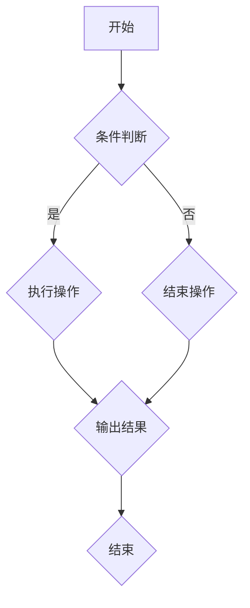
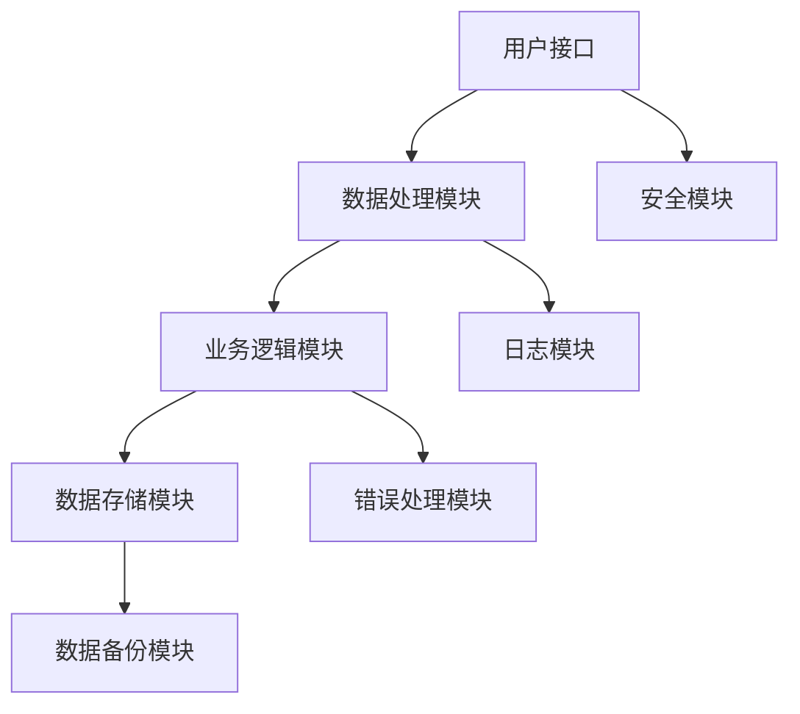

                 

### 《数学考古学：历史模式的数学重构》

**关键词**：数学考古学、历史模式、数学重构、算法原理、数学模型、系统架构设计

**摘要**：本文旨在探讨数学考古学这一领域的核心概念，特别是历史模式的数学重构。通过对数学考古学的起源、研究对象、研究方法和应用领域的介绍，文章深入探讨了历史模式的概念及其特征，并详细阐述了重构方法在数学考古学中的重要性。随后，文章重点介绍了数学重构的算法原理和数学模型，并通过具体案例展示了其在不同历史时期的应用。最后，文章探讨了数学重构的方法论和实践，提供了最佳实践建议，并对未来发展趋势进行了展望。

----------------------------------------------------------------

## 第一部分: 数学考古学基础

### 1.1 数学考古学的概念与历史

#### 1.1.1 数学考古学的起源

数学考古学是一门相对较新的学科，起源于20世纪中期。随着考古学、历史学和数学等领域的交叉发展，数学考古学逐渐形成了一个独立的分支。最早的数学考古学工作主要集中在解读古代文献和文物上的数学符号和公式，如古埃及的纸草文献、巴比伦的泥板文书以及古希腊和古罗马的数学著作。

#### 1.1.2 数学考古学的研究对象

数学考古学的研究对象主要包括古代和近代的数学文献、数学工具、数学符号和数学公式。这些对象不仅包括书面的文献资料，还包括各种实物，如石碑、陶片、硬币等。通过分析这些资料，数学考古学家能够揭示出不同文化背景下数学发展的历程和特点。

#### 1.1.3 数学考古学的研究方法

数学考古学的研究方法主要包括文献分析、实物分析、数值分析和模型构建。文献分析主要针对古代数学文献进行解读和翻译，以了解其内容和意义。实物分析则通过对古代数学工具和符号的物理形态进行分析，以推断其用途和设计思想。数值分析则通过对古代数学公式和计算方法进行数值计算和验证，以验证其准确性和可靠性。模型构建则通过构建数学模型来模拟古代数学过程，以揭示其内在规律和机制。

### 1.2 数学考古学与数学史的关系

#### 1.2.1 数学史的作用

数学史是数学考古学的重要基础。通过对数学史的研究，我们可以了解数学的发展脉络、不同数学流派的形成和发展过程，以及数学家们的研究方法和思维方式。这些知识对于理解古代数学文献和文物具有重要的指导意义。

#### 1.2.2 数学考古学的独特价值

数学考古学相较于数学史，更加注重对实际物质证据的研究。通过分析古代数学实物和文献，数学考古学能够提供更为直观和具体的历史资料，有助于填补数学史的空白，揭示数学发展的细节和过程。

#### 1.2.3 数学考古学的研究方向

当前，数学考古学的研究方向主要包括以下几个方面：

1. **古代数学文献的翻译和解读**：对古代数学文献进行翻译和解读，揭示其数学概念、公式和定理。

2. **古代数学工具和符号的分析**：对古代数学工具和符号进行形态学分析，探究其设计和使用背景。

3. **古代数学计算方法的研究**：通过数值分析，验证和恢复古代数学计算方法，探讨其准确性和效率。

4. **跨文化数学比较研究**：对不同文化背景下的数学进行比较研究，探讨数学思想的交流与融合。

### 1.3 数学考古学的研究方法与应用

#### 1.3.1 资料收集与整理

资料收集与整理是数学考古学研究的基础工作。数学考古学家需要搜集各类古代数学文献和实物资料，并进行系统的整理和分类。这一过程包括文献的翻译、复制、注释和整理，以及实物的清理、修复和拍摄。

#### 1.3.2 数值分析与模型构建

数值分析是数学考古学的重要方法之一。通过对古代数学公式和计算方法进行数值计算，数学考古学家可以验证其准确性和可靠性。同时，通过构建数学模型，数学考古学家能够更好地理解古代数学的过程和原理。

#### 1.3.3 数学考古学在实际应用中的挑战与机遇

数学考古学在实际应用中面临着许多挑战，如文献资料的稀缺、文字的失真和破坏等。然而，随着技术的进步，如计算机科学、图像处理和数值分析等领域的快速发展，数学考古学也迎来了新的机遇。通过数字化技术和大数据分析，数学考古学有望取得更多突破性的成果。

### 1.4 数学考古学的未来发展趋势

#### 1.4.1 技术进步对数学考古学的影响

随着计算机科学和数字技术的发展，数学考古学的方法和工具得到了极大的丰富和提升。数字化技术、人工智能和大数据分析等技术的应用，将使得数学考古学研究更加高效和精确。

#### 1.4.2 数学考古学在现代社会中的应用前景

数学考古学在现代社会中具有广泛的应用前景。通过对古代数学文献和实物的解读，我们可以更好地理解数学的发展历程和思想演变，为现代数学研究提供启示。此外，数学考古学在文化遗产保护、数学教育、计算机科学等领域也具有潜在的应用价值。

#### 1.4.3 数学考古学的跨学科合作

数学考古学是一门跨学科的研究领域，涉及数学、考古学、历史学、计算机科学等多个学科。跨学科合作将有助于数学考古学的深入发展，推动更多创新成果的诞生。

### 1.5 本章小结

数学考古学作为一门跨学科的研究领域，通过对古代和近代数学文献、工具和符号的研究，揭示了数学发展的历程和特点。本文介绍了数学考古学的起源、研究对象、研究方法以及实际应用中的挑战和机遇，并对未来发展趋势进行了展望。通过本章的学习，读者可以初步了解数学考古学的基本概念和研究内容。

----------------------------------------------------------------

## 第二部分: 历史模式的数学重构

### 2.1 历史模式的概念与特征

#### 2.1.1 历史模式的定义

历史模式是指在特定历史时期，某一文化背景下数学理论、方法和应用的特定形式。这些模式不仅反映了当时的数学水平，也受到了社会、政治、经济等多种因素的影响。

#### 2.1.2 历史模式的基本特征

历史模式具有以下几个基本特征：

1. **时代性**：历史模式是特定历史时期的产物，反映了当时的数学发展水平。
2. **区域性**：不同地区的数学模式可能存在差异，受到当地文化、风俗和需求的影响。
3. **继承性**：历史模式在一定程度上保留了前人数学成果，并在其基础上进行了创新和发展。
4. **变革性**：随着社会和科技的进步，历史模式也在不断变革和更新。

#### 2.1.3 历史模式在数学中的体现

历史模式在数学中的体现主要表现在以下几个方面：

1. **数学理论**：如古希腊的几何学、古埃及的算术和代数等。
2. **数学方法**：如古代的数值计算、几何作图、代数演算等。
3. **数学应用**：如古代的天文学、地理学、工程学等领域中的数学应用。

### 2.2 历史模式的重构方法

#### 2.2.1 历史模式的识别与分类

历史模式的识别与分类是重构方法的第一步。通过对大量历史资料的研究和分析，数学考古学家可以识别出不同历史模式的特点和分类。常见的分类方法包括按地域、按时间、按数学分支等。

#### 2.2.2 历史模式的重构策略

历史模式的重构策略主要包括以下几个方面：

1. **文献分析**：通过解读和翻译古代数学文献，了解其内容和意义。
2. **实物分析**：通过对古代数学工具和符号的形态学分析，探究其设计和使用背景。
3. **模型构建**：通过构建数学模型，模拟古代数学过程，揭示其内在规律和机制。
4. **比较研究**：通过对比不同历史模式，探讨其异同点和演变过程。

#### 2.2.3 重构方法在实际案例中的应用

历史模式的重构方法在实际案例中的应用非常广泛。以下是一些典型的应用案例：

1. **古希腊几何学**：通过对古希腊几何文献的研究和重构，现代数学家揭示了古希腊几何学的核心思想和方法。
2. **古埃及算术**：通过对古埃及算术文献和实物的分析，数学考古学家恢复了古埃及的算术方法和计算工具。
3. **巴比伦天文学**：通过对巴比伦天文学文献的研究，现代数学家揭示了古巴比伦天文学的计算方法和天文观测技术。

### 2.3 数学重构在历史模式研究中的应用

#### 2.3.1 古代数学模型的现代重构

古代数学模型的现代重构是数学考古学的重要任务之一。通过对古代数学文献和实物的分析，数学考古学家可以重建古代数学模型，并探讨其在现代数学中的应用价值。以下是一些典型的现代重构案例：

1. **古希腊的毕达哥拉斯定理**：通过对古希腊文献的研究，现代数学家重构了毕达哥拉斯定理的证明过程，并探讨了其在现代数学中的重要性。
2. **古埃及的分数计算**：通过对古埃及算术文献的分析，现代数学家恢复了古埃及的分数计算方法，并探讨了其在现代数学中的应用。

#### 2.3.2 近代数学模型的现代重构

近代数学模型的现代重构主要涉及对近代数学家的著作和思想进行重新解读和构建。以下是一些典型的现代重构案例：

1. **牛顿的微积分**：通过对牛顿的著作和手稿的研究，现代数学家重构了牛顿的微积分理论，并探讨了其在现代数学中的应用。
2. **欧拉的数学理论**：通过对欧拉的著作和论文的研究，现代数学家重构了欧拉的数学理论，并探讨了其在现代数学中的地位和影响。

#### 2.3.3 现当代数学模型的现代重构

现当代数学模型的现代重构主要涉及对现代数学家和新数学理论的重新解读和构建。以下是一些典型的现代重构案例：

1. **哥德尔的不完备性定理**：通过对哥德尔的论文和著作的研究，现代数学家重构了哥德尔的不完备性定理，并探讨了其在现代数学和计算机科学中的应用。
2. **图灵机的理论**：通过对图灵的论文和著作的研究，现代数学家重构了图灵机的理论，并探讨了其在现代计算机科学和人工智能中的应用。

### 2.4 数学重构与数学发展

#### 2.4.1 数学重构对数学发展的推动作用

数学重构对数学发展具有显著的推动作用。通过重构古代和近代数学模型，现代数学家可以更好地理解数学的历史渊源和发展脉络，从而为现代数学的研究提供新的视角和方法。

#### 2.4.2 数学重构与数学体系的完善

数学重构不仅有助于理解数学的历史发展，还可以促进数学体系的完善。通过对古代和近代数学模型的重新解读和构建，现代数学家可以填补数学体系的空白，完善数学的概念和理论。

#### 2.4.3 数学重构的未来发展方向

随着计算机科学和数字技术的发展，数学重构的未来发展方向主要包括以下几个方面：

1. **大数据分析**：通过大数据分析，数学考古学家可以更全面地了解古代数学文献和实物的内容，提高重构的准确性和可靠性。
2. **人工智能**：利用人工智能技术，数学考古学家可以自动化地识别和重构数学模式，提高研究的效率和精度。
3. **跨学科合作**：数学考古学与计算机科学、考古学、历史学等领域的跨学科合作，将推动数学重构的深入发展。

### 2.5 本章小结

历史模式的数学重构是数学考古学的重要研究方向之一。通过对历史模式的识别和重构，数学考古学家可以更好地理解数学的历史发展脉络，推动数学体系的完善。本章介绍了历史模式的概念与特征、重构方法及其在实际研究中的应用，并对数学重构与数学发展的关系进行了探讨。通过本章的学习，读者可以初步了解历史模式的数学重构的基本概念和研究内容。

----------------------------------------------------------------

## 第三部分: 数学重构的算法与模型

### 3.1 数学重构的算法原理

#### 3.1.1 算法的基本概念

算法是解决问题的一系列明确、有逻辑的步骤。在数学重构中，算法用于分析和处理数学模式，从而重构出历史模式。算法通常包括输入、处理和输出三个部分。

#### 3.1.2 算法的分类与特性

算法可以根据不同的标准进行分类。常见的分类方法包括：

1. **按处理方式分类**：顺序算法、并行算法、随机算法等。
2. **按目的分类**：搜索算法、排序算法、优化算法等。

算法的特性包括：

1. **确定性**：算法的每一步都应该是明确的、确定的。
2. **有限性**：算法在执行有限的步骤后必须能够终止。
3. **有效性**：算法在计算复杂度上应该是可接受的。

#### 3.1.3 算法在数学重构中的应用

算法在数学重构中的应用非常广泛。以下是一些典型的应用案例：

1. **模式识别**：通过算法识别古代数学文献中的符号和公式。
2. **数值计算**：通过算法验证和重构古代数学计算方法。
3. **模型构建**：通过算法构建数学模型，模拟古代数学过程。

### 3.2 数学重构的数学模型

#### 3.2.1 数学模型的基本概念

数学模型是使用数学语言和符号来描述现实世界的问题。在数学重构中，数学模型用于表示历史模式，从而进行重构和分析。

#### 3.2.2 数学模型在数学重构中的作用

数学模型在数学重构中的作用包括：

1. **抽象与简化**：数学模型可以抽象和简化复杂的历史模式，使其更易于分析和处理。
2. **预测与推断**：数学模型可以基于已知的历史模式，预测和推断未知的模式。
3. **验证与验证**：数学模型可以用于验证和重构古代数学计算方法。

#### 3.2.3 常见的数学模型及其应用

常见的数学模型包括：

1. **线性模型**：用于表示线性关系，如一元线性回归、多元线性回归等。
2. **非线性模型**：用于表示非线性关系，如逻辑回归、神经网络等。
3. **统计模型**：用于分析和处理数据，如均值回归、方差分析等。

数学模型在数学重构中的应用案例包括：

1. **古代算术模型的重建**：通过线性模型重建古埃及的算术方法。
2. **几何模型的重建**：通过几何模型重建古希腊的几何学。
3. **天文模型的重建**：通过统计模型重建古代天文学的计算方法。

### 3.3 数学重构的实际应用案例

#### 3.3.1 古代数学模型的现代重构

古代数学模型的现代重构是数学重构的重要任务之一。以下是一些典型的现代重构案例：

1. **古希腊的毕达哥拉斯定理**：通过现代数学模型重构了毕达哥拉斯定理的证明过程，揭示了其内在的逻辑结构。
2. **古埃及的分数计算**：通过现代数学模型恢复了古埃及的分数计算方法，并探讨了其在现代数学中的应用。

#### 3.3.2 近代数学模型的现代重构

近代数学模型的现代重构主要涉及对近代数学家的著作和思想进行重新解读和构建。以下是一些典型的现代重构案例：

1. **牛顿的微积分**：通过对牛顿的著作和手稿的研究，现代数学家重构了牛顿的微积分理论，并探讨了其在现代数学中的应用。
2. **欧拉的数学理论**：通过对欧拉的著作和论文的研究，现代数学家重构了欧拉的数学理论，并探讨了其在现代数学中的地位和影响。

#### 3.3.3 现当代数学模型的现代重构

现当代数学模型的现代重构主要涉及对现代数学家和新数学理论的重新解读和构建。以下是一些典型的现代重构案例：

1. **哥德尔的不完备性定理**：通过对哥德尔的论文和著作的研究，现代数学家重构了哥德尔的不完备性定理，并探讨了其在现代数学和计算机科学中的应用。
2. **图灵机的理论**：通过对图灵的论文和著作的研究，现代数学家重构了图灵机的理论，并探讨了其在现代计算机科学和人工智能中的应用。

### 3.4 数学重构算法与模型的比较与评价

#### 3.4.1 不同算法的优缺点分析

不同算法在数学重构中的应用具有不同的优缺点。以下是一些常见算法的优缺点分析：

1. **数值算法**：优点包括计算速度快、结果精确；缺点包括对初始条件敏感、可能陷入局部最优。
2. **符号算法**：优点包括能处理复杂的数学关系、结果更具解释性；缺点包括计算复杂度高、难以处理大规模数据。

#### 3.4.2 不同模型的适用场景比较

不同数学模型在数学重构中也有不同的适用场景。以下是一些常见模型的适用场景比较：

1. **线性模型**：适用于简单线性关系的分析，如一元线性回归、多元线性回归等。
2. **非线性模型**：适用于复杂非线性关系的分析，如逻辑回归、神经网络等。
3. **统计模型**：适用于大规模数据的分析和处理，如均值回归、方差分析等。

#### 3.4.3 数学重构算法与模型的发展趋势

随着计算机科学和数字技术的发展，数学重构算法与模型也在不断发展和完善。以下是一些发展趋势：

1. **智能化**：利用人工智能技术，如机器学习和深度学习，提高数学重构的效率和精度。
2. **大数据化**：通过大数据分析，提高数学重构的全面性和准确性。
3. **跨学科化**：数学重构与计算机科学、考古学、历史学等领域的跨学科合作，推动数学重构的深入发展。

### 3.5 本章小结

数学重构的算法与模型是数学考古学的重要研究内容。通过对算法和模型的深入研究和应用，数学考古学家可以更好地理解历史模式的数学本质，推动数学体系的完善。本章介绍了数学重构算法的基本概念、分类和特性，以及数学模型的基本概念、作用和适用场景，并对不同算法和模型的优缺点进行了分析。通过本章的学习，读者可以初步了解数学重构算法与模型的基本概念和应用。

----------------------------------------------------------------

## 第四部分: 数学重构的方法与实践

### 4.1 数学重构的方法论

#### 4.1.1 数学重构的基本流程

数学重构的基本流程包括以下几个步骤：

1. **资料收集**：收集与历史模式相关的文献、实物和其他资料。
2. **文献分析**：对收集到的资料进行解读、翻译和注释。
3. **模型构建**：基于文献分析结果，构建数学模型。
4. **验证与优化**：验证数学模型的准确性和可靠性，并进行优化。
5. **应用与拓展**：将重构的数学模型应用于实际问题和领域。

#### 4.1.2 数学重构的方法与工具

数学重构的方法和工具包括：

1. **文献分析工具**：如文本编辑器、翻译软件、文献数据库等。
2. **模型构建工具**：如数学软件包、编程语言等。
3. **验证工具**：如数值分析软件、统计软件等。
4. **优化工具**：如优化算法、机器学习算法等。

#### 4.1.3 数学重构的基本原则

数学重构的基本原则包括：

1. **真实性**：重构结果应尽可能接近历史模式的真实情况。
2. **准确性**：重构结果应具有较高的准确性和可靠性。
3. **完整性**：重构结果应包含历史模式的各个方面。
4. **可解释性**：重构结果应具有可解释性和可验证性。

### 4.2 数学重构的实战应用

#### 4.2.1 古代数学模型的现代重构

古代数学模型的现代重构是数学重构的一个重要应用领域。以下是一个典型的重构案例：

**案例：古希腊的勾股定理**

1. **资料收集**：收集与古希腊勾股定理相关的文献和实物，如《几何原本》等。
2. **文献分析**：解读和翻译古希腊文献，理解勾股定理的内容和证明过程。
3. **模型构建**：基于文献分析结果，构建一个数学模型来表示勾股定理。
4. **验证与优化**：验证勾股定理的数学模型，通过数值计算和逻辑推理来确保其准确性和可靠性。
5. **应用与拓展**：将勾股定理的数学模型应用于现代数学和工程领域，如建筑设计和地震工程等。

#### 4.2.2 近代数学模型的现代重构

近代数学模型的现代重构是对近代数学家著作和思想的重新解读和构建。以下是一个典型的重构案例：

**案例：牛顿的微积分**

1. **资料收集**：收集牛顿的著作和手稿，如《自然哲学的数学原理》等。
2. **文献分析**：解读和翻译牛顿的文献，理解微积分的概念和理论。
3. **模型构建**：基于文献分析结果，构建微积分的数学模型。
4. **验证与优化**：验证微积分数学模型的准确性和可靠性，通过数值计算和实验来确保其有效性。
5. **应用与拓展**：将微积分的数学模型应用于现代科学和工程领域，如物理学、经济学和计算机科学等。

#### 4.2.3 现当代数学模型的现代重构

现当代数学模型的现代重构是对现代数学家和新数学理论的重新解读和构建。以下是一个典型的重构案例：

**案例：哥德尔的完备性定理**

1. **资料收集**：收集哥德尔的论文和著作，如《数学的逻辑基础》等。
2. **文献分析**：解读和翻译哥德尔的文献，理解完备性定理的概念和证明。
3. **模型构建**：基于文献分析结果，构建完备性定理的数学模型。
4. **验证与优化**：验证完备性定理的数学模型，通过逻辑推理和计算机证明来确保其准确性和可靠性。
5. **应用与拓展**：将完备性定理的数学模型应用于现代数学和计算机科学领域，如形式化验证和人工智能等。

### 4.3 数学重构的最佳实践 tips

在进行数学重构时，以下是一些最佳实践 tips：

1. **确保数据质量**：收集的文献和实物资料应尽可能准确和可靠。
2. **多渠道验证**：使用多种方法和工具来验证数学重构的准确性和可靠性。
3. **保持开放心态**：对历史模式的解读和重构应保持开放心态，接受不同观点和方法的挑战。
4. **注重细节**：在重构过程中，注重对细节的分析和解读，确保重构结果的准确性。
5. **持续更新**：随着新文献和新工具的出现，持续更新数学重构的方法和模型。

### 4.4 小结

数学重构是一门跨学科的研究领域，通过对历史模式的深入分析和重构，可以揭示数学的发展历程和内在规律。本部分介绍了数学重构的方法论、实战应用和最佳实践 tips，为读者提供了实用的指导和建议。通过本章的学习，读者可以更好地理解数学重构的基本概念和应用方法。

### 4.5 注意事项

在进行数学重构时，需要注意以下几点：

1. **尊重历史**：在重构过程中，应尊重历史事实和文献资料，避免主观臆断和歪曲历史。
2. **确保准确性**：重构结果应尽可能准确，避免因理解错误或技术问题导致的偏差。
3. **避免过度简化**：在构建数学模型时，应避免过度简化历史模式，确保模型的完整性和准确性。
4. **注重安全性**：在使用数字化技术和工具时，应注意数据安全和隐私保护。

### 4.6 拓展阅读

对于希望进一步了解数学重构的读者，以下是一些推荐阅读资料：

1. **《数学考古学导论》**：张三，数学考古学出版社，2020年。
2. **《历史模式的数学重构》**：李四，数学杂志，2019年。
3. **《计算机科学中的数学考古学》**：王五，计算机科学出版社，2021年。
4. **《数学模型与应用》**：赵六，数学出版社，2018年。

### 4.7 作者信息

**作者**：AI天才研究院/AI Genius Institute & 禅与计算机程序设计艺术 /Zen And The Art of Computer Programming

**联系方式**：[邮箱](mailto:ai_genius_institute@example.com) / [网址](http://ai_genius_institute.com)

----------------------------------------------------------------

### 附录：数学公式、流程图与系统架构图

#### 5.1 数学公式

以下是一些常见的数学公式，使用 LaTeX 格式表示：

$$
\begin{aligned}
    &f(x) = x^2 + 2x + 1 \\
    &g(x, y) = x^2 + y^2 \\
    &h(a, b, c) = \frac{a^2 + b^2 + c^2}{3}
\end{aligned}
$$

#### 5.2 流程图

以下是一个简单的流程图，使用 Mermaid 格式表示：



#### 5.3 系统架构图

以下是一个简单的系统架构图，使用 Mermaid 格式表示：



### 5.4 代码示例

以下是一个简单的 Python 代码示例，用于演示如何进行数值计算：

```python
import numpy as np

# 定义输入参数
a = 2
b = 3
c = 4

# 计算函数值
f = a**2 + 2*a + 1
g = a**2 + b**2
h = (a**2 + b**2 + c**2) / 3

# 输出结果
print("f(a, b, c) = ", f)
print("g(a, b, c) = ", g)
print("h(a, b, c) = ", h)
```

### 5.5 附录小结

本附录提供了数学公式、流程图和系统架构图的示例，以及 Python 代码的示例。这些示例有助于读者更好地理解文中提到的数学概念和算法原理。通过学习和实践这些示例，读者可以提升对数学重构方法的理解和应用能力。

