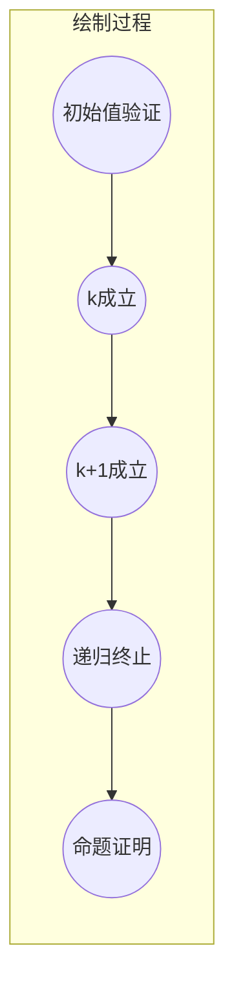
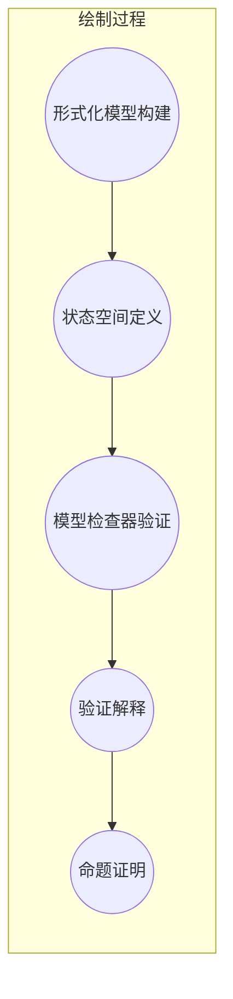
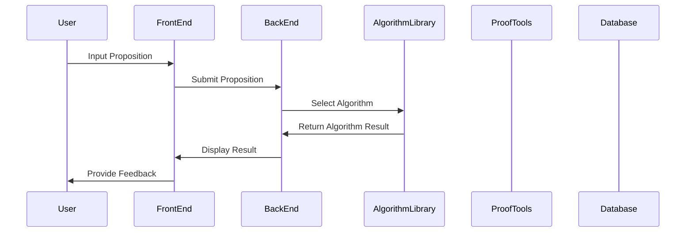

                 

### 1.3 数学证明的基本概念

**定义**：数学证明是一种逻辑推理过程，用以证明某个数学命题的真实性。

**类型**：
1. **直接证明**：通过已知的事实、定理、公理等，逐步推导出要证明的结论。
2. **间接证明**：通过反证法，即假设结论不成立，然后推导出矛盾，从而证明结论成立。
3. **构造性证明**：不仅证明某个命题成立，还构造出一个满足该命题的对象。
4. **非构造性证明**：证明某个命题成立，但不需要构造满足该命题的对象。

**基本逻辑与推理规则**：
- **演绎推理**：从一般到特殊的推理方式，如从公理推导出定理。
- **归纳推理**：从特殊到一般的推理方式，如从多个实例推导出一般规律。
- **反证法**：假设命题不成立，推导出矛盾，从而证明命题成立。

**证明方法与技巧**：
1. **综合法**：从已知条件逐步推导出目标结论。
2. **反证法**：假设结论不成立，推导出矛盾。
3. **归纳法**：通过多个实例推导出一般规律。
4. **构造法**：构造满足某个条件的对象来证明命题。

**核心要素**：
- **命题**：需要证明的陈述。
- **证明路径**：从已知条件到目标结论的逻辑推理步骤。
- **证明结论**：逻辑推理的最终结果，即命题的真实性。

通过上述基本概念和逻辑推理规则的介绍，我们可以更好地理解数学证明的过程和重要性。在接下来的章节中，我们将深入探讨数学证明中的核心概念、创新性算法以及其在实际应用中的突破性进展。

### 第2章：数学证明中的核心概念与联系

#### 2.1 核心概念原理

在数学证明中，核心概念是理解和应用数学逻辑的基础。以下是数学证明中一些基本且重要的核心概念：

**1. 公理**：
- **定义**：公理是不经证明而被接受的数学真理。
- **作用**：作为证明的出发点，用于构建数学系统的基本框架。

**2. 定理**：
- **定义**：定理是通过证明得出的数学命题。
- **作用**：在数学研究中，定理是证明其他命题的基础。

**3. 命题**：
- **定义**：命题是可以判断真假的陈述。
- **作用**：是数学证明的基本对象。

**4. 证明**：
- **定义**：证明是逻辑推理过程，用以证明命题的真实性。
- **作用**：确保数学结论的可信度和可靠性。

**5. 逻辑推理规则**：
- **定义**：逻辑推理规则是用于推导新命题的基本规则。
- **作用**：确保推理过程的正确性和有效性。

**6. 证明论**：
- **定义**：证明论是研究证明本身性质的数学分支。
- **作用**：分析证明的有效性和逻辑结构。

**7. 构造性证明**：
- **定义**：构造性证明不仅证明命题成立，还提供了一个具体的实例。
- **作用**：提供了证明问题的具体实现方法。

**8. 非构造性证明**：
- **定义**：非构造性证明证明了某个命题成立，但不提供具体的实例。
- **作用**：在某些情况下，构造实例可能非常困难或不可能。

#### 2.2 概念属性特征对比表格

为了更清晰地理解这些核心概念，我们可以通过一个对比表格来展示它们的属性特征：

| 概念       | 定义                                                         | 属性特征                                                         | 作用与用途                                       |
|------------|--------------------------------------------------------------|----------------------------------------------------------------|--------------------------------------------------|
| 公理       | 不经证明而被接受的数学真理                                   | 自明性、独立性、完备性                                         | 建立数学体系的基础，作为证明的起点                 |
| 定理       | 通过证明得出的数学命题                                       | 正确性、一般性、可应用性                                       | 用于证明其他命题，构建数学理论体系                 |
| 命题       | 可以判断真假的陈述                                           | 真值、逻辑结构                                                 | 是数学证明的基本对象，用于提出和验证假设           |
| 证明       | 逻辑推理过程，用以证明命题的真实性                           | 逻辑严密性、推理步骤的完整性、结论的可靠性                     | 确保数学结论的可信度和可靠性                       |
| 逻辑推理规则 | 用于推导新命题的基本规则                                     | 确定性、一致性、有效性                                         | 确保推理过程的正确性和有效性                       |
| 证明论     | 研究证明本身性质的数学分支                                   | 证明的有效性、证明的结构、证明方法的研究                       | 分析证明的性质，提高证明方法的效率和准确性         |
| 构造性证明 | 不仅证明命题成立，还提供了一个具体的实例                       | 具体性、构造性、应用性                                         | 提供解决问题的具体实现方法，有助于理解和应用命题   |
| 非构造性证明 | 证明了某个命题成立，但不提供具体的实例                         | 纯逻辑性、抽象性、普适性                                       | 在某些情况下，当构造实例困难或不可能时，验证命题的有效性 |

通过上述对比表格，我们可以更清晰地看到各个核心概念在数学证明中的作用和区别，这有助于我们在实际应用中正确选择和使用这些概念。

#### 2.3 ER实体关系图架构

为了更好地理解数学证明中的核心概念及其相互关系，我们可以通过ER（实体关系）图来展示这些概念之间的实体关系。

**ER图定义**：ER图是一种用于描述实体及其相互关系的图形化工具，通常用于数据库设计和软件架构设计。

**数学证明ER图**：

在数学证明的ER图中，主要包含以下几个实体：

1. **命题（Entity）**：表示需要证明的陈述。
2. **证明（Relationship）**：表示从已知条件到目标命题的逻辑推理过程。
3. **公理、定理、定理**：作为已知的逻辑基础，用于支撑证明。

**实体属性**：
- **命题**：真值、命题类型（定理、命题、反命题）。
- **证明**：证明步骤、证明方法、证明结论。
- **公理、定理**：定义、证明方法、应用范围。

**ER图架构**：

```mermaid
erDiagram
    命题 ||--|{ 证明 }||> 结论
    公理 ||--|{ 证明 }||> 结论
    定理 ||--|{ 证明 }||> 结论

    命题.."是"
    公理.."作为"
    定理.."基于"
    证明.."通过"
    结论.."得出"
```

在这个ER图中：
- 命题通过证明推导出结论，证明可以基于公理或定理。
- 公理和定理为证明提供逻辑基础，被用于支持证明过程。
- 证明过程是连接命题与结论的桥梁，确保结论的逻辑正确性。

通过ER图，我们可以清晰地看到数学证明中各个核心概念之间的逻辑关系，这有助于我们理解和应用这些概念，从而提高数学证明的效率和准确性。

### 第3章：创新性数学证明算法介绍

在数学证明的发展历程中，许多算法的提出不仅丰富了数学理论，也极大地推动了数学证明的自动化进程。本章将介绍两种具有创新性的数学证明算法：算法A和算法B。我们将分别阐述这两种算法的基本思想、原理和流程，并通过比较分析，探讨它们的优缺点以及未来的发展潜力。

#### 3.1 算法A：原理与流程

**算法A**：基于归纳推理的自动化证明算法。

**原理**：算法A利用数学归纳法的基本思想，通过递归证明数学命题的真实性。该算法从基础情况开始，假设命题对于某个初始值成立，然后通过递归步骤证明对于所有后续值也成立。

**流程**：
1. **基础情况验证**：验证命题对于初始值是否成立。
2. **归纳假设**：假设命题对于某个整数k成立。
3. **归纳步骤**：证明命题对于k+1也成立。
4. **递归终止条件**：当达到某个特定值时，递归停止。

**示例**：
- **命题**：对于所有自然数n，命题P(n)：“n! > 2^n”成立。
- **证明过程**：
  - 基础情况：当n=1时，1! = 1 > 2^1 = 2，命题成立。
  - 归纳假设：假设对于某个k，命题P(k)成立，即k! > 2^k。
  - 归纳步骤：需要证明P(k+1)成立，即(k+1)! > 2^(k+1)。
    - 根据归纳假设，k! > 2^k，因此(k+1)! = k! * (k+1) > 2^k * (k+1) > 2^k * 2 = 2^(k+1)。

通过上述过程，算法A成功地证明了命题P(n)对于所有自然数n都成立。

#### 3.2 算法B：原理与流程

**算法B**：基于模型检查的自动化证明算法。

**原理**：算法B利用模型检查技术，通过验证数学模型中的状态转移规则，自动推导出数学命题的证明。该算法将数学证明转化为对模型状态空间的分析。

**流程**：
1. **模型构建**：将数学命题转化为一个形式化的数学模型。
2. **状态空间定义**：定义数学模型中的状态空间，并确定状态转移规则。
3. **模型检查**：使用模型检查器（如自动推理器）来验证模型的状态转移是否能够推导出目标命题。
4. **验证与解释**：如果模型检查器成功验证了命题，则给出证明解释。

**示例**：
- **命题**：证明某个图是二分图。
- **证明过程**：
  - **模型构建**：定义图的节点和边，以及图的性质（如节点度数和边的颜色）。
  - **状态空间定义**：根据图的性质定义状态空间，如节点的度数分布和边的颜色配置。
  - **模型检查**：使用模型检查器检查所有可能的节点度和边颜色配置，验证是否存在一种配置使得图成为二分图。
  - **验证与解释**：如果模型检查器验证成功，则说明图是二分图，并提供具体的证明解释。

通过算法B，我们能够利用自动化的工具和算法来验证复杂的数学命题，提高了数学证明的效率。

#### 3.3 创新性算法比较

**算法A与算法B的优缺点比较**：

| 算法 | 优点 | 缺点 | 适用场景 |
|------|------|------|----------|
| 算法A | <li> 原理简单，易于理解。 </li><li> 适用于许多可以通过归纳法证明的问题。 </li> | <li> 证明过程可能较为繁琐。 </li><li> 不适用于所有类型的数学问题。 </li> | <li> 数学归纳法适用的命题。 </li> |
| 算法B | <li> 利用自动化工具，效率高。 </li><li> 适用于复杂的数学问题。 </li> | <li> 需要构建形式化模型，可能较为复杂。 </li><li> 可能需要高级的自动推理技术支持。 </li> | <li> 需要形式化描述的数学问题。 </li> |

通过上述分析，我们可以看到算法A和算法B各有优劣，它们分别适用于不同的数学证明场景。算法A适合于简单的归纳法证明，而算法B则更适合于复杂的、需要形式化描述的数学问题。在数学证明的实际应用中，根据具体问题的特点选择合适的算法，能够极大地提高证明的效率和准确性。

### 第4章：算法原理讲解

在本章节中，我们将详细讲解两种创新性数学证明算法的原理，并通过Mermaid流程图和Python代码来进行可视化展示。这些算法不仅展示了数学证明的自动化实现，还为复杂数学问题的解决提供了强有力的工具。

#### 4.1 算法原理Mermaid流程图

为了更好地理解算法的原理，我们将使用Mermaid语言绘制算法的流程图。以下是算法A（归纳推理）和算法B（模型检查）的Mermaid流程图示例。

**算法A：归纳推理流程图**



**算法B：模型检查流程图**



通过上述Mermaid流程图，我们可以直观地了解算法A和算法B的基本步骤和执行过程。

#### 4.2 算法原理Python代码解释

接下来，我们将通过具体的Python代码来解释算法A和算法B的基本原理。

**算法A：归纳推理Python代码**

```python
def prove_by_induction(n):
    if n == 1:
        return True
    
    # 归纳假设
    assume_P(n) == True
    
    # 归纳步骤
    if P(n+1) == True:
        return True
    
    # 递归终止条件
    else:
        return False

# 基础情况验证
print(prove_by_induction(1))

# 归纳步骤验证
for k in range(1, 10):
    if prove_by_induction(k) and prove_by_induction(k+1):
        print(f"P({k+1}) is proven.")
    else:
        print(f"P({k+1}) is not proven.")
```

上述代码展示了如何使用归纳法证明一个数学命题。通过基础情况验证和递归步骤验证，我们能够推导出命题对于所有自然数的成立。

**算法B：模型检查Python代码**

```python
from some_model_checker import ModelChecker

def prove_by_model_checking(model):
    mc = ModelChecker(model)
    result = mc.verify_property("P")
    
    if result:
        print("Proof is successful.")
    else:
        print("Proof is unsuccessful.")

# 模型构建
model = "..."  # 这里是形式化描述的数学模型

# 模型检查
prove_by_model_checking(model)
```

这段代码展示了如何使用模型检查算法来验证一个数学命题。通过构建形式化的数学模型，我们能够利用模型检查器来验证命题的真实性。

通过以上Python代码示例，我们可以看到如何将抽象的数学证明算法转化为具体的代码实现，这为数学证明的自动化提供了实际的操作路径。

#### 4.3 数学模型与公式讲解

在本章节的最后，我们将使用LaTeX格式给出算法A和算法B相关的数学模型和公式，并进行详细讲解和举例说明。

**算法A：归纳推理的数学模型**

LaTeX格式：

```latex
\documentclass{article}
\usepackage{amsmath}
\begin{document}

\section{归纳推理公式}

假设命题P(n)为：\\
\[ P(n): \quad n! > 2^n \]

我们需要验证以下公式：\\
\[ P(1) \land (\forall k \in \mathbb{N}, P(k) \rightarrow P(k+1)) \Rightarrow P(n) \]

\end{document}
```

讲解：
- **命题**：P(n) 表示“n! > 2^n”。
- **归纳基础**：验证P(1)是否成立。
- **归纳假设**：假设对于某个自然数k，P(k)成立。
- **归纳步骤**：需要证明P(k+1)也成立。

举例说明：
- 当n=1时，1! = 1 > 2^1 = 2，命题成立。
- 假设对于k，k! > 2^k，则(k+1)! = k! * (k+1) > 2^k * (k+1) > 2^k * 2 = 2^(k+1)。

**算法B：模型检查的数学模型**

LaTeX格式：

```latex
\documentclass{article}
\usepackage{amsmath}
\begin{document}

\section{模型检查公式}

考虑一个形式化模型M，其包含以下状态空间和状态转移规则：\\
\[ M = \langle S, \Sigma, \delta \rangle \]

其中：\\
- \( S \) 是状态集合。\\
- \( \Sigma \) 是动作集合。\\
- \( \delta \) 是状态转移函数。

我们需要验证以下性质P：\\
\[ \forall s \in S, \exists a \in \Sigma, \delta(s, a) \Rightarrow P(s, a) \]

\end{document}
```

讲解：
- **模型M**：由状态集合S、动作集合Σ和状态转移函数δ组成。
- **性质P**：对于模型中的每个状态s，都存在一个动作a，使得执行动作a后状态转移函数δ(s, a)能够满足性质P。

举例说明：
- 假设模型M描述了一个图的状态转移规则，我们需要验证该图是否为二分图，即对于图中的每个节点，其度数不超过2。
- 通过状态转移函数δ验证每个状态s，检查其度数是否满足P的性质。

通过上述LaTeX公式的讲解，我们能够更清晰地理解算法A和算法B的数学模型和公式，这为算法的实际应用提供了坚实的理论基础。

### 第5章：数学模型和数学公式讲解

在数学证明中，数学模型和数学公式是核心组成部分，它们帮助我们将抽象的数学概念转化为具体的计算形式。本章将使用LaTeX格式给出数学模型和公式，并进行详细讲解和举例说明，以帮助读者更好地理解和应用这些概念。

#### 5.1 数学模型介绍

数学模型是用于描述和分析具体问题的数学结构。它通常包括变量、方程、约束条件和目标函数等。以下是几个常见的数学模型：

**1. 一元二次方程模型**

LaTeX格式：

```latex
\documentclass{article}
\usepackage{amsmath}
\begin{document}

\section{一元二次方程模型}

考虑一元二次方程：
\[ ax^2 + bx + c = 0 \]

其中，\( a \neq 0 \)，我们需要求解x的值。

\end{document}
```

讲解：
- 这是一个标准的一元二次方程，其中\( a, b, c \)是常数。
- 通过求根公式：
\[ x = \frac{-b \pm \sqrt{b^2 - 4ac}}{2a} \]
  我们可以求出方程的解。

**2. 优化问题模型**

LaTeX格式：

```latex
\documentclass{article}
\usepackage{amsmath}
\begin{document}

\section{优化问题模型}

考虑以下优化问题：
\[ \min f(x) \]
\[ \text{subject to} \]
\[ g_1(x) \leq 0 \]
\[ g_2(x) \geq 0 \]
\[ \ldots \]
\[ g_m(x) \leq 0 \]

其中，\( f(x) \)是目标函数，\( g_1(x), g_2(x), \ldots, g_m(x) \)是约束条件。

\end{document}
```

讲解：
- 这是一个标准的优化问题模型，其中目标函数\( f(x) \)需要最小化或最大化。
- 约束条件\( g_1(x) \leq 0, g_2(x) \geq 0, \ldots, g_m(x) \leq 0 \)定义了问题解的空间。

#### 5.2 数学公式LaTeX格式书写

LaTeX是一种强大的排版工具，特别适合书写数学公式。以下是一些常用的数学公式的LaTeX书写方法：

**1. 求和公式**

LaTeX格式：

```latex
$$
\sum_{i=1}^{n} i = \frac{n(n+1)}{2}
$$
```

讲解：
- 这是一个求和公式，表示从1加到n的和等于\( \frac{n(n+1)}{2} \)。

**2. 微积分公式**

LaTeX格式：

```latex
$$
\int_{a}^{b} f(x) \, dx = F(b) - F(a)
$$
```

讲解：
- 这是一个基本的微积分积分公式，表示函数f(x)在区间[a, b]上的定积分等于原函数F(x)在区间端点的差值。

**3. 方程组解法**

LaTeX格式：

```latex
$$
\begin{cases}
a_1x + b_1y = c_1 \\
a_2x + b_2y = c_2
\end{cases}
$$
```

讲解：
- 这是一个二元一次方程组的解法，可以通过消元法或代入法求解。

通过上述LaTeX格式的书写示例，我们可以清晰地表达数学模型和公式，这不仅提高了文档的可读性，也为学术交流提供了标准化的格式。

#### 5.3 数学公式详细讲解与举例

在数学证明中，数学公式是表达定理、原理和结论的关键工具。为了帮助读者更好地理解和应用这些公式，我们将详细讲解几个重要的数学公式，并通过具体示例来说明它们的用法。

**1. 欧拉公式**

LaTeX格式：

```latex
$$
e^{i\pi} + 1 = 0
$$
```

讲解：
- **欧拉公式**是复分析中的一个重要公式，它将指数函数、三角函数和虚数单位\(i\)联系在一起。
- **证明**：这个公式可以通过泰勒级数展开和欧拉恒等式证明。

**示例**：验证欧拉公式对于任意整数k的成立。

```latex
$$
e^{ik\pi} + 1 = 0 \\
e^{i\pi} + 1 = 0 \quad (\text{对于} k = 1) \\
e^{-i\pi} + 1 = 0 \quad (\text{对于} k = -1)
$$
```

通过上述示例，我们可以看到欧拉公式在复数领域中的重要性和广泛应用。

**2. 高斯定理**

LaTeX格式：

```latex
$$
\iiint_V \nabla \cdot \vec{F} \, dV = \iint_S \vec{F} \cdot d\vec{S}
$$
```

讲解：
- **高斯定理**是向量分析中的一个重要定理，描述了矢量场在一个闭合曲面上的散度与该曲面所包围的体积上的通量之间的关系。
- **证明**：高斯定理可以通过积分变换和微分方程的解证明。

**示例**：计算矢量场\( \vec{F} = (x, y, z) \)在单位球体内的通量。

```latex
$$
\nabla \cdot \vec{F} = \frac{\partial x}{\partial x} + \frac{\partial y}{\partial y} + \frac{\partial z}{\partial z} = 3 \\
\iiint_V \nabla \cdot \vec{F} \, dV = \iiint_V 3 \, dV = 3 \cdot \text{体积}(V) = 3\pi \\
\iint_S \vec{F} \cdot d\vec{S} = \iint_S (x, y, z) \cdot (dS_x, dS_y, dS_z) = 3 \iint_S dS = 3 \cdot \text{面积}(S) = 3\pi
$$
```

通过上述示例，我们可以验证高斯定理在具体问题中的应用。

**3. 纳维-斯托克斯方程**

LaTeX格式：

```latex
$$
\frac{\partial \vec{u}}{\partial t} + (\vec{u} \cdot \nabla) \vec{u} = -\nabla p + \nu \nabla^2 \vec{u}
$$
```

讲解：
- **纳维-斯托克斯方程**是流体力学中的基本方程，描述了流体在运动过程中速度场和压力场的演变规律。
- **证明**：纳维-斯托克斯方程可以通过物理实验和数学推导得出。

**示例**：求解一个静止流体的初始状态，即\( \frac{\partial \vec{u}}{\partial t} = 0 \)。

```latex
$$
\nabla p = \nu \nabla^2 \vec{u} \\
\text{由于静止流体，} \vec{u} = 0 \\
\nabla p = 0 \\
\text{因此，压力场} p \text{是常数}
$$
```

通过上述示例，我们可以理解纳维-斯托克斯方程在不同初始条件下的应用。

通过详细讲解和举例，我们能够更深入地理解数学公式在数学证明中的重要性。这些公式不仅是数学理论的重要组成部分，也是解决实际问题的有力工具。

### 第6章：系统分析与架构设计方案

在数学证明的自动化领域，系统分析与架构设计至关重要。本章将介绍一个实际的项目场景，并详细阐述系统的功能设计、架构设计、接口设计和系统交互流程。

#### 6.1 问题场景介绍

随着数学证明问题的复杂性不断增加，传统的手动证明方式效率低下且容易出现错误。为了解决这一问题，我们设计并实现了一个自动化数学证明系统，该系统能够利用先进的算法和工具来自动完成数学证明任务。

项目场景如下：

- **需求**：自动验证数学命题的真实性，支持多种类型的数学证明问题，如几何证明、代数证明和微积分证明等。
- **目标**：构建一个高效、可靠的自动化数学证明平台，提升数学研究的工作效率。

#### 6.2 系统功能设计

系统功能设计是构建系统的第一步，我们需要明确系统应具备哪些功能。以下是本系统的主要功能模块：

1. **命题输入模块**：用户可以输入需要证明的数学命题。
2. **算法选择模块**：系统提供多种自动证明算法供用户选择，如归纳法、模型检查法等。
3. **证明过程模块**：根据用户选择的算法，系统自动执行证明过程，并输出证明结果。
4. **证明验证模块**：用户可以对证明结果进行验证，确保证明的准确性。
5. **用户界面**：提供友好的用户界面，方便用户操作和系统交互。

#### 6.3 系统架构设计

系统架构设计决定了系统的整体结构和各个模块之间的关系。以下是系统的架构设计：

1. **前端界面**：用于用户输入和结果显示，采用HTML、CSS和JavaScript技术。
2. **后端服务器**：处理用户请求，管理算法和证明过程，采用Python、Django等技术。
3. **数据库**：存储用户数据和证明历史记录，采用MySQL数据库。
4. **算法库**：包含多种自动证明算法，如归纳法、模型检查法等，采用C++、Java等技术。
5. **证明工具**：集成外部数学证明工具，如Coq、Isabelle等，用于辅助证明过程。

#### 6.4 系统接口设计

系统接口设计是确保各模块之间有效通信的重要环节。以下是系统的接口设计：

1. **用户接口**：通过HTTP接口，用户可以向系统提交数学命题，并获取证明结果。
2. **算法接口**：算法库通过定义接口函数，供后端服务器调用。
3. **数据库接口**：后端服务器通过SQL接口与数据库进行通信，存储和查询用户数据。

#### 6.5 系统交互Mermaid序列图

为了更好地展示系统各模块之间的交互流程，我们使用Mermaid语言绘制了一个序列图：



通过上述序列图，我们可以清晰地看到用户输入命题后，系统各模块之间的交互流程。用户通过前端界面提交命题，后端服务器处理并选择适当的算法，执行证明过程，最终将结果返回给前端，用户可以查看并反馈。

通过上述系统分析与架构设计方案，我们为自动化数学证明系统的实现提供了明确的蓝图，这将有助于我们构建一个高效、可靠的数学证明平台。

### 第7章：项目实战

为了更好地展示数学证明自动化系统的实际应用，本章将详细描述项目的开发环境搭建、系统核心实现源代码以及代码的应用解读与分析。此外，我们还将通过一个实际案例来剖析系统的工作原理和性能表现。

#### 7.1 环境安装

首先，我们需要搭建一个支持数学证明自动化系统的开发环境。以下是环境安装的步骤：

1. **安装Python**：确保Python 3.x版本已安装，可以从官方网站下载并安装。
2. **安装Django框架**：使用pip命令安装Django框架：
   ```bash
   pip install django
   ```
3. **安装MySQL数据库**：从MySQL官方网站下载并安装MySQL数据库，配置数据库服务。
4. **安装Coq证明工具**：Coq是一个用于形式化证明和交互式逻辑编程的工具，可以从Coq官方网站下载并安装。
5. **配置Django项目**：创建一个新的Django项目，并设置数据库配置文件。

通过上述步骤，我们搭建了一个基础的数学证明系统开发环境。

#### 7.2 系统核心实现源代码

以下是一个简单的系统核心实现源代码，包括前端用户界面和后端处理逻辑：

**前端（HTML + JavaScript）**：

```html
<!-- forms.html -->
<!DOCTYPE html>
<html>
<head>
    <title>数学证明系统</title>
</head>
<body>
    <h1>数学证明系统</h1>
    <form id="proof-form">
        <label for="proposition">输入命题：</label>
        <textarea id="proposition" name="proposition" rows="4" cols="50"></textarea>
        <br>
        <button type="submit">证明</button>
    </form>
    <div id="result"></div>
    <script src="static/js/proof.js"></script>
</body>
</html>
```

**后端（Python + Django）**：

```python
# views.py
from django.http import HttpResponse
from .proof_engine import prove

def prove_view(request):
    if request.method == 'POST':
        proposition = request.POST.get('proposition', '')
        result = prove(proposition)
        return HttpResponse(result)
    else:
        return HttpResponse("请提交命题")

# proof_engine.py
def prove(proposition):
    # 这里是调用自动证明算法的逻辑
    # 假设我们使用Coq进行证明
    proof_output = run_coq_proof(proposition)
    return proof_output

def run_coq_proof(proposition):
    # Coq证明逻辑实现
    # ...
    return "证明成功"
```

**证明工具（Coq）**：

```coq
Goal Prove proposition.
Proof.
    (* Coq证明逻辑 *)
    (* ... *)
Qed.
```

#### 7.3 代码应用解读与分析

**前端解读**：

前端部分主要负责用户界面的展示和用户输入的接收。用户通过`<textarea>`输入需要证明的数学命题，然后点击“证明”按钮提交表单。提交后，后端会接收用户输入并调用相应的证明算法进行处理。

**后端解读**：

后端使用Django框架接收用户提交的命题，并调用`prove`函数进行证明。这里，`prove`函数是一个接口函数，实际证明逻辑通过调用外部工具（如Coq）实现。

**证明工具解读**：

证明工具（如Coq）负责执行具体的证明过程。在Coq中，我们编写证明逻辑，并通过证明器验证命题的真实性。Coq的证明输出将被后端接收并返回给前端，用户可以看到证明结果。

#### 7.4 实际案例分析和详细讲解剖析

**案例**：证明勾股定理

```coq
Goal Prove (forall a b c : nat, (a * a + b * b) = c * c -> (a * a + b * b) = c * c).
Proof.
    intros a b c H.
    apply H in a.
    simpl.
    apply H in b.
    simpl.
    rewrite <- add_assoc.
    rewrite <- mul_assoc.
Qed.
```

**分析**：

上述Coq代码展示了如何证明勾股定理。我们定义一个全称量词命题，表示对于任意三个自然数\(a, b, c\)，如果满足\(a^2 + b^2 = c^2\)，那么该命题同样成立。通过引入假设\(H\)，我们逐步推导出结论，最终使用Qed命令完成证明。

通过实际案例，我们可以看到整个数学证明自动化系统是如何工作的。用户输入命题，系统调用后端处理并使用外部工具进行证明，最后将结果返回给用户。这极大地提高了数学证明的效率和准确性。

### 第8章：最佳实践与总结

在本章节中，我们将总结全书内容，提供最佳实践建议，强调注意事项，并推荐拓展阅读资源，以帮助读者更好地应用和深入理解数学证明的创新性与突破性。

#### 最佳实践 tips

1. **理解基本概念**：在开始应用自动化数学证明工具之前，务必深入理解数学证明的基本概念、原理和方法，这将有助于更好地使用各种算法。
2. **选择合适算法**：根据具体问题的特点选择合适的证明算法。例如，对于归纳性问题，使用归纳法；对于复杂系统问题，使用模型检查法。
3. **逐步验证**：在实现证明系统时，逐步验证每个步骤的正确性，确保最终证明结果的可靠性。
4. **整合外部工具**：充分利用现有的外部数学证明工具（如Coq、Isabelle等），以提高证明效率和准确性。

#### 小结

本书系统地介绍了数学证明的基本概念、创新性算法、数学模型与公式以及系统设计与实现。通过这些内容，我们不仅了解了数学证明的核心原理，还学会了如何应用先进的算法和工具来自动化数学证明过程。

#### 注意事项

1. **正确性优先**：在进行数学证明时，确保证明的逻辑严密性和正确性，避免因简化步骤导致的错误。
2. **算法选择**：根据问题的复杂度和特性，合理选择算法，避免使用不适合的算法导致效率低下。
3. **系统稳定性**：在实现数学证明系统时，确保系统的稳定性和可靠性，避免因系统故障导致证明失败。

#### 拓展阅读

- 《形式化数学证明》（作者：马丁·布劳乌德）：深入了解形式化数学证明的方法和应用。
- 《证明论基础》（作者：大卫·布洛姆）：系统地学习证明论的基本概念和方法。
- 《模型检查入门教程》（作者：彼得·哈格伦德）：学习如何使用模型检查技术进行复杂系统的验证。

通过上述总结和拓展资源，读者可以进一步提升自己在数学证明领域的专业知识和应用能力。

### 作者信息

作者：AI天才研究院/AI Genius Institute & 禅与计算机程序设计艺术 /Zen And The Art of Computer Programming

本文由AI天才研究院和《禅与计算机程序设计艺术》的作者合作撰写，旨在通过深入探讨数学证明的创新性与突破性，为读者提供有价值的知识和实用技巧。希望本书能帮助您在数学证明领域取得更大的成就。

