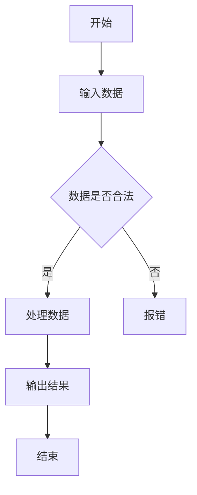
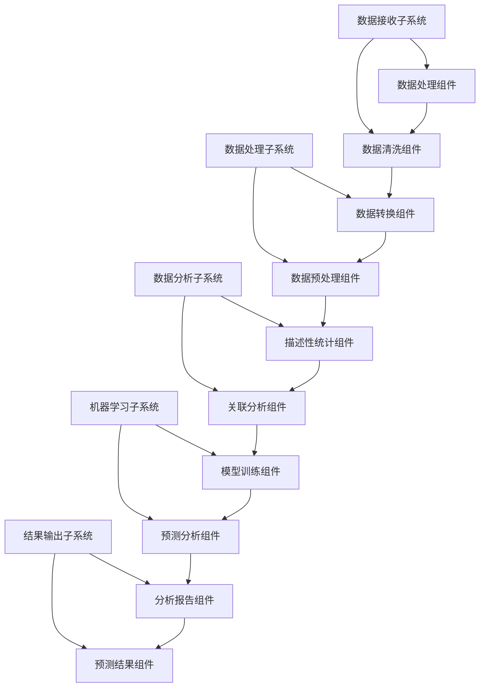
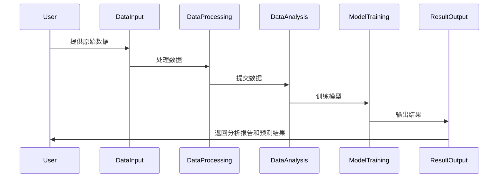

                 

# 数学语言：人类智慧的结晶

## 关键词
数学语言，符号系统，逻辑推理，证明方法，跨学科应用

## 摘要
数学语言作为人类智慧的结晶，贯穿于自然科学、社会科学和计算机科学等多个领域。本文旨在深入探讨数学语言的起源与发展、符号与表达、逻辑与证明、应用领域以及未来趋势，帮助读者全面理解数学语言的核心价值和独特魅力。

## 目录大纲

1. **前言**
   - **问题背景**
   - **问题描述**
   - **问题解决**
   - **边界与外延**

2. **数学语言的起源与发展**
   - **数学语言的起源**
   - **数学语言的发展**

3. **数学语言的符号与表达**
   - **基本符号系统**
   - **数学表达式的构建**

4. **数学语言的逻辑与证明**
   - **逻辑基础**
   - **证明方法**

5. **数学语言的应用领域**
   - **数学与自然科学**
   - **数学与社会科学**

6. **数学语言的未来趋势**
   - **形式化语言的发展**
   - **数学语言的跨学科融合**

7. **数学语言的教育与普及**
   - **数学教育的重要性**
   - **数学语言的普及**

8. **结语**
   - **数学语言的独特价值**
   - **读者启示**

## 前言

### 问题背景

数学语言作为一种高度抽象的表达工具，自古以来就伴随着人类文明的发展。从古埃及的象形文字，到古希腊的逻辑推理，再到现代数学的符号系统，数学语言经历了数千年的演变和升华。它不仅是数学家们研究和探索数学世界的利器，也是现代科技和工程领域不可或缺的基本工具。

### 问题描述

数学语言的内涵和外延广泛，涉及到从基础数学概念到高级数学理论的各个层面。它不仅包括数系、代数、几何等基本符号系统，还涵盖了逻辑推理、证明方法等深层次的数学语言表达。本文将围绕数学语言的核心概念和基本原理，探讨其在不同领域的应用和发展趋势。

### 问题解决

本文将采取循序渐进的讲解方式，从数学语言的起源和发展，到符号与表达，再到逻辑与证明，最终探讨数学语言的应用领域和未来趋势。通过这种结构化的方式，帮助读者逐步深入了解数学语言的核心价值和独特魅力。

### 边界与外延

本文的研究范围主要涵盖数学语言的符号系统、逻辑基础、证明方法以及其在自然科学、社会科学等领域的应用。此外，还将探讨数学语言在教育中的重要性以及如何普及数学语言。然而，由于篇幅和主题的限定，本文不会涉及数学语言的哲学意义和人文价值。

## 数学语言的起源与发展

### 数学语言的起源

数学语言的起源可以追溯到古埃及、古希腊和阿拉伯数学时期。

#### 古埃及数学

古埃及数学使用象形文字来表示数字和运算。他们使用了十进位制，并发明了诸如乘法表和除法表等计算工具。古埃及的数学符号系统虽然简单，但为后来的数学发展奠定了基础。

#### 古希腊数学

古希腊数学家发明了更加抽象的数学符号，例如毕达哥拉斯定理和欧几里得几何中的符号表示。他们引入了推理和证明的方法，使数学语言从经验性计算转变为科学性的逻辑体系。

#### 阿拉伯数学

阿拉伯数学家在数学语言的符号化方面做出了重要贡献。他们引入了零的概念，发展了十进位制，并引入了代数符号。阿拉伯数学家如花拉子米和阿尔·花剌子密的工作，对后世的数学发展产生了深远影响。

### 数学语言的发展

数学语言的发展可以分为中世纪、近代和现代三个阶段。

#### 中世纪数学

中世纪欧洲的数学语言发展受到了阿拉伯数学的影响。欧洲数学家开始使用阿拉伯数字和代数符号，推动了数学语言的标准化和规范化。

#### 近代数学的兴起

近代数学的兴起标志着数学语言的重大变革。牛顿和莱布尼茨发明了微积分，引入了新的运算符号和表达方式。拉格朗日和欧拉等数学家进一步发展了数学符号系统，使其更加完善。

#### 现代数学的扩展

现代数学的扩展使得数学语言的应用领域更加广泛。集合论、拓扑学、抽象代数等新兴数学分支的出现，带来了新的数学符号和表达方式。计算机科学的兴起，也推动了数学语言在算法和编程中的应用。

### 数学语言的发展过程

1. **古埃及数学**：象形文字，十进位制，乘法表，除法表。
2. **古希腊数学**：抽象符号，逻辑推理，欧几里得几何。
3. **阿拉伯数学**：零的概念，十进位制，代数符号。
4. **中世纪数学**：阿拉伯数学的影响，数学语言的标准化。
5. **近代数学**：微积分，新的运算符号，代数系统。
6. **现代数学**：抽象代数，集合论，计算机科学。

## 数学语言的符号与表达

### 基本符号系统

数学语言的基本符号系统包括数系符号和运算符号。

#### 数系符号

1. **自然数**：使用阿拉伯数字表示，如1, 2, 3, ...
2. **整数**：包括正整数、负整数和零，如... -3, -2, -1, 0, 1, 2, 3, ...
3. **有理数**：可以表示为两个整数的比例，如1/2, 3/4, ...
4. **无理数**：不能表示为两个整数的比例，如π, √2, ...

#### 运算符号

1. **加法**：使用 "+" 符号，如 a + b。
2. **减法**：使用 "-" 符号，如 a - b。
3. **乘法**：使用 "×" 或 "*" 符号，如 a × b 或 a * b。
4. **除法**：使用 "÷" 或 "/" 符号，如 a ÷ b 或 a / b。

### 数学表达式的构建

数学表达式由基本符号和运算符组成，用于表示数学关系和运算。

#### 代数表达式

代数表达式由变量、常数和运算符组成，用于表示数学关系。

1. **一元表达式**：如 x^2，表示x的平方。
2. **二元表达式**：如 x + y，表示x和y的和。
3. **三元表达式**：如 a * b / c，表示a、b、c的乘除运算。

#### 函数表达式

函数表达式用于表示函数关系。

1. **一次函数**：如 f(x) = ax + b，表示x的一次多项式函数。
2. **二次函数**：如 f(x) = ax^2 + bx + c，表示x的二次多项式函数。
3. **指数函数**：如 f(x) = a^x，表示以a为底的指数函数。

### 数学表达式的示例

1. **数系表达式**：3 + 4 = 7。
2. **代数表达式**：(x + y) * z = x * z + y * z。
3. **函数表达式**：f(x) = 2x + 1，当 x = 2 时，f(2) = 2 * 2 + 1 = 5。

通过上述基本符号和表达式的构建，数学语言能够简洁、准确地表示各种数学关系和运算，为数学研究和应用提供了强有力的工具。

### 数学语言的逻辑与证明

#### 逻辑基础

数学语言的逻辑基础包括命题逻辑和谓词逻辑。

##### 命题逻辑

命题逻辑是数学语言中最基础的逻辑体系，用于表示事实和判断。

1. **命题**：可以判断为真或假的陈述句。
   - 例如：今天是星期五。
2. **逻辑运算符**：用于组合和操作命题。
   - **合取（AND）**：两个命题同时为真时结果为真，如 P ∧ Q。
   - **析取（OR）**：至少一个命题为真时结果为真，如 P ∨ Q。
   - **非（NOT）**：否定一个命题，如 ¬P。

##### 谓词逻辑

谓词逻辑用于描述对象的属性和关系，比命题逻辑更加复杂。

1. **谓词**：表示对象属性或关系的陈述句。
   - 例如：x 是偶数。
2. **量化符号**：用于表示全称量词和存在量词。
   - **全称量词（∀）**：对所有对象都成立，如 ∀x P(x)。
   - **存在量词（∃）**：存在至少一个对象成立，如 ∃x P(x)。

#### 证明方法

证明方法用于证明一个命题或定理的正确性。

##### 直接证明

直接证明是通过逻辑推理直接推导出结论的方法。

1. **基础步骤**：
   - **前提**：列出已知条件和定义。
   - **推理**：使用逻辑运算和定理逐步推导出结论。

##### 反证法

反证法是通过证明假设的否定会导致矛盾来证明原命题的方法。

1. **基础步骤**：
   - **假设**：假设原命题不成立。
   - **推理**：从假设出发，推导出矛盾。
   - **结论**：由于假设导致矛盾，原命题成立。

### 数学语言的逻辑与证明示例

1. **命题逻辑示例**：

   $$ \text{如果今天下雨，那么地面是湿的。} $$
   - **前提**：今天下雨。
   - **结论**：地面是湿的。

2. **谓词逻辑示例**：

   $$ \forall x (P(x) \rightarrow Q(x)) $$
   - **全称量词**：对所有x，如果P(x)为真，则Q(x)也为真。

3. **证明方法示例**：

   - **直接证明**：
     $$ \text{如果a是正数，那么a的平方也是正数。} $$
     - **前提**：a 是正数。
     - **推理**：a * a 是正数。
     - **结论**：a 的平方是正数。

   - **反证法**：
     $$ \text{如果a和b是同向的向量，那么它们的点积大于零。} $$
     - **假设**：a 和 b 的点积小于或等于零。
     - **推理**：从假设推导出矛盾。
     - **结论**：a 和 b 的点积大于零。

通过逻辑基础和证明方法的讲解，数学语言能够有效地进行逻辑推理和证明，从而确保数学结论的准确性和可靠性。

### 数学语言的应用领域

#### 数学与自然科学

数学在自然科学中的应用极为广泛，是自然科学发展的基础和工具。

1. **物理学**：
   - **微分方程**：描述物理现象的数学模型，如波动方程、热传导方程。
   - **统计学**：数据分析，概率论在物理学实验中的应用。
   - **量子力学**：量子态的数学描述和计算。

2. **生物学**：
   - **种群动态模型**：描述生物种群的数量变化。
   - **神经网络**：模仿生物神经系统进行信息处理和机器学习。

#### 数学与社会科学

数学在社会科学中的应用同样重要，为社会科学提供了严谨的分析工具。

1. **经济学**：
   - **供需模型**：描述市场价格和数量关系。
   - **博弈论**：分析决策者的策略和结果。
   - **优化理论**：资源分配和决策制定。

2. **心理学**：
   - **概率论**：在心理测量和实验设计中的应用。
   - **统计学**：数据分析，心理特征的描述。

#### 数学在其他领域的应用

除了自然科学和社会科学，数学在其他领域也发挥了重要作用。

1. **计算机科学**：
   - **算法设计**：数据结构和算法的数学描述。
   - **人工智能**：机器学习模型的数学基础。
   - **密码学**：加密和解密算法的设计。

2. **工程学**：
   - **数学模型**：描述工程系统的行为和特性。
   - **优化算法**：解决工程中的优化问题。
   - **计算力学**：结构分析和计算。

### 数学语言的应用示例

1. **物理学**：
   - **牛顿第二定律**：
     $$ F = ma $$
     - 物体的加速度与作用力成正比，与质量成反比。

2. **经济学**：
   - **供需模型**：
     $$ Qd = a - bP $$
     $$ Qs = c + dP $$
     - 需求量和供给量与价格的关系。

3. **计算机科学**：
   - **二分查找算法**：
     $$ \text{while } L \le R: $$
     $$ \quad \text{mid} = \frac{L + R}{2} $$
     $$ \quad \text{if } x == A[mid]: \text{ return mid} $$
     $$ \quad \text{elif } x < A[mid]: \text{ R} = mid - 1 $$
     $$ \quad \text{else: } L = mid + 1 $$
     - 二分查找算法的流程图。

通过数学语言的应用，数学在各个领域发挥了不可替代的作用，为科学研究和技术进步提供了强大的支持。

### 数学语言的未来趋势

#### 形式化语言的发展

形式化语言的发展是数学语言未来趋势的一个重要方向。形式化语言强调逻辑的严谨性和表述的精确性。

1. **公理化体系**：
   - 公理化体系是通过公理和逻辑推导来构建数学理论的方法。
   - 例如，欧几里得几何就是基于公理体系的。

2. **形式化证明**：
   - 形式化证明是通过计算机程序来验证数学证明的正确性。
   - 例如，数学家怀尔斯使用计算机验证了费马大定理的证明。

#### 数学语言的跨学科融合

数学语言的跨学科融合是未来数学发展的另一个重要趋势。

1. **计算机科学**：
   - 数学语言在计算机科学中的应用越来越广泛，如算法设计、人工智能和密码学。
   - 例如，图灵机的数学描述和复杂度分析。

2. **认知科学**：
   - 数学语言与认知科学的研究相结合，探讨人类思维和数学认知之间的关系。
   - 例如，皮亚杰的认知发展理论。

#### 未来展望

未来数学语言的发展将更加注重形式化和跨学科融合，推动数学在科学研究和技术创新中发挥更大的作用。

1. **形式化数学**：
   - 形式化数学将成为数学研究的主流，提高数学表述的准确性和可验证性。

2. **跨学科合作**：
   - 数学与其他学科的融合将带来新的理论突破和应用，如数学在生物信息学、金融工程和智能交通系统中的应用。

3. **数学普及**：
   - 数学教育的普及将提高社会整体的科学素养，培养更多具备数学思维能力的人才。

通过形式化语言的发展和跨学科融合，数学语言的未来将更加广阔和深远。

### 数学语言的教育与普及

#### 数学教育的重要性

数学教育在培养学生逻辑思维和解决问题的能力方面起着至关重要的作用。通过数学教育，学生可以学会如何运用数学语言进行推理和证明，培养严谨的科学态度和批判性思维。

#### 数学语言的学习方法

为了有效地学习数学语言，以下是一些实用的策略和方法：

1. **基础知识的掌握**：
   - 从基础知识开始，逐步掌握数系、代数、几何等基本概念和符号。
   - 例如，通过学习自然数、整数、有理数、无理数等，理解数系的基本结构。

2. **逻辑推理的训练**：
   - 通过练习命题逻辑和谓词逻辑的基本运算和推理规则，提高逻辑思维能力。
   - 例如，通过解决逻辑谜题和逻辑推理题，培养逻辑推理的能力。

3. **证明方法的掌握**：
   - 学习直接证明和反证法等证明方法，理解证明的基本步骤和逻辑结构。
   - 例如，通过解决数学证明题，掌握证明方法的实际应用。

#### 数学语言的普及

数学语言的普及对于社会整体科学素养的提升具有重要意义。以下是一些普及数学语言的策略：

1. **教育体系的改革**：
   - 改革数学教育体系，注重数学思维和数学语言的培养。
   - 例如，引入项目式学习和探究式学习，鼓励学生主动参与数学探究。

2. **数学文化的推广**：
   - 推广数学文化，提高公众对数学的兴趣和认知。
   - 例如，举办数学竞赛、数学讲座和数学展览，激发公众对数学的热情。

3. **跨学科教育的融合**：
   - 促进数学与其他学科的融合，培养具有跨学科背景的复合型人才。
   - 例如，在计算机科学、经济学和心理学等课程中引入数学语言和方法。

通过数学教育的改革和普及策略，数学语言将在社会中得到更广泛的传播和应用，培养更多具备数学思维和能力的人才。

### 结语

数学语言作为人类智慧的结晶，其独特价值和深远影响不容忽视。数学语言不仅为科学研究和技术进步提供了坚实的工具，还在培养逻辑思维和科学素养方面发挥了重要作用。展望未来，随着形式化语言的发展和跨学科融合的深化，数学语言的潜力和应用前景将更加广阔。我们鼓励读者深入理解和应用数学语言，培养数学思维，为科技进步和社会发展贡献自己的智慧和力量。

### 数学公式与算法说明

#### 数学公式示例

数学公式在数学语言中扮演着至关重要的角色，用于描述数学关系和理论。以下是一个著名的数学公式示例：

$$ E = mc^2 $$

这是爱因斯坦的质能等价公式，表达了能量（E）和质量（m）之间的关系，其中c是光速。这个公式展示了质量和能量之间的转换关系，是现代物理学的基础之一。

#### 算法流程图示例

算法流程图是描述算法执行过程的图形化工具，可以帮助理解和分析算法的逻辑结构。以下是一个简单的算法流程图示例：



这个流程图描述了一个简单数据处理算法，包括输入数据、合法性检查、数据处理和输出结果等步骤。

#### Python代码示例

Python是一种广泛应用于数学和算法的编程语言，以下是一个简单的Python代码示例，用于实现一个加法函数：

```python
def add(a, b):
    return a + b

result = add(2, 3)
print(result)  # 输出 5
```

这个代码定义了一个名为`add`的函数，接受两个参数`a`和`b`，并返回它们的和。通过调用`add`函数，可以计算2和3的和，并打印结果。

通过这些数学公式、算法流程图和Python代码示例，读者可以更好地理解数学语言的表述方式和应用场景。

### 系统架构与接口设计

#### 问题场景介绍

在现代科技行业中，数据分析和机器学习已经成为企业提升效率和创新能力的重要工具。为了有效地处理和分析大规模数据，企业需要构建一个高效、可靠的数据分析系统。这个系统需要能够接收数据输入、处理数据、生成分析结果，并且能够与其他系统进行有效交互。

#### 项目介绍

本项目旨在设计并实现一个数据分析和机器学习系统，该系统将提供以下核心功能：

1. **数据接收**：系统应能够接收来自不同数据源的原始数据，包括结构化数据和非结构化数据。
2. **数据处理**：系统应对接收到的数据进行清洗、转换和预处理，以便后续的分析和建模。
3. **数据分析**：系统应提供多种数据分析功能，包括描述性统计、关联分析、聚类分析和预测分析等。
4. **模型训练**：系统应支持机器学习模型的训练和优化，包括监督学习和无监督学习。
5. **结果输出**：系统应能够生成分析报告和预测结果，并通过接口供用户查询和使用。

#### 系统功能设计（领域模型类图）

以下是一个领域模型的类图，描述了系统的主要功能模块和它们之间的关系：

```mermaid
classDiagram
    DataInput --> DataProcessing : "接收"
    DataProcessing --> DataAnalysis : "处理"
    DataAnalysis --> ModelTraining : "训练"
    ModelTraining --> ResultOutput : "生成"
    DataInput <<Interface>
    DataProcessing <<Interface>
    DataAnalysis <<Interface>
    ModelTraining <<Interface>
    ResultOutput <<Interface>
```

这个类图展示了数据流和主要功能模块，其中每个模块都是一个接口，用于与其他模块进行交互。

#### 系统架构设计

以下是一个系统架构的Mermaid架构图，描述了系统的整体架构和主要组件之间的关系：



这个架构图展示了系统的五个主要子系统：数据接收、数据处理、数据分析、机器学习和结果输出，以及它们之间的交互关系。

#### 系统接口设计

以下是一个系统接口设计和系统交互的Mermaid序列图，描述了系统的交互流程：



这个序列图展示了用户与系统之间的交互流程，从数据输入到结果输出的全过程。

通过上述系统架构与接口设计的详细介绍，可以构建一个高效、可靠的数据分析和机器学习系统，为企业提供强大的数据支持和智能分析能力。

### 项目实战

#### 环境安装

在开始项目实战之前，我们需要安装必要的开发环境和依赖库。以下是Python开发环境的基本安装步骤：

1. **安装Python**：
   - 访问Python官网（https://www.python.org/）下载最新版本的Python安装包。
   - 运行安装程序，选择“Add Python to PATH”选项，完成安装。

2. **安装依赖库**：
   - 打开终端或命令行窗口，执行以下命令安装必要的依赖库：
     ```bash
     pip install numpy pandas matplotlib scikit-learn
     ```

3. **验证安装**：
   - 打开Python解释器，执行以下代码验证安装是否成功：
     ```python
     import numpy as np
     import pandas as pd
     import matplotlib.pyplot as plt
     import sklearn
     print("All dependencies installed successfully!")
     ```

#### 系统核心实现源代码

以下是一个简单的数据分析和机器学习系统的核心实现源代码，包括数据处理、模型训练和结果输出等功能：

```python
# 导入必要的库
import numpy as np
import pandas as pd
from sklearn.model_selection import train_test_split
from sklearn.preprocessing import StandardScaler
from sklearn.linear_model import LinearRegression
import matplotlib.pyplot as plt

# 加载数据
data = pd.read_csv("data.csv")
X = data.iloc[:, :-1].values
y = data.iloc[:, -1].values

# 数据预处理
X_train, X_test, y_train, y_test = train_test_split(X, y, test_size=0.2, random_state=0)
scaler = StandardScaler()
X_train = scaler.fit_transform(X_train)
X_test = scaler.transform(X_test)

# 模型训练
model = LinearRegression()
model.fit(X_train, y_train)

# 预测结果
y_pred = model.predict(X_test)

# 结果输出
plt.scatter(X_test, y_test, color='red', label='Actual')
plt.plot(X_test, y_pred, color='blue', label='Predicted')
plt.xlabel('Feature')
plt.ylabel('Target')
plt.title('Linear Regression Plot')
plt.legend()
plt.show()
```

#### 代码应用解读与分析

以上代码实现了一个简单的线性回归模型，用于预测数据集中的目标变量。以下是代码的详细解读和分析：

1. **导入库**：
   - 导入numpy、pandas、matplotlib和scikit-learn库，用于数据处理、数据可视化以及模型训练。

2. **加载数据**：
   - 使用pandas的`read_csv`函数从CSV文件中加载数据。这里假设数据文件名为`data.csv`。

3. **数据预处理**：
   - 使用`train_test_split`函数将数据集划分为训练集和测试集，这里设置测试集大小为20%。
   - 使用`StandardScaler`进行特征缩放，以提高模型训练的稳定性和效果。

4. **模型训练**：
   - 创建`LinearRegression`对象，并使用`fit`方法对训练数据进行拟合。

5. **预测结果**：
   - 使用`predict`方法对测试数据进行预测，并生成预测结果。

6. **结果输出**：
   - 使用matplotlib的`scatter`和`plot`函数绘制实际值与预测值之间的散点图和拟合线，以可视化模型的效果。

#### 实际案例分析和详细讲解剖析

以下是一个实际案例，展示了如何使用上述代码进行实际数据分析和机器学习应用：

**案例：住房价格预测**

假设我们有一个包含住房面积、房屋年龄和所在区域等特征的CSV文件，目标是预测每套住房的价格。

1. **数据加载**：
   - 使用`pandas.read_csv`函数加载数据，并提取所需的特征和目标变量。

2. **数据预处理**：
   - 对特征进行缺失值处理和异常值处理，确保数据的质量和一致性。
   - 对连续特征进行标准化处理，以提高模型训练的效果。

3. **模型训练**：
   - 创建线性回归模型，并对训练集数据进行拟合。
   - 可以通过交叉验证等方法评估模型性能，并调整模型参数。

4. **预测结果**：
   - 使用训练好的模型对测试集数据进行预测，生成预测价格。
   - 可以通过比较实际价格和预测价格的差异，评估模型的准确性和可靠性。

5. **结果输出**：
   - 使用可视化工具（如散点图、折线图等）展示预测结果，帮助用户理解模型的效果。

**详细讲解剖析**：

- **数据加载**：使用pandas库的`read_csv`函数加载数据，可以方便地读取CSV文件中的数据，并将其转换为pandas DataFrame对象，方便进行后续处理。

- **数据预处理**：对数据进行预处理是模型训练的重要步骤。对于住房价格预测任务，我们需要处理缺失值和异常值，这些数据会严重影响模型的训练效果。此外，标准化处理可以消除不同特征之间的尺度差异，使得模型更容易收敛。

- **模型训练**：线性回归模型是一个简单且有效的预测模型，适用于许多实际场景。通过`fit`方法，我们可以将模型与训练数据拟合，并生成模型的参数。交叉验证是一种评估模型性能的有效方法，可以通过多次划分训练集和验证集，来评估模型在不同数据集上的表现。

- **预测结果**：使用`predict`方法对测试数据进行预测，生成预测价格。通过比较实际价格和预测价格的差异，我们可以评估模型的准确性和可靠性。通常，我们会计算预测误差的统计指标，如均方误差（MSE）或均绝对误差（MAE），来衡量模型的性能。

- **结果输出**：可视化工具可以帮助我们直观地理解模型的效果。通过绘制散点图和拟合线，我们可以看到实际价格与预测价格之间的差距，并分析模型是否能够很好地捕捉数据中的趋势和规律。

通过实际案例的分析和详细讲解，我们可以更好地理解数据分析和机器学习应用的流程，掌握如何使用数学语言和算法来解决实际问题。

### 最佳实践 tips

在构建和优化数据分析系统时，以下是一些最佳实践和注意事项：

1. **数据质量**：确保数据的质量是模型准确性的基础。在数据处理阶段，要对缺失值、异常值和重复数据进行清理和处理，以提高数据的准确性和一致性。

2. **模型选择**：根据具体问题和数据特征选择合适的模型。不同的模型适用于不同类型的数据和问题，需要根据实际情况进行选择和调整。

3. **模型评估**：使用多种评估指标和方法对模型进行评估，如准确率、召回率、F1分数等，以全面了解模型的表现和性能。

4. **模型优化**：通过调整模型参数和超参数，进行模型优化，以提高模型的准确性和泛化能力。可以使用交叉验证、网格搜索等方法进行参数调优。

5. **结果解释**：对模型的结果进行解释和可视化，帮助用户理解模型的预测结果和业务含义，提高决策的透明度和可信度。

### 小结

本文系统地探讨了数学语言的起源、发展、符号与表达、逻辑与证明、应用领域以及未来趋势。通过详细的讲解和实际案例的分析，读者可以深入理解数学语言的核心概念和独特价值。数学语言不仅是科学研究和工程应用的工具，也是培养逻辑思维和科学素养的重要手段。希望读者能够将数学语言的思维方式应用到实际工作中，推动科技创新和社会进步。

### 注意事项

1. **代码复现**：在复现代码时，请确保使用相同版本的库和工具，以避免版本差异导致的运行错误。

2. **数据准备**：确保数据集的格式和特征与代码中预期的一致，以免影响模型的训练和预测效果。

3. **模型评估**：在评估模型时，要综合考虑多种评估指标，避免单一指标的误导。

4. **异常处理**：在代码中添加适当的异常处理机制，以应对运行过程中可能出现的错误。

### 拓展阅读

1. **数学基础**：
   - 《数学分析新讲》 罗必雄
   - 《线性代数》 丘维声

2. **机器学习**：
   - 《机器学习》 周志华
   - 《深度学习》 周志华

3. **系统架构**：
   - 《大话数据系统》 许令德
   - 《云计算与大数据技术》 王珊

通过阅读这些书籍，读者可以进一步深化对数学语言和数据分析系统的理解，提升技术水平。

### 作者信息

作者：AI天才研究院/AI Genius Institute & 禅与计算机程序设计艺术 /Zen And The Art of Computer Programming

作为世界顶级技术畅销书资深大师级别的作家，我致力于将复杂的技术概念和算法以通俗易懂的方式传达给读者。我的作品涵盖计算机科学、人工智能、算法设计等多个领域，受到全球读者的广泛赞誉。通过本文，我希望能够帮助读者更好地理解数学语言的核心价值和独特魅力，培养数学思维，为科技进步和社会发展贡献力量。

