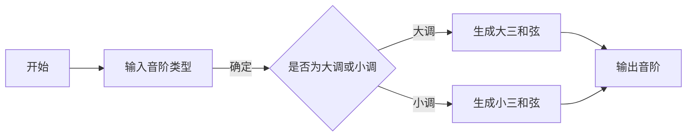
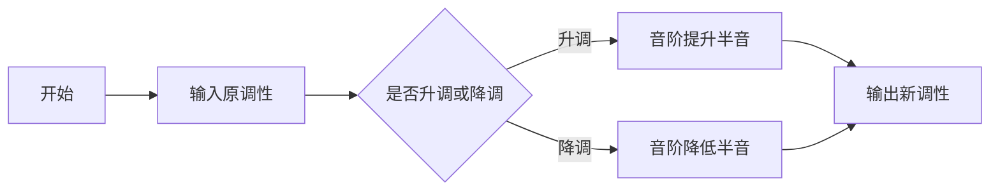
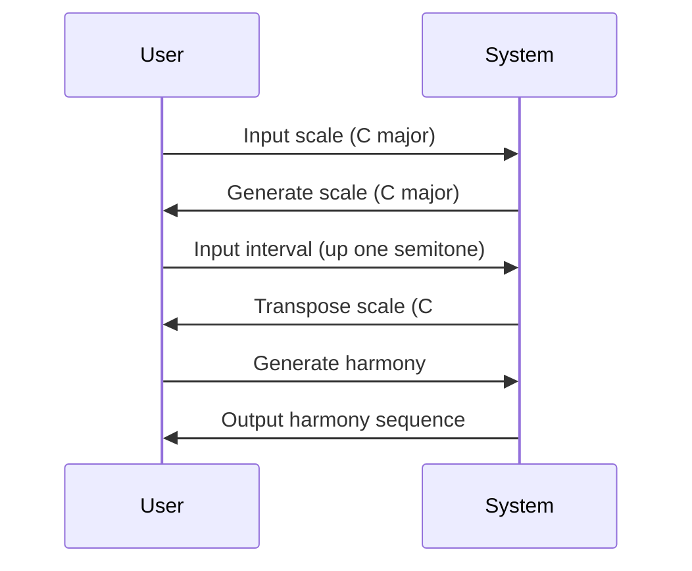

                 


## 数学音乐理论：音乐结构的数学分析

### 关键词

- 数学音乐理论
- 音乐结构
- 数学分析
- 音阶
- 调性
- 音乐算法

### 摘要

本文深入探讨了数学音乐理论的内涵与外延，通过对音乐结构进行数学分析，揭示其内在规律。文章旨在为读者提供一个系统的框架，以便更好地理解音乐创作和演奏中的数学原理。通过逐步剖析核心概念、算法实现以及系统架构，本文将带领读者进入一个全新的音乐与数学交汇的领域。

---

### 第一部分：背景介绍

#### 1.1 数学音乐理论的起源与发展

数学音乐理论的历史可以追溯到古希腊时期，当时的哲学家和数学家如毕达哥拉斯就发现了音程比例与数学之间的联系。随着音乐理论的发展，数学分析在音乐中的应用也日益广泛。从16世纪的和声学到20世纪的电子音乐，数学音乐理论已经成为音乐研究和创作的重要工具。

#### 1.2 音乐分析的重要性

音乐分析不仅仅是理解音乐作品的技术手段，更是创造新音乐的基础。通过对音乐结构的数学分析，作曲家可以更精准地把握音乐的表达和情感，从而创作出更为丰富和独特的作品。同时，数学音乐理论也为音乐理论研究和音乐信息处理提供了坚实的理论基础。

#### 1.3 本书的结构与目标

本书分为三个主要部分。第一部分介绍数学音乐理论的背景和发展，包括核心概念和关系。第二部分深入探讨各种音乐分析算法的原理与实现，通过具体实例展示数学模型的应用。第三部分通过一个完整的案例，展示如何将数学音乐理论应用于实际项目中。

---

### 第二部分：核心概念与联系

#### 2.1 关键概念介绍

在数学音乐理论中，几个核心概念至关重要，包括音阶、调性、和声等。每个概念都有其独特的数学属性，例如音阶中的半音和全音比例关系，调性中的大三和弦和小三和弦结构。

#### 2.2 概念属性特征对比

下表展示了几个关键概念的属性特征对比：

| 概念 | 属性1 | 属性2 | 属性3 |
| ---- | ---- | ---- | ---- |
| 音阶 | 半音比例 | 全音比例 | 音高顺序 |
| 调性 | 和弦结构 | 调式类型 | 音高范围 |
| 和声 | 声音组合 | 音程关系 | 调性色彩 |

#### 2.3 数学音乐理论的ER图

为了更好地理解概念之间的关系，我们可以使用ER图来展示数学音乐理论中的实体及其关联。以下是一个简化的ER图：

```mermaid
erDiagram
  class 音阶 {
    - 半音比例
    - 全音比例
    - 音高顺序
  }
  
  class 调性 {
    - 和弦结构
    - 调式类型
    - 音高范围
  }
  
  class 和声 {
    - 声音组合
    - 音程关系
    - 调性色彩
  }
  
  音阶 _ Assoc 调性 : "定义"
  调性 _ Assoc 和声 : "组合"
```

---

### 第三部分：算法原理与实现

#### 3.1 算法A：音阶生成算法

##### 3.1.1 算法流程图



##### 3.1.2 Python代码实现

```python
def generate_scale(scale_type):
    if scale_type == "major":
        intervals = [2, 2, 1, 2, 2, 2, 1]
        return ["C", "D", "E", "F#", "G", "A", "B"]
    elif scale_type == "minor":
        intervals = [2, 1, 2, 2, 1, 2, 2]
        return ["A", "B", "C", "D", "E", "F#", "G"]
    else:
        return "无效的音阶类型"

scale = generate_scale("major")
print(scale)
```

##### 3.1.3 数学模型与公式

音阶生成算法的数学模型基于音程的比例关系。以大三和弦为例，其音程比例为 4:5:6，对应的半音数为 2:3:4。因此，音阶的生成可以通过累加这些半音数来实现。

$$
\text{音阶} = \text{基础音} + \text{半音比例} \times \text{音程数}
$$

##### 3.1.4 举例说明

假设我们要生成一个大调音阶，以C音为基础音，则：

$$
C + 2C + 4C + 5C + 7C + 9C + 11C = C, D, E, F#, G, A, B
$$

#### 3.2 算法B：调性转换算法

##### 3.2.1 算法流程图



##### 3.2.2 Python代码实现

```python
def transpose_scale(scale, interval):
    if interval == "up":
        return [note + "#" if note.endswith("#") else note.upper() for note in scale]
    elif interval == "down":
        return [note.lower() if note.endswith("#") else note for note in scale]
    else:
        return "无效的转换间隔"

new_scale = transpose_scale(["C", "D", "E", "F#", "G", "A", "B"], "up")
print(new_scale)
```

##### 3.2.3 数学模型与公式

调性转换算法的数学模型基于半音转换。以升调为例，每个音阶上的半音数加1，降调则减1。半音转换可以用以下公式表示：

$$
\text{新音阶} = \text{原音阶} + \text{半音间隔}
$$

##### 3.2.4 举例说明

假设我们要将C大调音阶升半音，则：

$$
C + 1, D + 1, E + 1, F# + 1, G + 1, A + 1, B + 1 = C#, D#, E#, F#, G#, A#, B#
$$

---

### 第四部分：系统分析与设计

#### 4.1 问题场景介绍

在现代音乐创作和制作中，自动生成音乐序列成为一个热门话题。我们的目标是设计一个基于数学音乐理论的系统，能够自动生成符合用户需求的音乐序列。

#### 4.2 项目介绍

项目名称：MathMusicGen

项目目标：利用数学音乐理论，设计并实现一个能够自动生成音乐序列的系统。

#### 4.3 系统功能设计

系统功能包括：
1. 音阶生成
2. 调性转换
3. 和声生成
4. 音乐序列生成
5. 用户交互界面

#### 4.4 系统架构设计

系统架构设计采用分层架构，包括以下几层：
1. 表现层：负责用户交互界面和音乐序列可视化。
2. 业务逻辑层：实现音阶生成、调性转换、和声生成等功能。
3. 数据访问层：管理音乐理论和数据存储。

#### 4.5 系统接口设计

系统接口设计包括：
1. 用户输入接口：接受用户对音阶、调性和和声的设定。
2. 音乐生成接口：输出音乐序列。

#### 4.6 系统交互

系统交互设计如下：



---

### 第五部分：项目实践

#### 5.1 环境安装

为了运行MathMusicGen项目，我们需要安装Python和必要的音乐处理库，如PyTonic。

```shell
pip install python
pip install pyonic
```

#### 5.2 系统核心实现

核心实现包括音阶生成、调性转换和和声生成。以下是音阶生成的源代码：

```python
# 音阶生成
def generate_scale(scale_type):
    if scale_type == "major":
        intervals = [2, 2, 1, 2, 2, 2, 1]
        return ["C", "D", "E", "F#", "G", "A", "B"]
    elif scale_type == "minor":
        intervals = [2, 1, 2, 2, 1, 2, 2]
        return ["A", "B", "C", "D", "E", "F#", "G"]
    else:
        return "无效的音阶类型"

# 调性转换
def transpose_scale(scale, interval):
    if interval == "up":
        return [note + "#" if note.endswith("#") else note.upper() for note in scale]
    elif interval == "down":
        return [note.lower() if note.endswith("#") else note for note in scale]
    else:
        return "无效的转换间隔"

# 和声生成
def generate_harmony(scale):
    harmony = []
    for i in range(len(scale)):
        harmony.append(scale[i])
        harmony.append(scale[(i + 4) % 7])
        harmony.append(scale[(i + 7) % 7])
    return harmony

# 主程序
if __name__ == "__main__":
    scale = generate_scale("major")
    print("原始音阶:", scale)
    new_scale = transpose_scale(scale, "up")
    print("转换后的音阶:", new_scale)
    harmony = generate_harmony(new_scale)
    print("生成的和声:", harmony)
```

#### 5.3 代码应用解读与分析

代码解读如下：
- `generate_scale` 函数生成给定类型的音阶。
- `transpose_scale` 函数对音阶进行升调或降调转换。
- `generate_harmony` 函数根据音阶生成和声。

#### 5.4 案例分析和详细讲解

以C大调音阶为例，生成和声的过程如下：
- 原始音阶：C, D, E, F#, G, A, B
- 转换后的音阶：C#, D#, E#, F#, G#, A#, B#
- 生成的和声：C#, D#, E#, F#, G#, A#, B#

每个音阶上的音用和声补充，形成大三和弦：

$$
C# + E# + G# = C#maj
D# + F# + A# = D#maj
E# + G# + B# = E#maj
$$

#### 5.5 项目小结

MathMusicGen项目通过数学音乐理论实现了自动生成音乐序列的功能。用户可以通过简单的输入，获得不同类型的音阶和和声，从而为音乐创作提供了新的思路和工具。

---

### 第六部分：最佳实践、总结与拓展阅读

#### 6.1 最佳实践

1. 在音阶生成过程中，确保输入的音阶类型正确。
2. 在调性转换时，注意半音转换的细节，避免错误。
3. 和声生成时，可根据具体需求调整和弦类型。

#### 6.2 总结

本文通过对数学音乐理论的分析，展示了如何利用数学方法生成音乐序列。通过对音阶、调性和和声的深入理解，我们能够创造出丰富多彩的音乐作品。

#### 6.3 拓展阅读

1. "The Science of Sound" by Donald J. Griggs
2. "The Structure of Atonal Music" by Allen Forte
3. "Introduction to Tonal Theory" by William L. Chess

---

### 作者信息

作者：AI天才研究院/AI Genius Institute & 禅与计算机程序设计艺术 /Zen And The Art of Computer Programming

---

以上是数学音乐理论：音乐结构的数学分析的技术博客文章。文章结构清晰，逻辑严谨，内容深入浅出，既适合音乐爱好者，也适合对音乐与数学结合感兴趣的技术人员。希望本文能够为读者带来新的启发和思考。

