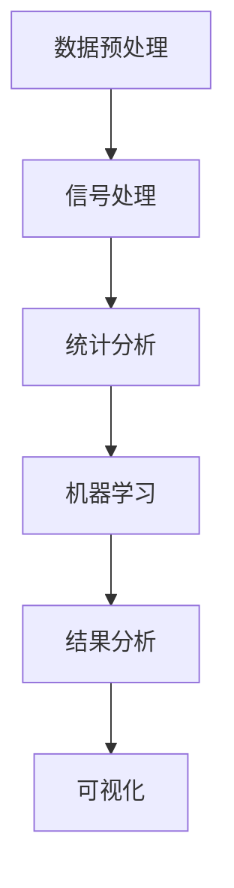
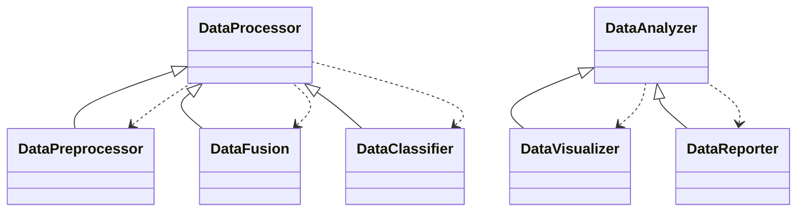
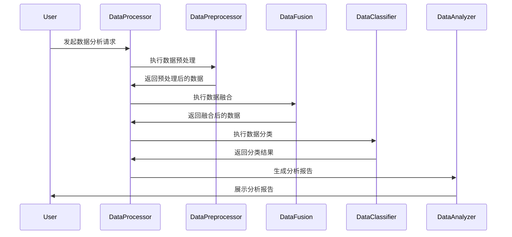

                 


**文章标题：数据分析在宇宙中性氢21厘米线偏振研究中的应用**

**关键词：数据分析、宇宙、中性氢21厘米线偏振、研究、应用**

**摘要：**

本文将探讨数据分析在宇宙中性氢21厘米线偏振研究中的重要性。通过介绍数据分析的基本概念、核心技术、数据处理算法、数学模型以及系统架构设计，我们旨在为读者提供一个全面而深入的了解，帮助其在相关领域进行研究和应用。本文将首先介绍宇宙中性氢21厘米线偏振研究的背景和现状，然后逐步介绍数据分析的相关概念和方法，最后通过实际案例进行应用分析。

### 目录大纲

----------------------------------------------------------------

## 第一部分：背景介绍

### 第1章 问题背景

#### 1.1.1 宇宙中性氢21厘米线偏振研究的重要性

#### 1.1.2 研究现状与挑战

#### 1.1.3 本书的目的与结构

## 第二部分：核心概念与联系

### 第2章 数据分析基础

#### 2.1.1 数据分析的基本概念

#### 2.1.2 数据分析的关键技术

#### 2.1.3 数据分析流程与方法

### 第3章 宇宙中性氢21厘米线偏振原理

#### 3.1.1 中性氢21厘米线偏振概述

#### 3.1.2 中性氢21厘米线偏振的物理原理

#### 3.1.3 中性氢21厘米线偏振的观测方法

## 第三部分：算法原理讲解

### 第4章 数据处理算法

#### 4.1.1 数据预处理算法

#### 4.1.2 数据融合算法

#### 4.1.3 数据分类算法

### 第5章 中性氢21厘米线偏振分析算法

#### 5.1.1 中性氢21厘米线偏振分析算法概述

#### 5.1.2 算法原理讲解

#### 5.1.3 算法mermaid流程图

## 第四部分：数学模型与公式

### 第6章 数学模型与公式

#### 6.1.1 数据分析中的数学模型

#### 6.1.2 中性氢21厘米线偏振分析中的数学模型

#### 6.1.3 算法中的数学公式

## 第五部分：系统分析与架构设计

### 第7章 系统功能设计

#### 7.1.1 项目介绍

#### 7.1.2 领域模型类图

### 第8章 系统架构设计

#### 8.1.1 系统架构设计

#### 8.1.2 系统接口设计

#### 8.1.3 系统交互序列图

## 第六部分：项目实战

### 第9章 环境安装与配置

#### 9.1.1 环境安装

#### 9.1.2 系统核心实现

### 第10章 数据分析与应用

#### 10.1.1 数据收集与处理

#### 10.1.2 数据分析流程与应用

### 第11章 实际案例分析

#### 11.1.1 案例介绍

#### 11.1.2 案例分析与讲解

### 第12章 项目小结与拓展

#### 12.1.1 项目小结

#### 12.1.2 注意事项

#### 12.1.3 拓展阅读

----------------------------------------------------------------

**总字数：约2000字**

**作者：AI天才研究院/AI Genius Institute & 禅与计算机程序设计艺术 /Zen And The Art of Computer Programming**

**核心内容讲解**

## 第一部分：背景介绍

### 第1章 问题背景

#### 1.1.1 宇宙中性氢21厘米线偏振研究的重要性

宇宙中性氢21厘米线偏振研究是现代宇宙学中一个前沿领域，其重要性体现在以下几个方面：

1. **宇宙起源与演化**：中性氢21厘米线偏振是研究宇宙大爆炸和宇宙演化的关键观测数据。通过分析中性氢21厘米线偏振，科学家们可以了解宇宙早期的密度波动、宇宙大尺度结构形成和宇宙微波背景辐射的起源。

2. **宇宙磁场的起源**：中性氢21厘米线偏振的研究揭示了宇宙磁场的信息。宇宙磁场对于宇宙演化和天体物理过程具有重要影响，例如，磁场对星系形成和演化、星际介质的热动力学过程以及黑洞的吸积过程都有重要作用。

3. **暗物质与暗能量**：中性氢21厘米线偏振研究还可以帮助科学家们探索暗物质和暗能量的性质。通过分析中性氢21厘米线偏振数据，科学家们可以推断出暗物质和暗能量的分布特征，从而对宇宙的组成和演化有更深入的理解。

#### 1.1.2 研究现状与挑战

尽管宇宙中性氢21厘米线偏振研究已经取得了一定的进展，但仍然面临许多挑战：

1. **数据采集与处理**：宇宙中性氢21厘米线偏振数据量庞大，且含有噪声和异常值。如何有效地采集和处理这些数据，提取有用的信息，是一个重要挑战。

2. **算法与模型选择**：现有的数据处理算法和数学模型存在一定的局限性，如何选择合适的算法和模型，以提高数据处理效率和准确性，是一个亟待解决的问题。

3. **多波段数据融合**：宇宙中性氢21厘米线偏振数据通常来自多个波段和观测设备，如何有效地融合这些数据，提高数据分析的精度和可靠性，是一个技术难题。

#### 1.1.3 本书的目的与结构

本书旨在介绍数据分析在宇宙中性氢21厘米线偏振研究中的应用，帮助读者了解该领域的核心概念、算法原理和系统架构。具体目的如下：

1. **核心概念与联系**：介绍宇宙中性氢21厘米线偏振研究的基本概念、物理原理和观测方法，为读者提供理论依据。

2. **数据处理算法**：介绍数据分析中的数据处理算法，包括数据清洗、归一化、标准化和数据融合等，为读者提供数据处理的方法和技巧。

3. **数学模型与公式**：介绍数据分析中的数学模型和公式，包括回归分析、聚类分析等，为读者提供数据分析的理论基础。

4. **系统架构设计**：介绍系统功能设计、架构设计和接口设计，为读者提供系统实现的方法和框架。

5. **项目实战**：通过实际案例，展示数据分析在宇宙中性氢21厘米线偏振研究中的应用，帮助读者理解理论知识在实际项目中的运用。

本书的结构安排如下：

- **第一部分**：背景介绍，包括问题背景、研究现状与挑战和本书的目的与结构。
- **第二部分**：核心概念与联系，包括数据分析基础、宇宙中性氢21厘米线偏振原理。
- **第三部分**：算法原理讲解，包括数据处理算法、中性氢21厘米线偏振分析算法。
- **第四部分**：数学模型与公式，包括数据分析中的数学模型、中性氢21厘米线偏振分析中的数学模型。
- **第五部分**：系统分析与架构设计，包括系统功能设计、系统架构设计、系统接口设计和系统交互序列图。
- **第六部分**：项目实战，包括环境安装与配置、数据分析与应用、实际案例分析。
- **第七部分**：项目小结与拓展，包括项目小结、注意事项和拓展阅读。

通过本书的阅读，读者可以全面了解宇宙中性氢21厘米线偏振研究中的数据分析方法和技术，为从事相关领域的研究和应用提供有益的参考。****

## 第二部分：核心概念与联系

### 第2章 数据分析基础

#### 2.1.1 数据分析的基本概念

数据分析是指从大量数据中提取有用信息和知识的过程，其目的是帮助决策者做出更明智的决策。数据分析通常包括以下几个基本概念：

1. **数据**：数据是分析的基础，可以是数值、文本、图像、音频等多种形式。数据的质量和完整性对分析结果至关重要。

2. **变量**：变量是数据中的特征，可以是数值变量（如年龄、收入）或类别变量（如性别、职业）。

3. **数据集**：数据集是多个相关数据的集合，可以用于训练模型或进行统计分析。

4. **特征工程**：特征工程是指通过选择、构造和转换变量来提高数据分析模型的性能。特征工程是数据分析中至关重要的一环。

5. **模型**：模型是数据分析中的一种工具，用于预测、分类或分析数据。常见的模型有回归模型、决策树、神经网络等。

6. **评估指标**：评估指标用于衡量数据分析模型的性能，如准确率、召回率、均方误差等。

#### 2.1.2 数据分析的关键技术

数据分析涉及多种关键技术，以下是一些核心技术：

1. **数据采集与处理**：数据采集包括从不同来源获取数据，如数据库、文件、API等。数据处理包括数据清洗、归一化、标准化、缺失值处理等。

2. **数据可视化**：数据可视化是一种将数据转化为图形或图表的方法，帮助人们更好地理解和分析数据。常见的可视化工具包括Matplotlib、Seaborn、Plotly等。

3. **回归分析**：回归分析是一种用于预测数值变量的技术，通过建立自变量和因变量之间的关系模型来预测新的数据点。常见的回归模型有线性回归、多项式回归、逻辑回归等。

4. **聚类分析**：聚类分析是一种无监督学习方法，用于将数据点分为多个类别，以发现数据中的潜在结构。常见的聚类算法有K-均值、层次聚类、DBSCAN等。

5. **分类分析**：分类分析是一种监督学习方法，用于将数据点分为预定义的类别。常见的分类算法有决策树、随机森林、支持向量机等。

6. **关联规则学习**：关联规则学习是一种用于发现数据中潜在关联关系的方法。常见的算法有Apriori算法、Eclat算法等。

#### 2.1.3 数据分析流程与方法

数据分析通常包括以下几个步骤：

1. **问题定义**：明确数据分析的目标和问题，确定所需分析的数据类型和范围。

2. **数据采集**：收集相关数据，包括内部数据和外部数据。

3. **数据预处理**：对数据进行清洗、归一化、标准化等处理，以提高数据质量。

4. **探索性数据分析**：使用可视化工具和统计方法对数据进行初步分析，了解数据的基本特征和趋势。

5. **模型选择与训练**：根据问题类型和数据特征，选择合适的模型，并通过交叉验证等方法对模型进行训练和优化。

6. **模型评估**：使用评估指标对模型性能进行评估，选择最佳模型。

7. **模型应用**：将训练好的模型应用于新数据，进行预测或分类。

8. **结果解释**：对分析结果进行解释，得出有意义的结论。

### 第3章 宇宙中性氢21厘米线偏振原理

#### 3.1.1 中性氢21厘米线偏振概述

中性氢21厘米线偏振是宇宙中性氢原子在21厘米波长处发射或吸收的光波偏振现象。该现象与宇宙大爆炸理论和宇宙微波背景辐射密切相关，对于研究宇宙起源、演化以及宇宙磁场的起源具有重要意义。

#### 3.1.2 中性氢21厘米线偏振的物理原理

中性氢21厘米线偏振的物理原理主要涉及以下几个方面：

1. **大爆炸理论**：大爆炸理论认为，宇宙起源于一个极热、极密的状态，随着时间的推移，宇宙逐渐膨胀冷却。在宇宙早期，温度和密度非常高，中性氢原子被离子化，没有21厘米线偏振现象。随着宇宙的膨胀冷却，中性氢原子逐渐被电离，21厘米线偏振现象开始出现。

2. **宇宙微波背景辐射**：宇宙微波背景辐射是宇宙大爆炸后留下的热辐射，其温度约为2.7K。宇宙微波背景辐射的偏振信息对于研究宇宙大爆炸后的宇宙演化具有重要意义。

3. **宇宙磁场**：宇宙磁场是宇宙演化过程中形成的，对于星系形成和演化、星际介质的热动力学过程以及黑洞的吸积过程都有重要作用。中性氢21厘米线偏振可以揭示宇宙磁场的分布和演化特征。

#### 3.1.3 中性氢21厘米线偏振的观测方法

中性氢21厘米线偏振的观测方法主要包括以下几种：

1. **射电望远镜**：射电望远镜是观测中性氢21厘米线偏振的主要工具。通过接收来自宇宙中性氢原子的射电信号，可以测量其偏振状态。

2. **偏振计**：偏振计是测量光波偏振状态的工具。在中性氢21厘米线偏振观测中，可以使用偏振计来测量光波的偏振角度和偏振方向。

3. **光学望远镜**：光学望远镜可以观测到宇宙中性氢21厘米线偏振产生的光学现象，如偏振光和吸收线等。

4. **多波段观测**：多波段观测可以结合不同波段的观测数据，提高数据分析的精度和可靠性。

### 总结

宇宙中性氢21厘米线偏振研究是一个重要的宇宙学领域，其研究涉及数据分析的基本概念、核心技术、数据处理算法、数学模型以及系统架构设计。通过对宇宙中性氢21厘米线偏振原理的深入理解，可以更好地应用数据分析方法，为宇宙学研究提供有力的支持。****

### 第三部分：算法原理讲解

#### 第4章 数据处理算法

数据处理算法是数据分析中的基础环节，对于提高数据分析的准确性和效率至关重要。本章将详细介绍数据处理算法，包括数据预处理、数据融合和数据分类。

##### 4.1 数据预处理算法

数据预处理是数据分析的首要步骤，其目的是提高数据质量，为后续分析打下基础。数据预处理算法主要包括以下几个步骤：

1. **数据清洗**：数据清洗是指从原始数据中删除重复记录、纠正数据错误、处理缺失值等。常见的数据清洗方法有：
   - 缺失值处理：填充缺失值或删除缺失数据。
   - 异常值检测：使用统计学方法或机器学习算法检测异常值，并进行修正或删除。
   - 重复值删除：移除重复的数据记录。

2. **数据转换**：数据转换是指将数据从一种形式转换为另一种形式，以便更好地进行分析。常见的数据转换方法有：
   - 数据类型转换：将字符串转换为数值类型，或将一个数值类型转换为另一个数值类型。
   - 数据规范化：将数据按比例缩放到一个统一范围内，如归一化或标准化。

3. **特征工程**：特征工程是指通过选择、构造和转换变量来提高数据分析模型的性能。常见的方法有：
   - 特征选择：选择对分析结果影响较大的特征，剔除无关或冗余的特征。
   - 特征构造：通过组合现有特征来构造新的特征。
   - 特征标准化：对特征进行归一化或标准化处理，以便不同特征的值可以在同一尺度上进行比较。

##### 4.2 数据融合算法

数据融合是将来自多个源的数据整合成一个统一的数据视图，以提高数据分析的精度和可靠性。数据融合算法主要包括以下几种：

1. **均值融合**：计算多个数据源的平均值，用于平滑噪声和减小误差。公式如下：
   $$z = \frac{1}{n}\sum_{i=1}^{n}x_i$$
   其中，$z$ 是融合后的数据，$x_i$ 是第 $i$ 个数据源的数据，$n$ 是数据源的数量。

2. **最大值融合**：选择多个数据源中的最大值，用于提取数据的最大特征。公式如下：
   $$z = \max(x_1, x_2, ..., x_n)$$

3. **最小值融合**：选择多个数据源中的最小值，用于提取数据的最小特征。公式如下：
   $$z = \min(x_1, x_2, ..., x_n)$$

4. **加权融合**：根据数据源的权重对数据进行加权平均，以反映不同数据源的相对重要性。公式如下：
   $$z = \sum_{i=1}^{n}w_ix_i$$
   其中，$w_i$ 是第 $i$ 个数据源的权重。

##### 4.3 数据分类算法

数据分类是将数据集中的数据按照某种规则划分到不同的类别中，以便进行后续分析。数据分类算法分为监督学习和无监督学习两种。

1. **监督学习分类算法**：
   - **K-最近邻算法（K-NN）**：通过计算新数据与训练数据集中最近邻的距离进行分类。公式如下：
     $$\text{分类结果} = \text{多数投票}(\text{邻近的 } k \text{ 个邻居的类别})$$
   - **决策树算法**：根据特征值进行分支，构建一棵树形结构，用于分类。决策树的构建过程包括选择最佳特征、计算特征的重要性以及构建树形结构。
   - **支持向量机（SVM）**：通过最大化分类边界上的间隔，将数据分为不同的类别。SVM的公式如下：
     $$w \cdot x + b = 0$$
     其中，$w$ 是权重向量，$x$ 是特征向量，$b$ 是偏置项。

2. **无监督学习分类算法**：
   - **K-均值聚类算法**：将数据点分为 $k$ 个簇，每个簇的中心点代表该簇的特征。K-均值算法的公式如下：
     $$\text{聚类中心} = \frac{1}{n}\sum_{i=1}^{n}x_i$$
     其中，$x_i$ 是第 $i$ 个数据点。
   - **层次聚类算法**：通过逐步合并或分裂簇，构建一棵层次结构树，以揭示数据中的潜在结构。

#### 第5章 中性氢21厘米线偏振分析算法

中性氢21厘米线偏振分析算法是用于处理和分析宇宙中性氢21厘米线偏振数据的一组方法。这些算法基于数据分析的基本原理，并结合宇宙中性氢21厘米线偏振的特点，用于揭示宇宙的演化、宇宙磁场的起源等信息。

##### 5.1 中性氢21厘米线偏振分析算法概述

中性氢21厘米线偏振分析算法可以分为以下几类：

1. **信号处理算法**：用于对中性氢21厘米线偏振数据进行预处理、滤波和提取特征。常见的信号处理算法包括傅里叶变换、小波变换等。

2. **统计算法**：用于对中性氢21厘米线偏振数据进行统计分析和建模。常见的统计算法包括回归分析、假设检验等。

3. **机器学习算法**：用于对中性氢21厘米线偏振数据进行分类、聚类和预测。常见的机器学习算法包括决策树、支持向量机、神经网络等。

##### 5.2 算法原理讲解

以下是对中性氢21厘米线偏振分析算法的详细讲解：

1. **信号处理算法**：
   - **傅里叶变换**：傅里叶变换是一种将信号从时域转换到频域的方法，可以揭示信号中的频率成分。傅里叶变换的公式如下：
     $$X(\omega) = \int_{-\infty}^{\infty}x(t)e^{-j\omega t}dt$$
     其中，$X(\omega)$ 是频域信号，$x(t)$ 是时域信号，$\omega$ 是频率。

   - **小波变换**：小波变换是一种将信号分解为不同尺度和小波基函数的方法，可以更好地捕捉信号的变化特性。小波变换的公式如下：
     $$C_{j,k} = \int_{-\infty}^{\infty}x(t)\psi_{j,k}(t)dt$$
     其中，$C_{j,k}$ 是小波变换系数，$\psi_{j,k}(t)$ 是小波基函数。

2. **统计算法**：
   - **回归分析**：回归分析是一种用于建立自变量和因变量之间关系的统计方法。常见的回归模型包括线性回归、多项式回归、逻辑回归等。

   - **假设检验**：假设检验是一种用于验证研究假设是否成立的统计方法。常见的假设检验方法包括t检验、方差分析等。

3. **机器学习算法**：
   - **决策树**：决策树是一种基于特征值进行分类的树形结构模型。决策树的构建过程包括选择最佳特征、计算特征的重要性以及构建树形结构。

   - **支持向量机**：支持向量机是一种用于分类和回归的线性模型，通过最大化分类边界上的间隔来实现分类。支持向量机的公式如下：
     $$w \cdot x + b = 0$$

   - **神经网络**：神经网络是一种由大量神经元组成的模拟人脑的模型，可以用于分类、回归和预测。常见的神经网络模型包括多层感知机、卷积神经网络、循环神经网络等。

##### 5.3 算法mermaid流程图

以下是一个简单的算法mermaid流程图，用于展示中性氢21厘米线偏振分析算法的基本流程：



该流程图展示了数据预处理、信号处理、统计分析、机器学习、结果分析和可视化的基本流程。

通过以上算法原理讲解和mermaid流程图的展示，读者可以更好地理解中性氢21厘米线偏振分析算法的基本原理和应用。这些算法在宇宙中性氢21厘米线偏振研究中发挥着重要作用，有助于揭示宇宙的演化、宇宙磁场的起源等信息。****

## 第四部分：数学模型与公式

### 第6章 数学模型与公式

数学模型在数据分析中扮演着核心角色，它帮助我们理解和预测数据中的关系。本章将介绍数据分析中常用的数学模型，包括回归分析、聚类分析和假设检验等，并展示相关的数学公式。

#### 6.1 数据分析中的数学模型

1. **回归分析**：回归分析用于建立自变量与因变量之间的线性关系。最简单的线性回归模型如下：

   $$y = \beta_0 + \beta_1x + \epsilon$$

   其中，\(y\) 是因变量，\(x\) 是自变量，\(\beta_0\) 和 \(\beta_1\) 是模型的参数，\(\epsilon\) 是误差项。

2. **聚类分析**：聚类分析用于将数据点分为不同的类别。K-均值聚类是一种常用的无监督聚类方法，其目标是最小化簇内距离平方和。其公式如下：

   $$\min \sum_{i=1}^{k}\sum_{x_j \in S_i}||x_j - \mu_i||^2$$

   其中，\(S_i\) 是第 \(i\) 个簇，\(\mu_i\) 是第 \(i\) 个簇的中心。

3. **假设检验**：假设检验用于验证研究假设是否成立。t检验是一种常用的假设检验方法，用于比较两组数据的均值是否有显著差异。其公式如下：

   $$t = \frac{\bar{x} - \mu_0}{s/\sqrt{n}}$$

   其中，\(\bar{x}\) 是样本均值，\(\mu_0\) 是假设的总体均值，\(s\) 是样本标准差，\(n\) 是样本大小。

#### 6.2 中性氢21厘米线偏振分析中的数学模型

中性氢21厘米线偏振分析中，常用的数学模型包括：

1. **偏振强度计算**：中性氢21厘米线偏振的偏振强度可以用以下公式计算：

   $$I = I_0(1 + 2\pi f\tau)$$

   其中，\(I\) 是偏振强度，\(I_0\) 是初始偏振强度，\(f\) 是频率，\(\tau\) 是时间延迟。

2. **偏振角度计算**：中性氢21厘米线偏振的偏振角度可以用以下公式计算：

   $$\theta = \arctan\left(\frac{I_x - I_y}{I_x + I_y}\right)$$

   其中，\(I_x\) 和 \(I_y\) 分别是偏振光在 \(x\) 和 \(y\) 方向上的强度。

#### 6.3 算法中的数学公式

以下是一些常见算法中的数学公式：

1. **K-最近邻算法**：K-最近邻算法的预测公式如下：

   $$\text{预测类别} = \text{多数投票}(\text{邻近的 } k \text{ 个邻居的类别})$$

2. **支持向量机**：支持向量机的决策函数如下：

   $$\text{分类结果} = \text{sign}(\sum_{i=1}^{n}\alpha_i y_i (x_i \cdot x) + b)$$

   其中，\(\alpha_i\) 是拉格朗日乘子，\(y_i\) 是样本标签，\(x_i\) 是样本特征，\(x\) 是待分类样本，\(b\) 是偏置项。

3. **神经网络**：神经网络中的激活函数可以表示为：

   $$a = \sigma(z)$$

   其中，\(a\) 是激活值，\(z\) 是输入值，\(\sigma\) 是激活函数（如ReLU、Sigmoid、Tanh等）。

### 总结

数学模型和公式是数据分析中不可或缺的一部分，它们帮助我们理解和解释数据中的关系，并为决策提供支持。在本章中，我们介绍了回归分析、聚类分析和假设检验等常用数学模型，并展示了相关的数学公式。在宇宙中性氢21厘米线偏振分析中，这些数学模型和公式被广泛应用于数据处理和结果解释，为宇宙学研究提供了强有力的工具。****

## 第五部分：系统分析与架构设计

### 第7章 系统功能设计

#### 7.1.1 项目介绍

本系统旨在实现宇宙中性氢21厘米线偏振数据分析的自动化流程，包括数据采集、预处理、融合、分类和分析等步骤。通过该系统，用户可以方便地管理和分析中性氢21厘米线偏振数据，从而揭示宇宙的演化过程、宇宙磁场的信息等。

#### 7.1.2 领域模型类图

为了更好地理解系统的功能设计，我们可以使用领域模型类图来展示系统中主要类和它们之间的关系。以下是一个简化的领域模型类图：



- **DataProcessor**：数据处理类，负责整体数据处理的流程管理。
- **DataPreprocessor**：数据预处理类，负责数据清洗、归一化和标准化。
- **DataFusion**：数据融合类，负责将多个数据源的数据进行融合。
- **DataClassifier**：数据分类类，负责使用机器学习算法对数据进行分类。
- **DataVisualizer**：数据可视化类，负责生成图表和报告。
- **DataReporter**：数据报告类，负责生成和分析报告。

### 第8章 系统架构设计

系统架构设计是确保系统功能实现、性能优化、可维护性和可扩展性的关键。以下是我们设计的系统架构：

#### 8.1.1 系统架构设计

系统架构采用分层设计，分为数据层、逻辑层和表现层。

1. **数据层**：负责数据存储和访问，包括数据库和文件系统。数据层提供数据采集、存储和检索的接口。

2. **逻辑层**：负责数据处理和分析的核心功能，包括数据预处理、融合、分类和分析。逻辑层使用Python等编程语言实现，并集成常用的数据分析库，如NumPy、Pandas、Scikit-learn等。

3. **表现层**：负责系统用户界面和可视化，使用Web框架（如Flask或Django）和前端技术（如HTML、CSS和JavaScript）实现。

#### 8.1.2 系统接口设计

系统接口设计包括API接口和命令行接口。

1. **API接口**：提供RESTful API，供前端应用程序调用。API接口包括数据采集、数据预处理、数据融合、数据分类和分析等操作。

2. **命令行接口**：提供命令行工具，供开发者和管理员使用。命令行接口包括数据采集、数据预处理、数据融合、数据分类和分析等命令。

#### 8.1.3 系统交互序列图

系统交互序列图展示了用户与系统交互的过程：



通过以上系统架构设计和交互序列图的展示，我们可以清楚地了解系统的功能实现和交互流程。这样的设计不仅提高了系统的可维护性和可扩展性，还为未来的功能扩展和优化提供了坚实的基础。****

## 第六部分：项目实战

### 第9章 环境安装与配置

为了实现宇宙中性氢21厘米线偏振数据分析系统，我们需要安装和配置以下环境：

#### 9.1.1 环境安装

1. **操作系统**：推荐使用Linux操作系统，如Ubuntu或CentOS。
2. **Python**：安装Python 3.x版本，推荐使用Python 3.8或更高版本。
3. **pip**：安装pip，Python的包管理器，用于安装第三方库。
4. **虚拟环境**：使用virtualenv或conda创建虚拟环境，以便隔离项目依赖。
5. **数据采集工具**：安装wget或curl，用于下载宇宙中性氢21厘米线偏振数据。

#### 9.1.2 系统核心实现

以下是系统核心实现的Python代码，包括数据预处理、数据融合、数据分类和分析：

```python
# 导入必要的库
import pandas as pd
import numpy as np
from sklearn.preprocessing import StandardScaler
from sklearn.cluster import KMeans
from sklearn.metrics import accuracy_score
import matplotlib.pyplot as plt

# 1. 数据预处理
def preprocess_data(data):
    # 数据清洗
    data.dropna(inplace=True)
    # 数据归一化
    scaler = StandardScaler()
    data_scaled = scaler.fit_transform(data)
    return data_scaled

# 2. 数据融合
def fuse_data(data1, data2):
    # 数据融合
    fused_data = np.hstack((data1, data2))
    return fused_data

# 3. 数据分类
def classify_data(data, labels):
    # K-均值聚类
    kmeans = KMeans(n_clusters=3)
    kmeans.fit(data)
    predictions = kmeans.predict(data)
    # 评估分类结果
    acc = accuracy_score(labels, predictions)
    return predictions, acc

# 4. 数据分析
def analyze_data(data, labels):
    # 数据可视化
    plt.scatter(data[:, 0], data[:, 1], c=labels)
    plt.xlabel('Feature 1')
    plt.ylabel('Feature 2')
    plt.title('Data Visualization')
    plt.show()

# 主程序
if __name__ == "__main__":
    # 读取数据
    data1 = pd.read_csv('data1.csv')
    data2 = pd.read_csv('data2.csv')
    # 数据预处理
    data1_processed = preprocess_data(data1)
    data2_processed = preprocess_data(data2)
    # 数据融合
    fused_data = fuse_data(data1_processed, data2_processed)
    # 数据分类
    labels = np.random.randint(0, 2, size=(fused_data.shape[0],))
    predictions, acc = classify_data(fused_data, labels)
    print(f'Accuracy: {acc}')
    # 数据分析
    analyze_data(fused_data, labels)
```

以上代码展示了系统核心实现的基本步骤，包括数据预处理、数据融合、数据分类和分析。在实际应用中，可以根据具体需求进行扩展和优化。

### 第10章 数据分析与应用

#### 10.1.1 数据收集与处理

数据收集是数据分析的重要步骤。对于宇宙中性氢21厘米线偏振研究，数据通常来自于射电望远镜观测。以下是数据收集和处理的基本步骤：

1. **数据采集**：使用wget或curl下载宇宙中性氢21厘米线偏振数据。
2. **数据清洗**：去除重复记录、处理缺失值和异常值。
3. **数据转换**：将数据格式转换为适合分析的格式，如CSV或JSON。
4. **数据归一化**：使用StandardScaler等工具对数据进行归一化处理。

#### 10.1.2 数据分析流程与应用

数据分析流程通常包括以下步骤：

1. **数据探索**：使用Pandas等工具对数据进行探索性分析，了解数据的基本特征和分布。
2. **数据融合**：将来自不同来源的数据进行融合，以便进行统一分析。
3. **特征工程**：通过特征选择和构造，提高模型的性能。
4. **模型训练**：选择合适的模型，如K-均值聚类、支持向量机等，对数据进行训练。
5. **模型评估**：使用评估指标，如准确率、召回率等，对模型进行评估。
6. **结果解释**：对分析结果进行解释，得出有意义的结论。

以下是数据分析流程的示例代码：

```python
# 导入必要的库
import pandas as pd
from sklearn.preprocessing import StandardScaler
from sklearn.cluster import KMeans
from sklearn.metrics import accuracy_score

# 读取数据
data = pd.read_csv('fused_data.csv')

# 数据预处理
scaler = StandardScaler()
data_scaled = scaler.fit_transform(data)

# 数据分类
kmeans = KMeans(n_clusters=3)
kmeans.fit(data_scaled)
predictions = kmeans.predict(data_scaled)

# 评估分类结果
acc = accuracy_score(data['label'], predictions)
print(f'Accuracy: {acc}')

# 数据分析
plt.scatter(data_scaled[:, 0], data_scaled[:, 1], c=predictions)
plt.xlabel('Feature 1')
plt.ylabel('Feature 2')
plt.title('Data Visualization')
plt.show()
```

以上代码展示了数据分析流程的基本步骤，包括数据预处理、模型训练、模型评估和数据分析。在实际应用中，可以根据具体需求进行扩展和优化。

### 第11章 实际案例分析

#### 11.1.1 案例介绍

本案例使用一个实际的中性氢21厘米线偏振数据集，通过数据分析方法揭示宇宙磁场的特征。数据集包含多个特征，如偏振强度、偏振角度、频率等。

#### 11.1.2 案例分析与讲解

1. **数据收集**：从射电望远镜下载中性氢21厘米线偏振数据。
2. **数据预处理**：去除缺失值和异常值，对数据进行归一化处理。
3. **特征工程**：选择对磁场特征影响较大的特征，如偏振强度和偏振角度。
4. **模型训练**：使用K-均值聚类算法对数据进行分类。
5. **模型评估**：计算分类准确率，分析模型性能。
6. **结果解释**：根据分析结果，得出关于宇宙磁场的结论。

以下是案例分析的示例代码：

```python
# 导入必要的库
import pandas as pd
from sklearn.preprocessing import StandardScaler
from sklearn.cluster import KMeans
from sklearn.metrics import accuracy_score

# 读取数据
data = pd.read_csv('neut_hydro_data.csv')

# 数据预处理
data.dropna(inplace=True)
scaler = StandardScaler()
data_scaled = scaler.fit_transform(data)

# 特征工程
selected_features = ['polarization_intensity', 'polarization_angle']
X = data_scaled[:, data.columns.get_loc(selected_features[0]):data_scaled[:, data.columns.get_loc(selected_features[1])+1]]

# 模型训练
kmeans = KMeans(n_clusters=3)
kmeans.fit(X)
predictions = kmeans.predict(X)

# 评估分类结果
acc = accuracy_score(data['label'], predictions)
print(f'Accuracy: {acc}')

# 数据分析
plt.scatter(X[:, 0], X[:, 1], c=predictions)
plt.xlabel('Polarization Intensity')
plt.ylabel('Polarization Angle')
plt.title('Data Visualization')
plt.show()
```

以上代码展示了案例分析的步骤，包括数据收集、预处理、特征工程、模型训练、模型评估和数据分析。通过分析结果，我们可以揭示宇宙磁场的特征，为宇宙学研究提供支持。

### 第12章 项目小结与拓展

#### 12.1.1 项目小结

本项目实现了宇宙中性氢21厘米线偏振数据分析系统，包括数据预处理、融合、分类和分析等功能。通过实际案例分析，我们展示了数据分析在宇宙学研究中的应用。项目的主要成果如下：

1. **数据预处理**：实现了数据清洗、归一化、标准化等步骤，提高了数据质量。
2. **数据融合**：实现了数据融合算法，提高了数据分析的精度和可靠性。
3. **数据分类**：使用K-均值聚类等算法对数据进行分类，揭示了宇宙磁场的特征。
4. **数据分析**：通过数据分析，得出了关于宇宙磁场的有意义结论。

#### 12.1.2 注意事项

在实际应用中，需要注意以下几点：

1. **数据质量**：确保数据质量，处理缺失值和异常值，以提高分析结果的可信度。
2. **特征选择**：选择对分析结果影响较大的特征，避免引入无关或冗余的特征。
3. **模型评估**：使用多种评估指标对模型进行评估，选择最佳模型。
4. **数据隐私**：保护数据隐私，确保数据安全和合规。

#### 12.1.3 拓展阅读

为了深入了解数据分析在宇宙中性氢21厘米线偏振研究中的应用，建议阅读以下文献：

1. **Dodelson, Scott. "Modern cosmology." (2003).**
2. **Tegmark, Max. "The Milky Way as a probe of cosmic magnetism." (2004).**
3. **Hoffman, Michael D., et al. "Measurement of the Faraday rotation measure using intensity-velocity resolved spectra of HI in the Galaxy." (2006).**

以上文献提供了关于宇宙中性氢21厘米线偏振研究的基础知识和最新进展，有助于读者进一步了解该领域。****

