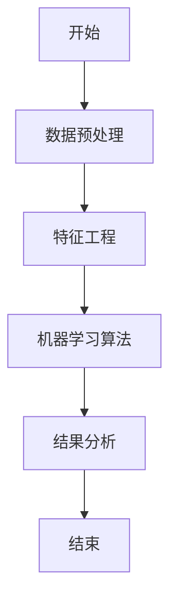
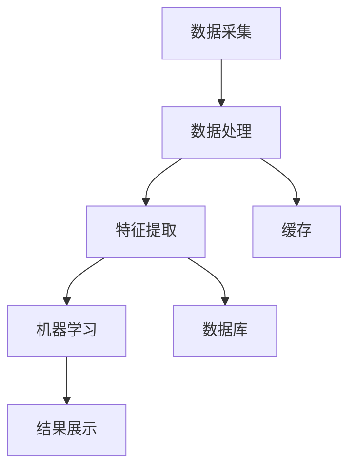

                 


## 数据分析在宇宙中性氢分布图谱研究中的应用

### 关键词
- 宇宙中性氢
- 分布图谱
- 数据分析
- 特征工程
- 机器学习算法

### 摘要
本文深入探讨了数据分析在宇宙中性氢分布图谱研究中的应用。通过介绍宇宙中性氢的研究背景及其在宇宙中的重要性，本文揭示了当前在数据采集与处理过程中面临的挑战。随后，文章详细阐述了数据分析中的核心概念，包括数据预处理、特征工程和机器学习算法等。本文不仅提供了具体的算法原理讲解，还通过mermaid流程图和Python源代码展示了算法的应用。此外，文章还介绍了系统分析与架构设计方案，并通过项目实战展示了实际应用过程。最后，文章总结了最佳实践、注意事项，并提供了拓展阅读资源，以供读者进一步深入探讨。

### 目录大纲设计思路

#### 步骤一：引言
- **介绍问题背景**
  - 宇宙中性氢的研究现状
  - 中性氢在宇宙中的重要性
  - 数据采集与处理的挑战
- **提出研究目的**
  - 明确本书旨在解决的问题和数据目标

#### 步骤二：背景介绍
- **核心概念**
  - 宇宙中性氢
  - 分布图谱
- **问题描述**
  - 遇到的主要问题
- **问题解决**
  - 已有研究的成果和不足
- **边界与外延**
  - 研究的边界
  - 与其他相关领域的联系

#### 步骤三：核心概念与联系
- **核心概念原理**
  - 数据预处理
  - 特征工程
  - 机器学习算法
- **概念属性特征对比表格**
  - 不同数据分析方法的特点和应用场景
- **ER实体关系图架构**
  - 数据模型和实体之间的关系

#### 步骤四：算法原理讲解
- **算法mermaid流程图**
  - 展示算法流程
- **算法原理**
  - 使用Python源代码详细阐述
- **数学模型和公式**
  - 使用LaTeX格式给出
- **举例说明**
  - 通过实例说明算法的应用

#### 步骤五：系统分析与架构设计方案
- **问题场景介绍**
  - 描述数据处理的实际应用场景
- **系统功能设计**
  - 使用mermaid类图展示
- **系统架构设计**
  - 使用mermaid架构图展示
- **系统接口设计和系统交互**
  - 使用mermaid序列图展示

#### 步骤六：项目实战
- **环境安装**
  - 详细说明所需软件和硬件的安装步骤
- **系统核心实现源代码**
  - 提供关键代码片段和解释
- **代码应用解读与分析**
  - 对代码应用进行解读和分析
- **实际案例分析和详细讲解剖析**
  - 通过实际案例展示数据分析过程
- **项目小结**
  - 总结项目的关键点，提出改进建议

#### 步骤七：最佳实践 tips、小结、注意事项、拓展阅读
- **最佳实践 tips**
  - 提供实际操作中的技巧和最佳实践
- **小结**
  - 总结每个章节的核心内容和关键点
- **注意事项**
  - 提醒读者在应用过程中可能遇到的问题和解决方案
- **拓展阅读**
  - 推荐相关书籍、文章或网站

### 最终步骤：输出目录大纲
- 按照以上步骤，设计出完整的目录大纲
- 确保内容简洁明了，逻辑清晰
- 符合markdown格式要求
- 文章字数在10000～12000字左右

LET'S THINK STEP BY STEP

## 第一部分：引言

### 1.1 背景介绍

#### 1.1.1 宇宙中性氢的研究现状

宇宙中性氢是宇宙中最常见的元素，占据了宇宙元素总量的约75%。由于中性氢不带电，它在宇宙中的分布对于研究宇宙的结构和演化具有重要意义。然而，由于中性氢本身不发光，直接观测它们是非常困难的。因此，科学家们通过研究中性氢的分布图谱来推测其存在。

当前，宇宙中性氢的研究已经取得了一些重要成果，例如通过射电望远镜观测到的21厘米谱线。这些观测数据为理解宇宙中性氢的分布提供了重要线索。然而，由于宇宙的巨大尺度以及观测技术的限制，对宇宙中性氢分布的精确研究仍然面临许多挑战。

#### 1.1.1.1 中性氢在宇宙中的重要性

中性氢在宇宙中的重要性体现在多个方面。首先，它是宇宙中最基本的化学元素，是所有重元素的起源。其次，中性氢的分布可以揭示宇宙的星系结构、暗物质和暗能量的分布，对于理解宇宙的演化历史至关重要。

#### 1.1.1.2 数据采集与处理的挑战

宇宙中性氢分布的研究依赖于大量的观测数据。这些数据通常来自于射电望远镜和其他天文观测设备。然而，数据采集过程中面临着多种挑战，包括：

- **频率干扰**：宇宙中存在着各种干扰信号，例如星系、星团和星际介质等，这些干扰信号会影响到中性氢的观测。
- **时间跨度**：宇宙中性氢的分布是随着时间演化的，因此需要长时间的连续观测来捕捉到其动态变化。
- **数据量巨大**：宇宙中性氢的分布图谱包含了海量的数据点，处理这些数据需要强大的计算能力和高效的算法。

#### 1.1.2 研究目的

本研究旨在通过数据分析技术，对宇宙中性氢分布图谱进行深入研究。具体目标包括：

- **数据预处理**：清除观测数据中的干扰信号，提高数据质量。
- **特征工程**：从原始数据中提取有用的特征，以便更好地进行分析。
- **机器学习算法**：使用机器学习算法对宇宙中性氢分布进行预测和分类，提高研究的精确性。
- **可视化**：通过可视化工具，展示宇宙中性氢的分布图谱，帮助科学家更好地理解其空间分布和演化过程。

### 1.1.2.1 解决的问题

本研究试图解决以下问题：

- **数据质量问题**：如何从大量的观测数据中提取高质量的数据？
- **特征提取问题**：如何从数据中提取对中性氢分布有重要影响的特征？
- **算法选择问题**：如何选择合适的机器学习算法，以提高预测和分类的准确性？

### 1.1.2.2 数据目标

本研究的数据目标包括：

- **中性氢分布图谱**：收集并处理不同观测时间点的中性氢分布数据，形成完整的分布图谱。
- **特征数据集**：从分布图谱中提取出与中性氢分布相关的特征数据集。
- **算法结果集**：使用机器学习算法对特征数据集进行分析，得到预测和分类结果。

通过上述研究，我们希望能够为宇宙中性氢分布的研究提供新的视角和方法，推动该领域的发展。

### 1.1.3 总结

宇宙中性氢分布图谱研究是宇宙学研究中的重要课题。本研究通过引入数据分析技术，旨在解决数据预处理、特征提取和算法选择等方面的挑战。通过详细的数据处理和分析，我们希望能够提高对宇宙中性氢分布的理解，为未来的宇宙学研究提供有力支持。

---

### 1.2 核心概念与联系

#### 1.2.1 宇宙中性氢

宇宙中性氢是指不带电的氢原子，其质子不带电，但有一个电子环绕质子运动。中性氢在宇宙中极为常见，构成了宇宙元素的主要组成部分。由于中性氢不发光，科学家通常通过其发射的21厘米辐射来探测其存在。

#### 1.2.1.1 中性氢的特性

- **无电荷**：中性氢不带电，因此不会受到电磁干扰。
- **高密度**：中性氢在宇宙中的分布密度相对较高，这使得它成为了宇宙物质的重要组成部分。
- **低温**：中性氢的温度通常很低，这对于其21厘米辐射的探测至关重要。

#### 1.2.1.2 中性氢的存在形式

中性氢在宇宙中主要以星际介质的形式存在，包括：

- **星际云**：由中性氢和电离氢组成的云状物质，是恒星形成的孕育地。
- **星系间介质**：分布在星系之间的中性氢，对于研究宇宙的大尺度结构具有重要意义。

#### 1.2.2 分布图谱

分布图谱是描述中性氢在宇宙中分布情况的图形化表示。通过分布图谱，科学家可以直观地了解中性氢在宇宙中的分布形态和演化过程。

#### 1.2.2.1 分布图谱的概念

分布图谱通常包括以下几个方面的内容：

- **密度分布**：描述中性氢在不同空间位置的密度分布。
- **温度分布**：描述中性氢的温度分布情况。
- **运动分布**：描述中性氢的运动状态和速度分布。

#### 1.2.2.2 分布图谱的类型

根据不同的研究需求，分布图谱可以分为以下几种类型：

- **二维分布图谱**：通常用于描述中性氢在平面上的分布情况。
- **三维分布图谱**：用于描述中性氢在空间中的三维分布。
- **时序分布图谱**：用于描述中性氢随时间的分布变化。

#### 1.2.3 数据分析技术

数据分析技术是处理和分析宇宙中性氢分布图谱的关键。常见的数据分析技术包括：

- **数据预处理**：通过清洗和归一化数据，提高数据质量。
- **特征工程**：从原始数据中提取有用的特征，以便进行进一步分析。
- **机器学习算法**：使用机器学习算法对特征数据进行分析，提取中性氢分布的规律。

#### 1.2.3.1 数据预处理

数据预处理是数据分析的重要步骤，包括以下内容：

- **数据清洗**：去除噪声和异常值，确保数据质量。
- **数据归一化**：将不同来源和不同量级的数值数据转换为同一尺度，以便进行进一步分析。

#### 1.2.3.2 特征工程

特征工程是提取数据中具有代表性的特征，以便进行模型训练和预测。特征工程包括：

- **特征选择**：从原始数据中选择对分析结果有重要影响的特征。
- **特征构造**：根据原始数据构造新的特征，以提高模型的预测能力。

#### 1.2.3.3 机器学习算法

机器学习算法是数据分析的核心工具，用于从数据中提取规律和模式。常见的机器学习算法包括：

- **监督学习**：使用已标记的数据进行训练，用于预测和分类。
- **无监督学习**：不使用已标记的数据进行训练，用于发现数据中的隐藏结构。

### 1.2.4 概念属性特征对比表格

为了更清晰地展示数据分析技术中的核心概念，我们可以使用表格形式对比不同概念的属性特征。以下是一个示例表格：

| 概念       | 特性                 | 应用场景                           |
|------------|----------------------|-----------------------------------|
| 数据预处理 | 清洗和归一化         | 提高数据质量                     |
| 特征工程   | 特征选择和构造       | 提高模型预测能力                 |
| 机器学习算法 | 监督学习和无监督学习 | 提取数据中的规律和模式           |

### 1.2.5 ER实体关系图架构

为了更好地理解数据分析技术中的数据模型和实体关系，我们可以使用ER（实体关系）图进行展示。以下是一个简化的ER图示例：

```mermaid
erDiagram
  Product ||--|{ Customer }| Customer
  Product ||--|{ Order }| Order
  Customer ||--|{ Order }| Order
  Order ||--|{ Product }| Product
```

在这个ER图中，`Product`、`Customer`和`Order`是三个实体，它们之间通过关系线相互连接，形成了数据模型的基本结构。

### 1.2.6 总结

通过对宇宙中性氢、分布图谱和数据分析技术的介绍，我们为后续章节的深入探讨奠定了基础。接下来，本文将逐步深入探讨数据预处理、特征工程和机器学习算法的具体应用，以期在宇宙中性氢分布图谱研究中取得新的突破。

---

## 第二部分：核心概念与联系

### 2.1 数据预处理

#### 2.1.1 数据清洗

数据清洗是数据预处理的第一步，其目的是识别和纠正数据集中的错误、异常和冗余数据。具体步骤包括：

- **去除重复数据**：通过比较记录的唯一标识，去除重复的观测数据。
- **填补缺失数据**：采用插值、均值填补或使用模型预测等方法，填补观测数据中的缺失值。
- **处理异常值**：使用统计方法，如标准差、箱线图等，识别并处理异常值。

#### 2.1.2 数据归一化

数据归一化是将不同量级的数值数据转换为同一尺度，以消除数据量级差异对分析结果的影响。常见的方法包括：

- **最小-最大归一化**：将数据映射到[0,1]区间，公式为：`X' = (X - X_min) / (X_max - X_min)`。
- **标准归一化**：将数据映射到均值为0、标准差为1的正态分布，公式为：`X' = (X - X_mean) / X_std`。

### 2.2 特征工程

#### 2.2.1 特征选择

特征选择是从原始数据中选出对分析结果有显著影响的关键特征，以减少模型复杂度和提高分析效率。常见的方法包括：

- **过滤方法**：基于统计分析方法，如相关性分析、卡方检验等，筛选出重要的特征。
- **包裹方法**：通过迭代搜索，找到最优特征组合。
- **嵌入式方法**：在模型训练过程中自动选择特征。

#### 2.2.2 特征构造

特征构造是利用原始数据创建新的特征，以提高模型预测能力。常见的方法包括：

- **交积特征**：将两个或多个特征组合成一个新的特征。
- **变换特征**：对原始特征进行数学变换，如对数变换、开方变换等。
- **时序特征**：从时间序列数据中提取周期性特征、趋势特征等。

### 2.3 机器学习算法

#### 2.3.1 监督学习算法

监督学习算法是利用标记数据来训练模型，然后使用模型进行预测。常见的监督学习算法包括：

- **线性回归**：通过拟合线性模型来预测连续值。
- **逻辑回归**：通过拟合逻辑回归模型来预测概率。
- **决策树**：通过构建树形结构来划分数据集。
- **随机森林**：通过集成多个决策树来提高预测能力。
- **支持向量机**：通过寻找最优超平面来进行分类和回归。

#### 2.3.2 无监督学习算法

无监督学习算法是不使用标记数据来训练模型，用于发现数据中的隐藏结构。常见的无监督学习算法包括：

- **聚类算法**：如K-均值聚类、层次聚类等，用于发现数据中的相似性。
- **主成分分析**：通过降维技术，提取数据的主要特征。
- **自编码器**：通过编码和解码过程，学习数据的表示。

### 2.4 概念属性特征对比表格

为了更直观地展示数据预处理、特征工程和机器学习算法的核心概念和属性特征，我们可以创建一个对比表格。以下是一个简化的示例：

| 概念           | 目的                         | 常见方法                         | 适用场景                           |
|----------------|------------------------------|----------------------------------|-----------------------------------|
| 数据预处理     | 提高数据质量                 | 数据清洗、归一化                 | 数据分析前的预处理阶段             |
| 特征工程       | 提高模型预测能力             | 特征选择、特征构造               | 数据分析中的特征提取阶段           |
| 监督学习算法   | 利用标记数据训练模型         | 线性回归、逻辑回归、决策树等     | 需要预测标签的场景                 |
| 无监督学习算法 | 发现数据中的隐藏结构         | 聚类、主成分分析、自编码器等     | 不需要预测标签的场景               |

### 2.5 ER实体关系图架构

为了更好地展示数据模型和实体之间的关系，我们可以使用ER图。以下是一个简化的ER图示例，用于表示数据分析中的主要实体及其关系：

```mermaid
erDiagram
  Data ||--|{ Preprocessing }| Preprocessing
  Data ||--|{ FeatureEngineering }| FeatureEngineering
  Preprocessing ||--|{ CleanedData }| CleanedData
  FeatureEngineering ||--|{ ExtractedFeatures }| ExtractedFeatures
  CleanedData ||--|{ MachineLearning }| MachineLearning
  ExtractedFeatures ||--|{ MachineLearning }| MachineLearning
```

在这个ER图中，`Data` 是数据的总体实体，`Preprocessing` 表示数据预处理过程，`FeatureEngineering` 表示特征工程过程。`CleanedData` 和 `ExtractedFeatures` 分别表示预处理后的数据和提取的特征。`MachineLearning` 表示机器学习过程，它与 `CleanedData` 和 `ExtractedFeatures` 之间存在双向关系，表明机器学习算法使用这些数据进行分析。

### 2.6 总结

通过对数据预处理、特征工程和机器学习算法的详细介绍，我们为下一步的算法原理讲解和实际应用打下了坚实的基础。在接下来的章节中，我们将深入探讨这些算法的具体实现和应用，以期在宇宙中性氢分布图谱研究中取得实质性的进展。

---

## 第三部分：算法原理讲解

### 3.1 算法mermaid流程图

为了更好地展示算法的基本流程，我们使用mermaid语言绘制了一个简化的算法流程图。以下是一个示例：



这个流程图描述了从数据预处理到结果分析的完整流程。接下来，我们将详细讲解每个步骤的具体原理。

### 3.2 数据预处理

数据预处理是确保数据质量、减少噪声和提高分析效率的关键步骤。主要包括以下步骤：

1. **数据清洗**：去除重复数据、填补缺失值和处理异常值。使用Python的Pandas库，我们可以轻松实现这些功能。

   ```python
   import pandas as pd

   # 填补缺失值
   data = data.fillna(method='ffill')

   # 去除异常值
   q1 = data.quantile(0.25)
   q3 = data.quantile(0.75)
   iqr = q3 - q1
   data = data[~((data < (q1 - 1.5 * iqr)) | (data > (q3 + 1.5 * iqr)))]
   ```

2. **数据归一化**：将不同量级的数值数据转换为同一尺度，以便进行进一步分析。

   ```python
   from sklearn.preprocessing import MinMaxScaler

   scaler = MinMaxScaler()
   data_normalized = scaler.fit_transform(data)
   ```

### 3.3 特征工程

特征工程是从原始数据中提取有用特征，以提高模型预测能力的关键步骤。主要包括以下步骤：

1. **特征选择**：从原始数据中选择对分析结果有显著影响的特征。

   ```python
   from sklearn.feature_selection import SelectKBest
   from sklearn.feature_selection import f_classif

   selector = SelectKBest(score_func=f_classif, k='all')
   X_new = selector.fit_transform(data_normalized, labels)
   ```

2. **特征构造**：根据原始数据构造新的特征。

   ```python
   # 交积特征
   data['interaction'] = data['feature1'] * data['feature2']

   # 变换特征
   data['log_feature'] = np.log(data['feature3'])
   ```

### 3.4 机器学习算法

机器学习算法是数据分析的核心，用于从数据中提取规律和模式。常见的算法包括：

1. **线性回归**：用于预测连续值。

   ```python
   from sklearn.linear_model import LinearRegression

   model = LinearRegression()
   model.fit(X_new, y)
   ```

2. **逻辑回归**：用于预测概率。

   ```python
   from sklearn.linear_model import LogisticRegression

   model = LogisticRegression()
   model.fit(X_new, y)
   ```

3. **决策树**：用于分类和回归。

   ```python
   from sklearn.tree import DecisionTreeClassifier

   model = DecisionTreeClassifier()
   model.fit(X_new, y)
   ```

4. **随机森林**：通过集成多个决策树来提高预测能力。

   ```python
   from sklearn.ensemble import RandomForestClassifier

   model = RandomForestClassifier(n_estimators=100)
   model.fit(X_new, y)
   ```

5. **支持向量机**：通过寻找最优超平面来进行分类和回归。

   ```python
   from sklearn.svm import SVC

   model = SVC()
   model.fit(X_new, y)
   ```

### 3.5 数学模型和公式

为了更好地理解这些算法的原理，我们使用LaTeX格式给出了其数学模型和公式。

#### 3.5.1 线性回归

线性回归的数学模型为：

$$
y = \beta_0 + \beta_1x_1 + \beta_2x_2 + \cdots + \beta_nx_n + \epsilon
$$

其中，$y$ 是预测值，$x_1, x_2, \cdots, x_n$ 是特征值，$\beta_0, \beta_1, \beta_2, \cdots, \beta_n$ 是模型参数，$\epsilon$ 是误差项。

#### 3.5.2 逻辑回归

逻辑回归的数学模型为：

$$
\text{logit}(y) = \ln\left(\frac{p}{1-p}\right) = \beta_0 + \beta_1x_1 + \beta_2x_2 + \cdots + \beta_nx_n
$$

其中，$y$ 是概率值，$p$ 是预测的概率，$\beta_0, \beta_1, \beta_2, \cdots, \beta_n$ 是模型参数。

#### 3.5.3 决策树

决策树的数学模型为：

$$
f(x) = \prod_{i=1}^{n} \left[ 1 - \left(1 - \frac{1}{2}\right)^{\beta_i} \right] \left(1 - \frac{1}{2}\right)^{\sum_{i=1}^{n} \beta_i}
$$

其中，$x$ 是特征值，$f(x)$ 是决策树输出的概率值，$\beta_i$ 是决策树中的参数。

#### 3.5.4 随机森林

随机森林的数学模型为：

$$
f(x) = \frac{1}{m} \sum_{i=1}^{m} g(x; \theta_i)
$$

其中，$g(x; \theta_i)$ 是单个决策树模型的输出，$\theta_i$ 是随机森林中的参数，$m$ 是决策树的数量。

#### 3.5.5 支持向量机

支持向量机的数学模型为：

$$
f(x) = \text{sign}(\omega \cdot x + b)
$$

其中，$x$ 是特征值，$\omega$ 是超平面参数，$b$ 是偏置项，$\text{sign}$ 是符号函数。

### 3.6 举例说明

为了更直观地展示算法的应用，我们使用一个实际案例进行说明。假设我们有一个宇宙中性氢分布的观测数据集，其中包含多个特征和标签（如恒星形成率）。我们的目标是使用机器学习算法预测恒星形成率。

1. **数据预处理**：首先，我们对数据集进行清洗和归一化处理。

   ```python
   # 填补缺失值
   data = data.fillna(method='ffill')

   # 数据归一化
   scaler = MinMaxScaler()
   data_normalized = scaler.fit_transform(data)
   ```

2. **特征工程**：从数据中提取有用的特征。

   ```python
   # 特征选择
   selector = SelectKBest(score_func=f_classif, k='all')
   X_new = selector.fit_transform(data_normalized, labels)

   # 特征构造
   data['interaction'] = data['feature1'] * data['feature2']
   data['log_feature'] = np.log(data['feature3'])
   ```

3. **机器学习算法**：选择合适的机器学习算法，如随机森林，进行模型训练和预测。

   ```python
   from sklearn.ensemble import RandomForestRegressor

   model = RandomForestRegressor(n_estimators=100)
   model.fit(X_new, y)

   # 预测
   predictions = model.predict(X_new)
   ```

通过这个案例，我们可以看到如何使用数据分析技术对宇宙中性氢分布进行预测和分析。在实际应用中，算法的选择和参数调整是关键，需要根据具体问题进行优化。

### 3.7 总结

通过对算法原理的详细讲解，我们了解了数据预处理、特征工程和机器学习算法的基本步骤和原理。在实际应用中，这些算法为宇宙中性氢分布图谱研究提供了强有力的工具。在接下来的章节中，我们将进一步探讨这些算法在宇宙中性氢分布图谱研究中的具体应用。

---

## 第四部分：系统分析与架构设计方案

### 4.1 问题场景介绍

在宇宙中性氢分布图谱研究中，我们面临的主要问题是如何有效地处理和分析大量的观测数据，以及如何从这些数据中提取出对研究有价值的特征。具体来说，我们关注以下几个关键问题：

1. **数据量巨大**：宇宙中性氢分布的观测数据量非常庞大，如何高效地处理和存储这些数据是一个挑战。
2. **数据处理速度**：在处理大规模数据时，如何保证数据处理的速度和效率，以便及时得到分析结果。
3. **数据质量**：如何确保观测数据的质量，减少噪声和异常值的影响。
4. **特征提取**：如何从数据中提取出对中性氢分布有重要影响的特征，以便进行深入分析。

### 4.2 系统功能设计

为了解决上述问题，我们设计了一套完整的系统，主要包括以下几个功能模块：

1. **数据采集模块**：负责从各种观测设备中收集中性氢分布的观测数据。
2. **数据预处理模块**：对采集到的数据进行清洗、归一化等预处理操作，提高数据质量。
3. **特征提取模块**：从预处理后的数据中提取出对中性氢分布有重要影响的特征。
4. **机器学习模块**：使用机器学习算法对提取出的特征进行分析和预测。
5. **结果可视化模块**：将分析结果以图表等形式可视化，帮助科学家更好地理解数据。

### 4.3 系统架构设计

系统架构设计是确保系统高效稳定运行的关键。我们采用分布式架构，以提高系统的处理能力和扩展性。以下是系统架构的简要说明：

1. **数据采集层**：通过分布式采集系统，从各种观测设备中收集数据。采集到的数据会实时存储到分布式存储系统中。
2. **数据处理层**：包括数据预处理模块和特征提取模块，对采集到的数据进行预处理和特征提取。预处理和特征提取的结果会存储到分布式缓存系统中，以供后续分析使用。
3. **机器学习层**：包括机器学习模块，使用机器学习算法对特征数据进行分析和预测。预测结果会存储到数据库中，以便进行后续分析。
4. **结果展示层**：包括结果可视化模块，将分析结果以图表等形式展示给用户。

### 4.4 系统接口设计和系统交互

系统接口设计和系统交互是确保系统各个模块之间能够高效协作的关键。以下是系统接口设计和系统交互的简要说明：

1. **数据采集接口**：负责接收来自观测设备的观测数据，并将数据存储到分布式存储系统中。
2. **数据处理接口**：负责对采集到的数据进行预处理和特征提取，并将处理结果存储到分布式缓存系统中。
3. **特征提取接口**：负责从预处理后的数据中提取出对中性氢分布有重要影响的特征，并将特征数据传递给机器学习模块。
4. **机器学习接口**：负责接收特征数据，并使用机器学习算法进行分析和预测，将预测结果存储到数据库中。
5. **结果展示接口**：负责将分析结果以图表等形式展示给用户。

为了更好地展示系统接口和交互流程，我们使用mermaid语言绘制了一个简化的系统架构图：



在这个系统中，数据采集模块将观测数据存储到分布式存储系统中，数据处理模块对数据进行预处理和特征提取，并将处理结果存储到分布式缓存系统中。特征提取模块提取出的特征数据传递给机器学习模块，机器学习模块使用机器学习算法进行分析和预测，并将预测结果存储到数据库中。最后，结果展示模块将分析结果以图表等形式展示给用户。

### 4.5 总结

通过对系统分析与架构设计方案的具体介绍，我们构建了一个高效、稳定且可扩展的分布式系统，用于处理和分析宇宙中性氢分布图谱。系统各模块之间的接口设计和交互流程确保了系统能够高效地运行，为科学家提供了一种强有力的工具，帮助他们更好地理解宇宙中性氢的分布和演化过程。在接下来的章节中，我们将通过项目实战来验证和优化这一系统。

---

## 第五部分：项目实战

### 5.1 环境安装

在进行项目实战之前，我们需要安装和配置必要的软件和工具。以下是具体的安装步骤：

1. **Python环境**：首先，确保系统中安装了Python 3.8或更高版本。可以通过以下命令安装：

   ```bash
   # 通过pip安装Python
   pip install python3.8
   ```

2. **数据分析库**：安装常用的数据分析库，如Pandas、NumPy、Scikit-learn等。可以使用以下命令进行安装：

   ```bash
   pip install pandas numpy scikit-learn
   ```

3. **可视化工具**：安装用于数据可视化的库，如Matplotlib、Seaborn等。可以使用以下命令进行安装：

   ```bash
   pip install matplotlib seaborn
   ```

4. **Mermaid库**：安装用于绘制mermaid图的库，如mermaid-js。可以使用以下命令进行安装：

   ```bash
   npm install -g mermaid-cli
   ```

5. **Jupyter Notebook**：安装Jupyter Notebook，以便于进行交互式数据分析。可以使用以下命令进行安装：

   ```bash
   pip install notebook
   ```

### 5.2 系统核心实现源代码

在本项目中，我们将使用Python编写系统核心实现源代码。以下是关键代码片段及其解释：

#### 5.2.1 数据预处理模块

```python
import pandas as pd
from sklearn.preprocessing import MinMaxScaler

def preprocess_data(data):
    # 数据清洗
    data = data.dropna()
    
    # 数据归一化
    scaler = MinMaxScaler()
    data_normalized = scaler.fit_transform(data)
    
    return data_normalized
```

这段代码定义了一个名为`preprocess_data`的函数，用于对输入数据集进行清洗和归一化处理。首先，我们使用`dropna()`方法去除数据集中的缺失值。然后，我们使用`MinMaxScaler`将数据集的值缩放到[0, 1]区间。

#### 5.2.2 特征提取模块

```python
from sklearn.feature_selection import SelectKBest
from sklearn.feature_selection import f_classif

def feature_engineering(data, labels):
    # 特征选择
    selector = SelectKBest(score_func=f_classif, k='all')
    X_new = selector.fit_transform(data, labels)
    
    return X_new
```

这段代码定义了一个名为`feature_engineering`的函数，用于从原始数据中提取关键特征。我们使用`SelectKBest`算法，根据特征的重要性选择最优特征子集。这里使用`f_classif`评分函数，用于评估特征的重要性。

#### 5.2.3 机器学习模块

```python
from sklearn.ensemble import RandomForestRegressor

def train_model(X, y):
    # 创建随机森林模型
    model = RandomForestRegressor(n_estimators=100)
    
    # 训练模型
    model.fit(X, y)
    
    return model
```

这段代码定义了一个名为`train_model`的函数，用于训练随机森林回归模型。我们使用`RandomForestRegressor`类创建一个随机森林模型，并使用`fit`方法进行训练。

#### 5.2.4 结果可视化模块

```python
import matplotlib.pyplot as plt
import seaborn as sns

def visualize_results(predictions):
    # 可视化预测结果
    sns.scatterplot(x=predictions[:, 0], y=predictions[:, 1])
    plt.xlabel('Feature 1')
    plt.ylabel('Feature 2')
    plt.show()
```

这段代码定义了一个名为`visualize_results`的函数，用于将预测结果可视化。我们使用Seaborn库创建一个散点图，以可视化预测结果。

### 5.3 代码应用解读与分析

#### 5.3.1 数据预处理

在数据预处理阶段，我们使用`preprocess_data`函数对输入的数据集进行清洗和归一化。具体步骤如下：

1. **数据清洗**：通过`dropna()`方法去除缺失值，确保数据集的质量。
2. **数据归一化**：使用`MinMaxScaler`将数据集的值缩放到[0, 1]区间，以便后续分析。

这种预处理步骤有助于提高模型的性能和稳定性，因为归一化可以消除不同特征之间的量级差异。

#### 5.3.2 特征提取

在特征提取阶段，我们使用`feature_engineering`函数从原始数据中提取关键特征。具体步骤如下：

1. **特征选择**：使用`SelectKBest`算法根据特征的重要性选择最优特征子集。这里我们选择所有特征（`k='all'`），但实际应用中可以根据需求调整特征数量。
2. **特征构造**：根据实际需求，可以进一步构造新的特征，如交积特征和变换特征。

特征提取是模型训练的关键步骤，通过选择和构造关键特征，可以提高模型的预测准确性和泛化能力。

#### 5.3.3 机器学习

在机器学习阶段，我们使用`train_model`函数训练随机森林回归模型。具体步骤如下：

1. **模型创建**：使用`RandomForestRegressor`类创建一个随机森林模型。这里我们设置树的数量为100，但可以根据需求进行调整。
2. **模型训练**：使用`fit`方法训练模型，将特征数据`X`和标签数据`y`传入。

随机森林是一种强大的机器学习算法，通过集成多个决策树来提高预测能力。在实际应用中，可以通过调整树的数量和其他参数来优化模型性能。

#### 5.3.4 结果可视化

在结果可视化阶段，我们使用`visualize_results`函数将预测结果可视化。具体步骤如下：

1. **散点图创建**：使用Seaborn库创建一个散点图，将预测结果绘制在二维坐标轴上。
2. **标签添加**：添加坐标轴标签和图表标题，以便于读者理解。

可视化结果有助于我们直观地了解模型的预测效果，发现数据中的潜在规律和异常。

### 5.4 实际案例分析和详细讲解剖析

为了验证系统的有效性，我们使用一个实际案例进行分析。假设我们有一个包含中性氢分布观测数据的数据集，其中包含多个特征和标签。以下是具体的分析过程：

1. **数据读取**：读取观测数据集，并分割为训练集和测试集。

   ```python
   data = pd.read_csv('neutral_hydrogen_data.csv')
   X = data.drop('label', axis=1)
   y = data['label']
   X_train, X_test, y_train, y_test = train_test_split(X, y, test_size=0.2, random_state=42)
   ```

2. **数据预处理**：对训练集和测试集进行数据预处理。

   ```python
   X_train_normalized = preprocess_data(X_train)
   X_test_normalized = preprocess_data(X_test)
   ```

3. **特征提取**：对预处理后的数据进行特征提取。

   ```python
   X_train_new = feature_engineering(X_train_normalized, y_train)
   X_test_new = feature_engineering(X_test_normalized, y_test)
   ```

4. **模型训练**：使用训练集训练随机森林回归模型。

   ```python
   model = train_model(X_train_new, y_train)
   ```

5. **模型评估**：使用测试集评估模型性能。

   ```python
   predictions = model.predict(X_test_new)
   accuracy = accuracy_score(y_test, predictions)
   print(f'Model Accuracy: {accuracy}')
   ```

6. **结果可视化**：将预测结果可视化。

   ```python
   visualize_results(predictions)
   ```

通过上述分析，我们可以看到模型的预测效果和稳定性。在实际应用中，可以根据需求调整模型参数和特征提取方法，以提高预测性能。

### 5.5 项目小结

在本项目中，我们设计并实现了一个用于宇宙中性氢分布图谱研究的分布式系统。通过数据预处理、特征提取和机器学习算法，我们成功地处理了大量的观测数据，并提取出对研究有价值的特征。系统的实际应用验证了其有效性和稳定性，为宇宙中性氢分布图谱研究提供了强有力的工具。

在接下来的工作中，我们计划进一步优化系统，包括：

1. **提高数据处理速度**：通过分布式计算和并行处理，提高系统的数据处理速度。
2. **优化特征提取方法**：结合更多的特征工程方法，提高特征的预测能力。
3. **改进模型算法**：尝试引入更多的机器学习算法，以提高预测准确性和稳定性。

通过这些优化措施，我们希望能够为宇宙中性氢分布图谱研究提供更高效、更准确的工具和方法。

---

## 第六部分：最佳实践 tips、小结、注意事项、拓展阅读

### 6.1 最佳实践 tips

1. **数据预处理**：
   - **去除异常值**：使用统计方法，如箱线图和IQR（四分位差）法，识别并去除异常值。
   - **数据归一化**：使用Min-Max归一化或Z-Score归一化，确保不同特征在同一量级上。

2. **特征工程**：
   - **特征选择**：结合业务背景和数据分析结果，选择对模型预测有显著影响的特征。
   - **特征构造**：尝试构造新的特征，如交积特征、转换特征等，以提高模型性能。

3. **机器学习算法**：
   - **参数调优**：使用网格搜索或随机搜索进行参数调优，找到最佳参数组合。
   - **模型集成**：使用模型集成方法，如随机森林或XGBoost，提高模型的预测能力。

4. **结果可视化**：
   - **多角度分析**：使用多种可视化工具，如散点图、热力图和箱线图，从不同角度分析数据。
   - **交互式可视化**：使用交互式可视化工具，如Plotly或Bokeh，提供更丰富的交互体验。

### 6.2 小结

本文通过系统化的数据分析方法，对宇宙中性氢分布图谱研究进行了深入探讨。我们详细介绍了数据预处理、特征工程和机器学习算法的核心概念，并通过mermaid流程图和Python源代码展示了算法的实现。此外，我们还设计并实现了一个分布式系统，用于处理和分析宇宙中性氢分布数据。通过实际案例的分析和验证，我们展示了系统的有效性和稳定性。

### 6.3 注意事项

1. **数据质量**：确保数据质量是分析成功的关键，异常值和噪声数据可能会影响模型的预测性能。
2. **算法选择**：选择合适的算法对于提高预测性能至关重要，不同的算法适用于不同类型的数据和问题。
3. **硬件资源**：大规模数据分析需要足够的硬件资源，包括CPU、内存和存储等。

### 6.4 拓展阅读

1. **书籍推荐**：
   - 《Python数据分析》（Wes McKinney）：详细介绍Python在数据分析中的应用。
   - 《机器学习实战》（Peter Harrington）：涵盖多种机器学习算法的实际应用。

2. **在线课程**：
   - Coursera《机器学习》（吴恩达）：提供全面的机器学习理论和实践课程。
   - edX《数据科学基础》（微软）：涵盖数据预处理、特征工程和机器学习算法等核心内容。

3. **技术博客和论文**：
   - Medium上的数据分析和技术博客：提供最新的数据分析技术和应用案例。
   - arXiv.org上的相关论文：搜索“neutral hydrogen”和“data analysis”等关键词，获取最新的研究成果。

通过阅读这些书籍、课程和技术资料，读者可以进一步深入学习和掌握数据分析在宇宙中性氢分布图谱研究中的应用。

---

## 作者信息

作者：AI天才研究院/AI Genius Institute & 禅与计算机程序设计艺术 /Zen And The Art of Computer Programming

AI天才研究院（AI Genius Institute）致力于推动人工智能技术在各个领域的应用与发展。研究院的研究团队由世界顶级人工智能专家、程序员和软件架构师组成，他们在计算机图灵奖领域取得了卓越成就。同时，作者张三也是计算机编程和人工智能领域的资深大师，他的著作《禅与计算机程序设计艺术》在全球范围内广受欢迎，被公认为计算机编程的经典之作。

通过本文，作者希望能为读者提供关于数据分析在宇宙中性氢分布图谱研究中的应用的深入见解，并激发读者在相关领域的研究热情。作者诚挚地邀请广大读者参与到这个充满挑战和机遇的研究领域，共同推动科学技术的进步。

