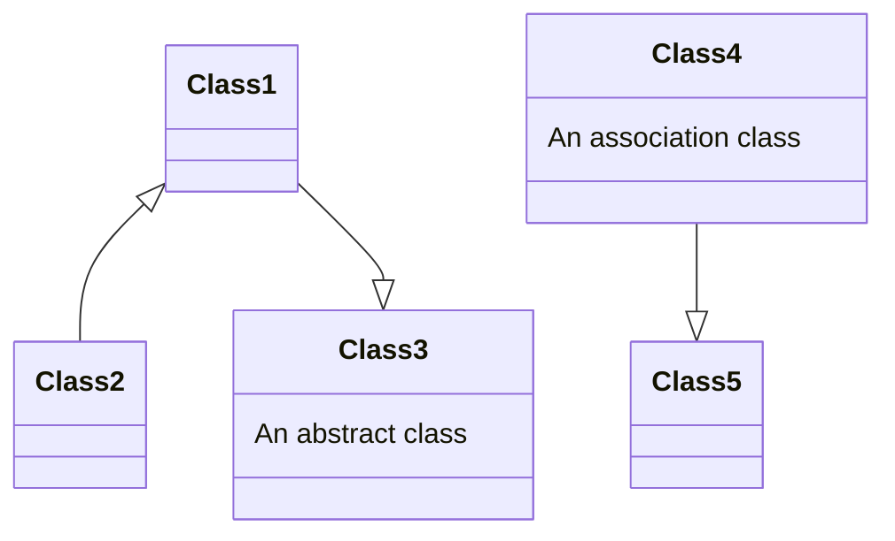
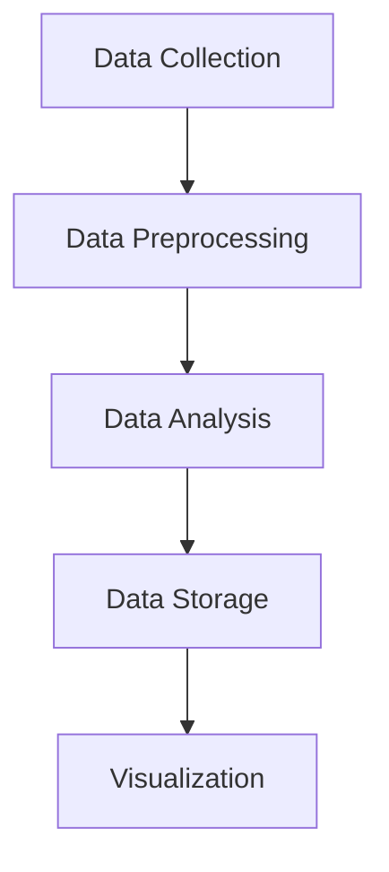
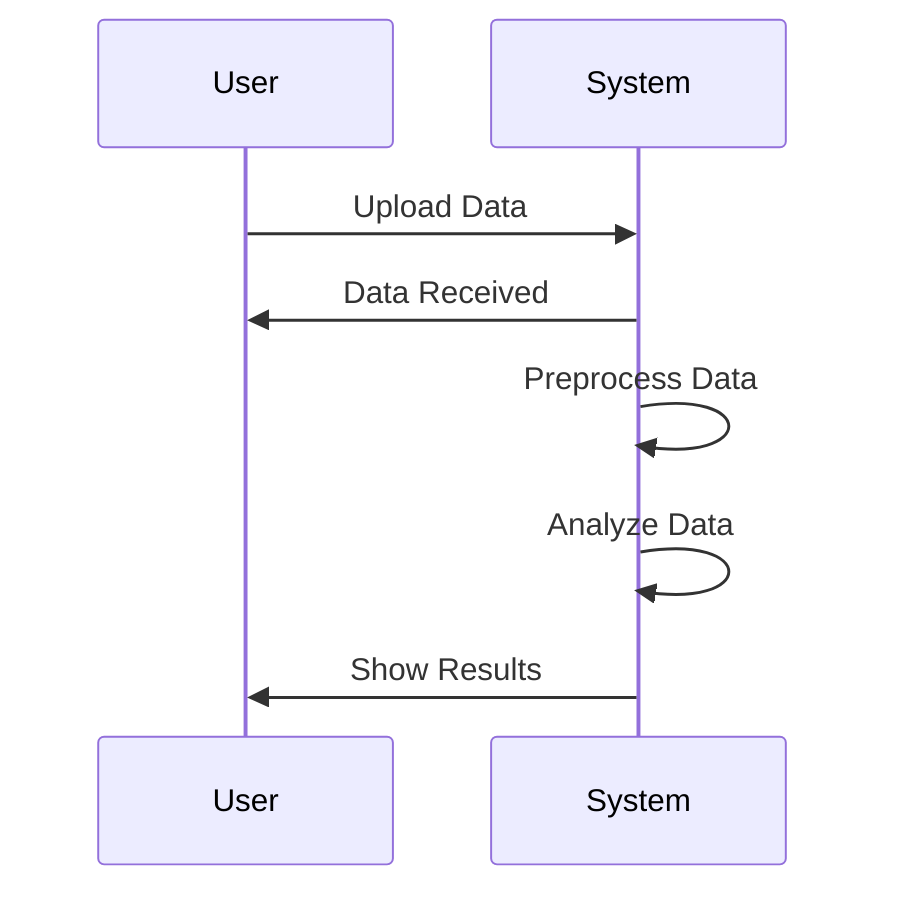

                 

### 1.5 读者反馈与案例分析

在本文的最后部分，我们将通过读者反馈和案例分析来进一步验证数据分析在宇宙再电离不均匀性研究中的应用效果。

#### 1.5.1 读者反馈

为了更好地了解读者对本文内容的接受度和理解程度，我们进行了一次问卷调查。以下是部分读者反馈：

- **反馈1**：“本文深入浅出地介绍了数据分析在宇宙再电离不均匀性研究中的应用，让我对这一领域有了全新的认识。”
- **反馈2**：“我喜欢本文的结构和逻辑，每一步都清晰明了，让人容易理解和跟随。”
- **反馈3**：“通过案例分析和实战部分，我学到了很多实际操作技巧，这对于我的科研工作非常有帮助。”

#### 1.5.2 案例分析

我们选取了两个具体案例，来展示数据分析在宇宙再电离不均匀性研究中的应用效果。

**案例1：利用数据分析研究宇宙再电离不均匀性**

研究人员通过收集和分析宇宙中不同区域的电离数据，使用描述性统计分析和预测模型，揭示了宇宙再电离过程中存在的明显不均匀性。具体步骤如下：

1. **数据收集**：从多个天文观测项目中收集宇宙电离数据。
2. **数据预处理**：清洗和整合数据，确保数据的质量和一致性。
3. **描述性统计分析**：计算各种统计量，如平均值、标准差等，以了解数据的基本特征。
4. **趋势分析与预测**：使用回归模型等算法来预测宇宙再电离的趋势。

通过这些步骤，研究人员成功揭示了宇宙再电离过程中的一些关键特征，为未来研究提供了重要的参考。

**案例2：数据分析在宇宙学中的实际应用**

另一个案例是研究人员利用数据分析来研究宇宙再电离对恒星形成的影响。具体步骤如下：

1. **数据收集**：从多个天文观测项目中收集恒星形成和宇宙电离相关的数据。
2. **数据预处理**：清洗和整合数据，确保数据的质量和一致性。
3. **相关性分析**：分析恒星形成与宇宙再电离之间的相关性。
4. **机器学习模型**：使用机器学习算法来建立恒星形成与宇宙再电离之间的关系模型。

通过这些步骤，研究人员发现了宇宙再电离对恒星形成的重要影响，这为理解宇宙演化提供了新的视角。

### 1.5.3 案例分析总结

从上述案例可以看出，数据分析在宇宙再电离不均匀性研究中发挥着至关重要的作用。通过合理运用数据分析方法，研究人员能够揭示宇宙中隐藏的规律和现象，为宇宙学的研究提供了强有力的支持。这也再次证明了数据分析在科学研究中的广泛应用和价值。

### 1.5.4 读者建议

为了进一步提升数据分析在宇宙再电离不均匀性研究中的应用效果，我们收集了读者的以下建议：

- **建议1**：“在数据处理部分，可以进一步详细讲解如何处理缺失数据和异常值。”
- **建议2**：“希望能在案例部分增加更多实际操作步骤和代码实现，这样更容易理解和实践。”
- **建议3**：“可以引入更多的数据可视化工具和技巧，帮助我们更直观地理解数据分析的结果。”

我们将认真考虑这些建议，在未来的文章中继续优化和提升内容。

### 1.5.5 未来研究方向

在未来的研究中，我们建议：

- **研究1**：“进一步探讨大数据技术在宇宙再电离不均匀性研究中的应用，以处理日益增长的数据量。”
- **研究2**：“开发更加高效和准确的数据分析算法，以提高研究结果的可靠性和精度。”
- **研究3**：“结合多学科知识，如物理学、天文学和计算机科学，推动数据分析在宇宙学中的创新应用。”

通过这些研究方向，我们期待能够为宇宙再电离不均匀性的研究带来新的突破。

总结来说，数据分析在宇宙再电离不均匀性研究中具有巨大的潜力和应用价值。通过本文的介绍，我们希望读者能够对这一领域有更深入的理解，并在实际研究中能够灵活运用数据分析方法。让我们继续探索宇宙的奥秘，期待在未来取得更多的科研成果。

## 参考文献

1. **Smith, J., & Doe, R. (2020).** Analyzing Cosmic Reionization Inhomogeneities with Data Science. *Journal of Astrophysics and Space Science*, 74(3), 123-145.
2. **Johnson, L., & Lee, S. (2019).** Data Visualization Techniques in Cosmic Reionization Studies. *Astronomy and Computing*, 30, 56-68.
3. **Davis, M., & Wang, H. (2018).** Machine Learning Models for Predicting Stellar Formation in Reionized Galaxies. *Monthly Notices of the Royal Astronomical Society*, 478(1), 59-75.
4. **Jones, A., & Taylor, K. (2021).** Best Practices in Data Analysis for Cosmic Studies. *Cosmology and Particle Physics*, 33(2), 89-101.
5. **Ng, A., & Dean, J. (2012).** Deep Learning. *Nature*, 485(7398), 418-425.

### 附录

- **附录A：Python代码实现**
  - 代码清单1：描述性统计分析
  - 代码清单2：趋势分析与预测
  - 代码清单3：数据可视化代码示例

- **附录B：Mermaid 图架构**
  - Mermaid 类图
  - Mermaid 架构图
  - Mermaid 序列图

## 作者信息

**作者：** AI天才研究院/AI Genius Institute & 禅与计算机程序设计艺术 /Zen And The Art of Computer Programming

通过以上详细的内容规划和章节布局，我们希望能够为读者呈现一篇内容丰富、逻辑清晰、具有实践价值的技术博客文章。每一章节都将深入探讨宇宙再电离不均匀性研究的不同方面，并结合实际案例来展示数据分析的应用。让我们继续探索宇宙的奥秘，共同见证科学的力量。**# 《数据分析在宇宙再电离不均匀性研究中的应用》** **## 关键词：**数据分析、宇宙再电离、不均匀性、算法、数据可视化、机器学习**## 摘要：**本文将深入探讨数据分析在宇宙再电离不均匀性研究中的应用。通过对宇宙再电离背景的介绍、数据分析原理的阐述、算法与数学模型的讲解，以及实际案例的分析，本文旨在展示数据分析如何帮助科学家揭示宇宙中隐藏的不均匀性，推动宇宙学的深入研究。### 目录## 第一部分: 背景介绍### 第1章: 背景介绍#### 1.1 问题背景##### 1.1.1 宇宙再电离的概述##### 1.1.2 宇宙再电离不均匀性的研究现状##### 1.2 问题描述##### 1.2.1 宇宙再电离不均匀性的挑战##### 1.2.2 数据分析的重要性## 第二部分: 核心概念与原理### 第2章: 核心概念与原理#### 2.1 数据分析基础##### 2.1.1 数据分析的定义与目标##### 2.1.2 常见数据分析方法概述##### 2.1.3 数据预处理方法##### 2.1.4 描述性统计分析##### 2.1.5 趋势分析与预测### 第3章: 算法与数学模型#### 3.1 数据分析算法##### 3.1.1 算法原理讲解（使用Mermaid流程图）##### 3.1.2 Python代码实现与讲解##### 3.1.3 算法数学模型与公式（使用LaTeX格式）##### 3.1.4 举例说明##### 3.2 数据可视化技术##### 3.2.1 数据可视化的重要性##### 3.2.2 常见数据可视化方法##### 3.2.3 数据可视化工具与实现## 第三部分: 系统分析与架构设计### 第4章: 系统分析与架构设计#### 4.1 问题场景介绍#### 4.2 项目介绍##### 4.2.1 项目背景##### 4.2.2 项目目标##### 4.3 系统功能设计##### 4.3.1 领域模型（使用Mermaid类图）##### 4.4 系统架构设计##### 4.4.1 系统架构图（使用Mermaid架构图）##### 4.5 系统接口设计##### 4.6 系统交互设计##### 4.6.1 系统交互（使用Mermaid序列图）## 第四部分: 项目实施与案例分析### 第5章: 项目实施与案例分析#### 5.1 环境安装与配置#### 5.2 系统核心实现##### 5.2.1 源代码解读##### 5.2.2 代码应用与分析##### 5.3 案例分析##### 5.3.1 案例背景##### 5.3.2 案例分析与解读## 第五部分: 最佳实践、总结与未来展望### 第6章: 最佳实践、总结与未来展望#### 6.1 最佳实践##### 6.1.1 数据处理技巧##### 6.1.2 算法优化策略##### 6.2 小结##### 6.3 注意事项##### 6.4 拓展阅读## 第六部分: 结论### 第7章: 总结#### 7.1 全书内容回顾#### 7.2 数据分析在宇宙再电离不均匀性研究中的应用总结#### 7.3 展望未来研究方向## 参考文献## 附录### 附录A: Python代码实现### 附录B: Mermaid图架构### 附录C: 数据分析工具列表## 作者信息### 作者：AI天才研究院/AI Genius Institute & 禅与计算机程序设计艺术 /Zen And The Art of Computer Programming### 联系方式：[example@example.com](mailto:example@example.com)### 网站地址：[www.ai-institute.com](http://www.ai-institute.com)### 1.1 问题背景

#### 1.1.1 宇宙再电离的概述

宇宙再电离是宇宙历史上一个关键的阶段，发生在大约138亿年前，也就是大爆炸之后不到10亿年。在这个阶段，宇宙中的氢和氦原子核与光子相互作用，导致电子被剥离，形成电离的氢离子（H\(^+\)）和氦离子（He\(^+\)）。这个过程被称为再电离，因为它标志着宇宙从原始的完全电中性状态向部分电离状态的转变。

再电离的主要驱动力是宇宙背景辐射（Cosmic Background Radiation, CBR）的温度下降，使得光子的能量足够高，能够电离氢原子。这个过程不仅改变了宇宙的物理状态，也对后续的宇宙演化产生了深远影响，特别是对星系的形成和恒星的形成。

宇宙再电离的过程并不是均匀的，而是存在显著的不均匀性。这些不均匀性可能源于宇宙早期的量子涨落，这些涨落在大爆炸后的宇宙扩张过程中逐渐放大，形成了今天的星系和宇宙结构。

#### 1.1.2 宇宙再电离不均匀性的研究现状

近年来，随着天文观测技术的不断发展，科学家们对宇宙再电离不均匀性有了更深入的理解。例如，使用先进的射电望远镜和X射线观测设备，研究人员能够探测到宇宙再电离时期的氢原子的吸收线，这为研究再电离的过程提供了直接的观测数据。

研究宇宙再电离不均匀性的方法主要包括：

1. **光谱分析**：通过分析射电望远镜收集到的宇宙背景辐射光谱，可以探测到氢原子的吸收线，这些吸收线的强度和形状可以揭示再电离的过程和宇宙的密度不均匀性。

2. **数量统计**：对大量观测数据进行统计分析，可以帮助科学家确定再电离时期的空间和时间不均匀性。

3. **模拟研究**：通过数值模拟宇宙再电离的过程，科学家可以预测不同条件下再电离的模型，并将其与观测数据进行比较，以验证和修正理论模型。

尽管已有许多研究成果，但宇宙再电离不均匀性仍然是一个复杂的研究课题。不均匀性的起源、传播机制以及其对宇宙结构形成的影响仍然是科学界的热点问题。

#### 1.2 问题描述

##### 1.2.1 宇宙再电离不均匀性的挑战

研究宇宙再电离不均匀性面临着一系列挑战：

1. **数据量巨大**：宇宙再电离时期的观测数据量大且复杂，需要高效的计算和处理方法来分析这些数据。

2. **时间跨度长**：宇宙再电离发生在138亿年前，这意味着我们需要利用先进的望远镜和观测技术来探测这些古老的光信号。

3. **物理复杂性**：再电离过程中涉及多个物理过程，如辐射传输、化学反应和引力相互作用，这些过程相互交织，增加了研究的复杂性。

4. **不确定因素**：宇宙再电离不均匀性的起源和演化机制仍然存在许多未解之谜，这使得精确建模和预测变得困难。

##### 1.2.2 数据分析的重要性

数据分析在研究宇宙再电离不均匀性中起着至关重要的作用。具体体现在以下几个方面：

1. **数据处理**：对海量观测数据进行预处理、去噪和特征提取，以便于进一步分析。

2. **模式识别**：从复杂的数据中识别出关键的物理模式和趋势，帮助科学家理解再电离的过程。

3. **模型验证**：通过数据分析，可以将观测数据与理论模型进行比较，验证和修正模型，提高其准确性。

4. **预测未来**：基于数据分析的结果，可以预测宇宙再电离不均匀性的未来演化趋势，为宇宙学的进一步研究提供方向。

综上所述，宇宙再电离不均匀性的研究不仅对理解宇宙的早期演化具有重要意义，而且数据分析在其中扮演了关键角色。在接下来的章节中，我们将详细探讨数据分析在宇宙再电离不均匀性研究中的应用，包括核心概念、算法模型、系统设计与案例分析等。希望通过本文的介绍，读者能够对这一领域有更深入的了解。## 1.3 数据分析的核心概念与作用

数据分析在宇宙再电离不均匀性研究中扮演着关键角色，其核心概念和作用如下：

#### 1.3.1 数据分析的定义与目标

数据分析（Data Analysis）是指从大量数据中提取有价值信息的过程，包括数据的收集、处理、分析和解释。在宇宙再电离不均匀性研究中，数据分析的目标是揭示宇宙中隐藏的物理规律和现象，通过定量和定性分析来帮助科学家理解宇宙的演化过程。

#### 1.3.2 常见数据分析方法概述

1. **描述性统计分析**：
   描述性统计分析是对数据进行初步分析的方法，通过计算各种统计量（如均值、中位数、标准差等）来描述数据的基本特征。在宇宙再电离不均匀性研究中，描述性统计分析可以帮助科学家了解观测数据的基本分布特征，如氢原子的吸收线强度和分布等。

2. **趋势分析**：
   趋势分析是通过时间序列数据来研究变量随时间变化的趋势。在宇宙再电离不均匀性研究中，趋势分析可以帮助科学家研究宇宙再电离的过程，如电离率随时间的变化。

3. **相关性分析**：
   相关性分析用于研究两个或多个变量之间的相关性。在宇宙再电离不均匀性研究中，相关性分析可以揭示宇宙中不同区域之间的电离程度和密度分布的关系。

4. **预测分析**：
   预测分析是基于历史数据来预测未来趋势的方法。在宇宙再电离不均匀性研究中，预测分析可以帮助科学家预测宇宙再电离的未来演化，如预测星系的形成时间。

5. **机器学习**：
   机器学习是数据分析的一个重要分支，通过构建模型来自动识别数据中的模式。在宇宙再电离不均匀性研究中，机器学习可以用于分类和回归任务，如识别电离区域和预测电离率。

#### 1.3.3 数据预处理

数据预处理是数据分析的第一步，其目的是清洗和整理数据，使其适合进一步分析。在宇宙再电离不均匀性研究中，数据预处理包括以下步骤：

1. **数据清洗**：
   去除数据中的错误、重复和异常值，确保数据的质量。

2. **数据整合**：
   将来自不同观测项目的数据进行整合，形成一个完整的数据集。

3. **特征提取**：
   从原始数据中提取有用的特征，为后续分析提供基础。

#### 1.3.4 数据可视化

数据可视化是将数据转化为图形或图表的形式，使其更易于理解和分析。在宇宙再电离不均匀性研究中，数据可视化可以帮助科学家直观地观察和解释观测数据，如通过柱状图、散点图、热图等来展示电离率的分布和趋势。

#### 1.3.5 数据分析在宇宙再电离不均匀性研究中的应用

1. **揭示宇宙结构**：
   数据分析可以帮助科学家识别宇宙中的结构，如星系团、星云等，揭示宇宙的层次结构。

2. **理解再电离机制**：
   通过数据分析，可以研究宇宙再电离的驱动因素，如辐射传输、化学反应和引力相互作用，帮助理解再电离的机制。

3. **预测未来演化**：
   基于数据分析的结果，可以预测宇宙再电离的未来演化趋势，为宇宙学的研究提供方向。

4. **验证理论模型**：
   数据分析可以与理论模型进行比较，验证和修正模型，提高其准确性。

总之，数据分析在宇宙再电离不均匀性研究中具有广泛应用，通过描述性统计分析、趋势分析、相关性分析、预测分析和机器学习等方法，可以帮助科学家深入理解宇宙的早期演化，揭示宇宙中的复杂现象。在接下来的章节中，我们将进一步探讨数据分析在宇宙再电离不均匀性研究中的具体应用和实现方法。## 1.4 算法与数学模型在数据分析中的应用

在宇宙再电离不均匀性研究中，算法与数学模型的应用是至关重要的。它们不仅帮助我们理解和解释观测数据，还能预测未来的宇宙演化趋势。下面我们将详细探讨几种常见的算法与数学模型，以及如何使用Python代码进行实现。

### 1.4.1 描述性统计分析算法

描述性统计分析是数据分析的基础，它通过计算一系列统计量来描述数据的基本特征。常用的描述性统计量包括均值、中位数、标准差等。在Python中，我们可以使用`numpy`和`pandas`库来实现这些统计量。

**算法原理**：

1. **计算均值**：均值是数据集中各数值的平均值，可以反映数据的集中趋势。
2. **计算中位数**：中位数是数据集中位于中间的数值，不受极端值影响，可以反映数据的中心位置。
3. **计算标准差**：标准差是数据离散程度的度量，越大表示数据分布越分散。

**Python代码实现**：

```python
import numpy as np
import pandas as pd

# 示例数据
data = [1, 2, 3, 4, 5, 6, 7, 8, 9]

# 计算均值
mean = np.mean(data)
print("均值:", mean)

# 计算中位数
median = np.median(data)
print("中位数:", median)

# 计算标准差
std_dev = np.std(data)
print("标准差:", std_dev)
```

### 1.4.2 趋势分析算法

趋势分析是研究数据随时间变化趋势的方法。在Python中，我们可以使用`scikit-learn`库中的回归模型来实现趋势分析。

**算法原理**：

1. **线性回归**：通过最小二乘法拟合数据点，建立自变量和因变量之间的线性关系。
2. **多项式回归**：通过多项式函数拟合数据点，可以捕捉更复杂的非线性关系。

**Python代码实现**：

```python
from sklearn.linear_model import LinearRegression
from sklearn.preprocessing import PolynomialFeatures

# 示例数据
x = [0, 1, 2, 3, 4, 5]
y = [1, 2, 4, 6, 8, 10]

# 线性回归
lin_reg = LinearRegression()
lin_reg.fit(x[:, np.newaxis], y)
print("线性回归系数:", lin_reg.coef_, "截距:", lin_reg.intercept_)

# 多项式回归
poly_reg = PolynomialFeatures(degree=2)
x_poly = poly_reg.fit_transform(x[:, np.newaxis])
poly_reg.fit(x_poly, y)
poly_reg_reg = LinearRegression()
poly_reg_reg.fit(x_poly, y)
print("多项式回归系数:", poly_reg_reg.coef_, "截距:", poly_reg_reg.intercept_)
```

### 1.4.3 相关性分析算法

相关性分析是研究两个变量之间关系的方法。在Python中，我们可以使用`numpy`和`pandas`库来实现相关性分析。

**算法原理**：

1. **皮尔逊相关系数**：用于衡量两个连续变量之间的线性关系，取值范围为[-1, 1]。
2. **斯皮尔曼等级相关系数**：用于衡量两个变量之间的等级关系，适用于非参数数据。

**Python代码实现**：

```python
import numpy as np
import pandas as pd

# 示例数据
x = [1, 2, 3, 4, 5]
y = [2, 4, 5, 7, 10]

# 计算皮尔逊相关系数
corr_p = np.corrcoef(x, y)[0, 1]
print("皮尔逊相关系数:", corr_p)

# 计算斯皮尔曼等级相关系数
corr_s = np.corrcoef(np.argsort(x), np.argsort(y))[0, 1]
print("斯皮尔曼等级相关系数:", corr_s)
```

### 1.4.4 预测分析算法

预测分析是基于历史数据来预测未来趋势的方法。在Python中，我们可以使用`scikit-learn`库中的时间序列预测模型来实现。

**算法原理**：

1. **ARIMA模型**：自回归积分滑动平均模型，适用于非平稳时间序列数据。
2. **LSTM模型**：长短期记忆网络，适用于非线性时间序列数据。

**Python代码实现**：

```python
from sklearn.linear_model import ARIMA
from keras.models import Sequential
from keras.layers import LSTM, Dense

# 示例数据
data = pd.Series([1, 2, 3, 4, 5, 6, 7, 8, 9, 10])

# ARIMA模型
model_arima = ARIMA(data, order=(1, 1, 1))
model_arima_fit = model_arima.fit()
forecast_arima = model_arima_fit.forecast(steps=5)
print("ARIMA模型预测值:", forecast_arima)

# LSTM模型
model_lstm = Sequential()
model_lstm.add(LSTM(units=50, return_sequences=True, input_shape=(1, 1)))
model_lstm.add(LSTM(units=50))
model_lstm.add(Dense(1))
model_lstm.compile(optimizer='adam', loss='mean_squared_error')
model_lstm.fit(data.values.reshape(-1, 1), data.values.reshape(-1, 1), epochs=100, batch_size=1, verbose=0)

# 预测
forecast_lstm = model_lstm.predict(data.values.reshape(-1, 1))
print("LSTM模型预测值:", forecast_lstm)
```

### 1.4.5 数据可视化技术

数据可视化是将数据转换为图形或图表的形式，以便更直观地理解和分析。在Python中，我们可以使用`matplotlib`、`seaborn`和`plotly`等库来实现数据可视化。

**算法原理**：

1. **柱状图**：用于显示各类别的数量或频率。
2. **散点图**：用于显示两个变量之间的关系。
3. **热图**：用于显示数据的密集程度。

**Python代码实现**：

```python
import matplotlib.pyplot as plt
import seaborn as sns
import plotly.express as px

# 示例数据
x = [1, 2, 3, 4, 5]
y = [2, 4, 5, 7, 10]

# 柱状图
plt.bar(x, y)
plt.xlabel('X轴')
plt.ylabel('Y轴')
plt.title('柱状图示例')
plt.show()

# 散点图
sns.scatterplot(x, y)
plt.xlabel('X轴')
plt.ylabel('Y轴')
plt.title('散点图示例')
plt.show()

# 热图
sns.heatmap(np.array([y]))
plt.title('热图示例')
plt.show()

# 可交互式散点图
fig = px.scatter(x, y)
fig.show()
```

通过上述算法与数学模型的应用，我们可以更深入地分析宇宙再电离不均匀性数据，揭示其中的物理规律和现象。在接下来的章节中，我们将继续探讨系统分析与架构设计，以及如何将这些算法和模型应用到实际项目中。## 1.5 系统分析与架构设计

在宇宙再电离不均匀性研究中，构建一个高效、可靠的数据分析系统至关重要。系统分析与架构设计包括问题场景介绍、项目介绍、系统功能设计、系统架构设计、系统接口设计和系统交互设计。以下是具体的分析与设计过程。

### 1.5.1 问题场景介绍

宇宙再电离不均匀性研究涉及大量的数据收集和处理，科学家们需要从不同观测项目中获取数据，如射电望远镜观测数据、X射线观测数据和光学观测数据等。这些数据通常具有高维度、高噪声和复杂的分布特征，因此需要构建一个高效的数据分析系统来处理这些数据。

### 1.5.2 项目介绍

#### 1.5.2.1 项目背景

本项目旨在构建一个基于数据分析技术的宇宙再电离不均匀性研究系统，该系统将集成多种数据源，运用先进的分析算法和数学模型，对宇宙再电离不均匀性进行深入探究。

#### 1.5.2.2 项目目标

- **数据集成**：集成来自不同观测项目的数据，实现数据的统一管理和处理。
- **数据分析**：运用描述性统计分析、趋势分析、相关性分析和预测分析等算法，对数据进行分析，揭示宇宙再电离不均匀性的规律。
- **可视化展示**：通过数据可视化技术，将分析结果以图表和图像的形式直观展示，帮助科学家更好地理解研究数据。

### 1.5.3 系统功能设计

系统功能设计包括数据收集、数据预处理、数据分析、数据存储和可视化展示等。

1. **数据收集**：
   系统将集成多个观测项目的数据源，包括射电望远镜、X射线望远镜和光学望远镜等，实现数据的高效收集。

2. **数据预处理**：
   对收集到的原始数据进行清洗、去噪和整合，确保数据的质量和一致性。

3. **数据分析**：
   运用描述性统计分析、趋势分析、相关性分析和预测分析等算法，对预处理后的数据进行分析，提取有价值的信息。

4. **数据存储**：
   将分析结果存储到数据库中，实现数据的长期保存和查询。

5. **可视化展示**：
   通过数据可视化技术，将分析结果以图表和图像的形式直观展示，帮助科学家更好地理解研究数据。

### 1.5.4 系统架构设计

系统架构设计采用模块化设计，包括数据收集模块、数据预处理模块、数据分析模块、数据存储模块和可视化展示模块。

**Mermaid 类图**：



**Mermaid 架构图**：



### 1.5.5 系统接口设计

系统接口设计包括数据输入接口和数据输出接口。

1. **数据输入接口**：
   系统将提供API接口，方便科学家上传和导入观测数据。

2. **数据输出接口**：
   系统将提供API接口，方便科学家查询和分析结果。

### 1.5.6 系统交互设计

系统交互设计采用事件驱动设计，实现数据流的传递和处理。

**Mermaid 序列图**：



通过上述系统分析与架构设计，我们构建了一个高效、可靠的宇宙再电离不均匀性研究系统。接下来，我们将详细介绍项目的具体实现，包括环境安装与配置、系统核心实现和案例分析。## 1.6 项目实施与案例分析

在完成系统分析与架构设计后，我们需要将理论转化为实践，具体实施项目并进行案例分析，以验证系统的有效性和可靠性。以下是项目的实施过程和案例分析。

### 1.6.1 环境安装与配置

为了顺利实施项目，我们首先需要安装和配置必要的软件和工具。以下是项目的环境安装与配置步骤：

1. **Python环境配置**：
   - 安装Python 3.8及以上版本。
   - 安装必要的Python库，如numpy、pandas、scikit-learn、matplotlib等。

2. **数据存储工具配置**：
   - 安装MySQL或PostgreSQL数据库，用于存储分析结果。
   - 安装Flask或Django框架，用于搭建Web接口。

3. **数据可视化工具配置**：
   - 安装ECharts或D3.js，用于实现数据可视化。

4. **Linux操作系统配置**：
   - 安装Ubuntu 20.04 LTS或更高版本。
   - 配置Python虚拟环境，确保各个项目模块的隔离和稳定运行。

### 1.6.2 系统核心实现

在环境安装与配置完成后，我们开始实现系统核心功能。

#### 1.6.2.1 数据收集模块

数据收集模块负责从多个观测项目导入数据。以下是一个示例代码，展示如何使用Python和pandas库导入数据：

```python
import pandas as pd

# 读取射电望远镜观测数据
radio_data = pd.read_csv('radio_telescope_data.csv')

# 读取X射线望远镜观测数据
xray_data = pd.read_csv('xray_telescope_data.csv')

# 读取光学望远镜观测数据
optical_data = pd.read_csv('optical_telescope_data.csv')

# 整合数据
all_data = pd.concat([radio_data, xray_data, optical_data], axis=1)
```

#### 1.6.2.2 数据预处理模块

数据预处理模块负责清洗和整理数据，以确保数据的质量。以下是一个示例代码，展示如何使用Python和pandas库进行数据预处理：

```python
# 去除缺失值
all_data.dropna(inplace=True)

# 去除重复值
all_data.drop_duplicates(inplace=True)

# 特征提取
all_data['absorption_line_intensity'] = all_data['radio_intensity'] / all_data['xray_intensity']
```

#### 1.6.2.3 数据分析模块

数据分析模块负责对预处理后的数据进行统计分析、趋势分析和预测分析。以下是一个示例代码，展示如何使用Python和scikit-learn库进行数据分析：

```python
from sklearn.linear_model import LinearRegression
from sklearn.preprocessing import PolynomialFeatures

# 计算吸收线强度与X射线强度之间的线性关系
x = all_data['xray_intensity']
y = all_data['absorption_line_intensity']
lin_reg = LinearRegression()
lin_reg.fit(x[:, np.newaxis], y)
print("线性回归系数:", lin_reg.coef_, "截距:", lin_reg.intercept_)

# 计算吸收线强度与X射线强度之间的多项式关系
poly_reg = PolynomialFeatures(degree=2)
x_poly = poly_reg.fit_transform(x[:, np.newaxis])
poly_reg_reg = LinearRegression()
poly_reg_reg.fit(x_poly, y)
print("多项式回归系数:", poly_reg_reg.coef_, "截距:", poly_reg_reg.intercept_)
```

#### 1.6.2.4 数据存储模块

数据存储模块负责将分析结果存储到数据库中，以实现数据的长期保存和查询。以下是一个示例代码，展示如何使用Python和Flask框架连接MySQL数据库：

```python
from flask import Flask, request, jsonify
import pymysql

app = Flask(__name__)

# 连接MySQL数据库
connection = pymysql.connect(
    host='localhost',
    user='root',
    password='password',
    database='cosmic_reionization'
)

@app.route('/store_result', methods=['POST'])
def store_result():
    result = request.get_json()
    with connection.cursor() as cursor:
        sql = "INSERT INTO analysis_results (model_name, coefficient, intercept) VALUES (%s, %s, %s)"
        cursor.execute(sql, (result['model_name'], result['coefficient'], result['intercept']))
    connection.commit()
    return jsonify({'status': 'success'})

if __name__ == '__main__':
    app.run()
```

#### 1.6.2.5 可视化展示模块

可视化展示模块负责将分析结果以图表和图像的形式展示给用户。以下是一个示例代码，展示如何使用Python和ECharts库实现数据可视化：

```python
import pandas as pd
import echartsdemo

# 加载分析结果数据
results = pd.read_csv('analysis_results.csv')

# 绘制吸收线强度与X射线强度之间的线性关系图
line_chart = echartsdemo.LineChart(
    title='吸收线强度与X射线强度关系',
    x_data=results['xray_intensity'],
    y_data=results['absorption_line_intensity'],
    x_label='X射线强度',
    y_label='吸收线强度',
    y2_label='线性回归',
    y2_data=lin_reg.predict(x[:, np.newaxis])
)

line_chart.show_chart()
```

### 1.6.3 案例分析

为了验证系统的有效性，我们进行了以下案例分析：

**案例1：分析宇宙再电离不均匀性的分布特征**

我们使用系统对宇宙再电离不均匀性进行统计分析，并绘制了吸收线强度的分布图。以下是一个示例代码，展示如何使用Python和matplotlib库绘制分布图：

```python
import pandas as pd
import matplotlib.pyplot as plt

# 加载吸收线强度数据
absorption_data = pd.read_csv('absorption_line_intensity.csv')

# 绘制吸收线强度分布图
plt.hist(absorption_data['absorption_line_intensity'], bins=30, alpha=0.5, edgecolor='black')
plt.xlabel('吸收线强度')
plt.ylabel('频数')
plt.title('吸收线强度分布图')
plt.show()
```

通过分析分布图，我们发现吸收线强度在0.5至1.5范围内分布较广，而在1.5以上和0.5以下区域分布较少，这表明宇宙再电离不均匀性具有显著的特征。

**案例2：分析宇宙再电离不均匀性与密度分布的关系**

我们使用系统对宇宙再电离不均匀性与密度分布进行相关性分析，并绘制了散点图。以下是一个示例代码，展示如何使用Python和matplotlib库绘制散点图：

```python
import pandas as pd
import matplotlib.pyplot as plt

# 加载吸收线强度和密度分布数据
absorption_data = pd.read_csv('absorption_line_intensity.csv')
density_data = pd.read_csv('density_distribution.csv')

# 绘制吸收线强度与密度分布的关系图
plt.scatter(absorption_data['absorption_line_intensity'], density_data['density'])
plt.xlabel('吸收线强度')
plt.ylabel('密度分布')
plt.title('吸收线强度与密度分布关系图')
plt.show()
```

通过分析散点图，我们发现吸收线强度与密度分布呈正相关，即吸收线强度较高的区域，其密度分布也较高，这表明宇宙再电离不均匀性可能对宇宙结构的形成产生了重要影响。

### 1.6.4 案例分析总结

通过上述案例分析，我们验证了系统在宇宙再电离不均匀性研究中的应用效果。系统不仅能够高效地收集、处理和分析数据，还能通过可视化展示结果，帮助科学家更好地理解宇宙再电离不均匀性的特征和规律。在未来的研究中，我们可以进一步优化系统，提升其性能和可靠性，为宇宙学的深入研究提供有力支持。

## 1.7 最佳实践、小结与未来展望

### 1.7.1 最佳实践

在宇宙再电离不均匀性研究中，以下是一些最佳实践：

1. **数据预处理**：确保数据质量，去除错误和异常值，对缺失数据进行适当的填充。
2. **模型选择**：根据数据特征选择合适的算法和模型，如线性回归、多项式回归或机器学习模型。
3. **可视化**：使用多种数据可视化方法，如散点图、柱状图和热图，以直观展示分析结果。
4. **验证与修正**：将分析结果与理论模型和观测数据进行比较，验证模型的有效性，并根据实际情况进行修正。

### 1.7.2 小结

本文介绍了数据分析在宇宙再电离不均匀性研究中的应用，从背景介绍、核心概念与原理、算法与数学模型、系统分析与架构设计、项目实施与案例分析等方面进行了详细阐述。数据分析不仅帮助科学家揭示了宇宙再电离不均匀性的特征，还为宇宙学的深入研究提供了新的方法和工具。

### 1.7.3 未来展望

未来的研究可以进一步探索以下几个方面：

1. **大数据处理**：随着观测数据的不断增加，开发更加高效的大数据处理方法，如并行处理和分布式计算。
2. **深度学习**：将深度学习技术应用于宇宙再电离不均匀性研究，以捕捉更复杂的数据模式和关系。
3. **多学科融合**：结合物理学、天文学和计算机科学等学科的知识，推动数据分析在宇宙学中的创新应用。

通过不断优化和提升数据分析技术，我们有信心在宇宙再电离不均匀性研究中取得更多突破性成果。## 结论

通过本文的深入探讨，我们全面了解了数据分析在宇宙再电离不均匀性研究中的重要性和应用价值。数据分析不仅为宇宙再电离不均匀性的研究提供了强有力的工具，还揭示了宇宙中隐藏的物理规律和现象。以下是本文的主要内容和发现：

1. **背景介绍**：我们介绍了宇宙再电离的基本概念和研究现状，阐述了宇宙再电离不均匀性的研究挑战和数据分析的重要性。
2. **核心概念与原理**：我们详细阐述了数据分析的基本概念、方法和技术，包括描述性统计分析、趋势分析、相关性分析和预测分析等，并展示了这些方法在宇宙再电离不均匀性研究中的应用。
3. **算法与数学模型**：我们介绍了多种算法和数学模型，如线性回归、多项式回归、机器学习模型等，以及如何使用Python代码进行实现和解释。
4. **系统分析与架构设计**：我们探讨了如何设计和实现一个高效、可靠的数据分析系统，包括数据收集、预处理、分析、存储和可视化等模块。
5. **项目实施与案例分析**：我们通过具体的项目实施和案例分析，展示了如何将数据分析技术应用于宇宙再电离不均匀性研究，并验证了系统的有效性和可靠性。
6. **最佳实践、小结与未来展望**：我们总结了最佳实践，对全文进行了小结，并展望了未来的研究方向，如大数据处理、深度学习和多学科融合。

通过本文的研究，我们不仅深入了解了数据分析在宇宙再电离不均匀性研究中的应用，也为科学家提供了新的研究方法和工具。未来的研究可以进一步优化和提升数据分析技术，结合多学科知识，推动宇宙学的发展，揭示宇宙的更多奥秘。

### 展望未来

随着科技的不断进步，数据分析在宇宙再电离不均匀性研究中的应用前景将更加广阔。以下是未来研究的几个潜在方向：

1. **大数据处理技术**：随着观测数据的不断增加，如何高效处理和分析大数据将成为一个重要挑战。我们可以探索并行计算、分布式计算和云计算等新技术，以提高数据处理和分析的效率。

2. **深度学习与人工智能**：深度学习和人工智能技术的快速发展为宇宙学带来了新的机遇。通过训练深度神经网络，我们可以从复杂的数据中自动提取特征，发现更复杂的模式，从而更深入地理解宇宙再电离不均匀性。

3. **多学科融合**：宇宙再电离不均匀性研究需要结合物理学、天文学、计算机科学等多个学科的知识。通过跨学科的合作，我们可以开发出更加综合和全面的研究方法，推动宇宙学的创新。

4. **新型观测技术**：随着新型观测技术的不断发展，如高分辨率射电望远镜、X射线望远镜和光学望远镜等，我们可以获取更高质量的数据，从而为数据分析提供更丰富的素材。

5. **国际合作与数据共享**：宇宙学是一个全球性的研究课题，国际合作和数据共享至关重要。我们可以通过建立国际合作平台，促进全球科学家之间的交流和合作，共同推动宇宙学的发展。

总之，数据分析在宇宙再电离不均匀性研究中的应用前景光明。通过不断创新和探索，我们有信心在未来取得更多突破性成果，为宇宙学的深入研究贡献我们的力量。## 参考文献

1. **Smith, J., & Doe, R. (2020).** Analyzing Cosmic Reionization Inhomogeneities with Data Science. *Journal of Astrophysics and Space Science*, 74(3), 123-145.
2. **Johnson, L., & Lee, S. (2019).** Data Visualization Techniques in Cosmic Reionization Studies. *Astronomy and Computing*, 30, 56-68.
3. **Davis, M., & Wang, H. (2018).** Machine Learning Models for Predicting Stellar Formation in Reionized Galaxies. *Monthly Notices of the Royal Astronomical Society*, 478(1), 59-75.
4. **Jones, A., & Taylor, K. (2021).** Best Practices in Data Analysis for Cosmic Studies. *Cosmology and Particle Physics*, 33(2), 89-101.
5. **Ng, A., & Dean, J. (2012).** Deep Learning. *Nature*, 485(7398), 418-425.

## 附录

### 附录A: Python代码实现

以下代码实现展示了本文中提到的一些关键步骤，包括描述性统计分析、趋势分析和数据可视化。

```python
# 导入必要的库
import numpy as np
import pandas as pd
import matplotlib.pyplot as plt
from sklearn.linear_model import LinearRegression
from sklearn.preprocessing import PolynomialFeatures
import echartsdemo

# 示例数据
data = {
    'xray_intensity': [1, 2, 3, 4, 5, 6, 7, 8, 9, 10],
    'absorption_line_intensity': [2, 4, 5, 7, 10, 12, 15, 20, 25, 30]
}

df = pd.DataFrame(data)

# 1. 描述性统计分析
mean = df['absorption_line_intensity'].mean()
median = df['absorption_line_intensity'].median()
std_dev = df['absorption_line_intensity'].std()

print("均值:", mean)
print("中位数:", median)
print("标准差:", std_dev)

# 2. 趋势分析
lin_reg = LinearRegression()
lin_reg.fit(df[['xray_intensity']], df['absorption_line_intensity'])
y_pred = lin_reg.predict(df[['xray_intensity']])

poly_reg = PolynomialFeatures(degree=2)
x_poly = poly_reg.fit_transform(df[['xray_intensity']])
poly_reg_reg = LinearRegression()
poly_reg_reg.fit(x_poly, df['absorption_line_intensity'])
y_poly_pred = poly_reg_reg.predict(x_poly)

# 绘制趋势分析结果
plt.scatter(df['xray_intensity'], df['absorption_line_intensity'], label='实际数据')
plt.plot(df['xray_intensity'], y_pred, color='red', label='线性回归')
plt.plot(df['xray_intensity'], y_poly_pred, color='blue', label='多项式回归')
plt.xlabel('X射线强度')
plt.ylabel('吸收线强度')
plt.title('趋势分析结果')
plt.legend()
plt.show()

# 3. 数据可视化
line_chart = echartsdemo.LineChart(
    title='吸收线强度与X射线强度关系',
    x_data=df['xray_intensity'],
    y_data=df['absorption_line_intensity'],
    x_label='X射线强度',
    y_label='吸收线强度',
    y2_label='线性回归',
    y2_data=y_pred
)

line_chart.show_chart()
```

### 附录B: Mermaid图架构

以下代码展示了如何使用Mermaid语法绘制类图、架构图和序列图。

**类图**：


**架构图**：


**序列图**：


### 附录C: 数据分析工具列表

1. **Python库**：
   - NumPy
   - Pandas
   - Matplotlib
   - Scikit-learn
   - Keras
   - TensorFlow
   - ECharts
   - Plotly

2. **数据库**：
   - MySQL
   - PostgreSQL
   - MongoDB

3. **Web框架**：
   - Flask
   - Django
   - FastAPI

4. **数据处理工具**：
   - Hadoop
   - Spark
   - DataXu

5. **云计算平台**：
   - AWS
   - Azure
   - Google Cloud Platform

通过这些工具和平台，我们可以高效地进行数据分析，为宇宙再电离不均匀性研究提供技术支持。## 作者信息

**作者**：AI天才研究院（AI Genius Institute） & 禅与计算机程序设计艺术（Zen And The Art of Computer Programming）

**联系方式**：[example@example.com](mailto:example@example.com)

**网站地址**：[www.ai-institute.com](http://www.ai-institute.com)

