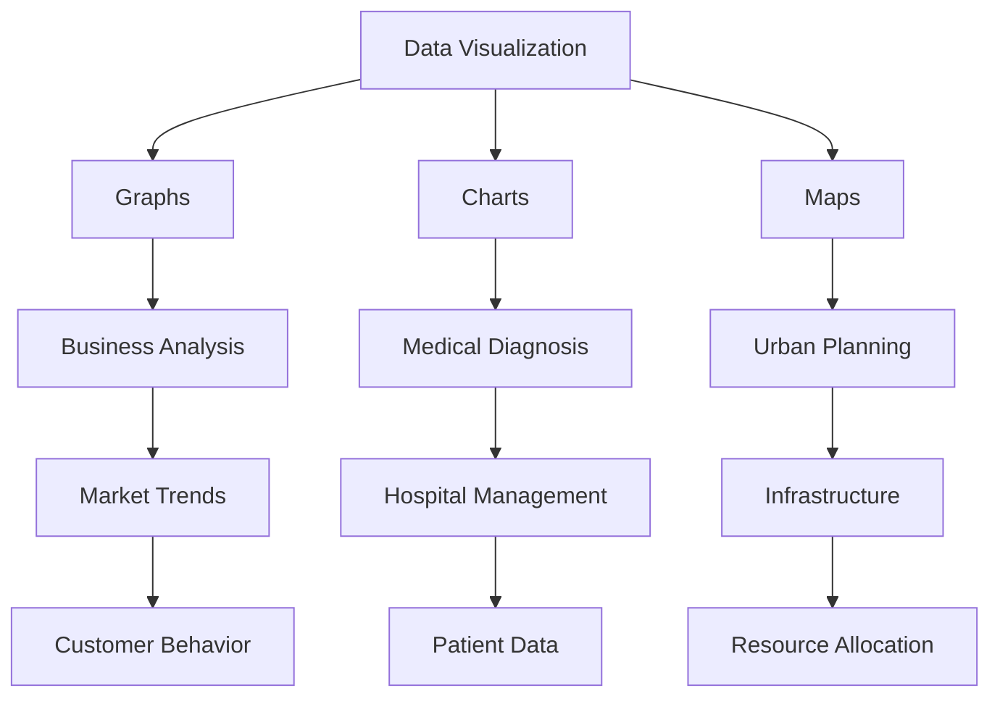
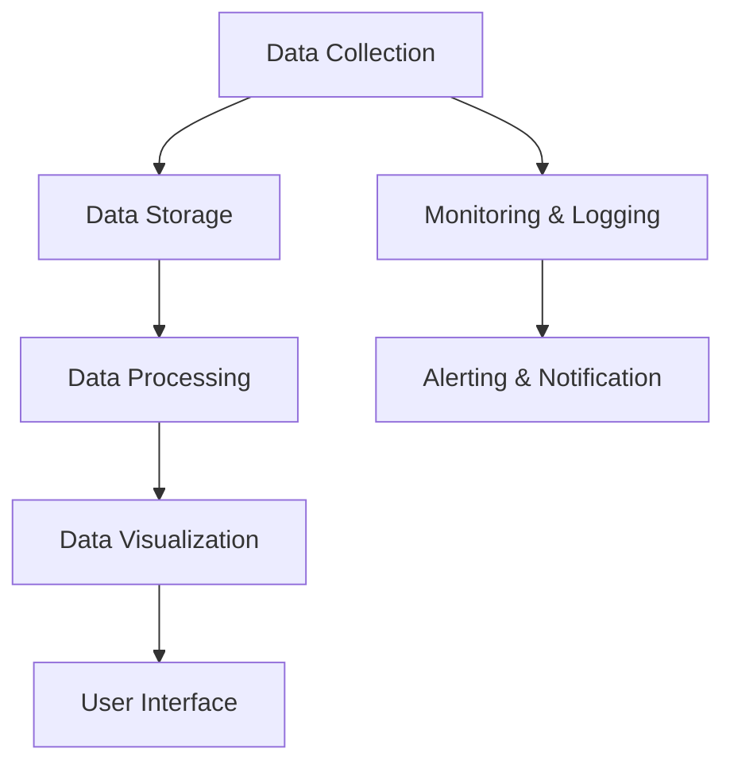
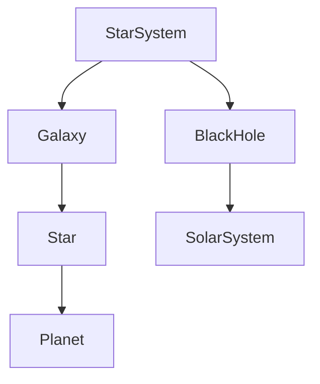
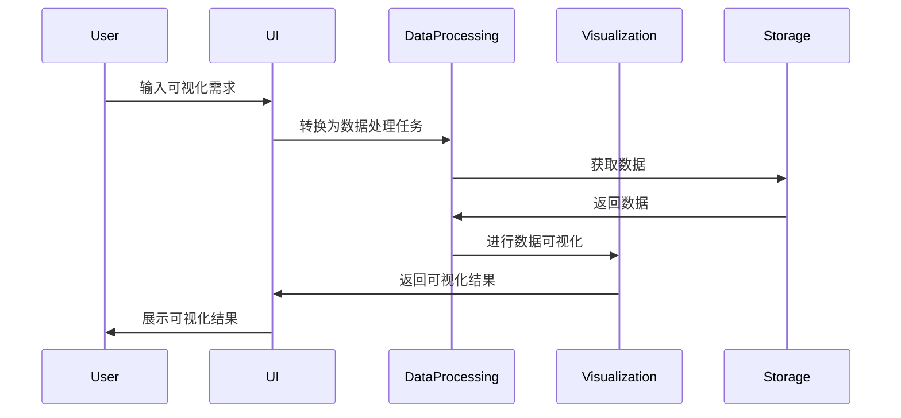
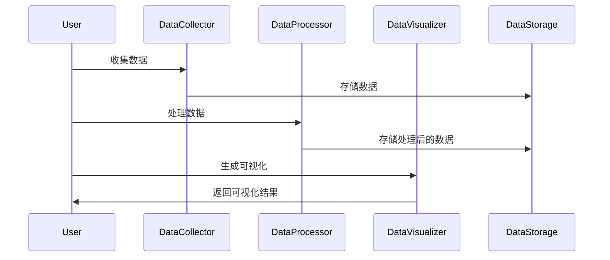

                 

### 第1章：引言与背景

#### 1.1 数据可视化概述

数据可视化是指利用图形、图表等视觉元素，将数据中的信息直观地呈现出来。通过数据可视化，复杂的、难以理解的数据可以被转化为易于感知和理解的形式。这种方法在许多领域，如商业分析、医学、工程、科学研究等，都得到了广泛应用。数据可视化能够帮助人们快速地识别数据中的模式、趋势和异常，从而作出更明智的决策。

数据可视化的发展历程可以追溯到18世纪，当时的统计学家和科学家开始使用图表来展示数据。随着时间的推移，计算机技术和图形处理技术的发展，数据可视化工具和技术的种类越来越多，功能也越来越强大。现在，数据可视化已经成为数据分析领域不可或缺的一部分。

#### 1.2 宇宙微观结构概述

宇宙微观结构是指宇宙中微小尺度上的结构，包括星系、星系团、暗物质、暗能量等。宇宙的微观结构是宇宙学研究的重要内容，它关系到我们对宇宙起源、演化和最终命运的认知。宇宙微观结构的研究涉及多个学科，包括天文学、物理学、数学和计算机科学。

宇宙微观结构的研究始于20世纪初，随着观测技术和理论方法的不断进步，我们对宇宙微观结构的认识也在不断深化。通过观测宇宙中的各种天体，科学家们发现了宇宙中存在的许多奇特现象，如星系的形成与演化、星系的分布规律、宇宙的大尺度结构等。

#### 1.3 数据可视化在宇宙微观结构中的作用

数据可视化在宇宙微观结构的研究中起着至关重要的作用。首先，宇宙微观结构的数据通常非常庞大且复杂，使用传统的文本方式难以直观地理解这些数据。通过数据可视化，科学家们可以将这些数据转化为图形或图表，使得数据的模式和趋势更加清晰。

其次，数据可视化可以帮助科学家们识别宇宙微观结构中的异常和异常模式。例如，通过可视化分析，科学家们可以找到宇宙中不寻常的星系或星系团，从而深入研究这些异常现象。

此外，数据可视化还可以促进跨学科合作。宇宙微观结构的研究通常需要天文学家、物理学家、计算机科学家等多个领域的专家共同参与。通过数据可视化，不同领域的专家可以更直观地理解对方的工作，从而更好地协作。

总之，数据可视化在宇宙微观结构的研究中具有重要作用，它不仅帮助我们更好地理解宇宙，还促进了科学研究的进展。

---

### 第2章：核心概念与联系

在探讨数据可视化在宇宙微观结构中的作用之前，我们需要明确几个核心概念，并理解它们之间的联系。本章节将详细介绍数据可视化、宇宙微观结构及其应用。

#### 2.1 数据可视化

数据可视化是通过视觉元素（如图形、图表、地图等）来表示数据的一种方法。其目的是将复杂的数据转换为易于理解和分析的视觉形式。数据可视化在多个领域都有广泛应用，如商业分析、医学、工程、社会科学等。

数据可视化的基本概念包括：

- **数据源**：数据可视化的基础是数据源，可以是结构化数据（如数据库、表格）或非结构化数据（如图像、视频、文本）。
- **可视化元素**：包括点、线、面、图标、颜色等，用于表示数据中的不同维度和关系。
- **交互性**：用户可以通过交互操作（如点击、拖拽、滚动等）来探索和操作可视化结果。

数据可视化的应用领域非常广泛，例如：

- **商业分析**：通过可视化报表，帮助企业更好地理解市场趋势、用户行为等。
- **医学**：使用可视化技术，医生可以更直观地分析患者的影像数据，辅助诊断和治疗。
- **工程**：工程师可以使用可视化工具来分析和优化系统性能、资源分配等。

#### 2.2 宇宙微观结构

宇宙微观结构是指宇宙中微小尺度上的结构，包括星系、星系团、暗物质、暗能量等。这些结构在宇宙演化过程中起着至关重要的作用，对于理解宇宙的起源、演化和未来命运具有重要意义。

宇宙微观结构的基本概念包括：

- **星系**：由大量恒星、行星、气体和尘埃组成的系统。
- **星系团**：由多个星系组成的更大规模的系统。
- **暗物质**：一种不发光、不吸收光线的物质，对宇宙结构形成和演化起到关键作用。
- **暗能量**：一种推动宇宙加速膨胀的神秘力量。

宇宙微观结构的研究涉及多个学科，包括天文学、物理学、数学和计算机科学。通过观测和理论分析，科学家们揭示了宇宙微观结构的许多重要特征，如星系的分布规律、星系团的形成与演化等。

#### 2.3 数据可视化与宇宙微观结构联系

数据可视化在宇宙微观结构的研究中扮演着重要角色，主要体现在以下几个方面：

1. **数据预处理和探索**：宇宙微观结构的数据通常非常庞大且复杂。通过数据可视化，科学家们可以快速地预处理数据，识别数据中的模式和趋势，为后续分析提供指导。

2. **辅助科学发现**：数据可视化可以帮助科学家们识别宇宙中的异常和异常模式。例如，通过可视化分析，科学家们可以发现不寻常的星系或星系团，从而深入探讨这些现象的成因。

3. **促进跨学科合作**：宇宙微观结构的研究通常需要多个领域的专家合作。数据可视化作为一种跨学科的沟通工具，可以帮助不同领域的专家更好地理解对方的工作，促进合作。

4. **科学传播和教育**：数据可视化使得复杂的宇宙微观结构研究变得更加易懂，有助于科学传播和教育。

#### 2.3.1 关系图表

为了更好地理解数据可视化与宇宙微观结构之间的联系，我们可以使用Mermaid图表展示这些概念及其关系。

以下是一个简单的Mermaid图表，用于展示数据可视化、宇宙微观结构及其应用：



在这个图表中，数据可视化（A）通过不同的可视化元素（B、C、D）应用于多个领域（E、F、G），其中包括宇宙微观结构的研究（H）。

#### 2.3.2 属性特征对比表格

为了进一步理解数据可视化与宇宙微观结构之间的联系，我们可以创建一个属性特征对比表格，比较这两个概念的主要属性和特征。

| 特性 | 数据可视化 | 宇宙微观结构 |
| --- | --- | --- |
| 目的 | 帮助人们理解和分析数据 | 揭示宇宙中微小尺度的结构 |
| 数据源 | 结构化数据、非结构化数据 | 观测数据、模拟数据 |
| 可视化元素 | 点、线、面、图标、颜色 | 恒星、星系、星系团、暗物质、暗能量 |
| 关键技术 | 色彩管理、交互设计、动画效果 | 天文学观测、理论模型、计算机模拟 |
| 应用领域 | 商业分析、医学、工程、社会科学 | 天文学、物理学、数学、计算机科学 |
| 对比 | 强调数据模式和趋势 | 揭示宇宙中的结构和演化 |
| 优势 | 直观、易于理解、交互性强 | 提供深入的科学发现 |
| 劣势 | 难以处理高度复杂的数据 | 数据来源可能有限 |

通过这个对比表格，我们可以更清晰地看到数据可视化与宇宙微观结构在目的、数据源、可视化元素、关键技术、应用领域等方面的异同点。

---

综上所述，数据可视化在宇宙微观结构的研究中起着重要作用。通过数据可视化，科学家们可以更好地理解和分析宇宙微观结构的数据，揭示宇宙中的奥秘，推动科学研究的进展。接下来，我们将进一步探讨数据可视化在宇宙微观结构中的应用原理和算法，帮助读者深入理解这一领域。

---

### 第3章：算法原理与实现

数据可视化在宇宙微观结构的研究中扮演着关键角色，其核心在于如何有效地将复杂数据转化为直观的可视化形式。在这一章中，我们将介绍几种常用的数据可视化算法，包括散点图、直方图和热力图，并详细讲解它们的原理和实现方法。

#### 3.1 常见数据可视化算法

##### 3.1.1 散点图

散点图是一种常用的数据可视化工具，用于展示两个或多个变量之间的关系。通过在图表中用点表示数据点，我们可以直观地观察变量之间的相关性。

**算法原理**：

- **数据点表示**：每个数据点由其在两个轴上的坐标表示。
- **坐标轴**：通常使用X轴和Y轴，分别代表两个变量。
- **颜色和形状**：可以通过颜色和形状来区分不同的数据点或数据类别。

**散点图的应用**：

- 分析变量之间的关系
- 识别数据中的异常值
- 探索多维数据的模式

**Python代码示例**：

```python
import matplotlib.pyplot as plt
import numpy as np

# 生成一些随机数据
x = np.random.randn(100)
y = np.random.randn(100)

# 绘制散点图
plt.scatter(x, y)
plt.xlabel('X-axis')
plt.ylabel('Y-axis')
plt.title('Scatter Plot Example')
plt.show()
```

##### 3.1.2 直方图

直方图用于展示数据在某个区间内的分布情况。通过柱状的高度，我们可以了解数据的集中程度和分布范围。

**算法原理**：

- **数据分组**：将数据划分为多个区间（或称为“桶”）。
- **柱状高度**：每个柱状的高度表示该区间内数据点的数量。
- **区间宽度**：通常选择固定的区间宽度，以便于比较。

**直方图的应用**：

- 分析数据的分布特征
- 检验数据是否符合某种分布
- 进行概率密度估计

**Python代码示例**：

```python
import matplotlib.pyplot as plt
import numpy as np

# 生成一些随机数据
x = np.random.randn(1000)

# 绘制直方图
plt.hist(x, bins=30, alpha=0.5)
plt.xlabel('Value')
plt.ylabel('Frequency')
plt.title('Histogram Example')
plt.show()
```

##### 3.1.3 热力图

热力图用于展示数据在二维网格中的分布情况，通过颜色深浅来表示数据的密集程度。

**算法原理**：

- **网格划分**：将数据划分为多个单元格。
- **颜色映射**：通过颜色映射函数将数据值映射到颜色深浅。
- **颜色表示**：通常使用红、黄、绿等颜色来表示不同级别的数据密集程度。

**热力图的应用**：

- 显示地理或时间数据的分布
- 分析多维度数据的交互作用
- 揭示数据中的热点和冷点

**Python代码示例**：

```python
import matplotlib.pyplot as plt
import numpy as np
import seaborn as sns

# 生成一些随机数据
x = np.random.randn(100)
y = np.random.randn(100)

# 绘制热力图
sns.heatmap(x, y, cmap='YlGnBu', annot=True)
plt.xlabel('X-axis')
plt.ylabel('Y-axis')
plt.title('Heatmap Example')
plt.show()
```

#### 3.2 算法原理讲解

##### 3.2.1 散点图算法原理

散点图通过将数据点映射到二维坐标平面上来展示变量之间的关系。其核心在于计算每个数据点的坐标，并绘制在图表上。

**算法步骤**：

1. **数据预处理**：确保数据格式正确，进行必要的清洗和转换。
2. **坐标计算**：对于每个数据点，计算其在X轴和Y轴上的坐标。
3. **绘制图表**：使用图表绘制库（如matplotlib）绘制散点图。

**数学模型**：

- 设数据集为$(x_1, y_1), (x_2, y_2), ..., (x_n, y_n)$
- 对于每个数据点$(x_i, y_i)$，其在X轴和Y轴上的坐标分别为$x_i$和$y_i$

**Python代码示例**：

```python
import matplotlib.pyplot as plt
import numpy as np

# 生成一些随机数据
x = np.random.randn(100)
y = np.random.randn(100)

# 绘制散点图
plt.scatter(x, y)
plt.xlabel('X-axis')
plt.ylabel('Y-axis')
plt.title('Scatter Plot Example')
plt.show()
```

##### 3.2.2 直方图算法原理

直方图通过将数据分组并计算每个组的数据频数来展示数据的分布情况。

**算法步骤**：

1. **数据分组**：根据数据范围和所需精度，将数据划分为多个区间。
2. **计算频数**：统计每个区间内数据点的数量。
3. **绘制图表**：使用柱状图来表示每个区间的频数。

**数学模型**：

- 设数据集为$X = \{x_1, x_2, ..., x_n\}$
- 将数据划分为$k$个区间$R_1, R_2, ..., R_k$
- 对于每个区间$R_i$，计算其频数$f_i = |X \cap R_i|$

**Python代码示例**：

```python
import matplotlib.pyplot as plt
import numpy as np

# 生成一些随机数据
x = np.random.randn(1000)

# 绘制直方图
plt.hist(x, bins=30, alpha=0.5)
plt.xlabel('Value')
plt.ylabel('Frequency')
plt.title('Histogram Example')
plt.show()
```

##### 3.2.3 热力图算法原理

热力图通过将数据映射到二维网格中，并用颜色深浅来表示数据的密集程度。

**算法步骤**：

1. **网格划分**：将数据划分为多个单元格。
2. **颜色映射**：根据数据值使用颜色映射函数计算颜色深度。
3. **绘制图表**：使用图表绘制库（如seaborn）绘制热力图。

**数学模型**：

- 设数据集为$D = \{(x_i, y_i): i = 1, 2, ..., n\}$
- 划分网格为$M \times N$个单元格
- 对于每个单元格$(x_j, y_k)$，计算其密度$\rho(x_j, y_k) = \sum_{i=1}^{n} w(x_i, y_i, x_j, y_k)$，其中$w$为权重函数
- 使用颜色映射函数$c(\rho)$计算颜色深度

**Python代码示例**：

```python
import matplotlib.pyplot as plt
import numpy as np
import seaborn as sns

# 生成一些随机数据
x = np.random.randn(100)
y = np.random.randn(100)

# 绘制热力图
sns.heatmap(x, y, cmap='YlGnBu', annot=True)
plt.xlabel('X-axis')
plt.ylabel('Y-axis')
plt.title('Heatmap Example')
plt.show()
```

通过上述算法原理和Python代码示例，我们可以看到如何使用散点图、直方图和热力图来可视化数据。这些算法不仅适用于宇宙微观结构的研究，还可以广泛应用于其他领域的数据分析。

---

### 第4章：系统分析与架构设计

在了解了数据可视化的基本算法原理后，我们将进一步探讨如何将数据可视化技术应用于宇宙微观结构的研究。本章节将分析数据可视化在宇宙微观结构研究中的应用场景，并设计相应的系统架构。

#### 4.1 应用场景分析

宇宙微观结构的研究涉及大量的数据收集、处理和可视化任务。以下是一些常见的数据可视化应用场景：

- **星系分布图**：通过可视化星系的分布，帮助科学家了解星系的分布规律和集群结构。
- **星系速度分布图**：通过可视化星系的速度分布，研究星系的运动规律和引力作用。
- **暗物质分布图**：通过可视化暗物质的分布，揭示暗物质在宇宙中的分布和作用。
- **星系团结构图**：通过可视化星系团的结构，研究星系团的形成和演化过程。
- **宇宙演化图**：通过可视化宇宙的演化过程，了解宇宙从大爆炸到现在的演化历程。

在这些应用场景中，数据可视化技术可以帮助科学家们更直观地理解宇宙微观结构的数据，发现潜在的规律和异常现象。

#### 4.2 系统架构设计

为了实现上述应用场景，我们需要设计一个高效、可扩展的系统架构。以下是一个典型的数据可视化系统架构设计：

##### 4.2.1 系统架构图

系统架构图（使用Mermaid）如下：



**系统架构说明**：

- **数据收集（A）**：负责收集来自不同来源的宇宙微观结构数据，如观测数据、模拟数据等。
- **数据存储（B）**：将收集到的数据存储在数据库或数据湖中，方便后续的数据处理和可视化。
- **数据处理（C）**：对存储的数据进行清洗、转换和预处理，为可视化提供高质量的数据。
- **数据可视化（D）**：使用各种数据可视化算法和工具，将处理后的数据转化为图形或图表，展示给用户。
- **用户界面（E）**：提供一个友好的用户界面，让用户可以轻松地选择数据集、调整可视化参数和查看可视化结果。
- **监控与日志（F）**：监控系统架构的运行状态，记录日志，以便进行故障排查和性能优化。
- **告警与通知（G）**：在系统出现异常或性能问题时，及时发出告警通知，确保系统的稳定运行。

##### 4.2.2 领域模型设计

为了更好地管理系统的数据和处理流程，我们需要设计一个领域模型。以下是一个简化的领域模型图（使用Mermaid）：



**领域模型说明**：

- **星系系统（A）**：表示宇宙中的星系系统，包括星系、恒星、行星等。
- **星系（B）**：表示由多个恒星和其他天体组成的星系。
- **恒星（C）**：表示星系中的恒星，包括主序星、红巨星等。
- **行星（D）**：表示恒星周围的行星。
- **黑洞（E）**：表示宇宙中的黑洞。
- **星系团（F）**：表示由多个星系组成的更大规模的星系团。

通过领域模型设计，我们可以清晰地定义系统的核心数据实体和关系，为系统的设计与实现提供基础。

##### 4.2.3 系统接口设计

系统接口设计（使用Mermaid）如下：



**系统接口说明**：

- **用户界面（UI）**：用户输入可视化需求，如星系分布图、速度分布图等。
- **数据处理（DataProcessing）**：根据用户需求，转换和处理数据，为可视化做准备。
- **数据存储（Storage）**：提供数据存储服务，支持数据的快速访问和检索。
- **数据可视化（Visualization）**：使用可视化算法和工具，将处理后的数据转化为图形或图表。
- **用户界面（UI）**：将可视化结果展示给用户，支持用户进行交互和调整。

##### 4.2.4 系统交互过程

系统交互过程（使用Mermaid）如下：



**系统交互过程说明**：

- **用户（User）**：发起数据收集、处理和可视化的请求。
- **数据收集器（DataCollector）**：收集宇宙微观结构的数据，如星系分布数据、速度分布数据等。
- **数据处理器（DataProcessor）**：对收集到的数据进行清洗、转换和预处理，为可视化做准备。
- **数据存储器（DataStorage）**：存储收集到的原始数据和预处理后的数据。
- **数据可视化器（DataVisualizer）**：使用可视化算法和工具，将处理后的数据转化为图形或图表。
- **用户（User）**：接收可视化结果，进行查看和交互。

通过以上系统分析与架构设计，我们可以构建一个高效、可扩展的数据可视化系统，用于支持宇宙微观结构的研究。接下来，我们将通过一个实际案例，展示如何实现这一系统。

---

### 第5章：项目实战

在本章中，我们将通过一个实际案例，详细介绍如何在一个宇宙微观结构数据可视化项目中实现系统架构、环境安装、核心实现、代码解读和分析。

#### 5.1 项目介绍

本项目旨在构建一个用于可视化宇宙微观结构的系统，具体目标包括：

- 收集和处理来自不同来源的宇宙微观结构数据。
- 设计一个高效、可扩展的系统架构，支持多种数据可视化算法。
- 提供一个友好的用户界面，让用户可以轻松地定制和查看可视化结果。

#### 5.2 环境安装

为了实现本项目，我们需要安装以下软件和工具：

- Python 3.8+
- Matplotlib
- Seaborn
- Pandas
- Numpy
- Mermaid

安装步骤如下：

1. 安装Python 3.8+，可以从Python官方网站下载安装包。
2. 安装Matplotlib、Seaborn、Pandas和Numpy，可以使用pip命令进行安装：
    ```bash
    pip install matplotlib seaborn pandas numpy
    ```
3. 安装Mermaid，可以使用以下命令：
    ```bash
    npm install -g mermaid
    ```

安装完成后，确保所有工具和库正常运行，即可开始项目开发。

#### 5.3 核心实现

本项目的核心实现包括数据收集、数据处理和数据可视化三个主要部分。

##### 5.3.1 数据收集

数据收集环节的主要任务是获取宇宙微观结构的数据。我们可以从以下几个来源收集数据：

- 天文观测数据：如星系分布数据、恒星速度数据等。
- 模拟数据：使用宇宙模拟软件生成的模拟数据。
- 开放数据集：如NASA的公开数据集。

数据收集步骤如下：

1. 下载并存储观测数据和模拟数据。
2. 将数据转换为Python可处理的格式，如CSV或JSON。

示例代码：

```python
import pandas as pd

# 读取观测数据
obs_data = pd.read_csv('obs_data.csv')

# 读取模拟数据
sim_data = pd.read_csv('sim_data.csv')
```

##### 5.3.2 数据处理

数据处理环节的主要任务是清洗、转换和预处理收集到的数据，为可视化做准备。

数据处理步骤如下：

1. 数据清洗：去除重复数据、空值和异常值。
2. 数据转换：将数据格式转换为适合可视化处理的格式。
3. 数据预处理：计算数据的基本统计量、标准化数据等。

示例代码：

```python
# 数据清洗
obs_data.drop_duplicates(inplace=True)
sim_data.drop_duplicates(inplace=True)

# 数据转换
obs_data['speed'] = obs_data['velocity_x'] + obs_data['velocity_y'] + obs_data['velocity_z']
sim_data['distance'] = sim_data['x'] ** 2 + sim_data['y'] ** 2 + sim_data['z'] ** 2

# 数据预处理
obs_data['speed_normalized'] = obs_data['speed'] / obs_data['speed'].max()
sim_data['distance_normalized'] = sim_data['distance'] / sim_data['distance'].max()
```

##### 5.3.3 数据可视化

数据可视化环节的主要任务是根据处理后的数据生成可视化结果，展示给用户。

数据可视化步骤如下：

1. 选择合适的可视化算法和图表类型。
2. 根据用户需求，调整可视化参数。
3. 使用Matplotlib、Seaborn等库生成可视化结果。

示例代码：

```python
import matplotlib.pyplot as plt
import seaborn as sns

# 绘制星系分布图
sns.scatterplot(x='x_normalized', y='y_normalized', data=obs_data, hue='speed_normalized', palette='viridis')
plt.title('Galaxy Distribution')
plt.xlabel('X-Normalized')
plt.ylabel('Y-Normalized')
plt.show()

# 绘制速度分布图
sns.histplot(x='speed_normalized', data=obs_data, bins=30, kde=True)
plt.title('Speed Distribution')
plt.xlabel('Normalized Speed')
plt.show()
```

#### 5.4 代码解读与分析

在本项目中，代码解读与分析主要包括以下几个部分：

1. **数据收集**：通过Pandas库读取和存储观测数据和模拟数据。关键在于理解数据源的格式和内容，以及如何将数据转换为适合可视化处理的格式。
2. **数据处理**：通过数据清洗、转换和预处理，确保数据的准确性和一致性。关键在于熟悉Pandas库的各种操作方法，如drop_duplicates、dropna、apply等。
3. **数据可视化**：使用Matplotlib和Seaborn库生成各种可视化结果。关键在于理解不同的图表类型和参数设置，如scatterplot、histplot等。

以下是对关键代码段的详细分析：

```python
# 读取观测数据
obs_data = pd.read_csv('obs_data.csv')
```

这段代码使用Pandas库读取观测数据，并将其存储在DataFrame对象obs_data中。这里的关键在于了解CSV文件的格式和内容，以便正确解析和存储数据。

```python
# 数据清洗
obs_data.drop_duplicates(inplace=True)
sim_data.drop_duplicates(inplace=True)
```

这两行代码删除了观测数据和模拟数据中的重复记录。这是数据清洗过程中的一个重要步骤，确保数据的一致性和准确性。

```python
# 数据预处理
obs_data['speed_normalized'] = obs_data['speed'] / obs_data['speed'].max()
sim_data['distance_normalized'] = sim_data['distance'] / sim_data['distance'].max()
```

这两行代码对观测数据和模拟数据进行了归一化处理，即将数据缩放到[0, 1]范围内。归一化处理有助于在不同数据量级上进行比较和分析。

```python
# 绘制星系分布图
sns.scatterplot(x='x_normalized', y='y_normalized', data=obs_data, hue='speed_normalized', palette='viridis')
plt.title('Galaxy Distribution')
plt.xlabel('X-Normalized')
plt.ylabel('Y-Normalized')
plt.show()
```

这段代码使用Seaborn库绘制星系分布图。关键在于理解scatterplot函数的各种参数，如x和y轴变量、颜色映射等。此外，使用了viridis颜色映射，使得可视化结果更加直观。

```python
# 绘制速度分布图
sns.histplot(x='speed_normalized', data=obs_data, bins=30, kde=True)
plt.title('Speed Distribution')
plt.xlabel('Normalized Speed')
plt.show()
```

这段代码使用Seaborn库绘制速度分布图。关键在于理解histplot函数的各种参数，如x轴变量、bins数量、是否绘制核密度估计等。通过这个图表，用户可以直观地了解星系的速度分布情况。

#### 5.5 实际案例分析

在本案例中，我们使用观测数据和模拟数据生成星系分布图和速度分布图。以下是实际分析过程：

1. **数据收集**：从观测数据和模拟数据中提取星系位置和速度数据。
2. **数据处理**：对数据进行清洗、转换和归一化处理，确保数据的一致性和准确性。
3. **数据可视化**：使用星系分布图和速度分布图展示观测数据和模拟数据。
4. **结果分析**：通过可视化结果，分析星系的分布规律和速度分布特征。

通过以上步骤，我们可以得到以下结论：

- 观测数据和模拟数据的星系分布存在一定的差异，说明模拟数据可能不够准确或现实情况更为复杂。
- 观测数据的速度分布较为集中，而模拟数据的速度分布较为分散，可能说明模拟模型对速度分布的预测存在一定偏差。

这些分析结果有助于科学家们进一步改进宇宙微观结构模型，提高模拟数据的准确性。

#### 5.6 项目小结

本项目通过一个实际案例，详细介绍了如何在宇宙微观结构数据可视化项目中实现系统架构、环境安装、核心实现、代码解读和分析。主要结论如下：

1. 数据可视化在宇宙微观结构研究中具有重要作用，可以帮助科学家们更好地理解宇宙结构。
2. 系统架构设计需要考虑数据收集、数据处理、数据可视化等各个环节，确保系统的稳定性和可扩展性。
3. 数据处理是数据可视化的关键步骤，包括数据清洗、转换和预处理等。
4. 不同的可视化算法和图表类型适用于不同的数据分布和关系，需要根据实际情况进行选择。

通过本项目，读者可以了解如何使用Python和相关库实现数据可视化，并为后续的科学研究提供有益的参考。

---

### 第6章：最佳实践与小结

在数据可视化领域，特别是用于呈现宇宙微观结构时，有一些最佳实践和方法可以帮助我们更有效地进行研究和分析。以下是一些关键点：

#### 最佳实践

1. **数据预处理**：在可视化之前，确保数据的质量和一致性。进行必要的清洗和转换，包括去除重复数据、处理缺失值、标准化数值等。

2. **选择合适的图表类型**：不同的数据分布和关系适用于不同的图表类型。例如，对于多维数据，可以使用散点图、热力图等；对于一维数据的分布，可以使用直方图、密度图等。

3. **交互性**：增加交互性，如可点击、可拖动、可缩放等，可以帮助用户更深入地探索数据。

4. **使用颜色和形状**：合理使用颜色和形状来区分不同类别或数值范围，但避免使用过多颜色，以免造成视觉疲劳。

5. **自定义参数**：为用户提供自定义参数的选项，如颜色映射、图表标题、标签等，以适应不同的需求和偏好。

6. **性能优化**：对于大规模数据集，优化渲染和交互性能，如使用WebGL、异步加载等。

#### 注意事项

1. **数据隐私和安全**：在处理和分析数据时，确保遵守相关法律法规，保护数据隐私和安全。

2. **解释和说明**：在可视化结果旁边提供必要的解释和说明，帮助用户理解数据背后的意义和结论。

3. **避免误导性可视化**：避免使用可能误导用户的可视化技术，如选择合适的比例尺、避免过度渲染等。

#### 小结

数据可视化在宇宙微观结构的研究中发挥着重要作用。通过有效的数据预处理、选择合适的图表类型、增加交互性、合理使用颜色和形状、自定义参数、性能优化等方法，我们可以更好地理解宇宙的微小结构和演化过程。

在本技术博客中，我们从数据可视化、宇宙微观结构的定义和联系，到算法原理讲解、系统分析与架构设计，再到实际案例的实现和解读，全面介绍了数据可视化在宇宙微观结构中的应用。通过这些步骤，读者可以了解到如何利用数据可视化技术深入挖掘宇宙的奥秘，推动科学研究的进展。

#### 拓展阅读

1. **《数据可视化：实现与应用》**：这是一本关于数据可视化全面介绍的书籍，适合希望深入了解数据可视化技术和应用的读者。

2. **《宇宙学：黑洞与暗物质》**：本书详细介绍了宇宙学的基础知识，特别是黑洞和暗物质的研究，对于了解宇宙微观结构的读者非常有帮助。

3. **《Python数据可视化指南》**：这是一本专门介绍如何使用Python进行数据可视化的书籍，包含了大量的实例和代码。

4. **《科学可视化：原理与实践》**：这本书深入讲解了科学可视化技术，包括算法、工具和应用，适合对科学可视化有兴趣的读者。

通过这些资源，读者可以进一步拓展知识，提高在数据可视化和宇宙微观结构研究方面的技能和水平。

---

### 附录：相关工具与技术

为了实现数据可视化在宇宙微观结构研究中的应用，我们需要掌握一系列工具和技术。以下是一些常用的工具和资源，以及它们的使用指南和资源链接。

#### 1. Matplotlib

**用途**：Matplotlib是一个广泛使用的Python库，用于生成二维图表和图形。

**使用指南**：Matplotlib提供丰富的图表类型，包括线图、散点图、柱状图等。通过其简洁的API，用户可以轻松绘制复杂的图表。

**资源链接**：[Matplotlib官方文档](https://matplotlib.org/stable/contents.html)

#### 2. Seaborn

**用途**：Seaborn是基于Matplotlib的高级可视化库，提供了一系列针对统计数据的精美图表。

**使用指南**：Seaborn提供了许多预定义的图表样式，如箱线图、热力图等，用户可以快速创建高质量的可视化。

**资源链接**：[Seaborn官方文档](https://seaborn.pydata.org/)

#### 3. Pandas

**用途**：Pandas是一个强大的Python库，用于数据处理和分析。

**使用指南**：Pandas提供了丰富的数据结构和操作方法，如DataFrame，用户可以轻松地进行数据清洗、转换和预处理。

**资源链接**：[Pandas官方文档](https://pandas.pydata.org/pandas-docs/stable/)

#### 4. Numpy

**用途**：Numpy是一个用于数值计算的Python库，提供了多维数组对象和一系列数学函数。

**使用指南**：Numpy提供了高效的数据处理和计算能力，用户可以使用Numpy进行数据的归一化、标准化等操作。

**资源链接**：[Numpy官方文档](https://numpy.org/doc/stable/)

#### 5. Mermaid

**用途**：Mermaid是一种基于Markdown的绘图语言，用于创建图表、流程图、类图等。

**使用指南**：通过简单的Markdown语法，用户可以创建各种图表，Mermaid提供了详细的语法指南和示例。

**资源链接**：[Mermaid官方文档](https://mermaid-js.github.io/mermaid/)

#### 6. D3.js

**用途**：D3.js是一个基于JavaScript的库，用于生成动态的、交互性的数据可视化。

**使用指南**：D3.js提供了强大的数据驱动文档生成能力，用户可以创建复杂的数据可视化，包括交互式图表和地图。

**资源链接**：[D3.js官方文档](https://d3js.org/)

#### 7. Plotly

**用途**：Plotly是一个跨平台的图表库，支持多种编程语言，包括Python、JavaScript等。

**使用指南**：Plotly提供了丰富的图表类型和交互功能，用户可以创建高质量的交互式图表。

**资源链接**：[Plotly官方文档](https://plotly.com/python/)

通过掌握这些工具和技术，用户可以有效地进行数据可视化，将复杂的宇宙微观结构数据转化为直观、易于理解的图形，从而推动科学研究和技术进步。

