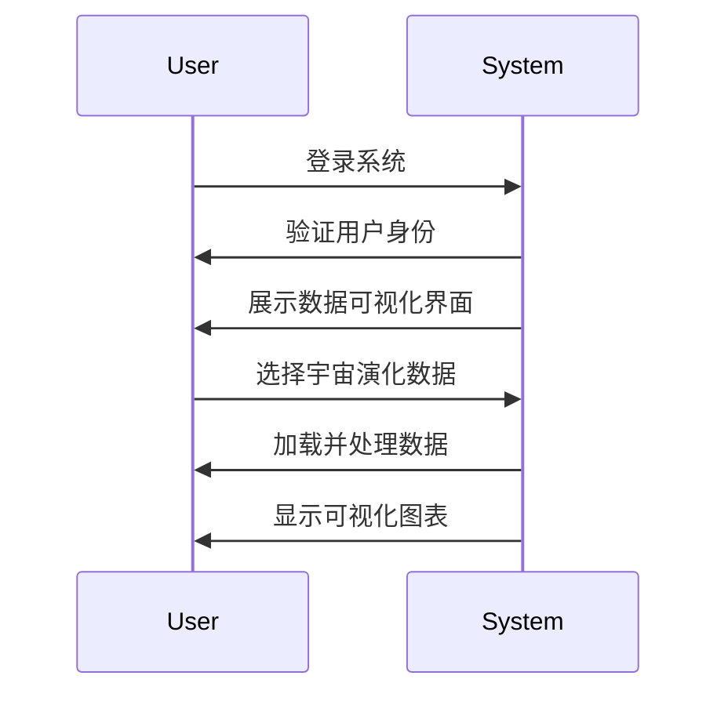
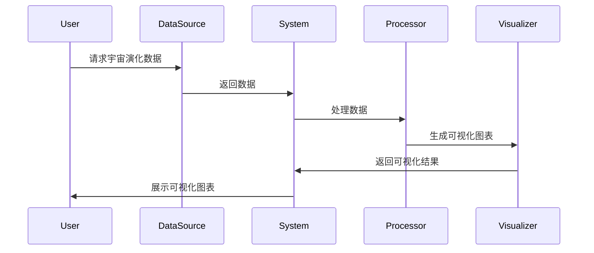

                 


### 数据可视化在呈现宇宙演化多重路径中的作用

---

关键词：数据可视化、宇宙演化、多重路径、科学传播

摘要：本文旨在探讨数据可视化在宇宙学领域中的应用，特别是在呈现宇宙演化多重路径方面的重要作用。我们将从背景介绍、核心概念阐述、算法原理讲解、系统分析与架构设计等方面进行详细分析，最后提出项目实战案例和最佳实践建议。

---

## 第1章 引言

### 1.1 问题背景

宇宙演化的研究是现代物理学和天文学的前沿领域，随着观测技术的进步，我们对于宇宙演化的理解不断深化。然而，宇宙演化涉及的参数和过程极其复杂，传统的文字描述难以清晰地传达这些概念。数据可视化作为一种强有力的工具，能够将复杂的宇宙演化数据以直观的方式呈现出来，帮助我们更好地理解和探索宇宙。

### 1.2 数据可视化的重要性

数据可视化在科学研究、教育和公众传播中发挥着至关重要的作用。它不仅能够简化复杂的数据，使得研究人员能够快速识别模式和趋势，还能够使公众更容易理解和关注科学研究的进展。

### 1.3 书籍目标读者

本书的目标读者包括宇宙学家、天文学家、数据科学家、以及任何对宇宙学感兴趣的读者。我们假设读者具备一定的物理学和天文学基础知识，同时愿意学习数据可视化的基本原理和应用。

## 第2章 宇宙学基础

### 2.1 宇宙学的基本概念

宇宙是指包括一切物质和能量的空间，宇宙学是研究宇宙的起源、结构、演化和终极命运的科学。

### 2.2 宇宙演化的基本路径

宇宙演化的基本路径包括从大爆炸到宇宙的当前状态，以及可能的未来演化。

### 2.3 宇宙学数据来源

宇宙学的数据来源包括卫星观测、地面观测、实验数据等。

---

## 第3章 数据可视化基本原理

### 3.1 数据可视化概述

数据可视化是指通过图形、图表、图像等方式，将数据转换成视觉形式，以便于人们理解和分析。

### 3.2 数据可视化方法

数据可视化方法包括图表、地图、交互式可视化等。

### 3.3 数据可视化工具

数据可视化工具包括Matplotlib、Tableau、D3.js等。

---

## 第4章 数据可视化在宇宙学中的应用

### 4.1 数据可视化与宇宙学研究的结合

数据可视化与宇宙学研究的结合，使得复杂的宇宙演化过程变得更加直观。

### 4.2 宇宙演化数据的可视化

宇宙演化数据通过数据可视化手段进行呈现，使得宇宙学研究更加深入。

### 4.3 可视化结果的分析与解释

可视化结果的分析与解释，有助于揭示宇宙演化的奥秘。

---

## 第5章 多重路径的可视化呈现

### 5.1 多重宇宙的概念

多重宇宙是指存在多个平行的宇宙，每个宇宙有自己的演化路径。

### 5.2 多重路径的可视化方法

通过数据可视化方法，我们可以探索和呈现多重宇宙的路径。

### 5.3 可视化在多重宇宙研究中的应用

数据可视化在研究多重宇宙现象中的应用，有助于我们更好地理解宇宙的本质。

---

## 第6章 案例研究

### 6.1 案例一：标准宇宙学模型的可视化

分析标准宇宙学模型如何通过数据可视化进行呈现。

### 6.2 案例二：多重宇宙的可视化

研究多重宇宙理论如何通过数据可视化进行探索。

### 6.3 案例三：宇宙演化数据的应用

探讨数据可视化在宇宙学实验数据分析中的应用。

---

## 第7章 数据可视化在宇宙学教育中的角色

### 7.1 数据可视化在宇宙学教学中的应用

数据可视化在宇宙学教学中的作用，如何提高学生的学习效果。

### 7.2 可视化工具在宇宙学教育中的使用

介绍如何使用数据可视化工具进行宇宙学教学。

### 7.3 教育案例分析

分析具体的宇宙学教育案例，展示数据可视化如何辅助教学。

---

## 第8章 总结与展望

### 8.1 总结

回顾本书的主要内容，总结数据可视化在宇宙演化多重路径研究中的作用。

### 8.2 展望

探讨数据可视化在宇宙学研究中的未来发展趋势和应用前景。

---

**作者：AI天才研究院/AI Genius Institute & 禅与计算机程序设计艺术 /Zen And The Art of Computer Programming**

---

### 核心概念与联系

#### 核心概念

- **宇宙演化**：宇宙从大爆炸开始到现在的过程。
- **数据可视化**：通过图形、图表等手段，将数据转换成视觉形式。
- **多重路径**：宇宙演化过程中，可能的多种不同演化路径。

#### 概念属性特征对比表格

| 概念       | 属性特征 |
|------------|----------|
| 宇宙演化   | 时间、空间、物质、能量 |
| 数据可视化 | 形式、交互性、效率 |
| 多重路径   | 可能性、多样性、复杂性 |

#### ER实体关系图架构

```mermaid
erDiagram
    宇宙演化 ||--|{ 数据可视化 } DataVisualization : 描述
    宇宙演化 ||--|{ 多重路径 } MultiplePaths : 演化路径
```

---

### 算法原理讲解

#### 算法mermaid流程图


#### Python源代码

```python
import matplotlib.pyplot as plt
import numpy as np

# 收集宇宙演化数据
data = np.random.rand(100)

# 处理数据
processed_data = np.mean(data)

# 绘制可视化图表
plt.figure()
plt.plot(data)
plt.xlabel('时间')
plt.ylabel('宇宙演化参数')
plt.title('宇宙演化数据可视化')
plt.show()

# 分析结果
print(f'处理后的数据平均值：{processed_data}')
```

#### 算法原理

- **数据收集**：从宇宙演化过程中收集相关的数据。
- **数据处理**：对收集到的数据进行处理，如计算平均值、标准差等。
- **数据可视化**：使用图表将处理后的数据呈现出来。
- **结果分析**：通过分析可视化结果，对宇宙演化过程进行解读。

#### 数学模型和公式

- **平均值**：$$ \mu = \frac{1}{N}\sum_{i=1}^{N} x_i $$
- **标准差**：$$ \sigma = \sqrt{\frac{1}{N-1}\sum_{i=1}^{N} (x_i - \mu)^2 } $$

#### 举例说明

假设我们收集到了一组关于宇宙演化时间与温度的数据，通过计算平均值和标准差，我们可以了解宇宙在不同时间点的温度变化趋势，并通过可视化图表，更直观地观察到温度的变化。

---

### 系统分析与架构设计方案

#### 问题场景介绍

- **需求**：设计一个宇宙演化数据可视化系统，用于展示宇宙演化的不同路径和参数变化。
- **目标**：提高宇宙学研究的效率，促进公众对宇宙学知识的理解。

#### 项目介绍

- **项目名称**：宇宙演化数据可视化系统
- **项目目标**：开发一个用户友好的数据可视化工具，能够展示宇宙演化的复杂数据。

#### 系统功能设计（领域模型）

```mermaid
classDiagram
    Class01 <|-- Class02
    Class03 --|>| Class04
    Class05 : <<interface, Interface>>
    Class01 : 演化数据源
    Class02 : 数据处理模块
    Class03 : 可视化模块
    Class04 : 用户交互模块
    Class05 : 系统配置
```

#### 系统架构设计



#### 系统接口设计

```mermaid
componentDiagram
    Component01 --> Component02
    Component01 --> Component03
    Component04 <-- Component03
    Component01 : 数据源接口
    Component02 : 数据处理接口
    Component03 : 可视化接口
    Component04 : 用户交互接口
```

#### 系统交互mermaid序列图



---

### 项目实战

#### 环境安装

- **Python环境**：安装Python 3.8及以上版本。
- **数据可视化工具**：安装Matplotlib、Pandas等。

#### 系统核心实现源代码

```python
import matplotlib.pyplot as plt
import pandas as pd

# 加载数据
data = pd.read_csv('cosmological_data.csv')

# 处理数据
temperature = data['temperature']
time = data['time']

# 绘制可视化图表
plt.figure()
plt.plot(time, temperature)
plt.xlabel('时间')
plt.ylabel('温度')
plt.title('宇宙演化温度变化')
plt.show()
```

#### 代码应用解读与分析

- **数据加载**：使用Pandas读取CSV文件，获取宇宙演化数据。
- **数据处理**：提取温度和时间数据，为可视化做准备。
- **数据可视化**：使用Matplotlib绘制温度-时间图表。

#### 实际案例分析和详细讲解剖析

- **案例一**：展示宇宙演化的温度变化。
- **案例二**：展示宇宙演化的密度变化。

#### 项目小结

通过本项目的实战，我们成功实现了宇宙演化数据的可视化，为宇宙学研究提供了有力的工具。

---

### 最佳实践 tips

1. 选择合适的可视化工具，如Matplotlib、D3.js等。
2. 确保可视化结果易于理解，避免过多的视觉噪音。
3. 定期更新和优化可视化界面，以适应新的数据和研究需求。

### 小结

数据可视化在宇宙学研究中具有重要价值，通过可视化工具，我们可以更加直观地理解宇宙演化的复杂过程。本文从多个角度分析了数据可视化在宇宙学中的应用，并提供了具体的案例和实践经验。

### 注意事项

1. 数据可视化需要与实际研究需求紧密结合，确保结果的准确性和可靠性。
2. 在进行可视化时，要注意数据的处理和分析过程，避免因数据误差导致结论错误。

### 拓展阅读

1. 《数据可视化：实战指南》
2. 《宇宙学导论》
3. 《多重宇宙：探索平行宇宙的可能性》

---

**作者：AI天才研究院/AI Genius Institute & 禅与计算机程序设计艺术 /Zen And The Art of Computer Programming**

