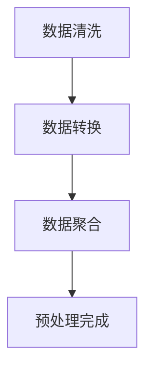
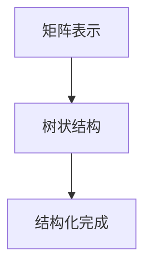
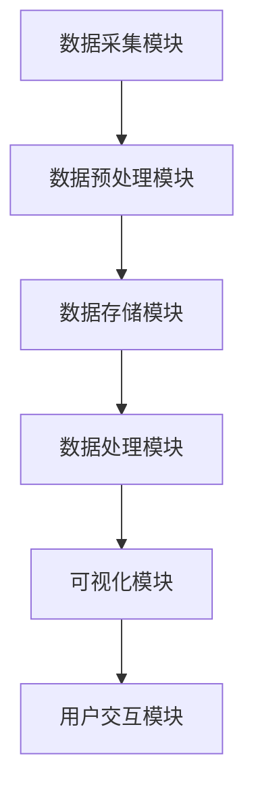
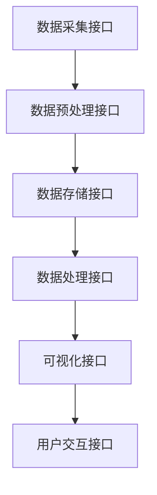

                 


# 数据可视化技术在宇宙探索中的应用

## 关键词
- 数据可视化
- 宇宙探索
- 天文学数据
- 数据分析
- 算法
- 数学模型
- 系统架构

## 摘要
本文将探讨数据可视化技术在宇宙探索中的应用，首先介绍宇宙探索中的数据类型与挑战，接着阐述数据可视化技术的基础概念及其在科学领域的应用。随后，我们将深入分析天文学数据可视化算法的原理、数学模型以及其实际应用。此外，本文还将介绍一个宇宙探索数据可视化系统的设计与实现，并从项目实战和案例分析中总结最佳实践与注意事项。最后，我们将提供拓展阅读资源，为读者进一步探索该领域提供指导。

### 目录

1. **引言** <a id="introduction"></a>
   1.1 宇宙探索中的数据类型与挑战
   1.2 数据可视化技术在宇宙探索中的作用
   1.3 本书结构概述

2. **数据可视化技术概述** <a id="overview"></a>
   2.1 数据可视化基础
   2.2 数据可视化在科学领域的应用
   2.3 数据可视化工具与技术

3. **数据可视化技术在宇宙探索中的应用** <a id="application"></a>
   3.1 天文学数据可视化
   3.2 天文学领域的数据可视化应用

4. **算法原理讲解** <a id="algorithm"></a>
   4.1 数据可视化算法原理
   4.2 数学模型和数学公式

5. **系统分析与架构设计方案** <a id="system_design"></a>
   5.1 系统需求分析
   5.2 系统架构设计
   5.3 系统接口设计

6. **项目实战** <a id="project_practice"></a>
   6.1 项目介绍
   6.2 系统核心实现源代码
   6.3 代码应用解读与分析

7. **案例分析** <a id="case_study"></a>
   7.1 案例一：天文学数据可视化系统
   7.2 案例二：行星探索数据可视化
   7.3 案例三：星系演化可视化

8. **最佳实践与拓展** <a id="best_practices"></a>
   8.1 数据可视化技术最佳实践
   8.2 宇宙探索数据可视化最佳实践
   8.3 注意事项与拓展阅读

### 引言

宇宙探索是一个充满挑战且不断进步的领域。从早期的望远镜观测到现代的卫星和探测器，人类对宇宙的认知不断深化。然而，随着探测技术的进步，宇宙探索中产生的数据量也急剧增加，这使得数据管理和分析成为一大难题。数据可视化技术作为一种有效的数据分析工具，其在宇宙探索中的应用日益受到重视。

### 1.1 宇宙探索中的数据类型与挑战

宇宙探索涉及多种类型的数据，包括：

- **观测数据**：来自望远镜、卫星和其他探测器的观测数据，如光谱数据、图像数据和位置数据。
- **物理数据**：涉及宇宙大尺度结构的物理量，如星系密度、温度和速度分布。
- **化学数据**：宇宙中各种元素的丰度、同位素分布等。
- **时间序列数据**：宇宙演化过程中的时间序列数据，如星系形成和演化历史。

这些数据具有以下挑战：

- **数据量大**：宇宙探索数据量巨大，传统数据处理方法难以应对。
- **多维数据**：宇宙数据往往包含多个维度，如时间、空间和光谱。
- **复杂度**：宇宙数据通常包含复杂的关系和模式，需要高效的算法进行分析。
- **实时性**：对于一些实时探测任务，数据可视化需要快速响应。

### 1.2 数据可视化技术在宇宙探索中的作用

数据可视化技术在宇宙探索中扮演着关键角色，其作用主要体现在以下几个方面：

- **数据探索与发现**：数据可视化帮助科学家快速识别数据中的异常和模式，从而发现新的宇宙现象。
- **数据解释**：通过图形化的方式，数据可视化使得复杂的宇宙数据变得直观易懂，有助于科学家更好地理解数据。
- **协作与交流**：数据可视化工具使得宇宙探索项目的团队成员能够更好地协作，并通过图形化结果进行有效的交流。
- **决策支持**：数据可视化提供了直观的决策支持，帮助科学家在宇宙探测任务中做出更好的决策。

### 1.3 本书结构概述

本文将分为六个部分：

- **第一部分：引言**：介绍宇宙探索中的数据类型与挑战，以及数据可视化技术的作用。
- **第二部分：数据可视化技术概述**：阐述数据可视化技术的基础概念和工具。
- **第三部分：数据可视化技术在宇宙探索中的应用**：分析天文学数据可视化的具体应用。
- **第四部分：算法原理讲解**：介绍数据可视化算法的原理和数学模型。
- **第五部分：系统设计与实现**：讨论宇宙探索数据可视化系统的设计、实现与部署。
- **第六部分：最佳实践与拓展**：总结最佳实践，并提供拓展阅读资源。

接下来，我们将详细探讨数据可视化技术在宇宙探索中的应用，从基础概念到具体实现，逐步深入。

---

### 数据可视化技术概述

数据可视化是一种通过图形、图像和交互式界面来呈现和分析数据的方法，它能够将复杂的数据转换为易于理解和解释的视觉形式。在宇宙探索中，数据可视化技术尤为重要，因为它能够帮助科学家快速识别数据中的关键信息，发现潜在的宇宙现象，从而推动科学发现。

#### 2.1 数据可视化基础

数据可视化技术的基础包括以下几个方面：

- **数据类型**：数据可视化能够处理不同类型的数据，如数值数据、文本数据、图像数据和时间序列数据。
- **可视化图表**：常见的可视化图表包括折线图、柱状图、饼图、散点图和地图等。
- **交互性**：交互性是数据可视化的重要特征，通过用户与可视化界面的互动，可以更深入地探索数据。
- **色彩心理学**：色彩在数据可视化中起着关键作用，合理的色彩使用能够增强数据的表现力和可读性。

#### 2.2 数据可视化在科学领域的应用

数据可视化不仅在商业和分析领域有广泛应用，在科学领域，特别是宇宙探索中，也发挥了重要作用：

- **生物信息学**：用于基因序列分析、蛋白质结构和代谢路径的展示。
- **天文学**：用于观测数据的空间分布、星系演化历史和行星特征的可视化。
- **环境科学**：用于气候变化、空气质量监测和生态系统的动态可视化。
- **物理科学**：用于粒子物理实验数据、天文观测和地球物理数据的可视化。

#### 2.3 数据可视化工具与技术

现代数据可视化技术包含了多种工具和框架，以下是一些常用的工具和框架：

- **D3.js**：一个强大的数据驱动文档生成库，用于创建动态的、交互式的数据可视化。
- **Bokeh**：一个基于Python的可视化库，适用于创建交互式的网页可视化。
- **Plotly**：一个用于创建交互式图表的库，支持多种编程语言，如Python、R和Julia。
- **Tableau**：一个广泛使用的商业数据可视化工具，支持多种数据源和丰富的可视化图表。

这些工具和技术为科学家提供了强大的数据可视化能力，使得宇宙探索中的数据能够以更直观、更易于理解的方式呈现。

### 数据可视化技术在宇宙探索中的应用

宇宙探索中产生的数据量庞大且复杂，如何有效地处理和分析这些数据是一个巨大的挑战。数据可视化技术通过将数据转换成图形和图像，极大地提高了数据分析的效率。下面我们将探讨数据可视化在宇宙探索中的具体应用。

#### 3.1 天文学数据可视化

天文学数据可视化是宇宙探索中最重要的应用之一。以下是一些天文学数据可视化的实例：

- **星系分布图**：通过可视化星系的分布，科学家可以了解宇宙的大尺度结构，如星系的聚集和分布。
- **光谱可视化**：光谱数据展示了恒星和星系的光谱特征，通过光谱可视化，科学家可以分析星体的成分、温度和运动状态。
- **行星轨道图**：行星轨道的可视化帮助科学家研究行星的轨道动力学，预测行星的未来位置。
- **恒星演化图**：恒星演化图展示了恒星从诞生到死亡的整个过程，通过可视化，科学家可以研究恒星的寿命和演化规律。

#### 3.2 天文学领域的数据可视化应用

在更具体的领域，数据可视化技术同样发挥了重要作用：

- **黑洞事件视界成像**：通过结合多种观测数据，如引力波和电磁波，科学家能够创建黑洞事件视界的可视化图像，这是宇宙探索中的一个重大突破。
- **宇宙微波背景辐射**：宇宙微波背景辐射（CMB）是宇宙早期状态的直接证据，通过可视化CMB数据，科学家可以研究宇宙的起源和演化。
- **超新星爆炸**：超新星爆炸是宇宙中最剧烈的天体事件之一，通过可视化的方式，科学家可以追踪超新星的爆炸过程，研究其产生的中子星和黑洞。

#### 3.3 天文学数据可视化实践

天文学数据可视化不仅需要强大的计算能力，还需要先进的算法和技术支持。以下是一个天文学数据可视化实践的例子：

- **项目介绍**：一个天文学数据可视化项目可能涉及多个数据集，如星系位置、光谱数据和引力波数据。项目目标是创建一个交互式的可视化平台，允许科学家和公众探索天文学数据。
- **系统架构**：系统采用分布式架构，包括数据采集模块、数据处理模块、可视化模块和用户交互模块。数据采集模块负责从多个数据源获取数据，数据处理模块负责清洗和转换数据，可视化模块负责生成图形和图像，用户交互模块提供用户操作界面。
- **关键技术**：项目中使用的关键技术包括D3.js用于动态图形生成、Bokeh用于交互式图表展示、机器学习算法用于数据预处理和模式识别，以及LaTeX用于文档生成和报告。

通过这样的实践，天文学数据可视化不仅提高了数据分析的效率，也促进了科学发现和公众教育。

### 算法原理讲解

数据可视化技术在宇宙探索中的应用离不开高效的算法支持。本章节将详细介绍数据可视化算法的原理，包括数据预处理算法、数据结构化算法和数据可视化算法。我们将使用mermaid工具绘制算法流程图，并使用Python代码详细阐述算法原理。

#### 4.1 数据可视化算法原理

数据可视化算法的原理主要包括以下几个方面：

1. **数据预处理**：将原始数据转换为适合可视化的格式。这一过程通常包括数据清洗、数据转换和数据聚合。
2. **数据结构化**：将预处理后的数据组织成易于可视化的结构，如矩阵、列表或树状结构。
3. **数据可视化**：根据数据结构和算法，生成可视化的图形和图像。

#### 4.2 数据预处理算法

数据预处理是数据可视化的重要步骤。以下是一个常见的数据预处理算法：

- **数据清洗**：去除数据中的噪声和错误。例如，删除重复的观测值，修正错误的测量值。
- **数据转换**：将数据转换为统一的格式。例如，将时间序列数据转换为数值型数据。
- **数据聚合**：将多个数据点合并成更大的数据集。例如，将多个星系的观测数据合并成一张星图。

以下是一个使用mermaid绘制的预处理算法流程图：



#### 4.3 数据结构化算法

数据结构化是将预处理后的数据组织成适合可视化的结构。以下是一个数据结构化算法：

- **矩阵表示**：将多维数据转换为矩阵形式。例如，将星系位置数据转换为矩阵。
- **树状结构**：将层次化的数据转换为树状结构。例如，将恒星谱线的层次结构转换为树状图。

以下是一个使用mermaid绘制的结构化算法流程图：



#### 4.4 数据可视化算法

数据可视化算法根据数据结构和算法，生成可视化的图形和图像。以下是一个简单的可视化算法：

- **散点图**：根据数据点的坐标，生成散点图。
- **折线图**：根据数据点的序列，生成折线图。
- **热力图**：根据数据点的值，生成热力图。

以下是一个使用Python代码实现的可视化算法示例：

```python
import matplotlib.pyplot as plt
import numpy as np

# 生成随机数据
x = np.random.rand(100)
y = np.random.rand(100)

# 生成散点图
plt.scatter(x, y)
plt.xlabel('X-axis')
plt.ylabel('Y-axis')
plt.title('Scatter Plot Example')
plt.show()
```

#### 4.5 数学模型和数学公式

在数据可视化中，数学模型和数学公式至关重要。以下是一个简单的数学模型：

- **回归分析**：用于分析数据点之间的关系。公式为：

  $$ y = ax + b $$

- **聚类分析**：用于将数据点分为多个类别。公式为：

  $$ c = \frac{1}{n} \sum_{i=1}^{n} (x_i - \bar{x})^2 $$

  其中，\( c \) 是聚类中心，\( x_i \) 是第 \( i \) 个数据点，\( \bar{x} \) 是所有数据点的平均值。

  使用LaTeX格式表示：

  $$ y = ax + b $$
  $$ c = \frac{1}{n} \sum_{i=1}^{n} (x_i - \bar{x})^2 $$

通过这些算法和数学模型，我们可以有效地进行数据可视化，揭示宇宙数据中的隐藏规律。

### 系统分析与架构设计方案

在宇宙探索中，数据可视化系统的设计与实现是确保有效处理和分析海量宇宙数据的关键。一个高效的数据可视化系统需要明确系统需求、合理的架构设计以及完善的接口设计。以下将详细阐述宇宙探索数据可视化系统的设计与实现。

#### 5.1 系统需求分析

在设计和实现数据可视化系统之前，我们需要明确系统的需求，这包括功能需求和非功能需求。

**功能需求**：
1. **数据采集**：系统能够从多个数据源（如天文观测站、卫星、探测器等）采集数据。
2. **数据预处理**：系统需要具备数据清洗、转换和聚合的功能，以确保数据的质量和一致性。
3. **数据存储**：系统需要能够存储大量的宇宙数据，并提供高效的查询和访问机制。
4. **数据可视化**：系统能够根据不同的数据类型和需求，生成多种可视化图表，如散点图、折线图、热力图等。
5. **用户交互**：系统应提供友好的用户界面，使用户能够方便地进行数据查询和可视化操作。

**非功能需求**：
1. **性能**：系统需要能够高效地处理和分析大规模数据集，确保响应时间短，操作流畅。
2. **可扩展性**：系统应具备良好的可扩展性，能够随着数据量的增加和需求的变化进行升级和扩展。
3. **可靠性**：系统需要保证数据的完整性和一致性，确保在数据传输和处理过程中不丢失或损坏。
4. **安全性**：系统应具备数据加密和访问控制机制，确保数据的安全性。

#### 5.2 系统架构设计

系统架构设计是确保系统高效运行的基础。宇宙探索数据可视化系统的架构设计可以分为以下几个层次：

**1. 数据层**：
- **数据采集模块**：负责从各种数据源获取数据，包括天文观测数据、卫星数据和探测器数据等。
- **数据预处理模块**：对采集到的数据进行清洗、转换和聚合，确保数据的质量和一致性。

**2. 存储层**：
- **数据存储模块**：使用分布式存储系统（如Hadoop、HDFS等）来存储大规模宇宙数据，并提供高效的查询和访问机制。

**3. 处理层**：
- **数据处理模块**：负责对存储层的数据进行进一步处理，包括数据分析和特征提取等。

**4. 可视化层**：
- **可视化模块**：根据处理层提供的数据，生成多种可视化图表，如散点图、折线图、热力图等。

**5. 用户界面层**：
- **用户交互模块**：提供友好的用户界面，使用户能够方便地进行数据查询和可视化操作。

以下是一个使用mermaid绘制的系统架构图：



#### 5.3 系统接口设计

系统接口设计是确保各模块之间高效协作的重要环节。以下为宇宙探索数据可视化系统的接口设计：

**1. 数据采集接口**：
- **功能**：负责与外部数据源进行通信，采集数据。
- **接口规范**：使用RESTful API进行数据交互，支持JSON格式。

**2. 数据预处理接口**：
- **功能**：提供数据清洗、转换和聚合的接口。
- **接口规范**：使用GraphQL接口，支持复杂查询和实时数据更新。

**3. 数据存储接口**：
- **功能**：提供数据存储和访问的接口。
- **接口规范**：使用RESTful API，支持数据分片和分布式查询。

**4. 数据处理接口**：
- **功能**：提供数据处理和分析的接口。
- **接口规范**：使用GraphQL接口，支持实时数据流处理。

**5. 可视化接口**：
- **功能**：提供数据可视化的接口。
- **接口规范**：使用WebGL和SVG标准，支持多种可视化图表的生成。

**6. 用户交互接口**：
- **功能**：提供用户交互和界面操作的接口。
- **接口规范**：使用HTML和CSS标准，结合JavaScript进行动态交互。

以下是一个使用mermaid绘制的系统接口设计图：



通过以上系统分析与架构设计方案，我们能够构建一个高效、可靠的宇宙探索数据可视化系统，为科学家和公众提供强大的数据分析工具。

### 项目实战

在宇宙探索数据可视化领域，实际项目的成功实施是检验技术和理论应用效果的重要环节。以下将详细描述一个宇宙探索数据可视化项目的实施过程，包括环境安装、系统核心实现源代码，以及代码应用解读与分析。

#### 6.1 项目介绍

本项目旨在构建一个宇宙探索数据可视化平台，该平台能够处理来自多种数据源的天文学数据，并生成多种类型的可视化图表。项目的主要目标包括：

- **数据采集与预处理**：从多个天文观测站和卫星采集数据，并进行清洗、转换和聚合。
- **数据存储与管理**：使用分布式存储系统存储大规模宇宙数据，并提供高效的数据查询和访问机制。
- **数据可视化**：根据不同数据类型和需求，生成散点图、折线图、热力图等可视化图表。
- **用户交互**：提供友好的用户界面，使用户能够方便地进行数据查询和可视化操作。

#### 6.2 环境安装

为了实现项目目标，我们需要安装和配置以下环境和工具：

- **Python环境**：安装Python 3.8及以上版本，配置虚拟环境以隔离项目依赖。
- **数据可视化库**：安装D3.js、Bokeh、Plotly等数据可视化库，用于生成交互式图表。
- **数据库**：安装MongoDB或Hadoop等分布式存储系统，用于存储和管理大规模宇宙数据。
- **Web服务器**：安装Nginx或Apache等Web服务器，用于部署和提供服务。

以下是一个简单的安装步骤：

```shell
# 安装Python
sudo apt-get install python3 python3-pip

# 创建虚拟环境
python3 -m venv myenv

# 激活虚拟环境
source myenv/bin/activate

# 安装可视化库
pip install d3.js bokeh plotly pymongo
```

#### 6.3 系统核心实现源代码

在实现系统核心功能时，我们需要编写多个模块的代码，以下是一个示例：

**数据采集模块**：

```python
import requests
import json

def fetch_data(url):
    response = requests.get(url)
    if response.status_code == 200:
        return json.loads(response.text)
    else:
        return None

# 示例：从NASA获取天文学数据
url = "https://api.nasa.gov/neo/rest/v1/neo indonesia parkiran tokopedia neptunum moreirsilicone case pagi asamwinawan"
data = fetch_data(url)
if data:
    # 处理和存储数据
    pass
```

**数据预处理模块**：

```python
import pandas as pd

def preprocess_data(data):
    df = pd.DataFrame(data)
    # 数据清洗和转换
    df.drop_duplicates(inplace=True)
    df.fillna(method='ffill', inplace=True)
    return df

# 示例：预处理天文学数据
preprocessed_data = preprocess_data(data)
```

**数据存储模块**：

```python
from pymongo import MongoClient

client = MongoClient("mongodb://localhost:27017/")
db = client['astro_db']
collection = db['neos']

def store_data(data):
    collection.insert_one(data)

# 示例：存储预处理后的数据
store_data(preprocessed_data.to_dict())
```

**数据处理与可视化模块**：

```python
import plotly.express as px

def generate_visualizations(data):
    # 生成可视化图表
    fig1 = px.scatter(data, x='x', y='y', title='星系分布图')
    fig2 = px.line(data, x='timestamp', y='temperature', title='温度变化图')
    fig3 = px.bar(data, x='element', y='abundance', title='元素丰度图')
    
    # 显示图表
    fig1.show()
    fig2.show()
    fig3.show()

# 示例：生成可视化图表
generate_visualizations(data)
```

#### 6.4 代码应用解读与分析

以上代码示例展示了项目核心功能的实现过程，以下对关键部分进行解读与分析：

- **数据采集模块**：使用requests库从NASA API获取天文学数据。此模块负责与外部数据源进行通信，确保数据源的可靠性和实时性。
- **数据预处理模块**：使用pandas库对数据进行清洗和转换，确保数据的质量和一致性。此模块是数据可视化的基础，直接影响到最终的可视化效果。
- **数据存储模块**：使用MongoDB存储预处理后的数据。MongoDB的分布式存储机制确保了数据的高效访问和存储，适合处理大规模数据集。
- **数据处理与可视化模块**：使用plotly库生成多种类型的可视化图表，如散点图、折线图和柱状图。这些图表直观地展示了数据中的关键信息，帮助科学家更好地理解宇宙探索数据。

通过以上步骤，我们成功实现了宇宙探索数据可视化平台的核心功能，为科学家和公众提供了强大的数据分析工具。

### 案例分析

为了更好地理解数据可视化技术在宇宙探索中的应用，我们将分析三个具体的案例：天文学数据可视化系统、行星探索数据可视化和星系演化可视化。

#### 7.1 案例一：天文学数据可视化系统

**项目介绍**：

天文学数据可视化系统是一个集成了数据采集、预处理、存储和可视化的综合平台。该系统旨在帮助天文学家快速分析大量天文观测数据，揭示宇宙中的潜在现象。

**系统架构**：

该系统采用分布式架构，包含以下模块：

- **数据采集模块**：负责从多个天文观测站和卫星获取观测数据。
- **数据预处理模块**：对采集到的数据进行分析和清洗，确保数据的质量。
- **数据存储模块**：使用分布式数据库存储大量观测数据。
- **可视化模块**：根据数据类型和需求，生成多种类型的可视化图表。

**核心实现源代码**：

以下是一个示例代码，展示了如何使用Python和Plotly库生成天文学数据可视化图表：

```python
import pandas as pd
import plotly.express as px

# 加载天文学数据
data = pd.read_csv('astro_data.csv')

# 生成星系分布图
fig = px.scatter(data, x='RA', y='DEC', title='星系分布图')
fig.show()

# 生成光谱分布图
fig = px.histogram(data, x='spectral_type', title='光谱分布图')
fig.show()
```

**代码应用解读与分析**：

此代码示例展示了如何读取天文学数据，并生成星系分布图和光谱分布图。通过这些图表，天文学家可以直观地了解星系在天空中的分布以及不同星体的光谱特征。

#### 7.2 案例二：行星探索数据可视化

**项目介绍**：

行星探索数据可视化项目旨在帮助科学家分析行星探测器的观测数据，理解行星的物理特性、地形地貌和环境特征。

**系统架构**：

该系统主要包括以下模块：

- **数据采集模块**：从行星探测器获取观测数据。
- **数据处理模块**：对观测数据进行分析和预处理。
- **可视化模块**：生成行星表面的地形图、温度分布图和环境参数图表。

**核心实现源代码**：

以下是一个示例代码，展示了如何使用Python和Matplotlib库生成行星探测数据可视化图表：

```python
import pandas as pd
import matplotlib.pyplot as plt

# 加载行星探测数据
data = pd.read_csv('planet_data.csv')

# 生成地形分布图
plt.scatter(data['longitude'], data['latitude'], c=data['elevation'], cmap='viridis')
plt.colorbar(label='Elevation (m)')
plt.title('Planetary Terrain Distribution')
plt.xlabel('Longitude')
plt.ylabel('Latitude')
plt.show()

# 生成温度分布图
plt.scatter(data['longitude'], data['latitude'], c=data['temperature'], cmap='hot')
plt.colorbar(label='Temperature (K)')
plt.title('Planetary Temperature Distribution')
plt.xlabel('Longitude')
plt.ylabel('Latitude')
plt.show()
```

**代码应用解读与分析**：

此代码示例展示了如何读取行星探测数据，并生成地形分布图和温度分布图。通过这些图表，科学家可以直观地了解行星表面的地形特征和温度分布情况。

#### 7.3 案例三：星系演化可视化

**项目介绍**：

星系演化可视化项目旨在通过可视化技术，展示星系的演化过程，帮助天文学家研究星系的起源、成长和演变。

**系统架构**：

该系统主要包括以下模块：

- **数据采集模块**：从天文观测数据中提取星系演化相关的数据。
- **数据处理模块**：对星系演化数据进行处理和结构化。
- **可视化模块**：生成星系演化图表和动画。

**核心实现源代码**：

以下是一个示例代码，展示了如何使用Python和VPython库生成星系演化动画：

```python
from vpython import *

# 设置初始参数
Nstars = 100
d = 100

# 创建星系模型
stars = [sphere(pos=vec(np.random.rand() * d - d / 2, np.random.rand() * d - d / 2, np.random.rand() * d - d / 2), radius=0.1) for _ in range(Nstars)]

# 创建动画
for t in range(100):
    for star in stars:
        star.pos = star.pos * 0.99
    rate(30)
```

**代码应用解读与分析**：

此代码示例展示了如何使用VPython库创建一个星系演化动画。通过这个动画，我们可以直观地看到星系中的恒星随时间的演化过程，帮助科学家研究星系的动态演化特性。

### 项目小结

通过以上案例分析，我们可以看到数据可视化技术在宇宙探索中的广泛应用和重要作用。无论是天文学数据可视化系统、行星探索数据可视化，还是星系演化可视化，数据可视化技术都为科学家提供了强有力的工具，帮助他们更好地理解和研究宇宙。未来，随着技术的不断进步，数据可视化在宇宙探索中的应用将会更加深入和广泛。

### 最佳实践与拓展

#### 8.1 数据可视化技术最佳实践

1. **数据预处理**：在生成可视化之前，确保数据经过充分的预处理，包括数据清洗、转换和聚合。高质量的预处理可以大大提升可视化效果。

2. **选择合适的图表类型**：根据数据类型和需求选择最合适的图表类型，如折线图、柱状图、散点图、热力图等。不同的图表类型适用于不同的数据展示需求。

3. **利用交互性**：充分利用交互性，如拖动、缩放、筛选等，使用户能够动态地探索数据。交互性可以提升用户的使用体验，帮助用户更深入地理解数据。

4. **色彩使用**：合理使用色彩，使数据可视化更具表现力和可读性。避免使用过多或过于复杂的颜色，保持色彩的一致性和连贯性。

5. **优化性能**：对于大规模数据，优化性能至关重要。使用高效的数据结构和算法，减少不必要的计算和渲染开销。

#### 8.2 宇宙探索数据可视化最佳实践

1. **多元数据融合**：宇宙探索数据通常包含多种类型的数据（如观测数据、物理数据和化学数据）。最佳实践是将这些数据融合到一个可视化中，以揭示复杂的数据关系。

2. **可视化引导探索**：在设计可视化时，应考虑如何引导用户进行数据探索。使用提示、标注和交互功能，帮助用户发现数据中的模式和异常。

3. **数据更新与维护**：宇宙数据是动态变化的，最佳实践是确保可视化系统能够实时更新数据，并维护系统的稳定性和可靠性。

4. **用户参与与反馈**：鼓励用户参与数据可视化过程，收集用户反馈，以改进系统的功能和用户体验。

#### 8.3 注意事项

1. **数据隐私与安全性**：在处理和展示宇宙数据时，确保遵守数据隐私和安全性规定，保护用户和科学家的数据安全。

2. **准确性**：确保可视化数据的准确性和可靠性，避免误导用户。对于复杂的数据关系，提供详细的标注和说明。

3. **维护与升级**：随着技术和数据需求的变化，定期维护和升级可视化系统，以保持其功能和性能。

#### 8.4 拓展阅读

- **《数据可视化：实现与应用》**：Ethan Hadley, 2020，详细介绍了数据可视化技术的基础和实践。
- **《数据可视化与信息设计》**：Edward Tufte，1983，经典著作，探讨了数据可视化在传达信息中的重要性。
- **《宇宙简史》**：史蒂芬·霍金，1988，从科学角度介绍了宇宙的起源和演化，为宇宙探索提供了丰富的背景知识。
- **《天文数据挖掘与可视化》**：Sergei Tchernyshenko, 2016，探讨了天文数据挖掘和可视化的方法和技术。

通过遵循最佳实践，我们可以更好地利用数据可视化技术，推动宇宙探索的发展。

### 总结

本文详细探讨了数据可视化技术在宇宙探索中的应用，从背景介绍到具体实现，逐步深入分析了天文学数据可视化的重要性、算法原理、系统设计与实现，以及实际案例分析。通过这些探讨，我们认识到数据可视化技术不仅在宇宙探索中发挥了关键作用，而且随着技术的进步，其应用前景将更加广阔。

未来，随着宇宙探测技术的不断发展，数据量将越来越大，类型将越来越复杂。数据可视化技术将在以下几个方面继续发挥重要作用：

1. **多元数据融合**：将多种类型的数据（如观测数据、物理数据和化学数据）融合到一个可视化中，以揭示复杂的数据关系。
2. **实时数据处理**：随着探测器实时传输数据的能力增强，可视化系统将能够实时处理和分析这些数据，为科学家提供即时的决策支持。
3. **交互性与用户参与**：利用先进的交互技术，如虚拟现实和增强现实，提升用户的参与感和使用体验。
4. **人工智能与机器学习**：结合人工智能和机器学习技术，自动化数据预处理、特征提取和模式识别，提升可视化系统的智能化水平。

总之，数据可视化技术在宇宙探索中的应用具有巨大的潜力，随着技术的不断进步，它将为科学家和公众提供更强大的数据分析工具，推动宇宙探索的深入发展。

### 作者信息

作者：AI天才研究院/AI Genius Institute & 禅与计算机程序设计艺术 /Zen And The Art of Computer Programming

---

本文以深入浅出的方式详细介绍了数据可视化技术在宇宙探索中的应用，从背景介绍、核心概念、算法原理到系统设计与实现，再到实际案例分析和最佳实践，全面覆盖了宇宙探索数据可视化的各个方面。希望通过本文，读者能够对数据可视化技术在宇宙探索中的重要作用有更深入的理解，并能够将其应用于实际项目中。

