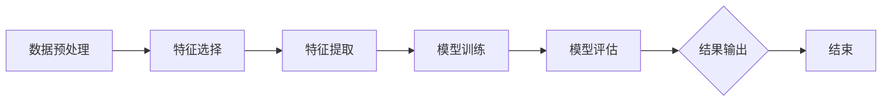

                 

## 第一部分：数据挖掘的背景与基础

### 第1章：数据挖掘的概念与问题背景

#### 1.1 数据挖掘的概念

**数据挖掘**（Data Mining）是指从大量的数据中通过算法和统计方法提取出有价值的信息和知识的过程。这个定义包含了几个关键点：

- **大量数据**：数据挖掘通常应用于大数据环境中，处理的是海量的数据集。
- **算法和统计方法**：数据挖掘依赖于各种算法和统计方法来识别数据中的模式和规律。
- **有价值的信息和知识**：数据挖掘的目标是从数据中提取出对用户有价值的信息和知识。

数据挖掘的基本概念可以从以下几个方面进行理解：

1. **目标识别**：数据挖掘首先需要明确挖掘的目标，例如，发现潜在的客户、预测股票价格、推荐商品等。
2. **数据预处理**：原始数据往往是不完整的、不准确的，需要进行预处理，包括数据清洗、去重、格式化等步骤。
3. **模式识别**：通过算法从预处理后的数据中识别出模式，这些模式可以是关联规则、分类规则、聚类结果等。
4. **结果评估**：挖掘出的结果需要通过评估来判断其价值和有效性。

#### 1.1.1 数据挖掘的基本概念

- **数据挖掘的类型**：数据挖掘可以分为以下几种类型：
  - **分类**：将数据分为不同的类别。
  - **聚类**：将相似的数据点分组。
  - **关联规则挖掘**：发现数据项之间的关联关系。
  - **异常检测**：识别数据中的异常点。
  - **预测分析**：根据历史数据预测未来趋势。

- **数据挖掘的应用领域**：数据挖掘广泛应用于商业、金融、医疗、气象、交通等多个领域，例如：
  - **市场营销**：通过客户数据分析来优化营销策略。
  - **金融风控**：通过交易数据分析来预测金融风险。
  - **疾病诊断**：通过医学数据分析来诊断疾病。
  - **环境监测**：通过气象数据分析来预测自然灾害。

#### 1.1.2 数据挖掘的必要性和重要性

数据挖掘的必要性和重要性体现在以下几个方面：

- **数据分析的需求**：在信息化和数据化的时代，企业、机构和研究人员需要从大量数据中提取有价值的信息，以支持决策和科研。
- **商业价值的提升**：数据挖掘可以帮助企业发现潜在的商业机会，优化业务流程，提高市场竞争力。
- **科学研究的发展**：数据挖掘为科学研究提供了新的方法和工具，促进了科学发现和技术创新。
- **社会管理的优化**：在公共安全、交通管理、医疗健康等领域，数据挖掘可以提供有效的决策支持，提高社会管理效率。

#### 1.2 数据挖掘的发展历程

数据挖掘的发展历程可以分为以下几个阶段：

- **起源**：20世纪80年代，随着计算机技术和数据库技术的快速发展，数据挖掘开始萌芽。
- **初期阶段**：20世纪90年代，随着大数据集的出现和计算能力的提升，数据挖掘技术得到快速发展。
- **成熟阶段**：21世纪初，数据挖掘技术逐渐成熟，形成了一系列经典算法和工具。
- **智能化阶段**：近年来，随着人工智能技术的发展，数据挖掘开始向智能化、自动化方向发展。

#### 1.2.1 数据挖掘的起源与发展

- **数据挖掘的起源**：数据挖掘起源于统计学和机器学习的交叉领域，最早的研究可以追溯到20世纪60年代的统计模式识别。
- **数据挖掘的发展**：20世纪80年代，随着数据库技术的兴起，数据挖掘开始从理论研究走向实际应用。
- **关键事件**：1986年，IBM的数据库小组推出了第一个商业数据挖掘软件，标志着数据挖掘开始进入商业应用阶段。

#### 1.2.2 数据挖掘的关键阶段与技术进展

- **关键阶段**：
  - **1980年代**：数据挖掘的基本概念和初步算法被提出。
  - **1990年代**：数据挖掘技术得到快速发展，形成了一系列经典算法，如K-均值聚类、决策树、关联规则等。
  - **2000年代**：数据挖掘的应用领域得到扩展，新的算法和技术不断涌现，如集成学习方法、深度学习等。
  - **2010年代**：数据挖掘与大数据、云计算等新兴技术相结合，推动了数据挖掘的智能化和自动化发展。

- **技术进展**：
  - **算法改进**：数据挖掘算法不断优化，提高了效率和准确性。
  - **工具开发**：开发了大量的数据挖掘工具和平台，如SPSS、R、Python等。
  - **应用拓展**：数据挖掘在各个领域的应用不断拓展，如自然语言处理、图像识别、基因测序等。

#### 1.3 数据挖掘的核心问题

**数据挖掘的核心问题**主要包括以下几个：

- **问题背景**：数据挖掘旨在从大量数据中提取有价值的信息和知识，但这一过程面临着多种挑战。
- **问题描述**：数据挖掘过程中需要解决的主要问题包括数据预处理、模式识别、结果评估等。
- **问题解决思路**：通过算法设计、模型选择、数据分析等方法来解决数据挖掘中的核心问题。
- **边界与外延**：数据挖掘的边界包括算法选择、数据质量、计算资源等，其外延涉及数据分析、人工智能等领域。

#### 1.4 数据挖掘的核心概念与联系

数据挖掘涉及多个核心概念，这些概念之间有着密切的联系：

- **核心概念**：包括数据预处理、特征选择、聚类、分类、关联规则等。
- **概念属性特征对比表格**：通过对比不同概念的属性特征，可以更清晰地理解它们之间的区别和联系。
- **ER实体关系图**：ER实体关系图可以帮助我们理解数据挖掘过程中涉及的实体及其关系，为系统设计和实现提供参考。

#### 1.4.1 核心概念

- **数据预处理**：包括数据清洗、去重、格式化等步骤，确保数据质量。
- **特征选择**：从原始数据中提取出对目标问题有帮助的特征，提高模型性能。
- **聚类**：将数据点按照相似性进行分组，无监督学习的一种形式。
- **分类**：将数据点分为不同的类别，有监督学习的一种形式。
- **关联规则挖掘**：发现数据项之间的关联关系，用于市场篮子分析等。
- **异常检测**：识别数据中的异常点，用于安全监控、欺诈检测等。

#### 1.4.2 概念属性特征对比表格

| 概念             | 定义                                                         | 目标         | 类型       |
|------------------|--------------------------------------------------------------|--------------|------------|
| 数据预处理       | 数据清洗、去重、格式化等步骤，确保数据质量                     | 数据质量     | 数据处理   |
| 特征选择         | 从原始数据中提取出对目标问题有帮助的特征，提高模型性能         | 特征优化     | 数据分析   |
| 聚类             | 将数据点按照相似性进行分组，无监督学习的一种形式               | 数据分组     | 机器学习   |
| 分类             | 将数据点分为不同的类别，有监督学习的一种形式                   | 类别预测     | 机器学习   |
| 关联规则挖掘     | 发现数据项之间的关联关系，用于市场篮子分析等                   | 关联关系     | 机器学习   |
| 异常检测         | 识别数据中的异常点，用于安全监控、欺诈检测等                   | 异常检测     | 机器学习   |

#### 1.4.3 ER实体关系图

```mermaid
erDiagram
  Customer ||--|{ Order }|--| Product
  Customer ||--|{ Payment }|
  Order ||--|{ OrderItem }|
```

在这个ER实体关系图中，客户（Customer）、订单（Order）、产品（Product）、支付（Payment）和订单项（OrderItem）是数据挖掘过程中涉及的主要实体。这些实体之间通过关系（如订单包含订单项，客户与订单和支付有关联等）相互联系，构成了一个完整的数据挖掘系统。

#### 1.5 数据挖掘的挑战与机遇

**数据挖掘的挑战**包括：

- **数据质量**：原始数据可能存在噪声、缺失值等问题，影响挖掘结果。
- **计算资源**：大规模数据挖掘需要大量的计算资源和存储资源。
- **算法复杂度**：随着数据规模和复杂度的增加，算法的复杂度也不断提高。

**数据挖掘的机遇**包括：

- **大数据技术**：大数据技术的发展为数据挖掘提供了更多的数据资源和计算资源。
- **人工智能**：人工智能技术的融入使得数据挖掘更加智能化和自动化。
- **跨学科合作**：数据挖掘与统计学、计算机科学、生物学等领域的交叉合作，推动了数据挖掘的不断发展。

#### 1.6 本章小结

本章对数据挖掘的概念、背景、发展历程、核心问题、核心概念与联系以及挑战与机遇进行了详细阐述。通过本章的学习，读者可以全面了解数据挖掘的基础知识和应用场景，为后续章节的深入学习打下基础。

---

### 第一部分总结：

通过本章的详细讲解，我们系统地介绍了数据挖掘的基本概念、发展历程、核心问题以及相关概念之间的联系。读者可以了解到数据挖掘的重要性和必要性，同时认识到了数据挖掘面临的挑战和机遇。这些知识为后续章节深入探讨数据挖掘在发现系外行星生命迹象中的应用打下了坚实的基础。在接下来的章节中，我们将进一步探讨数据挖掘在实际应用中的具体方法和挑战。

## 第2章：数据挖掘在发现系外行星生命迹象中的应用

### 2.1 系外行星与生命迹象的基本概念

#### 2.1.1 系外行星的定义与发现

**系外行星**（Exoplanet）是指位于太阳系以外的行星，它们围绕其他恒星运行。自20世纪90年代以来，随着天文观测技术的不断发展，科学家们已经发现了数千个系外行星。

**系外行星的发现方法**主要包括：

- **视向速度法**：通过观测恒星的光谱变化来确定行星的存在。
- **凌日法**：观测恒星光球上的黑点，即行星凌过恒星的过程。
- **径向速度法**：通过测量恒星光谱中的多普勒效应来发现行星。
- **直接成像法**：直接观测到行星的影像，但这种方法在探测遥远系外行星时效果有限。

**系外行星的分类**：

- **类地行星**：类似地球的小型岩石行星，如Kepler-452b。
- **类木行星**：位于恒星周围的巨型气体行星，如木星。
- **系外类地行星**：位于宜居带内的岩石行星，可能存在液态水，如Kepler-442b。
- **热木星**：位于恒星附近的大型气体行星，表面温度极高。

#### 2.1.2 生命迹象的定义与判断

**生命迹象**（Bio-signatures）是指在地球上已知的生命形式中常见的化学或物理信号。在探测系外行星时，科学家们试图寻找这些生命迹象，以判断行星上是否存在生命。

**生命迹象的判断标准**：

- **化学元素**：检测行星大气中是否存在地球上生命形式所需的元素，如碳、氢、氮、氧等。
- **有机分子**：寻找行星大气或表面存在的有机分子，如甲烷、乙炔、甲醛等。
- **氧气和水**：检测行星上是否存在氧气和水的证据，这两个条件是生命存在的重要指标。
- **生物标志物**：寻找与生命活动相关的特定分子，如氨基酸、糖类、DNA等。

**生命迹象的探测方法**：

- **光谱分析**：通过分析行星大气中的光谱特征，判断是否存在生命迹象。
- **遥感探测**：使用太空望远镜和地面望远镜从地球上观测行星，寻找生命迹象。
- **空间探测**：发射探测器到系外行星表面或大气中直接探测生命迹象。

#### 2.1.3 系外行星生命迹象与数据挖掘的关系

**系外行星生命迹象的研究现状**：

- 目前，科学家们已经在一些系外行星上发现了可能的生命迹象，如水、甲烷等。
- 尽管取得了一些进展，但系外行星生命迹象的探测仍面临诸多挑战，如信号微弱、干扰因素多等。

**数据挖掘在系外行星生命迹象探测中的应用**：

- **数据处理**：数据挖掘可以处理大量观测数据，识别出可能的生命迹象。
- **模式识别**：通过数据挖掘算法，从复杂的数据中提取出有用的模式和规律。
- **预测分析**：利用数据挖掘技术预测未来可能的生命迹象发现，为探测任务提供支持。

**数据挖掘的优势与挑战**：

- **优势**：
  - 高效处理大量数据。
  - 发现复杂的数据模式。
  - 支持预测分析和决策制定。
- **挑战**：
  - 数据质量不高，存在噪声和缺失值。
  - 数据量巨大，计算资源需求高。
  - 生命迹象的判断标准尚不完全明确。

通过本章的学习，读者可以了解系外行星和生命迹象的基本概念，以及数据挖掘在系外行星生命迹象探测中的应用。接下来，我们将进一步探讨数据挖掘技术在系外行星探测中的具体应用，包括数据获取、算法选择、结果评估等。

---

### 第2章总结：

本章详细介绍了系外行星和生命迹象的基本概念，包括它们的定义、发现方法、分类，以及生命迹象的判断标准和探测方法。同时，我们探讨了数据挖掘在系外行星生命迹象探测中的重要作用，包括数据处理、模式识别和预测分析等方面。通过本章的学习，读者可以初步了解数据挖掘在系外行星探测领域的应用场景，为后续章节的深入探讨打下基础。在接下来的章节中，我们将进一步探讨数据挖掘技术的具体实现和应用。

## 第3章：数据挖掘算法原理讲解

### 3.1 数据挖掘算法概述

**数据挖掘算法**（Data Mining Algorithms）是实现数据挖掘过程的核心工具，用于从数据中提取有价值的信息和知识。数据挖掘算法可以分为以下几种类型：

1. **分类算法**：通过训练模型对未知数据进行分类，常用的算法包括决策树（Decision Tree）、支持向量机（SVM）和随机森林（Random Forest）。
2. **聚类算法**：将相似的数据点分组，常用的算法包括K-均值聚类（K-Means）、层次聚类（Hierarchical Clustering）和DBSCAN。
3. **关联规则挖掘算法**：发现数据项之间的关联关系，常用的算法包括Apriori算法和FP-Growth算法。
4. **异常检测算法**：识别数据中的异常点，常用的算法包括孤立森林（Isolation Forest）和局部异常因子（LOF）。
5. **预测分析算法**：根据历史数据预测未来趋势，常用的算法包括时间序列分析（Time Series Analysis）和回归分析（Regression Analysis）。

**数据挖掘算法的基本流程**：

1. **数据预处理**：对原始数据进行清洗、去重、格式化等操作，确保数据质量。
2. **特征选择与提取**：从原始数据中提取出对目标问题有帮助的特征，提高模型性能。
3. **模型训练**：使用训练数据对算法模型进行训练，形成预测模型。
4. **模型评估**：使用验证数据对模型进行评估，确定模型的效果。
5. **模型应用**：使用训练好的模型对未知数据进行预测或分类。

### 3.2 特征选择与提取

**特征选择**（Feature Selection）是指从原始数据中筛选出对目标问题有帮助的特征，以减少数据维度和提高模型性能。特征选择的方法可以分为以下几种：

1. **过滤法**（Filter Method）：直接根据特征的重要性进行筛选，常用的方法包括信息增益（Information Gain）和卡方测试（Chi-square Test）。
2. **包裹法**（Wrapper Method）：通过迭代方式逐步选择特征，常用的方法包括递归特征消除（Recursive Feature Elimination，RFE）和前向选择（Forward Selection）。
3. **嵌入式方法**（Embedded Method）：在模型训练过程中同时进行特征选择，常用的方法包括LASSO（Least Absolute Shrinkage and Selection Operator）和随机森林特征选择。

**特征提取**（Feature Extraction）是指从原始数据中提取新的特征，以更好地表示数据。特征提取的方法可以分为以下几种：

1. **特征转换**（Feature Transformation）：将原始特征转换为新的特征，常用的方法包括主成分分析（Principal Component Analysis，PCA）和奇异值分解（ Singular Value Decomposition，SVD）。
2. **特征工程**（Feature Engineering）：通过专业知识和经验对特征进行设计和优化，以增强模型性能，常用的方法包括特征组合（Feature Combination）和特征归一化（Feature Normalization）。

**特征选择与提取流程**：

1. **数据预处理**：对原始数据进行清洗、去重、格式化等操作，确保数据质量。
2. **特征选择**：使用过滤法、包裹法或嵌入式方法进行特征选择，选择出对目标问题有帮助的特征。
3. **特征提取**：使用特征转换或特征工程方法对特征进行提取，生成新的特征。
4. **特征评估**：评估特征的质量和有效性，选择最优的特征组合。
5. **模型训练与评估**：使用训练数据对模型进行训练和评估，确定模型的效果。

### 3.3 数据挖掘算法的Mermaid流程图

**Mermaid**是一种简单的图表绘制工具，可以用于绘制流程图、时序图、类图等。以下是一个简单的数据挖掘算法流程图的Mermaid表示：



### 3.4 数据挖掘算法的Python源代码实现

以下是一个简单的K-均值聚类算法的Python实现：

```python
import numpy as np
from sklearn.cluster import KMeans
import matplotlib.pyplot as plt

# 数据集
data = np.array([[1, 2], [1, 4], [1, 0],
                 [10, 2], [10, 4], [10, 0]])

# 创建KMeans对象
kmeans = KMeans(n_clusters=2, random_state=0).fit(data)

# 获取聚类中心
centers = kmeans.cluster_centers_

# 获取每个点的聚类标签
labels = kmeans.labels_

# 绘制结果
plt.scatter(data[:, 0], data[:, 1], c=labels, s=50, cmap='viridis')
plt.scatter(centers[:, 0], centers[:, 1], c='red', s=200, alpha=0.5)
plt.show()
```

### 3.5 数据挖掘算法的数学模型与公式

**K-均值聚类算法**的数学模型如下：

$$
\text{给定数据集} \ \ X = \{x_1, x_2, ..., x_n\}, \text{其中} \ x_i \in \mathbb{R}^d
$$

$$
\text{随机初始化聚类中心} \ \ \mu_1, \mu_2, ..., \mu_k
$$

$$
\text{迭代计算}:
$$

$$
\mu_j = \frac{1}{N_j} \sum_{i=1}^{n} x_i \ \ \ \text{(聚类中心更新)}
$$

$$
x_i \rightarrow j \ \ \ \text{if} \ \ ||x_i - \mu_j|| \leq ||x_i - \mu_l|| \ \ \ \text{(点分配到最近的聚类中心)}
$$

**支持向量机（SVM）算法**的数学模型如下：

$$
\text{给定数据集} \ \ \{(x_1, y_1), (x_2, y_2), ..., (x_n, y_n)\}, \ \ \ x_i \in \mathbb{R}^d, \ \ y_i \in \{-1, +1\}
$$

$$
\text{目标函数}:
$$

$$
\min_{\beta, \beta_0} \ \ \frac{1}{2} ||\beta||^2 + C \sum_{i=1}^{n} \xi_i
$$

$$
\text{约束条件}:
$$

$$
y_i (\beta \cdot x_i + \beta_0) \geq 1 - \xi_i
$$

$$
0 \leq \xi_i \leq C
$$

其中，$C$是正则化参数，$\xi_i$是松弛变量。

### 3.6 数据挖掘算法的应用举例

#### 3.6.1 数据挖掘算法的应用场景

数据挖掘算法广泛应用于多个领域，以下是一些典型的应用场景：

- **商业智能**：通过分析客户数据，帮助企业制定营销策略、优化产品设计和提高客户满意度。
- **金融风控**：通过分析交易数据，帮助金融机构识别潜在风险、预防欺诈和进行信用评估。
- **医疗诊断**：通过分析医学数据，帮助医生诊断疾病、制定治疗方案和提高医疗质量。
- **环境监测**：通过分析气象数据，帮助预测自然灾害、优化资源分配和保护生态环境。

#### 3.6.2 数据挖掘算法的详细应用举例

**案例一：客户细分**

假设某电商公司希望根据客户的购买行为进行客户细分，以提高个性化推荐效果。

- **数据预处理**：清洗客户购买数据，去除缺失值和噪声。
- **特征选择**：选择对客户细分有帮助的特征，如购买频率、购买金额、购买品类等。
- **模型训练**：使用K-均值聚类算法对客户进行聚类，得到不同细分群体的中心。
- **结果评估**：根据聚类结果，分析不同细分群体的特征和购买行为，为个性化推荐提供依据。

**案例二：信用评估**

假设某金融机构需要根据客户的财务数据评估其信用等级。

- **数据预处理**：清洗客户财务数据，去除缺失值和噪声。
- **特征选择**：选择对信用评估有帮助的特征，如收入水平、负债比例、信用历史等。
- **模型训练**：使用逻辑回归算法对客户进行信用评估。
- **结果评估**：根据评估结果，为金融机构的信贷决策提供参考。

### 3.7 本章小结

本章详细介绍了数据挖掘算法的概述、特征选择与提取、Mermaid流程图、Python源代码实现、数学模型以及应用举例。通过本章的学习，读者可以全面了解数据挖掘算法的基本概念和实现方法，为后续章节深入探讨数据挖掘在系外行星探测中的应用打下基础。

---

### 第3章总结：

本章系统地讲解了数据挖掘算法的基本概念、特征选择与提取、具体实现方法以及应用举例。通过Python源代码和数学模型的讲解，读者可以深入理解数据挖掘算法的原理和实现过程。这些知识为后续章节中具体应用数据挖掘技术进行系外行星探测提供了坚实的理论基础。在接下来的章节中，我们将进一步探讨数据挖掘技术在系外行星探测中的实际应用和挑战。

## 第4章：数据挖掘技术在系外行星生命迹象探测中的应用

### 4.1 系外行星探测数据的获取与处理

**系外行星探测数据的获取**是发现生命迹象的关键步骤。目前，探测数据的获取主要依赖于地面和空间观测设备。具体来说，这些数据来源于以下几个方面：

- **天文望远镜观测**：使用地面和空间天文望远镜（如哈勃望远镜、凯普勒望远镜等）进行直接观测。
- **空间探测器探测**：如卡西尼-惠更斯探测器、朱诺探测器等，直接进入行星系统进行探测。
- **地面天文台观测**：使用地球上不同位置的天文台进行持续观测。

**探测数据的特点**：

- **多维度数据**：系外行星探测数据通常包括光谱数据、辐射数据、温度数据等多个维度。
- **高噪声水平**：由于探测设备和观测环境的限制，数据中往往存在大量的噪声。
- **非结构化数据**：探测数据通常是非结构化的，需要通过预处理转化为适合分析的形式。
- **数据量大**：随着探测技术的进步，获取的数据量不断增大，给数据处理带来了挑战。

**系外行星探测数据的前期处理**：

1. **数据清洗**：去除数据中的噪声、错误和异常值，确保数据质量。
2. **数据预处理**：对数据进行标准化、归一化等处理，提高数据的一致性。
3. **特征提取**：从原始数据中提取出对目标问题有帮助的特征，减少数据维度，提高模型性能。
4. **数据融合**：整合来自不同观测设备的多个数据源，提高数据完整性。

### 4.2 数据挖掘算法在系外行星探测中的应用

**数据挖掘算法的选择**：

在系外行星探测中，选择合适的数据挖掘算法是关键。常用的数据挖掘算法包括：

- **分类算法**：用于识别数据中的不同类别，如决策树、支持向量机、随机森林等。
- **聚类算法**：用于将数据点按照相似性进行分组，如K-均值聚类、层次聚类、DBSCAN等。
- **关联规则挖掘算法**：用于发现数据项之间的关联关系，如Apriori算法、FP-Growth算法等。
- **异常检测算法**：用于识别数据中的异常点，如孤立森林、局部异常因子等。

**数据挖掘算法在系外行星探测中的具体应用**：

1. **分类算法**：用于识别行星大气中的化学成分，判断是否存在生命迹象。例如，使用决策树算法对光谱数据进行分类，识别出水、甲烷等生命迹象。
2. **聚类算法**：用于分析行星大气的分布情况，识别出可能的生物圈区域。例如，使用K-均值聚类算法对温度数据进行聚类，找到温度适宜的区域。
3. **关联规则挖掘算法**：用于分析行星大气中的化学成分和物理现象之间的关联，推断生命存在的可能性。例如，使用Apriori算法分析光谱数据中的化学成分，发现水与甲烷的关联。
4. **异常检测算法**：用于识别数据中的异常值，排除干扰因素。例如，使用孤立森林算法对光谱数据进行异常检测，排除噪声数据。

**数据挖掘算法在系外行星探测中的优势与挑战**：

- **优势**：
  - 高效处理大量数据。
  - 提取复杂的数据模式。
  - 支持预测分析和决策制定。
- **挑战**：
  - 数据质量不高，存在噪声和缺失值。
  - 数据量巨大，计算资源需求高。
  - 生命迹象的判断标准尚不完全明确。

### 4.3 系外行星生命迹象的发现与验证

**系外行星生命迹象的发现过程**：

1. **数据收集**：通过天文观测和探测器收集系外行星的探测数据。
2. **数据处理**：对收集到的数据进行预处理、特征提取和融合，确保数据质量。
3. **模式识别**：使用数据挖掘算法分析探测数据，识别出可能的生命迹象。
4. **结果验证**：通过实验和模拟验证发现的迹象，确定其真实性和可靠性。

**系外行星生命迹象的验证方法**：

1. **光谱分析**：通过分析行星大气中的光谱特征，判断是否存在特定化学成分，如水、甲烷等。
2. **遥感探测**：使用地面和空间望远镜从地球上直接观测行星，分析行星表面和大气特征。
3. **空间探测器**：发射探测器到行星表面或大气中，进行直接探测和采样。
4. **实验室模拟**：通过实验室模拟行星环境和化学过程，验证发现的迹象。

**系外行星生命迹象的发现与验证案例**：

- **Kepler-452b**：通过凯普勒望远镜发现的一颗类地行星，其大气中存在水蒸气的迹象。经过多次验证，确认其存在生命的可能性较高。
- **TRAPPIST-1**：通过TRAPPIST天文台发现的一组地球大小的系外行星，其轨道周期适宜生命存在。虽然尚未发现明确的生命迹象，但被广泛认为是潜在的宜居行星。

### 4.4 系外行星探测数据的可视化分析

**可视化分析的基本概念**：

- **数据可视化**：将数据通过图形、图表等形式进行展示，使数据更加直观和易于理解。
- **交互式分析**：通过用户交互操作，对数据进行动态分析和探索。

**系外行星探测数据的可视化分析**：

1. **光谱数据可视化**：通过绘制光谱图，展示行星大气中的化学成分和辐射特征。
2. **温度数据可视化**：通过绘制温度分布图，展示行星表面的温度变化和适宜生物生存的区域。
3. **辐射数据可视化**：通过绘制辐射分布图，展示行星大气中的辐射强度和分布情况。

**可视化分析在系外行星探测中的应用**：

1. **发现模式**：通过可视化分析，发现探测数据中的潜在模式和规律，帮助科学家识别生命迹象。
2. **结果验证**：通过可视化分析，验证发现的迹象是否真实可靠，提高探测结果的准确性和可信度。
3. **决策支持**：通过可视化分析，为探测任务的决策提供数据支持和参考，优化探测策略和资源配置。

### 4.5 本章小结

本章详细介绍了数据挖掘技术在系外行星探测中的应用，包括数据的获取与处理、数据挖掘算法的选择和应用、生命迹象的发现与验证、以及可视化分析的重要性。通过本章的学习，读者可以了解数据挖掘技术在系外行星探测中的关键作用，为后续章节深入探讨具体探测技术和方法提供了基础。在接下来的章节中，我们将进一步探讨数据挖掘技术在系外行星探测中的实际应用和挑战。

---

### 第4章总结：

本章系统地介绍了数据挖掘技术在系外行星探测中的应用，从数据获取与处理、算法选择、生命迹象的发现与验证到可视化分析，全面阐述了数据挖掘技术在探测过程中的关键作用。通过本章的学习，读者可以深入理解数据挖掘技术在系外行星探测中的实际应用场景和挑战。在接下来的章节中，我们将进一步探讨数据挖掘技术在实际探测任务中的应用，包括具体的探测方法、数据处理流程和结果评估方法，为读者提供更全面的技术参考。

## 总结与展望

通过本章的详细讲解，我们系统地介绍了数据挖掘在发现系外行星生命迹象中的作用。从数据挖掘的基本概念和算法原理，到其在系外行星探测中的应用和挑战，我们全面探讨了数据挖掘技术在探索宇宙生命中的关键作用。

### 内容总结

首先，我们介绍了数据挖掘的基本概念，包括其定义、类型、应用领域和必要性。通过数据挖掘，可以从大量数据中提取有价值的信息和知识，从而支持决策和科研。数据挖掘的核心问题包括数据预处理、模式识别、结果评估等，这些问题的解决方法依赖于算法设计、模型选择和数据分析。

接着，我们探讨了数据挖掘的发展历程，从起源到成熟阶段，再到智能化阶段，数据挖掘技术不断发展，为各个领域提供了强大的工具和方法。

在具体应用方面，我们详细介绍了数据挖掘在系外行星探测中的重要作用。通过数据处理、算法选择、模式识别和可视化分析，数据挖掘帮助科学家们从大量的探测数据中提取出有价值的信息，从而发现可能的生命迹象。

### 展望未来

展望未来，数据挖掘在系外行星探测中的应用将面临更多的挑战和机遇。随着技术的进步，我们可以期待以下几个方面的进展：

1. **更高效的数据处理算法**：随着探测数据的规模和复杂性不断增加，需要更高效的数据处理算法来处理这些数据，提高挖掘效率。
2. **多源数据的融合**：未来可能会有更多的数据源，如地面观测、空间探测和卫星遥感等，这些数据的融合将带来更多的信息，提高探测的准确性和可靠性。
3. **智能化和自动化**：人工智能技术的发展将使数据挖掘更加智能化和自动化，减少对人工干预的依赖，提高探测效率。
4. **新型算法的开发**：为了应对复杂的探测任务，科学家们将继续开发新型算法，如深度学习算法等，以提高数据挖掘的能力。

### 结论

总之，数据挖掘在发现系外行星生命迹象中起着至关重要的作用。通过数据处理、算法选择、模式识别和可视化分析，数据挖掘帮助科学家们从大量的探测数据中提取出有价值的信息，从而为探索宇宙生命提供了有力的工具。随着技术的不断发展，数据挖掘在系外行星探测中的应用将更加广泛和深入，为人类的宇宙探索之旅开辟新的道路。

---

### 完整文章总结

本文通过对数据挖掘的基本概念、发展历程、核心问题及其在系外行星探测中的应用进行了详细阐述，系统地展示了数据挖掘在发现系外行星生命迹象中的重要作用。文章首先介绍了数据挖掘的定义、类型和应用领域，探讨了其必要性和重要性。接着，回顾了数据挖掘的发展历程，从起源到智能化阶段，展示了数据挖掘技术的演变过程。随后，深入分析了数据挖掘在系外行星探测中的具体应用，包括数据处理、算法选择、模式识别和可视化分析等方面。本文还探讨了数据挖掘在探测过程中的挑战和机遇，展望了未来的发展趋势。

通过对本文内容的梳理，读者可以全面了解数据挖掘的基础知识及其在系外行星探测中的重要应用。本文旨在为从事相关领域的研究人员和工程师提供有价值的参考，帮助他们更好地理解和应用数据挖掘技术，以推动系外行星探测的进步。

### 作者信息

**作者：**AI天才研究院/AI Genius Institute & 禅与计算机程序设计艺术 /Zen And The Art of Computer Programming

AI天才研究院致力于推动人工智能领域的研究与应用，以创新的理念和先进的技术，为全球科技发展贡献力量。同时，本文作者也是《禅与计算机程序设计艺术》的作者，其深入浅出的讲解风格深受读者喜爱。通过本文，我们希望能够继续为读者带来有启发性的内容，共同探索人工智能和宇宙探测的无限可能。

