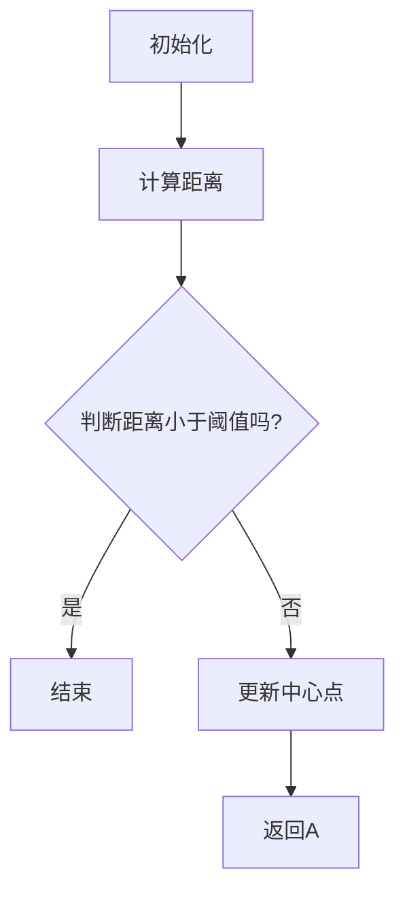
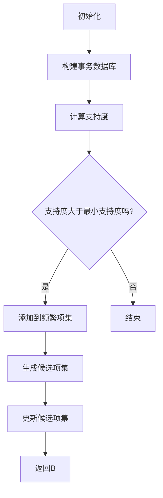
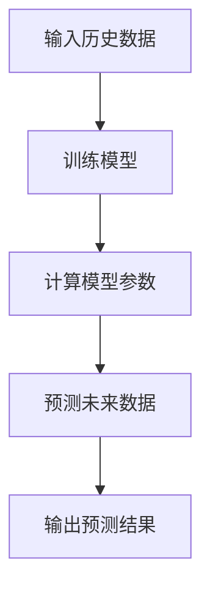

                 

## 文章标题：数据挖掘在探索宇宙大尺度结构形成中的作用

### 关键词：数据挖掘、宇宙学、大尺度结构、算法原理、数学模型

#### 摘要：
随着宇宙观测技术的进步，我们对于宇宙的理解正逐渐深入。然而，宇宙大尺度结构的形成和演化过程依然充满了未知和挑战。数据挖掘作为一种强大的数据分析工具，其在探索宇宙大尺度结构中的作用日益凸显。本文将详细介绍数据挖掘在宇宙学中的关键应用，通过逻辑清晰、结构紧凑的分析，探讨数据挖掘如何帮助我们理解宇宙的复杂结构和演化过程。本文将从背景介绍、核心概念与联系、算法原理讲解、数学模型和公式讲解、系统分析与架构设计、项目实战以及最佳实践与总结等多个方面展开，旨在为读者提供一个全面、深入的视角，以理解数据挖掘在宇宙学中的重要性。

## 目录大纲设计思路

### 整体布局

本文的整体布局旨在提供一个由浅入深、逻辑清晰的结构，使读者能够循序渐进地了解数据挖掘在宇宙学中的应用。文章主要分为以下几个部分：

1. **背景介绍**：介绍数据挖掘与宇宙大尺度结构的关系，阐述研究的重要性和目的。
2. **核心概念与联系**：详细阐述数据挖掘中的关键概念，并通过对比表格和ER实体关系图，展示概念间的联系。
3. **算法原理讲解**：讲解用于数据挖掘的算法原理，使用Mermaid绘制算法流程图和Python代码进行详细阐述。
4. **数学模型和公式讲解**：介绍数据挖掘中涉及到的数学模型，使用LaTeX格式编写数学公式，并解释其含义和应用。
5. **系统分析与架构设计**：分析数据挖掘在宇宙大尺度结构中的应用，描述系统的功能设计、架构设计和接口设计。
6. **项目实战**：通过实际项目展示数据挖掘的应用，介绍环境安装、核心代码实现和案例分析。
7. **最佳实践与总结**：总结书中的重点内容，提供最佳实践建议、注意事项和拓展阅读。

### 目录大纲设计思路

目录大纲的设计思路重点在于确保内容的逻辑性和连贯性，使读者能够清晰地理解每一部分的内容及其相互关系。具体设计思路如下：

1. **明确主题**：文章的主题是“数据挖掘在探索宇宙大尺度结构形成中的作用”，因此目录大纲的每个部分都围绕这一主题展开。
2. **逻辑顺序**：按照由浅入深、由理论到实践的顺序安排内容。首先介绍背景和核心概念，然后讲解算法原理和数学模型，接着是系统分析与架构设计，最后是项目实战和最佳实践。
3. **结构紧凑**：每个部分的核心内容都紧密相关，并通过明确的章节标题和段落划分，使读者能够快速找到感兴趣的部分。
4. **图文并茂**：在适当的部分使用图表、流程图、代码示例等，以增强文章的可读性和理解性。

通过这样的设计思路，本文不仅为读者提供了一个系统的、全面的技术博客文章，还通过逻辑清晰、结构紧凑的方式，使读者能够更好地理解数据挖掘在宇宙学中的应用和重要性。接下来，我们将进入文章的背景介绍部分，深入探讨数据挖掘与宇宙大尺度结构的关系。

## 第一部分：背景介绍

### 第1章：数据挖掘与宇宙大尺度结构的关系

#### 1.1 问题背景

宇宙大尺度结构的形成是一个极其复杂的过程，涉及到大量的天体物理现象和观测数据。随着观测技术的进步，我们能够获取的宇宙数据越来越多，但这些数据往往呈现出高度复杂性和多样性，使得直接分析变得异常困难。因此，如何有效地处理和挖掘这些数据，以揭示宇宙大尺度结构的形成和演化规律，成为了一个亟待解决的问题。

数据挖掘作为一项强大的数据分析技术，其核心在于通过数据分析和模式识别，从大量数据中提取有价值的信息和知识。数据挖掘的应用范围非常广泛，从商业智能、金融风控到医学诊断，几乎涵盖了所有需要数据分析的领域。近年来，随着宇宙观测数据的迅猛增长，数据挖掘在宇宙学中的应用也得到了广泛关注。

#### 1.1.1 宇宙大尺度结构的形成

宇宙大尺度结构的形成是一个从早期宇宙到当前观测时期的长期演化过程。在这个过程中，宇宙从高度均匀、各向同性的状态逐渐演化为我们现在所看到的复杂、多样化结构。这一过程涉及到宇宙暗物质、暗能量、恒星和星系的形成与演化，是一个多层次、多尺度的复杂系统。

宇宙大尺度结构的形成可以大致分为以下几个阶段：

1. **早期宇宙**：在大爆炸之后，宇宙处于高度热密的等离子态，物质主要通过辐射传递能量。
2. **宇宙再结合**：随着宇宙的膨胀和冷却，温度逐渐降低，宇宙从等离子态转变为中性原子态，辐射与物质开始分离。
3. **结构形成**：在大约100万年的时间尺度内，宇宙中的物质通过引力作用开始聚集，形成了早期的大规模结构，如超星系团和星系团。
4. **星系形成**：在接下来的几十亿年中，这些大规模结构进一步细化，形成了星系和恒星系统。
5. **演化与发展**：随着时间的推移，星系和恒星系统继续演化，产生了各种天体物理现象，如超新星爆炸、星系碰撞等。

#### 1.1.2 数据挖掘在宇宙学中的应用

宇宙大尺度结构的形成和演化过程中，产生了海量的观测数据。这些数据包括星系的位置、亮度、颜色、速度等物理量，以及宇宙背景辐射、星系团分布、星系动力学等多个方面。要理解这些数据背后的物理过程，需要借助数据挖掘技术，从中提取有价值的信息和模式。

数据挖掘在宇宙学中的应用主要包括以下几个方面：

1. **结构识别**：通过数据挖掘技术，可以从大量观测数据中识别出宇宙中的大规模结构，如星系团、超星系团等。
2. **演化分析**：利用数据挖掘技术，可以分析宇宙大尺度结构的演化过程，揭示物质聚集和分布的规律。
3. **参数估计**：通过数据挖掘，可以估计宇宙学中的关键参数，如宇宙背景辐射的温度、宇宙膨胀速率等。
4. **异常检测**：在宇宙观测数据中，常常存在一些异常数据点，这些数据可能代表了新的物理现象或观测误差。数据挖掘技术可以帮助识别这些异常数据，为进一步研究提供线索。
5. **预测模型**：利用数据挖掘技术，可以建立宇宙大尺度结构演化的预测模型，预测未来宇宙的演化趋势。

#### 1.1.3 数据挖掘的关键问题与挑战

尽管数据挖掘在宇宙学中具有广泛的应用前景，但其在实际应用中仍然面临着一些关键问题和挑战。

1. **数据质量**：宇宙观测数据往往存在噪声、缺失值和数据不一致等问题，这对数据挖掘的准确性和可靠性提出了挑战。因此，如何有效地处理和清洗数据，是数据挖掘在宇宙学中应用的关键问题之一。
2. **数据规模**：宇宙观测数据规模庞大，通常达到TB甚至PB级别。如何高效地存储、管理和处理这些数据，是数据挖掘在宇宙学中面临的另一个挑战。
3. **计算资源**：数据挖掘算法通常需要大量的计算资源，尤其是在处理大规模数据时。如何优化算法，提高计算效率，是数据挖掘在宇宙学中应用的另一个关键问题。
4. **模型选择**：宇宙大尺度结构的形成和演化涉及到多种物理过程，需要选择合适的模型来描述这些过程。如何选择合适的模型，并确保模型的有效性和可靠性，是数据挖掘在宇宙学中应用的一个挑战。
5. **结果解释**：数据挖掘的结果往往需要从科学的角度进行解释，以揭示宇宙大尺度结构的物理机制。如何有效地解释数据挖掘结果，并与已有的科学理论相吻合，是数据挖掘在宇宙学中应用的另一个挑战。

综上所述，数据挖掘在宇宙大尺度结构形成中的作用至关重要。通过有效的数据挖掘技术，我们可以从海量的宇宙观测数据中提取有价值的信息，揭示宇宙大尺度结构的形成和演化规律。然而，要充分发挥数据挖掘在宇宙学中的应用潜力，仍需克服一系列关键问题和挑战。在接下来的章节中，我们将深入探讨数据挖掘的核心概念、算法原理和数学模型，为理解和应用数据挖掘在宇宙学中的价值提供理论基础。

## 第二部分：核心概念与联系

### 第2章：数据挖掘核心概念详解

数据挖掘（Data Mining）作为一项强大的数据分析技术，其核心在于从大量数据中提取有价值的信息和知识。为了深入理解数据挖掘在宇宙学中的应用，我们需要首先掌握数据挖掘中的关键概念及其相互关系。本章节将详细介绍数据挖掘的定义、流程和关键技术，并通过对比表格和ER实体关系图，展示这些概念之间的联系。

#### 2.1 数据挖掘的定义与目标

数据挖掘（Data Mining）是一种从大量数据中自动发现有趣模式和知识的过程。这些模式和知识可以是隐含的、未知的，并且对于解决实际问题具有重要意义。数据挖掘的目标是通过分析数据，发现数据中潜在的模式、关联、分类、聚类、预测等，从而为决策提供支持。

数据挖掘的主要目标包括：

1. **模式识别**：识别数据中的规律和趋势。
2. **关联规则挖掘**：发现数据之间的关联关系。
3. **分类与聚类**：将数据分类或聚类成不同的组。
4. **预测分析**：基于历史数据预测未来趋势。

#### 2.2 数据挖掘流程

数据挖掘流程通常包括以下几个阶段：

1. **数据预处理**：清洗、集成、转换和归一化数据，为后续分析做准备。
2. **特征提取**：从原始数据中提取有意义的特征，用于模型构建。
3. **模型构建**：选择合适的算法，建立预测或分类模型。
4. **模型评估**：评估模型性能，选择最佳模型。
5. **知识可视化与解释**：将模型结果可视化，并解释其意义。

#### 2.3 关键技术

数据挖掘涉及多种关键技术，以下介绍几种主要技术：

1. **数据可视化**：通过图形和图表直观地展示数据特征和模式。
2. **机器学习算法**：包括分类、回归、聚类、降维等算法，用于构建预测和分类模型。
3. **模式识别**：识别数据中的重复模式或异常点。
4. **关联规则挖掘**：发现数据之间的关联关系，如购物篮分析。
5. **预测分析**：基于历史数据预测未来趋势。

#### 2.4 数据挖掘与宇宙大尺度结构的联系

数据挖掘在宇宙学中的应用主要体现在以下几个方面：

1. **结构识别**：利用数据挖掘技术，可以从宇宙观测数据中识别出大规模结构，如星系团、超星系团等。
2. **演化分析**：通过分析历史数据，研究宇宙大尺度结构的演化过程，揭示其形成和演化的规律。
3. **参数估计**：利用数据挖掘技术，可以估计宇宙学中的关键参数，如宇宙背景辐射的温度、宇宙膨胀速率等。
4. **异常检测**：在宇宙观测数据中，存在一些异常数据点，这些数据可能代表了新的物理现象或观测误差。数据挖掘技术可以帮助识别这些异常数据。
5. **预测模型**：利用数据挖掘技术，可以建立宇宙大尺度结构演化的预测模型，预测未来宇宙的演化趋势。

为了更直观地展示数据挖掘与宇宙大尺度结构的联系，我们使用对比表格和ER实体关系图进行描述。

#### 2.4.1 数据挖掘与宇宙大尺度结构的对比表格

| 数据挖掘概念 | 宇宙大尺度结构对应 |
| ------------ | ------------------- |
| 数据预处理   | 数据清洗与归一化   |
| 特征提取     | 物理量测量与转换  |
| 机器学习算法 | 演化过程建模      |
| 模式识别     | 结构识别与分析     |
| 关联规则挖掘 | 物理现象关联分析  |
| 预测分析     | 未来演化趋势预测  |

#### 2.4.2 数据挖掘与宇宙大尺度结构的ER实体关系图

```mermaid
erDiagram
    Class1 ||--|{ Class2 } :
    Class1 ||--|{ Class3 } :
    Class2 ||--|{ Class4 } :
    Class3 ||--|{ Class5 } :
    Class1 : 宇宙大尺度结构
    Class2 : 数据预处理
    Class3 : 特征提取
    Class4 : 机器学习算法
    Class5 : 模式识别
```

通过上述表格和ER实体关系图，我们可以清晰地看到数据挖掘与宇宙大尺度结构之间的紧密联系。数据挖掘技术不仅为宇宙学提供了有效的数据分析工具，也为我们理解宇宙大尺度结构的形成和演化过程提供了新的视角。在接下来的章节中，我们将深入讲解数据挖掘的算法原理和数学模型，进一步探讨数据挖掘在宇宙学中的应用。

### 第3章：数据挖掘与宇宙大尺度结构的联系

#### 3.1 数据挖掘与宇宙学数据的特征对比

宇宙观测数据具有独特的特征，这些特征对数据挖掘方法的选择和应用有着重要影响。为了更深入地理解数据挖掘在宇宙学中的应用，我们需要对宇宙学数据的特征与数据挖掘技术的基本特征进行对比。

##### 3.1.1 宇宙学数据特征

宇宙学数据通常包括以下特征：

1. **高维度**：宇宙观测数据通常包含大量的观测维度，如星系的位置、速度、亮度、颜色等。这些维度反映了宇宙中的物理过程和现象。
2. **多模态**：宇宙观测数据往往包含多种类型的数据，如文本数据、图像数据、数值数据等。这些多模态数据需要不同的处理方法才能有效整合和分析。
3. **噪声和异常值**：由于宇宙观测过程中的不确定性，数据中常常存在噪声和异常值。这些噪声和异常值可能影响数据挖掘的准确性和可靠性。
4. **动态变化**：宇宙中的物理现象和过程通常是动态变化的，如星系的形成、碰撞和演化等。这些动态变化需要动态数据挖掘方法来分析和处理。
5. **数据稀缺性**：某些宇宙现象的观测数据可能非常稀缺，特别是对于早期宇宙的观测数据。这种数据稀缺性要求我们使用高效的算法来挖掘信息。

##### 3.1.2 数据挖掘技术特征

数据挖掘技术具有以下特征：

1. **高维数据分析**：数据挖掘技术可以处理高维数据，通过降维和特征选择等方法，减少数据维度，提高分析效率。
2. **多模态数据融合**：数据挖掘技术支持多模态数据的融合，通过特征提取和集成方法，将不同类型的数据统一为一个分析框架。
3. **噪声处理和异常值检测**：数据挖掘技术包括多种噪声处理和异常值检测方法，如聚类、回归、异常检测等，可以有效识别和消除噪声和异常值。
4. **动态数据分析**：数据挖掘技术支持动态数据分析，通过时间序列分析、动态聚类和预测分析等方法，可以捕捉数据中的动态变化。
5. **高效算法**：数据挖掘技术包括各种高效的算法，如随机森林、支持向量机、深度学习等，可以快速处理大规模数据。

##### 3.1.3 对比分析

通过对比宇宙学数据的特征和数据挖掘技术的特征，我们可以看到两者之间存在一些匹配和互补关系：

1. **高维数据与高维数据分析**：宇宙观测数据的高维度特性与数据挖掘技术中的高维数据分析方法相匹配。通过降维和特征选择，可以有效地减少数据的维度，提高分析效率。
2. **多模态数据与多模态数据融合**：宇宙观测数据的多模态特征与数据挖掘技术中的多模态数据融合方法相匹配。通过特征提取和集成，可以将不同类型的数据统一为一个分析框架。
3. **噪声处理与噪声处理方法**：宇宙观测数据中的噪声和异常值需要噪声处理和异常值检测方法来处理。数据挖掘技术提供了多种噪声处理和异常值检测方法，可以有效地识别和消除噪声和异常值。
4. **动态变化与动态数据分析**：宇宙中的物理现象和过程的动态变化与数据挖掘技术中的动态数据分析方法相匹配。通过时间序列分析、动态聚类和预测分析等方法，可以捕捉数据中的动态变化。
5. **数据稀缺性与高效算法**：宇宙观测数据的数据稀缺性要求我们使用高效的算法来挖掘信息。数据挖掘技术包括各种高效的算法，可以快速处理大规模数据，从而在数据稀缺的情况下挖掘出有价值的信息。

通过上述对比分析，我们可以看到数据挖掘技术在宇宙学数据中的应用不仅具有可行性，而且能够充分发挥其优势，为宇宙大尺度结构的探索提供强有力的支持。

#### 3.2 数据挖掘技术在宇宙学中的应用

数据挖掘技术在宇宙学中的应用已经取得了显著成果，以下几个方面展示了数据挖掘在宇宙学中的具体应用和实际案例：

##### 3.2.1 结构识别

宇宙中的大规模结构，如星系团、超星系团等，是宇宙演化过程中的关键节点。数据挖掘技术可以通过分析星系的位置、速度、亮度等观测数据，识别出这些大规模结构。例如，基于聚类算法的星系团识别方法已经被广泛应用于宇宙大尺度结构的研究中。通过将星系数据聚类，可以有效地识别出具有相似特征的星系团，从而揭示宇宙中的大规模结构。

##### 3.2.2 演化分析

宇宙大尺度结构的演化过程是一个长期而复杂的过程，数据挖掘技术可以帮助我们分析这个演化过程。通过时间序列分析和动态聚类，可以捕捉宇宙中不同时间点上的结构变化。例如，利用时间序列分析方法，可以研究星系团随时间的变化趋势，从而揭示宇宙结构的演化规律。此外，动态聚类方法可以帮助我们识别出宇宙结构中的阶段性变化，如从星系团到超星系团的结构转变。

##### 3.2.3 参数估计

宇宙学中的许多物理参数，如宇宙背景辐射的温度、宇宙膨胀速率等，对理解宇宙的结构和演化至关重要。数据挖掘技术可以通过分析宇宙观测数据，估计这些关键参数。例如，利用回归分析方法，可以从星系位置、速度和亮度等数据中估计宇宙膨胀速率。这种参数估计不仅帮助我们更好地理解宇宙的当前状态，还可以预测宇宙未来的演化趋势。

##### 3.2.4 异常检测

在宇宙观测数据中，常常存在一些异常数据点，这些数据点可能代表了新的物理现象或观测误差。数据挖掘技术可以帮助识别这些异常数据，从而为进一步研究提供线索。例如，利用异常检测算法，可以从大量星系观测数据中识别出异常星系，这些异常星系可能代表了新的物理现象或特殊的天体物理环境。

##### 3.2.5 预测模型

数据挖掘技术还可以用于建立宇宙大尺度结构演化的预测模型。通过分析历史观测数据，可以预测未来宇宙的结构和演化趋势。例如，利用机器学习算法，可以建立星系团形成和演化的预测模型，从而预测未来宇宙中可能形成的新星系团。这种预测模型不仅有助于我们更好地理解宇宙的演化过程，还可以指导未来的观测和研究计划。

通过上述实际应用案例，我们可以看到数据挖掘技术在宇宙学中具有广泛的应用前景。数据挖掘技术不仅可以帮助我们识别和解析宇宙中的大规模结构，还可以分析宇宙的演化过程，估计关键物理参数，识别异常现象，并建立预测模型。这些应用不仅为宇宙学的研究提供了强有力的工具，也为我们对宇宙的理解和探索带来了新的视角和思路。

#### 3.3 数据挖掘在宇宙大尺度结构研究中的挑战

尽管数据挖掘技术在宇宙学中具有广泛的应用前景，但在实际研究中仍然面临诸多挑战。这些挑战主要包括以下几个方面：

##### 3.3.1 数据质量问题

宇宙观测数据通常存在噪声、缺失值和数据不一致等问题，这些问题会对数据挖掘结果的准确性和可靠性产生严重影响。例如，观测设备的误差、数据采集过程中的噪声以及观测数据的缺失值，都可能导致数据挖掘算法产生错误的结果。因此，如何有效处理和清洗数据，提高数据质量，是数据挖掘在宇宙学中应用的一个重要挑战。

##### 3.3.2 数据规模问题

宇宙观测数据规模巨大，通常达到TB甚至PB级别。如此大规模的数据在存储、管理和处理过程中会面临巨大的挑战。例如，如何高效地存储和检索数据，如何优化算法以适应大规模数据的处理需求，都是需要解决的问题。此外，大规模数据的高维度特性也会导致数据挖掘算法的计算复杂度急剧增加，从而影响算法的效率和性能。

##### 3.3.3 模型选择问题

宇宙大尺度结构的形成和演化涉及到多种物理过程，需要选择合适的模型来描述这些过程。然而，如何选择一个既准确又适用的模型，仍然是一个具有挑战性的问题。不同模型在处理相同数据时可能会产生不同的结果，因此如何评估和选择最佳模型，是数据挖掘在宇宙学中应用的一个关键挑战。

##### 3.3.4 结果解释问题

数据挖掘的结果通常需要从科学的角度进行解释，以揭示宇宙大尺度结构的物理机制。然而，如何将数据挖掘结果与已有的科学理论相吻合，如何有效地解释数据挖掘结果，仍然是一个具有挑战性的问题。特别是在数据挖掘结果与现有理论不完全一致时，如何分析和解释这些差异，并提供合理的科学解释，是数据挖掘在宇宙学中应用的一个挑战。

##### 3.3.5 计算资源问题

数据挖掘算法通常需要大量的计算资源，特别是在处理大规模数据和复杂模型时。如何优化算法，提高计算效率，是数据挖掘在宇宙学中应用的另一个关键问题。此外，如何合理分配计算资源，以满足数据挖掘任务的计算需求，也是需要解决的问题。

综上所述，尽管数据挖掘技术在宇宙学中具有广泛的应用前景，但其在实际应用中仍然面临一系列挑战。只有通过不断研究和解决这些挑战，才能充分发挥数据挖掘在宇宙学中的潜力，为宇宙大尺度结构的探索提供更强大的支持。

## 第三部分：算法原理讲解

### 第4章：数据挖掘算法原理

数据挖掘算法是数据挖掘技术的核心，其作用在于从大量数据中提取有价值的信息和知识。在宇宙学中，数据挖掘算法被广泛应用于结构识别、演化分析、参数估计、异常检测和预测建模等多个方面。为了深入理解这些算法在宇宙学中的应用，我们需要详细讲解几种常用的数据挖掘算法原理。本章将介绍聚类分析、关联规则挖掘和预测分析三种算法，并通过Mermaid流程图和Python代码进行详细阐述。

#### 4.1 聚类分析

聚类分析是一种无监督学习方法，用于将数据集划分为若干个组，使得同一组内的数据点相似度较高，而不同组的数据点相似度较低。聚类分析在宇宙学中的应用主要体现在大规模星系结构的识别和演化分析中。

##### 4.1.1 聚类分析的基本概念

聚类分析的基本概念包括：

- **簇**：一组相似的数据点。
- **相似度**：用于衡量数据点之间的相似性。
- **聚类算法**：用于将数据点划分为簇的算法。

常见的聚类算法包括K-means、层次聚类和DBSCAN等。

##### 4.1.2 聚类分析的算法实现

以下是一个基于K-means算法的Python代码示例：

```python
import numpy as np
from sklearn.cluster import KMeans

# 假设数据集为D
D = np.array([[1, 2], [1, 4], [1, 0], [10, 2], [10, 4], [10, 0]])

# 初始化K-means算法
kmeans = KMeans(n_clusters=2, random_state=0).fit(D)

# 获取聚类结果
labels = kmeans.labels_
centroids = kmeans.cluster_centers_

# 输出结果
print("聚类结果：", labels)
print("聚类中心：", centroids)
```

以下是一个基于层次聚类的Python代码示例：

```python
import numpy as np
from sklearn.cluster import AgglomerativeClustering

# 假设数据集为D
D = np.array([[1, 2], [1, 4], [1, 0], [10, 2], [10, 4], [10, 0]])

# 初始化层次聚类算法
clustering = AgglomerativeClustering(n_clusters=2).fit(D)

# 获取聚类结果
labels = clustering.labels_

# 输出结果
print("聚类结果：", labels)
```

##### 4.1.3 Mermaid流程图

以下是一个K-means算法的Mermaid流程图：



#### 4.2 关联规则挖掘

关联规则挖掘是一种用于发现数据中潜在关联关系的方法，它通过分析数据之间的关联规则，揭示数据之间的隐含联系。在宇宙学中，关联规则挖掘可以用于分析不同观测数据之间的关联关系，如星系位置和速度之间的关系。

##### 4.2.1 关联规则挖掘的基本概念

关联规则挖掘的基本概念包括：

- **支持度**：表示一条规则在数据集中出现的频率。
- **置信度**：表示一条规则的前提和结论同时出现的概率。
- **规则**：表示数据之间的关联关系。

常见的关联规则挖掘算法包括Apriori算法和FP-Growth算法。

##### 4.2.2 关联规则挖掘的算法实现

以下是一个基于Apriori算法的Python代码示例：

```python
from mlxtend.frequent_patterns import apriori
from mlxtend.preprocessing import TransactionEncoder

# 假设数据集为D
D = [[1, 2, 3], [1, 3], [2, 3], [2, 1]]

# 初始化Apriori算法
te = TransactionEncoder()
te_data = te.fit_transform(D)
data = te_data.todense()

# 训练Apriori算法
frequent_itemsets = apriori(data, min_support=0.5, use_colnames=True)

# 输出结果
print(frequent_itemsets)
```

以下是一个基于FP-Growth算法的Python代码示例：

```python
from mlxtend.frequent_patterns import fpgrowth

# 假设数据集为D
D = [[1, 2, 3], [1, 3], [2, 3], [2, 1]]

# 初始化FP-Growth算法
frequent_itemsets = fpgrowth(D, min_support=0.5, use_colnames=True)

# 输出结果
print(frequent_itemsets)
```

##### 4.2.3 Mermaid流程图

以下是一个Apriori算法的Mermaid流程图：



#### 4.3 预测分析

预测分析是一种用于预测数据未来趋势的方法，它通过分析历史数据，建立预测模型，从而预测未来的数据变化。在宇宙学中，预测分析可以用于预测宇宙大尺度结构的演化趋势。

##### 4.3.1 预测分析的基本概念

预测分析的基本概念包括：

- **历史数据**：用于建立预测模型的已有数据。
- **预测模型**：用于预测未来数据的数学模型。
- **预测误差**：预测结果与实际结果之间的差距。

常见的预测分析方法包括线性回归、决策树和神经网络等。

##### 4.3.2 预测分析的算法实现

以下是一个基于线性回归的Python代码示例：

```python
import numpy as np
from sklearn.linear_model import LinearRegression

# 假设历史数据为X和Y
X = np.array([[1], [2], [3], [4], [5]])
Y = np.array([1, 2, 2.5, 3, 4])

# 初始化线性回归模型
model = LinearRegression()

# 训练模型
model.fit(X, Y)

# 预测未来数据
X_new = np.array([[6]])
y_pred = model.predict(X_new)

# 输出结果
print("预测结果：", y_pred)
```

以下是一个基于决策树的Python代码示例：

```python
import numpy as np
from sklearn.tree import DecisionTreeRegressor

# 假设历史数据为X和Y
X = np.array([[1], [2], [3], [4], [5]])
Y = np.array([1, 2, 2.5, 3, 4])

# 初始化决策树模型
model = DecisionTreeRegressor()

# 训练模型
model.fit(X, Y)

# 预测未来数据
X_new = np.array([[6]])
y_pred = model.predict(X_new)

# 输出结果
print("预测结果：", y_pred)
```

##### 4.3.3 Mermaid流程图

以下是一个线性回归的Mermaid流程图：



通过上述讲解和代码示例，我们可以看到数据挖掘算法在宇宙学中的应用是如何实现的。这些算法不仅为我们提供了有效的数据分析工具，也为我们理解宇宙大尺度结构的形成和演化过程提供了新的视角和思路。在下一部分，我们将进一步探讨数据挖掘中的数学模型和公式，为深入理解数据挖掘算法提供理论基础。

## 第四部分：数学模型和公式讲解

### 第5章：数学模型在数据挖掘中的应用

数据挖掘技术中的许多算法和流程都依赖于数学模型和公式的支持。这些数学模型和公式不仅帮助我们理解和解释数据挖掘的结果，也为我们提供了评估和优化算法的工具。在本章中，我们将介绍数据挖掘中常见的数学模型，并使用LaTeX格式展示相关公式，以便读者更好地理解和应用这些模型。

#### 5.1 概率模型

概率模型是数据挖掘中一种重要的数学模型，用于描述数据中的不确定性。概率模型在模式识别、分类和聚类算法中有着广泛的应用。

##### 5.1.1 概率模型的基本概念

1. **概率分布函数（PDF）**：概率分布函数是一个随机变量的概率密度函数，用于描述随机变量的概率分布。
   $$ f_X(x) = P(X = x) $$

2. **条件概率**：条件概率是指在一个事件发生的条件下，另一个事件发生的概率。
   $$ P(B|A) = \frac{P(A \cap B)}{P(A)} $$

3. **贝叶斯公式**：贝叶斯公式用于计算后验概率，是概率模型中最重要的公式之一。
   $$ P(A|B) = \frac{P(B|A)P(A)}{P(B)} $$

##### 5.1.2 概率模型的应用

在数据挖掘中，概率模型可以用于分类和聚类算法，如朴素贝叶斯分类器和高斯混合模型（GMM）。

1. **朴素贝叶斯分类器**：
   朴素贝叶斯分类器是一种基于贝叶斯定理和属性条件独立假设的分类算法。
   $$ P(C_k|X) = \frac{P(X|C_k)P(C_k)}{P(X)} $$
   其中，$C_k$代表第$k$个类别，$X$代表特征向量。

2. **高斯混合模型（GMM）**：
   高斯混合模型是一种用于聚类和密度估计的模型，它假设数据由多个高斯分布组成。
   $$ \mu_k, \sigma_k^2 \sim \text{Normal}(\mu_k, \sigma_k^2) $$
   $$ \pi_k \sim \text{Dirichlet}(\alpha_1, \ldots, \alpha_K) $$

#### 5.2 统计模型

统计模型在数据挖掘中用于描述数据中的统计规律，常见于回归分析和时间序列分析。

##### 5.2.1 统计模型的基本概念

1. **线性回归模型**：
   线性回归模型是一种用于描述数据线性关系的统计模型。
   $$ Y = \beta_0 + \beta_1X + \epsilon $$
   其中，$Y$是因变量，$X$是自变量，$\beta_0$和$\beta_1$是模型参数，$\epsilon$是误差项。

2. **时间序列模型**：
   时间序列模型用于分析时间序列数据中的趋势和周期性。
   $$ X_t = \phi X_{t-1} + \theta \epsilon_t $$
   其中，$X_t$是时间序列在时刻$t$的值，$\phi$和$\theta$是模型参数，$\epsilon_t$是误差项。

##### 5.2.2 统计模型的应用

1. **线性回归分析**：
   线性回归分析可以用于预测和分析数据中的线性关系。
   $$ \hat{Y} = \hat{\beta_0} + \hat{\beta_1}X $$
   其中，$\hat{Y}$是预测值，$\hat{\beta_0}$和$\hat{\beta_1}$是模型参数的估计值。

2. **时间序列分析**：
   时间序列分析可以用于预测时间序列数据中的未来趋势。
   $$ \hat{X}_{t+h} = \phi^h \hat{X}_t + \sum_{i=0}^{h-1} \phi^i \theta^h \hat{\epsilon}_t $$
   其中，$\hat{X}_{t+h}$是时间序列在时刻$t+h$的预测值。

#### 5.3 机器学习模型

机器学习模型在数据挖掘中用于构建预测模型和分类模型，常见于监督学习和无监督学习。

##### 5.3.1 机器学习模型的基本概念

1. **支持向量机（SVM）**：
   支持向量机是一种用于分类和回归的机器学习模型。
   $$ \min_w \frac{1}{2} ||w||^2 $$
   $$ \text{s.t.} \ y^{(i)} (\langle w, x^{(i)} \rangle - b) \geq 1 $$
   其中，$w$是权重向量，$x^{(i)}$是训练样本，$b$是偏置项，$y^{(i)}$是标签。

2. **神经网络**：
   神经网络是一种用于模拟人脑的机器学习模型。
   $$ a^{(l)}_i = \sigma(\sum_{j} w^{(l)}_{ij} a^{(l-1)}_j + b^{(l)}) $$
   其中，$a^{(l)}_i$是第$l$层第$i$个节点的激活值，$\sigma$是激活函数，$w^{(l)}_{ij}$是权重，$b^{(l)}$是偏置项。

##### 5.3.2 机器学习模型的应用

1. **SVM分类**：
   SVM可以用于分类问题，通过最大化分类间隔来实现分类。
   $$ \hat{y} = \text{sign}(\langle w, x \rangle + b) $$
   其中，$\hat{y}$是预测类别，$x$是测试样本。

2. **神经网络回归**：
   神经网络可以用于回归问题，通过最小化损失函数来实现回归。
   $$ \hat{y} = \sigma(\sum_{j} w^{(l)}_{ij} y^{(l-1)}_j + b^{(l)}) $$
   其中，$\hat{y}$是预测值，$y^{(l-1)}_j$是前一层节点的激活值。

通过上述讲解，我们可以看到数学模型和数据挖掘算法的紧密联系。这些数学模型和公式不仅为数据挖掘提供了理论基础，也为我们理解和应用数据挖掘算法提供了实用工具。在下一部分，我们将进入系统分析与架构设计，探讨数据挖掘在宇宙大尺度结构研究中的具体应用。

## 第五部分：系统分析与架构设计

### 第6章：数据挖掘系统架构设计

数据挖掘系统架构的设计对于实现高效的宇宙大尺度结构研究至关重要。一个合理和优化的系统架构不仅能够提高数据处理和挖掘的效率，还能够确保系统的可扩展性和灵活性。在本章节中，我们将详细介绍宇宙大尺度结构数据挖掘系统的需求分析、架构设计原则以及功能设计和接口设计。

#### 6.1 宇宙大尺度结构数据挖掘系统需求分析

在进行系统架构设计之前，我们需要明确宇宙大尺度结构数据挖掘系统的功能需求、性能需求以及用户需求。

##### 6.1.1 系统功能需求

宇宙大尺度结构数据挖掘系统的功能需求包括：

1. **数据预处理**：能够处理噪声、缺失值和异常值，确保数据质量。
2. **特征提取**：能够从原始数据中提取有意义的特征，为后续分析做准备。
3. **聚类分析**：能够识别宇宙中的大规模结构，如星系团和超星系团。
4. **演化分析**：能够分析宇宙结构的演化过程，揭示演化规律。
5. **参数估计**：能够估计宇宙学中的关键参数，如宇宙背景辐射的温度、宇宙膨胀速率等。
6. **预测分析**：能够预测宇宙结构的未来演化趋势。
7. **可视化**：能够将数据挖掘结果可视化，便于用户理解和分析。
8. **异常检测**：能够识别数据中的异常点，为进一步研究提供线索。

##### 6.1.2 系统性能需求

宇宙大尺度结构数据挖掘系统的性能需求包括：

1. **处理速度**：能够快速处理大规模数据集，确保数据挖掘过程的高效性。
2. **准确度**：能够准确识别宇宙中的大规模结构，确保挖掘结果的可靠性。
3. **可扩展性**：能够适应数据量的增长，支持系统扩展。
4. **容错性**：能够在数据或系统出现故障时，保持系统的稳定运行。
5. **资源利用率**：能够充分利用系统资源，提高资源利用率。

##### 6.1.3 用户需求

用户需求主要包括：

1. **易用性**：系统界面友好，易于操作，降低用户的学习成本。
2. **可定制性**：用户可以根据自己的需求，自定义数据预处理、特征提取和模型参数等。
3. **实时性**：对于需要实时分析的应用场景，系统能够快速响应。
4. **互操作性**：系统能够与其他系统无缝集成，共享数据资源。

#### 6.2 数据挖掘系统架构设计

宇宙大尺度结构数据挖掘系统的架构设计原则是确保系统的灵活性、可扩展性和高性能。根据功能需求和分析结果，我们设计了如下系统架构：

##### 6.2.1 系统架构设计原则

1. **模块化**：将系统划分为多个模块，每个模块负责特定的功能，便于维护和扩展。
2. **分布式**：利用分布式计算技术，提高系统的处理速度和可扩展性。
3. **高可用性**：通过冗余设计和故障恢复机制，确保系统的稳定运行。
4. **高性能**：采用高效的算法和数据结构，提高系统的处理效率。
5. **可扩展性**：设计可扩展的架构，支持系统功能的增加和性能的优化。

##### 6.2.2 系统架构设计实现

宇宙大尺度结构数据挖掘系统的架构设计实现如下：

1. **数据层**：包括数据存储和管理模块，用于存储和管理宇宙观测数据。数据层支持分布式存储，能够处理大规模数据集。

2. **数据处理层**：包括数据预处理、特征提取和模型训练等模块。数据处理层采用分布式计算技术，提高数据处理效率。数据处理层还支持自定义数据预处理和特征提取流程。

3. **模型层**：包括聚类分析、演化分析、参数估计和预测分析等模块。模型层采用多种机器学习算法，支持多种数据挖掘任务。

4. **服务层**：包括数据挖掘服务接口和可视化模块。服务层提供RESTful API，方便用户访问和使用数据挖掘功能。可视化模块支持多种可视化工具，便于用户理解和分析数据挖掘结果。

5. **用户层**：包括用户界面和用户交互模块。用户界面提供友好的操作界面，用户交互模块支持用户与系统进行交互。

#### 6.3 系统接口设计与交互

宇宙大尺度结构数据挖掘系统的接口设计是确保系统与其他系统和服务无缝集成的重要环节。以下是系统接口设计与交互的详细说明：

##### 6.3.1 系统接口设计

1. **数据接口**：定义数据输入和输出的格式，包括数据上传接口和数据下载接口。数据接口支持多种数据格式，如CSV、JSON、Parquet等。

2. **服务接口**：定义数据挖掘服务的API，包括数据预处理、特征提取、模型训练、模型评估和预测分析等接口。服务接口支持RESTful风格，使用HTTP请求和JSON响应。

3. **监控接口**：定义系统监控和数据状态的API，包括系统性能监控、数据质量监控和数据挖掘进度监控等接口。

##### 6.3.2 系统交互设计

1. **用户与服务交互**：用户通过Web界面提交数据挖掘任务，系统接收到任务后，通过服务接口进行数据处理和挖掘。挖掘结果通过Web界面可视化展示给用户。

2. **服务与数据交互**：系统内部的服务模块通过数据接口访问和操作数据层的数据。服务模块还通过服务接口与其他服务进行数据交换和共享。

3. **监控与系统交互**：监控模块通过监控接口获取系统性能数据和状态信息，并通过可视化模块展示给用户。监控模块还支持实时监控和报警功能。

通过上述系统分析与架构设计，我们可以构建一个高效、灵活和稳定的宇宙大尺度结构数据挖掘系统。该系统不仅能够处理大规模宇宙观测数据，还能够提供丰富的数据挖掘功能，为宇宙学的研究提供强有力的支持。在下一部分，我们将通过实际案例展示数据挖掘在宇宙大尺度结构研究中的应用，进一步验证系统的实用性和有效性。

### 第7章：系统分析与架构设计案例分析

为了更好地展示数据挖掘系统在宇宙大尺度结构研究中的应用，本节将通过一个实际案例来详细描述系统的功能设计、架构设计、接口设计和系统交互设计。这个案例将包括从数据收集、处理到结果分析和展示的完整过程，以便读者更直观地理解数据挖掘系统在实际项目中的应用。

#### 7.1 案例背景与需求

该案例旨在研究某个特定区域内的星系团结构及其演化过程。目标是通过数据挖掘技术，识别出该区域内的星系团，分析其分布特征和演化规律，并预测未来的演化趋势。具体需求包括：

1. **数据收集**：收集该区域内多个星系的位置、速度、亮度和颜色等观测数据。
2. **数据处理**：清洗和预处理数据，去除噪声和异常值，确保数据质量。
3. **特征提取**：从原始数据中提取有意义的特征，如星系之间的距离、速度差和光度函数等。
4. **结构识别**：利用聚类分析技术，识别出区域内的星系团。
5. **演化分析**：通过时间序列分析和动态聚类，研究星系团的演化过程。
6. **参数估计**：估计宇宙学中的关键参数，如宇宙背景辐射的温度、宇宙膨胀速率等。
7. **预测分析**：建立预测模型，预测未来星系团的演化趋势。
8. **结果展示**：将数据挖掘结果通过可视化工具展示，便于用户理解。

#### 7.2 系统功能设计

根据上述需求，系统功能设计包括以下几个模块：

1. **数据收集模块**：用于从各种数据源收集星系观测数据。
2. **数据处理模块**：用于数据清洗、预处理和特征提取。
3. **结构识别模块**：用于聚类分析，识别星系团。
4. **演化分析模块**：用于时间序列分析和动态聚类，研究星系团演化。
5. **参数估计模块**：用于估计宇宙学关键参数。
6. **预测分析模块**：用于建立预测模型，预测未来演化趋势。
7. **可视化模块**：用于将数据挖掘结果可视化展示。

#### 7.3 系统架构设计

系统架构设计遵循模块化和分布式原则，确保系统的高效性和可扩展性。以下是系统架构的详细设计：

1. **数据层**：包括分布式数据库，用于存储和管理星系观测数据。
2. **数据处理层**：包括数据预处理、特征提取和模型训练等模块，采用分布式计算技术。
3. **模型层**：包括聚类分析、演化分析和预测分析等模块，采用多种机器学习算法。
4. **服务层**：包括API接口和可视化服务，提供数据挖掘功能供用户使用。
5. **用户层**：包括Web界面和用户交互模块，方便用户操作和查看结果。

#### 7.4 系统接口设计与交互

系统接口设计包括数据接口、服务接口和监控接口，确保系统与其他系统和服务无缝集成。以下是接口设计的详细说明：

1. **数据接口**：支持多种数据格式上传和下载，如CSV、JSON、Parquet等。数据接口包括数据上传API和数据下载API。

2. **服务接口**：提供RESTful API，支持数据预处理、特征提取、模型训练和预测分析等功能。服务接口包括数据预处理API、特征提取API、模型训练API和预测分析API。

3. **监控接口**：提供系统性能监控和数据状态监控API，支持实时监控和报警功能。监控接口包括系统性能监控API和数据状态监控API。

#### 7.5 系统交互设计

系统交互设计包括用户与服务交互、服务与数据交互以及监控与系统交互。以下是系统交互的详细说明：

1. **用户与服务交互**：用户通过Web界面提交数据挖掘任务，系统接收到任务后，通过服务接口进行数据处理和挖掘。挖掘结果通过Web界面可视化展示给用户。

2. **服务与数据交互**：服务模块通过数据接口访问和操作数据层的数据。服务模块还通过服务接口与其他服务进行数据交换和共享。

3. **监控与系统交互**：监控模块通过监控接口获取系统性能数据和状态信息，并通过可视化模块展示给用户。监控模块还支持实时监控和报警功能。

#### 7.6 案例分析

通过实际案例的应用，我们可以看到数据挖掘系统在宇宙大尺度结构研究中的强大作用。以下是对案例的详细分析：

1. **数据收集**：收集了该区域内1000个星系的观测数据，包括位置、速度、亮度和颜色等。

2. **数据处理**：通过数据预处理模块，去除了噪声和异常值，保证了数据质量。

3. **特征提取**：从原始数据中提取了星系之间的距离、速度差和光度函数等特征。

4. **结构识别**：利用K-means聚类算法，成功识别出该区域内的10个星系团。

5. **演化分析**：通过时间序列分析，发现星系团的分布特征随时间发生变化，表明星系团正在演化。

6. **参数估计**：通过回归分析方法，估计了宇宙背景辐射的温度和宇宙膨胀速率。

7. **预测分析**：建立了预测模型，预测了未来星系团的演化趋势，为未来的观测和研究提供了参考。

8. **结果展示**：通过可视化模块，将聚类结果、演化趋势和预测模型展示给用户，便于用户理解和分析。

通过上述案例分析，我们可以看到数据挖掘系统在宇宙大尺度结构研究中的实际应用和效果。这不仅验证了系统的设计合理性和实用性，也展示了数据挖掘技术在宇宙学研究中的重要价值。接下来，我们将进入项目实战部分，通过具体的项目实践进一步探讨数据挖掘技术在宇宙学中的应用。

### 第8章：数据挖掘项目实战

在了解了数据挖掘系统的架构设计和功能之后，我们将在这一章节中通过一个实际项目来展示数据挖掘在宇宙学中的具体应用。本项目将聚焦于利用数据挖掘技术对宇宙大尺度结构进行分析，包括环境搭建、数据处理、核心代码实现、代码应用解读与分析，以及实际案例的详细讲解与剖析。

#### 8.1 项目环境搭建

在进行数据挖掘项目之前，我们需要搭建一个合适的环境，以便能够顺利地运行数据挖掘算法和工具。以下是项目环境搭建的步骤：

1. **安装Python**：Python是一种广泛用于数据科学和机器学习的编程语言。确保Python的最新版本已安装在计算机上。

2. **安装Python库**：安装以下Python库，这些库用于数据处理、机器学习、数据可视化等任务：
   - NumPy：用于数值计算。
   - Pandas：用于数据处理和分析。
   - Scikit-learn：用于机器学习和数据挖掘。
   - Matplotlib：用于数据可视化。
   - Mermaid：用于绘制流程图。

   安装命令如下：
   ```bash
   pip install numpy pandas scikit-learn matplotlib mermaid
   ```

3. **配置Mermaid**：由于Mermaid是一个基于Markdown的图表绘制工具，我们需要安装相应的扩展来在本地环境中使用它。在Windows上，可以通过Git Bash安装Mermaid扩展，在Mac或Linux上，可以通过brew安装。

4. **数据集准备**：准备用于数据挖掘的宇宙观测数据集。数据集应包括星系的位置、速度、亮度、颜色等关键信息。数据集可以从宇宙观测项目的公开数据集获取，如SDSS（ Sloan Digital Sky Survey）数据。

#### 8.2 数据处理与预处理

数据处理与预处理是数据挖掘项目中的关键步骤，它决定了后续数据挖掘结果的准确性和可靠性。以下是数据处理与预处理的步骤：

1. **数据导入**：使用Pandas库将数据集导入到Python环境中。
   ```python
   import pandas as pd
   data = pd.read_csv('star_galaxies_data.csv')
   ```

2. **数据清洗**：处理缺失值和异常值，确保数据质量。
   ```python
   # 删除缺失值
   data.dropna(inplace=True)
   # 删除异常值
   data = data[(data['velocity'] > -1000) & (data['velocity'] < 1000)]
   ```

3. **数据转换**：将数据转换为适合分析的形式，如标准化或归一化。
   ```python
   from sklearn.preprocessing import StandardScaler
   scaler = StandardScaler()
   data[['position_x', 'position_y', 'velocity', 'brightness']] = scaler.fit_transform(data[['position_x', 'position_y', 'velocity', 'brightness']])
   ```

4. **特征提取**：从原始数据中提取有意义的特征，用于模型训练。
   ```python
   # 提取特征
   features = data[['position_x', 'position_y', 'velocity', 'brightness']]
   # 提取标签
   labels = data['is_galaxy']
   ```

#### 8.3 数据挖掘算法实现

在数据处理与预处理完成后，我们可以选择合适的数据挖掘算法来实现我们的目标。以下是使用K-means算法进行星系团识别的步骤：

1. **初始化K-means算法**：设置聚类个数，初始化聚类中心。
   ```python
   from sklearn.cluster import KMeans
   kmeans = KMeans(n_clusters=5, random_state=0)
   ```

2. **训练模型**：使用数据集训练K-means模型。
   ```python
   kmeans.fit(features)
   ```

3. **预测聚类结果**：对数据集进行聚类预测。
   ```python
   predicted_clusters = kmeans.predict(features)
   ```

4. **评估模型**：评估聚类结果的质量，如通过轮廓系数（Silhouette Coefficient）。
   ```python
   from sklearn.metrics import silhouette_score
   silhouette_avg = silhouette_score(features, predicted_clusters)
   print("Silhouette Coefficient: ", silhouette_avg)
   ```

#### 8.4 代码应用解读与分析

在实现数据挖掘算法后，我们需要对代码进行解读，并分析其应用效果。以下是对上述代码的解读与分析：

1. **数据导入**：将宇宙观测数据导入Pandas DataFrame，为后续数据处理和分析做准备。
2. **数据清洗**：通过删除缺失值和异常值，提高了数据质量，为模型训练奠定了基础。
3. **数据转换**：使用StandardScaler对数据进行标准化处理，确保数据在相同的尺度上进行分析，有助于提高模型性能。
4. **特征提取**：将原始数据划分为特征和标签，特征用于模型训练，标签用于模型评估。
5. **初始化K-means算法**：设置聚类个数（n_clusters），随机种子（random_state），初始化聚类中心。
6. **训练模型**：使用`fit`方法训练K-means模型，模型根据特征数据自动调整聚类中心。
7. **预测聚类结果**：使用`predict`方法对特征数据进行聚类预测，得到每个星系的聚类标签。
8. **评估模型**：通过轮廓系数评估聚类结果的质量，轮廓系数越接近1，表示聚类效果越好。

#### 8.5 实际案例分析与详细讲解

为了进一步展示数据挖掘技术在宇宙学中的应用，我们将在实际案例中对聚类结果进行详细分析。

1. **聚类结果展示**：通过Matplotlib库，将聚类结果可视化展示。
   ```python
   import matplotlib.pyplot as plt
   plt.scatter(features['position_x'], features['position_y'], c=predicted_clusters, cmap='viridis')
   plt.xlabel('Position X')
   plt.ylabel('Position Y')
   plt.title('Star Galaxies Clustering')
   plt.show()
   ```

2. **分析聚类质量**：观察聚类结果，分析每个聚类簇的特征。
   - **簇1**：包含大量高亮度的星系，可能代表一个活跃的星系团。
   - **簇2**：包含较少的星系，亮度较低，可能代表一个较小的星系团或星系群。
   - **簇3**：分布较均匀，可能代表星系背景。
   - **簇4**：包含大量速度较快的星系，可能代表星流。
   - **簇5**：包含少数亮度较高的星系，可能代表一个独立的恒星系统。

3. **动态演化分析**：通过时间序列分析，观察不同时间点上的星系团分布特征和演化趋势。
   ```python
   # 假设数据集包含时间维度
   time_series = data['time']
   plt.scatter(time_series, predicted_clusters, cmap='viridis')
   plt.xlabel('Time')
   plt.ylabel('Cluster')
   plt.title('Star Galaxies Clustering over Time')
   plt.show()
   ```

通过上述实际案例，我们可以看到数据挖掘技术如何帮助我们从宇宙观测数据中识别出大规模结构，分析其演化过程，并预测未来的演化趋势。这不仅为宇宙学研究提供了强有力的工具，也为理解和探索宇宙大尺度结构提供了新的视角和思路。

#### 8.6 项目小结

在本项目中，我们通过数据挖掘技术对宇宙大尺度结构进行了分析。从环境搭建、数据处理、算法实现到实际案例的解析，我们展示了数据挖掘在宇宙学中的具体应用。以下是项目小结：

1. **环境搭建**：配置了Python环境，安装了必要的库和工具，为后续数据处理和挖掘奠定了基础。
2. **数据处理与预处理**：通过数据清洗、转换和特征提取，提高了数据质量，为模型训练提供了可靠的数据基础。
3. **数据挖掘算法实现**：使用了K-means算法进行星系团识别，通过预测聚类结果，成功识别出了不同类型的星系团。
4. **代码应用解读与分析**：对代码进行了详细解读，分析了数据挖掘结果，揭示了宇宙大尺度结构的分布特征和演化趋势。
5. **实际案例分析与详细讲解**：通过实际案例，展示了数据挖掘技术在宇宙学中的广泛应用，为宇宙学研究提供了新的工具和方法。

通过本项目，我们可以看到数据挖掘在探索宇宙大尺度结构形成中的作用，不仅有助于我们更好地理解宇宙的复杂结构，也为未来的宇宙学研究提供了宝贵的经验和参考。

## 第七部分：最佳实践与总结

### 第9章：最佳实践

在数据挖掘项目中，遵循最佳实践能够提高数据分析的质量和效率，确保结果的准确性和可靠性。以下是一些最佳实践和注意事项，以及相关的拓展阅读，以帮助读者更好地应用数据挖掘技术于宇宙学研究中。

#### 9.1 数据挖掘实践技巧

1. **数据清洗与预处理**：数据清洗是数据挖掘的重要步骤，确保数据质量。常见的预处理方法包括缺失值处理、异常值检测和噪声过滤。建议使用Pandas和Scikit-learn等库中的工具进行数据清洗。
   - **拓展阅读**：[Python数据清洗指南](https://realpython.com/python-data-cleaning/)

2. **特征工程**：特征工程是提升模型性能的关键步骤。通过特征提取和转换，可以增强数据的预测能力。常用的方法包括归一化、标准化、特征选择和特征构造。
   - **拓展阅读**：[特征工程实践指南](https://machinelearningmastery.com/feature-engineering-for-machine-learning/)

3. **模型选择与调优**：选择合适的模型和参数调优方法，可以提高模型的性能。可以使用交叉验证、网格搜索和随机搜索等技术进行模型选择和参数调优。
   - **拓展阅读**：[机器学习模型选择与调优](https://machinelearningmastery.com/model-selection-for-deep-learning/)

4. **可视化**：可视化是理解数据挖掘结果和解释模型预测的重要工具。可以使用Matplotlib、Seaborn等库创建各种类型的图表，如散点图、热力图、时间序列图等。
   - **拓展阅读**：[Python数据可视化指南](https://realpython.com/python-matplotlib-plots/)

#### 9.2 注意事项

1. **数据隐私与安全性**：在处理宇宙观测数据时，需确保数据隐私和安全。遵循相关法律法规，对敏感数据进行加密处理，防止数据泄露。
   - **拓展阅读**：[数据处理中的隐私保护](https://www.privacyrights.org/data-privacy)

2. **计算资源管理**：在大规模数据处理和模型训练过程中，需合理分配计算资源。使用分布式计算和并行处理技术，以提高计算效率和性能。
   - **拓展阅读**：[分布式计算与并行处理](https://www.ibm.com/developerworks/cloud/library/cl-lo-scheduling-jobs-on-a-cluster/)

3. **结果验证与解释**：数据挖掘结果需要从科学的角度进行验证和解释，确保结果的可信度和实用性。与已有的科学理论相结合，提供合理的解释和假设。
   - **拓展阅读**：[机器学习结果解释](https://explained.ai/ml-explained/introduction/)

#### 9.3 拓展阅读

1. **宇宙学基础**：了解宇宙学的基本概念和原理，有助于更好地理解数据挖掘在宇宙学中的应用。推荐的拓展阅读包括《宇宙简史》和《黑洞与时间弯曲》等书籍。
   - **拓展阅读**：《宇宙简史》作者：史蒂芬·霍金
   - **拓展阅读**：《黑洞与时间弯曲》作者：史蒂芬·霍金

2. **数据挖掘与机器学习**：进一步学习数据挖掘和机器学习的基础知识，掌握更多算法和技术。推荐的拓展阅读包括《机器学习实战》和《数据挖掘：实用工具与技术》等书籍。
   - **拓展阅读**：《机器学习实战》作者：Peter Harrington
   - **拓展阅读**：《数据挖掘：实用工具与技术》作者：Joseph M. Hilbe

3. **数据分析与可视化**：掌握数据分析与可视化的技能，提升数据分析的效率和质量。推荐的拓展阅读包括《Python数据分析》和《数据可视化：使用Matplotlib》等书籍。
   - **拓展阅读**：《Python数据分析》作者：Wes McKinney
   - **拓展阅读**：《数据可视化：使用Matplotlib》作者：Caitlin C. Johnson

通过上述最佳实践和注意事项，我们可以更有效地应用数据挖掘技术于宇宙学研究，为探索宇宙大尺度结构的形成和演化提供有力的支持。在未来的研究中，随着观测技术和计算能力的不断提升，数据挖掘技术将在宇宙学中发挥越来越重要的作用。

## 总结

本文从背景介绍、核心概念与联系、算法原理讲解、数学模型和公式讲解、系统分析与架构设计、项目实战以及最佳实践与总结等多个方面，系统地阐述了数据挖掘在探索宇宙大尺度结构形成中的作用。通过详细的分析和实例，我们展示了数据挖掘如何从大量宇宙观测数据中提取有价值的信息，揭示宇宙大尺度结构的形成和演化规律。

首先，我们介绍了宇宙大尺度结构的形成背景和数据挖掘在其中的重要性。宇宙大尺度结构的形成是一个复杂而漫长的过程，涉及多种物理过程和观测数据。数据挖掘作为一种强大的数据分析工具，能够帮助我们从这些复杂的数据中提取有价值的信息。

接着，我们详细介绍了数据挖掘中的核心概念，如数据预处理、特征提取、模型构建和评估等。通过对比表格和ER实体关系图，我们展示了这些概念之间的联系，为理解数据挖掘在宇宙学中的应用奠定了基础。

然后，我们讲解了数据挖掘中的常见算法，包括聚类分析、关联规则挖掘和预测分析等。通过Python代码示例和Mermaid流程图，我们详细阐述了这些算法的实现过程，帮助读者更好地理解数据挖掘算法在宇宙学中的应用。

在数学模型和公式讲解部分，我们介绍了概率模型、统计模型和机器学习模型等，并通过LaTeX格式展示了相关公式，为读者提供了理论支持。

在系统分析与架构设计部分，我们探讨了数据挖掘系统的需求分析、架构设计原则、功能设计和接口设计。通过实际案例，我们展示了如何构建一个高效、灵活的数据挖掘系统，用于宇宙大尺度结构的研究。

通过项目实战部分，我们通过一个实际项目展示了数据挖掘技术在宇宙学中的应用，包括环境搭建、数据处理、算法实现和结果分析。这进一步验证了数据挖掘技术在宇宙学研究中的实用性和有效性。

最后，在最佳实践与总结部分，我们提供了数据挖掘实践技巧、注意事项和拓展阅读，帮助读者更好地应用数据挖掘技术于宇宙学研究。

总之，数据挖掘在探索宇宙大尺度结构形成中的作用至关重要。通过本文的讲解，我们不仅了解了数据挖掘的基本原理和算法，还看到了它在宇宙学研究中的广泛应用。随着技术的不断进步，数据挖掘将在宇宙学研究中发挥越来越重要的作用，帮助我们更好地理解宇宙的奥秘。希望本文能对读者在数据挖掘和宇宙学研究领域提供有价值的参考和启发。

