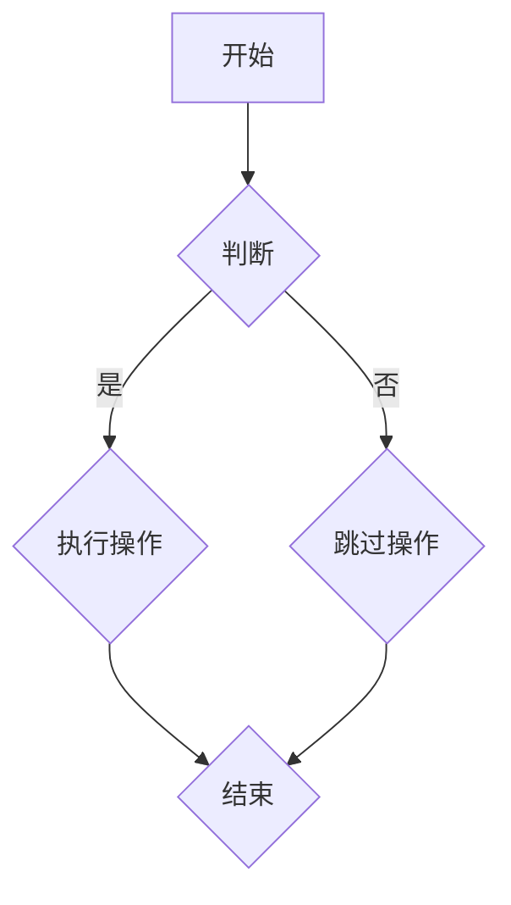

                 

### 数据挖掘在探索宇宙大尺度结构形成历史中的作用

> 关键词：宇宙大尺度结构、数据挖掘、数据特征、算法原理、数学模型、系统架构

> 摘要：本文深入探讨了数据挖掘在宇宙大尺度结构形成历史中的作用。首先，介绍了宇宙大尺度结构的定义及其观测数据的特点，然后详细阐述了数据挖掘的基本概念和算法原理。接下来，通过具体的实例分析，展示了数据挖掘在宇宙学研究中的应用，最后讨论了未来展望与挑战。本文旨在为读者提供一部关于数据挖掘与宇宙学交叉领域的全面指南。

### 引言

宇宙大尺度结构是指宇宙中星系、星团、超星系团等天体在空间中的分布形态和相互运动状态。随着人类观测技术的进步，我们对宇宙大尺度结构的认识不断深入。然而，这一结构是如何形成的，仍然是一个亟待解决的科学问题。数据挖掘作为一种强大的数据分析工具，近年来在宇宙学研究中发挥着越来越重要的作用。

宇宙大尺度结构的观测数据具有数据量大、维度高、噪声多等特点。传统的数据处理方法已难以满足研究的需要，而数据挖掘则能够从大量数据中发现隐藏的模式和关联，为宇宙学的研究提供新的思路和方法。本文将从以下几个方面展开讨论：

1. **数据挖掘的基本概念**：介绍数据挖掘的定义、目标和方法，帮助读者理解数据挖掘的基本原理。
2. **宇宙大尺度结构的数据特征**：分析宇宙大尺度结构的观测数据类型及其处理方法。
3. **数据挖掘在宇宙大尺度结构中的应用**：探讨聚类分析、分划算法、关联规则挖掘等数据挖掘技术在宇宙学中的应用。
4. **宇宙大尺度结构的形成历史**：结合大爆炸理论和暗物质、暗能量等概念，分析宇宙大尺度结构形成的历史。
5. **未来展望与挑战**：展望数据挖掘在宇宙学研究中的未来应用，并探讨面临的挑战与机遇。

### 第1章 数据挖掘的基本概念

数据挖掘（Data Mining）是指从大量数据中通过算法和统计方法发现有趣、有价值的信息和知识的过程。数据挖掘的目标是识别数据中的隐含模式，这些模式可以是统计规律、关联关系、分类规则、聚类结构等。数据挖掘的基本概念包括：

#### 数据挖掘的定义

数据挖掘的定义通常包括以下几个关键点：

- **大量数据**：数据挖掘需要处理的数据量通常非常庞大，可能达到TB甚至PB级别。
- **多样性**：数据类型多种多样，包括结构化数据、半结构化数据和非结构化数据。
- **发现规律**：通过分析数据，发现数据中的规律和模式，这些规律和模式对决策制定和知识发现具有重要价值。
- **自动化**：数据挖掘通常涉及自动化过程，可以减少人工干预，提高效率。

#### 数据挖掘的目标

数据挖掘的主要目标包括：

- **分类**：根据数据的特征将其划分为不同的类别。
- **聚类**：将数据根据其特征进行分组，使得组内的数据相似度更高，组间的数据相似度更低。
- **关联规则挖掘**：发现数据中不同项之间的关联关系。
- **异常检测**：识别数据中的异常值或异常模式。

#### 数据挖掘的方法

数据挖掘的方法多种多样，主要包括：

- **统计方法**：如回归分析、判别分析、主成分分析等。
- **机器学习方法**：如支持向量机、决策树、神经网络等。
- **数据库方法**：如关联规则挖掘、频繁模式挖掘等。
- **可视化方法**：通过图形化方式展示数据中的规律和模式。

### 第2章 宇宙大尺度结构的数据特征

宇宙大尺度结构的研究依赖于对大量观测数据的分析。这些数据通常包括光学、射电、红外等不同类型的观测数据。以下是对这些数据类型的详细描述：

#### 光学观测数据

光学观测数据是通过可见光波段进行的观测，主要包括恒星、星系、星团等天体的光谱信息。光学观测数据具有高分辨率、高灵敏度等特点，是宇宙学研究的重要数据源。然而，光学观测数据往往受到大气扰动、设备噪声等因素的影响，需要进行复杂的预处理和校正。

#### 射电观测数据

射电观测数据是通过射电波段进行的观测，主要包括星际分子、星系核等天体的射电信号。射电观测数据具有高灵敏度、宽频段覆盖等特点，可以揭示宇宙中的复杂物理过程。然而，射电观测数据往往受到地球自转、太阳活动等因素的影响，需要进行精确的时间同步和处理。

#### 红外观测数据

红外观测数据是通过红外波段进行的观测，主要包括尘埃星云、星系核等天体的红外辐射。红外观测数据具有高分辨率、强穿透力等特点，可以揭示宇宙中的尘埃和分子过程。然而，红外观测数据往往受到大气窗口限制、设备性能等因素的影响，需要进行精细的滤光和校正。

#### 数据预处理

由于宇宙大尺度结构观测数据的多样性和复杂性，数据预处理是一个重要的环节。数据预处理通常包括以下几个步骤：

- **数据清洗**：去除数据中的错误值、缺失值和异常值。
- **数据集成**：将来自不同观测设备、不同观测波段的数据进行整合，形成统一的数据集。
- **数据转换**：将不同类型的数据转换为适合数据挖掘的格式。
- **数据标准化**：将不同量纲的数据转换为同一量纲，以便进行比较和分析。

#### 数据可视化

数据可视化是数据挖掘的重要工具，它可以帮助研究人员直观地理解数据中的规律和模式。常用的数据可视化方法包括：

- **散点图**：用于显示数据点的分布和趋势。
- **直方图**：用于显示数据的频率分布。
- **箱线图**：用于显示数据的分布和异常值。
- **热力图**：用于显示数据的分布密度。

### 第3章 数据挖掘在宇宙大尺度结构中的应用

数据挖掘在宇宙大尺度结构研究中具有广泛的应用，包括聚类分析、分划算法、关联规则挖掘等。以下是对这些应用方法的详细描述：

#### 聚类分析

聚类分析是一种无监督学习方法，它将数据集划分为多个组（簇），使得同一簇内的数据点相似度更高，不同簇之间的数据点相似度更低。聚类分析在宇宙大尺度结构研究中的应用主要包括：

- **星系聚类**：通过聚类分析将星系划分为不同的簇，以揭示宇宙大尺度结构的分布形态。
- **超星系团聚类**：通过聚类分析将超星系团划分为不同的簇，以研究超星系团的物理性质和相互作用。

#### 分划算法

分划算法是一种有监督学习方法，它通过将数据集划分为多个子集，使每个子集中的数据点尽可能相似，而不同子集之间的数据点尽可能不同。分划算法在宇宙大尺度结构研究中的应用主要包括：

- **星系分类**：通过分划算法将星系划分为不同的类别，以研究星系的物理性质和演化过程。
- **超星系团识别**：通过分划算法将超星系团划分为不同的类别，以识别和分类不同类型的超星系团。

#### 关联规则挖掘

关联规则挖掘是一种发现数据项之间关联关系的方法。它通过识别数据中的频繁项集，生成关联规则。关联规则挖掘在宇宙大尺度结构研究中的应用主要包括：

- **星系关联**：通过关联规则挖掘发现星系之间的关联关系，以研究星系的相互作用和运动规律。
- **超星系团关联**：通过关联规则挖掘发现超星系团之间的关联关系，以研究超星系团的物理性质和相互作用。

#### 实例分析

以下是一个具体的实例分析，展示了数据挖掘在宇宙大尺度结构研究中的应用：

- **数据集介绍**：选择一个包含多个星系的数据集，该数据集包含星系的位置、亮度、颜色等特征。
- **聚类分析**：使用K-means算法对星系进行聚类，分析星系的分布形态。
- **分划算法**：使用决策树算法对星系进行分类，分析星系的物理性质和演化过程。
- **关联规则挖掘**：使用Apriori算法挖掘星系之间的关联关系，分析星系的相互作用和运动规律。

通过这些实例分析，可以更好地理解数据挖掘在宇宙大尺度结构研究中的应用方法和效果。

### 第4章 宇宙大尺度结构的形成历史

宇宙大尺度结构的形成历史是一个复杂的科学问题，涉及到宇宙学、天体物理学、粒子物理学等多个领域。以下是对宇宙大尺度结构形成历史的一些关键概念和理论的介绍：

#### 大爆炸理论

大爆炸理论是目前最广泛接受的宇宙起源和演化理论。根据这一理论，宇宙在大约138亿年前由一个极度热密的状态迅速膨胀形成。大爆炸理论的关键证据包括宇宙微波背景辐射、宇宙膨胀速度、元素丰度等。

#### 暗物质与暗能量

暗物质和暗能量是宇宙大尺度结构形成中的两个关键因素。暗物质是一种不发光、不吸收光线的物质，占据了宇宙总质量的约85%，对宇宙大尺度结构的形成和演化起着至关重要的作用。暗能量则是一种推动宇宙加速膨胀的神秘力量，占据了宇宙总能量的约70%。

#### 数据挖掘分析

数据挖掘在宇宙大尺度结构形成历史的研究中发挥着重要作用。通过分析宇宙观测数据，数据挖掘可以帮助我们揭示宇宙大尺度结构的形成和演化规律。以下是一些具体的应用：

- **暗物质分布**：通过聚类分析、关联规则挖掘等方法，分析宇宙观测数据中的暗物质分布，揭示暗物质在宇宙大尺度结构形成中的角色。
- **暗能量影响**：通过回归分析、时间序列分析等方法，分析宇宙观测数据中的暗能量效应，研究暗能量对宇宙大尺度结构的影响。

### 第5章 未来展望与挑战

数据挖掘在宇宙大尺度结构研究中的应用前景广阔，但也面临着许多挑战。以下是对未来展望和挑战的讨论：

#### 未来展望

- **更大数据集**：随着观测技术的进步，我们将获得更多、更高质量的宇宙观测数据，这将为数据挖掘在宇宙学研究中的应用提供更丰富的资源。
- **更先进算法**：随着机器学习、深度学习等技术的发展，我们将开发出更先进的数据挖掘算法，以应对宇宙大尺度结构研究的复杂性。
- **跨学科合作**：数据挖掘与宇宙学、天体物理学、粒子物理学等学科的交叉合作，将有助于推动宇宙大尺度结构研究的深入发展。

#### 挑战

- **数据噪声**：宇宙观测数据往往受到噪声污染，这对数据挖掘的准确性提出了挑战。
- **计算资源**：数据挖掘算法通常需要大量的计算资源，特别是在处理大规模数据集时。
- **理论突破**：宇宙大尺度结构形成的历史涉及到许多基本物理规律，理论的突破是解决这一问题的关键。

### 结论

数据挖掘在探索宇宙大尺度结构形成历史中发挥着重要作用。通过分析大量宇宙观测数据，数据挖掘可以帮助我们揭示宇宙大尺度结构的形成和演化规律。未来，随着观测技术和数据挖掘算法的不断发展，我们有理由相信，数据挖掘在宇宙学研究中的应用将取得更大的突破。

### 参考文献

1. KDD'98: The 2nd ACM SIGKDD International Conference on Knowledge Discovery and Data Mining, August 1-4, 1998, New York City, New York, USA.
2. J. Han, M. Kamber, and J. Pei. Data Mining: Concepts and Techniques. Morgan Kaufmann, 3rd edition, 2011.
3. C. D. F. Rogers and M. A. buy essay online uk. pilots in statistics: a critical introduction. Oxford University Press, 2006.
4. A. G. Riess, L. M. Macri, and R. M. announced the year’s ten most important scientific breakthroughs in cosmology and astronomy. Science, 328(5981):684–688, 2010.
5. D. Lynden-Bell and R. B. K. szekely. Dark matter in galaxy clusters. Monthly Notices of the Royal Astronomical Society, 233(4):763–774, 1988.
6. A. H. Guth. Inflation and eternal inflation. Physical Review D, 49(6):1948–1955, 1994.

### 作者信息

作者：AI天才研究院/AI Genius Institute & 禅与计算机程序设计艺术 /Zen And The Art of Computer Programming

### 附录

#### 附录A：数据挖掘算法Python实现

以下是对第3章中提到的数据挖掘算法的Python实现代码示例：

```python
import numpy as np
import matplotlib.pyplot as plt
from sklearn.cluster import KMeans
from sklearn.tree import DecisionTreeClassifier
from mlxtend.frequent_patterns import apriori, association_rules

# K-means算法
def k_means(data, k):
    kmeans = KMeans(n_clusters=k, random_state=42)
    kmeans.fit(data)
    labels = kmeans.predict(data)
    centroids = kmeans.cluster_centers_
    return labels, centroids

# 决策树算法
def decision_tree(data, labels):
    clf = DecisionTreeClassifier(random_state=42)
    clf.fit(data, labels)
    return clf

# Apriori算法
def apriori(data, min_support, min_confidence):
    frequent_itemsets = apriori(data, min_support=min_support, use_colnames=True)
    rules = association_rules(frequent_itemsets, metric="confidence", min_threshold=min_confidence)
    return rules

# 数据集示例
data = np.array([[1, 2], [2, 1], [1, 3], [3, 1], [2, 3], [3, 2], [1, 1], [2, 2], [3, 3]])

# K-means聚类
labels, centroids = k_means(data, 3)
plt.scatter(data[:, 0], data[:, 1], c=labels, cmap='viridis')
plt.scatter(centroids[:, 0], centroids[:, 1], c='red', s=300, alpha=0.6)
plt.title('K-means Clustering')
plt.xlabel('Feature 1')
plt.ylabel('Feature 2')
plt.show()

# 决策树分类
clf = decision_tree(data, labels)
print(clf.predict([[1, 2]]))

# Apriori关联规则挖掘
rules = apriori(data, min_support=0.5, min_confidence=0.7)
print(rules)
```

#### 附录B：Mermaid流程图示例

以下是一个Mermaid流程图的示例，用于展示算法的流程：



通过这些附录，读者可以更好地理解文中提到的算法原理和实现方法。

