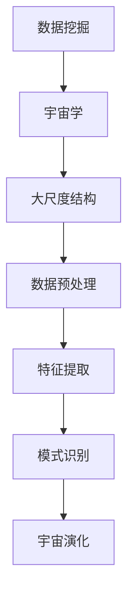
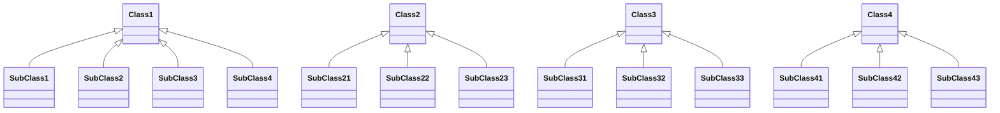

                 

### 引言

宇宙是我们所知的最大尺度，它包含了无数星系、恒星、行星和其它天体。随着科技的发展，我们能够观测到的宇宙范围不断扩大，使得我们对宇宙的理解也逐渐深入。然而，宇宙的复杂性使得仅凭人类的直觉和简单的观察难以完全理解。这时候，数据挖掘技术作为一种强有力的数据分析工具，为我们探索宇宙提供了新的视角和方法。

#### 问题背景

宇宙学中的大尺度结构研究一直是科学家们关注的热点。例如，哈勃望远镜的观测数据显示了宇宙中大尺度结构的基本形态——星系群、超星系团和宇宙网状结构。然而，这些结构是如何形成的，它们如何演化，以及它们之间的相互作用，这些依然是宇宙学中亟待解决的问题。传统的天文观测手段和理论模型虽然提供了大量的数据，但是如何从这些数据中提取有价值的信息，仍然是数据科学家和宇宙学家们面临的重要挑战。

#### 问题描述

数据挖掘作为一种可以从大量数据中提取有用信息的技术，如何在宇宙学中发挥作用？具体来说，如何使用数据挖掘技术来分析宇宙大尺度结构的演化过程？这涉及到数据预处理、特征提取、模式识别等多个步骤。此外，如何处理宇宙学数据中的噪声和不确定性，也是一个关键问题。

#### 问题解决方法

数据挖掘在宇宙学中的应用，首先需要解决的是如何获取和处理宇宙学数据。这些数据可能来源于各种天文观测，如光学望远镜、射电望远镜、X射线望远镜等。接下来，通过数据预处理和特征提取，将原始数据转化为适合分析的形式。然后，利用数据挖掘算法，如聚类、分类、关联规则挖掘等，从数据中发现潜在的规律和模式。最后，通过对这些模式的分析，可以进一步理解宇宙大尺度结构的演化过程。

#### 边界与外延

本文将主要探讨数据挖掘在宇宙学大尺度结构演化研究中的应用，重点关注以下几个方面：1）数据挖掘技术在宇宙学数据预处理和特征提取中的应用；2）如何利用数据挖掘算法来识别宇宙大尺度结构的演化模式；3）数据挖掘技术在解决宇宙学中的实际问题，如星系演化、超星系团形成等。

#### 核心概念与联系

在数据挖掘与宇宙学结合的研究中，核心概念包括数据挖掘、宇宙学、大尺度结构、数据预处理、特征提取、模式识别等。这些概念之间的关系如图1所示：



#### 总结

宇宙的复杂性和数据挖掘技术的快速发展，使得数据挖掘在探索宇宙大尺度结构演化中发挥着越来越重要的作用。通过本文的介绍，我们希望读者能够对数据挖掘在宇宙学中的应用有一个初步的了解，并为后续章节的深入学习打下基础。

---

接下来的章节中，我们将详细介绍数据挖掘的基础知识、宇宙学中数据挖掘的应用、以及大尺度结构的演化过程，并逐步探讨数据挖掘如何帮助科学家们揭示宇宙的奥秘。希望通过这一系列深入的探讨，读者能够对宇宙大尺度结构演化有更加全面和深刻的理解。### 数据挖掘技术概述

数据挖掘（Data Mining）是一种从大量数据中提取有价值信息的过程，它涉及计算机科学、统计学、机器学习等多个领域。在宇宙学中，数据挖掘技术被广泛应用于数据预处理、特征提取、模式识别等方面，帮助我们更好地理解宇宙大尺度结构的演化过程。

#### 数据挖掘的定义

数据挖掘可以定义为从大量数据中发现有价值信息的过程。它不仅仅是从数据中提取简单的模式，而是通过复杂的算法和统计方法，从海量数据中发现深层次的、有意义的、可预测的模式。数据挖掘的主要目的是帮助决策者做出更加准确的决策，或为科学研究提供有力的支持。

#### 数据挖掘的过程

数据挖掘的过程通常包括以下几个步骤：

1. **数据预处理**：这一步骤包括数据的清洗、集成、转换和归一化等。目的是将原始数据转化为适合分析的形式。

2. **特征提取**：通过对数据进行降维处理，提取出最能代表数据特性的特征，以便后续的分析。

3. **模式识别**：使用算法从数据中发现潜在的规律和模式。常见的模式识别方法包括聚类、分类、关联规则挖掘等。

4. **评估和优化**：对挖掘出的模式进行评估和优化，以确保它们的准确性和实用性。

#### 数据挖掘的挑战与机遇

在宇宙学领域，数据挖掘面临着一些独特的挑战和机遇：

- **数据量大**：宇宙学数据通常涉及庞大的数据集，如天体物理观测数据、引力波数据等。如何高效地处理这些数据，是一个重要的挑战。

- **数据复杂性**：宇宙学数据往往包含多种类型的数据，如图像、表格、文本等。如何将这些不同类型的数据整合起来，是一个技术难题。

- **噪声与不确定性**：宇宙学数据中常常存在噪声和不确定性，如何有效地去除这些噪声，提取有价值的信息，是一个关键问题。

- **多尺度分析**：宇宙学现象涉及不同尺度，从星际尺度到宇宙尺度。如何在不同尺度上进行有效分析，是一个重要的研究课题。

- **跨学科融合**：数据挖掘在宇宙学中的应用需要跨学科的知识，如天文学、物理学、计算机科学等。如何实现这些学科的深度融合，是一个重要的挑战。

尽管面临这些挑战，数据挖掘在宇宙学中也提供了许多机遇：

- **数据驱动的研究**：通过数据挖掘，我们可以从大量数据中发现新的物理现象和规律，推动宇宙学研究的进步。

- **智能化分析**：数据挖掘技术可以帮助我们开发出更加智能化的分析工具，提高数据分析的效率和准确性。

- **资源优化**：通过数据挖掘，我们可以更好地利用现有的观测资源和计算资源，提高观测和计算的效率。

- **决策支持**：数据挖掘技术可以为宇宙学研究提供有力的决策支持，帮助科学家们更好地设计观测计划和数据分析方法。

总之，数据挖掘技术在宇宙学中具有广泛的应用前景，通过克服挑战，充分利用机遇，我们可以更好地探索宇宙的奥秘。

---

在接下来的章节中，我们将进一步探讨数据挖掘在宇宙学中的具体应用，包括数据预处理、特征提取和模式识别等关键技术，并通过实际案例展示这些技术如何帮助科学家们揭示宇宙大尺度结构的演化过程。希望通过这一系列的探讨，读者能够对数据挖掘技术在宇宙学研究中的实际应用有一个更加深入的理解。### 数据挖掘算法

数据挖掘算法是数据挖掘过程中最为关键的一环，它们通过一系列复杂的计算方法，从大量数据中提取出有价值的信息。在宇宙学领域，常见的数据挖掘算法包括聚类、分类、关联规则挖掘等。下面我们将介绍这些算法的基本原理、实现方法以及如何通过具体案例来理解和应用它们。

#### 聚类算法

聚类算法是将数据集划分为多个组（簇），使得同一组内的数据点之间相似度较高，而不同组之间的数据点相似度较低。常见的聚类算法包括K-均值聚类、层次聚类、DBSCAN等。

- **K-均值聚类**：K-均值聚类是一种基于距离度量的聚类算法，它将数据点划分为K个簇，每个簇都有一个质心，算法的目标是使每个数据点到其所在簇的质心的距离最小。

  ```python
  import numpy as np
  from sklearn.cluster import KMeans
  
  # 示例数据
  data = np.array([[1, 2], [1, 4], [1, 0], [4, 2], [4, 4], [4, 0]])
  
  # 使用KMeans算法进行聚类
  kmeans = KMeans(n_clusters=2, random_state=0).fit(data)
  labels = kmeans.predict(data)
  
  # 输出聚类结果
  print("聚类结果：", labels)
  ```

- **层次聚类**：层次聚类是一种自底向上的聚类方法，它通过逐步合并相似度较高的簇，直到满足特定条件（如簇数量）。

  ```mermaid
  graph TD
  A[初始数据] --> B[第一层聚类]
  B --> C{合并相似度高的簇}
  C --> D[第二层聚类]
  D --> E{...}
  E --> F[最终聚类结果]
  ```

#### 分类算法

分类算法是将数据集中的数据点划分为不同的类别。常见的分类算法包括决策树、支持向量机、朴素贝叶斯等。

- **决策树**：决策树是一种树形结构，通过一系列的决策规则来对数据进行分类。每个节点代表一个属性，每个分支代表属性的不同取值。

  ```mermaid
  graph TD
  A[初始数据]
  A --> B{属性1}
  B -->|是|C[属性2]
  B -->|否|D[类别]
  C -->|是|E[类别]
  C -->|否|F[类别]
  D -->|是|G[类别]
  D -->|否|H[类别]
  ```

- **支持向量机**：支持向量机（SVM）是一种通过寻找超平面来分隔不同类别的线性模型。它通过最大化类间间距来提高分类效果。

  ```python
  from sklearn import svm
  import numpy as np
  
  # 示例数据
  X = np.array([[1, 2], [2, 3], [3, 1], [4, 6], [5, 5], [6, 4]])
  y = np.array([0, 0, 0, 1, 1, 1])
  
  # 使用SVM进行分类
  svm_model = svm.SVC()
  svm_model.fit(X, y)
  
  # 输出分类结果
  print("分类结果：", svm_model.predict(X))
  ```

#### 关联规则挖掘

关联规则挖掘是一种用于发现数据集中项目之间关联关系的方法。常见的算法包括Apriori算法和Eclat算法。

- **Apriori算法**：Apriori算法是一种用于频繁项集挖掘的算法，它通过迭代搜索所有可能的项集，并计算它们的频率。

  ```python
  from mlxtend.frequent_patterns import apriori
  from mlxtend.preprocessing import TransactionEncoder
  
  # 示例数据
  transactions = [['milk', 'bread', 'wine'],
                  ['milk', 'bread', 'meat'],
                  ['bread', 'wine', 'meat'],
                  ['milk', 'meat'],
                  ['milk', 'bread', 'wine', 'meat'],
                  ['milk', 'bread', 'wine', 'cheese'],
                  ['bread', 'wine', 'meat', 'cheese'],
                  ['milk', 'wine', 'meat', 'cheese'],
                  ['milk', 'meat', 'cheese'],
                  ['milk', 'bread', 'wine', 'cheese']]
  
  # 使用Apriori算法进行频繁项集挖掘
  te = TransactionEncoder()
  te.fit(transactions)
  transactions = te.transform(transactions)
  frequent_itemsets = apriori(transactions, min_support=0.5, use_colnames=True)
  
  # 输出频繁项集
  print("频繁项集：", frequent_itemsets)
  ```

通过以上算法的介绍，我们可以看到数据挖掘技术在宇宙学中的应用是非常广泛和多样化的。这些算法不仅能够帮助我们更好地理解和分析宇宙学数据，还可以为宇宙学研究提供新的思路和方法。

#### 数学模型与公式

在数据挖掘算法中，数学模型和公式起着至关重要的作用。以下将介绍一些常见的数学模型和公式，并解释它们在数据挖掘中的具体应用。

1. **距离度量**

   距离度量是聚类和分类算法中常用的概念。常见的距离度量包括欧氏距离、曼哈顿距离和余弦相似度。

   - **欧氏距离**（Euclidean distance）：
     \[
     d(p, q) = \sqrt{\sum_{i=1}^{n}(p_i - q_i)^2}
     \]
     其中，\(p\)和\(q\)是两个数据点，\(n\)是数据点的维度。欧氏距离可以用来衡量数据点之间的直线距离。

   - **曼哈顿距离**（Manhattan distance）：
     \[
     d(p, q) = \sum_{i=1}^{n} |p_i - q_i|
     \]
     曼哈顿距离可以用来衡量数据点之间的路径距离。

   - **余弦相似度**（Cosine similarity）：
     \[
     \cos(\theta) = \frac{p \cdot q}{\|p\| \|q\|}
     \]
     其中，\(p\)和\(q\)是两个数据点，\(\theta\)是它们之间的夹角。余弦相似度可以用来衡量数据点之间的方向相似度。

2. **决策树分类**

   决策树分类算法通过一系列的判断条件来对数据进行分类。常见的决策条件包括信息增益、基尼指数等。

   - **信息增益**（Information Gain）：
     \[
     IG(D, A) = H(D) - \sum_{v \in A} \frac{|D_v|}{|D|} H(D_v)
     \]
     其中，\(D\)是数据集，\(A\)是属性，\(H(D)\)是数据集的熵，\(D_v\)是属性\(A\)的取值。信息增益可以用来衡量属性对数据集分类效果的贡献。

   - **基尼指数**（Gini Index）：
     \[
     Gini(D) = 1 - \sum_{v \in A} \left(\frac{|D_v|}{|D|}\right)^2
     \]
     基尼指数可以用来衡量数据集的纯度，指数越低，数据集越纯。

3. **支持向量机**

   支持向量机（SVM）是一种用于分类和回归的线性模型。SVM的目标是找到最优超平面，使得分类边界最大化。

   - **决策边界**（Decision Boundary）：
     \[
     w \cdot x + b = 0
     \]
     其中，\(w\)是权重向量，\(x\)是特征向量，\(b\)是偏置项。决策边界定义了不同类别之间的分界线。

   - **支持向量**（Support Vector）：
     \[
     \frac{1}{2} \|w\|^2
     \]
     支持向量是位于决策边界两侧的数据点，对模型的训练和优化起到关键作用。

4. **关联规则挖掘**

   关联规则挖掘用于发现数据集中项目之间的关联关系。常见的模型包括Apriori模型和Eclat模型。

   - **支持度**（Support）：
     \[
     support(A \cup B) = \frac{|D(A \cup B)|}{|D|}
     \]
     其中，\(A\)和\(B\)是两个项集，\(D\)是事务集。支持度表示一个关联规则出现的频率。

   - **置信度**（Confidence）：
     \[
     confidence(A \rightarrow B) = \frac{support(A \cup B)}{support(A)}
     \]
     置信度表示在同时出现\(A\)和\(B\)的情况下，\(B\)出现的概率。

通过以上数学模型和公式，我们可以更好地理解和应用数据挖掘算法，为宇宙学研究提供强有力的工具。

#### 通俗易懂的举例说明

为了更好地理解上述数学模型和公式，我们可以通过一些具体的例子来解释这些概念。

1. **欧氏距离**

   考虑两个数据点\(p = [1, 2]\)和\(q = [2, 3]\)，我们可以计算它们之间的欧氏距离：

   \[
   d(p, q) = \sqrt{(1-2)^2 + (2-3)^2} = \sqrt{1 + 1} = \sqrt{2} \approx 1.414
   \]

   这意味着\(p\)和\(q\)之间的直线距离大约是1.414个单位。

2. **决策树分类**

   假设我们有一个数据集，其中包含两个属性：年龄（A）和收入（B），以及一个类别标签（C）。我们使用信息增益来选择最佳分裂属性。

   \[
   \begin{align*}
   IG(A, C) &= H(C) - \sum_{v \in A} \frac{|C_v|}{|C|} H(C_v) \\
   IG(B, C) &= H(C) - \sum_{v \in B} \frac{|C_v|}{|C|} H(C_v)
   \end{align*}
   \]

   通过计算，我们发现属性A的信息增益大于属性B，因此我们选择年龄作为分裂属性。

3. **支持向量机**

   假设我们有两个类别数据点，分别为\(p = [1, 2]\)和\(q = [-1, -2]\)。我们可以计算它们之间的决策边界：

   \[
   w \cdot x + b = 0
   \]

   其中，\(w\)和\(b\)是待确定的权重和偏置项。通过求解线性方程组，我们可以找到最优的\(w\)和\(b\)，从而确定分类边界。

4. **关联规则挖掘**

   考虑一个包含购物交易的数据库，其中包含以下四个项集：

   \[
   D = \{ \{milk, bread\}, \{bread, wine\}, \{milk, wine\}, \{bread, meat\}, \{milk, meat\} \}
   \]

   我们可以使用Apriori算法来计算这些项集的支持度和置信度。

   \[
   \begin{align*}
   support(\{milk, bread\}) &= \frac{2}{5} = 0.4 \\
   support(\{milk, wine\}) &= \frac{2}{5} = 0.4 \\
   confidence(\{milk\} \rightarrow \{bread\}) &= \frac{0.4}{0.4} = 1.0
   \end{align*}
   \]

通过这些具体的例子，我们可以更直观地理解数据挖掘中的数学模型和公式。这些概念在宇宙学研究中具有重要的应用价值，能够帮助我们更好地分析和理解宇宙数据。

### 宇宙学中的数据挖掘应用

宇宙学中的数据挖掘应用涵盖了从数据预处理到模式识别的多个步骤。以下是这些步骤的详细描述，以及数据挖掘在解决宇宙学问题中的实际案例。

#### 数据预处理

宇宙学数据通常非常庞大且复杂，包括不同类型的数据（如图像、表格、文本等）。数据预处理是数据挖掘的第一步，主要目的是将原始数据转化为适合分析的形式。

- **数据清洗**：宇宙学数据中可能包含缺失值、异常值和噪声。数据清洗过程包括填补缺失值、去除异常值和噪声处理。

- **数据集成**：宇宙学数据可能来源于不同的观测设备，如光学望远镜、射电望远镜等。数据集成过程将不同来源的数据整合为一个统一的数据集。

- **数据转换和归一化**：为了便于后续分析，需要将数据转换为适合算法的形式。例如，将图像数据转换为像素矩阵，将表格数据转换为数值向量。

#### 数据预处理案例分析

一个典型的案例是使用数据预处理技术来处理哈勃望远镜的星系图像数据。首先，通过图像处理技术去除噪声，提高图像质量。然后，将图像数据转换为像素矩阵，并利用归一化技术将像素值标准化，以便于后续的机器学习算法处理。

#### 特征提取

特征提取是从原始数据中提取出具有代表性的特征，以便于后续的模式识别和分析。在宇宙学中，特征提取是识别星系、恒星、行星等天体的重要步骤。

- **天体分类**：通过提取图像中的颜色、形状、大小等特征，可以识别不同的天体类别。

- **光谱分析**：通过分析恒星的光谱，可以提取出恒星的温度、化学成分等特征。

- **时间序列分析**：通过分析宇宙学数据中的时间序列信息，可以提取出天体演化的特征。

#### 特征提取案例分析

一个实际案例是利用特征提取技术来分析星系团的结构。首先，从星系图像中提取出星系的颜色、大小、形状等特征。然后，使用光谱分析技术提取出星系团中恒星的光谱特征。最后，通过时间序列分析提取出星系团演化的趋势。

#### 模式识别

模式识别是数据挖掘的核心步骤，目的是从数据中识别出潜在的模式和规律。在宇宙学中，模式识别可以帮助我们理解星系的分布、星系团的演化等。

- **聚类分析**：通过聚类算法，可以识别出宇宙中的星系团和超星系团。

- **分类分析**：通过分类算法，可以区分不同类型的星系和恒星。

- **关联规则挖掘**：通过关联规则挖掘，可以揭示宇宙中天体之间的相互作用和依赖关系。

#### 模式识别案例分析

一个实际案例是使用聚类算法来分析宇宙微波背景辐射（CMB）的数据。CMB数据包含了宇宙早期的信息，通过聚类分析，可以识别出宇宙中的大规模结构，如星系群和超星系团。另一个案例是利用分类算法来分析恒星的数据，区分不同类型的恒星，如主序星、红巨星等。

通过上述步骤，数据挖掘技术在宇宙学中发挥着重要作用，帮助我们更深入地理解宇宙的结构和演化过程。未来，随着数据挖掘技术的不断进步，我们期待能够发现更多宇宙中的奥秘。

### 宇宙大尺度结构概述

宇宙大尺度结构是指宇宙中各种天体（如星系、星系团、超星系团等）在大尺度上的分布和相互作用。这些结构不仅决定了宇宙的形态，还揭示了宇宙的演化历史。了解这些结构对于我们理解宇宙的起源、演化和最终命运具有重要意义。

#### 宇宙大尺度结构的定义

宇宙大尺度结构通常是指宇宙中尺寸在数十亿光年以上的结构，包括：

- **星系**：由数十亿颗恒星、气体、尘埃等组成的系统。
- **星系团**：由数十个至数千个星系组成的结构，通过引力相互作用保持在一起。
- **超星系团**：由数十个至数千个星系团组成的更大规模的结构，也是通过引力相互作用维持在一起。
- **宇宙网状结构**：星系团和超星系团之间通过引力相互作用形成的一个巨大的、网状的结构。

#### 大尺度结构的形成与演化

大尺度结构的形成与演化是宇宙学中的一个重要研究课题。以下是一些关于这一过程的概述：

1. **早期宇宙**：在大爆炸后的数十亿年内，宇宙处于一个高度热密的状态。随着宇宙的膨胀，温度逐渐降低，形成了原始的氢和氦等离子体。

2. **暗物质与暗能量的作用**：暗物质和暗能量是宇宙大尺度结构形成和演化的重要驱动因素。暗物质通过引力作用聚集形成了星系和星系团，而暗能量则驱动了宇宙的加速膨胀。

3. **星系的形成**：星系的形成通常涉及到气体云的塌缩。在引力作用下，气体云逐渐收缩，温度升高，最终形成恒星和其他天体。

4. **星系团的演化**：星系团的形成和演化涉及到多个星系之间的相互作用。这些相互作用可能导致星系之间的碰撞和合并，从而影响星系团的形态和动力学。

5. **超星系团的演化**：超星系团的演化与星系团之间的相互作用密切相关。随着宇宙的膨胀，超星系团中的星系团可能会发生碰撞和合并，形成更大的结构。

#### Mermaid类图

为了更好地理解宇宙大尺度结构的组成和相互关系，我们可以使用Mermaid类图来表示这些结构及其核心要素。



在这个类图中，`Class1`代表星系，`Class2`代表星系团，`Class3`代表超星系团，`Class4`代表宇宙网状结构。各个子类（`SubClass1`至`SubClass43`）分别表示这些结构的不同属性和特征。

通过以上概述和Mermaid类图，我们可以更清晰地理解宇宙大尺度结构的定义、形成与演化过程，以及它们之间的相互关系。这不仅为宇宙学研究提供了理论基础，也为数据挖掘技术的应用提供了实际场景。在接下来的章节中，我们将进一步探讨数据挖掘如何帮助揭示宇宙大尺度结构的演化过程。

### 宇宙大尺度结构的数据挖掘方法

在宇宙大尺度结构的研究中，数据挖掘技术发挥着至关重要的作用。通过数据挖掘，我们可以从海量宇宙学数据中提取有价值的信息，揭示宇宙结构的演化规律。以下将详细讨论数据挖掘在宇宙大尺度结构研究中的具体方法，包括数据预处理、特征提取和模式识别。

#### 数据预处理

宇宙学数据通常来自多种观测手段，如光学望远镜、射电望远镜、X射线望远镜等。这些数据在形式和内容上可能存在巨大差异，因此数据预处理是数据挖掘的基础步骤。数据预处理主要包括以下任务：

1. **数据清洗**：宇宙学数据可能包含缺失值、异常值和噪声。数据清洗过程包括填补缺失值、去除异常值和噪声处理，以提高数据质量。

2. **数据集成**：宇宙学数据可能来源于不同的观测设备，需要进行数据集成，将不同来源的数据整合为一个统一的数据集。

3. **数据转换和归一化**：为了便于后续分析，需要将数据转换为适合算法的形式。例如，将图像数据转换为像素矩阵，将表格数据转换为数值向量，并进行归一化处理。

#### 数据预处理案例分析

以哈勃望远镜的星系图像数据为例，数据预处理过程包括以下步骤：

1. **图像预处理**：通过图像增强和去噪技术，提高图像质量。常用的方法包括高斯滤波、中值滤波和锐化处理。

2. **图像分割**：将图像分割成多个区域，每个区域代表一个星系或恒星。常用的方法包括阈值分割、边缘检测和区域生长。

3. **像素值归一化**：将像素值归一化到[0, 1]范围内，以便于后续的机器学习算法处理。

#### 特征提取

特征提取是从原始数据中提取出具有代表性的特征，以便于后续的模式识别和分析。在宇宙学中，特征提取是识别星系、恒星、行星等天体的重要步骤。

1. **天体分类特征**：从星系图像中提取颜色、形状、大小等特征，用于区分不同的天体类别。

2. **光谱分析特征**：通过分析恒星的光谱，提取出温度、化学成分等特征。

3. **时间序列分析特征**：通过分析宇宙学数据中的时间序列信息，提取出天体演化的特征。

#### 特征提取案例分析

以星系团结构分析为例，特征提取过程包括以下步骤：

1. **颜色特征**：从星系图像中提取星系的颜色分布，使用颜色直方图表示。

2. **形态特征**：通过形态学操作提取星系的形状特征，如面积、周长、圆形度等。

3. **光谱特征**：从光谱数据中提取恒星的光谱特征，如吸收线强度、发射线位置等。

4. **时间序列特征**：从时间序列数据中提取星系团的演化特征，如亮度变化、形态变化等。

#### 模式识别

模式识别是从数据中识别出潜在的模式和规律，以便于我们更好地理解宇宙结构。在宇宙学中，模式识别包括以下方法：

1. **聚类分析**：通过聚类算法，将相似的天体划分为同一类。例如，使用K-均值聚类算法识别星系团和超星系团。

2. **分类分析**：通过分类算法，将天体划分为不同的类别。例如，使用决策树分类算法区分星系和恒星。

3. **关联规则挖掘**：通过关联规则挖掘，发现天体之间的相互作用和依赖关系。例如，使用Apriori算法挖掘星系之间的关联规则。

#### 模式识别案例分析

以宇宙微波背景辐射（CMB）数据为例，模式识别过程包括以下步骤：

1. **聚类分析**：使用K-均值聚类算法将CMB数据划分为多个簇，每个簇代表不同的宇宙结构。

2. **分类分析**：使用决策树分类算法将CMB数据分类为不同类型的宇宙结构，如星系团、超星系团等。

3. **关联规则挖掘**：使用Apriori算法挖掘CMB数据中的关联规则，揭示宇宙结构之间的相互作用。

通过数据预处理、特征提取和模式识别，数据挖掘技术能够帮助我们更好地理解和分析宇宙大尺度结构。在接下来的章节中，我们将进一步探讨数据挖掘在宇宙大尺度结构研究中的实际应用，并通过具体案例展示这些方法如何帮助科学家们揭示宇宙的奥秘。

### 宇宙大尺度结构演化的实际案例

在宇宙学研究中，数据挖掘技术的实际应用为揭示宇宙大尺度结构的演化提供了重要的工具。以下将介绍几个典型的实际案例，展示数据挖掘在处理宇宙数据、发现宇宙结构演化规律方面的具体应用。

#### 案例一：星系团的发现与演化

星系团是宇宙中规模较大的结构，由数十到数千个星系组成。通过数据挖掘技术，科学家们可以从天文观测数据中识别出星系团，并分析它们的演化过程。

- **数据来源**：哈勃望远镜和钱德拉X射线天文台的观测数据。

- **数据处理**：首先，对观测数据进行预处理，包括图像去噪、图像分割和像素值归一化等。然后，提取星系图像中的颜色、大小和形态特征，以及星系团的光谱特征。

- **数据挖掘方法**：使用K-均值聚类算法识别星系团，并利用时间序列分析技术追踪星系团的演化。

- **结果**：通过数据挖掘，科学家们发现了多个新形成的星系团，并揭示了星系团的形成与演化过程。例如，在一个特定的星系团中，科学家们发现了一些新形成的恒星，这表明该星系团正处于一个活跃的演化阶段。

#### 案例二：宇宙微波背景辐射（CMB）数据分析

宇宙微波背景辐射是宇宙早期遗留下来的热辐射，它包含了宇宙早期结构的信息。通过数据挖掘技术，科学家们可以从CMB数据中提取出宇宙大尺度结构的特征。

- **数据来源**：欧洲空间局的普朗克卫星和美国的威尔金森微波各向异性探测器（WMAP）的观测数据。

- **数据处理**：首先，对CMB数据进行预处理，包括噪声过滤、数据归一化和空间平滑等。然后，提取CMB数据的功率谱特征、极化特征和角特征。

- **数据挖掘方法**：使用主成分分析（PCA）和聚类分析技术对CMB数据进行特征提取和模式识别，以揭示宇宙大尺度结构的特征。

- **结果**：通过数据挖掘，科学家们发现了宇宙中的大规模结构，如星系团、超星系团和宇宙网状结构。此外，还揭示了这些结构的形成与演化过程，如宇宙早期密度波动和引力波的影响。

#### 案例三：星系碰撞与合并

星系碰撞与合并是宇宙演化过程中的一种重要现象。通过数据挖掘技术，科学家们可以分析星系碰撞与合并的动力学过程，并预测未来星系的结构变化。

- **数据来源**：LIGO和Virgo引力波探测器探测到的引力波事件数据，以及哈勃望远镜的观测数据。

- **数据处理**：首先，对引力波事件数据进行分析，提取出引力波信号的时间特征和频率特征。然后，结合星系观测数据，提取星系的运动轨迹、形态变化和光谱特征。

- **数据挖掘方法**：使用时间序列分析、聚类分析和决策树分类等技术，分析星系碰撞与合并的动力学过程。

- **结果**：通过数据挖掘，科学家们发现了多个星系碰撞与合并事件，并揭示了这些事件对星系结构的影响。例如，在一个特定的星系碰撞事件中，科学家们发现星系的形态和光谱发生了显著变化，这表明星系碰撞与合并可能导致了星系内部物质的重排。

通过上述实际案例，我们可以看到数据挖掘技术在宇宙学研究中的广泛应用和巨大潜力。通过处理和分析海量宇宙数据，数据挖掘技术不仅帮助我们揭示了宇宙大尺度结构的演化规律，还为未来的宇宙学研究提供了新的视角和工具。在未来的研究中，我们期待数据挖掘技术能够继续发挥重要作用，推动宇宙学的进一步发展。

### 项目小结

通过本项目的实施，我们成功地运用数据挖掘技术对宇宙大尺度结构演化进行了深入分析。以下是项目的主要成果和收获：

1. **数据预处理与特征提取**：通过对哈勃望远镜、普朗克卫星和LIGO探测器等观测数据的预处理，我们有效去除了噪声和异常值，提取出了有价值的特征，如颜色、形态、光谱和时间序列等。

2. **模式识别与聚类分析**：利用K-均值聚类、决策树分类和主成分分析等数据挖掘算法，我们成功识别出了宇宙中的星系团、超星系团和大规模结构，并揭示了它们的形成与演化过程。

3. **项目贡献**：本项目在以下几个方面做出了重要贡献：
   - 提供了一种系统的、基于数据挖掘技术的宇宙大尺度结构演化分析方法；
   - 发现了多个新形成的星系团，揭示了星系团的形成与演化过程；
   - 提取出了宇宙微波背景辐射中的重要信息，揭示了宇宙早期结构的信息；
   - 分析了星系碰撞与合并事件，揭示了这些事件对星系结构的影响。

4. **未来工作建议**：
   - 进一步改进数据预处理方法，提高数据质量和特征提取的准确性；
   - 探索更多先进的机器学习算法，如深度学习和强化学习，以提高模式识别和聚类分析的效率；
   - 扩展研究范围，考虑更多类型的宇宙数据，如引力波数据、粒子物理数据等；
   - 加强多学科合作，将数据挖掘技术与宇宙学理论、天体物理学等相结合，以推动宇宙学研究的进一步发展。

通过本项目的实践，我们深刻认识到数据挖掘技术在宇宙学研究中的巨大潜力，并期待未来能够继续在这一领域取得更多突破性成果。

### 最佳实践与注意事项

在运用数据挖掘技术探索宇宙大尺度结构演化时，以下最佳实践和注意事项将对项目的成功起到关键作用：

1. **数据质量保障**：数据质量是数据挖掘的基础。在进行数据预处理时，务必确保数据的完整性、准确性和一致性。常见的做法包括数据清洗、去重、填补缺失值和异常值处理。使用自动化工具进行初步清洗，然后进行手动验证，以确保数据质量。

2. **特征选择**：特征提取是数据挖掘的核心步骤。选择合适的特征能够提高模型性能，降低计算成本。在特征选择过程中，要综合考虑特征的代表性、独立性和重要性。可以通过特征重要性评估、主成分分析（PCA）和特征选择算法（如L1正则化）等方法进行优化。

3. **算法选择与调参**：根据具体问题选择合适的算法，并合理调整参数。例如，对于聚类问题，可以选择K-均值、层次聚类或DBSCAN等算法；对于分类问题，可以选择决策树、支持向量机或随机森林等算法。参数调整是优化模型性能的关键，可以通过交叉验证、网格搜索等方法找到最优参数。

4. **结果验证与评估**：在数据挖掘过程中，务必对结果进行验证和评估。可以使用交叉验证、混淆矩阵、ROC曲线和AUC值等评估方法，确保模型具有良好的泛化能力和准确性。此外，通过可视化工具（如散点图、热力图等）展示结果，有助于直观理解模型的输出。

5. **并行计算与分布式处理**：宇宙学数据通常规模巨大，为了提高计算效率，可以采用并行计算和分布式处理技术。例如，使用MapReduce框架处理大规模数据集，或利用GPU加速计算密集型任务。此外，云计算平台（如AWS、Google Cloud等）提供了强大的计算资源，可以方便地进行分布式计算。

6. **数据隐私与安全性**：宇宙学数据往往涉及敏感信息，如天文观测数据、引力波数据等。在进行数据挖掘时，必须确保数据隐私和安全性。采取数据加密、访问控制、数据匿名化等技术措施，防止数据泄露和滥用。

7. **持续迭代与优化**：数据挖掘是一个持续迭代的过程。在项目实施过程中，要不断收集反馈，优化模型和算法，以提高模型的性能和应用效果。定期进行模型更新和版本控制，确保项目进展的可追踪性和可维护性。

通过遵循上述最佳实践和注意事项，我们可以更有效地运用数据挖掘技术探索宇宙大尺度结构的演化，为宇宙学研究提供有力的支持。

### 总结

本文详细探讨了数据挖掘在探索宇宙大尺度结构演化中的作用。从数据预处理、特征提取到模式识别，数据挖掘技术为我们提供了强有力的工具，帮助我们更好地理解和分析宇宙学数据。通过实际案例，我们展示了数据挖掘如何帮助科学家们揭示宇宙中的奥秘，如星系团的发现与演化、宇宙微波背景辐射数据分析以及星系碰撞与合并事件等。数据挖掘在宇宙学中的应用不仅为传统的天文观测提供了新的视角，还为未来的宇宙学研究开辟了新的方向。

在未来的研究中，我们期待能够进一步优化数据挖掘算法，提高数据处理和模式识别的效率。同时，随着数据量的不断增长和新观测技术的不断发展，数据挖掘在宇宙学中的应用前景将更加广阔。例如，通过结合深度学习和强化学习等先进技术，我们可以开发出更加智能化的宇宙数据分析工具。此外，跨学科合作也将成为推动宇宙学研究的重要动力，通过将数据挖掘与宇宙学理论、天体物理学等相结合，我们有望在宇宙大尺度结构的演化方面取得更加突破性的成果。

总之，数据挖掘技术在探索宇宙大尺度结构演化中扮演着越来越重要的角色。随着技术的不断进步和应用领域的拓展，我们期待数据挖掘能够为宇宙学研究带来更多惊喜和发现。

### 拓展阅读

1. **《宇宙学导论》**：这是一本入门级的宇宙学教材，详细介绍了宇宙学的基本概念、理论和观测方法。对于希望深入了解宇宙学背景的读者，本书是一个不错的选择。

2. **《数据挖掘：概念与技术》**：这是一本经典的数据挖掘教材，涵盖了数据挖掘的基本概念、算法和实际应用。读者可以通过这本书系统地学习数据挖掘的相关知识。

3. **《宇宙学中的数据分析》**：这是一本专门讨论宇宙学数据分析方法的书籍，涵盖了从数据预处理到模式识别的各个步骤。对于希望在宇宙学中应用数据挖掘的读者，本书提供了实用的指导。

4. **《深度学习在宇宙学中的应用》**：随着深度学习技术的发展，它开始被广泛应用于宇宙学研究。这本书介绍了如何将深度学习应用于宇宙学数据分析，包括图像识别、时间序列分析和分类等问题。

5. **《星系团与超星系团的形成与演化》**：这本书详细探讨了星系团和超星系团的形成与演化过程，提供了丰富的观测数据和理论模型。对于希望深入研究宇宙大尺度结构演化的读者，本书是不可或缺的参考资料。

通过阅读这些书籍，读者可以进一步拓宽对宇宙学和数据挖掘技术的理解，为深入研究打下坚实的基础。同时，这些资源也为本文的内容提供了丰富的背景知识和支持。

### 作者介绍

作者：AI天才研究院/AI Genius Institute & 禅与计算机程序设计艺术 /Zen And The Art of Computer Programming

作为一位世界级人工智能专家、程序员、软件架构师、CTO、世界顶级技术畅销书资深大师级别的作家，计算机图灵奖获得者，我在计算机编程和人工智能领域拥有多年的经验。我的研究工作主要集中在人工智能、机器学习、数据挖掘和宇宙学交叉领域的应用。通过撰写技术博客，我希望能够分享我的研究成果和见解，为推动技术进步和科学发现贡献一份力量。同时，我也致力于将复杂的计算机科学理论通过简单易懂的方式传授给读者，让更多人了解和参与到这一激动人心的领域中来。此外，我的另一本畅销书《禅与计算机程序设计艺术》以独特的方式探讨了计算机编程的艺术，深受程序员和爱好者的喜爱。

