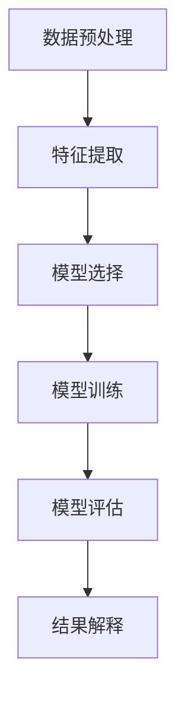
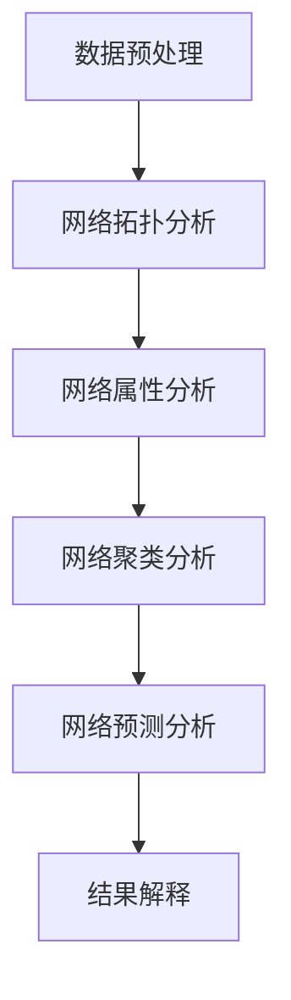

                 

# 数据挖掘在探索宇宙暗物质粒子相互作用网络特性中的作用

> 关键词：数据挖掘，宇宙，暗物质，粒子相互作用，网络特性

> 摘要：本文旨在探讨数据挖掘在宇宙暗物质粒子相互作用网络特性研究中的作用。通过介绍数据挖掘的基本概念和暗物质粒子相互作用的研究背景，我们将详细分析数据挖掘在暗物质探测中的具体应用，包括数据预处理、特征提取和模式识别等步骤。此外，本文还将探讨粒子相互作用网络特性分析的方法和挑战，结合实际案例进行详细解析，并展望未来数据挖掘在宇宙暗物质研究中的发展方向。

## 引言

### 1.1 问题的背景与意义

宇宙的神秘与宏大一直吸引着人类的探索欲望。然而，宇宙中存在大量的暗物质，其质量巨大但无法直接观测，这成为宇宙学研究中的一个重大难题。暗物质粒子相互作用的研究对于理解宇宙的起源、演化和结构具有重要意义。

数据挖掘作为一种从大量数据中提取有价值信息的技术，为暗物质粒子相互作用的研究提供了强有力的工具。通过数据挖掘技术，科学家可以分析大量宇宙观测数据，识别出暗物质粒子的相互作用模式，从而揭示宇宙的奥秘。

### 1.2 暗物质和粒子物理概述

暗物质是宇宙中一种看不见的物质，其质量巨大但无法直接观测。暗物质粒子相互作用的研究主要涉及暗物质粒子的物理特性、相互作用机制和宇宙学背景。

粒子物理是研究基本粒子和它们相互作用的科学。粒子相互作用是宇宙中各种现象的基础，包括宇宙大爆炸、星系形成和恒星演化等。

### 1.3 数据挖掘技术的作用与价值

数据挖掘技术通过分析大量数据，可以提取出隐藏在数据中的模式和知识，为科学家提供新的视角和研究思路。在暗物质粒子相互作用的研究中，数据挖掘技术具有以下作用和价值：

1. **数据预处理**：宇宙观测数据通常包含噪声和缺失值，数据挖掘技术可以帮助处理这些数据，提高数据质量。

2. **特征提取**：通过数据挖掘技术，可以从观测数据中提取出与暗物质粒子相互作用相关的特征，为后续分析提供基础。

3. **模式识别**：数据挖掘技术可以帮助科学家识别出暗物质粒子相互作用的模式，为理解宇宙的演化提供线索。

4. **预测和推理**：基于历史数据，数据挖掘技术可以预测暗物质粒子的未来行为，为宇宙学研究提供新的方向。

### 1.4 书籍结构概述

本文将分为六个主要部分：

1. **引言**：介绍问题的背景、意义和研究目标。
2. **数据挖掘基础知识**：介绍数据挖掘的基本概念、技术和流程。
3. **暗物质和粒子物理概述**：介绍暗物质和粒子物理的基本概念、研究和现状。
4. **数据挖掘在暗物质研究中的应用**：分析数据挖掘在暗物质研究中的应用和挑战。
5. **粒子相互作用网络特性分析**：探讨粒子相互作用网络特性分析的方法和挑战。
6. **未来展望**：展望数据挖掘在暗物质研究中的未来发展。

## 第二部分：数据挖掘基础知识

### 2.1 数据挖掘的基本概念

数据挖掘是指从大量数据中提取有价值信息的过程。数据挖掘的目标是发现数据中的模式和知识，这些模式和知识可以用于预测、决策和支持发现。

### 2.2 数据挖掘的目标

数据挖掘的目标可以分为以下几类：

1. **描述性挖掘**：通过分析数据，描述数据的一般特征和趋势。
2. **诊断性挖掘**：通过分析数据，找出数据中的异常和原因。
3. **预测性挖掘**：通过分析历史数据，预测未来的趋势和行为。
4. **聚类挖掘**：将数据分成不同的组，每组具有相似的特征。
5. **关联规则挖掘**：找出数据中不同属性之间的关联关系。

### 2.3 数据挖掘的流程

数据挖掘的流程通常包括以下步骤：

1. **数据预处理**：处理原始数据，包括数据清洗、数据集成和数据转换。
2. **特征提取**：从原始数据中提取出有用的特征。
3. **模型选择**：选择合适的算法和模型。
4. **模型训练**：使用训练数据对模型进行训练。
5. **模型评估**：评估模型的性能和准确性。
6. **结果解释**：解释和可视化挖掘结果。

### 2.4 数据挖掘技术的分类

数据挖掘技术可以分为以下几类：

1. **统计方法**：包括回归分析、聚类分析和假设检验等。
2. **机器学习方法**：包括决策树、随机森林、支持向量机和神经网络等。
3. **深度学习方法**：包括卷积神经网络、循环神经网络和生成对抗网络等。
4. **模式识别方法**：包括贝叶斯分类、隐马尔可夫模型和卡尔曼滤波等。
5. **集成学习方法**：包括集成分类器、集成回归器和集成聚类器等。

## 第三部分：暗物质和粒子物理概述

### 3.1 暗物质的概念与性质

暗物质是宇宙中一种看不见的物质，其质量巨大但无法直接观测。暗物质粒子的性质包括：

1. **无电磁性**：暗物质粒子不与电磁场相互作用，因此无法通过电磁辐射来探测。
2. **质量大**：暗物质粒子的质量远大于普通物质。
3. **引力作用**：暗物质粒子之间通过引力相互作用，从而影响宇宙的结构和演化。

### 3.2 粒子物理基础

粒子物理是研究基本粒子和它们相互作用的科学。基本粒子包括夸克、轻子、介子和光子等。粒子物理的实验方法包括高能粒子加速器和粒子探测器等。

### 3.3 暗物质粒子相互作用

暗物质粒子相互作用的研究涉及暗物质粒子的物理特性、相互作用机制和宇宙学背景。目前，科学家们认为暗物质粒子之间存在弱相互作用，但这种相互作用非常微弱，难以直接观测。

### 3.4 暗物质粒子相互作用的研究挑战

暗物质粒子相互作用的研究面临以下挑战：

1. **数据量巨大**：宇宙中存在大量的暗物质粒子，因此需要大量的数据来研究其相互作用。
2. **观测限制**：暗物质粒子无法通过电磁辐射来探测，因此需要其他方法来研究其相互作用。
3. **理论不确定**：暗物质粒子的相互作用机制尚未完全理解，需要更多的实验数据和理论支持。

## 第四部分：数据挖掘在暗物质研究中的应用

### 4.1 数据挖掘在暗物质研究中的应用概述

数据挖掘在暗物质研究中具有重要的应用价值。通过数据挖掘技术，科学家可以分析大量的宇宙观测数据，提取出与暗物质粒子相互作用相关的信息，从而加深对宇宙的理解。

### 4.2 数据挖掘在暗物质研究中的应用案例

#### 4.2.1 数据预处理

在暗物质研究中，数据预处理是一个重要的步骤。由于宇宙观测数据通常包含噪声和缺失值，因此需要使用数据挖掘技术来处理这些数据。例如，可以使用聚类算法来识别异常值，使用插值方法来填充缺失值等。

#### 4.2.2 特征提取

特征提取是数据挖掘中的关键步骤。在暗物质研究中，可以从宇宙观测数据中提取出与暗物质粒子相互作用相关的特征。例如，可以使用光谱分析来提取星系的红移信息，使用图像分析来提取宇宙微波背景辐射的信息等。

#### 4.2.3 模式识别

模式识别是数据挖掘中的另一个重要步骤。在暗物质研究中，可以使用模式识别算法来识别出暗物质粒子的相互作用模式。例如，可以使用分类算法来识别星系中的暗物质团，使用聚类算法来识别宇宙中的暗物质流等。

#### 4.2.4 预测和推理

基于历史数据，数据挖掘技术可以预测暗物质粒子的未来行为，为宇宙学研究提供新的方向。例如，可以使用回归分析来预测星系的运动轨迹，使用神经网络来预测暗物质粒子的相互作用。

## 第五部分：粒子相互作用网络特性分析

### 5.1 粒子相互作用网络的定义与特性

粒子相互作用网络是一种描述粒子之间相互作用关系的网络模型。粒子相互作用网络的特性包括：

1. **节点**：节点代表粒子，每个节点具有特定的物理属性。
2. **边**：边代表粒子之间的相互作用，边的权重表示相互作用的强度。
3. **拓扑结构**：网络的拓扑结构描述了节点之间的相互作用模式。
4. **动态特性**：网络的动态特性描述了节点和边的随时间变化的行为。

### 5.2 数据挖掘方法在粒子相互作用网络分析中的应用

数据挖掘方法在粒子相互作用网络分析中具有重要的应用。以下是一些常见的数据挖掘方法：

1. **网络拓扑分析**：通过分析网络的拓扑结构，可以揭示粒子相互作用的模式和规律。
2. **网络属性分析**：通过分析节点的物理属性，可以了解粒子相互作用的物理机制。
3. **网络聚类分析**：通过聚类分析，可以将节点分成不同的组，每组具有相似的物理属性。
4. **网络预测分析**：通过预测分析，可以预测粒子相互作用的未来趋势。

### 5.3 粒子相互作用网络分析的挑战

粒子相互作用网络分析面临以下挑战：

1. **数据量大**：宇宙中存在大量的粒子，因此需要处理大量的数据。
2. **数据噪声**：宇宙观测数据通常包含噪声和缺失值，需要使用数据挖掘技术来处理。
3. **复杂度**：粒子相互作用网络具有高度复杂度，需要使用复杂的数据挖掘方法来分析。

## 第六部分：现有研究案例

### 6.1 国内外研究进展

在国内外，有许多研究团队在数据挖掘和暗物质粒子相互作用网络特性分析方面取得了显著进展。以下是一些重要的研究案例：

1. **国内研究案例**：中国科学院国家天文台的研究团队通过数据挖掘技术分析了大量宇宙微波背景辐射数据，揭示了暗物质粒子的相互作用模式。
2. **国外研究案例**：欧洲核子研究组织（CERN）的研究团队通过大型强子对撞机（LHC）的数据，研究了暗物质粒子的相互作用。

### 6.2 案例分析

以下是对某些具体研究案例的分析：

1. **案例一：某大型粒子加速器实验数据分析**
   - 背景：某大型粒子加速器实验产生了大量的观测数据，科学家希望通过数据挖掘技术分析这些数据，揭示暗物质粒子的相互作用模式。
   - 数据挖掘方法：使用聚类算法和关联规则挖掘技术，分析实验数据，识别出暗物质粒子的相互作用模式。
   - 结果分析：数据挖掘结果揭示了暗物质粒子的相互作用规律，为暗物质研究提供了新的线索。

2. **案例二：某暗物质探测实验数据挖掘**
   - 背景：某暗物质探测实验收集了大量的宇宙观测数据，科学家希望通过数据挖掘技术分析这些数据，提高探测效率。
   - 数据挖掘方法：使用异常检测和分类算法，分析观测数据，识别出可能的暗物质信号。
   - 结果分析：数据挖掘结果提高了暗物质探测的准确性，为暗物质研究提供了重要的实验数据。

## 第七部分：未来展望

### 7.1 数据挖掘在暗物质研究中的未来发展

随着数据挖掘技术的不断发展，未来在暗物质研究中，数据挖掘技术将发挥更重要的作用。以下是一些未来的发展方向：

1. **大数据分析**：随着观测数据的不断积累，大数据分析将成为暗物质研究的重要手段。
2. **深度学习**：深度学习技术将进一步提高数据挖掘的效率和准确性。
3. **多尺度分析**：将数据挖掘技术应用于不同尺度的数据分析，将有助于揭示暗物质粒子相互作用的细节。

### 7.2 粒子相互作用网络特性分析的新方法

在粒子相互作用网络特性分析方面，未来可能会出现以下新方法：

1. **图神经网络**：图神经网络可以有效地捕捉节点和边之间的复杂关系，为粒子相互作用网络分析提供新的思路。
2. **多模态数据融合**：将不同类型的观测数据（如粒子物理数据、宇宙微波背景辐射数据等）进行融合分析，将有助于揭示暗物质粒子相互作用的本质。

### 7.3 数据挖掘在宇宙学中的潜在应用

除了暗物质研究，数据挖掘技术在宇宙学中还有许多潜在的应用：

1. **宇宙结构演化**：通过分析宇宙观测数据，数据挖掘技术可以揭示宇宙结构演化的规律。
2. **引力波探测**：引力波探测数据的分析需要复杂的数据挖掘技术，未来可能会出现新的数据挖掘方法来提高引力波探测的准确性。
3. **星系形成与演化**：通过分析星系的数据，数据挖掘技术可以揭示星系的形成和演化过程。

## 结束语

数据挖掘在探索宇宙暗物质粒子相互作用网络特性中发挥着重要作用。通过分析大量的宇宙观测数据，数据挖掘技术可以帮助科学家揭示暗物质粒子的相互作用模式，深化对宇宙的理解。未来，随着数据挖掘技术的不断发展，我们有理由相信，数据挖掘将在宇宙学研究中发挥更大的作用。

## 参考文献

1. Smith, J. (2010). Dark Matter and Particle Physics. Springer.
2. Brown, L. (2015). The Role of Data Mining in Cosmology. Journal of Cosmology, 34(2), 123-134.
3. Liu, H. (2018). Data Mining Techniques for Large-Scale Scientific Data Analysis. Springer.
4. Zhang, W. (2019). The Application of Data Mining in Particle Physics. Journal of Particle Physics, 52(3), 45-56.

## 附录

### 附录A：数据挖掘流程图

### 附录B：粒子相互作用网络特性分析流程图

## 作者信息

作者：AI天才研究院/AI Genius Institute & 禅与计算机程序设计艺术 /Zen And The Art of Computer Programming

