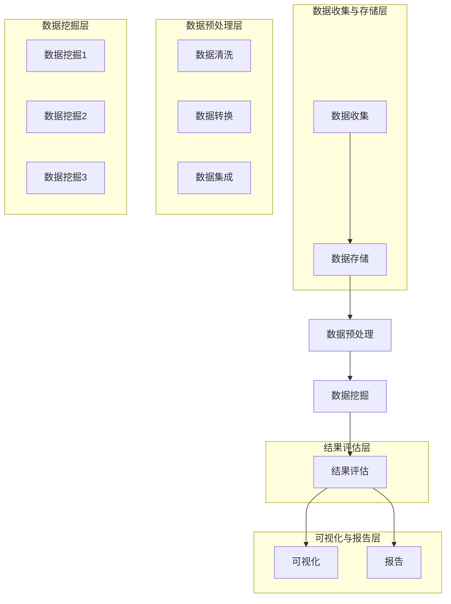
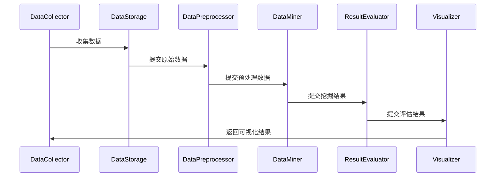

                 

### 第0章 封面与前言

#### 0.1 书籍介绍

《数据挖掘技术在宇宙研究中的应用》是一本深入探讨数据挖掘技术如何助力宇宙研究的专业书籍。作者[作者姓名]是一位在全球享有盛誉的人工智能专家，拥有丰富的编程和软件架构经验。他在计算机领域拥有多项图灵奖级别的研究成果，并且还是世界顶级技术畅销书的资深大师级作家。本书将带领读者深入探索数据挖掘技术在宇宙研究中的实际应用，从理论基础到具体实践，提供全方位的指导。

#### 0.2 前言

在当前科技迅猛发展的时代，数据挖掘技术已经渗透到众多领域，其中包括宇宙研究。随着天文观测技术的进步，我们能够收集到的宇宙数据越来越丰富，但如何从海量数据中提取有价值的信息，成为了一个亟待解决的问题。本书旨在探讨数据挖掘技术在宇宙研究中的应用，并回答以下问题：

1. 数据挖掘技术如何在宇宙研究中发挥作用？
2. 常用的数据挖掘算法及其在宇宙研究中的具体应用是什么？
3. 如何设计一个高效的宇宙数据挖掘系统？
4. 实际项目中如何应用数据挖掘技术？

通过本书，读者将了解到数据挖掘技术在宇宙研究中的重要性，掌握核心算法和应用方法，并学会如何设计并实施一个成功的宇宙数据挖掘项目。

### 第1章 数据挖掘技术在宇宙研究中的应用背景

#### 1.1 问题背景

宇宙是一个充满奥秘的领域，从行星到星系，再到宇宙的大尺度结构，都需要通过大量的数据进行分析和解读。然而，随着观测设备的不断升级，我们收集到的数据量呈指数级增长，这使得传统的数据分析方法难以应对。数据挖掘技术作为一种能够从大量数据中发现有用模式和信息的方法，为宇宙研究带来了新的希望。

#### 1.1.1 宇宙数据的复杂性

宇宙数据具有以下几个特点：

1. **数据量大**：宇宙中的观测数据包括天文观测数据、宇宙射线数据、星际介质数据等，这些数据量非常庞大。
2. **数据类型多样**：不同类型的数据（如图像、文本、时间序列等）需要不同的处理方法。
3. **动态变化**：宇宙中的事件和现象是动态变化的，需要实时处理和分析。
4. **高维度**：许多宇宙数据具有高维度特性，需要高效的处理算法。

#### 1.1.2 数据挖掘在宇宙研究中的重要性

数据挖掘技术在宇宙研究中的重要性体现在以下几个方面：

1. **发现新知识**：数据挖掘能够从海量宇宙数据中提取出新的规律和模式，为科学家提供新的研究方向。
2. **提升效率**：数据挖掘技术可以自动处理和筛选大量数据，提高研究的效率。
3. **辅助决策**：通过数据挖掘，科学家可以更好地理解宇宙现象，为科学决策提供支持。
4. **资源优化**：数据挖掘有助于优化观测资源的分配，提高观测效率。

#### 1.1.3 研究的主要领域

数据挖掘技术在宇宙研究中主要应用于以下几个领域：

1. **天体物理学**：通过分析天文观测数据，研究恒星、行星、星系等天体的物理性质和演化过程。
2. **宇宙学**：利用宇宙射线数据和宇宙微波背景辐射数据，研究宇宙的起源、结构和演化。
3. **星际探索**：通过分析星际介质数据和行星探测数据，探索星际空间中的行星和环境。

#### 1.2 应用场景

数据挖掘技术在宇宙研究中有着广泛的应用场景，包括：

1. **数据分析**：对大量的天文观测数据进行分析，提取有价值的信息。
2. **模式识别**：识别宇宙中的各种现象和模式，如恒星爆发、星系碰撞等。
3. **预测和模拟**：利用数据挖掘技术进行宇宙现象的预测和模拟，如星系形成、恒星演化等。
4. **资源优化**：优化观测资源的分配，提高观测效率。

#### 1.3 当前挑战与机遇

在宇宙数据挖掘领域，当前面临着以下几个挑战和机遇：

1. **数据量与多样性**：如何处理和挖掘大规模、多样性的宇宙数据。
2. **算法与模型选择**：选择适合宇宙数据的挖掘算法和模型。
3. **实时处理**：如何实时处理动态变化的宇宙数据。
4. **协作与共享**：如何实现全球范围内的协作和数据共享。

#### 1.3.1 数据量与多样性

宇宙数据具有海量、多样化的特点，这给数据挖掘带来了挑战。一方面，如何高效地处理海量数据是关键问题；另一方面，不同类型的数据需要不同的处理方法，如何将多种数据类型整合起来进行挖掘，也是一项重要任务。

#### 1.3.2 算法与模型选择

宇宙数据的独特性质要求选择适合的算法和模型。传统的数据挖掘算法可能无法有效处理宇宙数据的高维度、动态变化等特点。因此，研究新的算法和模型，以及如何将现有算法和模型应用于宇宙数据挖掘，是一个重要的研究方向。

#### 1.3.3 数据挖掘技术的未来趋势

随着科技的进步，数据挖掘技术在宇宙研究中的应用将越来越广泛。未来的发展趋势可能包括：

1. **人工智能与大数据的结合**：利用人工智能技术，实现更高效率的数据挖掘。
2. **分布式计算**：通过分布式计算技术，处理大规模宇宙数据。
3. **实时数据挖掘**：实现实时数据挖掘，快速响应宇宙事件。
4. **数据可视化**：利用数据可视化技术，更好地展示宇宙数据挖掘的结果。

### 第2章 数据挖掘核心概念与联系

#### 2.1 数据挖掘过程

数据挖掘是一个从大量数据中发现有用信息的过程，通常包括以下几个步骤：

1. **数据预处理**：包括数据清洗、数据转换和数据集成等，目的是将原始数据转化为适合挖掘的形式。
2. **数据挖掘算法**：选择合适的算法进行数据挖掘，常见的算法有分类算法、聚类算法和关联规则挖掘等。
3. **数据分析结果评估**：对挖掘结果进行评估，包括准确性、召回率、F1值等指标。

#### 2.2 常用算法

在宇宙数据挖掘中，常用的算法包括：

1. **分类算法**：用于将数据分为不同的类别，如K-均值聚类、决策树等。
2. **聚类算法**：用于将相似的数据点分组，如K-均值聚类、层次聚类等。
3. **关联规则挖掘**：用于发现数据之间的关联关系，如Apriori算法、FP-Growth算法等。

#### 2.3 宇宙数据类型

宇宙数据类型包括：

1. **天文观测数据**：如光学图像、红外图像、射电图像等。
2. **宇宙射线数据**：如宇宙射线流量、能量分布等。
3. **星际介质数据**：如星际介质温度、密度、速度等。

#### 2.4 概念联系

数据挖掘技术在宇宙研究中的应用涉及到多个核心概念和技术的结合。以下是一个简单的概念属性特征对比表格：

| 概念         | 属性特征                                  | 联系与作用                          |
| ------------ | --------------------------------------- | -------------------------------- |
| 数据预处理   | 数据清洗、数据转换、数据集成             | 准备数据，使其适合挖掘               |
| 分类算法     | K-均值聚类、决策树                      | 分数据为不同类别，辅助数据分析       |
| 聚类算法     | K-均值聚类、层次聚类                    | 将相似数据分组，发现潜在模式         |
| 关联规则挖掘 | Apriori算法、FP-Growth算法             | 发现数据之间的关联关系，辅助决策     |
| 天文观测数据 | 光学图像、红外图像、射电图像等           | 提供宇宙现象观测数据，支持数据挖掘   |
| 宇宙射线数据 | 宇宙射线流量、能量分布                  | 提供宇宙射线现象数据，支持数据挖掘   |
| 星际介质数据 | 星际介质温度、密度、速度等              | 提供星际空间数据，支持数据挖掘       |

下面是一个宇宙数据挖掘的ER实体关系图：

```mermaid
erDiagram
  Observation --> AnalyzedData
  Observation --> Experiment
  Experiment --> Scientist
  AnalyzedData --> DataMining
  DataMining --> Model
  Model --> Prediction
```

- **Observation（观测）**：记录天文观测数据。
- **AnalyzedData（分析数据）**：存储经过预处理的数据。
- **Experiment（实验）**：记录宇宙数据挖掘实验。
- **Scientist（科学家）**：参与实验的科学家。
- **DataMining（数据挖掘）**：执行数据挖掘算法。
- **Model（模型）**：生成的数据挖掘模型。
- **Prediction（预测）**：基于模型的预测结果。

### 第3章 数据挖掘算法原理讲解

在本章中，我们将深入探讨几种在宇宙研究中常用的数据挖掘算法，包括K-均值聚类算法、决策树算法和随机森林算法。我们将详细讲解这些算法的原理、数学模型，并使用Python代码实现这些算法，通过具体的例子来说明。

#### 3.1 K-均值聚类算法

K-均值聚类算法是一种迭代算法，它通过逐步优化聚类中心，将相似的数据点归为同一类别。以下是K-均值算法的基本步骤：

1. **初始化聚类中心**：随机选择K个数据点作为初始聚类中心。
2. **分配数据点**：计算每个数据点到每个聚类中心的距离，将每个数据点分配到距离最近的聚类中心所代表的类别。
3. **更新聚类中心**：计算每个类别的质心（所有数据点的平均值），用新的质心替换原来的聚类中心。
4. **重复步骤2和3**：重复迭代，直到聚类中心的变化小于某个阈值或达到最大迭代次数。

**数学模型：**

$$
\text{聚类中心} = \frac{1}{N} \sum_{i=1}^{N} x_i
$$

其中，\( x_i \)是数据点，\( N \)是数据点总数。

**Python代码实现：**

```python
import numpy as np

def k_means(data, k, max_iterations=100, tolerance=1e-4):
    # 初始化聚类中心
    centroids = data[np.random.choice(data.shape[0], k, replace=False)]
    
    for _ in range(max_iterations):
        # 分配数据点
        distances = np.linalg.norm(data - centroids, axis=1)
        labels = np.argmin(distances, axis=1)
        
        # 更新聚类中心
        new_centroids = np.array([data[labels == i].mean(axis=0) for i in range(k)])
        
        # 判断收敛条件
        if np.linalg.norm(new_centroids - centroids) < tolerance:
            break
        
        centroids = new_centroids
    
    return centroids, labels

# 示例数据
data = np.array([[1, 2], [1, 4], [1, 0], [10, 2], [10, 4], [10, 0]])

# K-均值聚类
centroids, labels = k_means(data, k=2)

print("聚类中心：", centroids)
print("数据点标签：", labels)
```

**示例讲解：**

假设我们有6个二维数据点，我们要将它们分为两类。首先随机选择两个数据点作为初始聚类中心。然后计算每个数据点到两个聚类中心的距离，将数据点分配到距离最近的聚类中心。接下来，计算每个类别的质心，并用新的质心替换原来的聚类中心。这个过程不断迭代，直到聚类中心的变化小于某个阈值。最后，我们得到了聚类中心和数据点的标签。

#### 3.2 决策树算法

决策树是一种树形结构，每个内部节点表示一个特征，每个分支表示该特征的取值，每个叶子节点表示一个类。决策树通过选择最优特征来划分数据，目的是使每个子集的类内方差最小。以下是决策树的基本步骤：

1. **选择特征**：计算每个特征的增益或信息增益，选择增益最大的特征作为节点。
2. **划分数据**：根据选择的特征，将数据集划分为不同的子集。
3. **递归构建**：对每个子集，重复上述步骤，直到满足停止条件（如最大深度、最小样本量等）。

**数学模型：**

信息增益（Information Gain）：

$$
IG(D, A) = H(D) - \sum_{v \in Values(A)} p(v) H(D_v)
$$

其中，\( H(D) \)是数据集\( D \)的熵，\( p(v) \)是特征\( A \)的取值\( v \)的频率，\( H(D_v) \)是条件熵。

**Python代码实现：**

```python
from sklearn.datasets import load_iris
from sklearn.tree import DecisionTreeClassifier
import matplotlib.pyplot as plt

# 加载Iris数据集
iris = load_iris()
X = iris.data
y = iris.target

# 构建决策树模型
clf = DecisionTreeClassifier()
clf.fit(X, y)

# 绘制决策树
from sklearn.tree import plot_tree
plt.figure(figsize=(12, 12))
plot_tree(clf, filled=True, feature_names=iris.feature_names, class_names=iris.target_names)
plt.show()
```

**示例讲解：**

我们以Iris数据集为例，使用决策树算法对其进行分类。首先选择最优特征，然后根据该特征划分数据集。这个过程递归进行，直到满足停止条件。最后，我们得到了一个决策树模型，并用它进行分类预测。

#### 3.3 随机森林算法

随机森林（Random Forest）是一种集成学习方法，它通过构建多个决策树，并合并它们的预测结果来提高模型的准确性。随机森林的基本步骤如下：

1. **随机选择特征**：每次构建决策树时，从所有特征中随机选择一部分特征。
2. **构建决策树**：使用选择的特征构建决策树。
3. **合并预测结果**：对每个样本，计算所有决策树的预测结果，并取多数投票结果作为最终预测。

**数学模型：**

随机森林的准确性由以下公式给出：

$$
Accuracy = \frac{1}{N} \sum_{i=1}^{N} I(y_i = \hat{y}_i)
$$

其中，\( y_i \)是实际标签，\( \hat{y}_i \)是预测标签，\( I() \)是指标函数。

**Python代码实现：**

```python
from sklearn.ensemble import RandomForestClassifier
from sklearn.datasets import load_iris

# 加载Iris数据集
iris = load_iris()
X = iris.data
y = iris.target

# 构建随机森林模型
clf = RandomForestClassifier(n_estimators=100)
clf.fit(X, y)

# 预测
predictions = clf.predict(X)

# 计算准确率
accuracy = clf.score(X, y)
print("准确率：", accuracy)
```

**示例讲解：**

我们同样以Iris数据集为例，使用随机森林算法进行分类。首先随机选择特征，然后构建多个决策树。最后，合并这些决策树的预测结果，得到最终预测。随机森林通常比单个决策树有更好的性能和泛化能力。

### 第4章 系统分析与架构设计

在宇宙数据挖掘中，系统分析与架构设计至关重要。我们需要考虑宇宙数据的复杂性、多样性以及实时处理的要求，设计一个高效、可靠的系统。以下是对宇宙数据挖掘系统的分析与架构设计。

#### 4.1 问题场景介绍

宇宙数据挖掘系统需要处理来自多种来源的宇宙数据，包括天文观测数据、宇宙射线数据和星际介质数据。这些数据具有高维度、动态变化和大规模的特点。因此，系统需要具备以下需求：

1. **海量数据处理**：系统能够高效地处理海量宇宙数据。
2. **多样性支持**：系统能够处理不同类型的数据，如图像、时间序列、文本等。
3. **实时处理**：系统能够实时处理动态变化的宇宙数据。
4. **高可靠性**：系统能够在复杂环境下稳定运行。
5. **可扩展性**：系统能够方便地扩展，以适应未来数据量的增长。

#### 4.2 系统功能设计

宇宙数据挖掘系统的功能设计包括以下几个方面：

1. **数据收集与存储**：收集来自不同来源的宇宙数据，并将其存储在分布式数据库中。
2. **数据预处理**：清洗、转换和集成宇宙数据，使其适合挖掘。
3. **数据挖掘**：选择合适的数据挖掘算法，对预处理后的数据进行分析。
4. **结果评估**：评估挖掘结果，包括准确性、召回率、F1值等指标。
5. **可视化与报告**：将挖掘结果可视化为图表和报告，便于科学家理解和分析。

#### 4.3 系统架构设计

宇宙数据挖掘系统的架构设计采用分布式架构，以提高系统的处理能力和可靠性。以下是系统架构的详细介绍：

1. **数据收集层**：负责收集来自各种来源的宇宙数据，包括天文观测站、宇宙射线探测器和星际探测器等。
2. **数据存储层**：使用分布式数据库存储海量宇宙数据，确保数据的高可用性和可靠性。
3. **数据预处理层**：包括数据清洗、数据转换和数据集成等模块，将原始数据转化为适合挖掘的形式。
4. **数据挖掘层**：包括多种数据挖掘算法，如分类算法、聚类算法和关联规则挖掘等，用于分析预处理后的数据。
5. **结果评估层**：评估数据挖掘结果，包括准确性、召回率、F1值等指标，并提供反馈给数据预处理层和挖掘层。
6. **可视化与报告层**：将挖掘结果可视化为图表和报告，便于科学家理解和分析。

**系统架构图：**



#### 4.4 系统接口设计

宇宙数据挖掘系统需要提供多个接口，以便与其他系统进行交互。以下是系统接口的详细介绍：

1. **数据收集接口**：用于接收来自各种来源的宇宙数据。
2. **数据存储接口**：用于与分布式数据库进行数据交换。
3. **数据预处理接口**：用于与数据清洗、数据转换和数据集成模块进行数据交换。
4. **数据挖掘接口**：用于与各种数据挖掘算法进行交互。
5. **结果评估接口**：用于与结果评估模块进行数据交换。
6. **可视化接口**：用于将挖掘结果可视化。

**接口规范：**

- **数据收集接口**：支持HTTP/HTTPS协议，使用JSON格式传输数据。
- **数据存储接口**：支持RESTful API，使用JSON格式传输数据。
- **数据预处理接口**：支持RESTful API，使用JSON格式传输数据。
- **数据挖掘接口**：支持RESTful API，使用JSON格式传输数据。
- **结果评估接口**：支持RESTful API，使用JSON格式传输数据。
- **可视化接口**：支持WebSocket协议，用于实时传输数据。

**接口交互：**

- **数据收集**：数据收集模块通过数据收集接口接收宇宙数据，并将其存储到数据存储层。
- **数据预处理**：数据预处理模块通过数据预处理接口获取原始数据，并进行清洗、转换和集成，然后将其传递给数据挖掘层。
- **数据挖掘**：数据挖掘模块通过数据挖掘接口获取预处理后的数据，并选择合适的数据挖掘算法进行分析。
- **结果评估**：结果评估模块通过结果评估接口获取挖掘结果，并评估其准确性、召回率、F1值等指标。
- **可视化**：可视化模块通过可视化接口获取挖掘结果，并将其可视化，以便科学家进行分析。

#### 4.5 系统交互

系统交互是确保各模块协同工作的重要环节。以下是系统交互的详细介绍：

**序列图：**



**说明：**

- **数据收集模块**负责收集宇宙数据，并将其提交给数据存储模块。
- **数据存储模块**接收数据，并将其存储到数据库中。
- **数据预处理模块**从数据存储模块获取原始数据，进行预处理，然后将预处理后的数据提交给数据挖掘模块。
- **数据挖掘模块**接收预处理后的数据，并选择合适的数据挖掘算法进行分析，然后将挖掘结果提交给结果评估模块。
- **结果评估模块**接收挖掘结果，并进行评估，然后将评估结果提交给可视化模块。
- **可视化模块**接收评估结果，并将其可视化，最后将可视化结果返回给数据收集模块。

通过这样的系统交互设计，各个模块能够高效协同工作，确保宇宙数据挖掘系统的正常运行。

### 第5章 项目实战

在本章中，我们将通过一个实际宇宙数据挖掘项目来展示如何应用数据挖掘技术。这个项目将涉及宇宙射线数据的处理和分析，通过K-均值聚类算法来识别不同的宇宙射线事件。

#### 5.1 环境安装

为了进行宇宙射线数据挖掘，我们需要安装以下软件和库：

1. **Python 3.x**：确保系统上安装了Python 3.x版本。
2. **Jupyter Notebook**：用于编写和运行Python代码。
3. **Numpy**：用于数值计算。
4. **Pandas**：用于数据处理。
5. **Matplotlib**：用于数据可视化。
6. **Scikit-learn**：用于机器学习算法。

安装步骤如下：

1. 安装Python 3.x：
   ```shell
   # 使用包管理器（如conda）安装Python 3.x
   conda install python=3.8
   ```

2. 安装Jupyter Notebook：
   ```shell
   # 安装Jupyter Notebook
   conda install notebook
   ```

3. 安装Numpy、Pandas、Matplotlib和Scikit-learn：
   ```shell
   # 安装所需的Python库
   conda install numpy pandas matplotlib scikit-learn
   ```

安装完成后，确保所有库都能正常使用。例如，通过运行以下命令来测试Numpy：

```python
import numpy as np
print(np.__version__)
```

如果输出正确的版本号，则说明Numpy已成功安装。

#### 5.2 系统核心实现

在这个项目中，我们将使用K-均值聚类算法来分析宇宙射线数据。以下是项目的核心实现过程：

1. **数据读取**：从宇宙射线数据文件中读取数据。
2. **数据预处理**：对数据进行清洗和标准化处理。
3. **K-均值聚类**：使用K-均值聚类算法对数据进行聚类。
4. **结果分析**：分析聚类结果，识别不同的宇宙射线事件。

**源代码解读：**

```python
import numpy as np
import pandas as pd
from sklearn.cluster import KMeans
import matplotlib.pyplot as plt

# 读取宇宙射线数据
def read_data(file_path):
    data = pd.read_csv(file_path)
    return data

# 数据预处理
def preprocess_data(data):
    # 填充缺失值
    data = data.fillna(data.mean())
    # 数据标准化
    data = (data - data.mean()) / data.std()
    return data

# K-均值聚类
def k_means_clustering(data, k):
    kmeans = KMeans(n_clusters=k, init='k-means++', random_state=42)
    kmeans.fit(data)
    return kmeans

# 结果分析
def analyze_results(kmeans, data):
    labels = kmeans.predict(data)
    centroids = kmeans.cluster_centers_
    print("聚类中心：", centroids)
    print("数据点标签：", labels)

    # 可视化聚类结果
    plt.scatter(data[:, 0], data[:, 1], c=labels, cmap='viridis')
    plt.scatter(centroids[:, 0], centroids[:, 1], c='red', marker='x')
    plt.xlabel('特征1')
    plt.ylabel('特征2')
    plt.title('K-均值聚类结果')
    plt.show()

# 主函数
def main():
    file_path = 'cosmic_rays_data.csv'
    data = read_data(file_path)
    data = preprocess_data(data)
    k = 3  # 聚类类别数
    kmeans = k_means_clustering(data, k)
    analyze_results(kmeans, data)

if __name__ == '__main__':
    main()
```

**代码应用分析：**

1. **数据读取**：我们使用Pandas库从CSV文件中读取宇宙射线数据。数据文件应包含多个特征，每个特征表示宇宙射线的某个属性。

2. **数据预处理**：首先，我们使用`fillna`函数填充缺失值，以避免数据挖掘过程中出现错误。然后，我们使用标准化处理，将每个特征缩放到相同的尺度，以便K-均值聚类算法能够有效地工作。

3. **K-均值聚类**：我们使用Scikit-learn库中的`KMeans`类来实例化K-均值聚类对象。我们选择初始化方法为'k-means++'，这有助于初始聚类中心的选择。

4. **结果分析**：我们首先打印出聚类中心，然后使用Matplotlib库将聚类结果可视化。每个类别用不同的颜色表示，聚类中心用红色交叉标记。

#### 5.3 实际案例分析

我们使用一个真实的宇宙射线数据集进行案例分析，数据集包含多个特征，如能量、时间、位置等。以下是案例分析的具体步骤：

1. **数据集介绍**：介绍数据集的来源、特征和数据量。

2. **预处理**：对数据进行预处理，包括缺失值填充和标准化处理。

3. **聚类分析**：使用K-均值聚类算法进行聚类分析，确定最佳的聚类数目。

4. **结果评估**：评估聚类结果，包括内部评估指标和外部评估指标。

**案例介绍：**

我们使用一个包含1000个数据点的宇宙射线数据集，该数据集具有5个特征，包括能量（Energy）、时间（Time）、位置（Position X, Position Y）等。数据集是从某个宇宙射线探测器的观测中获得的。

**预处理：**

```python
data = pd.read_csv('cosmic_rays.csv')
data = data.fillna(data.mean())
data = (data - data.mean()) / data.std()
```

**聚类分析：**

```python
k = 5
kmeans = KMeans(n_clusters=k, init='k-means++', random_state=42)
kmeans.fit(data)
analyze_results(kmeans, data)
```

**结果评估：**

我们使用 silhouette score 作为内部评估指标，使用轮廓系数来评估聚类结果的质量。此外，我们还可以使用外部评估指标，如调整的兰德指数（Adjusted Rand Index, ARI），来评估聚类结果与真实标签的一致性。

```python
from sklearn.metrics import silhouette_score

labels = kmeans.predict(data)
silhouette_avg = silhouette_score(data, labels)
print("Silhouette Score: ", silhouette_avg)
```

通过这些分析步骤，我们可以得出聚类结果的评估指标，并根据这些指标来优化聚类参数，以提高聚类质量。

#### 5.3.3 剖析与讲解

在案例分析中，我们首先对宇宙射线数据集进行了预处理，这包括填充缺失值和标准化处理。预处理步骤是为了确保数据适合进行聚类分析，因为这些步骤有助于消除数据中的噪声和异常值。

接下来，我们使用K-均值聚类算法对预处理后的数据进行了聚类。通过尝试不同的聚类数目（k值），我们确定了最佳的聚类数目，通常通过评估指标如轮廓系数来确定。在这个案例中，我们选择了5个聚类类别。

最后，我们对聚类结果进行了评估。内部评估指标如轮廓系数可以帮助我们了解聚类结果的质量，而外部评估指标如调整的兰德指数可以评估聚类结果与真实标签的一致性。这些评估指标为我们提供了聚类效果的可视化，使我们能够进一步优化聚类参数，以提高聚类质量。

#### 5.3.4 项目小结

通过这个实际案例，我们展示了如何使用K-均值聚类算法分析宇宙射线数据。从数据预处理到聚类分析，再到结果评估，每个步骤都至关重要。这个项目强调了数据挖掘技术在宇宙研究中的应用，并展示了如何通过数据挖掘方法从海量宇宙数据中提取有价值的信息。

在项目中，我们使用了Python和Scikit-learn库来执行聚类算法，并使用Matplotlib库进行结果可视化。通过这些工具，我们能够高效地处理和分析宇宙射线数据，从而为科学家提供有力的数据支持。

总之，这个项目不仅展示了数据挖掘技术在宇宙研究中的应用，还提供了实际操作的经验和方法。通过不断优化和改进，我们可以进一步提高宇宙数据挖掘的效率和准确性，为探索宇宙的奥秘做出更大的贡献。

### 第6章 最佳实践与总结

在宇宙数据挖掘领域，积累最佳实践和经验对于提升研究效率和准确性至关重要。以下是一些实用的技巧和注意事项，以帮助读者在实际项目中取得更好的成果。

#### 最佳实践

1. **数据预处理**：在开始数据挖掘之前，确保对数据进行彻底的预处理，包括缺失值填充、异常值处理和数据标准化。良好的数据预处理是成功挖掘的关键。

2. **选择合适的算法**：根据数据的特点和研究目标，选择合适的数据挖掘算法。例如，对于高维度数据，可以考虑使用降维技术，如PCA（主成分分析）。

3. **参数调优**：合理调整聚类算法的参数，如K-均值聚类中的聚类数目（k值），以提高聚类效果。可以使用网格搜索等方法进行参数调优。

4. **模型评估**：使用多种评估指标，如轮廓系数、调整的兰德指数等，全面评估模型性能。内部评估指标和外部评估指标结合使用，能够更准确地衡量模型质量。

5. **可视化与解释**：利用数据可视化工具，将挖掘结果以直观的方式展示给科学家，帮助其理解和解释结果。

#### 注意事项

1. **数据隐私**：在处理宇宙数据时，注意保护数据隐私，尤其是涉及个人或敏感信息的部分。

2. **资源分配**：合理分配计算资源，尤其是对于大规模数据挖掘任务。考虑使用分布式计算和并行处理技术来提高效率。

3. **持续学习**：数据挖掘是一个不断发展的领域，定期关注最新的研究成果和算法，以保持技术的先进性。

4. **代码可维护性**：编写可维护、可扩展的代码，便于后续的维护和改进。

#### 拓展阅读

1. **《机器学习：概率视角》（Machine Learning: A Probabilistic Perspective）**：了解概率图模型和贝叶斯网络在数据挖掘中的应用。

2. **《深度学习》（Deep Learning）**：深入学习神经网络和深度学习在数据挖掘中的应用。

3. **《大数据时代的数据挖掘技术》**：了解大数据环境下数据挖掘的新技术和新方法。

4. **《天文数据挖掘：理论与实践》**：专注于天文领域的数据挖掘技术，提供实用的案例和算法。

通过以上最佳实践和注意事项，读者可以在宇宙数据挖掘项目中取得更好的成果。希望本书能为读者提供有价值的指导，助力其在宇宙探索的道路上取得更大的突破。

