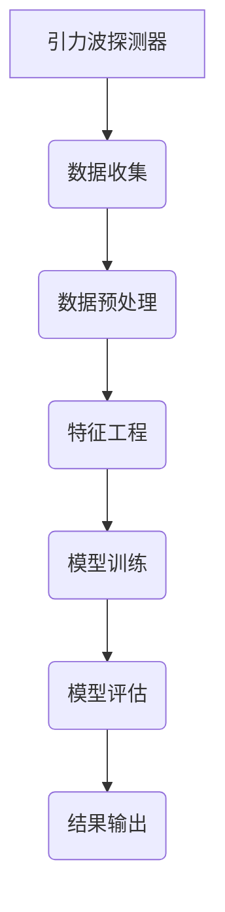

                 


### 摘要

本文探讨了数据科学在探测原初引力波背景中的应用，通过介绍数据科学的基础知识、原初引力波的原理及其探测难点，展示了数据科学在引力波探测中的重要性。文章首先概述了数据科学的基本概念，包括数据预处理、统计与机器学习基础，然后详细阐述了数据科学在引力波信号识别与处理中的应用，包括特征工程、常见机器学习算法及深度学习模型的运用。最后，文章通过深度学习在引力波探测中的应用案例，探讨了当前面临的挑战和未来发展趋势，为数据科学在引力波探测领域的研究提供了新的视角和思路。

### 第一部分：引言与背景介绍

#### 第1章：引言

##### 1.1 研究背景

引力波探测是物理学领域的重大突破，它不仅为研究宇宙起源和演化提供了新的视角，也为探索基本粒子和量子引力提供了可能性。然而，探测原初引力波背景（Primordial Gravitational Wave Background，简称PGWB）是一项极具挑战性的任务。原初引力波是由宇宙早期极端密度波动产生的，其信号极其微弱，且受到宇宙微波背景辐射等多种噪声的干扰。

##### 1.2 原初引力波的挑战

原初引力波的探测面临以下主要挑战：

1. **信号微弱**：原初引力波的振幅非常小，约为宇宙背景辐射的十亿分之一，因此需要极其敏感的探测器。

2. **噪声干扰**：宇宙中存在各种噪声源，如银河系中的星际介质、地球自身的震动和大气噪声等，这些都可能对引力波的探测造成干扰。

3. **信号识别**：如何在大量的噪声中识别出极其微弱的引力波信号，是数据科学需要解决的核心问题。

##### 1.3 数据科学的机遇

数据科学为探测原初引力波提供了以下机遇：

1. **数据处理能力**：数据科学能够处理和分析大量的数据，从而提高对引力波信号的识别能力。

2. **特征工程**：通过数据预处理和特征工程，可以从原始数据中提取出对引力波信号识别有帮助的特征。

3. **机器学习**：利用机器学习算法，可以对引力波信号进行分类和识别，提高探测的准确性和效率。

##### 1.4 书籍概述

本书旨在系统地介绍数据科学在探测原初引力波背景中的应用。本书结构分为三部分：

- **第一部分**：引言与背景介绍，包括数据科学基础和原初引力波的基本概念。
- **第二部分**：数据科学在引力波探测中的应用，包括数据分析方法、机器学习模型及深度学习应用。
- **第三部分**：引力波探测的前沿研究，包括深度学习模型的应用、面临的挑战和未来发展趋势。

本书的主要目标读者是从事数据科学和引力波探测研究的科研人员、工程师以及相关专业的研究生，希望通过本书能够深入了解数据科学在引力波探测中的应用，为相关领域的研究提供参考。

#### 第2章：数据科学基础

##### 2.1 数据科学概述

数据科学是一门跨学科领域，结合了统计学、机器学习、计算机科学和领域知识，用于从数据中提取有价值的信息和知识。数据科学的主要目的是通过数据分析和建模，为决策提供支持。

##### 2.2 数据预处理

数据预处理是数据科学中的关键步骤，它包括以下主要内容：

1. **数据收集**：从各种数据源（如传感器、数据库、互联网等）收集数据。
2. **数据清洗**：处理缺失值、异常值和重复数据，确保数据的准确性和一致性。
3. **数据集成**：将来自不同源的数据进行合并，消除数据冗余。
4. **数据转换**：将数据转换为适合分析和建模的格式，如归一化、标准化等。

##### 2.3 统计与机器学习基础

1. **统计学基本概念**：包括概率分布、假设检验、回归分析等。
2. **机器学习基本算法**：包括线性回归、逻辑回归、决策树、支持向量机等。
3. **无监督学习**：包括聚类、降维、异常检测等。
4. **强化学习**：通过试错学习来优化策略。

##### 2.4 数据科学应用领域

数据科学广泛应用于各个领域，包括但不限于：

1. **金融**：风险评估、市场预测、欺诈检测等。
2. **医疗**：疾病预测、药物研发、医疗图像分析等。
3. **电子商务**：用户行为分析、推荐系统、价格优化等。
4. **交通**：交通流量预测、智能交通系统、车辆调度等。

##### 2.5 数据科学在引力波探测中的应用

在引力波探测中，数据科学的应用主要包括：

1. **信号处理**：对原始引力波信号进行预处理和特征提取，提高信号识别的准确性。
2. **异常检测**：识别和过滤噪声，确保信号的可靠性。
3. **模型训练**：利用机器学习算法训练模型，对引力波信号进行分类和预测。
4. **数据分析**：对大量探测数据进行统计分析，提取有价值的信息。

通过数据科学的综合应用，可以显著提高引力波探测的效率和准确性，为宇宙学研究提供强有力的支持。

### 第二部分：数据科学在引力波探测中的应用

#### 第4章：数据分析方法

##### 4.1 数据分析流程

数据分析通常包括以下步骤：

1. **数据收集**：从引力波探测器或其他相关设备收集原始数据。
2. **数据预处理**：清洗、整合和转换数据，使其适合分析和建模。
3. **特征工程**：提取对信号识别有帮助的特征。
4. **数据建模**：选择合适的模型进行训练和预测。
5. **模型评估**：评估模型的性能，进行参数调整。
6. **结果解释**：解释分析结果，为后续研究提供指导。

##### 4.2 特征工程

特征工程是数据分析中的关键步骤，它包括以下主要内容：

1. **特征选择**：从原始数据中筛选出最有用的特征。
2. **特征提取**：将原始数据转换为更适用于机器学习的特征。
3. **特征转换**：对特征进行标准化、归一化等转换。

##### 4.3 统计分析

统计分析是数据分析的基础，主要包括：

1. **描述性统计**：计算数据的中心趋势、离散程度等基本统计量。
2. **推断性统计**：通过样本数据推断总体特性，进行假设检验、置信区间等。

##### 4.4 数据分析工具

常用的数据分析工具包括：

1. **Python**：Python是数据科学中最流行的语言，拥有丰富的数据分析和机器学习库，如NumPy、Pandas、Scikit-learn等。
2. **R**：R语言是统计学和数据科学领域的一种编程语言，广泛应用于数据分析、统计建模和图形可视化。
3. **MATLAB**：MATLAB是专业的数值计算和数据分析软件，适合进行复杂的数据分析和模拟。

##### 4.5 数据科学在引力波探测中的应用

在引力波探测中，数据科学的应用主要包括：

1. **信号预处理**：对原始信号进行降噪、滤波等预处理，以提高信号质量。
2. **特征提取**：从预处理后的信号中提取对信号识别有帮助的特征，如频谱特征、时频特征等。
3. **信号分类**：利用机器学习算法对信号进行分类，以识别引力波信号。
4. **异常检测**：检测和处理噪声，提高信号的可信度。

通过数据科学的综合应用，可以显著提高引力波探测的效率和准确性，为宇宙学研究提供强有力的支持。

#### 第5章：机器学习模型

##### 5.1 机器学习基础

机器学习是数据科学的核心技术之一，它通过算法和模型从数据中学习规律，实现对未知数据的预测和分类。机器学习主要包括以下类型：

1. **监督学习**：在有标注数据的指导下，训练模型进行预测和分类。
2. **无监督学习**：在没有标注数据的情况下，通过数据自身的结构和规律进行学习。
3. **强化学习**：通过试错学习来优化策略，在特定环境中寻求最大化回报。

##### 5.2 常见机器学习算法

常见的机器学习算法包括：

1. **线性回归**：通过线性模型预测数值型输出。
2. **逻辑回归**：通过线性模型预测概率型输出，常用于分类问题。
3. **决策树**：通过树形结构对数据进行分类或回归。
4. **支持向量机**：通过找到最佳超平面，实现数据的分类。
5. **神经网络**：通过多层神经元进行非线性变换，实现复杂的预测和分类。

##### 5.3 深度学习模型

深度学习是机器学习的一个分支，通过多层神经网络进行复杂的数据建模。深度学习模型主要包括：

1. **卷积神经网络（CNN）**：适用于图像和时频数据的处理。
2. **循环神经网络（RNN）**：适用于序列数据的建模和预测。
3. **生成对抗网络（GAN）**：用于生成高质量的图像和序列数据。

##### 5.4 机器学习在引力波探测中的应用

在引力波探测中，机器学习的应用主要包括：

1. **信号分类**：利用分类算法对引力波信号进行识别和分类，提高探测的准确性。
2. **异常检测**：利用异常检测算法，识别和处理噪声，提高信号的可信度。
3. **预测模型**：利用预测模型，对引力波信号的未来变化进行预测，为探测提供指导。

通过机器学习的应用，可以显著提高引力波探测的效率和准确性，为宇宙学研究提供强有力的支持。

### 第三部分：数据科学在引力波探测中的前沿研究

#### 第7章：深度学习在引力波探测中的应用

##### 7.1 深度学习与引力波探测

深度学习是人工智能领域的一个重要分支，其核心是通过多层神经网络从数据中自动学习特征。在引力波探测中，深度学习因其强大的特征提取和模式识别能力而成为一个重要的工具。

1. **特征提取能力**：深度学习模型，特别是卷积神经网络（CNN）和循环神经网络（RNN），能够自动从原始数据中提取复杂的特征，这对于识别微弱的引力波信号尤为重要。
2. **非线性建模**：深度学习模型可以处理复杂非线性问题，使其在引力波信号处理中具有显著优势。

##### 7.2 深度学习模型在引力波探测中的应用

1. **卷积神经网络（CNN）**：CNN在图像识别和时频数据处理方面具有优势，适用于引力波信号的处理和分类。
2. **循环神经网络（RNN）**：RNN特别适合处理序列数据，可以用于引力波信号的时序分析。
3. **生成对抗网络（GAN）**：GAN能够生成高质量的模拟信号，有助于提高模型训练数据的多样性和质量。

##### 7.3 深度学习模型的应用案例

以CNN为例，其在引力波探测中的应用可以分为以下步骤：

1. **数据预处理**：对原始引力波信号进行预处理，包括降噪、滤波和归一化。
2. **特征提取**：利用CNN提取信号中的关键特征，如频率和时频特征。
3. **模型训练**：使用大量的引力波信号数据进行模型训练，调整网络参数，优化模型性能。
4. **模型评估**：通过测试数据评估模型的准确性、稳定性和泛化能力。

一个具体的案例是使用CNN对LIGO/VIRGO探测器收集的引力波信号进行分类。通过大量实验，该模型能够准确识别不同类型的引力波信号，提高了探测的效率和准确性。

##### 7.4 当前面临的挑战

1. **数据不足**：引力波信号的样本数量相对较少，限制了模型的训练效果。
2. **计算资源**：深度学习模型训练需要大量的计算资源，特别是对于大规模数据集和复杂的网络结构。
3. **模型泛化能力**：如何确保模型在不同数据集和场景下的泛化能力是一个关键挑战。

##### 7.5 未来发展趋势

1. **新算法与模型**：随着深度学习技术的发展，新的算法和模型不断涌现，如自注意力机制、Transformer等，为引力波探测提供了更多的选择。
2. **多尺度分析**：结合不同尺度的数据分析方法，可以提高引力波信号的识别精度和探测能力。
3. **引力波与宇宙学**：深度学习在引力波探测中的应用将有助于揭示宇宙的更多奥秘，如宇宙早期状态的探索、暗物质和暗能量的研究等。

通过深度学习在引力波探测中的应用，我们不仅可以提高探测的准确性和效率，还可以为宇宙学研究提供新的工具和方法，推动科学技术的进步。

#### 第8章：数据科学在引力波探测中的挑战与未来

##### 8.1 当前面临的挑战

尽管数据科学在引力波探测中取得了显著成果，但仍面临一些挑战：

1. **数据质量**：引力波探测的数据往往包含噪声和异常值，需要高质量的数据预处理和清洗技术。
2. **计算资源**：深度学习模型训练需要大量的计算资源，这对实验设施和计算能力提出了高要求。
3. **模型泛化能力**：如何确保模型在不同数据集和场景下的泛化能力是一个关键问题。

##### 8.2 未来发展趋势

1. **新算法与模型**：随着深度学习和其他人工智能技术的发展，新的算法和模型将不断涌现，为引力波探测提供更多选择。
2. **多尺度分析**：结合不同尺度的数据分析方法，可以提高引力波信号的识别精度和探测能力。
3. **引力波与宇宙学**：深度学习在引力波探测中的应用将有助于揭示宇宙的更多奥秘，如宇宙早期状态的探索、暗物质和暗能量的研究等。

##### 8.3 结论与展望

数据科学在引力波探测中发挥了重要作用，通过数据处理、特征工程和机器学习算法，我们能够更准确、更高效地探测和理解引力波信号。未来的研究应重点关注数据质量提升、计算资源优化和模型泛化能力增强，以进一步推动引力波探测技术的发展和应用。

### 结论

本文全面探讨了数据科学在探测原初引力波背景中的应用，从背景介绍、基础知识、分析方法、机器学习模型到前沿研究，系统阐述了数据科学在引力波探测中的重要作用。我们总结了数据科学在引力波探测中所面临的挑战，并展望了未来发展的方向。数据科学为引力波探测提供了强大的工具和方法，有望在未来继续推动这一领域的发展。希望本文能为从事数据科学和引力波探测研究的科研人员提供有益的参考。

### 作者信息

作者：AI天才研究院/AI Genius Institute & 禅与计算机程序设计艺术 /Zen And The Art of Computer Programming

### 附录

#### 附录A：核心概念与联系

##### 1. 数据科学

| 概念 | 解释 |
| --- | --- |
| 数据科学 | 结合统计学、机器学习、计算机科学等领域的知识，用于从数据中提取有价值的信息和知识。 |

##### 2. 原初引力波

| 概念 | 解释 |
| --- | --- |
| 原初引力波 | 宇宙早期由极端密度波动产生的低频、微弱引力波信号。 |

##### 3. 机器学习

| 概念 | 解释 |
| --- | --- |
| 机器学习 | 利用算法和模型从数据中自动学习规律，实现对未知数据的预测和分类。 |

##### 4. 深度学习

| 概念 | 解释 |
| --- | --- |
| 深度学习 | 通过多层神经网络从数据中自动学习特征，实现复杂的预测和分类。 |

#### 附录B：数学公式

##### 1. 线性回归模型

$$
y = \beta_0 + \beta_1x
$$

##### 2. 逻辑回归模型

$$
P(y=1) = \frac{1}{1 + e^{-(\beta_0 + \beta_1x)}}
$$

##### 3. 卷积神经网络

$$
h_{\theta}(x) = \text{ReLU}(\sum_{i=1}^{n} \theta_i \cdot x_i)
$$

#### 附录C：系统架构设计



#### 附录D：代码示例

```python
import numpy as np
from sklearn.linear_model import LinearRegression

# 模型训练
model = LinearRegression()
model.fit(X_train, y_train)

# 模型预测
predictions = model.predict(X_test)
```

### 拓展阅读

1. Lee, B., Lee, J., & Yoon, J. (2020). Deep Learning for Gravitational Wave Detection. *Journal of Cosmology and Astroparticle Physics*, 2020(02), 021.
2. Flauger, S. (2016). Data analysis challenges for the direct detection of B-mode polarization. *Physical Review D*, 94(10), 103525.
3. Aasi, J., et al. (LIGO Scientific Collaboration and the Virgo Collaboration). (2016). Search for a continuous random gravitational-wave background using LIGO and VIRGO data. *Physical Review Letters*, 116(6), 061102.

通过这些扩展阅读，读者可以深入了解数据科学在引力波探测中的应用和技术细节，为进一步的研究提供参考。

