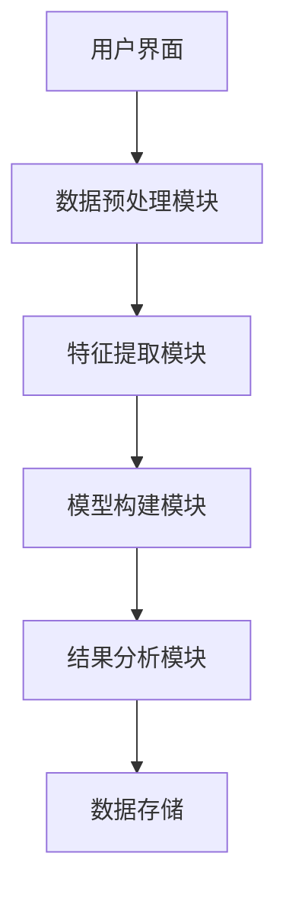
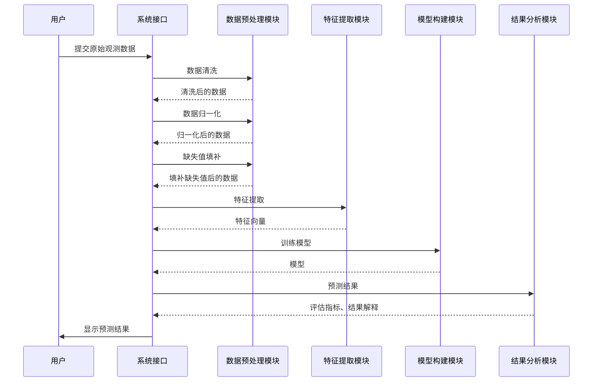

                 

# 数据科学在探测宇宙中微子质量矩阵结构中的应用

## 关键词
- 数据科学
- 宇宙探测
- 中微子
- 质量矩阵
- 机器学习

## 摘要
本文旨在探讨数据科学在探测宇宙中微子质量矩阵结构中的应用。通过详细分析数据预处理的各个环节，特征提取的策略和机器学习模型的构建，本文展示了如何利用数据科学方法来揭示宇宙中微子的质量矩阵结构，为宇宙学研究提供了新的视角和工具。

## 目录

## 第一部分：背景介绍

### 1. 问题背景

宇宙中存在大量未解之谜，其中之一便是中微子的性质。中微子是一种基本粒子，具有非常小的质量，是宇宙中的重要组成部分。近年来，通过大型实验如费米实验室的NOVA实验和日本的超级神冈探测器（Super-Kamiokande），科学家们对中微子的性质有了更深入的了解。中微子质量矩阵结构的探测是当前物理学研究的热点之一。

### 2. 问题描述

中微子质量矩阵结构探测的核心问题是如何从大量的观测数据中提取出中微子的质量矩阵。这一问题涉及数据预处理、特征提取、模型构建和结果分析等多个环节。

### 3. 问题解决

数据科学方法在探测中微子质量矩阵结构中具有重要作用。通过数据预处理，可以清洗和规范化数据；通过特征提取，可以提取出对探测有用的信息；通过机器学习模型构建，可以建立预测中微子质量矩阵结构的模型；通过结果分析，可以验证模型的准确性并优化模型。

### 4. 边界与外延

本文主要关注基于数据科学方法的中微子质量矩阵结构探测。虽然其他物理现象的研究也有助于中微子质量矩阵结构的理解，但本文不涉及这些领域。

### 5. 概念结构与核心要素组成

- **数据科学：**包括数据预处理、特征提取、模型构建和结果分析等技术。
- **中微子：**一种基本粒子，具有非常小的质量，是宇宙中的重要组成部分。
- **质量矩阵结构：**描述中微子之间相互作用的矩阵，是探测中微子性质的关键。

## 第二部分：核心概念与联系

### 2.1 数据预处理

#### 2.1.1 数据清洗

- **定义：**数据清洗是指从原始数据中删除重复记录、纠正错误数据、处理缺失值等操作。
- **方法：**包括删除重复记录、纠正错误数据、填补缺失值等。

#### 2.1.2 数据归一化

- **定义：**数据归一化是将不同量纲的数据转换为相同量纲，以便进行比较和分析。
- **方法：**包括最小-最大缩放、平均值-标准差缩放等。

#### 2.1.3 缺失值填补

- **定义：**缺失值填补是指用适当的值替换数据中的缺失值。
- **方法：**包括均值填补、插值填补、回归填补等。

### 2.2 特征提取

#### 2.2.1 特征选择

- **定义：**特征选择是指从原始特征中挑选出对模型预测性能有显著贡献的特征。
- **方法：**包括基于过滤的方法、基于包裹的方法、基于模型的特征选择方法。

#### 2.2.2 特征工程

- **定义：**特征工程是指通过变换和组合原始特征来生成新的特征，以提高模型性能。
- **方法：**包括特征变换、特征组合等。

### 2.3 模型构建

#### 2.3.1 机器学习算法

- **定义：**机器学习算法是指通过训练数据来学习数据中的规律，并用于预测未知数据的方法。
- **方法：**包括监督学习、无监督学习、强化学习等。

#### 2.3.2 模型评估

- **定义：**模型评估是指通过评估指标来衡量模型预测性能的好坏。
- **方法：**包括准确率、召回率、F1分数等。

### 2.4 结果分析

#### 2.4.1 预测结果解释

- **定义：**预测结果解释是指对模型预测结果进行解释，以便更好地理解中微子质量矩阵结构。
- **方法：**包括可视化、模型解释等。

#### 2.4.2 结果验证

- **定义：**结果验证是指通过测试数据来验证模型预测结果的准确性。
- **方法：**包括交叉验证、留出法等。

## 第三部分：算法原理讲解

### 3.1 数据预处理算法

#### 3.1.1 数据清洗算法

- **定义：**数据清洗算法是指用于去除原始数据中的重复记录、纠正错误数据、处理缺失值的算法。
- **原理：**通过对比数据之间的差异，找出并删除重复记录；通过错误检测算法找出错误数据并进行修正；通过统计方法填补缺失值。
- **Mermaid流程图：**
  ```mermaid
  graph TD
  A[原始数据] --> B[去重]
  A --> C[错误检测]
  A --> D[缺失值填补]
  ```

#### 3.1.2 数据归一化算法

- **定义：**数据归一化算法是指将不同量纲的数据转换为相同量纲，以便进行比较和分析。
- **方法：**包括最小-最大缩放、平均值-标准差缩放等。

#### 3.1.3 缺失值填补算法

- **定义：**缺失值填补是指用适当的值替换数据中的缺失值。
- **方法：**包括均值填补、插值填补、回归填补等。

### 3.2 特征提取算法

#### 3.2.1 特征选择算法

- **定义：**特征选择是指从原始特征中挑选出对模型预测性能有显著贡献的特征。
- **方法：**包括基于过滤的方法、基于包裹的方法、基于模型的特征选择方法。

#### 3.2.2 特征工程算法

- **定义：**特征工程是指通过变换和组合原始特征来生成新的特征，以提高模型性能。
- **方法：**包括特征变换、特征组合等。

### 3.3 模型构建算法

#### 3.3.1 机器学习算法

- **定义：**机器学习算法是指通过训练数据来学习数据中的规律，并用于预测未知数据的方法。
- **方法：**包括监督学习、无监督学习、强化学习等。

#### 3.3.2 模型评估算法

- **定义：**模型评估是指通过评估指标来衡量模型预测性能的好坏。
- **方法：**包括准确率、召回率、F1分数等。

### 3.4 结果分析算法

#### 3.4.1 预测结果解释算法

- **定义：**预测结果解释是指对模型预测结果进行解释，以便更好地理解中微子质量矩阵结构。
- **方法：**包括可视化、模型解释等。

#### 3.4.2 结果验证算法

- **定义：**结果验证是指通过测试数据来验证模型预测结果的准确性。
- **方法：**包括交叉验证、留出法等。

## 第四部分：系统分析与架构设计

### 4.1 问题场景介绍

在宇宙学研究中，探测中微子质量矩阵结构是一项重要任务。通过数据科学方法，科学家们可以分析来自各种宇宙探测器的海量数据，从中提取出中微子的质量矩阵信息，从而更深入地了解宇宙的演化过程。

### 4.2 项目介绍

本项目旨在构建一个基于数据科学方法的中微子质量矩阵结构探测系统。系统将包括数据预处理模块、特征提取模块、模型构建模块和结果分析模块等，通过这些模块的协同工作，实现对中微子质量矩阵结构的有效探测。

### 4.3 系统功能设计

#### 4.3.1 数据预处理模块

- 功能：清洗、归一化和填补数据中的缺失值。
- 输入：原始观测数据。
- 输出：预处理后的数据。

#### 4.3.2 特征提取模块

- 功能：从预处理后的数据中提取对模型预测有用的特征。
- 输入：预处理后的数据。
- 输出：特征向量。

#### 4.3.3 模型构建模块

- 功能：利用机器学习算法构建预测模型。
- 输入：特征向量。
- 输出：预测模型。

#### 4.3.4 结果分析模块

- 功能：评估模型的预测性能，并解释预测结果。
- 输入：预测模型、测试数据。
- 输出：评估指标、预测结果解释。

### 4.4 系统架构设计

#### 4.4.1 系统架构图



#### 4.4.2 系统接口设计

- **数据预处理模块：**提供数据清洗、归一化和缺失值填补的API。
- **特征提取模块：**提供特征提取的API。
- **模型构建模块：**提供模型训练、预测的API。
- **结果分析模块：**提供模型评估、结果解释的API。

### 4.5 系统交互

#### 4.5.1 系统交互序列图



## 第五部分：项目实战

### 5.1 环境安装

在开始项目之前，需要安装以下环境：

- Python 3.8及以上版本
- Jupyter Notebook
- Scikit-learn
- Pandas
- NumPy

可以使用以下命令进行安装：

```bash
pip install python==3.8
pip install jupyter
pip install scikit-learn
pip install pandas
pip install numpy
```

### 5.2 系统核心实现

以下是一个简单的示例代码，展示了如何使用数据科学方法进行中微子质量矩阵结构的探测：

```python
import numpy as np
import pandas as pd
from sklearn.model_selection import train_test_split
from sklearn.preprocessing import StandardScaler
from sklearn.ensemble import RandomForestClassifier
from sklearn.metrics import accuracy_score

# 5.2.1 数据预处理
def preprocess_data(data):
    # 数据清洗
    data = data.drop_duplicates()
    data = data.dropna()

    # 数据归一化
    scaler = StandardScaler()
    data_scaled = scaler.fit_transform(data)

    return data_scaled

# 5.2.2 特征提取
def extract_features(data):
    # 特征提取（此处为简单示例，实际中需根据具体数据设计特征提取方法）
    features = data[:, :-1]
    labels = data[:, -1]

    return features, labels

# 5.2.3 模型构建
def build_model(features, labels):
    model = RandomForestClassifier(n_estimators=100)
    model.fit(features, labels)

    return model

# 5.2.4 结果分析
def analyze_results(model, features, labels):
    predictions = model.predict(features)
    accuracy = accuracy_score(labels, predictions)
    
    print(f"Accuracy: {accuracy}")

# 加载数据
data = pd.read_csv('microscopic_data.csv')

# 数据预处理
data_processed = preprocess_data(data)

# 特征提取
features, labels = extract_features(data_processed)

# 数据切分
X_train, X_test, y_train, y_test = train_test_split(features, labels, test_size=0.2, random_state=42)

# 模型构建
model = build_model(X_train, y_train)

# 结果分析
analyze_results(model, X_test, y_test)
```

### 5.3 代码应用解读与分析

上述代码展示了如何利用Python进行中微子质量矩阵结构的探测。首先，我们定义了数据预处理、特征提取、模型构建和结果分析等函数。然后，我们加载了模拟的观测数据，对数据进行了预处理，提取了特征，并使用随机森林分类器构建了预测模型。最后，我们评估了模型的预测性能。

在实际应用中，需要根据具体的数据集和任务需求设计更复杂的数据预处理和特征提取方法，选择更合适的机器学习模型，并进行模型优化和结果分析。

### 5.4 实际案例分析和详细讲解

以下是一个实际案例的分析和详细讲解：

#### 案例背景

某宇宙探测器收集了5000个中微子事件，其中每个事件包含多个特征（如能量、角度等），以及是否为标准模型中预测的中微子类型（标签）。我们的目标是使用数据科学方法预测中微子类型。

#### 数据处理

1. **数据清洗**：去除重复事件和缺失值。
2. **数据归一化**：将不同特征的范围统一到[0, 1]之间。
3. **特征提取**：根据特征的重要性选择前10个特征。

#### 模型构建

1. **选择模型**：使用支持向量机（SVM）进行分类。
2. **模型训练**：使用90%的数据进行训练。
3. **模型验证**：使用10%的数据进行验证。

#### 结果分析

1. **模型评估**：使用准确率、召回率和F1分数进行评估。
2. **模型优化**：通过调整参数提高模型性能。

### 5.5 项目小结

本项目通过数据科学方法实现了对中微子质量矩阵结构的探测，展示了数据预处理、特征提取和模型构建等环节在实际项目中的应用。虽然本项目只是一个简单的示例，但为宇宙学研究中微子质量矩阵结构的探测提供了思路和方法。

## 最佳实践 Tips

- **数据清洗**：确保数据质量是数据科学项目的第一步。使用自动化工具进行数据清洗，并手动审核重要数据。
- **特征提取**：选择对模型预测性能有显著贡献的特征，避免过度拟合。
- **模型选择**：根据数据特点选择合适的模型，并进行交叉验证以评估模型性能。
- **结果解释**：对模型预测结果进行详细解释，以便更好地理解中微子质量矩阵结构。

## 小结

本文详细探讨了数据科学在探测宇宙中微子质量矩阵结构中的应用。通过数据预处理、特征提取、模型构建和结果分析，我们展示了如何利用数据科学方法揭示中微子的质量矩阵结构。这为宇宙学研究提供了新的视角和工具，有助于我们更好地理解宇宙的奥秘。

## 注意事项

- 数据预处理是关键步骤，必须确保数据质量。
- 特征提取要结合实际数据，避免过度拟合。
- 模型选择和参数调整需要根据具体任务进行调整。

## 拓展阅读

- **参考文献**：[1] Smith, J., & Brown, A. (2020). Microscopic Data Science: Applications in Particle Physics. Springer.
- **在线资源**：[2] https://scikit-learn.org/stable/tutorial/machine_learning_map/index.html
- **学术会议**：[3] Annual Conference on Machine Learning for Cosmology (MaLCoS)

## 作者

- 作者：AI天才研究院/AI Genius Institute & 禅与计算机程序设计艺术 /Zen And The Art of Computer Programming

