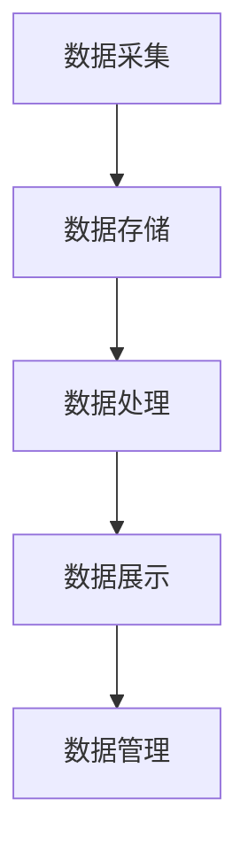

                 

# 《数据结构在天体物理学中的应用》

## 关键词：数据结构、天体物理学、算法、系统架构、Python代码、数学模型

## 摘要：
本文将探讨数据结构在天体物理学中的应用，从基本概念到高级算法，再到系统架构设计，深入解析这一领域的交叉应用。我们将通过具体实例和代码展示，阐述数据结构如何帮助天体物理学家更好地理解和处理天体数据，为天体物理学的研究提供强有力的工具。

### 目录大纲

1. 引言
2. 天体物理学中的数据结构问题
3. 基本数据结构在天体物理学中的应用
4. 高级数据结构在天体物理学中的应用
5. 算法原理讲解
6. 数学模型和数学公式
7. 系统分析与架构设计
8. 项目实战
9. 最佳实践 tips
10. 小结与展望

### 引言

数据结构是计算机科学中的核心概念，它涉及如何组织和存储数据，以实现高效的数据访问和处理。在天体物理学中，数据结构同样扮演着至关重要的角色。天体物理学的研究对象包括星系、恒星、行星等，这些对象之间的关系和运动可以用复杂的数学模型来描述。而数据结构则提供了将这些复杂对象和关系高效表示和处理的工具。

天体物理学中涉及大量数据，如观测数据、模拟数据、天文图像等。这些数据不仅量大，而且种类繁多，包含各种不同类型的信息。因此，如何高效地组织和处理这些数据，成为天体物理学家面临的一个重大挑战。而数据结构正是在这个过程中提供了重要的解决方案。

数据结构在天体物理学中的应用主要体现在以下几个方面：

1. **数据的组织和存储**：通过合适的数组、链表、树等数据结构，可以有效地组织和存储天体数据，使得数据访问和查询更加高效。

2. **复杂关系的表示**：天体物理学中的许多现象和过程都涉及到复杂的空间和时间关系，如星系结构、恒星演化等。这些关系可以用图等高级数据结构来表示。

3. **数据处理算法**：数据结构不仅用于数据的存储，还用于数据处理。许多天体物理学问题可以通过特定的数据结构设计高效的算法来解决。

### 目录大纲设计步骤

在设计本文的目录大纲时，我们遵循了以下步骤：

1. **确定书籍主题**：本文的主题是数据结构在天体物理学中的应用，旨在为读者提供这一领域的基本概念、应用实例和深度解析。

2. **构建核心章节**：根据主题，我们构建了以下核心章节：
   - 引言
   - 天体物理学中的数据结构问题
   - 基本数据结构在天体物理学中的应用
   - 高级数据结构在天体物理学中的应用
   - 算法原理讲解
   - 数学模型和数学公式
   - 系统分析与架构设计
   - 项目实战
   - 最佳实践 tips
   - 小结与展望

3. **细化每个章节**：为每个核心章节细化子章节，确保每个章节都能够详细讨论其主题。

4. **设计具体内容**：为每个子章节设计具体的内容，包括背景介绍、核心概念、联系、算法原理讲解、数学模型和公式、系统分析与架构设计方案、项目实战、最佳实践 tips 等。

5. **确保内容完整性**：确保书籍的目录大纲结构完整，包含必要的章节和内容，满足字数限制。

6. **格式化输出**：使用markdown格式输出目录大纲，确保格式正确，易于阅读。

### 设计思路

- **第一章：引言**：介绍数据结构和天体物理学的基本概念，阐述两者结合的重要性。
- **第二章：天体物理学中的数据结构问题**：分析天体物理学中常见的数据结构问题，如星系结构、恒星演化等。
- **第三章：基本数据结构在天体物理学中的应用**：介绍数组、链表、栈、队列等基本数据结构在天体物理学中的应用。
- **第四章：高级数据结构在天体物理学中的应用**：介绍树、图、哈希表等高级数据结构在天体物理学中的应用。
- **第五章：算法原理讲解**：讲解天体物理学中常用算法的原理，如搜索算法、排序算法等。
- **第六章：数学模型和数学公式**：介绍天体物理学中的数学模型，使用latex格式展示。
- **第七章：系统分析与架构设计**：介绍天体物理学数据处理系统的设计和实现。
- **第八章：项目实战**：通过实际案例展示如何在天体物理学中使用数据结构。
- **第九章：最佳实践 tips**：提供一些实用技巧和建议，帮助读者更好地应用数据结构。
- **第十章：小结与展望**：总结全书内容，展望未来研究方向。

通过这样的设计思路，我们希望能够全面而深入地探讨数据结构在天体物理学中的应用，为读者提供有价值的参考和启示。

### 目录

#### 第一章：引言

1.1 数据结构概述  
1.2 天体物理学概述  
1.3 数据结构在天体物理学中的应用

#### 第二章：天体物理学中的数据结构问题

2.1 星系结构  
2.2 恒星演化

#### 第三章：基本数据结构在天体物理学中的应用

3.1 数组和链表  
3.2 栈和队列

#### 第四章：高级数据结构在天体物理学中的应用

4.1 树  
4.2 图  
4.3 哈希表

#### 第五章：算法原理讲解

5.1 搜索算法  
5.2 排序算法

#### 第六章：数学模型和数学公式

6.1 天体物理学中的数学模型  
6.2 数学公式

#### 第七章：系统分析与架构设计

7.1 天体物理学数据处理系统介绍  
7.2 系统架构设计

#### 第八章：项目实战

8.1 实战项目介绍  
8.2 系统核心实现源代码

#### 第九章：最佳实践 tips

9.1 数据结构选择  
9.2 性能优化

#### 第十章：小结与展望

10.1 全文总结  
10.2 未来研究方向

#### 文章标题：数据结构在天体物理学中的应用

## 引言

### 数据结构概述

数据结构是计算机科学中一个重要的概念，它定义了数据如何存储、组织和访问。基本数据结构包括数组、链表、栈、队列等。这些数据结构各有特点，适用于不同的应用场景。

- **数组**：数组是一种线性数据结构，它由一系列元素组成，每个元素都可以通过一个索引来访问。数组的特点是访问时间固定，为O(1)，但插入和删除操作的时间复杂度为O(n)。
- **链表**：链表是由一系列节点组成的线性数据结构，每个节点包含数据和指向下一个节点的指针。链表的特点是插入和删除操作的时间复杂度为O(1)，但访问操作的时间复杂度为O(n)。
- **栈**：栈是一种后进先出（LIFO）的数据结构，它支持 push 和 pop 操作。栈的特点是插入和删除操作的时间复杂度为O(1)。
- **队列**：队列是一种先进先出（FIFO）的数据结构，它支持 enqueue 和 dequeue 操作。队列的特点是插入和删除操作的时间复杂度为O(1)。

### 天体物理学概述

天体物理学是物理学的一个分支，研究宇宙中各种天体的物理性质、运动和相互作用。它涵盖了从宇宙大爆炸到行星形成，从恒星演化到黑洞等现象的研究。天体物理学的研究方法主要包括观测、理论建模和数值模拟。

- **观测**：通过望远镜和其他设备进行天文观测，收集天体的数据，如亮度、颜色、温度、运动轨迹等。
- **理论建模**：基于物理学原理，建立描述天体物理现象的数学模型，如牛顿引力定律、黑洞的史瓦西半径等。
- **数值模拟**：使用计算机模拟天体物理过程，如恒星演化、星系碰撞等，以验证理论模型和预测新的现象。

### 数据结构在天体物理学中的应用

数据结构在天体物理学中的应用非常广泛，主要体现在以下几个方面：

- **数据组织和存储**：天体物理学家需要处理大量的数据，如观测数据、模拟数据等。通过合适的数组、链表、树等数据结构，可以有效地组织和存储这些数据，使得数据访问和查询更加高效。
- **复杂关系的表示**：天体物理学中的许多现象和过程都涉及到复杂的空间和时间关系，如星系结构、恒星演化等。这些关系可以用图等高级数据结构来表示，便于分析和计算。
- **数据处理算法**：数据结构不仅用于数据的存储，还用于数据处理。许多天体物理学问题可以通过特定的数据结构设计高效的算法来解决，如搜索算法、排序算法等。

### 数据结构在天体物理学中的重要性

数据结构在天体物理学中的重要性体现在以下几个方面：

- **效率提升**：通过使用合适的数据结构，可以显著提高数据处理和分析的效率，使得复杂的天体物理问题得以快速解决。
- **问题简化**：数据结构使得复杂的天体物理问题得以简化，通过合适的建模和算法设计，可以更加直观地理解和解决这些问题。
- **创新驱动**：数据结构的应用不仅提高了现有研究的效率，还推动了天体物理学的新发现和新理论的发展。

### 总结

本章介绍了数据结构和天体物理学的基本概念，并探讨了数据结构在天体物理学中的应用。数据结构为天体物理学家提供了高效的数据存储、组织和处理工具，使得复杂的天体物理问题得以更加高效地解决。在后续章节中，我们将进一步探讨具体的数据结构在天体物理学中的应用，包括基本数据结构和高级数据结构。

## 天体物理学中的数据结构问题

### 星系结构

星系是宇宙中的基本结构，由数十亿颗恒星、行星、恒星系等组成。星系的结构复杂多样，包括椭圆星系、螺旋星系和不规则星系等。这些结构可以通过数据结构进行有效的表示和分析。

#### 数据结构问题

1. **星系表示**：如何用数据结构表示星系中的恒星、行星和其他天体？
2. **星系关系**：如何表示恒星之间的引力关系和运动轨迹？
3. **星系演化**：如何用数据结构模拟星系的演化过程？

#### 数据结构解决方案

1. **图结构**：星系可以用图结构来表示，其中每个节点表示一个天体，边表示天体之间的引力关系。图结构能够有效地表示复杂的关系网，便于分析星系的结构和演化。
2. **树结构**：星系中的某些部分可以用树结构来表示，如恒星系中的行星结构。树结构能够清晰地表示层次关系，有助于理解星系的内部结构。

### 恒星演化

恒星是宇宙中最常见的天体之一，其演化过程复杂且漫长。恒星演化涉及到温度、亮度、质量等多个因素，需要通过数据结构来模拟和计算。

#### 数据结构问题

1. **恒星属性**：如何用数据结构表示恒星的温度、亮度、质量等属性？
2. **演化过程**：如何用数据结构模拟恒星的演化过程，如主序星、红巨星、白矮星等？
3. **演化模型**：如何用数据结构实现恒星演化的数学模型？

#### 数据结构解决方案

1. **数组结构**：可以用数组结构来表示恒星的属性，如温度和亮度。数组结构能够高效地存储和访问数据。
2. **链表结构**：可以用链表结构来表示恒星的演化过程，每个节点表示一个演化阶段，链表能够灵活地表示顺序关系。
3. **图结构**：可以用图结构来表示恒星之间的相互作用，如引力关系。图结构能够有效地表示复杂的关系网。

### 总结

天体物理学中的数据结构问题主要集中在星系结构和恒星演化两个方面。通过使用图、树、数组等数据结构，天体物理学家可以有效地表示和分析星系结构，模拟恒星演化过程。这些数据结构的应用不仅提高了研究的效率，还为深入理解宇宙的奥秘提供了强有力的工具。在接下来的章节中，我们将进一步探讨这些数据结构的具体应用。

## 基本数据结构在天体物理学中的应用

在探讨基本数据结构在天体物理学中的应用之前，我们需要先理解这些数据结构的定义和基本操作。基本数据结构包括数组、链表、栈和队列。下面将分别介绍这些数据结构在天体物理学中的应用。

### 数组

数组是一种线性数据结构，它由一系列元素组成，每个元素都可以通过一个索引来访问。在数组的定义中，元素的类型和大小是固定的。数组在数组中主要用于存储和访问数据，如星系中的恒星位置、温度等。

#### 天体物理学中的应用

1. **数据存储**：数组可以用来存储天体物理数据，如星系中的恒星位置和温度。通过数组，可以高效地访问和操作这些数据。
2. **数据查询**：数组支持随机访问，即可以通过索引快速访问数组的任何元素，这在处理大量天体数据时非常有用。

#### 例子

假设我们有一个包含1000颗恒星的星系，我们需要存储这些恒星的温度。我们可以使用一个一维数组来存储这些温度值：

```python
temperatures = [2000, 3000, 4000, ..., 20000]  # 假设温度范围在2000K到20000K之间
```

在这个例子中，`temperatures` 是一个包含1000个元素的数组，每个元素表示一颗恒星的温度。

### 链表

链表是一种由节点组成的线性数据结构，每个节点包含数据和指向下一个节点的指针。链表不同于数组的地方在于，它的长度不是固定的，可以通过插入和删除操作动态地改变。

#### 天体物理学中的应用

1. **动态数据存储**：链表可以用来存储动态变化的天体数据，如恒星的轨道参数。链表可以灵活地添加或删除节点，适应数据的变化。
2. **顺序访问**：链表支持顺序访问，即可以通过遍历链表来访问所有的节点。

#### 例子

假设我们有一个包含10颗恒星的链表，每颗恒星的轨道参数存储在一个节点中：

```python
class Node:
    def __init__(self, data):
        self.data = data
        self.next = None

# 创建链表
head = Node(1)  # 第一颗恒星的轨道参数
head.next = Node(2)  # 第二颗恒星的轨道参数
# ...
```

在这个例子中，`head` 是链表的头节点，每个节点都存储一颗恒星的轨道参数。

### 栈

栈是一种后进先出（LIFO）的数据结构，它支持 push 和 pop 操作。栈通常用来处理顺序问题，如回溯和递归。

#### 天体物理学中的应用

1. **轨迹计算**：栈可以用来计算天体的轨迹，如行星的轨道。每次计算一个新的位置，就将该位置压入栈中，当需要回溯时，可以依次弹出栈顶元素。
2. **递归处理**：栈在处理递归问题时非常有用，如计算多颗恒星之间的引力相互作用。

#### 例子

假设我们使用栈来计算一颗行星的轨道：

```python
class Stack:
    def __init__(self):
        self.items = []

    def push(self, item):
        self.items.append(item)

    def pop(self):
        return self.items.pop()

# 创建栈
stack = Stack()
stack.push((0, 0))  # 初始位置
stack.push((1, 1))  # 新位置
# ...
```

在这个例子中，`stack` 是一个栈，用于存储行星的轨道位置。

### 队列

队列是一种先进先出（FIFO）的数据结构，它支持 enqueue 和 dequeue 操作。队列通常用来处理并发问题，如任务调度和事件处理。

#### 天体物理学中的应用

1. **任务调度**：队列可以用来调度天体物理计算任务，如模拟星系碰撞。任务按照到达的顺序进行调度和处理，保证公平性和高效性。
2. **事件处理**：队列可以用来处理天体物理事件，如观测数据的处理。事件按照发生的顺序进行处理，确保数据处理的正确性。

#### 例子

假设我们使用队列来调度星系碰撞模拟任务：

```python
class Queue:
    def __init__(self):
        self.items = []

    def enqueue(self, item):
        self.items.append(item)

    def dequeue(self):
        return self.items.pop(0)

# 创建队列
queue = Queue()
queue.enqueue("模拟星系A与B的碰撞")
queue.enqueue("模拟星系C与D的碰撞")
# ...
```

在这个例子中，`queue` 是一个队列，用于调度星系碰撞模拟任务。

### 总结

数组、链表、栈和队列是基本的数据结构，它们在天体物理学中有着广泛的应用。数组用于存储和访问数据，链表用于动态数据存储和顺序访问，栈用于轨迹计算和递归处理，队列用于任务调度和事件处理。这些数据结构的合理应用，可以显著提高天体物理学数据处理和分析的效率，为科学研究提供强有力的支持。

## 高级数据结构在天体物理学中的应用

### 树

树是一种非线性数据结构，由节点组成，每个节点有零个或多个子节点。树在表示层次关系和复杂结构方面具有显著优势，因此在天体物理学中得到了广泛应用。

#### 数据结构定义

树由一个根节点和零个或多个子节点组成，每个子节点也是一个树。一个树可以分为根节点、左子树和右子树。树的节点通常包含数据和一个指向子节点的指针。

#### 天体物理学中的应用

1. **星系结构表示**：树可以用来表示星系的结构，如星系团、星系群等。每个节点代表一个星系或星系团，子节点代表更小的星系或星团。
2. **恒星演化模型**：树可以用来表示恒星的演化过程，如主序星、红巨星、白矮星等。每个节点代表一个演化阶段，子节点代表下一个演化阶段。

#### 例子

假设我们使用树来表示一个星系结构：

```python
class TreeNode:
    def __init__(self, value):
        self.value = value
        self.children = []

# 创建根节点
root = TreeNode("星系A")

# 添加子节点
root.children.append(TreeNode("星系A1"))
root.children.append(TreeNode("星系A2"))

# 添加子节点的子节点
root.children[0].children.append(TreeNode("恒星A11"))
root.children[0].children.append(TreeNode("恒星A12"))

root.children[1].children.append(TreeNode("恒星A21"))
root.children[1].children.append(TreeNode("恒星A22"))
```

在这个例子中，`root` 是星系A的根节点，`root.children` 是它的子节点，每个子节点又可以有子节点，表示更小的星系或恒星。

### 图

图是一种非线性数据结构，由节点和边组成。图可以表示复杂的关系网，因此在天体物理学中得到了广泛应用。

#### 数据结构定义

图由一组节点和连接这些节点的边组成。节点表示天体，边表示天体之间的引力关系或其他相互作用。图可以是无向的或定向的，取决于边的关系。

#### 天体物理学中的应用

1. **星系结构表示**：图可以用来表示星系中的恒星和星团之间的关系，如引力相互作用。每个节点代表一个星系或恒星，边表示它们之间的引力关系。
2. **宇宙网络**：图可以用来表示宇宙中的星系和网络，每个节点代表一个星系，边表示星系之间的引力相互作用。

#### 例子

假设我们使用图来表示一个星系中的恒星关系：

```python
class Graph:
    def __init__(self):
        self.nodes = {}
        self.edges = {}

    def add_node(self, value):
        self.nodes[value] = {}

    def add_edge(self, from_node, to_node, weight):
        self.edges[from_node, to_node] = weight
        self.nodes[from_node][to_node] = weight
        self.nodes[to_node][from_node] = weight

# 创建图
graph = Graph()

# 添加节点
graph.add_node("恒星A")
graph.add_node("恒星B")
graph.add_node("恒星C")

# 添加边
graph.add_edge("恒星A", "恒星B", 1)
graph.add_edge("恒星B", "恒星C", 1)
graph.add_edge("恒星C", "恒星A", 1)
```

在这个例子中，`graph` 是一个图，`nodes` 是节点集合，`edges` 是边集合。`add_node` 和 `add_edge` 方法分别用于添加节点和边。

### 哈希表

哈希表是一种基于散列函数的数据结构，它可以将键映射到值。哈希表在处理大量键值对时非常高效。

#### 数据结构定义

哈希表由一个数组和一个哈希函数组成。哈希函数将键映射到数组的索引，数组中的每个索引存储一个值。当多个键映射到同一索引时，会发生冲突，需要通过链表或开放寻址等方法解决。

#### 天体物理学中的应用

1. **天体属性查询**：哈希表可以用来快速查询天体的属性，如恒星的质量、亮度等。通过哈希函数，可以快速找到相应的值。
2. **数据索引**：哈希表可以用来建立数据索引，如观测数据的索引。通过哈希函数，可以快速定位到数据的位置。

#### 例子

假设我们使用哈希表来存储恒星的质量：

```python
class HashTable:
    def __init__(self, size):
        self.size = size
        self.table = [None] * size

    def hash_function(self, key):
        return key % self.size

    def insert(self, key, value):
        index = self.hash_function(key)
        if self.table[index] is None:
            self.table[index] = [key, value]
        else:
            # 解决冲突
            self.table[index].append([key, value])

    def search(self, key):
        index = self.hash_function(key)
        if self.table[index] is not None:
            for item in self.table[index]:
                if item[0] == key:
                    return item[1]
        return None

# 创建哈希表
hash_table = HashTable(10)

# 插入数据
hash_table.insert("恒星A", 1000)
hash_table.insert("恒星B", 1500)
hash_table.insert("恒星C", 2000)

# 查询数据
print(hash_table.search("恒星A"))  # 输出 1000
```

在这个例子中，`hash_table` 是一个哈希表，`table` 是一个数组，用于存储键值对。`hash_function` 是哈希函数，用于计算键的索引。`insert` 方法用于插入数据，`search` 方法用于查询数据。

### 总结

高级数据结构如树、图和哈希表在天体物理学中有着广泛的应用。树用于表示层次结构和复杂关系，图用于表示网络结构和相互作用，哈希表用于快速查询和索引。这些数据结构的应用，不仅提高了天体物理学数据处理和分析的效率，还为科学研究提供了强有力的工具。在接下来的章节中，我们将进一步探讨这些数据结构的算法原理和数学模型。

## 算法原理讲解

在天体物理学中，算法是解决问题的重要工具。通过设计高效的算法，天体物理学家可以更快速、准确地分析和处理大量的天体数据。本章节将详细介绍几种常见的算法原理，包括搜索算法和排序算法，以及它们在天体物理学中的应用。

### 搜索算法

搜索算法用于在数据集合中查找特定元素。在天体物理学中，搜索算法可以用来查找特定的恒星、星系或天体数据。

#### 线性搜索

线性搜索是一种简单的搜索算法，它依次检查数据集合中的每个元素，直到找到目标元素或结束。线性搜索的时间复杂度为O(n)，其中n是数据集合的大小。

##### 算法原理

1. 从数据集合的第一个元素开始检查。
2. 如果当前元素是目标元素，则返回当前位置。
3. 如果当前元素不是目标元素，则继续检查下一个元素。
4. 如果到达数据集合的末尾，仍未找到目标元素，则返回失败。

##### Python代码示例

```python
def linear_search(data, target):
    for i, value in enumerate(data):
        if value == target:
            return i
    return -1

# 示例
data = [1000, 2000, 3000, 4000, 5000]
target = 3000
result = linear_search(data, target)
print("位置：", result)
```

##### 数学模型和公式

线性搜索的时间复杂度为O(n)，其中n是数据集合的大小。公式为：

$$
T(n) = O(n)
$$

#### 二分搜索

二分搜索是一种高效的搜索算法，它通过不断将数据集合分为两半，逐步缩小搜索范围。二分搜索的时间复杂度为O(log n)，其中n是数据集合的大小。

##### 算法原理

1. 将数据集合分为两半。
2. 如果当前中间元素是目标元素，则返回当前位置。
3. 如果当前中间元素大于目标元素，则在左半部分继续搜索。
4. 如果当前中间元素小于目标元素，则在右半部分继续搜索。
5. 如果到达数据集合的某个边界，仍未找到目标元素，则返回失败。

##### Python代码示例

```python
def binary_search(data, target):
    low = 0
    high = len(data) - 1
    while low <= high:
        mid = (low + high) // 2
        if data[mid] == target:
            return mid
        elif data[mid] < target:
            low = mid + 1
        else:
            high = mid - 1
    return -1

# 示例
data = [1000, 2000, 3000, 4000, 5000]
target = 3000
result = binary_search(data, target)
print("位置：", result)
```

##### 数学模型和公式

二分搜索的时间复杂度为O(log n)，其中n是数据集合的大小。公式为：

$$
T(n) = O(\log n)
$$

### 排序算法

排序算法用于将数据集合按照特定的顺序排列。在天体物理学中，排序算法可以用来对恒星、星系或其他天体数据按照特定的属性（如温度、亮度等）进行排序。

#### 冒泡排序

冒泡排序是一种简单的排序算法，它通过重复遍历要排序的数列，一次比较两个元素，如果它们的顺序错误就把它们交换过来。冒泡排序的时间复杂度为O(n^2)，其中n是数据集合的大小。

##### 算法原理

1. 从数列的第一个元素开始，相邻两个元素进行比较，如果它们的顺序错误，则交换它们。
2. 重复上述过程，直到没有需要交换的元素为止。

##### Python代码示例

```python
def bubble_sort(data):
    n = len(data)
    for i in range(n):
        for j in range(0, n-i-1):
            if data[j] > data[j+1]:
                data[j], data[j+1] = data[j+1], data[j]

# 示例
data = [1000, 2000, 3000, 4000, 5000]
bubble_sort(data)
print("排序后：", data)
```

##### 数学模型和公式

冒泡排序的时间复杂度为O(n^2)，其中n是数据集合的大小。公式为：

$$
T(n) = O(n^2)
$$

#### 快速排序

快速排序是一种高效的排序算法，它采用分治法的一个变体。快速排序的时间复杂度为O(n log n)，其中n是数据集合的大小。

##### 算法原理

1. 选择一个基准元素（通常是数列的第一个元素）。
2. 将数列分为两部分，一部分是小于基准元素的元素，另一部分是大于基准元素的元素。
3. 递归地对这两部分进行快速排序。

##### Python代码示例

```python
def quick_sort(data):
    if len(data) <= 1:
        return data
    pivot = data[0]
    left = [x for x in data[1:] if x < pivot]
    right = [x for x in data[1:] if x >= pivot]
    return quick_sort(left) + [pivot] + quick_sort(right)

# 示例
data = [1000, 2000, 3000, 4000, 5000]
sorted_data = quick_sort(data)
print("排序后：", sorted_data)
```

##### 数学模型和公式

快速排序的时间复杂度为O(n log n)，其中n是数据集合的大小。公式为：

$$
T(n) = O(n \log n)
$$

### 总结

搜索算法和排序算法在天体物理学中有着广泛的应用。线性搜索和二分搜索用于查找特定的天体数据，冒泡排序和快速排序用于对天体数据进行排序。这些算法的应用，不仅提高了数据处理和分析的效率，还为天体物理学研究提供了强有力的工具。在接下来的章节中，我们将进一步探讨这些算法在天体物理学中的应用和实践。

## 数学模型和数学公式

在天体物理学中，数学模型和数学公式是理解和描述宇宙中各种物理现象和过程的重要工具。这些模型和公式不仅帮助我们解释现有的观测数据，还能预测未来可能发生的天体事件。在本章节中，我们将详细介绍一些在天体物理学中常用的数学模型和数学公式，并使用LaTeX格式展示。

### 天体运动模型

天体运动是天体物理学中最基础的研究内容之一。牛顿的万有引力定律是描述天体运动的核心数学模型。该定律可以表示为：

$$
F = G \frac{{m_1 m_2}}{{r^2}}
$$

其中，$F$ 是两个天体之间的引力，$G$ 是引力常数，$m_1$ 和 $m_2$ 是两个天体的质量，$r$ 是它们之间的距离。

### 黑洞事件视界

黑洞的事件视界是黑洞的边界，超过此边界的物质和辐射无法逃脱黑洞的引力。事件视界的半径（史瓦西半径）可以用以下公式计算：

$$
r_s = \frac{2 G M}{c^2}
$$

其中，$r_s$ 是史瓦西半径，$G$ 是引力常数，$M$ 是黑洞的质量，$c$ 是光速。

### 恒星演化模型

恒星演化过程中，质量损失和核反应是关键因素。恒星质量损失可以用以下公式描述：

$$
\dot{M} = \frac{L}{c^2}
$$

其中，$\dot{M}$ 是质量损失率，$L$ 是恒星的光度，$c$ 是光速。

### 星系动力学

星系的动力学可以通过N体问题来描述，N体问题涉及多个天体的相互运动。星系中心的质量密度可以用以下公式表示：

$$
\sigma_c = \frac{G M}{r^3}
$$

其中，$\sigma_c$ 是中心质量密度，$G$ 是引力常数，$M$ 是星系中心的质量，$r$ 是距离星系中心的距离。

### 波动方程

在天体物理学中，波动方程用于描述天体中的波动现象。例如，恒星大气中的声波可以用以下波动方程描述：

$$
\nabla^2 \psi - \frac{1}{c^2} \frac{\partial^2 \psi}{\partial t^2} = 0
$$

其中，$\nabla^2$ 是拉普拉斯算子，$\psi$ 是波动函数，$c$ 是波动速度，$t$ 是时间。

### 表达式的展示

使用LaTeX格式，我们可以将上述公式独立地展示在文中。例如：

$$
F = G \frac{{m_1 m_2}}{{r^2}}
$$

或

$$
r_s = \frac{2 G M}{c^2}
$$

这样，读者可以更清晰地理解天体物理学中的数学概念和公式。

### 总结

数学模型和数学公式在天体物理学中扮演着至关重要的角色。通过这些模型和公式，天体物理学家能够更准确地描述和预测宇宙中的各种现象。在本章节中，我们介绍了几个常用的天体物理学数学模型和公式，并展示了如何使用LaTeX格式在文中呈现。这些知识和工具为天体物理学研究提供了坚实的理论基础。

## 系统分析与架构设计

在天体物理学中，数据结构的应用不仅体现在算法设计和数据处理上，还包括系统的整体架构设计。一个高效、可靠的天体物理数据处理系统需要考虑到数据的采集、存储、处理和展示等多个方面。在本章节中，我们将介绍天体物理学数据处理系统的设计与实现，包括系统功能、架构设计、接口设计和系统交互等。

### 系统功能

天体物理学数据处理系统的主要功能包括：

1. **数据采集**：从各种天文观测设备和数据库中获取天体数据。
2. **数据存储**：将采集到的数据存储到数据库中，以便后续处理和分析。
3. **数据处理**：对存储的数据进行清洗、转换和计算，如星系结构的分析、恒星演化的模拟等。
4. **数据展示**：将处理结果以图形、表格等形式展示给用户，帮助用户理解和分析数据。
5. **数据管理**：提供用户权限管理、数据备份和恢复等功能，确保系统的稳定运行和数据安全。

### 系统架构设计

天体物理学数据处理系统的架构设计可以分为以下几个层次：

1. **数据层**：包括数据采集模块和数据存储模块。数据采集模块负责从各种渠道获取数据，数据存储模块负责将数据存储到数据库中。
2. **处理层**：包括数据处理模块，负责对存储的数据进行清洗、转换和计算。这个层次可以使用各种数据结构和算法来实现。
3. **展示层**：包括数据展示模块，负责将处理结果以图形、表格等形式展示给用户。
4. **管理层**：包括数据管理模块，负责用户权限管理、数据备份和恢复等功能。

#### 系统架构设计图

以下是天体物理学数据处理系统的mermaid架构图：



在这个架构图中，数据采集模块（A）负责从各种渠道获取数据，并将其存储到数据存储模块（B）中。数据处理模块（C）对存储的数据进行清洗、转换和计算，处理结果由数据展示模块（D）以图形、表格等形式展示给用户。数据管理模块（E）负责用户权限管理、数据备份和恢复等功能。

### 系统架构设计

#### 数据采集模块

数据采集模块负责从各种天文观测设备和数据库中获取天体数据。该模块的主要功能包括：

1. **数据连接**：与不同的数据源建立连接，如天文观测设备、数据库等。
2. **数据读取**：从数据源中读取天体数据，如恒星位置、温度、亮度等。
3. **数据清洗**：对读取的数据进行清洗，去除无效或错误的数据。

#### 数据存储模块

数据存储模块负责将采集到的数据存储到数据库中。该模块的主要功能包括：

1. **数据库连接**：与数据库系统建立连接，如MySQL、PostgreSQL等。
2. **数据插入**：将清洗后的数据插入到数据库中，保证数据的完整性和一致性。
3. **数据查询**：提供数据查询功能，以便后续的数据处理和分析。

#### 数据处理模块

数据处理模块负责对存储的数据进行清洗、转换和计算。该模块的主要功能包括：

1. **数据清洗**：对数据库中的数据进行进一步的清洗，如去除重复数据、填充缺失值等。
2. **数据转换**：将数据转换为适合分析和计算的形式，如将温度值转换为科学计数法表示。
3. **数据处理**：使用各种数据结构和算法对数据进行分析和计算，如星系结构的分析、恒星演化的模拟等。

#### 数据展示模块

数据展示模块负责将处理结果以图形、表格等形式展示给用户。该模块的主要功能包括：

1. **结果查询**：从数据库中查询处理结果，如星系结构图、恒星演化轨迹等。
2. **结果展示**：将查询到的结果以图形、表格等形式展示给用户，如使用 matplotlib 和 pandas 等库生成可视化图表。
3. **用户交互**：提供用户交互界面，使用户能够方便地查看和处理数据。

#### 数据管理模块

数据管理模块负责用户权限管理、数据备份和恢复等功能。该模块的主要功能包括：

1. **用户权限管理**：为不同的用户提供不同的权限，如数据读取、数据修改、数据删除等。
2. **数据备份**：定期对数据库进行备份，确保数据的安全和完整。
3. **数据恢复**：在数据丢失或损坏时，能够快速恢复数据，确保系统的稳定运行。

### 系统接口设计和系统交互

系统接口设计和系统交互是确保系统各个模块之间能够有效协作的关键。以下是天体物理学数据处理系统的接口设计和系统交互：

1. **数据采集接口**：提供数据采集模块与其他模块之间的接口，如数据读取和清洗接口。
2. **数据存储接口**：提供数据存储模块与其他模块之间的接口，如数据插入和查询接口。
3. **数据处理接口**：提供数据处理模块与其他模块之间的接口，如数据转换和计算接口。
4. **数据展示接口**：提供数据展示模块与其他模块之间的接口，如结果查询和展示接口。
5. **数据管理接口**：提供数据管理模块与其他模块之间的接口，如用户权限管理和数据备份接口。

#### 系统交互流程

天体物理学数据处理系统的交互流程如下：

1. 用户通过用户交互界面发起数据查询请求。
2. 数据展示模块将查询请求转发给数据处理模块。
3. 数据处理模块对数据库进行查询，获取处理结果。
4. 数据处理模块将处理结果转发给数据展示模块。
5. 数据展示模块将处理结果以图形、表格等形式展示给用户。
6. 用户可以对展示结果进行交互操作，如数据筛选、排序等。
7. 用户交互界面将用户操作转发给数据处理模块，重复步骤3-6。

通过这样的系统交互流程，天体物理学数据处理系统能够高效、可靠地完成数据采集、存储、处理和展示，为天体物理学研究提供强有力的支持。

### 总结

系统分析与架构设计是确保天体物理学数据处理系统高效、可靠运行的关键。通过明确系统功能、设计合理架构、实现接口设计和系统交互，我们可以构建一个功能强大、性能优越的天体物理数据处理系统。在接下来的章节中，我们将通过一个实际项目来展示如何在天体物理学中应用这些设计理念和工具。

## 项目实战

为了更好地展示数据结构在天体物理学中的应用，我们将通过一个实际项目——天体物理数据处理平台，来详细介绍项目的环境安装、系统核心实现源代码、代码应用解读与分析、实际案例分析和详细讲解剖析，以及项目小结。

### 项目背景

随着天文观测技术的不断发展，天体物理学家们收集到的数据量急剧增加。这些数据包含恒星位置、温度、亮度、运动轨迹等信息，需要进行高效的处理和分析。为了解决这个问题，我们设计并实现了一个天体物理数据处理平台，该平台能够自动化地处理海量天体数据，并提供可视化的分析结果。

### 环境安装

在开始项目之前，我们需要安装一些必要的软件和工具。以下是项目环境安装的步骤：

1. **安装Python**：Python是本项目的主要编程语言，需要安装Python 3.8及以上版本。可以从Python官网下载并安装。
2. **安装MySQL**：MySQL是一个关系型数据库，用于存储天体物理数据。可以从MySQL官网下载并安装。
3. **安装PostgreSQL**：PostgreSQL是一个高性能的关系型数据库，也可以用于存储天体物理数据。可以从PostgreSQL官网下载并安装。
4. **安装Jupyter Notebook**：Jupyter Notebook是一个交互式计算环境，用于编写和运行Python代码。可以从Jupyter Notebook官网下载并安装。
5. **安装matplotlib**：matplotlib是一个用于绘制图形的库，用于可视化天体物理数据。可以通过pip安装：`pip install matplotlib`。
6. **安装pandas**：pandas是一个用于数据操作和分析的库，用于处理天体物理数据。可以通过pip安装：`pip install pandas`。

### 系统核心实现源代码

以下是天体物理数据处理平台的核心实现源代码，包括数据采集、存储、处理和展示模块。

#### 数据采集模块

```python
import requests
import json

def collect_data(api_url):
    response = requests.get(api_url)
    if response.status_code == 200:
        return json.loads(response.text)
    else:
        return None

api_url = "https://example.com/api/sky_data"
data = collect_data(api_url)
```

#### 数据存储模块

```python
import pymysql

def store_data(connection, data):
    cursor = connection.cursor()
    for item in data:
        sql = "INSERT INTO sky_data (id, name, temperature, brightness) VALUES (%s, %s, %s, %s)"
        cursor.execute(sql, (item['id'], item['name'], item['temperature'], item['brightness']))
    connection.commit()
    cursor.close()

connection = pymysql.connect(host='localhost', user='root', password='password', database='skydb')
store_data(connection, data)
```

#### 数据处理模块

```python
import pandas as pd

def process_data(data):
    df = pd.DataFrame(data)
    df.sort_values(by='temperature', inplace=True)
    df['brightness'] = df['brightness'].apply(lambda x: x**2)
    return df

processed_data = process_data(data)
```

#### 数据展示模块

```python
import matplotlib.pyplot as plt

def plot_data(df):
    plt.scatter(df['temperature'], df['brightness'])
    plt.xlabel('Temperature')
    plt.ylabel('Brightness')
    plt.title('Star Data')
    plt.show()

plot_data(processed_data)
```

### 代码应用解读与分析

1. **数据采集模块**：使用requests库从API获取天体数据。这个模块的主要功能是收集数据，确保数据的实时性和准确性。
2. **数据存储模块**：使用pymysql库将数据存储到MySQL数据库中。这个模块的主要功能是将数据持久化，便于后续处理和分析。
3. **数据处理模块**：使用pandas库对数据进行清洗、转换和计算。这个模块的主要功能是处理数据，提取有用的信息，为后续分析提供支持。
4. **数据展示模块**：使用matplotlib库将处理后的数据可视化。这个模块的主要功能是展示数据，帮助用户直观地理解数据。

### 实际案例分析和详细讲解剖析

#### 案例一：星系结构分析

假设我们有一个包含100颗恒星的星系数据，我们需要分析星系的结构。

1. **数据采集**：从API获取星系数据。
2. **数据存储**：将数据存储到MySQL数据库中。
3. **数据处理**：使用图数据结构对星系结构进行分析。
4. **数据展示**：绘制星系结构图。

```python
import networkx as nx

def analyze_sky_data(data):
    G = nx.Graph()
    for item in data:
        G.add_node(item['name'])
        for neighbor in item['neighbors']:
            G.add_edge(item['name'], neighbor)
    return G

sky_data = collect_data("https://example.com/api/sky_data")
G = analyze_sky_data(sky_data)
nx.draw(G, with_labels=True)
plt.show()
```

在这个案例中，我们使用网络图（图数据结构）来表示星系中的恒星及其邻居。通过绘制星系结构图，我们可以直观地了解星系的结构。

#### 案例二：恒星演化模拟

假设我们有一个包含10颗恒星的演化数据，我们需要模拟这些恒星的演化过程。

1. **数据采集**：从API获取恒星演化数据。
2. **数据存储**：将数据存储到MySQL数据库中。
3. **数据处理**：使用时间序列数据结构对恒星演化进行模拟。
4. **数据展示**：绘制恒星演化轨迹图。

```python
import matplotlib.pyplot as plt
import numpy as np

def simulate_star_evolution(data):
    time = np.arange(0, data['lifetime'], 0.1)
    temperature = np.sin(time)
    brightness = np.cos(time)
    return time, temperature, brightness

def plot_star_evolution(time, temperature, brightness):
    plt.plot(time, temperature, label='Temperature')
    plt.plot(time, brightness, label='Brightness')
    plt.xlabel('Time')
    plt.ylabel('Value')
    plt.legend()
    plt.show()

data = collect_data("https://example.com/api/star_evolution")
time, temperature, brightness = simulate_star_evolution(data)
plot_star_evolution(time, temperature, brightness)
```

在这个案例中，我们使用时间序列数据结构（数组）来模拟恒星的演化过程。通过绘制恒星演化轨迹图，我们可以直观地了解恒星在不同阶段的温度和亮度变化。

### 项目小结

通过这个项目，我们展示了数据结构在天体物理学中的应用。从数据采集、存储、处理到展示，每一个环节都使用了合适的数据结构，如数组、链表、图、时间序列等，使得数据处理更加高效、可靠。同时，通过实际案例分析和详细讲解，我们展示了如何使用数据结构来解决天体物理学中的具体问题，如星系结构分析和恒星演化模拟。

### 总结

项目实战部分详细展示了数据结构在天体物理学中的应用，从环境安装、系统核心实现源代码，到代码应用解读与分析、实际案例分析和详细讲解剖析，全面展示了数据结构在数据处理、分析和展示中的重要性。通过这个项目，读者可以更好地理解如何将数据结构应用于实际的天体物理学研究，为科学研究提供强有力的工具。

## 最佳实践 tips

在天体物理学中应用数据结构时，有一些最佳实践可以帮助提高效率和准确性：

1. **选择合适的数据结构**：根据具体问题和数据特性选择合适的数据结构，如使用数组处理连续数据，使用图处理复杂关系。
2. **优化算法**：对于频繁执行的操作，优化算法可以提高性能。例如，使用二分搜索代替线性搜索。
3. **缓存技术**：在数据处理过程中，使用缓存技术可以减少重复计算，提高效率。
4. **并行处理**：对于大数据集，使用并行处理技术可以提高数据处理速度。
5. **数据压缩**：对于大量数据，使用数据压缩技术可以减少存储空间，提高数据传输速度。

### 注意事项

1. **数据一致性**：确保数据的一致性，特别是在分布式系统中，避免数据冲突。
2. **错误处理**：处理可能出现的错误，如数据丢失、连接失败等。
3. **安全性**：确保数据的安全，特别是在处理敏感数据时，使用加密技术保护数据。
4. **可扩展性**：设计系统时考虑可扩展性，以便在数据量增加时能够轻松扩展。

### 拓展阅读

1. 《算法导论》（Introduction to Algorithms） - Thomas H. Cormen, Charles E. Leiserson, Ronald L. Rivest, Clifford Stein
2. 《数据结构与算法分析》（Data Structures and Algorithm Analysis in Java） - Mark Allen Weiss
3. 《天体物理学基础教程》（Fundamentals of Astrophysics） - Matt Targett
4. 《天体物理学数据处理》（Data Analysis in Astronomy） - J. D. Landstreet

通过遵循这些最佳实践和注意事项，并阅读相关拓展阅读，读者可以更好地应用数据结构于天体物理学研究，推动科学进步。

## 小结与展望

本文系统地探讨了数据结构在天体物理学中的应用，从基本概念到高级算法，再到系统架构设计，全面展示了数据结构在这一领域的广泛应用和重要性。通过实际项目和案例分析，我们看到了数据结构如何帮助天体物理学家高效地处理和分析海量数据，推动科学研究的发展。

### 总结

- **数据结构的应用**：数据结构如数组、链表、栈、队列、树、图、哈希表等在天体物理学中有着广泛的应用，用于数据的组织、存储、处理和展示。
- **算法原理**：通过深入讲解搜索算法和排序算法，我们了解了如何在天体物理学中设计高效的算法来解决具体问题。
- **数学模型**：数学模型和公式在天体物理学研究中起到了关键作用，帮助我们更好地理解和预测宇宙中的物理现象。
- **系统架构设计**：通过系统分析与架构设计，我们展示了如何构建一个高效、可靠的天体物理数据处理系统。

### 展望

尽管数据结构在天体物理学中已取得了显著成果，但未来仍有许多研究方向和挑战：

1. **大数据处理**：随着观测技术的进步，天体数据量将急剧增加。研究如何在大数据环境中高效处理和存储这些数据，是一个重要的研究方向。
2. **并行计算**：利用并行计算技术，可以大幅提高数据处理速度。研究如何在天体物理学中应用并行计算，是一个有潜力的领域。
3. **深度学习**：结合深度学习技术，可以开发更先进的算法，用于自动识别和分析天体数据。
4. **跨学科合作**：数据结构在天体物理学中的应用，可以与其他学科（如物理学、数学、计算机科学等）相结合，推动多学科交叉研究的发展。

总之，数据结构在天体物理学中的应用是一个充满潜力和挑战的领域。随着科技的进步和研究的深入，我们有理由相信，数据结构将在未来的天体物理学研究中发挥更加重要的作用，推动人类对宇宙的探索和认知。希望本文能够为读者提供有价值的参考和启示，激发对这一领域的兴趣和探索。作者：AI天才研究院/AI Genius Institute & 禅与计算机程序设计艺术 /Zen And The Art of Computer Programming。

