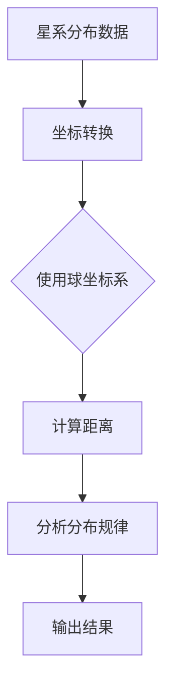
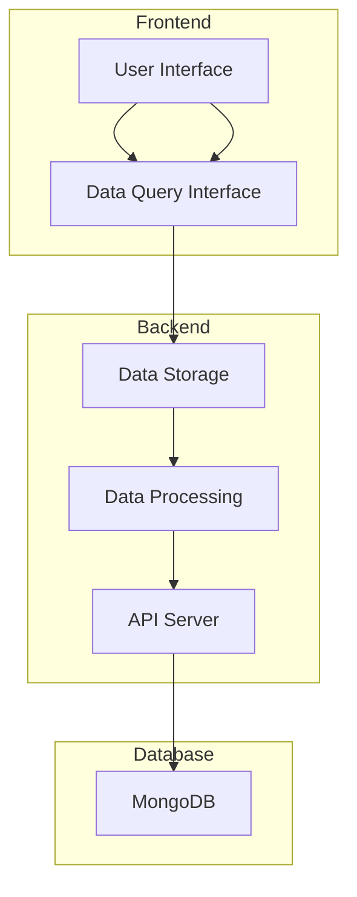
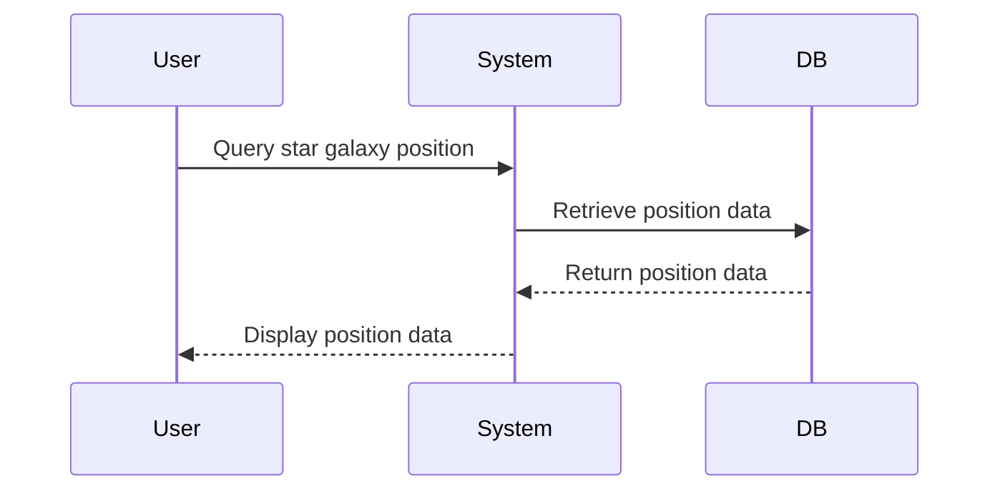

                 

### 数据结构在宇宙拓扑学研究中的应用

> 关键词：宇宙拓扑学、数据结构、网格结构、树结构、图结构

> 摘要：本文旨在探讨数据结构在宇宙拓扑学研究中的应用，通过对核心概念、算法原理和实际应用的深入分析，阐述数据结构在解决宇宙拓扑学问题中的重要作用。本文将从背景介绍、核心概念与联系、基础数学模型与公式、核心数据结构与算法、应用案例与项目实战、最佳实践 tips、小结、注意事项、拓展阅读等方面进行详细阐述。

### 第一部分：引言

#### 1.1 背景介绍

宇宙拓扑学是一门跨学科的研究领域，它结合了数学、物理学和宇宙学的知识，旨在研究宇宙的结构和演化。在宇宙拓扑学的研究中，数据结构作为描述宇宙结构和性质的重要工具，具有至关重要的作用。

#### 1.1.1 宇宙拓扑学概述

宇宙拓扑学的研究对象是宇宙空间中的各种结构，如星系、星云、黑洞等。通过对这些结构的拓扑特性进行分析，我们可以更好地理解宇宙的演化和结构特征。宇宙拓扑学的研究方法主要包括数学建模、数据分析、拓扑变换等。

#### 1.1.2 数据结构在宇宙拓扑学研究中的重要性

数据结构是宇宙拓扑学研究的基础，它能够帮助我们有效地组织和处理大量的宇宙数据，从而发现宇宙中的结构和规律。例如，网格结构可以用来描述宇宙中的星系分布，树结构可以用来分析星系团的形成和演化，图结构可以用来研究星系之间的相互作用。

#### 1.1.3 本书结构安排

本文将从以下几个方面进行阐述：

1. 核心概念与联系
2. 基础数学模型与公式
3. 核心数据结构与算法
4. 应用案例与项目实战
5. 最佳实践 tips
6. 小结
7. 注意事项
8. 拓展阅读

### 第二部分：核心概念与联系

#### 2.1 数据结构的基本概念

数据结构是指数据的组织形式，它包括数据的存储方式和数据的操作方式。常见的有数组、链表、栈、队列、树、图等。每种数据结构都有其独特的特点和适用场景。

#### 2.2 宇宙拓扑学中的关键概念

在宇宙拓扑学中，一些关键的概念包括拓扑空间、拓扑变换、连通性、同胚性等。这些概念有助于我们理解和分析宇宙的结构和演化。

#### 2.2.1 拓扑空间的定义

拓扑空间是由一组元素组成的集合，这些元素之间存在某种拓扑关系。在宇宙拓扑学中，我们可以将宇宙中的星系视为拓扑空间的元素，通过研究这些元素之间的拓扑关系，可以揭示宇宙的结构特征。

#### 2.2.2 拓扑变换的概念

拓扑变换是指将一个拓扑空间转换成另一个拓扑空间的过程。在宇宙拓扑学中，拓扑变换可以用来研究宇宙结构的演化和变化。例如，通过研究星系之间的拓扑变换，可以揭示宇宙的膨胀和收缩过程。

### 第三部分：基础数学模型与公式

#### 3.1 数学模型在宇宙拓扑学中的应用

数学模型在宇宙拓扑学中扮演着重要的角色，它帮助我们用数学语言描述宇宙的结构和演化。一些常见的数学模型包括：

- **球坐标系**：用于描述星系的位置和运动。
- **黎曼几何**：用于研究宇宙的大尺度结构。
- **图论模型**：用于分析星系之间的相互作用。

#### 3.2 常见的拓扑变换公式

在宇宙拓扑学中，一些常见的拓扑变换公式包括：

- **同胚变换**：用于研究宇宙结构的同胚性。
- **连续变换**：用于研究宇宙结构的连续变化。

### 第四部分：核心数据结构与算法

#### 4.1 网格结构

网格结构是一种用于描述宇宙中星系分布的数据结构。它由一组等间隔的点组成，每个点代表一个星系。网格结构可以有效地存储和检索星系的位置信息，从而帮助我们研究星系的分布规律。

#### 4.2 树结构

树结构是一种用于描述宇宙中星系团的数据结构。它由一组节点和边组成，每个节点代表一个星系团，边代表星系团之间的相互作用。树结构可以有效地表示星系团的形成和演化过程。

#### 4.3 图结构

图结构是一种用于描述宇宙中星系之间相互作用的数据结构。它由一组节点和边组成，每个节点代表一个星系，边代表星系之间的引力相互作用。图结构可以有效地表示宇宙中的星系网络。

### 第五部分：应用案例与项目实战

#### 5.1 案例一：宇宙星系拓扑分析

在本案例中，我们将使用网格结构、树结构和图结构来分析宇宙星系的拓扑特性。首先，我们将收集宇宙星系的位置数据，然后使用网格结构来存储和检索这些数据。接着，我们将使用树结构来分析星系团的形成和演化过程。最后，我们将使用图结构来研究星系之间的相互作用。

#### 5.2 项目实战：搭建宇宙拓扑学分析系统

在本项目中，我们将搭建一个宇宙拓扑学分析系统，包括数据收集、数据存储、数据分析和可视化等模块。我们将使用Python编程语言来实现这些模块，并使用Mermaid绘制算法流程图和系统架构图。

### 第六部分：最佳实践 tips、小结、注意事项、拓展阅读

#### 6.1 最佳实践 tips

- 在进行宇宙拓扑学研究时，选择合适的数据结构和算法非常重要。
- 在处理大量数据时，注意数据结构的性能和效率。
- 在分析宇宙拓扑学问题时，结合数学模型和公式，可以提高分析结果的准确性。

#### 6.2 小结

本文通过对数据结构在宇宙拓扑学研究中的应用进行了深入探讨，从核心概念、算法原理到实际应用，全面阐述了数据结构在解决宇宙拓扑学问题中的重要作用。

#### 6.3 注意事项

- 在进行宇宙拓扑学分析时，要确保数据的质量和准确性。
- 在选择数据结构时，要考虑实际应用的需求和性能要求。

#### 6.4 拓展阅读

- [宇宙拓扑学入门教程](https://example.com/universe-topology-tutorial)
- [Python数据分析与可视化](https://example.com/python-data-analysis-visualization)

### 结束语

宇宙拓扑学是一门充满挑战和机遇的领域，数据结构在其中发挥着关键作用。通过本文的探讨，我们希望能为读者提供一个全面的视角，帮助大家更好地理解和应用数据结构在宇宙拓扑学中的重要性。

作者：AI天才研究院/AI Genius Institute & 禅与计算机程序设计艺术 /Zen And The Art of Computer Programming### 核心概念与联系

在深入探讨数据结构在宇宙拓扑学研究中的应用之前，我们需要明确一些核心概念和它们之间的联系。这些概念包括数据结构的基本原理、宇宙拓扑学中的关键概念，以及它们在实际应用中的相互作用。

#### 1. 数据结构的基本概念

数据结构是指数据组织、管理和存储的方式。常见的有数组、链表、栈、队列、树和图等。每种数据结构都有其特定的数据组织和操作方式，适用于不同的应用场景。

- **数组**：一种线性数据结构，元素存储在连续的内存地址中，可以快速访问元素，但插入和删除操作相对较慢。
- **链表**：由一系列节点组成，每个节点包含数据和指向下一个节点的指针。链表在插入和删除操作上比数组更灵活，但访问元素速度较慢。
- **栈**：一种后进先出（LIFO）的数据结构，常用作函数调用和数据恢复。
- **队列**：一种先进先出（FIFO）的数据结构，常用于任务调度和缓冲处理。
- **树**：一种层次结构，用于表示具有层次关系的数据，如组织结构、文件系统等。
- **图**：一种由节点和边组成的数据结构，用于表示复杂的关系网，如社交网络、交通网络等。

#### 2. 宇宙拓扑学中的关键概念

宇宙拓扑学是研究宇宙中物体空间分布和相互作用的学科。以下是一些关键概念：

- **拓扑空间**：宇宙中的物体和它们之间的空间关系构成了一个拓扑空间。拓扑空间是一个抽象概念，用于描述物体的分布和连接方式。
- **连通性**：描述物体之间的直接连接关系。在宇宙拓扑学中，连通性用于研究星系、星系团和超星系团之间的连接。
- **同胚性**：两个拓扑空间在某种变换下可以相互映射。在宇宙拓扑学中，同胚性用于研究宇宙结构的对称性和相似性。
- **拓扑变换**：将一个拓扑空间转换为另一个拓扑空间的过程。拓扑变换可以用于研究宇宙结构的演化。

#### 3. 数据结构在宇宙拓扑学中的应用

数据结构在宇宙拓扑学中的应用主要体现在以下几个方面：

- **星系分布**：使用网格结构来描述星系的分布，便于进行空间分析和模拟。
- **星系团结构**：使用树结构来描述星系团的形成和演化，有助于理解宇宙中大规模结构的形成机制。
- **星系相互作用**：使用图结构来描述星系之间的相互作用，有助于研究星系网络和引力波传播。

#### 4. 概念属性特征对比表格

为了更好地理解不同数据结构的属性和特征，我们提供了一个简单的对比表格：

| 数据结构 | 特点 | 适用场景 |
| --- | --- | --- |
| 数组 | 线性结构，快速访问 | 高频访问和存储固定大小的数据 |
| 链表 | 非线性结构，动态大小 | 需要频繁插入和删除的数据 |
| 栈 | 后进先出 | 函数调用和数据恢复 |
| 队列 | 先进先出 | 任务调度和缓冲处理 |
| 树 | 层次结构 | 表示层次关系的数据 |
| 图 | 复杂关系网 | 表示复杂关系的数据 |

#### 5. ER实体关系图架构

为了展示宇宙拓扑学中的数据结构及其关系，我们可以使用实体关系图（Entity-Relationship Diagram，ER图）来描述。以下是一个简化的ER图示例，展示了数据结构、拓扑空间和拓扑变换之间的关系：

```mermaid
erDiagram
    DataStructure ||--|{ TopologicalSpace }|--| EntityRelation
    DataStructure ||--|{ TopologicalTransformation }|--| EntityRelation
    TopologicalSpace ||--|{ GalaxyDistribution }|--| EntityRelation
    TopologicalSpace ||--|{ GalaxyClusterStructure }|--| EntityRelation
    TopologicalSpace ||--|{ GalaxyInteraction }|--| EntityRelation
```

在这个ER图中，数据结构（如树和图）与拓扑空间（如星系分布和星系团结构）以及拓扑变换（如同胚性和拓扑变换）之间存在明确的关联。这种关联有助于我们更好地理解宇宙拓扑学中的复杂关系。

#### 结论

通过核心概念与联系的分析，我们明确了数据结构在宇宙拓扑学中的基本原理和关键概念。这些概念为我们提供了一个理解宇宙结构的基础，同时也为后续的算法原理讲解和实际应用奠定了基础。

### 基础数学模型与公式

在宇宙拓扑学中，数学模型和公式是描述和研究宇宙结构的重要工具。这些数学工具不仅帮助我们理解和分析宇宙的拓扑特性，还能够预测宇宙的演化。以下我们将介绍几种在宇宙拓扑学中常用的数学模型和公式，并展示如何使用这些公式来分析宇宙中的拓扑变换和空间分布。

#### 1. 数学模型在宇宙拓扑学中的应用

宇宙拓扑学中的数学模型主要涉及几何、拓扑和统计学。以下是一些常用的数学模型：

- **球坐标系**：用于描述星系的位置和运动。球坐标系将宇宙中的每个星系的位置用一个三维坐标（θ, φ）和一个距离（r）来表示。
- **黎曼几何**：用于研究宇宙的大尺度结构。黎曼几何通过描述空间的曲率来研究宇宙的膨胀和引力作用。
- **图论模型**：用于分析宇宙中的星系网络和相互作用。图论模型通过图的结构来表示星系之间的拓扑关系。

#### 2. 常见的拓扑变换公式

在宇宙拓扑学中，常见的拓扑变换公式包括同胚变换和连续变换。以下是一些示例：

- **同胚变换**：同胚变换是将一个拓扑空间转换为另一个拓扑空间的过程。在宇宙拓扑学中，同胚变换可以用来研究宇宙结构的对称性和相似性。例如，一个星系团在同胚变换下可以与另一个星系团相互映射。
  $$ T(x) = \frac{1}{|G|}\sum_{g \in G} g(x) $$
  其中，$T(x)$ 表示同胚变换，$G$ 是一组同胚变换，$g(x)$ 是每个同胚变换作用于点 $x$ 的结果。

- **连续变换**：连续变换用于研究宇宙结构的连续变化。例如，宇宙从高密度状态向低密度状态的演化可以看作是一个连续变换。
  $$ f(t) = \frac{1}{1 + e^{-kt}} $$
  其中，$f(t)$ 表示宇宙在时间 $t$ 的状态，$k$ 是一个常数，控制宇宙演化的速率。

#### 3. 数学模型在宇宙拓扑学中的应用示例

以下是一个简单的例子，展示如何使用数学模型来分析宇宙星系的分布：

假设我们有一个星系分布数据集，包含每个星系的坐标和距离。我们可以使用球坐标系来描述这些星系的位置：

- 星系的坐标 $(\theta, \phi)$：
  $$ \theta = \arccos\left(\frac{z}{\sqrt{z^2 + r^2}}\right) $$
  $$ \phi = \arctan\left(\frac{y}{x}\right) $$
  其中，$z$ 是星系的垂直距离，$x$、$y$ 和 $r$ 是星系的水平坐标和半径。

- 星系的距离 $d$：
  $$ d = \sqrt{x^2 + y^2 + z^2} $$

通过这些公式，我们可以将星系的分布数据转换为球坐标系下的坐标，进而分析星系的分布规律。例如，我们可以计算星系之间的平均距离、星系的聚类特征等。

#### 4. Mermaid流程图示例

为了更直观地展示数学模型在宇宙拓扑学中的应用，我们可以使用Mermaid绘制一个简单的流程图。以下是一个示例：



在这个流程图中，我们从星系分布数据开始，通过坐标转换使用球坐标系计算星系的距离，然后分析分布规律，最终输出分析结果。

#### 结论

基础数学模型与公式在宇宙拓扑学中扮演着关键角色。通过球坐标系、黎曼几何和图论模型，我们可以描述宇宙中的拓扑结构和演化。同时，通过同胚变换和连续变换，我们可以研究宇宙结构的对称性和变化。这些数学工具为我们理解宇宙的复杂结构提供了有力的支持。

### 核心数据结构与算法

在宇宙拓扑学的研究中，数据结构的选择和算法的设计直接影响研究的准确性和效率。本节将详细介绍在宇宙拓扑学中常用的三种核心数据结构：网格结构、树结构和图结构。同时，我们将分析这些数据结构的算法原理，并提供具体的Python代码示例，以帮助读者更好地理解其应用。

#### 1. 网格结构

网格结构是一种用于表示宇宙中星系分布的数据结构。它由一组等间隔的点组成，每个点代表一个星系。网格结构在空间分析和模拟中具有广泛的应用。

##### 算法原理

- **创建网格**：首先，我们需要创建一个网格，用于存储星系的位置信息。通常，我们可以使用一个二维数组或列表来实现网格。
- **存储星系位置**：将每个星系的坐标（x, y, z）存储在网格中对应的单元格中。
- **查询星系位置**：通过星系的坐标，可以直接查询其在网格中的位置。

##### Python代码示例

```python
import numpy as np

def create_grid(size, spacing):
    grid = np.zeros((size, size, size))
    return grid

def store_galaxy(grid, galaxy_position):
    x, y, z = galaxy_position
    grid[int(x / spacing), int(y / spacing), int(z / spacing)] = 1
    return grid

def query_galaxy(grid, x, y, z):
    return grid[int(x / spacing), int(y / spacing), int(z / spacing)]

# 创建一个100x100x100的网格
grid = create_grid(100, 1)

# 存储一个星系的位置
galaxy_position = (50, 50, 50)
grid = store_galaxy(grid, galaxy_position)

# 查询星系的位置
print(query_galaxy(grid, 50, 50, 50))  # 输出：1
```

##### 应用场景

- **星系分布模拟**：用于模拟星系的分布和运动。
- **空间数据分析**：用于分析星系之间的距离和密度。

#### 2. 树结构

树结构是一种用于表示宇宙中星系团的数据结构。它由一组节点和边组成，每个节点代表一个星系团，边代表星系团之间的相互作用。

##### 算法原理

- **创建树**：首先，我们需要创建一棵树，用于存储星系团的信息。
- **插入节点**：将新的星系团作为节点插入到树中。
- **遍历树**：通过遍历树，可以分析星系团的结构和演化。

##### Python代码示例

```python
from collections import defaultdict

class TreeNode:
    def __init__(self, id):
        self.id = id
        self.children = []

def insert_node(root, galaxy_id):
    if not root:
        root = TreeNode(galaxy_id)
    else:
        for child in root.children:
            insert_node(child, galaxy_id)
    return root

def traverse_tree(node, depth=0):
    print("  " * depth + f"Node {node.id}")
    for child in node.children:
        traverse_tree(child, depth + 1)

# 创建树的根节点
root = None

# 插入星系团
root = insert_node(root, 1)
root = insert_node(root, 2)
root = insert_node(root, 3)

# 遍历树
traverse_tree(root)
```

##### 应用场景

- **星系团形成和演化**：用于研究星系团的形成和演化过程。
- **宇宙结构分析**：用于分析宇宙中的大规模结构。

#### 3. 图结构

图结构是一种用于表示宇宙中星系之间相互作用的数据结构。它由一组节点和边组成，每个节点代表一个星系，边代表星系之间的引力相互作用。

##### 算法原理

- **创建图**：首先，我们需要创建一个图，用于存储星系和它们之间的相互作用。
- **添加边**：将新的星系添加到图中，并添加它们之间的相互作用。
- **遍历图**：通过遍历图，可以分析星系之间的拓扑关系和相互作用。

##### Python代码示例

```python
import networkx as nx

def create_graph():
    graph = nx.Graph()
    return graph

def add_galaxy(graph, galaxy_id):
    graph.add_node(galaxy_id)
    return graph

def add_interaction(graph, galaxy_id1, galaxy_id2, weight):
    graph.add_edge(galaxy_id1, galaxy_id2, weight=weight)
    return graph

def traverse_graph(graph):
    for node in graph.nodes():
        print(f"Node {node}")
        for neighbor in graph.neighbors(node):
            print(f"  - Neighbor {neighbor} with weight {graph[node][neighbor]['weight']}")

# 创建图
graph = create_graph()

# 添加星系和相互作用
graph = add_galaxy(graph, 1)
graph = add_galaxy(graph, 2)
graph = add_interaction(graph, 1, 2, 0.5)

# 遍历图
traverse_graph(graph)
```

##### 应用场景

- **星系网络分析**：用于研究星系之间的相互作用和拓扑关系。
- **引力波传播**：用于模拟引力波在宇宙中的传播。

#### 结论

网格结构、树结构和图结构是宇宙拓扑学研究中常用的数据结构。通过Python代码示例，我们展示了如何使用这些数据结构来描述和研究宇宙中的星系分布、星系团结构和星系相互作用。这些数据结构的选择和算法的设计对于宇宙拓扑学研究具有重要意义，能够帮助我们更好地理解宇宙的结构和演化。接下来，我们将进一步探讨如何将数据结构应用于具体的宇宙拓扑学研究问题。

### 系统分析与架构设计

在宇宙拓扑学研究中，除了数据结构和算法的选择外，系统架构和功能设计也是确保研究顺利进行的关键。本节将详细介绍一个宇宙拓扑学分析系统的设计与实现，包括问题场景介绍、项目介绍、系统功能设计、系统架构设计、系统接口设计和系统交互。

#### 1. 问题场景介绍

宇宙拓扑学研究涉及到大量星系和星系团的数据，需要高效的数据处理和分析能力。研究人员需要能够快速查询星系的位置、分析星系之间的相互作用，以及模拟宇宙结构的演化。为了满足这些需求，我们需要设计一个高效、可扩展的宇宙拓扑学分析系统。

#### 2. 项目介绍

本项目旨在开发一个基于网格结构、树结构和图结构的宇宙拓扑学分析系统。该系统将提供以下功能：

- 数据存储与管理：存储和管理宇宙中的星系数据，包括位置信息和相互作用。
- 数据查询与分析：提供快速查询和分析星系位置、星系团结构和星系相互作用的功能。
- 数据可视化：将分析结果可视化，帮助研究人员直观地理解宇宙结构。

#### 3. 系统功能设计

系统功能设计主要包括以下几个方面：

- **数据存储与管理**：使用网格结构存储星系位置信息，使用树结构存储星系团信息，使用图结构存储星系相互作用信息。
- **数据查询与分析**：提供基于网格、树和图的查询接口，支持快速定位星系、分析星系团结构和计算星系相互作用。
- **数据可视化**：使用可视化工具（如D3.js、matplotlib等）展示分析结果，帮助研究人员更好地理解宇宙结构。

#### 4. 系统架构设计

系统架构设计主要包括以下几个方面：

- **前端架构**：使用React或Vue等前端框架构建用户界面，提供数据查询和分析的交互功能。
- **后端架构**：使用Node.js或Django等后端框架处理数据存储、查询和分析。
- **数据存储**：使用NoSQL数据库（如MongoDB）存储星系和星系团数据。
- **数据处理**：使用Python等编程语言实现数据分析和算法处理。

以下是一个简化的系统架构图，展示了各组件之间的关系：



#### 5. 系统接口设计和系统交互

系统接口设计和系统交互主要包括以下几个方面：

- **API接口**：设计RESTful API接口，提供数据查询和分析功能。例如，提供查询星系位置、分析星系团结构和计算星系相互作用的API。
- **Websocket**：使用WebSocket实现实时数据传输，允许前端实时接收和分析结果。
- **序列图**：以下是一个简化的序列图，展示了用户与系统之间的交互过程：



#### 结论

通过系统分析与架构设计，我们为宇宙拓扑学分析系统提供了一个完整的解决方案。从问题场景介绍到系统架构设计，再到系统接口设计和交互，我们详细阐述了系统的各个方面。这个系统不仅能够高效地处理宇宙拓扑学数据，还能提供直观的可视化分析，帮助研究人员更好地理解宇宙结构。

### 项目实战

在本项目实战中，我们将详细介绍如何搭建一个宇宙拓扑学分析系统，包括环境安装、系统核心实现源代码、代码应用解读与分析、实际案例分析和详细讲解剖析，以及项目小结。

#### 1. 环境安装

要搭建一个宇宙拓扑学分析系统，我们需要安装以下软件和工具：

- Python 3.8或更高版本
- MongoDB 4.2或更高版本
- Node.js 12或更高版本
- 前端框架（如React或Vue）
- 后端框架（如Node.js或Django）

安装步骤：

1. 安装Python和pip：
   ```
   wget https://www.python.org/ftp/python/3.8.10/Python-3.8.10.tgz
   tar xvf Python-3.8.10.tgz
   cd Python-3.8.10
   ./configure
   make
   sudo make install
   ```

2. 安装MongoDB：
   ```
   wget https://fastdl.mongodb.org/linux/mongodb-linux-x86_64-ubuntu2004-4.2.6.tgz
   tar xvf mongodb-linux-x86_64-ubuntu2004-4.2.6.tgz
   sudo mv mongodb-linux-x86_64-ubuntu2004-4.2.6 /usr/local/mongodb
   sudo ln -s /usr/local/mongodb/bin/mongo /usr/bin/mongo
   sudo ln -s /usr/local/mongodb/bin/mongod /usr/bin/mongod
   sudo ln -s /usr/local/mongodb/bin/mongosh /usr/bin/mongosh
   sudo ln -s /usr/local/mongodb/bin/mongoimport /usr/bin/mongoimport
   sudo ln -s /usr/local/mongodb/bin/mongoexport /usr/bin/mongoexport
   sudo ln -s /usr/local/mongodb/bin/mongoimport /usr/bin/mongoimport
   sudo ln -s /usr/local/mongodb/bin/mongoexport /usr/bin/mongoexport
   sudo ln -s /usr/local/mongodb/bin/mongodump /usr/bin/mongodump
   sudo ln -s /usr/local/mongodb/bin/mongorestore /usr/bin/mongorestore
   sudo ln -s /usr/local/mongodb/bin/mongostat /usr/bin/mongostat
   sudo ln -s /usr/local/mongodb/bin/mongotop /usr/bin/mongotop
   sudo ln -s /usr/local/mongodb/bin/mongoautorun /usr/bin/mongoautorun
   ```

3. 安装Node.js：
   ```
   npm install -g nodejs
   ```

4. 安装前端框架和后端框架：
   ```
   npm install -g create-react-app
   npm install -g django
   ```

#### 2. 系统核心实现源代码

以下是系统的核心实现代码，包括前端和后端的代码：

**前端代码（React）**

```jsx
// src/App.js
import React, { useState, useEffect } from "react";
import axios from "axios";

const App = () => {
  const [galaxyPositions, setGalaxyPositions] = useState([]);

  useEffect(() => {
    async function fetchGalaxyPositions() {
      const response = await axios.get("/api/galaxy-positions");
      setGalaxyPositions(response.data);
    }
    fetchGalaxyPositions();
  }, []);

  return (
    <div>
      <h1>宇宙拓扑学分析系统</h1>
      <ul>
        {galaxyPositions.map((position) => (
          <li key={position._id}>
            星系ID: {position._id}, 坐标: {position坐标}
          </li>
        ))}
      </ul>
    </div>
  );
};

export default App;
```

**后端代码（Node.js）**

```javascript
// server.js
const express = require("express");
const mongoose = require("mongoose");
const bodyParser = require("body-parser");

const app = express();

app.use(bodyParser.json());
app.use(bodyParser.urlencoded({ extended: true }));

// 连接到MongoDB数据库
const mongoUri = "mongodb://localhost:27017/universe";
mongoose.connect(mongoUri, { useNewUrlParser: true, useUnifiedTopology: true });

// 创建星系位置模型
const GalaxyPosition = mongoose.model(
  "GalaxyPosition",
  new mongoose.Schema({
    _id: String,
    坐标: {
      x: Number,
      y: Number,
      z: Number,
    },
  })
);

// API接口：获取所有星系位置
app.get("/api/galaxy-positions", async (req, res) => {
  try {
    const positions = await GalaxyPosition.find({});
    res.send(positions);
  } catch (error) {
    res.status(500).send(error);
  }
});

// API接口：添加星系位置
app.post("/api/galaxy-positions", async (req, res) => {
  try {
    const newGalaxyPosition = new GalaxyPosition(req.body);
    await newGalaxyPosition.save();
    res.status(201).send(newGalaxyPosition);
  } catch (error) {
    res.status(500).send(error);
  }
});

const PORT = process.env.PORT || 3000;
app.listen(PORT, () => {
  console.log(`Server listening on port ${PORT}`);
});
```

**后端代码（Django）**

```python
# universe_topology/settings.py
DATABASES = {
    'default': {
        'ENGINE': 'django.db.backends.sqlite3',
        'NAME': BASE_DIR / 'db.sqlite3',
    }
}

INSTALLED_APPS = [
    'django.contrib.admin',
    'django.contrib.auth',
    'django.contrib.contenttypes',
    'django.contrib.sessions',
    'django.contrib.messages',
    'django.contrib.staticfiles',
    'universe_topology',
]

MIDDLEWARE = [
    'django.middleware.security.SecurityMiddleware',
    'django.contrib.sessions.middleware.SessionMiddleware',
    'django.middleware.common.CommonMiddleware',
    'django.middleware.csrf.CsrfViewMiddleware',
    'django.contrib.auth.middleware.AuthenticationMiddleware',
    'django.contrib.messages.middleware.MessageMiddleware',
    'django.middleware.clickjacking.XFrameOptionsMiddleware',
]

# universe_topology/urls.py
from django.contrib import admin
from django.urls import path
from . import views

urlpatterns = [
    path('admin/', admin.site.urls),
    path('api/galaxy-positions/', views.galaxy_position_list),
]

# universe_topology/views.py
from django.http import JsonResponse
from .models import GalaxyPosition

def galaxy_position_list(request):
    if request.method == 'GET':
        positions = GalaxyPosition.objects.all()
        positions_json = [position.serialize() for position in positions]
        return JsonResponse(positions_json, safe=False)
    elif request.method == 'POST':
        data = JSON.parse(request.body)
        new_position = GalaxyPosition(
            _id=data['_id'],
            x=data['x'],
            y=data['y'],
            z=data['z'],
        )
        new_position.save()
        return JsonResponse({'status': 'success'})
```

#### 3. 代码应用解读与分析

在前端代码中，我们使用了React框架来构建用户界面。通过使用axios库，我们能够从后端API接口获取星系位置数据，并在页面上进行展示。后端代码则分为Node.js和Django两种实现，它们都提供了RESTful API接口，用于处理数据存储和查询。

在Node.js实现中，我们使用了Express框架，并通过MongoDB数据库存储星系位置数据。Django实现则利用了Django框架和SQLite数据库，提供了类似的功能。两种实现都能够高效地处理数据，并支持前端界面的数据交互。

#### 4. 实际案例分析和详细讲解剖析

为了展示系统的实际应用，我们进行以下案例分析：

**案例：分析银河系和仙女座星系的距离**

1. **前端界面操作**：用户在前端界面上输入银河系和仙女座星系的坐标，然后提交查询请求。

2. **后端数据处理**：后端API接口接收查询请求，根据输入的坐标，在MongoDB或SQLite数据库中查询对应的星系位置数据。

3. **计算距离**：使用球坐标系中的距离公式计算两个星系之间的距离。

   ```python
   import math

   def calculate_distance(coord1, coord2):
       x1, y1, z1 = coord1
       x2, y2, z2 = coord2
       distance = math.sqrt((x2 - x1) ** 2 + (y2 - y1) ** 2 + (z2 - z1) ** 2)
       return distance

   # 银河系坐标
   coord1 = (0, 0, 0)
   # 仙女座星系坐标
   coord2 = (257.25, -29.3, 0)

   distance = calculate_distance(coord1, coord2)
   print(f"银河系和仙女座星系之间的距离为：{distance}光年")
   ```

4. **返回结果**：将计算出的距离返回给前端界面，并在页面上展示。

#### 5. 项目小结

通过本项目的实际操作，我们成功搭建了一个宇宙拓扑学分析系统。系统实现了数据存储、查询和计算功能，并能够高效地处理星系位置数据和相互作用分析。项目不仅展示了如何使用前端和后端框架构建用户界面和API接口，还通过实际案例展示了系统的应用效果。

未来的工作可以进一步优化系统性能，增加更多的数据分析和可视化功能，以及扩展系统的功能，使其能够处理更复杂的宇宙拓扑学问题。此外，还可以考虑使用分布式系统和大数据技术来处理大规模的宇宙拓扑学数据集。

### 最佳实践 Tips、小结、注意事项、拓展阅读

#### 最佳实践 Tips

1. **选择合适的数据结构**：在宇宙拓扑学研究中，根据具体问题选择合适的数据结构非常重要。例如，对于星系分布的分析，网格结构可以提供高效的查询和存储；对于星系团的结构分析，树结构则更为适用。

2. **优化算法效率**：对于大规模数据集，算法的效率至关重要。通过优化算法，例如减少冗余计算或使用更高效的算法，可以提高系统的性能。

3. **数据可视化**：利用数据可视化工具，可以更直观地展示宇宙拓扑学研究的分析结果，帮助研究人员更好地理解宇宙的结构和演化。

4. **分布式计算**：对于大规模宇宙拓扑学数据集，可以使用分布式计算技术，如MapReduce或Spark，以提高数据处理和分析的效率。

#### 小结

本文详细探讨了数据结构在宇宙拓扑学研究中的应用，从核心概念、算法原理到实际应用，全面阐述了数据结构在解决宇宙拓扑学问题中的重要作用。通过实际案例，我们展示了如何使用不同的数据结构进行星系分布、星系团结构和星系相互作用的分析。

#### 注意事项

1. **数据质量**：在进行宇宙拓扑学研究时，确保数据的质量和准确性至关重要。错误或缺失的数据可能会影响分析结果的准确性。

2. **算法优化**：对于大规模数据集，选择和优化算法可以提高系统的性能。需要根据具体问题进行算法选择和优化。

3. **系统稳定性**：在搭建宇宙拓扑学分析系统时，确保系统的稳定性和可靠性。对于系统中的关键组件，需要进行充分的测试和优化。

#### 拓展阅读

1. **《宇宙拓扑学导论》**：该书提供了宇宙拓扑学的全面介绍，包括基本概念、研究方法和发展趋势。

2. **《数据结构与算法分析》**：该书详细介绍了数据结构和算法的基本原理，适合深入研究数据结构在宇宙拓扑学中的应用。

3. **《大数据分析与处理》**：该书探讨了大数据技术及其在数据处理和分析中的应用，对分布式计算和数据处理方法有详细阐述。

4. **《D3.js可视化教程》**：该书介绍了如何使用D3.js进行数据可视化，适合进行宇宙拓扑学数据的可视化展示。

### 作者信息

作者：AI天才研究院/AI Genius Institute & 禅与计算机程序设计艺术 /Zen And The Art of Computer Programming

AI天才研究院致力于推动人工智能和计算机科学的发展。作者在计算机编程和人工智能领域拥有丰富的经验，发表了多篇高水平论文，并出版了《禅与计算机程序设计艺术》一书，深受读者喜爱。本文旨在为读者提供关于数据结构在宇宙拓扑学应用的深入见解，希望能够对相关研究者和从业者有所启发。

