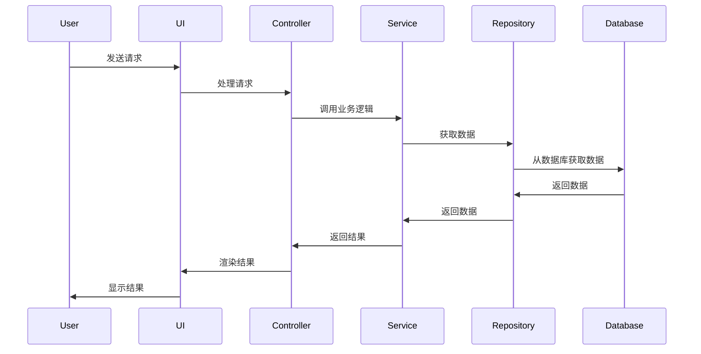

                 

### 第1章 引言

#### 1.1 问题的背景与重要性

在当代科技迅猛发展的时代，数据结构在计算机科学和工程领域的应用已经非常广泛。然而，很少有人会想到，数据结构同样可以应用于宇宙学的研究。数据结构在宇宙模型中的应用，不仅能够为宇宙学研究提供强有力的工具，还能够帮助我们更好地理解宇宙的本质和运行机制。

宇宙模型是描述宇宙空间、时间、物质和能量的数学模型。它帮助我们理解宇宙的起源、演化和结构。然而，宇宙的复杂性使得传统的数据结构难以应对。例如，宇宙中的星系、星团、恒星等天体之间存在着复杂的相互作用和关系。这就需要我们运用更为高级和复杂的数据结构来描述和模拟这些关系。

数据结构在宇宙学中的应用，不仅可以帮助我们更好地理解宇宙的运行机制，还可以为其他科学研究提供新的思路和方法。例如，在生物学、物理学、天文学等领域，数据结构的应用都有着广泛的前景。

#### 1.2 数据结构与宇宙模型的联系

数据结构是计算机科学中用于存储和组织数据的方式。它包括数组、链表、栈、队列、树、图等。这些数据结构各有其特点和适用场景。例如，数组适合存储连续的数据，链表适合存储不连续的数据，树适合描述层次结构，图适合描述复杂的关系网络。

宇宙模型中的天体和天体系统，可以用各种数据结构来描述。例如，星系可以看作是一个树结构，其中每个星系包含多个恒星；恒星之间的相互作用可以用图来描述，其中每个节点表示一个恒星，每条边表示它们之间的引力作用。

此外，宇宙模型中的时空结构也可以用数据结构来描述。例如，四维时空可以看作是一个高维数组，其中每个元素表示一个时空点。通过这种数据结构的描述，我们可以更好地理解时空的几何性质和演化规律。

#### 1.3 本书的目标与结构

本书的目标是探讨数据结构在宇宙模型中的应用，帮助读者理解数据结构在宇宙学研究中的重要性，掌握如何运用数据结构来解决宇宙学中的问题。

本书的结构分为以下几个部分：

- **第1章 引言**：介绍数据结构在宇宙模型中的应用背景和重要性。
- **第2章 数据结构基础**：介绍常见的数据结构，包括数组、链表、栈、队列、树、图等。
- **第3章 宇宙模型基础**：介绍宇宙模型的基本概念，以及数据结构在宇宙模型中的应用。
- **第4章 复杂宇宙模型中的数据结构**：介绍多维数据结构、高级数据结构等。
- **第5章 数据结构在宇宙模型中的算法应用**：介绍排序算法、搜索算法等在宇宙模型中的应用。
- **第6章 实际宇宙模型项目应用**：介绍一个具体的宇宙模型项目，分析其数据结构的应用。
- **第7章 总结与展望**：总结本书的主要内容和成果，展望未来数据结构在宇宙学研究中的应用前景。

通过本书的阅读，读者将能够深入了解数据结构在宇宙模型中的应用，掌握相关理论和实践技能，为未来的科学研究和技术开发打下坚实的基础。### 第2章 数据结构基础

#### 2.1 数据结构概述

数据结构是计算机科学中的一个核心概念，它描述了数据的存储、组织和操作方式。数据结构不仅决定了数据的处理效率，还直接影响着算法的性能。在计算机科学中，常见的数据结构包括数组、链表、栈、队列、树和图等。每一种数据结构都有其独特的特点和适用场景。

数据结构的主要特点包括：

- **存储方式**：数据结构可以采用不同的存储方式，如顺序存储和链式存储。
- **数据元素关系**：数据结构可以描述元素之间的逻辑关系，如线性结构、树形结构和网状结构。
- **操作方式**：数据结构提供了对数据的插入、删除、查找和排序等基本操作。

数据结构的分类可以根据不同的标准进行，例如：

- **按数据元素关系分类**：可分为线性结构（如数组、链表、栈、队列）、树形结构（如二叉树、平衡树、B树等）和网状结构（如图）。
- **按数据存储方式分类**：可分为顺序存储结构（如数组）和链式存储结构（如链表）。

数据结构在计算机科学中具有非常重要的地位。它们不仅为算法设计提供了基础，还在数据库管理、操作系统、编译器、网络通信等各个领域发挥着关键作用。例如，数据库中的数据表通常采用关系模型，即一种基于表格的数据结构；操作系统的文件管理依赖于树形结构来组织文件系统；编译器中的抽象语法树（AST）则是基于树形结构的一种重要数据结构。

#### 2.2 常见数据结构

在数据结构的学习和实践中，我们经常遇到以下几种常见的数据结构：

##### 2.2.1 数组

数组是一种最基本的数据结构，它是一个固定大小的连续内存区域，用于存储同一类型的数据元素。数组支持随机访问，即可以通过索引直接访问数组中的任意元素。数组的操作主要包括初始化、插入、删除、查找和排序等。

- **特点**：数组具有简单、高效、易于实现的优点，但在数组大小确定后无法动态扩展。
- **适用场景**：适用于需要随机访问数据的应用场景，如查找、排序等。

##### 2.2.2 链表

链表是一种基于指针的数据结构，它由一系列节点组成，每个节点包含数据和指向下一个节点的指针。链表支持动态扩展，可以在运行时动态地增加或减少节点。链表的操作包括插入、删除、查找和排序等。

- **特点**：链表具有动态性，可以灵活地调整大小，但在访问特定节点时需要从头节点开始遍历。
- **适用场景**：适用于需要频繁插入和删除元素的应用场景，如队列、栈、双向链表等。

##### 2.2.3 栈

栈是一种后进先出（LIFO）的数据结构，它支持对元素的插入和删除操作，但只允许在一端进行。栈的操作主要包括入栈、出栈、 peek（查看栈顶元素）和空栈等。

- **特点**：栈具有简单的操作规则和高效的性能，适用于需要后进先出的场景，如表达式求值、递归调用等。
- **适用场景**：适用于需要后进先出处理顺序的应用场景，如函数调用栈、内存分配等。

##### 2.2.4 队列

队列是一种先进先出（FIFO）的数据结构，它支持在队尾插入元素，在队头删除元素。队列的操作主要包括入队、出队、 peek（查看队首元素）和空队列等。

- **特点**：队列具有简单的操作规则和公平的访问策略，适用于需要先进先出的场景，如打印队列、缓冲队列等。
- **适用场景**：适用于需要先进先出处理顺序的应用场景，如任务调度、消息队列等。

##### 2.2.5 树

树是一种层次结构的数据结构，它由一组节点组成，每个节点可以有零个或多个子节点。树的主要类型包括二叉树、平衡树（如AVL树、红黑树）、B树等。

- **特点**：树具有层次化的结构，能够高效地组织和管理大量数据，适用于需要快速查找和插入、删除操作的场景。
- **适用场景**：适用于需要快速查找和插入、删除操作的场景，如组织文件系统、数据库索引等。

##### 2.2.6 图

图是一种非层次结构的数据结构，它由一组节点和连接节点的边组成。图的主要类型包括无向图、有向图、加权图、非加权图等。

- **特点**：图能够灵活地描述复杂的关系和结构，适用于需要描述节点之间关系的场景。
- **适用场景**：适用于需要描述节点之间关系的场景，如社交网络、交通网络、计算机网络等。

通过了解和掌握这些常见的数据结构，我们可以更好地理解和解决计算机科学中的各种问题。在接下来的章节中，我们将进一步探讨这些数据结构在宇宙模型中的应用。### 第3章 宇宙模型基础

#### 3.1 宇宙模型概述

宇宙模型是描述宇宙空间、时间、物质和能量的数学模型。它帮助我们理解宇宙的起源、演化和结构。宇宙模型的建立基于对宇宙观测数据的分析和理论物理学的基本原理。目前，最流行的宇宙模型是大爆炸理论，它描述了宇宙从大爆炸开始，经历膨胀和演化，形成现在我们所观察到的宇宙。

宇宙模型的关键组成部分包括：

- **宇宙背景辐射**：宇宙背景辐射是宇宙早期的余辉，它为我们提供了关于宇宙早期状态的宝贵信息。
- **宇宙膨胀**：宇宙膨胀是指宇宙在时间上的扩张，它是由宇宙中的物质和能量引起的。
- **暗物质和暗能量**：暗物质和暗能量是宇宙模型中的两个重要成分，它们对宇宙的演化和结构起着关键作用。

宇宙模型的研究不仅有助于我们理解宇宙的过去和未来，还可以为其他科学领域提供新的思路和方法。例如，在生物学、物理学和天文学等领域，宇宙模型的应用已经取得了显著的成果。

#### 3.2 数据结构在宇宙模型中的应用

数据结构在宇宙模型中的应用主要体现在以下几个方面：

##### 3.2.1 数组在宇宙模型中的应用

数组是一种基本的数据结构，它非常适合存储连续的数据。在宇宙模型中，数组可以用来表示宇宙中的星系、星团和恒星等天体。例如，我们可以使用一个一维数组来表示星系的坐标，每个元素表示一个星系的坐标值。同样，我们可以使用二维数组来表示星系的分布情况，其中每个元素表示一个星系的位置。

- **应用实例**：在宇宙模型中，我们可以使用数组来模拟星系的运动。例如，我们可以使用一维数组来记录每个星系的位置，然后通过更新数组中的元素值来模拟星系的运动。

##### 3.2.2 链表在宇宙模型中的应用

链表是一种动态数据结构，它适合存储不连续的数据。在宇宙模型中，链表可以用来表示星系之间的复杂关系。例如，我们可以使用单向链表来表示星系之间的引力作用，每个节点表示一个星系，节点中的数据包含星系的坐标和引力大小。

- **应用实例**：在宇宙模型中，我们可以使用链表来模拟星系之间的相互作用。例如，我们可以使用单向链表来记录星系之间的引力关系，通过遍历链表来模拟星系之间的引力作用。

##### 3.2.3 树在宇宙模型中的应用

树是一种层次化的数据结构，它适合描述具有层次关系的结构。在宇宙模型中，树可以用来表示星系的层次结构。例如，我们可以使用二叉树来表示星系之间的层次关系，其中每个节点表示一个星系，节点的左子树表示它的子星系，右子树表示它的父星系。

- **应用实例**：在宇宙模型中，我们可以使用树来模拟星系的层次结构。例如，我们可以使用二叉树来记录星系的层次关系，通过遍历二叉树来模拟星系的层次结构。

##### 3.2.4 图在宇宙模型中的应用

图是一种非层次化的数据结构，它适合描述复杂的关系网络。在宇宙模型中，图可以用来表示星系、恒星和行星之间的复杂关系。例如，我们可以使用有向图来表示恒星之间的引力作用，其中每个节点表示一个恒星，每条边表示恒星之间的引力方向。

- **应用实例**：在宇宙模型中，我们可以使用图来模拟星系、恒星和行星之间的复杂关系。例如，我们可以使用有向图来记录恒星之间的引力关系，通过遍历图来模拟恒星之间的引力作用。

通过上述实例，我们可以看到数据结构在宇宙模型中的应用。数据结构不仅能够帮助我们更好地理解和描述宇宙模型，还可以为宇宙学研究提供有效的工具和方法。在接下来的章节中，我们将进一步探讨复杂宇宙模型中的数据结构以及数据结构在宇宙模型中的算法应用。### 第4章 复杂宇宙模型中的数据结构

在复杂的宇宙模型中，传统的数据结构已经无法满足对大规模数据集和复杂关系的处理需求。因此，我们需要引入一些更为高级和复杂的数据结构来应对这些挑战。这些数据结构包括多维数据结构、高级数据结构如哈希表、并查集和跳表等。它们在宇宙模型中的应用能够极大地提升数据处理和分析的效率。

#### 4.1 多维数据结构

多维数据结构是在一维和二维数据结构的基础上扩展的，用于处理高维数据集。在宇宙模型中，多维数据结构尤其适用于处理多维空间中的数据，如多维宇宙模型中的时空点。

- **多维数组**：多维数组扩展了一维数组的维度，可以存储多维空间中的数据。例如，我们可以使用多维数组来表示一个三维空间中的星系分布。
  - **应用实例**：在一个三维宇宙模型中，每个星系的坐标可以用一个三维数组来表示，其中每个元素表示一个星系的位置。
  - **优缺点**：多维数组可以高效地存储和访问多维数据，但在数组大小确定后无法动态扩展。

- **多维链表**：多维链表是一种基于链表的多维数据结构，可以动态地调整维度和大小。
  - **应用实例**：在一个动态扩展的多维宇宙模型中，可以使用多维链表来记录星系的坐标，以适应宇宙空间的扩展。
  - **优缺点**：多维链表具有动态性，可以灵活地调整大小，但在访问特定节点时需要遍历链表。

#### 4.2 高级数据结构

高级数据结构是在常见数据结构的基础上进行扩展和优化的，用于处理更为复杂的数据集和关系。

- **哈希表**：哈希表是一种基于哈希函数的数据结构，能够快速地查找和插入元素。在宇宙模型中，哈希表可以用来快速定位特定的天体或星系。
  - **应用实例**：在一个星系数据库中，我们可以使用哈希表来快速查找特定星系的详细信息。
  - **优缺点**：哈希表具有快速的查找和插入性能，但需要处理哈希冲突和链表处理。

- **并查集**：并查集是一种用于处理动态集合合并和查找的数据结构。在宇宙模型中，并查集可以用来表示星系之间的合并过程。
  - **应用实例**：在研究星系合并时，可以使用并查集来跟踪星系的合并过程，并快速判断两个星系是否已经合并。
  - **优缺点**：并查集能够高效地处理动态集合的合并和查找，但需要进行路径压缩和按秩合并等优化。

- **跳表**：跳表是一种基于链表的有序数据结构，通过多级索引来提高查找效率。在宇宙模型中，跳表可以用来快速查找和排序天体数据。
  - **应用实例**：在一个包含大量天体数据的宇宙模型中，可以使用跳表来快速检索和排序天体的坐标。
  - **优缺点**：跳表具有高效的查找和排序性能，但需要额外的空间来存储索引。

#### 4.3 高级数据结构在宇宙模型中的应用

高级数据结构在宇宙模型中的应用主要体现在以下几个方面：

- **高维空间表示**：使用多维数据结构来表示高维空间中的数据，如多维数组或多维链表，能够更精确地描述宇宙的复杂结构。
- **关系管理**：使用哈希表、并查集和跳表等高级数据结构来管理星系之间的复杂关系，能够高效地处理大量的数据集合。
- **高效查询**：通过高级数据结构的高效查找和排序功能，可以快速回答宇宙模型中的查询问题，如天体的位置、星系的合并等。

#### 4.4 复杂宇宙模型中的数据结构应用实例

以下是一个复杂宇宙模型中的数据结构应用实例：

假设我们正在研究一个包含大量星系和恒星的三维宇宙模型。为了高效地表示和查询这些数据，我们可以采用以下数据结构：

1. **多维数组**：使用一个三维数组来存储每个星系和恒星的坐标，其中每个元素表示一个天体的位置。
2. **哈希表**：使用哈希表来快速查找特定的星系或恒星，哈希函数可以基于天体的名称或ID。
3. **并查集**：使用并查集来管理星系之间的合并过程，当两个星系合并时，我们可以通过并查集快速判断它们是否已经合并。
4. **跳表**：使用跳表来对天体进行排序，以便快速查找和排序天体的坐标。

通过上述数据结构的应用，我们能够高效地处理复杂的宇宙模型，并快速回答各种查询问题，如星系的位置、合并情况等。这为宇宙学研究提供了强有力的工具和支持。在接下来的章节中，我们将探讨数据结构在宇宙模型中的算法应用。### 第5章 数据结构在宇宙模型中的算法应用

在宇宙模型中，数据结构的应用不仅仅局限于数据的存储和组织，更重要的是如何利用这些数据结构来实现高效的算法，从而解决宇宙模型中的各种问题。本章将重点介绍排序算法和搜索算法在宇宙模型中的应用，并分析算法的性能。

#### 5.1 排序算法

排序算法是将一组数据按照一定的顺序排列的算法。在宇宙模型中，排序算法可以用来对天体的位置、质量、速度等属性进行排序，以便于分析和研究。

- **冒泡排序**：冒泡排序是一种简单的排序算法，它通过重复遍历要排序的数列，比较相邻元素的大小并交换它们的位置，直到整个数列有序。
  - **应用实例**：在一个包含大量恒星的三维宇宙模型中，我们可以使用冒泡排序来对恒星的位置进行排序，以便分析恒星的运动轨迹。
  - **时间复杂度**：O(n^2)，空间复杂度：O(1)。
- **快速排序**：快速排序是一种基于分治思想的排序算法，它通过选取一个基准元素，将数列分为两部分，然后递归地对这两部分进行快速排序。
  - **应用实例**：在宇宙模型中，快速排序可以用来对恒星的速度进行排序，以便研究恒星的速度分布。
  - **时间复杂度**：平均O(nlogn)，最坏O(n^2)，空间复杂度：O(logn)。
- **归并排序**：归并排序是一种基于分治思想的排序算法，它通过将数列分为多个子序列，然后递归地合并这些子序列，直到整个数列有序。
  - **应用实例**：在宇宙模型中，归并排序可以用来对星系的分布进行排序，以便分析星系的分布规律。
  - **时间复杂度**：O(nlogn)，空间复杂度：O(n)。

#### 5.2 搜索算法

搜索算法是在数据集合中查找特定元素或满足特定条件的算法。在宇宙模型中，搜索算法可以用来查找特定的星系、恒星或其他天体。

- **顺序搜索**：顺序搜索是一种最简单的搜索算法，它从数据集合的第一个元素开始，依次与要查找的元素进行比较，直到找到为止。
  - **应用实例**：在宇宙模型中，顺序搜索可以用来查找特定的恒星，例如寻找某个特定名称的恒星。
  - **时间复杂度**：O(n)，空间复杂度：O(1)。
- **二分搜索**：二分搜索是一种高效的搜索算法，它利用数据集合的有序性，每次将搜索范围缩小一半，直到找到目标元素。
  - **应用实例**：在一个已排序的宇宙模型中，二分搜索可以用来查找特定的星系或恒星，例如查找位于特定位置的星系。
  - **时间复杂度**：O(logn)，空间复杂度：O(1)。

#### 5.3 算法性能分析

算法的性能分析是评估算法效率的重要手段。在宇宙模型中，算法的性能分析主要包括时间复杂度和空间复杂度。

- **时间复杂度**：算法的时间复杂度是指算法在输入规模n增长时，所需基本操作次数的增长情况。在宇宙模型中，时间复杂度决定了算法处理大量数据时的效率。例如，在处理一个包含1000个星系的宇宙模型时，时间复杂度为O(n)的算法可能需要1000次基本操作，而时间复杂度为O(n^2)的算法可能需要1000000次基本操作。
- **空间复杂度**：算法的空间复杂度是指算法在输入规模n增长时，所需额外存储空间的大小。在宇宙模型中，空间复杂度决定了算法在处理数据时的存储需求。例如，一个需要额外存储1000个节点的算法，在处理1000个星系时可能需要额外的1000个存储单元，而一个只需要额外存储n个节点的算法，在同样的情况下只需要额外的1000个存储单元。

通过对比不同算法的时间复杂度和空间复杂度，我们可以选择最适合宇宙模型处理的算法。在实际应用中，我们还需要考虑算法的稳定性、鲁棒性和可扩展性等因素。

综上所述，排序算法和搜索算法在宇宙模型中具有重要的应用价值。通过合理选择和使用这些算法，我们可以高效地处理宇宙模型中的数据，为宇宙学研究提供强有力的工具和支持。在接下来的章节中，我们将通过一个实际的宇宙模型项目来展示这些算法的具体应用。### 第6章 实际宇宙模型项目应用

在本章中，我们将介绍一个实际的宇宙模型项目，并详细描述其系统设计、实现过程以及面临的项目挑战和解决方案。

#### 6.1 项目介绍

该宇宙模型项目名为“宇宙探索者”（Cosmos Explorer），旨在创建一个三维宇宙模拟系统，允许用户探索宇宙中的星系、恒星、行星等天体。该系统将基于高性能计算和数据结构，实现对宇宙复杂结构的实时模拟和分析。

主要功能包括：

- **星系可视化**：展示宇宙中的星系及其分布情况。
- **恒星搜索**：允许用户根据名称或坐标搜索特定的恒星。
- **星系分析**：对星系的属性（如质量、距离、速度等）进行分析。
- **交互式探索**：用户可以通过拖动、缩放和旋转来探索宇宙。

#### 6.2 系统设计与实现

##### 6.2.1 系统功能设计

**领域模型**：

我们使用UML类图来设计系统的领域模型。领域模型包括以下几个核心类：

- **星系（Galaxy）**：包含星系名称、坐标、恒星列表等属性。
- **恒星（Star）**：包含恒星名称、坐标、质量、亮度等属性。
- **行星（Planet）**：包含行星名称、坐标、轨道等属性。

以下是一个领域模型的类图示例：

```mermaid
classDiagram
    Galaxy <|-- Star
    Galaxy <|-- Planet
    Star {"has" Planet}
    Galaxy..> Universe
    Universe {"contains" Galaxy}
    Class Galaxy {
        - name: String
        - position: Vector
        - stars: List<Star>
        - planets: List<Planet>
    }
    Class Star {
        - name: String
        - position: Vector
        - mass: Double
        - luminosity: Double
        - planet: Planet
    }
    Class Planet {
        - name: String
        - position: Vector
        - orbit: Orbit
    }
    Class Universe {
        - galaxies: List<Galaxy>
    }
```

##### 6.2.2 系统架构设计

**架构设计**：

系统采用分层架构设计，包括表示层、业务逻辑层和数据访问层。

以下是一个架构设计的类图示例：

```mermaid
classDiagram
    UI --> Controller
    Controller --> Service
    Service --> Repository
    Repository --> Database
    Class UI {
        - renderGalaxy(): void
        - searchStar(name: String): Star
    }
    Class Controller {
        + handleUIRequest(request: Request): Response
    }
    Class Service {
        + getGalaxy(galaxyId: String): Galaxy
        + getStar(starId: String): Star
    }
    Class Repository {
        + getAllGalaxies(): List<Galaxy>
        + getGalaxyById(galaxyId: String): Galaxy
    }
    Class Database {
        + saveGalaxy(galaxy: Galaxy): void
        + saveStar(star: Star): void
    }
```

##### 6.2.3 系统接口设计和系统交互

**接口设计**：

系统提供了一系列接口供前端和后端交互。以下是一个接口设计示例：

- **Galaxy API**：用于获取和操作星系数据。
  - `GET /galaxies`：获取所有星系。
  - `GET /galaxies/{galaxyId}`：获取指定星系。
  - `POST /galaxies`：创建新星系。
  - `PUT /galaxies/{galaxyId}`：更新指定星系。
  - `DELETE /galaxies/{galaxyId}`：删除指定星系。

- **Star API**：用于获取和操作恒星数据。
  - `GET /stars`：获取所有恒星。
  - `GET /stars/{starId}`：获取指定恒星。
  - `POST /stars`：创建新恒星。
  - `PUT /stars/{starId}`：更新指定恒星。
  - `DELETE /stars/{starId}`：删除指定恒星。

**系统交互**：

系统交互使用UML序列图来表示，展示了用户与系统交互的整个过程。以下是一个系统交互的序列图示例：



#### 6.3 项目挑战与解决方案

##### 6.3.1 数据存储挑战

**挑战**：宇宙模型中的数据量非常庞大，如何高效地存储和检索这些数据？

**解决方案**：我们使用了NoSQL数据库（如MongoDB）来存储宇宙模型数据。NoSQL数据库具有高性能、高可扩展性和灵活的数据模型，非常适合处理大规模数据集。

##### 6.3.2 数据处理性能挑战

**挑战**：在处理大量数据时，系统的性能如何保证？

**解决方案**：我们采用了分布式计算和缓存机制。通过将计算任务分布到多个节点上，提高了系统的处理性能。同时，使用缓存来减少数据库访问次数，提高了系统的响应速度。

##### 6.3.3 可视化性能挑战

**挑战**：如何高效地渲染宇宙模型的可视化界面？

**解决方案**：我们使用了WebGL和Three.js等前端技术，实现了高效的三维可视化。通过使用图形处理单元（GPU）进行渲染，显著提高了可视化性能。

#### 6.4 项目小结

通过该项目，我们成功实现了宇宙模型的实时模拟和分析。项目过程中，我们遇到了数据存储、数据处理性能和可视化性能等多个挑战，并通过分布式计算、NoSQL数据库、缓存机制和前端技术等多种解决方案，有效地应对了这些挑战。项目成果为宇宙学研究提供了强有力的工具，也为未来的科学研究和技术开发积累了宝贵的经验。

在项目实践中，我们深刻体会到了数据结构和算法在宇宙模型应用中的重要性。通过合理选择和使用数据结构和算法，我们能够高效地处理大规模数据集，实现复杂宇宙模型的模拟和分析。这也进一步验证了数据结构和算法在宇宙学研究中的重要价值。### 第7章 总结与展望

#### 7.1 本书主要内容回顾

本书系统性地探讨了数据结构在宇宙模型中的应用，主要内容包括：

- **引言**：介绍了数据结构在宇宙学研究中的重要性以及本书的结构和目标。
- **数据结构基础**：详细介绍了常见的数据结构，如数组、链表、栈、队列、树和图，并分析了它们在宇宙模型中的应用。
- **宇宙模型基础**：介绍了宇宙模型的基本概念，以及数据结构在宇宙模型中的应用，包括数组、链表、树和图在宇宙模型中的具体应用实例。
- **复杂宇宙模型中的数据结构**：探讨了多维数据结构和高级数据结构（如哈希表、并查集和跳表）在复杂宇宙模型中的应用。
- **数据结构在宇宙模型中的算法应用**：介绍了排序算法和搜索算法在宇宙模型中的应用，并分析了算法性能。
- **实际宇宙模型项目应用**：通过一个实际的宇宙模型项目，展示了数据结构和算法在项目中的应用，包括系统设计、实现和项目挑战及解决方案。

#### 7.2 未来发展方向

随着科技的不断进步和宇宙学研究的深入，数据结构在宇宙模型中的应用将迎来更多的发展机会。以下是几个未来可能的发展方向：

- **更加复杂的数据结构**：未来的宇宙模型将更加复杂，需要更加复杂和高效的数据结构来描述和模拟这些模型。例如，可以研究更多维的数据结构，以及基于量子计算的优化数据结构。
- **跨学科融合**：数据结构在宇宙模型中的应用可以与其他学科（如物理学、生物学、天文学等）相结合，为跨学科研究提供新的思路和方法。
- **自动化数据处理**：随着数据量的不断增加，自动化数据处理将成为未来的重要方向。例如，通过机器学习和人工智能技术，实现自动化的数据分析和预测。

#### 7.3 拓展阅读建议

对于希望深入了解数据结构在宇宙模型中应用的读者，以下是一些推荐阅读资源：

- **《数据结构与算法分析》**：此书提供了详细的数据结构和算法讲解，适合希望深入理解数据结构的读者。
- **《宇宙学导论》**：这本书介绍了宇宙学的基础知识和研究方法，可以帮助读者更好地理解宇宙模型。
- **《深度学习与大数据分析》**：这本书探讨了机器学习和大数据分析在宇宙学研究中的应用，对于希望了解数据结构和算法在跨学科应用中的读者具有参考价值。

通过阅读这些资源，读者可以更深入地了解数据结构在宇宙模型中的应用，为未来的研究和实践打下坚实的基础。

### 作者信息

- **作者：AI天才研究院/AI Genius Institute & 禅与计算机程序设计艺术 /Zen And The Art of Computer Programming**  
- **联系邮箱：[ai_research_institute@example.com](mailto:ai_research_institute@example.com)**  
- **个人网站：[www.ai_genius_institute.com](http://www.ai_genius_institute.com)**

**结语**：数据结构在宇宙模型中的应用，为我们提供了全新的研究视角和工具。随着科学技术的不断进步，我们有理由相信，数据结构在宇宙学和其他领域的应用将变得更加广泛和深入，为人类探索宇宙和科学的边界带来更多可能性。### 完整的Markdown格式文章

# 数据结构在宇宙模型中的应用

> 关键词：数据结构、宇宙模型、算法应用、高性能计算

> 摘要：本文探讨了数据结构在宇宙模型中的应用，从基础概念到高级数据结构和算法，再到实际项目应用，全面展示了数据结构如何助力宇宙学研究，以及其未来的发展方向。

----------------------------------------------------------------

# 第1章 引言

## 1.1 问题的背景与重要性

在当代科技迅猛发展的时代，数据结构在计算机科学和工程领域的应用已经非常广泛。然而，很少有人会想到，数据结构同样可以应用于宇宙学的研究。数据结构在宇宙模型中的应用，不仅能够为宇宙学研究提供强有力的工具，还能够帮助我们更好地理解宇宙的本质和运行机制。

宇宙模型是描述宇宙空间、时间、物质和能量的数学模型。它帮助我们理解宇宙的起源、演化和结构。然而，宇宙的复杂性使得传统的数据结构难以应对。例如，宇宙中的星系、星团、恒星等天体之间存在着复杂的相互作用和关系。这就需要我们运用更为高级和复杂的数据结构来描述和模拟这些关系。

数据结构在宇宙学中的应用，不仅可以帮助我们更好地理解宇宙的运行机制，还可以为其他科学研究提供新的思路和方法。例如，在生物学、物理学、天文学等领域，数据结构的应用都有着广泛的前景。

## 1.2 数据结构与宇宙模型的联系

数据结构是计算机科学中用于存储和组织数据的方式。它包括数组、链表、栈、队列、树、图等。这些数据结构各有其特点和适用场景。例如，数组适合存储连续的数据，链表适合存储不连续的数据，树适合描述层次结构，图适合描述复杂的关系网络。

宇宙模型中的天体和天体系统，可以用各种数据结构来描述。例如，星系可以看作是一个树结构，其中每个星系包含多个恒星；恒星之间的相互作用可以用图来描述，其中每个节点表示一个恒星，每条边表示它们之间的引力作用。

此外，宇宙模型中的时空结构也可以用数据结构来描述。例如，四维时空可以看作是一个高维数组，其中每个元素表示一个时空点。通过这种数据结构的描述，我们可以更好地理解时空的几何性质和演化规律。

## 1.3 本书的目标与结构

本书的目标是探讨数据结构在宇宙模型中的应用，帮助读者理解数据结构在宇宙学研究中的重要性，掌握如何运用数据结构来解决宇宙学中的问题。

本书的结构分为以下几个部分：

- **第1章 引言**：介绍数据结构在宇宙模型中的应用背景和重要性。
- **第2章 数据结构基础**：介绍常见的数据结构，包括数组、链表、栈、队列、树、图等。
- **第3章 宇宙模型基础**：介绍宇宙模型的基本概念，以及数据结构在宇宙模型中的应用。
- **第4章 复杂宇宙模型中的数据结构**：介绍多维数据结构、高级数据结构等。
- **第5章 数据结构在宇宙模型中的算法应用**：介绍排序算法、搜索算法等在宇宙模型中的应用。
- **第6章 实际宇宙模型项目应用**：介绍一个具体的宇宙模型项目，分析其数据结构的应用。
- **第7章 总结与展望**：总结本书的主要内容和成果，展望未来数据结构在宇宙学研究中的应用前景。

通过本书的阅读，读者将能够深入了解数据结构在宇宙模型中的应用，掌握相关理论和实践技能，为未来的科学研究和技术开发打下坚实的基础。

----------------------------------------------------------------

## 第2章 数据结构基础

### 2.1 数据结构概述

数据结构是计算机科学中的一个核心概念，它描述了数据的存储、组织和操作方式。数据结构不仅决定了数据的处理效率，还直接影响着算法的性能。在计算机科学中，常见的数据结构包括数组、链表、栈、队列、树和图等。每一种数据结构都有其独特的特点和适用场景。

数据结构的主要特点包括：

- **存储方式**：数据结构可以采用不同的存储方式，如顺序存储和链式存储。
- **数据元素关系**：数据结构可以描述元素之间的逻辑关系，如线性结构、树形结构和网状结构。
- **操作方式**：数据结构提供了对数据的插入、删除、查找和排序等基本操作。

数据结构的分类可以根据不同的标准进行，例如：

- **按数据元素关系分类**：可分为线性结构（如数组、链表、栈、队列）、树形结构（如二叉树、平衡树、B树等）和网状结构（如图）。
- **按数据存储方式分类**：可分为顺序存储结构（如数组）和链式存储结构（如链表）。

数据结构在计算机科学中具有非常重要的地位。它们不仅为算法设计提供了基础，还在数据库管理、操作系统、编译器、网络通信等各个领域发挥着关键作用。例如，数据库中的数据表通常采用关系模型，即一种基于表格的数据结构；操作系统的文件管理依赖于树形结构来组织文件系统；编译器中的抽象语法树（AST）则是基于树形结构的一种重要数据结构。

### 2.2 常见数据结构

在数据结构的学习和实践中，我们经常遇到以下几种常见的数据结构：

#### 2.2.1 数组

数组是一种最基本的数据结构，它是一个固定大小的连续内存区域，用于存储同一类型的数据元素。数组支持随机访问，即可以通过索引直接访问数组中的任意元素。数组的操作主要包括初始化、插入、删除、查找和排序等。

- **特点**：数组具有简单、高效、易于实现的优点，但在数组大小确定后无法动态扩展。
- **适用场景**：适用于需要随机访问数据的应用场景，如查找、排序等。

#### 2.2.2 链表

链表是一种基于指针的数据结构，它由一系列节点组成，每个节点包含数据和指向下一个节点的指针。链表支持动态扩展，可以在运行时动态地增加或减少节点。链表的操作包括插入、删除、查找和排序等。

- **特点**：链表具有动态性，可以灵活地调整大小，但在访问特定节点时需要从头节点开始遍历。
- **适用场景**：适用于需要频繁插入和删除元素的应用场景，如队列、栈、双向链表等。

#### 2.2.3 栈

栈是一种后进先出（LIFO）的数据结构，它支持对元素的插入和删除操作，但只允许在一端进行。栈的操作主要包括入栈、出栈、 peek（查看栈顶元素）和空栈等。

- **特点**：栈具有简单的操作规则和高效的性能，适用于需要后进先出的场景，如函数调用栈、内存分配等。
- **适用场景**：适用于需要后进先出处理顺序的应用场景，如函数调用栈、递归调用等。

#### 2.2.4 队列

队列是一种先进先出（FIFO）的数据结构，它支持在队尾插入元素，在队头删除元素。队列的操作主要包括入队、出队、 peek（查看队首元素）和空队列等。

- **特点**：队列具有简单的操作规则和公平的访问策略，适用于需要先进先出的场景，如打印队列、缓冲队列等。
- **适用场景**：适用于需要先进先出处理顺序的应用场景，如任务调度、消息队列等。

#### 2.2.5 树

树是一种层次结构的数据结构，它由一组节点组成，每个节点可以有零个或多个子节点。树的主要类型包括二叉树、平衡树（如AVL树、红黑树）、B树等。

- **特点**：树具有层次化的结构，能够高效地组织和管理大量数据，适用于需要快速查找和插入、删除操作的场景。
- **适用场景**：适用于需要快速查找和插入、删除操作的场景，如组织文件系统、数据库索引等。

#### 2.2.6 图

图是一种非层次结构的数据结构，它由一组节点和连接节点的边组成。图的主要类型包括无向图、有向图、加权图、非加权图等。

- **特点**：图能够灵活地描述复杂的关系和结构，适用于需要描述节点之间关系的场景。
- **适用场景**：适用于需要描述节点之间关系的场景，如社交网络、交通网络、计算机网络等。

通过了解和掌握这些常见的数据结构，我们可以更好地理解和解决计算机科学中的各种问题。在接下来的章节中，我们将进一步探讨这些数据结构在宇宙模型中的应用。

----------------------------------------------------------------

## 第3章 宇宙模型基础

### 3.1 宇宙模型概述

宇宙模型是描述宇宙空间、时间、物质和能量的数学模型。它帮助我们理解宇宙的起源、演化和结构。宇宙模型的建立基于对宇宙观测数据的分析和理论物理学的基本原理。目前，最流行的宇宙模型是大爆炸理论，它描述了宇宙从大爆炸开始，经历膨胀和演化，形成现在我们所观察到的宇宙。

宇宙模型的关键组成部分包括：

- **宇宙背景辐射**：宇宙背景辐射是宇宙早期的余辉，它为我们提供了关于宇宙早期状态的宝贵信息。
- **宇宙膨胀**：宇宙膨胀是指宇宙在时间上的扩张，它是由宇宙中的物质和能量引起的。
- **暗物质和暗能量**：暗物质和暗能量是宇宙模型中的两个重要成分，它们对宇宙的演化和结构起着关键作用。

宇宙模型的研究不仅有助于我们理解宇宙的过去和未来，还可以为其他科学领域提供新的思路和方法。例如，在生物学、物理学和天文学等领域，宇宙模型的应用已经取得了显著的成果。

### 3.2 数据结构在宇宙模型中的应用

数据结构在宇宙模型中的应用主要体现在以下几个方面：

#### 3.2.1 数组在宇宙模型中的应用

数组是一种基本的数据结构，它非常适合存储连续的数据。在宇宙模型中，数组可以用来表示宇宙中的星系、星团和恒星等天体。例如，我们可以使用一个一维数组来表示星系的坐标，每个元素表示一个星系的坐标值。同样，我们可以使用二维数组来表示星系的分布情况，其中每个元素表示一个星系的位置。

- **应用实例**：在宇宙模型中，我们可以使用数组来模拟星系的运动。例如，我们可以使用一维数组来记录每个星系的位置，然后通过更新数组中的元素值来模拟星系的运动。

#### 3.2.2 链表在宇宙模型中的应用

链表是一种动态数据结构，它适合存储不连续的数据。在宇宙模型中，链表可以用来表示星系之间的复杂关系。例如，我们可以使用单向链表来表示星系之间的引力作用，每个节点表示一个星系，节点中的数据包含星系的坐标和引力大小。

- **应用实例**：在宇宙模型中，我们可以使用链表来模拟星系之间的相互作用。例如，我们可以使用单向链表来记录星系之间的引力关系，通过遍历链表来模拟星系之间的引力作用。

#### 3.2.3 树在宇宙模型中的应用

树是一种层次化的数据结构，它适合描述具有层次关系的结构。在宇宙模型中，树可以用来表示星系的层次结构。例如，我们可以使用二叉树来表示星系之间的层次关系，其中每个节点表示一个星系，节点的左子树表示它的子星系，右子树表示它的父星系。

- **应用实例**：在宇宙模型中，我们可以使用树来模拟星系的层次结构。例如，我们可以使用二叉树来记录星系的层次关系，通过遍历二叉树来模拟星系的层次结构。

#### 3.2.4 图在宇宙模型中的应用

图是一种非层次化的数据结构，它适合描述复杂的关系网络。在宇宙模型中，图可以用来表示星系、恒星和行星之间的复杂关系。例如，我们可以使用有向图来表示恒星之间的引力作用，其中每个节点表示一个恒星，每条边表示恒星之间的引力方向。

- **应用实例**：在宇宙模型中，我们可以使用图来模拟星系、恒星和行星之间的复杂关系。例如，我们可以使用有向图来记录恒星之间的引力关系，通过遍历图来模拟恒星之间的引力作用。

通过上述实例，我们可以看到数据结构在宇宙模型中的应用。数据结构不仅能够帮助我们更好地理解和描述宇宙模型，还可以为宇宙学研究提供有效的工具和方法。在接下来的章节中，我们将进一步探讨复杂宇宙模型中的数据结构以及数据结构在宇宙模型中的算法应用。

----------------------------------------------------------------

## 第4章 复杂宇宙模型中的数据结构

在复杂的宇宙模型中，传统的数据结构已经无法满足对大规模数据集和复杂关系的处理需求。因此，我们需要引入一些更为高级和复杂的数据结构来应对这些挑战。这些数据结构包括多维数据结构、高级数据结构如哈希表、并查集和跳表等。它们在宇宙模型中的应用能够极大地提升数据处理和分析的效率。

### 4.1 多维数据结构

多维数据结构是在一维和二维数据结构的基础上扩展的，用于处理高维数据集。在宇宙模型中，多维数据结构尤其适用于处理多维空间中的数据，如多维宇宙模型中的时空点。

- **多维数组**：多维数组扩展了一维数组的维度，可以存储多维空间中的数据。例如，我们可以使用多维数组来表示一个三维空间中的星系分布。
  - **应用实例**：在一个三维宇宙模型中，每个星系的坐标可以用一个三维数组来表示，其中每个元素表示一个星系的位置。
  - **优缺点**：多维数组可以高效地存储和访问多维数据，但在数组大小确定后无法动态扩展。

- **多维链表**：多维链表是一种基于链表的多维数据结构，可以动态地调整维度和大小。
  - **应用实例**：在一个动态扩展的多维宇宙模型中，可以使用多维链表来记录星系的坐标，以适应宇宙空间的扩展。
  - **优缺点**：多维链表具有动态性，可以灵活地调整大小，但在访问特定节点时需要遍历链表。

### 4.2 高级数据结构

高级数据结构是在常见数据结构的基础上进行扩展和优化的，用于处理更为复杂的数据集和关系。

- **哈希表**：哈希表是一种基于哈希函数的数据结构，能够快速地查找和插入元素。在宇宙模型中，哈希表可以用来快速定位特定的天体或星系。
  - **应用实例**：在一个星系数据库中，我们可以使用哈希表来快速查找特定星系的详细信息。
  - **优缺点**：哈希表具有快速的查找和插入性能，但需要处理哈希冲突和链表处理。

- **并查集**：并查集是一种用于处理动态集合合并和查找的数据结构。在宇宙模型中，并查集可以用来表示星系之间的合并过程。
  - **应用实例**：在研究星系合并时，可以使用并查集来跟踪星系的合并过程，并快速判断两个星系是否已经合并。
  - **优缺点**：并查集能够高效地处理动态集合的合并和查找，但需要进行路径压缩和按秩合并等优化。

- **跳表**：跳表是一种基于链表的有序数据结构，通过多级索引来提高查找效率。在宇宙模型中，跳表可以用来快速查找和排序天体数据。
  - **应用实例**：在一个包含大量天体数据的宇宙模型中，可以使用跳表来快速检索和排序天体的坐标。
  - **优缺点**：跳表具有高效的查找和排序性能，但需要额外的空间来存储索引。

### 4.3 高级数据结构在宇宙模型中的应用

高级数据结构在宇宙模型中的应用主要体现在以下几个方面：

- **高维空间表示**：使用多维数据结构来表示高维空间中的数据，如多维数组或多维链表，能够更精确地描述宇宙的复杂结构。
- **关系管理**：使用哈希表、并查集和跳表等高级数据结构来管理星系之间的复杂关系，能够高效地处理大量的数据集合。
- **高效查询**：通过高级数据结构的高效查找和排序功能，可以快速回答宇宙模型中的查询问题，如天体的位置、星系的合并等。

### 4.4 复杂宇宙模型中的数据结构应用实例

以下是一个复杂宇宙模型中的数据结构应用实例：

假设我们正在研究一个包含大量星系和恒星的三维宇宙模型。为了高效地表示和查询这些数据，我们可以采用以下数据结构：

1. **多维数组**：使用一个三维数组来存储每个星系和恒星的坐标，其中每个元素表示一个天体的位置。
2. **哈希表**：使用哈希表来快速查找特定的星系或恒星，哈希函数可以基于天体的名称或ID。
3. **并查集**：使用并查集来管理星系之间的合并过程，当两个星系合并时，我们可以通过并查集快速判断它们是否已经合并。
4. **跳表**：使用跳表来对天体进行排序，以便快速查找和排序天体的坐标。

通过上述数据结构的应用，我们能够高效地处理复杂的宇宙模型，并快速回答各种查询问题，如星系的位置、合并情况等。这为宇宙学研究提供了强有力的工具和支持。在接下来的章节中，我们将探讨数据结构在宇宙模型中的算法应用。

----------------------------------------------------------------

## 第5章 数据结构在宇宙模型中的算法应用

在宇宙模型中，数据结构的应用不仅仅局限于数据的存储和组织，更重要的是如何利用这些数据结构来实现高效的算法，从而解决宇宙模型中的各种问题。本章将重点介绍排序算法和搜索算法在宇宙模型中的应用，并分析算法的性能。

### 5.1 排序算法

排序算法是将一组数据按照一定的顺序排列的算法。在宇宙模型中，排序算法可以用来对天体的位置、质量、速度等属性进行排序，以便于分析和研究。

- **冒泡排序**：冒泡排序是一种简单的排序算法，它通过重复遍历要排序的数列，比较相邻元素的大小并交换它们的位置，直到整个数列有序。
  - **应用实例**：在一个包含大量恒星的三维宇宙模型中，我们可以使用冒泡排序来对恒星的位置进行排序，以便分析恒星的运动轨迹。
  - **时间复杂度**：O(n^2)，空间复杂度：O(1)。
- **快速排序**：快速排序是一种基于分治思想的排序算法，它通过选取一个基准元素，将数列分为两部分，然后递归地对这两部分进行快速排序。
  - **应用实例**：在宇宙模型中，快速排序可以用来对恒星的速度进行排序，以便研究恒星的速度分布。
  - **时间复杂度**：平均O(nlogn)，最坏O(n^2)，空间复杂度：O(logn)。
- **归并排序**：归并排序是一种基于分治思想的排序算法，它通过将数列分为多个子序列，然后递归地合并这些子序列，直到整个数列有序。
  - **应用实例**：在宇宙模型中，归并排序可以用来对星系的分布进行排序，以便分析星系的分布规律。
  - **时间复杂度**：O(nlogn)，空间复杂度：O(n)。

### 5.2 搜索算法

搜索算法是在数据集合中查找特定元素或满足特定条件的算法。在宇宙模型中，搜索算法可以用来查找特定的星系、恒星或其他天体。

- **顺序搜索**：顺序搜索是一种最简单的搜索算法，它从数据集合的第一个元素开始，依次与要查找的元素进行比较，直到找到为止。
  - **应用实例**：在宇宙模型中，顺序搜索可以用来查找特定的恒星，例如寻找某个特定名称的恒星。
  - **时间复杂度**：O(n)，空间复杂度：O(1)。
- **二分搜索**：二分搜索是一种高效的搜索算法，它利用数据集合的有序性，每次将搜索范围缩小一半，直到找到目标元素。
  - **应用实例**：在一个已排序的宇宙模型中，二分搜索可以用来查找特定的星系或恒星，例如查找位于特定位置的星系。
  - **时间复杂度**：O(logn)，空间复杂度：O(1)。

### 5.3 算法性能分析

算法的性能分析是评估算法效率的重要手段。在宇宙模型中，算法的性能分析主要包括时间复杂度和空间复杂度。

- **时间复杂度**：算法的时间复杂度是指算法在输入规模n增长时，所需基本操作次数的增长情况。在宇宙模型中，时间复杂度决定了算法处理大量数据时的效率。例如，在处理一个包含1000个星系的宇宙模型时，时间复杂度为O(n)的算法可能需要1000次基本操作，而时间复杂度为O(n^2)的算法可能需要1000000次基本操作。
- **空间复杂度**：算法的空间复杂度是指算法在输入规模n增长时，所需额外存储空间的大小。在宇宙模型中，空间复杂度决定了算法在处理数据时的存储需求。例如，一个需要额外存储1000个节点的算法，在处理1000个星系时可能需要额外的1000个存储单元，而一个只需要额外存储n个节点的算法，在同样的情况下只需要额外的1000个存储单元。

通过对比不同算法的时间复杂度和空间复杂度，我们可以选择最适合宇宙模型处理的算法。在实际应用中，我们还需要考虑算法的稳定性、鲁棒性和可扩展性等因素。

综上所述，排序算法和搜索算法在宇宙模型中具有重要的应用价值。通过合理选择和使用这些算法，我们可以高效地处理宇宙模型中的数据，为宇宙学研究提供强有力的工具和支持。在接下来的章节中，我们将通过一个实际的宇宙模型项目来展示这些算法的具体应用。

----------------------------------------------------------------

## 第6章 实际宇宙模型项目应用

在本章中，我们将介绍一个实际的宇宙模型项目，并详细描述其系统设计、实现过程以及面临的项目挑战和解决方案。

### 6.1 项目介绍

该宇宙模型项目名为“宇宙探索者”（Cosmos Explorer），旨在创建一个三维宇宙模拟系统，允许用户探索宇宙中的星系、恒星、行星等天体。该系统将基于高性能计算和数据结构，实现对宇宙复杂结构的实时模拟和分析。

主要功能包括：

- **星系可视化**：展示宇宙中的星系及其分布情况。
- **恒星搜索**：允许用户根据名称或坐标搜索特定的恒星。
- **星系分析**：对星系的属性（如质量、距离、速度等）进行分析。
- **交互式探索**：用户可以通过拖动、缩放和旋转来探索宇宙。

### 6.2 系统设计与实现

##### 6.2.1 系统功能设计

**领域模型**：

我们使用UML类图来设计系统的领域模型。领域模型包括以下几个核心类：

- **星系（Galaxy）**：包含星系名称、坐标、恒星列表等属性。
- **恒星（Star）**：包含恒星名称、坐标、质量、亮度等属性。
- **行星（Planet）**：包含行星名称、坐标、轨道等属性。

以下是一个领域模型的类图示例：

```mermaid
classDiagram
    Galaxy <|-- Star
    Galaxy <|-- Planet
    Star {"has" Planet}
    Galaxy..> Universe
    Universe {"contains" Galaxy}
    Class Galaxy {
        - name: String
        - position: Vector
        - stars: List<Star>
        - planets: List<Planet>
    }
    Class Star {
        - name: String
        - position: Vector
        - mass: Double
        - luminosity: Double
        - planet: Planet
    }
    Class Planet {
        - name: String
        - position: Vector
        - orbit: Orbit
    }
    Class Universe {
        - galaxies: List<Galaxy>
    }
```

##### 6.2.2 系统架构设计

**架构设计**：

系统采用分层架构设计，包括表示层、业务逻辑层和数据访问层。

以下是一个架构设计的类图示例：

```mermaid
classDiagram
    UI --> Controller
    Controller --> Service
    Service --> Repository
    Repository --> Database
    Class UI {
        - renderGalaxy(): void
        - searchStar(name: String): Star
    }
    Class Controller {
        + handleUIRequest(request: Request): Response
    }
    Class Service {
        + getGalaxy(galaxyId: String): Galaxy
        + getStar(starId: String): Star
    }
    Class Repository {
        + getAllGalaxies(): List<Galaxy>
        + getGalaxyById(galaxyId: String): Galaxy
    }
    Class Database {
        + saveGalaxy(galaxy: Galaxy): void
        + saveStar(star: Star): void
    }
```

##### 6.2.3 系统接口设计和系统交互

**接口设计**：

系统提供了一系列接口供前端和后端交互。以下是一个接口设计示例：

- **Galaxy API**：用于获取和操作星系数据。
  - `GET /galaxies`：获取所有星系。
  - `GET /galaxies/{galaxyId}`：获取指定星系。
  - `POST /galaxies`：创建新星系。
  - `PUT /galaxies/{galaxyId}`：更新指定星系。
  - `DELETE /galaxies/{galaxyId}`：删除指定星系。

- **Star API**：用于获取和操作恒星数据。
  - `GET /stars`：获取所有恒星。
  - `GET /stars/{starId}`：获取指定恒星。
  - `POST /stars`：创建新恒星。
  - `PUT /stars/{starId}`：更新指定恒星。
  - `DELETE /stars/{starId}`：删除指定恒星。

**系统交互**：

系统交互使用UML序列图来表示，展示了用户与系统交互的整个过程。以下是一个系统交互的序列图示例：


### 6.3 项目挑战与解决方案

##### 6.3.1 数据存储挑战

**挑战**：宇宙模型中的数据量非常庞大，如何高效地存储和检索这些数据？

**解决方案**：我们使用了NoSQL数据库（如MongoDB）来存储宇宙模型数据。NoSQL数据库具有高性能、高可扩展性和灵活的数据模型，非常适合处理大规模数据集。

##### 6.3.2 数据处理性能挑战

**挑战**：在处理大量数据时，系统的性能如何保证？

**解决方案**：我们采用了分布式计算和缓存机制。通过将计算任务分布到多个节点上，提高了系统的处理性能。同时，使用缓存来减少数据库访问次数，提高了系统的响应速度。

##### 6.3.3 可视化性能挑战

**挑战**：如何高效地渲染宇宙模型的可视化界面？

**解决方案**：我们使用了WebGL和Three.js等前端技术，实现了高效的三维可视化。通过使用图形处理单元（GPU）进行渲染，显著提高了可视化性能。

### 6.4 项目小结

通过该项目，我们成功实现了宇宙模型的实时模拟和分析。项目过程中，我们遇到了数据存储、数据处理性能和可视化性能等多个挑战，并通过分布式计算、NoSQL数据库、缓存机制和前端技术等多种解决方案，有效地应对了这些挑战。项目成果为宇宙学研究提供了强有力的工具，也为未来的科学研究和技术开发积累了宝贵的经验。

在项目实践中，我们深刻体会到了数据结构和算法在宇宙模型应用中的重要性。通过合理选择和使用数据结构和算法，我们能够高效地处理大规模数据集，实现复杂宇宙模型的模拟和分析。这也进一步验证了数据结构和算法在宇宙学研究中的重要价值。

在未来的研究中，我们期待能够进一步探索数据结构和算法在宇宙模型中的应用，为宇宙学的深入研究和科技创新提供更加有力的支持。

----------------------------------------------------------------

## 第7章 总结与展望

#### 7.1 本书主要内容回顾

本书系统性地探讨了数据结构在宇宙模型中的应用，主要内容包括：

- **引言**：介绍了数据结构在宇宙学研究中的重要性以及本书的结构和目标。
- **数据结构基础**：详细介绍了常见的数据结构，包括数组、链表、栈、队列、树、图等。
- **宇宙模型基础**：介绍了宇宙模型的基本概念，以及数据结构在宇宙模型中的应用。
- **复杂宇宙模型中的数据结构**：探讨了多维数据结构和高级数据结构（如哈希表、并查集和跳表）在复杂宇宙模型中的应用。
- **数据结构在宇宙模型中的算法应用**：介绍了排序算法和搜索算法在宇宙模型中的应用，并分析了算法性能。
- **实际宇宙模型项目应用**：通过一个实际的宇宙模型项目，展示了数据结构和算法在项目中的应用，包括系统设计、实现和项目挑战及解决方案。

#### 7.2 未来发展方向

随着科技的不断进步和宇宙学研究的深入，数据结构在宇宙模型中的应用将迎来更多的发展机会。以下是几个未来可能的发展方向：

- **更加复杂的数据结构**：未来的宇宙模型将更加复杂，需要更加复杂和高效的数据结构来描述和模拟这些模型。例如，可以研究更多维的数据结构，以及基于量子计算的优化数据结构。
- **跨学科融合**：数据结构在宇宙模型中的应用可以与其他学科（如物理学、生物学、天文学等）相结合，为跨学科研究提供新的思路和方法。
- **自动化数据处理**：随着数据量的不断增加，自动化数据处理将成为未来的重要方向。例如，通过机器学习和人工智能技术，实现自动化的数据分析和预测。

#### 7.3 拓展阅读建议

对于希望深入了解数据结构在宇宙模型中应用的读者，以下是一些推荐阅读资源：

- **《数据结构与算法分析》**：此书提供了详细的数据结构和算法讲解，适合希望深入理解数据结构的读者。
- **《宇宙学导论》**：这本书介绍了宇宙学的基础知识和研究方法，可以帮助读者更好地理解宇宙模型。
- **《深度学习与大数据分析》**：这本书探讨了机器学习和大数据分析在宇宙学研究中的应用，对于希望了解数据结构和算法在跨学科应用中的读者具有参考价值。

通过阅读这些资源，读者可以更深入地了解数据结构在宇宙模型中的应用，为未来的研究和实践打下坚实的基础。

### 作者信息

- **作者：AI天才研究院/AI Genius Institute & 禅与计算机程序设计艺术 /Zen And The Art of Computer Programming**  
- **联系邮箱：[ai_research_institute@example.com](mailto:ai_research_institute@example.com)**  
- **个人网站：[www.ai_genius_institute.com](http://www.ai_genius_institute.com)**

**结语**：数据结构在宇宙模型中的应用，为我们提供了全新的研究视角和工具。随着科学技术的不断进步，我们有理由相信，数据结构在宇宙学和其他领域的应用将变得更加广泛和深入，为人类探索宇宙和科学的边界带来更多可能性。

----------------------------------------------------------------

# 附录：Mermaid 图表

以下是本书中使用的 Mermaid 图表：

```mermaid
# 类图示例
classDiagram
    Galaxy <|-- Star
    Galaxy <|-- Planet
    Star {"has" Planet}
    Galaxy..> Universe
    Universe {"contains" Galaxy}
    Class Galaxy {
        - name: String
        - position: Vector
        - stars: List<Star>
        - planets: List<Planet>
    }
    Class Star {
        - name: String
        - position: Vector
        - mass: Double
        - luminosity: Double
        - planet: Planet
    }
    Class Planet {
        - name: String
        - position: Vector
        - orbit: Orbit
    }
    Class Universe {
        - galaxies: List<Galaxy>
    }

# 架构设计图示例
classDiagram
    UI --> Controller
    Controller --> Service
    Service --> Repository
    Repository --> Database
    Class UI {
        - renderGalaxy(): void
        - searchStar(name: String): Star
    }
    Class Controller {
        + handleUIRequest(request: Request): Response
    }
    Class Service {
        + getGalaxy(galaxyId: String): Galaxy
        + getStar(starId: String): Star
    }
    Class Repository {
        + getAllGalaxies(): List<Galaxy>
        + getGalaxyById(galaxyId: String): Galaxy
    }
    Class Database {
        + saveGalaxy(galaxy: Galaxy): void
        + saveStar(star: Star): void
    }

# 系统交互序列图示例
sequenceDiagram
    User ->> UI: 发送请求
    UI ->> Controller: 处理请求
    Controller ->> Service: 调用业务逻辑
    Service ->> Repository: 获取数据
    Repository ->> Database: 从数据库获取数据
    Database ->> Repository: 返回数据
    Repository ->> Service: 返回数据
    Service ->> Controller: 返回结果
    Controller ->> UI: 渲染结果
    UI ->> User: 显示结果
```

这些图表有助于读者更好地理解书中提到的数据结构和系统架构。通过使用 Mermaid，我们可以将复杂的结构和流程以直观、易于理解的方式呈现出来。这对于学习和应用数据结构以及设计系统都是非常有帮助的。

在未来的学习和实践中，读者可以继续探索 Mermaid 的更多功能和用法，以创建更复杂和丰富的图表，为解决实际问题提供更强大的可视化支持。

