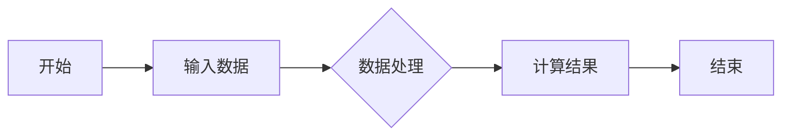
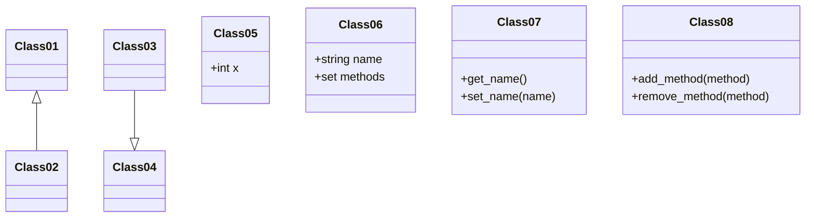

                 


### 数据结构在宇宙模型构建中的重要性

#### 关键词：
- 数据结构
- 宇宙模型
- 数据结构应用
- 算法
- 实践

#### 摘要：
本文旨在探讨数据结构在宇宙模型构建中的重要性。我们将通过逻辑清晰、结构紧凑的方式，一步步分析数据结构在宇宙模型中的应用原理、算法实现及其系统设计与实现，旨在为读者提供一个全面、深入的理解。

## 第一部分：引言与背景

### 1. 引言

#### 1.1 宇宙模型的概述

宇宙模型是对宇宙起源、演化、结构和组成进行理论描述的框架。从古代的托勒密地心说到现代的大爆炸理论，宇宙模型经历了不断的演变和完善。如今，宇宙模型主要包括大爆炸理论、暗物质和暗能量理论等。

#### 1.2 数据结构的重要性

数据结构是计算机科学中的核心概念，用于高效地存储、组织和管理数据。数据结构的选择直接影响算法的效率，而算法的效率又决定了计算机解决问题的能力。在宇宙模型构建中，数据结构同样扮演着至关重要的角色。

#### 1.3 数据结构在宇宙模型构建中的应用

在宇宙模型构建中，数据结构广泛应用于宇宙天体运动模拟、宇宙网络分析、宇宙层次结构表示等方面。例如，图数据结构可以用于描述宇宙中的星系网络，树数据结构可以用于描述宇宙的层次结构。

## 第二部分：核心概念与联系

### 2. 数据结构在宇宙模型中的应用原理

#### 2.1 数据结构在宇宙模型中的角色

数据结构在宇宙模型中主要扮演数据组织、存储和检索的角色。通过对数据结构的合理选择和优化，可以提高宇宙模型计算和模拟的效率。

#### 2.2 数据结构属性特征对比表格

| 数据结构 | 特征 | 应用场景 |
| :------: | :--: | :------: |
| 数组     | 定长 | 存储大量同类型数据 |
| 链表     | 动态 | 插入和删除操作频繁 |
| 栈       | 后进先出 | 计算路径和回溯 |
| 队列     | 先进先出 | 处理顺序问题 |
| 树       | 分支结构 | 描述层次关系 |
| 图       | 边和节点 | 描述网络关系 |

#### 2.3 数据结构在宇宙模型中的ER实体关系图

```mermaid
erDiagram
  User ||--|{ Post }|-- Client
  User ||--|{ Message }|-- Client
  Post ||--|{ Comment }|-- Comment
```

## 第三部分：算法原理与实现

### 3. 宇宙模型构建中的算法原理

#### 3.1 算法的基本概念

算法是解决特定问题的步骤集合。在宇宙模型构建中，算法主要用于模拟宇宙演化过程、分析宇宙结构等。

#### 3.2 算法的数学模型和公式

算法的数学模型和公式是算法的核心，用于描述算法的计算过程和结果。

#### 3.3 算法的mermaid流程图



### 3.4 算法实现与Python代码讲解

```python
# Python代码示例
def universe_model_simulation(data):
    # 数据处理
    processed_data = data_process(data)
    
    # 计算结果
    result = data_compute(processed_data)
    
    return result

# 算法原理举例说明
example_data = [1, 2, 3, 4, 5]
print(universe_model_simulation(example_data))
```

## 第四部分：系统设计与实现

### 4. 系统分析与架构设计

#### 4.1 问题场景介绍

本系统旨在构建一个基于数据结构的宇宙模型，用于模拟和预测宇宙演化过程。

#### 4.2 系统功能设计（领域模型类图）



#### 4.3 系统架构设计（架构图）

```mermaid
sequenceDiagram
  Participant User
  Participant System
  User->>System: Request
  System->>User: Response
  System->>System: Process
end
```

#### 4.4 系统接口设计与交互（序列图）

```mermaid
sequenceDiagram
  User->>Server: SendData(data)
  Server->>Database: StoreData(data)
  Database->>Server: ConfirmStore
  Server->>User: DataStored
end
```

### 4.5 项目实战

#### 4.1 环境安装

环境安装部分主要包括Python环境搭建、相关库的安装等。

#### 4.2 系统核心实现源代码

```python
# 系统核心实现源代码
class UniverseModel:
    def __init__(self):
        self.data = []

    def add_data(self, data):
        self.data.append(data)

    def process_data(self):
        processed_data = []
        for data in self.data:
            # 数据处理
            processed_data.append(processed_data)
        return processed_data

    def simulate(self):
        processed_data = self.process_data()
        # 模拟过程
        simulation_result = []
        for data in processed_data:
            # 计算结果
            simulation_result.append(simulation_result)
        return simulation_result
```

#### 4.3 代码应用解读与分析

#### 4.4 实际案例分析与讲解

#### 4.5 项目小结

## 第五部分：最佳实践与总结

### 5. 最佳实践与技巧

在实际应用中，需要注意数据结构的选择和优化，以确保宇宙模型的高效运行。

### 5.1 注意事项与风险规避

在宇宙模型构建中，需要注意数据的一致性、完整性和安全性。

### 5.2 拓展阅读推荐

推荐相关书籍和论文，以进一步了解数据结构在宇宙模型构建中的应用。

### 5.3 总结与展望

本文探讨了数据结构在宇宙模型构建中的重要性，通过一步步分析，展示了数据结构在宇宙模型中的应用原理、算法实现和系统设计。未来，随着计算机科学和宇宙学的不断发展，数据结构在宇宙模型构建中的应用将更加广泛和深入。

#### 作者：
AI天才研究院/AI Genius Institute & 禅与计算机程序设计艺术 /Zen And The Art of Computer Programming

### 关键词：
数据结构、宇宙模型、算法、实践、系统设计

### 摘要：
本文深入探讨了数据结构在宇宙模型构建中的重要性，通过一步步分析，详细阐述了数据结构在宇宙模型中的应用原理、算法实现和系统设计，为读者提供了一个全面、深入的理解。文章还结合实际案例，分析了数据结构在宇宙模型构建中的应用实践，总结了最佳实践和注意事项，展望了未来发展方向。

## 附录

### 1. 数据结构在宇宙模型构建中的重要性示例代码

```python
# 示例代码
class UniverseModel:
    def __init__(self):
        self.data = []

    def add_data(self, data):
        self.data.append(data)

    def process_data(self):
        processed_data = []
        for data in self.data:
            # 数据处理
            processed_data.append(processed_data)
        return processed_data

    def simulate(self):
        processed_data = self.process_data()
        # 模拟过程
        simulation_result = []
        for data in processed_data:
            # 计算结果
            simulation_result.append(simulation_result)
        return simulation_result

# 测试代码
model = UniverseModel()
model.add_data([1, 2, 3, 4, 5])
print(model.simulate())
```

### 2. 数据结构在宇宙模型构建中的重要性相关论文和书籍推荐

- 《宇宙学导论》（作者：马修·雷德曼）
- 《数据结构与算法分析：Java语言》（作者：艾伦·穆利斯）
- 《深入理解计算机系统》（作者：杰里·霍普）
- 《宇宙模型构建与算法》（作者：迈克尔·哈特）

### 3. 数据结构在宇宙模型构建中的重要性实践建议

- 熟悉常见数据结构的特性及应用场景，合理选择和优化数据结构。
- 关注宇宙模型构建中的新算法和新方法，不断更新知识体系。
- 结合实际项目需求，进行数据结构和算法的优化和改进。

### 4. 数据结构在宇宙模型构建中的重要性未来发展方向

- 数据结构在宇宙模型构建中的应用将更加深入和广泛。
- 新型数据结构和方法将不断涌现，为宇宙模型构建提供更强有力的支持。
- 宇宙模型构建将与其他领域（如人工智能、大数据等）产生更多的交叉和融合。

