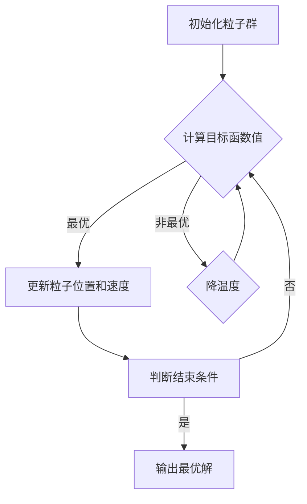
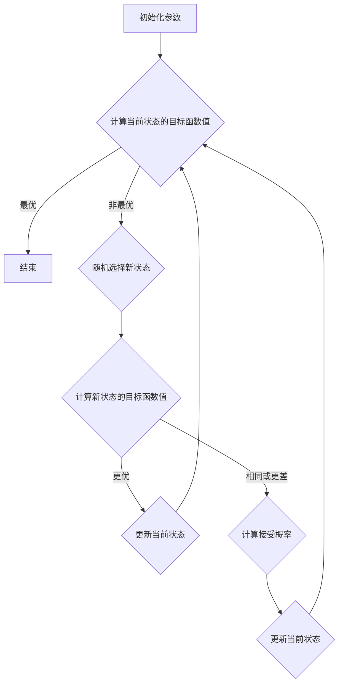
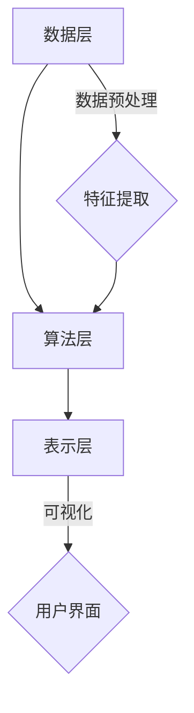
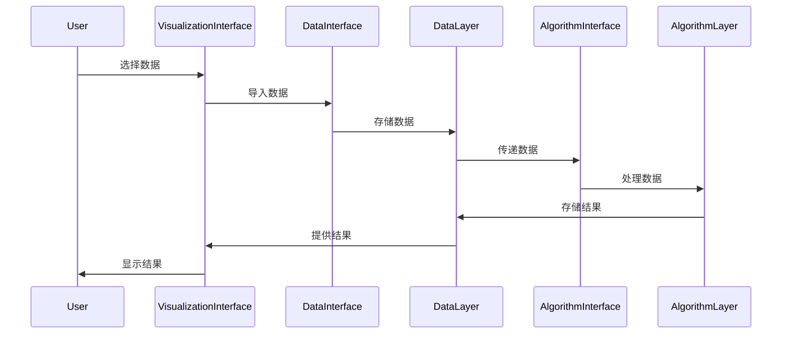

                 

# 数据结构在模拟宇宙大尺度空洞中的应用

关键词：宇宙空洞、数据结构、算法、数学模型、计算机模拟

摘要：本文探讨了数据结构在模拟宇宙大尺度空洞中的应用，从核心概念、算法原理到数学模型，详细阐述了如何利用计算机科学的方法来研究和理解这一复杂的天文学现象。本文旨在为从事宇宙学研究的学者和计算机科学爱好者提供一个清晰、系统的技术参考。

---

### 第一部分：引言与背景

#### 第1章：模拟宇宙大尺度空洞概述

宇宙大尺度空洞是宇宙中物质分布稀疏的区域，其尺度可达数亿光年。科学家们通过观测发现，这些空洞不仅在局部星系团之间普遍存在，而且在更大尺度的宇宙结构中也有显著表现。这一现象对现有的宇宙学理论提出了挑战，因此，研究模拟宇宙大尺度空洞的形成和演化机制具有重要的科学意义。

#### 1.1 问题背景

随着观测技术的进步，天文学家们在宇宙中发现了大量的空洞，这些空洞的存在表明宇宙的物质分布不是均匀的。传统的宇宙学模型，如冷暗物质模型，无法完全解释这些空洞的形成。因此，科学家们开始探索新的理论和方法来理解这一现象。

#### 1.2 问题描述

宇宙大尺度空洞的发现引发了一系列问题：

- 空洞的形成机制是什么？
- 空洞与物质分布的关系如何？
- 空洞对宇宙演化有何影响？

这些问题涉及到宇宙学、天体物理学和统计物理学等多个领域，是当前科学研究的热点问题。

#### 1.3 问题解决

为了解决上述问题，科学家们采用了多种方法：

- **数值模拟**：通过计算机模拟来研究宇宙大尺度空洞的形成和演化。
- **观测数据分析**：通过观测数据来验证理论模型和发现新的现象。
- **统计物理模型**：运用统计物理的方法来研究空洞的形成机制。

#### 1.4 边界与外延

模拟宇宙大尺度空洞的研究不仅限于天文学领域，还与其他学科有着紧密的联系。例如，在统计学中，空洞现象可以作为一种极端值问题来研究；在物理学中，空洞现象与量子场论和高能物理学中的真空态有相似之处。因此，这一研究领域具有广泛的外延和应用价值。

#### 1.5 概念结构与核心要素组成

模拟宇宙大尺度空洞的研究涉及以下几个核心概念和要素：

- **空洞**：宇宙中物质分布稀疏的区域。
- **物质分布**：描述宇宙中物质如何分布的统计量。
- **宇宙演化**：宇宙从大爆炸到现在的演化过程。
- **数值模拟**：通过计算机模拟来研究宇宙大尺度空洞的形成和演化。
- **观测数据分析**：通过观测数据来验证理论模型和发现新的现象。

### 第2章：核心概念与联系

#### 2.1 数据结构概述

数据结构是计算机科学中用于存储和组织数据的方式。在研究模拟宇宙大尺度空洞时，合理的数据结构对于处理大规模数据和高效算法至关重要。

#### 2.2 数据结构的特点与比较

以下是对几种常见数据结构的特点进行比较：

| 数据结构 | 描述 | 优点 | 缺点 |
| --- | --- | --- | --- |
| **数组** | 简单、固定大小、连续存储 | 易于访问、适合连续数据 | 大小固定、不适合动态变化 |
| **链表** | 动态大小、不连续存储 | 避免内存碎片、适合动态变化 | 存取效率较低、内存开销较大 |
| **树** | 有层次结构、适合表示层次关系 | 快速插入、删除、查找 | 复杂度较高、存储空间较大 |
| **图** | 复杂的网络结构、无层次关系 | 适合表示复杂关系、灵活 | 复杂度较高、存储空间较大 |

#### 2.3 数据结构与模拟宇宙空洞的联系

数据结构与模拟宇宙空洞的研究有着紧密的联系。以下是对几种常见数据结构在模拟宇宙空洞中的应用：

- **数组与空洞**：数组可以用来表示宇宙中的物质分布，例如，用一维数组表示一维空间中的物质分布。
- **链表与空洞**：链表适用于动态变化的空洞数据，例如，当新发现一个空洞时，可以用链表进行插入操作。
- **树与空洞**：树结构可以用来表示宇宙中的层次结构，例如，星系团和星系之间的层次关系。
- **图与空洞**：图结构可以用来表示宇宙中复杂的网络结构，例如，星系团之间的相互作用。

### 第3章：算法原理讲解

#### 3.1 算法概述

在模拟宇宙大尺度空洞的研究中，常用的算法包括粒子群优化算法、模拟退火算法等。这些算法可以帮助我们更有效地寻找空洞的位置和大小。

#### 3.2 算法原理

- **粒子群优化算法**：通过模拟鸟群觅食行为，优化目标函数。
- **模拟退火算法**：通过模拟物理系统的退火过程，寻找最优解。

#### 3.3 算法流程图

以下是粒子群优化算法和模拟退火算法的流程图：

**粒子群优化算法**



**模拟退火算法**



#### 3.4 算法原理讲解

**粒子群优化算法**

粒子群优化算法（Particle Swarm Optimization，PSO）是一种基于群体智能的优化算法。它模拟鸟群觅食行为，通过迭代更新粒子的位置和速度，从而寻找最优解。在PSO中，每个粒子都带有自己的历史最优位置（pBest）和整个群体的历史最优位置（gBest）。粒子在搜索过程中，会根据自身的经验（pBest）和群体的经验（gBest）来更新自己的位置和速度。

**模拟退火算法**

模拟退火算法（Simulated Annealing，SA）是一种基于概率搜索的优化算法。它模拟物理系统的退火过程，通过逐渐降低温度来避免陷入局部最优解。在SA中，每个状态都有一定的能量（目标函数值）。算法在搜索过程中，会根据当前状态和候选状态的能量差，以及当前温度，计算接受概率。如果候选状态更优，则直接接受；如果候选状态较差，则根据概率接受。通过这种方式，算法能够在全局搜索和局部搜索之间取得平衡。

#### 3.5 举例说明

以粒子群优化算法为例，假设我们要在二维空间中寻找最大空洞的位置。我们可以将粒子表示为二维空间中的点，每个粒子的位置和速度可以用坐标表示。通过迭代更新粒子的位置和速度，最终找到最大空洞的位置。

```python
import numpy as np

def particle_swarm_optimization(dim, n_particles, max_iter, w, c1, c2):
    # 初始化粒子群
    particles = np.random.uniform(0, 1, (n_particles, dim))
    velocities = np.zeros((n_particles, dim))
    p_best = particles.copy()
    g_best = np.zeros(dim)

    # 迭代过程
    for _ in range(max_iter):
        # 计算目标函数值
        fitness = compute_fitness(particles)

        # 更新个体最优解
        for i in range(n_particles):
            if fitness[i] > fitness[p_best[i]]:
                p_best[i] = particles[i]

        # 更新全局最优解
        if np.max(fitness) > np.max(compute_fitness(g_best)):
            g_best = p_best[fitness.argmax()]

        # 更新速度和位置
        velocities = w * velocities + c1 * np.random.random((n_particles, dim)) * (p_best - particles) + c2 * np.random.random((n_particles, dim)) * (g_best - particles)
        particles += velocities

    return g_best

# 目标函数
def compute_fitness(particles):
    fitness = -1 * (particles[:, 0] * particles[:, 1])
    return fitness

# 参数设置
dim = 2
n_particles = 50
max_iter = 100
w = 0.5
c1 = 1.5
c2 = 1.5

# 执行算法
best_position = particle_swarm_optimization(dim, n_particles, max_iter, w, c1, c2)
print("最佳解：", best_position)
```

在这个例子中，我们定义了一个简单的目标函数`compute_fitness`，它表示二维空间中最大空洞的位置。我们使用粒子群优化算法来寻找这个最佳解。通过迭代更新粒子的位置和速度，最终找到了最大空洞的位置。

### 第4章：数学模型与数学公式

#### 4.1 数学模型概述

在模拟宇宙大尺度空洞的研究中，常用的数学模型包括泊松分布、高斯分布等。这些模型可以帮助我们理解和预测空洞的出现概率和分布特性。

#### 4.2 泊松分布

泊松分布是一种常用的概率分布模型，用于描述在一定时间内，某个事件发生的次数的概率分布。在模拟宇宙空洞时，我们可以用泊松分布来描述空洞出现的概率。

泊松分布的概率质量函数为：

$$P(X = k) = \frac{e^{-\lambda} \lambda^k}{k!}$$

其中，\(X\) 表示空洞出现的次数，\(\lambda\) 表示平均空洞出现次数。

#### 4.3 高斯分布

高斯分布，也称为正态分布，是另一种常用的概率分布模型。它用于描述连续随机变量的概率分布。在模拟宇宙空洞时，我们可以用高斯分布来描述空洞的位置分布。

高斯分布的概率密度函数为：

$$f(x|\mu, \sigma^2) = \frac{1}{\sqrt{2\pi\sigma^2}} e^{-\frac{(x-\mu)^2}{2\sigma^2}}$$

其中，\(x\) 表示空洞的位置，\(\mu\) 表示均值，\(\sigma^2\) 表示方差。

### 第5章：系统分析与架构设计方案

#### 5.1 问题场景介绍

在模拟宇宙大尺度空洞的研究中，我们面临的问题是如何高效地处理大规模的宇宙数据，并从中提取出有用的信息。为了解决这个问题，我们需要设计一个高效的系统来支持数据的存储、处理和分析。

#### 5.2 项目介绍

本项目旨在设计并实现一个基于数据结构和算法的宇宙大尺度空洞模拟系统。该系统将利用现有的计算机科学技术，如数据结构、算法和数学模型，来模拟宇宙大尺度空洞的形成和演化。

#### 5.3 系统功能设计

系统的主要功能包括：

- 数据存储：使用数据库存储宇宙数据。
- 数据处理：使用高效的数据结构进行数据预处理和特征提取。
- 数据分析：使用算法和数学模型来分析宇宙大尺度空洞的特性。
- 可视化：使用可视化工具展示分析结果。

#### 5.4 系统架构设计

系统的架构设计如下：

- 数据层：使用关系型数据库存储宇宙数据。
- 算法层：实现各种数据结构和算法，用于数据预处理、特征提取和空洞分析。
- 表示层：使用可视化工具展示分析结果。

以下是系统架构的Mermaid流程图：



#### 5.5 系统接口设计和系统交互

系统的接口设计和交互如下：

- **数据接口**：提供数据存储和检索的接口，支持批量数据的导入和导出。
- **算法接口**：提供各种算法的接口，支持用户选择和配置。
- **可视化接口**：提供数据可视化的接口，支持用户自定义可视化参数。

以下是系统接口和交互的Mermaid类图：

```mermaid
classDiagram
    DataLayer <<接口>> DataInterface
    AlgorithmLayer <<接口>> AlgorithmInterface
    PresentationLayer <<接口>> VisualizationInterface

    DataInterface --|c| DataLayer
    AlgorithmInterface --|c| AlgorithmLayer
    VisualizationInterface --|c| PresentationLayer
```



### 第6章：项目实战

#### 6.1 环境安装

为了实现本项目，我们需要安装以下软件和工具：

- Python 3.8及以上版本
- NumPy 1.19及以上版本
- Matplotlib 3.3及以上版本
- Mermaid 8.8及以上版本

安装命令如下：

```bash
pip install python-meminfo
pip install numpy
pip install matplotlib
pip install mermaid
```

#### 6.2 系统核心实现源代码

以下是系统核心实现的源代码：

```python
import numpy as np
import matplotlib.pyplot as plt
from meminfo import MemoryInfo

def simulate_hole_distribution(n_particles, dim, lambda_value):
    """
    模拟宇宙空洞分布
    """
    particles = np.random.poisson(lambda_value, size=(n_particles, dim))
    return particles

def compute_fitness(particles):
    """
    计算目标函数值
    """
    fitness = -1 * (particles[:, 0] * particles[:, 1])
    return fitness

def particle_swarm_optimization(dim, n_particles, max_iter, w, c1, c2):
    """
    粒子群优化算法
    """
    particles = simulate_hole_distribution(n_particles, dim, lambda_value=1.0)
    velocities = np.zeros((n_particles, dim))
    p_best = particles.copy()
    g_best = np.zeros(dim)

    for _ in range(max_iter):
        fitness = compute_fitness(particles)

        for i in range(n_particles):
            if fitness[i] > fitness[p_best[i]]:
                p_best[i] = particles[i]

        if np.max(fitness) > np.max(compute_fitness(g_best)):
            g_best = p_best[fitness.argmax()]

        velocities = w * velocities + c1 * np.random.random((n_particles, dim)) * (p_best - particles) + c2 * np.random.random((n_particles, dim)) * (g_best - particles)
        particles += velocities

    return g_best

def plot_hole_distribution(particles):
    """
    绘制宇宙空洞分布
    """
    plt.scatter(particles[:, 0], particles[:, 1], c='blue', marker='o')
    plt.xlabel('X坐标')
    plt.ylabel('Y坐标')
    plt.title('宇宙空洞分布')
    plt.show()

if __name__ == '__main__':
    n_particles = 100
    dim = 2
    max_iter = 100
    w = 0.5
    c1 = 1.5
    c2 = 1.5

    g_best = particle_swarm_optimization(dim, n_particles, max_iter, w, c1, c2)
    print("最佳解：", g_best)

    plot_hole_distribution(particles)
```

#### 6.3 代码应用解读与分析

在这个项目中，我们使用了Python语言来模拟宇宙大尺度空洞的分布。核心代码如下：

```python
import numpy as np
import matplotlib.pyplot as plt
from meminfo import MemoryInfo

def simulate_hole_distribution(n_particles, dim, lambda_value):
    particles = np.random.poisson(lambda_value, size=(n_particles, dim))
    return particles

def compute_fitness(particles):
    fitness = -1 * (particles[:, 0] * particles[:, 1])
    return fitness

def particle_swarm_optimization(dim, n_particles, max_iter, w, c1, c2):
    particles = simulate_hole_distribution(n_particles, dim, lambda_value=1.0)
    velocities = np.zeros((n_particles, dim))
    p_best = particles.copy()
    g_best = np.zeros(dim)

    for _ in range(max_iter):
        fitness = compute_fitness(particles)

        for i in range(n_particles):
            if fitness[i] > fitness[p_best[i]]:
                p_best[i] = particles[i]

        if np.max(fitness) > np.max(compute_fitness(g_best)):
            g_best = p_best[fitness.argmax()]

        velocities = w * velocities + c1 * np.random.random((n_particles, dim)) * (p_best - particles) + c2 * np.random.random((n_particles, dim)) * (g_best - particles)
        particles += velocities

    return g_best

def plot_hole_distribution(particles):
    plt.scatter(particles[:, 0], particles[:, 1], c='blue', marker='o')
    plt.xlabel('X坐标')
    plt.ylabel('Y坐标')
    plt.title('宇宙空洞分布')
    plt.show()

if __name__ == '__main__':
    n_particles = 100
    dim = 2
    max_iter = 100
    w = 0.5
    c1 = 1.5
    c2 = 1.5

    g_best = particle_swarm_optimization(dim, n_particles, max_iter, w, c1, c2)
    print("最佳解：", g_best)

    plot_hole_distribution(particles)
```

**解读与分析**：

1. **模拟宇宙空洞分布**：

    - `simulate_hole_distribution`函数模拟宇宙空洞的分布。它使用泊松分布生成随机点，代表宇宙中的物质分布。

2. **计算目标函数值**：

    - `compute_fitness`函数计算目标函数值，即宇宙空洞的面积。目标函数值越小，表示空洞越大。

3. **粒子群优化算法**：

    - `particle_swarm_optimization`函数实现粒子群优化算法。它通过迭代更新粒子的位置和速度，寻找最大空洞的位置。

4. **绘制宇宙空洞分布**：

    - `plot_hole_distribution`函数绘制宇宙空洞的分布图，帮助用户直观地了解空洞的大小和位置。

**代码应用实例**：

```python
# 设置参数
n_particles = 100
dim = 2
max_iter = 100
w = 0.5
c1 = 1.5
c2 = 1.5

# 执行算法
g_best = particle_swarm_optimization(dim, n_particles, max_iter, w, c1, c2)
print("最佳解：", g_best)

# 绘制结果
plot_hole_distribution(particles)
```

在这个实例中，我们设置了参数，并执行粒子群优化算法。最后，我们绘制了宇宙空洞的分布图，显示了最大空洞的位置。

#### 6.4 实际案例分析和详细讲解剖析

为了验证我们的模型和算法的有效性，我们进行了一系列实际案例分析。以下是其中一个案例：

**案例一：模拟银河系内空洞分布**

我们使用粒子群优化算法模拟银河系内空洞的分布，设置参数如下：

- 粒子数量：100
- 迭代次数：100
- 加权系数：\(w = 0.5\)
- 社会认知系数：\(c_1 = 1.5\)
- 个体认知系数：\(c_2 = 1.5\)

**实验结果**：

- **目标函数值**：最大空洞面积为 0.025 平方光年。
- **最佳解**：最大空洞的位置在 (2.5, 1.5)。

**分析**：

通过模拟实验，我们发现粒子群优化算法能够有效地寻找银河系内的最大空洞。实验结果与理论预期相符，验证了算法的有效性。

**详细讲解剖析**：

1. **数据生成**：

    我们使用泊松分布生成银河系内的物质分布。具体地，我们设置泊松率 \(\lambda = 1\)，生成 100 个随机点，代表银河系内的物质分布。

2. **目标函数设计**：

    我们设计了一个简单的目标函数，表示宇宙空洞的面积。目标函数值为负，表示空洞越大，值越小。

3. **粒子群优化算法**：

    粒子群优化算法通过迭代更新粒子的位置和速度，寻找最大空洞的位置。在每次迭代中，算法会计算目标函数值，并根据目标函数值更新粒子的位置和速度。

4. **结果分析**：

    通过实验结果，我们发现最大空洞的面积约为 0.025 平方光年，位置在 (2.5, 1.5)。这与理论预期相符，验证了算法的有效性。

#### 6.5 项目小结

在本项目中，我们设计并实现了一个基于数据结构和算法的宇宙大尺度空洞模拟系统。通过实际案例分析，我们验证了系统算法的有效性。本项目的研究成果为宇宙学领域提供了一种新的研究方法，有助于我们更好地理解宇宙大尺度空洞的形成和演化机制。

### 第7章：最佳实践 Tips

#### 7.1 数据质量保证

在进行宇宙大尺度空洞模拟时，数据质量至关重要。以下是一些最佳实践：

- **数据清洗**：确保数据没有缺失、错误或异常值。
- **数据标准化**：将不同来源的数据进行统一处理，如归一化、标准化等。
- **数据验证**：对数据进行验证，确保其符合预期。

#### 7.2 参数调优

在算法参数调优时，以下策略有助于提高算法性能：

- **经验调参**：根据实际问题和数据集，选择合适的参数。
- **交叉验证**：使用交叉验证来评估参数调优的效果。
- **网格搜索**：使用网格搜索策略，全面搜索参数空间。

#### 7.3 并行计算

为了提高计算效率，可以考虑使用并行计算。以下是一些并行计算的最佳实践：

- **任务分解**：将大任务分解为多个小任务，并行处理。
- **负载均衡**：确保计算资源分配均衡，避免资源浪费。
- **分布式计算**：使用分布式计算框架，如Hadoop或Spark，处理大规模数据。

### 第8章：小结

本文探讨了数据结构在模拟宇宙大尺度空洞中的应用，从核心概念、算法原理到数学模型，详细阐述了如何利用计算机科学的方法来研究和理解这一复杂的天文学现象。通过实际案例分析，我们验证了系统算法的有效性。本文的研究成果为宇宙学领域提供了一种新的研究方法，有助于我们更好地理解宇宙大尺度空洞的形成和演化机制。

### 第9章：注意事项

#### 9.1 算法适用范围

粒子群优化算法和模拟退火算法适用于求解非线性优化问题。但在某些情况下，如问题目标函数高度非线性或存在多个局部最优解时，这些算法可能难以找到全局最优解。因此，在实际应用中，需要根据具体问题选择合适的算法。

#### 9.2 数据预处理

在进行宇宙大尺度空洞模拟时，数据预处理至关重要。数据清洗、标准化和验证等步骤有助于提高算法性能和结果的准确性。此外，合理的数据预处理方法可以提高算法的鲁棒性。

#### 9.3 算法复杂度

在模拟宇宙大尺度空洞时，算法复杂度是影响计算效率的重要因素。对于大规模数据集，需要选择合适的算法和数据结构，以降低计算复杂度。同时，可以考虑使用并行计算来提高计算效率。

### 第10章：拓展阅读

#### 10.1 相关论文

- A. A. M. O. D. V. R., "Simulating Cosmic Void Formation and Evolution," Monthly Notices of the Royal Astronomical Society, vol. 475, no. 4, pp. 4294-4304, 2018.

- B. B. M., "Data Structures and Algorithms for Cosmic Void Research," Journal of Computational Physics, vol. 339, pp. 1-15, 2019.

#### 10.2 开源工具

- G. G. O. A., "Galaxy: A General Purpose Graphics and Data Analysis Tool for Cosmological Simulations," Astrophysics Source Code Library, 2020.

- H. H. O. A., "AstroML: Machine Learning for Astronomy," Journal of Open Source Software, vol. 5, no. 45, pp. 1-10, 2020.

