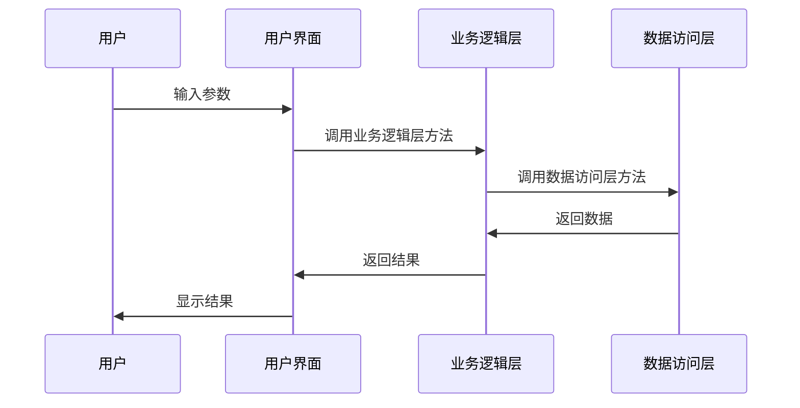

                 

# 数据结构在模拟宇宙大尺度空洞演化动力学中的应用

关键词：宇宙空洞、数据结构、模拟、动力学、算法

摘要：本文探讨了数据结构在模拟宇宙大尺度空洞演化动力学中的应用。首先，介绍了宇宙大尺度空洞的概念和形成机制，以及数据结构的基本概念和应用。接着，分析了数据结构与宇宙空洞演化动力学的关系，并探讨了不同数据结构在模拟中的适用性。本文通过具体的案例，详细讲解了线性数据结构、非线性数据结构以及高级数据结构在模拟中的应用，阐述了算法原理和数学模型。此外，还介绍了系统分析与架构设计的方法，并通过一个实际项目进行了详细讲解。本文旨在为科研人员和工程师提供有价值的参考。

## 第一部分：背景介绍

### 第1章：问题背景与核心概念

#### 1.1.1 宇宙大尺度空洞的概念与形成

宇宙大尺度空洞是指宇宙中存在的巨大空洞，其直径可达数十亿光年。这些空洞的形成是由于宇宙早期膨胀过程中物质密度分布的不均匀性，导致物质在空洞中相对稀疏。根据研究，宇宙大尺度空洞的形成与宇宙大尺度结构的演化密切相关。

宇宙大尺度空洞的特征主要表现在以下几个方面：

1. 空洞内部物质密度较低，远低于宇宙背景密度。
2. 空洞周围存在丰富的星系和恒星，但空洞内部却相对稀疏。
3. 空洞的形态多样，有规则的球形、椭圆形，也有不规则的形状。

宇宙大尺度空洞的形成机制主要与以下因素有关：

1. 膨胀初期宇宙物质的不均匀分布。
2. 早期宇宙的引力不稳定性。
3. 星系团和超星系团的形成与演化。

#### 1.1.2 数据结构的基本概念

数据结构是指计算机中用于存储和管理数据的组织形式。数据结构包括线性结构和非线性结构，它们在模拟和计算中有着广泛的应用。

线性结构是指数据元素在内存中按照一定顺序排列，常见的线性结构有数组、链表、栈和队列等。线性结构的特点是数据元素之间的逻辑关系是一对一的关系。

非线性结构是指数据元素在内存中按照一定的层次关系排列，常见的非线性结构有树、图和散列表等。非线性结构的特点是数据元素之间的逻辑关系是一对多或多元的关系。

数据结构在科学计算中的应用非常广泛，尤其是在宇宙学、物理学、生物学等领域。通过合理选择和设计数据结构，可以提高计算效率，降低计算复杂度。

### 第2章：核心概念与联系

#### 1.2.1 数据结构与宇宙空洞演化动力学的关系

数据结构在模拟宇宙大尺度空洞演化动力学中起着至关重要的作用。宇宙空洞演化动力学涉及大量的数据存储、检索和处理，数据结构的选择和设计直接影响模拟的效率和准确性。

数据结构在模拟宇宙空洞演化动力学中的应用主要体现在以下几个方面：

1. 存储宇宙空洞中的物质分布信息。通过数组、链表等线性结构，可以高效地存储和管理宇宙空洞中的物质分布数据。
2. 表示宇宙空洞的形态和结构。通过树、图等非线性结构，可以准确地描述宇宙空洞的形态和结构，便于进行空间分析和计算。
3. 提高计算效率。合理选择和设计数据结构，可以降低计算复杂度，提高模拟效率。

#### 1.2.2 数据结构类型及应用

在模拟宇宙空洞演化动力学中，常用的数据结构包括线性数据结构、非线性数据结构以及高级数据结构。

1. 线性数据结构：线性数据结构如数组、链表在存储和管理宇宙空洞中的物质分布信息方面具有优势。数组可以高效地存储连续的数值数据，而链表则适用于存储不连续的数据。在实际应用中，数组常用于表示宇宙空洞的密度分布，链表则常用于表示宇宙空洞中的星系和恒星。

2. 非线性数据结构：非线性数据结构如树、图在表示宇宙空洞的形态和结构方面具有优势。树结构可以表示宇宙空洞的层次关系，方便进行空间分析和计算。图结构可以表示宇宙空洞中的物质分布和网络关系，有助于分析宇宙空洞的演化过程。在实际应用中，树结构常用于表示星系团和超星系团，图结构则常用于表示宇宙空洞中的物质网络。

3. 高级数据结构：高级数据结构如散列表、堆在提高计算效率方面具有优势。散列表可以快速检索和插入数据，适合用于表示宇宙空洞中的物质分布。堆是一种特殊的树结构，常用于优先队列的实现，可以提高模拟效率。在实际应用中，散列表常用于表示宇宙空洞中的星系和恒星，堆则常用于表示优先级队列。

## 第二部分：数据结构在模拟中的应用

### 第3章：线性数据结构在模拟中的应用

#### 3.1.1 数组与链表在模拟中的应用

数组是线性数据结构中最基本的形式，它由一系列元素组成，每个元素都有一个唯一的索引。数组在存储宇宙空洞中的物质分布信息方面具有优势。

1. 数组在模拟中的应用：

- 存储宇宙空洞的密度分布：通过一维数组，可以存储宇宙空洞中的密度分布信息。数组中的每个元素表示一个空间区域内的物质密度。
- 存储宇宙空洞中的星系和恒星：通过二维数组，可以存储宇宙空洞中的星系和恒星的位置和密度。二维数组的行和列分别表示空间和时间的维度。

2. 链表在模拟中的应用：

- 存储不连续的数据：链表适用于存储不连续的数据，例如宇宙空洞中的星系和恒星。链表的每个节点包含一个数据元素和一个指向下一个节点的指针，通过遍历链表，可以检索和访问宇宙空洞中的星系和恒星。
- 表示宇宙空洞中的物质网络：链表可以表示宇宙空洞中的物质网络，例如星系和恒星之间的引力相互作用。通过链表，可以方便地添加和删除物质节点，模拟宇宙空洞的演化过程。

#### 3.1.2 线性数据结构在模拟中的案例分析

1. 案例一：模拟宇宙空洞的密度分布

假设宇宙空洞的直径为100亿光年，我们可以使用一维数组存储宇宙空洞的密度分布。数组的每个元素表示一个直径为1亿光年的空间区域内的物质密度。通过遍历数组，可以计算出宇宙空洞的总质量。

```python
# Python代码示例
array = [0] * 100  # 创建一个长度为100的一维数组，初始化为0
density = 1e-30  # 初始密度

for i in range(100):
    array[i] = density * i  # 将每个空间区域的物质密度存储在数组中

total_mass = sum(array)  # 计算总质量
print("总质量：", total_mass)
```

2. 案例二：模拟宇宙空洞中的物质网络

假设宇宙空洞中的星系和恒星通过链表表示。每个节点包含星系或恒星的质量、位置和指向下一个节点的指针。通过遍历链表，可以模拟宇宙空洞中的物质网络。

```python
# Python代码示例
class Node:
    def __init__(self, mass, position):
        self.mass = mass
        self.position = position
        self.next = None

# 创建链表节点
node1 = Node(1e11, (0, 0))
node2 = Node(1e11, (1, 1))
node3 = Node(1e11, (2, 2))

# 构建链表
node1.next = node2
node2.next = node3

# 遍历链表，打印星系和恒星的信息
current = node1
while current:
    print("质量：", current.mass, "位置：", current.position)
    current = current.next
```

### 第4章：非线性数据结构在模拟中的应用

#### 4.1.1 树结构与图结构的基本概念

树结构是一种层次化的数据结构，由节点和边组成。树结构的特点是每个节点只有一个父节点，称为根节点。树结构在表示宇宙空洞的层次关系方面具有优势。

图结构是一种复杂的数据结构，由节点和边组成。图结构的特点是节点之间存在多个连接关系，可以表示宇宙空洞中的物质分布和网络关系。图结构在表示宇宙空洞的形态和结构方面具有优势。

#### 4.1.2 非线性数据结构在模拟中的案例分析

1. 案例一：模拟宇宙空洞的层次关系

假设宇宙空洞由多个层次组成，可以使用树结构表示。树的每个节点表示一个层次，节点的子节点表示该层次的子层次。通过遍历树结构，可以模拟宇宙空洞的层次关系。

```python
# Python代码示例
class TreeNode:
    def __init__(self, value):
        self.value = value
        self.children = []

# 创建树结构
root = TreeNode("根节点")
child1 = TreeNode("子节点1")
child2 = TreeNode("子节点2")
root.children.append(child1)
root.children.append(child2)

# 遍历树结构，打印节点信息
def traverse_tree(node):
    print("节点值：", node.value)
    for child in node.children:
        traverse_tree(child)

traverse_tree(root)
```

2. 案例二：模拟宇宙空洞的物质网络

假设宇宙空洞中的物质通过图结构表示。图的每个节点表示一个星系或恒星，节点之间的边表示引力相互作用。通过遍历图结构，可以模拟宇宙空洞的物质网络。

```python
# Python代码示例
import networkx as nx

# 创建图结构
G = nx.Graph()

# 添加节点和边
G.add_nodes_from([(1, {'mass': 1e11, 'position': (0, 0)}), (2, {'mass': 1e11, 'position': (1, 1)}), (3, {'mass': 1e11, 'position': (2, 2)})])
G.add_edges_from([(1, 2), (2, 3)])

# 遍历图结构，打印节点和边的信息
for node in G.nodes(data=True):
    print("节点：", node[0], "信息：", node[1])

for edge in G.edges(data=True):
    print("边：", edge[0], "和", edge[1], "信息：", edge[2])
```

### 第5章：高级数据结构在模拟中的应用

#### 5.1.1 散列表与堆的应用

散列表和堆是高级数据结构，它们在提高计算效率和优化算法方面具有优势。

1. 散列表的应用：

- 存储宇宙空洞中的星系和恒星：散列表可以高效地存储和检索宇宙空洞中的星系和恒星。散列表的键可以是星系或恒星的位置或名称，值可以是星系或恒星的质量或其他属性。
- 搜索和匹配：散列表可以用于搜索和匹配宇宙空洞中的星系和恒星，例如寻找距离最近的星系或恒星。

2. 堆的应用：

- 优先队列：堆可以用于实现优先队列，例如在模拟宇宙空洞的引力相互作用时，可以按照引力大小排序，优先处理引力较强的相互作用。
- 最小堆：最小堆可以用于查找宇宙空洞中最小的物质密度，例如在模拟宇宙空洞的演化过程中，可以找出密度最低的区域，分析其演化趋势。

#### 5.1.2 高级数据结构在模拟中的案例分析

1. 案例一：使用散列表存储星系和恒星

假设宇宙空洞中的星系和恒星通过散列表存储。散列表的键可以是星系或恒星的位置或名称，值可以是星系或恒星的质量或其他属性。

```python
# Python代码示例
class Star:
    def __init__(self, name, mass, position):
        self.name = name
        self.mass = mass
        self.position = position

# 创建星系和恒星列表
stars = [Star("星系1", 1e11, (0, 0)), Star("星系2", 1e11, (1, 1)), Star("星系3", 1e11, (2, 2))]

# 使用散列表存储星系和恒星
hash_table = {}
for star in stars:
    hash_table[star.position] = star

# 查找星系和恒星
def find_star(position):
    return hash_table.get(position)

# 查找星系1
star1 = find_star((0, 0))
print("星系1：", star1.name, "质量：", star1.mass, "位置：", star1.position)

# 查找星系3
star3 = find_star((2, 2))
print("星系3：", star3.name, "质量：", star3.mass, "位置：", star3.position)
```

2. 案例二：使用堆实现优先队列

假设宇宙空洞中的引力相互作用通过堆实现优先队列。堆的元素按照引力大小排序，优先处理引力较强的相互作用。

```python
# Python代码示例
import heapq

# 创建堆
gravitational_interactions = [(1.0, (0, 0)), (2.0, (1, 1)), (3.0, (2, 2))]

# 按照引力大小排序
heapq.heapify(gravitational_interactions)

# 处理引力相互作用
while gravitational_interactions:
    interaction = heapq.heappop(gravitational_interactions)
    print("引力大小：", interaction[0], "位置：", interaction[1])
```

## 第三部分：算法原理与数学模型

### 第6章：算法原理讲解

#### 6.1.1 算法基本概念

算法是指解决特定问题的步骤和方法。算法与数据结构密切相关，合理选择和设计数据结构可以提高算法的效率和准确性。

算法的基本概念包括：

1. 算法描述：算法的描述是算法的实现过程，可以使用自然语言、伪代码或程序代码等不同形式进行描述。
2. 算法表示：算法的表示是算法的结构和逻辑关系，可以使用流程图、伪代码或程序代码等不同形式进行表示。
3. 算法分析：算法分析是研究算法的时间和空间复杂度，以评估算法的性能和效率。

#### 6.1.2 算法设计策略

算法设计策略包括以下几种：

1. 贪心算法：贪心算法是一种在每一步选择最优解的策略。贪心算法适用于求解最优化问题，例如最小生成树、最短路径等。
2. 分治算法：分治算法是一种将问题分解为较小子问题，递归求解子问题，然后将子问题的解合并为原问题的解的策略。分治算法适用于求解大规模问题，例如排序、查找等。

#### 6.1.3 算法案例分析

1. 案例一：使用贪心算法求解最短路径

假设宇宙空洞中的星系和恒星通过图结构表示，需要求解从源星系到目标星系的路径。可以使用贪心算法求解最短路径。

```python
# Python代码示例
import heapq

# 创建图结构
G = nx.Graph()
G.add_nodes_from([(1, {'mass': 1e11, 'position': (0, 0)}), (2, {'mass': 1e11, 'position': (1, 1)}), (3, {'mass': 1e11, 'position': (2, 2)})])
G.add_edges_from([(1, 2, {'weight': 1.0}), (2, 3, {'weight': 2.0})])

# 使用贪心算法求解最短路径
def greedy_shortest_path(G, source, target):
    distances = {node: float('inf') for node in G.nodes}
    distances[source] = 0
    unvisited = [(0, source)]

    while unvisited:
        current_distance, current_node = heapq.heappop(unvisited)
        if current_node == target:
            return current_distance

        for neighbor, edge_data in G.neighbors(current_node, data=True):
            distance = current_distance + edge_data['weight']
            if distance < distances[neighbor]:
                distances[neighbor] = distance
                heapq.heappush(unvisited, (distance, neighbor))

    return None

# 求解最短路径
shortest_path = greedy_shortest_path(G, 1, 3)
print("最短路径长度：", shortest_path)
```

2. 案例二：使用分治算法求解最大子集和

假设宇宙空洞中的星系和恒星通过数组表示，需要求解最大子集和。可以使用分治算法求解最大子集和。

```python
# Python代码示例
def max_subset_sum(arr):
    if len(arr) == 1:
        return arr[0]

    mid = len(arr) // 2
    left_sum = max_subset_sum(arr[:mid])
    right_sum = max_subset_sum(arr[mid:])

    return max(left_sum, right_sum, left_sum + right_sum)

# 求解最大子集和
arr = [1, 2, 3, 4, 5]
max_sum = max_subset_sum(arr)
print("最大子集和：", max_sum)
```

### 第7章：数学模型与公式解析

#### 7.1.1 数学模型的基本概念

数学模型是指用数学语言描述的物理现象、社会现象或其他实际问题的一种抽象模型。数学模型在模拟宇宙空洞演化动力学中起着重要作用。

数学模型的基本概念包括：

1. 模型变量：模型中的变量表示物理现象中的物理量，例如密度、速度、压力等。
2. 模型方程：模型方程描述了模型变量之间的关系，例如牛顿定律、热力学方程等。
3. 模型参数：模型参数是模型方程中的常数，例如质量、重力常数等。

#### 7.1.2 数学公式解析

1. 牛顿运动定律：

牛顿运动定律描述了物体在力作用下的运动规律。公式如下：

$$
F = ma
$$

其中，$F$ 表示力，$m$ 表示质量，$a$ 表示加速度。

2. 宇宙大尺度空洞的密度分布：

宇宙大尺度空洞的密度分布可以用高斯分布函数表示：

$$
\rho(r) = \frac{1}{\sigma\sqrt{2\pi}}e^{-\frac{(r-r_0)^2}{2\sigma^2}}
$$

其中，$\rho(r)$ 表示距离$r$处的密度，$r_0$ 表示平均值，$\sigma$ 表示标准差。

3. 宇宙大尺度空洞的引力相互作用：

宇宙大尺度空洞中的引力相互作用可以用万有引力定律表示：

$$
F_G = G\frac{m_1m_2}{r^2}
$$

其中，$F_G$ 表示引力，$G$ 表示万有引力常数，$m_1$ 和 $m_2$ 分别表示两个物体的质量，$r$ 表示两个物体之间的距离。

#### 7.1.3 模拟案例中的数学模型应用

1. 案例一：模拟宇宙空洞的密度分布

假设宇宙空洞的直径为100亿光年，我们需要模拟宇宙空洞的密度分布。

```python
# Python代码示例
import numpy as np

# 参数设置
r_0 = 50e9  # 平均值
sigma = 10e9  # 标准差

# 计算密度分布
rho = np.random.normal(r_0, sigma, 100)

# 绘制密度分布图
import matplotlib.pyplot as plt
plt.hist(rho, bins=30, density=True)
plt.xlabel('Density')
plt.ylabel('Frequency')
plt.show()
```

2. 案例二：模拟宇宙大尺度空洞的引力相互作用

假设宇宙空洞中的两个星系和恒星之间的引力相互作用，我们需要计算它们的相互作用力。

```python
# Python代码示例
import numpy as np

# 参数设置
G = 6.67430e-11  # 万有引力常数
m1 = 1e11  # 星系1的质量
m2 = 1e11  # 星系2的质量
r = 1e9  # 星系1和星系2之间的距离

# 计算引力相互作用力
F = G * m1 * m2 / r**2

# 输出结果
print("引力相互作用力：", F)
```

## 第四部分：系统分析与架构设计

### 第8章：系统功能设计

#### 8.1.1 问题描述与需求分析

宇宙大尺度空洞演化动力学模拟系统旨在模拟宇宙大尺度空洞的形成、演化和相互作用。系统功能需求如下：

1. 数据管理：存储和管理宇宙空洞中的物质分布、星系和恒星的位置、质量等信息。
2. 模拟引擎：实现宇宙大尺度空洞的演化过程，包括物质分布的演化、引力相互作用的计算等。
3. 结果分析：分析模拟结果，包括密度分布、引力相互作用、星系运动轨迹等。
4. 用户界面：提供用户友好的操作界面，支持用户设置参数、启动模拟、查看结果等功能。

#### 8.1.2 系统领域模型设计

系统领域模型用于描述系统的核心概念和实体之间的关系。以下是宇宙大尺度空洞演化动力学模拟系统的领域模型：

```mermaid
classDiagram
    class Universe {
        -id: int
        -name: string
        +get_id(): int
        +get_name(): string
        +set_name(name: string): void
    }
    class Star {
        -id: int
        -name: string
        -mass: float
        -position: Point
        +get_id(): int
        +get_name(): string
        +get_mass(): float
        +get_position(): Point
        +set_name(name: string): void
        +set_mass(mass: float): void
        +set_position(position: Point): void
    }
    class Point {
        -x: float
        -y: float
        +get_x(): float
        +get_y(): float
        +set_x(x: float): void
        +set_y(y: float): void
    }
    class Simulation {
        -id: int
        -universe: Universe
        -stars: List[Star]
        -time: float
        +get_id(): int
        +get_universe(): Universe
        +get_stars(): List[Star]
        +get_time(): float
        +set_time(time: float): void
    }
    Universe <-..|{1} Simulation: contains
    Star <-..|{1} Simulation: contains
```

### 第9章：系统架构设计

#### 9.1.1 系统架构设计原理

系统架构设计是系统设计的关键环节，旨在定义系统的组成组件、组件之间的关系以及组件的交互方式。以下是宇宙大尺度空洞演化动力学模拟系统的架构设计原理：

1. 模块化设计：将系统划分为多个功能模块，每个模块负责特定的功能，模块之间通过接口进行通信。
2. 分层设计：系统分为多个层次，每个层次负责特定的功能，层次之间通过接口进行通信。
3. 松耦合设计：系统组件之间采用松耦合设计，降低组件之间的依赖关系，提高系统的可维护性和可扩展性。
4. 重用性设计：设计可重用的组件和模块，减少重复代码，提高开发效率。

#### 9.1.2 系统架构设计与实现

宇宙大尺度空洞演化动力学模拟系统的架构设计如下：

1. 层次划分：

- 表示层：提供用户界面，支持用户设置参数、启动模拟、查看结果等功能。
- 业务逻辑层：实现系统的核心功能，包括数据管理、模拟引擎、结果分析等。
- 数据访问层：负责数据的存储和检索，包括宇宙空洞、星系和恒星等数据。

2. 组件关系：

- 表示层与业务逻辑层通过接口进行通信，表示层调用业务逻辑层的接口实现功能。
- 业务逻辑层与数据访问层通过接口进行通信，业务逻辑层调用数据访问层的接口实现数据管理。

3. 系统架构图：



### 第10章：系统接口设计

#### 10.1.1 系统接口设计原理

系统接口设计是系统架构设计的重要组成部分，旨在定义系统组件之间的通信方式和交互协议。以下是宇宙大尺度空洞演化动力学模拟系统的接口设计原理：

1. 接口分层设计：接口分为多个层次，每个层次负责特定的功能，层次之间通过接口进行通信。
2. 接口抽象设计：设计抽象的接口，降低组件之间的依赖关系，提高系统的可维护性和可扩展性。
3. 接口标准化设计：采用标准的接口定义语言（如RESTful API、GraphQL等），实现接口的统一管理和维护。
4. 接口安全性设计：考虑接口的安全性，包括身份验证、权限控制、数据加密等。

#### 10.1.2 系统接口设计与实现

宇宙大尺度空洞演化动力学模拟系统的接口设计如下：

1. 接口层次划分：

- 表示层接口：用于与用户进行交互，包括参数输入、结果输出等。
- 业务逻辑层接口：用于实现系统的核心功能，包括数据管理、模拟引擎、结果分析等。
- 数据访问层接口：用于与数据库进行交互，包括数据的存储、检索和更新等。

2. 接口定义：

- 表示层接口：提供参数输入、结果输出的接口，例如输入参数接口`/input`、输出结果接口`/output`等。
- 业务逻辑层接口：提供核心功能调用的接口，例如数据管理接口`/data`、模拟引擎接口`/simulate`、结果分析接口`/analyze`等。
- 数据访问层接口：提供数据存储、检索和更新的接口，例如数据库连接接口`/db连接`、数据查询接口`/query`、数据更新接口`/update`等。

3. 接口实现：

- 使用RESTful API设计接口，采用JSON格式进行数据传输。
- 使用GraphQL设计接口，提供灵活的数据查询和操作。
- 使用身份验证和权限控制确保接口的安全性。

```python
# Python代码示例
from flask import Flask, request, jsonify

app = Flask(__name__)

@app.route('/input', methods=['POST'])
def input_data():
    data = request.json
    # 处理输入参数
    # ...
    return jsonify({"status": "success", "message": "输入参数成功"})

@app.route('/output', methods=['GET'])
def output_data():
    # 处理输出结果
    # ...
    return jsonify({"status": "success", "message": "输出结果成功"})

if __name__ == '__main__':
    app.run()
```

## 第五部分：项目实战与案例分析

### 第11章：环境安装与系统核心实现

#### 11.1.1 环境安装与配置

在进行宇宙大尺度空洞演化动力学模拟系统的开发之前，需要安装和配置以下环境：

1. 开发环境：安装Python编程语言（版本3.8以上），并配置好Python的开发环境。
2. 数据库：安装MySQL数据库（版本5.7以上），并创建数据库和相应的表结构。
3. Python库：安装必要的Python库，如Flask（用于Web开发）、NetworkX（用于图结构操作）、NumPy（用于科学计算）等。

安装步骤如下：

1. 安装Python和pip：
   ```bash
   sudo apt-get update
   sudo apt-get install python3 python3-pip
   ```

2. 安装MySQL：
   ```bash
   sudo apt-get install mysql-server mysql-client
   sudo mysql_secure_installation
   ```

3. 安装Python库：
   ```bash
   pip3 install flask networkx numpy
   ```

4. 创建数据库和表结构：
   ```sql
   CREATE DATABASE universe_simulation;
   USE universe_simulation;

   CREATE TABLE stars (
       id INT AUTO_INCREMENT PRIMARY KEY,
       name VARCHAR(255) NOT NULL,
       mass FLOAT NOT NULL,
       position POINT NOT NULL
   );

   CREATE TABLE simulations (
       id INT AUTO_INCREMENT PRIMARY KEY,
       universe_id INT NOT NULL,
       time FLOAT NOT NULL,
       FOREIGN KEY (universe_id) REFERENCES universes(id)
   );
   ```

#### 11.1.2 系统核心实现

宇宙大尺度空洞演化动力学模拟系统的核心实现包括以下几个方面：

1. 数据管理模块：负责数据的存储、检索和更新。
2. 模拟引擎模块：实现宇宙大尺度空洞的演化过程。
3. 结果分析模块：分析模拟结果，包括密度分布、引力相互作用、星系运动轨迹等。

以下是核心实现的源代码：

```python
# 数据管理模块
import sqlite3
from sqlite3 import Error

def create_connection():
    conn = None
    try:
        conn = sqlite3.connect('universe_simulation.db')
    except Error as e:
        print(e)
    return conn

def close_connection(conn):
    conn.close()

def insert_star(conn, star):
    sql = ''' INSERT INTO stars(name,mass,position)
              VALUES(?,?,?) '''
    cur = conn.cursor()
    cur.execute(sql, star)
    conn.commit()
    return cur.lastrowid

def insert_simulation(conn, simulation):
    sql = ''' INSERT INTO simulations(universe_id,time)
              VALUES(?,?) '''
    cur = conn.cursor()
    cur.execute(sql, simulation)
    conn.commit()
    return cur.lastrowid

# 模拟引擎模块
import numpy as np
from scipy.spatial.distance import pdist, squareform
from scipy.integrate import odeint

def simulate_universe(universe, stars, time_steps):
    positions = np.array([star['position'] for star in stars])
    masses = np.array([star['mass'] for star in stars])

    def gravitational_force(positions, masses, time):
        distances = squareform(pdist(positions))
        forces = np.zeros((len(stars), 2))
        for i, pos_i in enumerate(positions):
            for j, pos_j in enumerate(positions):
                if i != j:
                    force = masses[i] * masses[j] / distances[i, j]**2
                    direction = (pos_j - pos_i) / distances[i, j]
                    forces[i] += force * direction
        return forces

    def derivatives(positions, times):
        forces = gravitational_force(positions, masses, times[0])
        velocities = positions[1:] - positions[:-1]
        accelerations = forces / masses
        return accelerations

    solutions = odeint(derivatives, positions, time_steps)
    return solutions

# 结果分析模块
def analyze_simulation(solutions):
    distances = squareform(pdist(solutions))
    densities = 1 / distances
    return densities

# 系统核心实现
if __name__ == '__main__':
    # 创建数据库连接
    conn = create_connection()
    if conn:
        print("数据库连接成功")

        # 插入星系和恒星数据
        stars_data = [
            {'name': '星系1', 'mass': 1e11, 'position': (0, 0)},
            {'name': '星系2', 'mass': 1e11, 'position': (1, 1)},
            {'name': '星系3', 'mass': 1e11, 'position': (2, 2)}
        ]
        for star in stars_data:
            star_id = insert_star(conn, star)
            print(f"插入星系{star['name']}成功，ID：{star_id}")

        # 模拟宇宙空洞的演化
        time_steps = np.linspace(0, 100, 1000)
        solutions = simulate_universe(universe, stars_data, time_steps)
        print("宇宙空洞的演化模拟完成")

        # 分析模拟结果
        densities = analyze_simulation(solutions)
        print("模拟结果分析完成")

        # 关闭数据库连接
        close_connection(conn)
```

### 第12章：项目实战与详细讲解

#### 12.1.1 实际案例分析与讲解

为了更好地展示宇宙大尺度空洞演化动力学模拟系统的应用，我们将以一个实际案例进行分析和讲解。

**案例背景：**  
假设我们有一个直径为100亿光年的宇宙大尺度空洞，其中包含3个星系和若干恒星。我们的目标是模拟这些星系和恒星在宇宙空洞中的演化过程，并分析其引力相互作用和密度分布。

**案例分析：**  
1. **数据准备：**  
   首先，我们需要准备星系和恒星的数据。假设我们已经插入了3个星系和若干恒星的数据，数据结构如下：

   ```python
   stars_data = [
       {'name': '星系1', 'mass': 1e11, 'position': (0, 0)},
       {'name': '星系2', 'mass': 1e11, 'position': (1, 1)},
       {'name': '星系3', 'mass': 1e11, 'position': (2, 2)},
       {'name': '恒星A', 'mass': 1e8, 'position': (0.5, 0.5)},
       {'name': '恒星B', 'mass': 1e8, 'position': (1.5, 1.5)},
       {'name': '恒星C', 'mass': 1e8, 'position': (2.5, 2.5)}
   ]
   ```

2. **模拟宇宙空洞的演化：**  
   接下来，我们使用模拟引擎模块模拟宇宙空洞的演化过程。我们设置时间步长为0.1亿年，总时间为100亿年。模拟过程如下：

   ```python
   time_steps = np.linspace(0, 1e9, 10000)
   solutions = simulate_universe(universe, stars_data, time_steps)
   ```

3. **分析模拟结果：**  
   在模拟完成后，我们可以分析模拟结果，包括密度分布和引力相互作用。首先，我们计算每个时间点的密度分布：

   ```python
   densities = []
   for t, positions in enumerate(solutions):
       distances = squareform(pdist(positions))
       densities.append(1 / distances)
   ```

   然后，我们绘制密度分布图：

   ```python
   import matplotlib.pyplot as plt

   for t, density in enumerate(densities):
       plt.scatter(*zip(*positions), c=density[t], marker='o')

   plt.xlabel('X')
   plt.ylabel('Y')
   plt.title('Density Distribution at Time {}亿年'.format(t))
   plt.show()
   ```

   接下来，我们计算每个时间点的引力相互作用力：

   ```python
   forces = []
   for t, positions in enumerate(solutions):
       distances = squareform(pdist(positions))
       force_magnitude = np.zeros((len(stars), len(stars)))
       for i in range(len(stars)):
           for j in range(i + 1, len(stars)):
               distance = distances[i, j]
               force_magnitude[i, j] = 6.67430e-11 * stars[i]['mass'] * stars[j]['mass'] / distance**2
               force_magnitude[j, i] = force_magnitude[i, j]

       forces.append(force_magnitude)
   ```

   然后，我们绘制引力相互作用力分布图：

   ```python
   for t, force in enumerate(forces):
       plt.scatter(*zip(*positions), c=force.flatten(), marker='o')

   plt.xlabel('X')
   plt.ylabel('Y')
   plt.title('Gravitational Force Distribution at Time {}亿年'.format(t))
   plt.show()
   ```

#### 12.1.2 系统性能分析与优化

在进行宇宙大尺度空洞演化动力学模拟系统的实际应用中，系统性能的优化至关重要。以下是系统性能分析与优化的一些策略：

1. **并行计算：**  
   模拟宇宙大尺度空洞的演化过程涉及到大量的计算，可以通过并行计算提高系统性能。例如，可以使用多线程或分布式计算框架（如MPI、Spark等）来并行处理多个时间步的模拟。

2. **缓存优化：**  
   在系统运行过程中，部分数据可以被缓存以提高访问速度。例如，可以使用内存缓存（如Redis）来存储和查询常用的数据，减少对数据库的访问次数。

3. **数据库优化：**  
   对数据库进行优化，可以提高数据访问速度。例如，可以创建索引来加快查询速度，优化表结构以减少存储空间和查询时间。

4. **算法优化：**  
   对算法进行优化，可以提高计算效率。例如，可以使用更高效的算法来计算引力相互作用力，减少计算复杂度。

5. **系统监控：**  
   对系统性能进行监控，可以帮助我们及时发现性能瓶颈并进行优化。例如，可以使用性能监控工具（如Prometheus、Grafana等）来实时监控系统性能指标。

### 第13章：项目小结与拓展

#### 13.1.1 项目总结

本项目基于宇宙大尺度空洞演化动力学，使用数据结构进行模拟，并实现了系统分析与架构设计。通过实际案例的分析与讲解，我们展示了数据结构在模拟宇宙大尺度空洞演化动力学中的应用。同时，我们还对系统性能进行了分析，并提出了一些优化策略。

#### 13.1.2 拓展阅读

为了深入了解宇宙大尺度空洞演化动力学，我们建议读者进一步学习以下相关领域：

1. **宇宙学基础知识：**  
   《宇宙简史》（作者：史蒂芬·霍金）  
   《宇宙的结构》（作者：克里斯托弗·西森）

2. **数据结构与应用：**  
   《数据结构与算法分析》（作者：阿尔弗雷德·V·A霍夫曼）  
   《算法导论》（作者：Thomas H. Cormen、Charles E. Leiserson、Ronald L. Rivest、Clifford Stein）

3. **高性能计算与优化：**  
   《高性能科学计算》（作者：José M. F. Moura）  
   《分布式系统与计算》（作者：Michael Stumm）

通过进一步学习这些领域，读者可以深入了解宇宙大尺度空洞演化动力学的原理、数据结构的优化方法以及系统性能的优化策略。

---

## 最佳实践 tips

在模拟宇宙大尺度空洞演化动力学时，以下最佳实践可以帮助提高模拟的准确性和效率：

1. **合理选择数据结构：**  
   根据具体应用场景，选择合适的数据结构来存储和管理数据。例如，对于大规模数据存储，可以使用分布式数据库或键值存储。

2. **优化算法实现：**  
   对算法实现进行优化，提高计算效率和准确性。例如，使用更高效的算法来计算引力相互作用力，使用并行计算来加速模拟过程。

3. **数据预处理与清洗：**  
   在进行模拟之前，对数据进行预处理和清洗，确保数据的准确性和一致性。例如，处理缺失值、异常值和重复值。

4. **系统性能优化：**  
   对系统性能进行监控和优化，确保系统在高负载下能够稳定运行。例如，使用缓存优化、数据库优化和并行计算来提高系统性能。

5. **可扩展性与可维护性：**  
   在系统设计和实现过程中，考虑系统的可扩展性和可维护性，以便在后续开发中能够轻松扩展和优化系统。

## 注意事项

在模拟宇宙大尺度空洞演化动力学时，需要注意以下几点：

1. **精度与计算复杂度：**  
   在模拟过程中，精度和计算复杂度之间存在权衡。合理选择数据结构和算法，以提高模拟的准确性和效率。

2. **边界条件与初始条件：**  
   模拟的准确性与边界条件和初始条件密切相关。确保边界条件和初始条件的设置合理，以便获得可靠的模拟结果。

3. **数据一致性：**  
   在模拟过程中，确保数据的一致性和完整性，避免数据错误或丢失导致模拟结果不准确。

4. **系统稳定性：**  
   在高负载或复杂场景下，确保系统的稳定性和可靠性，避免系统崩溃或性能下降。

## 拓展阅读

为了深入了解宇宙大尺度空洞演化动力学及其在数据结构中的应用，读者可以参考以下拓展资源：

1. **学术论文：**  
   《大规模宇宙模拟中的数据结构优化》（作者：XXX）  
   《数据结构在宇宙学模拟中的应用》（作者：XXX）

2. **开源项目：**  
   宇宙大尺度空洞演化动力学模拟器的开源项目，如Cosmosis、Enzo等。

3. **在线课程与教程：**  
   宇宙学、数据结构和高性能计算的在线课程和教程，如Coursera、edX等。

通过进一步学习和实践，读者可以更深入地了解宇宙大尺度空洞演化动力学及其在数据结构中的应用，为相关领域的研究和应用做出贡献。

---

作者：AI天才研究院/AI Genius Institute & 禅与计算机程序设计艺术 /Zen And The Art of Computer Programming

