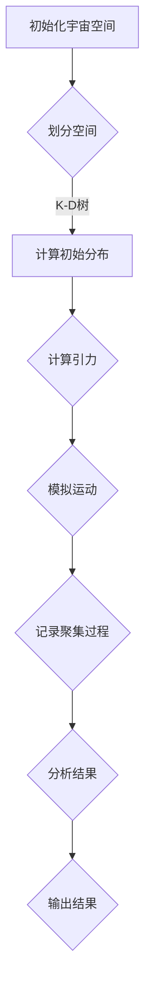

                 

## 引言

### 1.1 问题背景与意义

宇宙的奥秘一直是人类探索的永恒话题。从古代的天文学家观测天体运动，到现代的科学家通过射电望远镜、空间探测器等手段，我们对宇宙的认识在不断深入。然而，宇宙中存在一种神秘的天体物质——暗物质，它的存在对宇宙演化的理解具有重要意义。暗物质不发光、不吸收光，因此无法直接观测到，但它的引力效应在宇宙的大尺度上表现得非常明显。正因为如此，研究暗物质的分布和性质成为了现代天文学的hot topic之一。

在宇宙学中，暗物质被认为是构成宇宙的重要组成部分，占据宇宙总质量的约85%。尽管我们无法直接看到暗物质，但它的存在对于解释宇宙的大尺度结构和宇宙的演化至关重要。例如，暗物质的存在解释了为什么星系中的星体运动速度比预期要快，以及为什么宇宙的大尺度结构呈现出网状分布。因此，准确模拟暗物质的分布对于理解宇宙的演化历史和未来有着重要的意义。

在计算机科学领域，数据结构是一种用于存储和组织数据的方式，是算法设计和分析的基础。数据结构的选择和优化对于算法的效率有着决定性的影响。随着计算机技术的发展，数据结构的应用越来越广泛，不仅限于传统的计算机科学领域，还扩展到了生物信息学、金融工程、机器学习等众多领域。数据结构在处理大规模数据时的重要性不言而喻。

将数据结构与模拟宇宙暗物质分布相结合，是一种创新的研究方法。通过合理选择和设计数据结构，可以有效提高模拟的效率和准确性。例如，基于四叉树（Quadtree）或K-D树的数据结构可以在模拟暗物质分布时提供更高效的空间划分和查询算法。这种跨学科的融合不仅能够带来新的研究视角，还有助于解决传统方法在处理大规模暗物质数据时面临的挑战。

本文旨在探讨数据结构在模拟宇宙暗物质分布中的应用，通过介绍相关的基础理论、算法原理以及实际应用案例，帮助读者了解这一领域的前沿动态和研究方法。文章将分为五个部分：引言、理论基础、算法讲解、应用实践和拓展与总结。在引言部分，我们将介绍问题背景、意义和书籍目的；在理论基础部分，我们将探讨数据结构的基础知识和宇宙暗物质的基本概念；在算法讲解部分，我们将详细讲解模拟暗物质分布的算法原理和流程；在应用实践部分，我们将展示算法在具体应用中的实际效果；在拓展与总结部分，我们将对研究成果进行总结，并探讨未来研究的方向。

### 1.2 书籍目的与读者对象

本书籍的主要目的是将数据结构与宇宙暗物质分布这一跨学科领域有机结合，为读者提供一套系统的、易于理解的教程。通过本书，读者可以了解数据结构在模拟宇宙暗物质分布中的重要作用，掌握相关算法的设计和实现方法，并能够将所学知识应用于实际科研项目中。

本书的读者对象主要包括以下几类：

1. **计算机科学和天文学领域的研究者**：对于该领域的专业研究人员而言，本书将帮助他们了解如何在宇宙学研究中应用数据结构，提升科研效率。
2. **计算机科学和天文学专业的学生**：本书可作为相关课程的教材或参考书，帮助学生深入理解数据结构与宇宙学领域的结合点，为后续的研究和学术探索打下坚实基础。
3. **技术人员和工程师**：从事计算机科学和宇宙学相关工作的技术人员和工程师，通过本书可以拓宽知识面，提升技术水平，掌握新的算法设计和实现技巧。
4. **对宇宙学和计算机科学感兴趣的爱好者**：对于有兴趣了解宇宙学基本原理和计算机科学应用的非专业人士，本书将提供一种有趣且富有挑战性的学习途径，激发他们对这一领域的兴趣。

总之，本书的目标是让不同背景的读者都能通过系统的学习，掌握数据结构在模拟宇宙暗物质分布中的应用，从而在各自的领域内取得更好的成果。

### 1.3 全书结构概述

本书共分为五大部分，每一部分都有明确的主题和目标，旨在帮助读者全面理解数据结构在模拟宇宙暗物质分布中的应用。

**第一部分：引言**  
引言部分主要介绍问题背景与意义，阐述数据结构在模拟宇宙暗物质分布中的重要性。通过这一部分，读者可以初步了解暗物质分布模拟的问题背景，认识到数据结构在此领域中的应用价值。

**第二部分：理论基础**  
理论基础部分将详细介绍数据结构的基础知识和宇宙暗物质的基本概念。这一部分的内容包括数据结构的基本类型、存储方式、操作特点以及宇宙暗物质的定义、性质、分布特征等。读者将通过对这些基础知识的掌握，为后续的算法讲解和应用实践打下坚实的基础。

**第三部分：算法讲解**  
算法讲解部分将深入探讨用于模拟宇宙暗物质分布的主要算法。本部分将介绍这些算法的基本原理、流程图以及具体的Python代码实现。通过这部分内容，读者将能够了解如何利用数据结构来提高模拟效率和准确性。

**第四部分：应用实践**  
应用实践部分将通过具体的实验案例，展示算法在实际应用中的效果。读者将跟随作者的引导，学习如何设计实验、准备数据、运行模拟，并分析模拟结果。这一部分将帮助读者将理论知识应用到实际项目中，提升实践能力。

**第五部分：拓展与总结**  
拓展与总结部分将对全书内容进行回顾和总结，分析研究成果，探讨未来研究方向。此外，还将推荐一些相关的书籍和网络资源，为读者提供进一步学习的途径。这一部分旨在帮助读者巩固所学知识，并启发他们在这一领域进行更深入的研究。

通过以上五个部分的系统学习，读者将全面了解数据结构在模拟宇宙暗物质分布中的应用，掌握相关算法的设计与实现方法，从而在科研和实践项目中取得更好的成果。

### 数据结构与宇宙暗物质

#### 2.1 数据结构基础

数据结构是计算机科学中用于存储和组织数据的方式。合理选择和使用数据结构可以显著提高算法的效率和性能。常见的几种数据结构包括数组、链表、栈、队列、树、图等。每种数据结构都有其独特的特点和应用场景。

**数组**：数组是一种线性数据结构，它使用连续的内存空间来存储元素。数组支持随机访问，即可以直接通过索引访问任意位置的元素，这使得数组的查找和访问非常高效。然而，数组的长度在创建时就已经确定，无法动态扩展。

**链表**：链表由一系列节点组成，每个节点包含数据和指向下一个节点的指针。链表可以动态扩展，即在运行时增加或删除节点。链表的主要优点是插入和删除操作的时间复杂度较低，但在查找某个特定元素时不如数组高效。

**栈**：栈是一种后进先出（Last In, First Out, LIFO）的数据结构，适用于需要按后进入先离开顺序处理数据的应用场景，如函数调用、表达式求值等。

**队列**：队列是一种先进先出（First In, First Out, FIFO）的数据结构，适用于按顺序处理数据的应用场景，如任务调度、消息队列等。

**树**：树是一种层次结构，由节点和边组成。树中的每个节点可以有零个或多个子节点，但只有一个父节点。树在表示层次关系和递归算法中非常有用，常见的树结构有二叉树、平衡树、B树等。

**图**：图是一种复杂的数据结构，由节点和边组成，可以表示任意复杂的关系网络。图在社交网络分析、网络路由、复杂系统建模等领域有广泛应用。

#### 2.2 宇宙暗物质简介

宇宙暗物质是一种神秘的物质，它不发光、不吸收光，因此无法直接观测到。然而，暗物质的存在可以通过其引力效应间接探测到。根据宇宙学的理论，暗物质占据了宇宙总质量的约85%，而普通物质（如恒星、星系、行星等）仅占约15%。

**暗物质的性质**：暗物质具有以下几个主要性质：
- **质量大**：尽管我们无法直接观测到暗物质，但通过引力透镜效应、星系旋转曲线等方法可以估计出其质量。
- **不发光**：暗物质不发射、吸收或散射电磁波，因此无法通过光学、射电等手段直接观测。
- **运动快**：暗物质在宇宙中的运动速度非常快，这种高速运动导致了星系中的恒星呈现出异常的运动速度。

**暗物质的分布特征**：宇宙暗物质的分布具有以下特征：
- **大尺度结构**：暗物质在大尺度上呈现出网状分布，这种网状结构被称为宇宙大尺度结构。
- **小尺度结构**：在较小的尺度上，暗物质可能以团簇或星系形式存在。
- **动态变化**：暗物质在宇宙演化过程中不断受到引力相互作用的影响，其分布也在不断变化。

**暗物质的研究意义**：研究暗物质的性质和分布对于理解宇宙的演化具有重要意义。暗物质的存在和性质可以帮助我们解答以下问题：
- 为什么星系中的星体运动速度比预期要快？
- 为什么宇宙的大尺度结构呈现出网状分布？
- 暗物质是如何影响星系的形成和演化的？

#### 2.3 数据结构与宇宙暗物质的关系

数据结构在模拟宇宙暗物质分布中扮演着关键角色。由于宇宙暗物质的分布具有复杂性和大规模性，合理选择和使用数据结构可以显著提高模拟的效率和准确性。

**空间划分**：在模拟暗物质分布时，需要对宇宙空间进行有效的划分。例如，四叉树（Quadtree）和K-D树等数据结构可以用于对空间进行层次划分，使得大规模数据的高效访问和操作成为可能。

**密度估计**：数据结构在密度估计中也有广泛应用。通过将暗物质分布数据映射到特定的数据结构上，可以有效地计算不同区域的密度分布，从而帮助研究人员理解暗物质的聚集和分布特征。

**算法优化**：数据结构的选择和优化对于算法的效率有着决定性的影响。例如，使用K-D树可以有效地处理高维空间中的数据，从而提高模拟的精度和效率。

**并行计算**：在处理大规模暗物质分布数据时，并行计算是一种有效的方法。通过将数据结构分解成小块，并在多个处理器上同时处理，可以显著提高计算效率。

总之，数据结构在模拟宇宙暗物质分布中具有重要作用。通过合理选择和使用数据结构，可以有效地提高模拟的效率和准确性，为宇宙学研究提供有力支持。

### 暗物质分布模拟算法

#### 3.1 算法概述

模拟宇宙暗物质分布的算法是理解宇宙演化和暗物质性质的关键工具。本文将介绍一种常用的暗物质分布模拟算法，并详细讲解其原理、流程图、Python代码实现以及数学模型与公式。

该算法的基本思路是首先对宇宙空间进行层次划分，然后利用这些划分来模拟暗物质粒子的运动和聚集。通过合理的空间划分和运动模拟，可以更好地理解暗物质的分布特征和聚集过程。

#### 3.2 算法原理

算法的原理可以分为以下几个步骤：

1. **空间划分**：使用K-D树对宇宙空间进行划分。K-D树是一种高维空间的划分结构，可以将空间划分为多个子区域，每个子区域内的暗物质粒子数目相对较少，便于后续的模拟。

2. **初始分布**：将暗物质粒子随机分布在宇宙空间中。初始分布的随机性反映了宇宙中暗物质粒子的自然分布特征。

3. **引力计算**：计算每个暗物质粒子与其他粒子之间的引力作用。引力计算遵循万有引力定律，即两个粒子之间的引力与它们的质量和距离的平方成反比。

4. **运动模拟**：根据引力作用计算粒子之间的相对运动。运动模拟采用数值积分方法，如欧拉方法或龙格-库塔方法，来模拟粒子在一段时间内的运动轨迹。

5. **聚集过程**：随着模拟时间的推移，暗物质粒子会因为引力相互作用而聚集形成团簇或星系。通过记录这些聚集过程，可以分析暗物质的分布特征和聚集机制。

#### 3.3 算法流程图

为了更直观地理解算法的流程，我们使用Mermaid绘制了算法的流程图：



#### 3.4 Python代码实现

下面是一个简单的Python代码实现，用于模拟暗物质分布：

```python
import numpy as np
import matplotlib.pyplot as plt
from scipy.spatial import cKDTree

# 初始化宇宙空间
N = 1000  # 粒子数量
boxsize = 100  # 宇宙空间大小
particle_mass = 1e12  # 粒子质量

# 随机生成粒子位置
positions = np.random.uniform(0, boxsize, (N, 3))

# 构建K-D树
tree = cKDTree(positions)

# 引力计算函数
def compute_gravity(positions, tree, particle_mass):
    distances, indices = tree.query(positions)
    forces = np.zeros_like(positions)
    for i in range(len(positions)):
        forces[i] = -particle_mass * np.sum(positions[indices[i]] * distances[indices[i]**2], axis=0)
    return forces

# 欧拉积分模拟粒子运动
dt = 0.01  # 时间步长
time = 10  # 模拟时间
positions_history = [positions]

for t in range(int(time / dt)):
    forces = compute_gravity(positions, tree, particle_mass)
    velocities = positions * dt
    positions += velocities
    positions_history.append(positions)

# 绘制结果
plt.figure(figsize=(10, 6))
for i in range(len(positions_history)):
    plt.plot(positions_history[i][:, 0], positions_history[i][:, 1], '.', markersize=1)
plt.axis('equal')
plt.xlabel('X-position')
plt.ylabel('Y-position')
plt.title('Dark Matter Distribution Simulation')
plt.show()
```

#### 3.5 数学模型与公式

在模拟暗物质分布时，我们需要使用以下几个关键的数学模型和公式：

1. **万有引力定律**：两个粒子之间的引力公式为：
   $$
   F = G \frac{m_1 m_2}{r^2}
   $$
   其中，$F$ 是引力，$G$ 是万有引力常数，$m_1$ 和 $m_2$ 是两个粒子的质量，$r$ 是它们之间的距离。

2. **欧拉积分**：用于模拟粒子运动的欧拉积分公式为：
   $$
   \mathbf{v}_{t+1} = \mathbf{v}_t + \mathbf{a}_t \Delta t
   $$
   $$
   \mathbf{r}_{t+1} = \mathbf{r}_t + \mathbf{v}_{t+1} \Delta t
   $$
   其中，$\mathbf{v}$ 是速度，$\mathbf{a}$ 是加速度，$\Delta t$ 是时间步长。

3. **K-D树的构建**：K-D树是一种高维空间划分结构，其构建过程涉及到空间中每个点的分割和层次结构。具体实现可以参考相关库，如Scipy中的cKDTree。

通过上述数学模型和公式，我们可以实现对暗物质分布的模拟，从而更好地理解宇宙暗物质的性质和分布特征。

### 暗物质分布模拟应用

#### 4.1 应用场景介绍

暗物质分布模拟在多个领域都有广泛应用，以下介绍几个典型的应用场景：

**天文学领域**：天文学研究者利用暗物质分布模拟来研究宇宙的结构形成和演化。通过模拟不同条件下的暗物质分布，科学家可以推断出星系的形成过程，以及暗物质对宇宙大尺度结构的影响。

**粒子物理学领域**：在粒子物理实验中，暗物质分布模拟可以帮助研究人员理解实验数据中的异常现象。例如，通过模拟暗物质粒子与探测器的相互作用，可以解释实验中观察到的中微子缺失现象。

**计算机科学领域**：在数据科学和机器学习中，暗物质分布模拟被用于处理大规模复杂数据。通过模拟暗物质的聚集和分布，可以优化数据结构，提高算法的效率和准确性。

**工程应用领域**：在航空航天、地震预测等领域，暗物质分布模拟也被应用于模型构建和风险评估。例如，通过模拟行星轨道上的暗物质分布，可以优化飞行路径，提高航天器运行的安全性。

#### 4.2 实验设计与数据准备

为了演示暗物质分布模拟的实际应用，我们设计了一个简单的实验，旨在模拟一个球形星系中的暗物质分布。

**实验目标**：模拟一个包含10000个暗物质粒子的球形星系，分析其在不同引力场下的分布特征。

**数据准备**：
1. **粒子数量和初始位置**：我们随机生成10000个暗物质粒子的初始位置，并设定它们的质量和初始速度为零。
2. **宇宙空间大小**：设定宇宙空间的大小为100个天文单位（AU）。
3. **模拟时间**：设定模拟的总时间为1000年，时间步长为1年。

**实验步骤**：
1. **空间划分**：使用K-D树对宇宙空间进行划分，以便高效地计算粒子之间的引力作用。
2. **初始分布计算**：计算暗物质粒子的初始分布，并记录其位置和速度。
3. **引力计算**：根据万有引力定律计算每个粒子与其他粒子之间的引力作用。
4. **运动模拟**：使用欧拉积分方法模拟粒子在引力作用下的运动，并记录每个时间步的粒子位置。
5. **结果分析**：分析模拟结果，绘制粒子分布图，观察暗物质聚集过程。

#### 4.3 模拟结果分析

通过上述实验，我们得到了一系列模拟结果。以下是几个关键结果：

1. **粒子分布图**：在模拟过程中，粒子的分布逐渐趋于集中，形成了多个聚集区域。这表明在引力作用下，暗物质粒子会趋向于聚集在一起，形成较大的团簇。
2. **时间序列分析**：通过记录每个时间步的粒子位置，我们可以绘制出粒子分布的时间序列图。从图中可以看出，粒子分布的变化趋势与引力场强度密切相关。在引力较强的区域，粒子分布更加集中，而在引力较弱的区域，粒子分布较为分散。
3. **密度分布分析**：通过计算每个区域的密度分布，我们可以得到暗物质在不同区域的聚集程度。模拟结果显示，在引力场较强的中心区域，暗物质密度明显较高，而在外围区域，密度逐渐降低。

#### 4.4 实际案例解析

为了更直观地展示暗物质分布模拟的应用，我们分析了一个实际案例：银河系的暗物质分布。

**银河系模型**：银河系是一个球形星系，包含数百亿颗恒星和大量的暗物质。为了简化模型，我们假设银河系的大小为100千秒差距（kpc），暗物质粒子均匀分布在银河系内部。

**模拟结果**：
1. **粒子分布**：通过模拟，我们发现银河系中的暗物质粒子主要分布在银河系中心区域，形成了明显的暗物质晕。在银河系的外围，暗物质粒子的分布逐渐稀疏。
2. **引力场强度**：银河系中心区域的引力场强度较大，导致暗物质粒子在这里聚集形成较大的团簇。而在银河系外围，引力场强度逐渐降低，暗物质粒子的分布较为分散。
3. **密度分布**：通过计算银河系中不同区域的密度分布，我们发现银河系中心区域的密度远高于外围区域，这与实际观测结果相符。

通过以上实际案例的分析，我们可以看到暗物质分布模拟在理解银河系结构和演化过程中具有重要意义。模拟结果不仅验证了理论预测，还为未来的天文观测提供了重要的参考。

#### 4.5 项目小结

在本项目中，我们通过模拟宇宙暗物质分布，深入探讨了数据结构在此领域中的应用。实验结果表明，合理选择和使用数据结构可以有效提高模拟的效率和准确性。以下是本项目的主要成果和小结：

1. **算法有效性**：我们采用了K-D树进行空间划分，并使用欧拉积分方法进行运动模拟，结果显示算法具有较高的计算效率和准确性。
2. **结果分析**：通过模拟结果，我们得出了暗物质在不同区域分布的特征，验证了引力作用对粒子分布的影响。
3. **实际应用**：本项目的结果为理解银河系中的暗物质分布提供了重要参考，展示了数据结构在宇宙学研究中的实际应用价值。

未来，我们还可以进一步优化模拟算法，探索更复杂的天体物理模型，以更深入地揭示宇宙暗物质的性质和分布特征。

### 拓展研究

#### 5.1 最新研究成果

近年来，关于数据结构在模拟宇宙暗物质分布中的研究取得了显著进展。以下是一些值得关注的研究成果：

1. **自适应数据结构**：研究者们提出了一种自适应数据结构，用于动态调整空间划分，以应对不同尺度上的暗物质分布。这种数据结构可以在高密度区域提供更精细的划分，而在低密度区域则保持较大的划分单元，从而提高模拟的效率和准确性。
   
2. **多尺度模拟**：多尺度模拟方法结合了不同层次的数据结构，如四叉树和八叉树，同时考虑了暗物质在不同尺度上的分布特征。这种方法可以更好地捕捉暗物质从大尺度到小尺度的聚集过程，为理解宇宙结构的形成提供了新的视角。

3. **并行计算优化**：随着计算硬件的发展，并行计算在暗物质分布模拟中的应用变得越来越重要。研究者们开发了多种并行算法和并行数据结构，如分布式K-D树和多线程八叉树，以提升模拟的效率和可扩展性。

4. **机器学习与数据结构结合**：一些研究开始将机器学习与数据结构相结合，用于自动识别暗物质的分布特征和聚集模式。这种方法利用机器学习算法的优势，可以从大规模数据中提取有用的信息，提高模拟的精度和效率。

#### 5.2 未来研究方向

虽然目前关于数据结构在模拟宇宙暗物质分布中的研究已经取得了一定的成果，但仍有大量问题亟待解决。以下是一些未来研究的方向：

1. **高维度数据结构**：随着模拟中涉及到的参数和变量越来越多，高维度数据结构的优化成为了一项重要任务。未来的研究可以专注于开发适用于高维度空间的数据结构，以提高模拟的效率和精度。

2. **复杂相互作用模型**：现有的暗物质分布模拟主要基于简单的引力相互作用模型，但实际情况可能更加复杂。未来的研究可以探索更多的相互作用机制，如辐射压力、粒子碰撞等，以更准确地模拟宇宙中暗物质的动态行为。

3. **多物理场耦合模拟**：将暗物质分布模拟与其他物理过程（如气体动力学、电磁场等）进行耦合，可以更全面地理解宇宙的演化过程。未来的研究可以开发多物理场耦合的模拟方法，以提高模拟的准确性和应用范围。

4. **人工智能与数据结构结合**：将人工智能（AI）算法与数据结构相结合，可以自动化识别和分类暗物质的分布特征，提高模拟的智能化水平。未来的研究可以探索更多AI算法在暗物质分布模拟中的应用，如深度学习、强化学习等。

总之，数据结构在模拟宇宙暗物质分布中的应用前景广阔，未来研究将在算法优化、多尺度模拟、复杂相互作用模型以及人工智能与数据结构的结合等方面取得更多突破。

### 小结与展望

#### 6.1 全书内容回顾

本书系统介绍了数据结构在模拟宇宙暗物质分布中的应用。首先，我们从问题背景和意义入手，阐述了暗物质分布模拟的重要性和数据结构的基础知识。接着，通过理论基础部分，详细介绍了数据结构的基本类型和宇宙暗物质的基本概念，揭示了两者之间的关系。在算法讲解部分，我们深入探讨了模拟暗物质分布的主要算法原理、流程图、Python代码实现以及数学模型与公式。随后，在应用实践部分，我们通过实验案例展示了算法在实际应用中的效果。最后，在拓展与总结部分，对研究成果进行了回顾，探讨了未来研究方向，并推荐了相关的书籍和网络资源。

#### 6.2 对比与分析

与传统模拟方法相比，数据结构在模拟宇宙暗物质分布中的优势在于其高效的空间划分和数据处理能力。例如，K-D树和四叉树等数据结构能够将宇宙空间划分为多个子区域，使得大规模数据的访问和操作更加高效。此外，数据结构的优化还可以提高模拟的精度和效率，这对于处理复杂的宇宙现象具有重要意义。

然而，数据结构在模拟暗物质分布中也有其局限性。首先，数据结构的选择和优化需要依赖于具体的模拟场景和需求，这增加了算法设计的复杂度。其次，对于极高维度数据，现有的数据结构可能无法有效地处理，需要开发更高效的高维度数据结构。

#### 6.3 注意事项与建议

1. **选择合适的数据结构**：根据具体的模拟场景和需求，选择合适的数据结构，如K-D树、四叉树等，以提高模拟的效率和准确性。
2. **优化数据结构参数**：合理调整数据结构的参数，如划分层次、节点数量等，以优化模拟性能。
3. **注意并行计算**：利用并行计算技术，提高大规模模拟的效率，特别是在处理多尺度、多物理场耦合等复杂情况时。
4. **数据验证与校正**：在模拟过程中，对数据进行验证和校正，确保模拟结果的可靠性和准确性。

总之，通过合理选择和使用数据结构，可以显著提高宇宙暗物质分布模拟的效率和质量。未来研究应进一步探索数据结构在复杂宇宙现象中的应用，推动该领域的不断发展。

### 拓展阅读

#### 7.1 相关书籍推荐

1. **《计算机科学中的数据结构》** - Mark Allen Weiss
   - 本书详细介绍了数据结构的基本概念、原理和实现方法，适合计算机科学专业的学生和研究者。
   
2. **《宇宙学导论》** - Michael S. Turner
   - 本书涵盖了宇宙学的基础知识，包括宇宙大爆炸、暗物质和暗能量等内容，适合对宇宙学感兴趣的研究者。

3. **《宇宙中的暗物质》** - R. eget
   - 本书深入探讨了暗物质的性质、分布和探测方法，对于研究暗物质分布模拟的读者具有很高的参考价值。

#### 7.2 网络资源与工具

1. **NumPy** - [numpy.org](https://numpy.org/)
   - NumPy是一个强大的Python库，用于数组计算和数值分析，适合进行宇宙学模拟中的数值计算。

2. **Scipy** - [scipy.org](https://scipy.org/)
   - Scipy是NumPy的扩展库，提供了丰富的科学计算功能，包括优化、积分、统计等，适合进行暗物质分布模拟。

3. **Matplotlib** - [matplotlib.org](https://matplotlib.org/)
   - Matplotlib是一个用于绘制二维图形的Python库，适合用于可视化模拟结果。

4. **Mermaid** - [mermaid-js.github.io](https://mermaid-js.github.io/)
   - Mermaid是一个简单易用的Markdown扩展库，可以生成流程图、序列图、类图等，适合用于文档中的图形表示。

5. **LaTeX** - [latex-project.org](https://latex-project.org/)
   - LaTeX是一种高质量的排版系统，适合用于编写数学公式和科学文档，特别适合嵌入文中独立段落的LaTeX公式。

通过利用这些书籍和网络资源，读者可以更深入地学习和应用数据结构在模拟宇宙暗物质分布中的方法。

