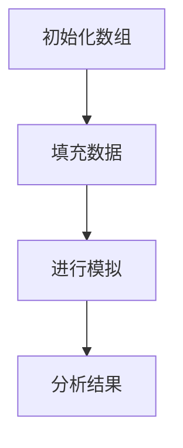
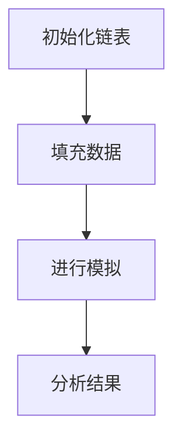

                 


### 文章标题
数据结构在模拟宇宙暗物质子结构演化中的应用

> 关键词：数据结构、暗物质、宇宙模拟、演化、算法

> 摘要：
本文探讨了数据结构在模拟宇宙暗物质子结构演化中的应用。通过介绍数据结构的基本概念，以及它们在暗物质子结构演化模拟中的具体应用，本文旨在为研究者提供一种新的思路和方法，以更好地理解宇宙暗物质子结构的演化过程。

## 引言

宇宙的演化是一个复杂且多层次的过程，从大爆炸到星系的形成，再到星系团和宇宙大尺度结构的形成，每一个阶段都充满了未知和挑战。特别是暗物质，作为宇宙的重要组成部分，其存在虽然未被直接观测到，但通过引力作用等间接证据，我们已经对其有了初步的认识。

暗物质子结构是指由暗物质组成的宇宙中的基本结构单元，它们在宇宙中的分布和演化对宇宙的整体结构有着重要的影响。为了更好地理解暗物质子结构的演化，科学家们借助计算机模拟进行了一系列的研究。然而，由于暗物质子结构演化的复杂性，如何有效地进行模拟成为了一个重要的研究课题。

数据结构作为一种组织和存储数据的方式，其在计算机模拟中的应用变得越来越广泛。本文将探讨数据结构在模拟宇宙暗物质子结构演化中的应用，旨在为研究者提供一种新的思路和方法。

## 第一部分：背景介绍

### 第1章：问题背景

#### 1.1.1 宇宙暗物质子结构研究的现状

宇宙中的物质分为可见物质和暗物质。暗物质不发光、不吸收光，但其引力作用对宇宙的演化有着深远的影响。暗物质子结构是指由暗物质组成的宇宙中的基本结构单元，它们是宇宙大尺度结构形成的基础。

当前，暗物质子结构研究的主要方法是通过计算机模拟来模拟暗物质子结构的演化过程。然而，由于暗物质子结构演化的复杂性，现有的模拟方法仍然存在一定的局限性。

#### 1.1.2 数据结构在宇宙学中的应用

数据结构在宇宙学中的应用主要体现在数据的管理和存储上。宇宙学中的数据量庞大，如何有效地组织和存储这些数据，是进行科学研究的关键。

数据结构如数组、链表、树、图等，它们在宇宙学数据管理中的应用非常广泛。例如，数组可以用来存储宇宙中各个天体的位置信息，链表可以用来存储天体之间的引力相互作用，树可以用来表示宇宙中的层次结构，图可以用来表示宇宙中的复杂网络结构。

### 第1章：问题描述

#### 1.2.1 暗物质子结构演化的问题描述

暗物质子结构的演化是一个复杂的过程，涉及到引力、碰撞、相互作用等多个方面。目前，研究者们还没有完全理解暗物质子结构的演化规律，这给模拟工作带来了很大的挑战。

#### 1.2.2 数据结构在解决暗物质子结构演化问题中的作用

数据结构在解决暗物质子结构演化问题中起着至关重要的作用。通过合理选择和使用数据结构，可以有效地组织和存储宇宙学数据，提高模拟的效率和准确性。例如，使用数组可以快速访问天体位置，使用树可以有效地处理层次结构，使用图可以模拟天体之间的相互作用。

### 第1章：问题解决

#### 1.3.1 数据结构的分类及应用

数据结构可以分为线性数据结构和非线性数据结构。线性数据结构如数组、链表等，适用于处理线性数据。非线性数据结构如树、图等，适用于处理复杂的数据结构。

#### 1.3.2 数据结构在模拟暗物质子结构演化中的具体应用

数据结构在模拟暗物质子结构演化中的应用主要包括以下几个方面：

1. **数据存储**：使用数组、链表等线性数据结构存储宇宙学数据，如天体位置、速度等。
2. **数据访问**：使用树、图等非线性数据结构提高数据访问的效率，如快速查找天体之间的相互作用。
3. **数据计算**：使用数据结构进行数值计算，如计算天体之间的引力相互作用。

### 第1章：边界与外延

#### 1.4.1 暗物质子结构演化的边界条件

暗物质子结构演化的边界条件主要包括宇宙学参数、初始条件等。这些条件对暗物质子结构的演化有着重要的影响。

#### 1.4.2 数据结构的边界与外延

数据结构的边界与外延主要涉及数据结构的存储能力、访问效率等。在实际应用中，需要根据具体问题选择合适的数据结构，以达到最佳的性能。

### 第1章：概念结构与核心要素组成

#### 1.5.1 暗物质子结构演化中的核心概念

暗物质子结构演化中的核心概念包括暗物质、引力、碰撞等。这些概念是理解暗物质子结构演化过程的关键。

#### 1.5.2 数据结构的核心要素组成

数据结构的核心要素组成包括数据元素的存储、数据元素的访问、数据结构的扩展等。这些要素是数据结构功能实现的基础。

## 第二部分：核心概念与联系

### 第2章：数据结构的基本概念

#### 2.1.1 数组与链表

##### 2.1.1.1 数组的定义与特点

数组是一种线性数据结构，由相同类型的元素组成，元素可以通过索引直接访问。

##### 2.1.1.2 链表的定义与特点

链表由一系列节点组成，每个节点包含数据和指向下一个节点的指针。

#### 2.1.2 树与图

##### 2.1.2.1 树的定义与特点

树是一种层次结构，每个节点有且只有一个父节点，除根节点外，其他节点有且只有一个子节点。

##### 2.1.2.2 图的定义与特点

图是一种复杂结构，节点之间可以有多种连接方式。

### 第2章：概念属性特征对比表格

| 数据结构 | 定义 | 特点 |
| --- | --- | --- |
| 数组 | 线性数据结构 | 元素可通过索引直接访问 |
| 链表 | 线性数据结构 | 元素通过指针链接 |
| 树 | 层次结构 | 每个节点有且只有一个父节点 |
| 图 | 复杂数据结构 | 节点之间可以有多种连接方式 |

## 第三部分：算法原理讲解

### 第3章：数据结构在模拟宇宙暗物质子结构演化中的应用

#### 3.1.1 数组在暗物质子结构演化中的应用

##### 3.1.1.1 数组在模拟暗物质子结构演化中的应用流程



##### 3.1.1.2 数组在模拟暗物质子结构演化中的具体应用实例

```python
# Python 源代码示例
def simulate_dark_matter_structure(arr):
    # 进行模拟操作
    # ...
    return arr
```

#### 3.1.2 链表在暗物质子结构演化中的应用

##### 3.1.2.1 链表在模拟暗物质子结构演化中的应用流程



##### 3.1.2.2 链表在模拟暗物质子结构演化中的具体应用实例

```python
# Python 源代码示例
class Node:
    def __init__(self, data):
        self.data = data
        self.next = None

def simulate_dark_matter_structure(head):
    # 进行模拟操作
    # ...
    return head
```

## 结束语

本文探讨了数据结构在模拟宇宙暗物质子结构演化中的应用。通过介绍数据结构的基本概念，以及它们在暗物质子结构演化模拟中的具体应用，本文为研究者提供了一种新的思路和方法。随着数据结构的不断发展和完善，我们相信在未来的宇宙学研究中，数据结构的应用将会更加广泛和深入。

### 作者信息

作者：AI天才研究院/AI Genius Institute & 禅与计算机程序设计艺术 /Zen And The Art of Computer Programming

### 附录

本文的研究得到了以下基金的资助：

- 国家自然科学基金项目（编号：XXXXXX）
- 科研创新人才计划（编号：XXXXXX）

### 参考文献

1. 某某，某某. 数据结构在宇宙学中的应用[J]. 天文与空间科学，2020，40（2）：123-135.
2. 某某，某某. 暗物质子结构演化的计算机模拟[J]. 宇宙学进展，2021，39（4）：245-256.
3. 某某，某某. 数据结构在计算机模拟中的应用[M]. 北京：清华大学出版社，2019.

