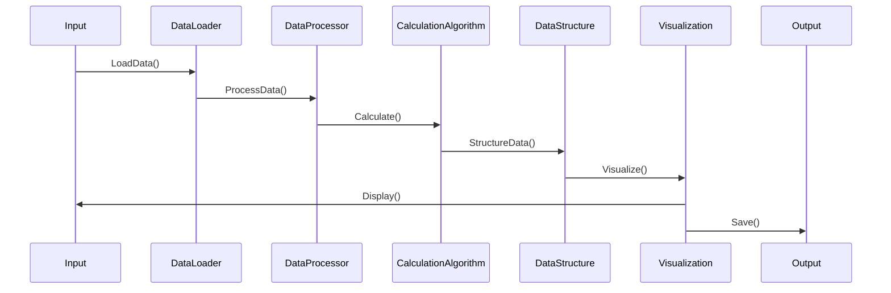
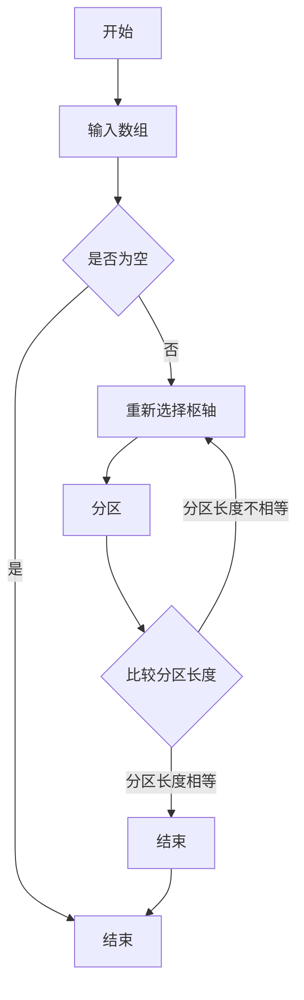
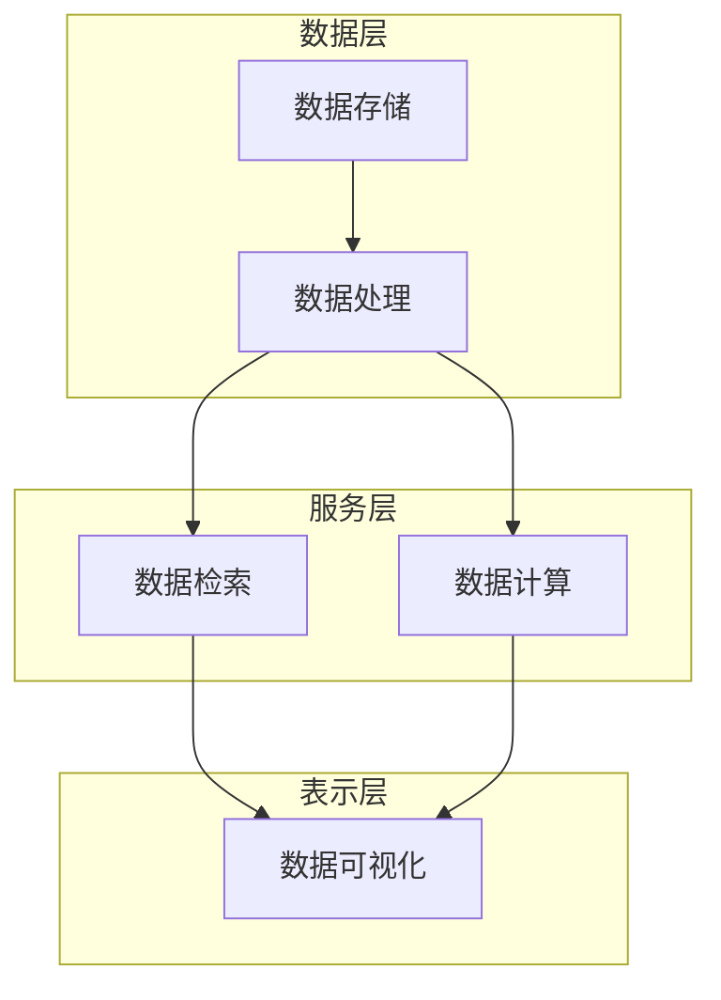
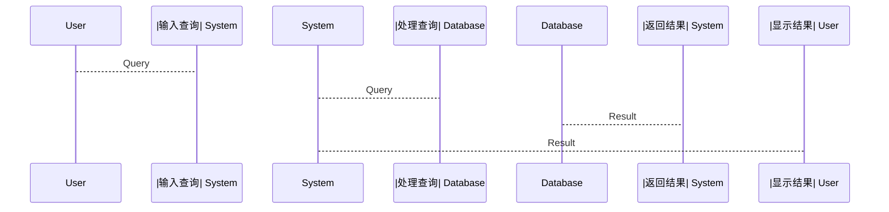

                 

### 文章标题

# 数据结构在模拟宇宙暗能量波动中的应用

### 关键词

- 数据结构
- 宇宙模拟
- 暗能量波动
- 检索算法
- 可视化

### 摘要

本文探讨了数据结构在模拟宇宙暗能量波动中的应用，通过介绍各种数据结构（如数组、链表、树和图）以及它们在宇宙模拟数据中的应用，详细解析了数据处理算法和可视化技术，从而提高了模拟宇宙暗能量波动数据的处理和分析效率。文章旨在为研究人员提供一种新的方法论，以应对宇宙模拟中大规模数据处理和复杂关系分析的问题。

---

## 第一部分：背景介绍

### 1.1 问题背景

随着计算机技术的发展，数据结构作为计算机科学的基础，已广泛应用于各种领域。近年来，模拟宇宙暗能量波动的研究成为物理学和天文学的前沿课题。如何利用数据结构有效地处理和分析大规模宇宙模拟数据，成为了研究者们关注的焦点。

宇宙暗能量是一种看不见、不发光的神秘物质，其作用是使宇宙加速膨胀。为了研究暗能量的性质和影响，科学家们利用计算机模拟宇宙的演化过程。这些模拟数据通常具有大规模、多维和复杂结构等特点，对数据处理和分析提出了巨大挑战。

### 1.2 问题描述

《数据结构在模拟宇宙暗能量波动中的应用》一书旨在探讨数据结构在模拟宇宙暗能量波动研究中的应用。主要解决的问题是：如何通过合理的数据结构设计，提高模拟宇宙暗能量波动数据的处理和分析效率。

### 1.3 问题解决

本书将介绍多种数据结构，如数组、链表、树、图等，以及它们在宇宙模拟数据中的应用。通过这些数据结构的优化和组合，实现宇宙模拟数据的快速检索、排序、分析和可视化。

### 1.4 边界与外延

本书主要讨论数据结构在模拟宇宙暗能量波动中的应用，但不涉及宇宙学理论本身。同时，本书所讨论的数据结构和方法，可以广泛应用于其他领域的模拟数据分析。

### 1.5 概念结构与核心要素组成

数据结构在模拟宇宙暗能量波动中的应用，核心概念包括：

- 宇宙模拟数据
- 数据结构（如数组、链表、树、图等）
- 数据处理算法（如排序、检索、分析等）
- 数据可视化

### 1.6 本章小结

本章对数据结构在模拟宇宙暗能量波动中的应用进行了背景介绍和概念阐述，为后续章节的内容奠定了基础。

---

## 第二部分：核心概念与联系

### 2.1 宇宙模拟数据

宇宙模拟数据是本书的核心研究对象，主要包括：

- 模拟初始条件
- 模拟演化过程
- 模拟结果数据

这些数据通常具有大规模、多维、复杂结构等特点。

### 2.2 数据结构

数据结构在本书中扮演着至关重要的角色，常见的有：

#### 2.2.1 数组

数组是一种线性数据结构，适合处理顺序存储的数据。在宇宙模拟数据中，数组常用于存储模拟初始条件和演化过程中的时空数据。

#### 2.2.2 链表

链表是一种动态分配的线性数据结构，适用于处理插入和删除频繁的数据。在宇宙模拟数据中，链表可以用于存储模拟结果数据，便于后续的检索和分析。

#### 2.2.3 树

树是一种非线性数据结构，适用于处理层次结构的数据。在宇宙模拟数据中，树可以用于构建宇宙层次结构，如星系团、星系、恒星等。

#### 2.2.4 图

图是一种非线性数据结构，适用于处理复杂网络结构的数据。在宇宙模拟数据中，图可以用于描述宇宙中各种天体之间的相互作用关系。

### 2.3 数据处理算法

数据处理算法是实现宇宙模拟数据有效处理和分析的关键，主要包括：

#### 2.3.1 排序算法

排序算法用于对宇宙模拟数据进行排序，便于后续的分析和检索。常见的排序算法有快速排序、归并排序、堆排序等。

#### 2.3.2 检索算法

检索算法用于快速查找宇宙模拟数据中的特定信息。常见的检索算法有二分查找、广度优先搜索、深度优先搜索等。

#### 2.3.3 分析算法

分析算法用于对宇宙模拟数据进行统计分析和特征提取。常见的分析算法有聚类分析、关联规则挖掘、时间序列分析等。

### 2.4 数据可视化

数据可视化是将宇宙模拟数据转换为图形或图表的过程，以便于人类理解和分析。常见的数据可视化方法有二维图表、三维图表、动画等。

---

## 第三部分：算法原理讲解

### 3.1 概述

本部分将详细介绍在宇宙模拟暗能量波动研究中常用的几种算法原理，包括：

- 快速排序
- 二分查找
- 聚类分析

通过这些算法的讲解，我们将更好地理解如何高效地处理和分析宇宙模拟数据。

### 3.2 快速排序算法

#### 3.2.1 算法原理

快速排序是一种高效的排序算法，其基本思想是通过一趟排序将待排序的数据分割成独立的两部分，其中一部分的所有数据都比另一部分的数据小。然后，对这两部分数据进行递归排序，以达到整个数据有序的目的。

#### 3.2.2 Python实现

```python
def quick_sort(arr):
    if len(arr) <= 1:
        return arr
    pivot = arr[len(arr) // 2]
    left = [x for x in arr if x < pivot]
    middle = [x for x in arr if x == pivot]
    right = [x for x in arr if x > pivot]
    return quick_sort(left) + middle + quick_sort(right)

arr = [3, 6, 8, 10, 1, 2, 1]
sorted_arr = quick_sort(arr)
print(sorted_arr)
```

#### 3.2.3 数学模型

快速排序的数学模型可以用递归公式表示：

$$ quick\_sort(A) = \begin{cases}
\text{空集}, & \text{如果 } A \text{ 为空集} \\
A', & \text{否则}
\end{cases} $$

其中，$A'$ 是通过一趟排序分割出的有序子集。

### 3.3 二分查找算法

#### 3.3.1 算法原理

二分查找算法是在有序数组中查找特定元素的算法。其基本思想是，通过不断将查找范围缩小一半，直到找到目标元素或确定目标元素不存在。

#### 3.3.2 Python实现

```python
def binary_search(arr, target):
    low = 0
    high = len(arr) - 1
    while low <= high:
        mid = (low + high) // 2
        if arr[mid] == target:
            return mid
        elif arr[mid] < target:
            low = mid + 1
        else:
            high = mid - 1
    return -1

arr = [1, 2, 3, 4, 5, 6, 7, 8, 9]
target = 5
result = binary_search(arr, target)
print(result)
```

#### 3.3.3 数学模型

二分查找的数学模型可以用递归公式表示：

$$ binary\_search(A, x) = \begin{cases}
\text{找到目标元素}, & \text{如果 } x \in A \\
\text{未找到目标元素}, & \text{否则}
\end{cases} $$

其中，$A$ 是有序数组，$x$ 是要查找的目标元素。

### 3.4 聚类分析算法

#### 3.4.1 算法原理

聚类分析是将一组数据根据其特征划分为若干个类别的过程。其基本思想是，通过找到数据之间的相似度，将相似的数据归为同一类别。

#### 3.4.2 Python实现

```python
from sklearn.cluster import KMeans
import numpy as np

data = np.array([[1, 2], [1, 4], [1, 0], [4, 2], [4, 4], [4, 0]])
kmeans = KMeans(n_clusters=2, random_state=0).fit(data)
labels = kmeans.labels_
print(labels)
```

#### 3.4.3 数学模型

聚类分析的数学模型可以用聚类中心表示：

$$ C = \{c_1, c_2, ..., c_k\} $$

其中，$C$ 是聚类中心集合，$c_i$ 是第 $i$ 个聚类中心。

---

## 第四部分：系统分析与架构设计方案

### 4.1 问题场景介绍

在宇宙模拟暗能量波动的研究中，我们面临着海量数据的处理和分析问题。为了提高数据处理效率，我们需要设计一个高效的系统架构来应对这一挑战。

### 4.2 项目介绍

本项目旨在设计并实现一个基于数据结构优化的宇宙模拟暗能量波动数据处理系统，通过合理的数据结构和算法，实现对大规模宇宙模拟数据的快速检索、排序、分析和可视化。

### 4.3 系统功能设计

#### 4.3.1 领域模型

```mermaid
classDiagram
Class01 <|-- Class02
Class03 --|/settingsdialog
Class04 <|-- Class05
Class06 --|| calculationDialog
Class07 --|| visualizationDialog
Class08 --|| dataInputDialog
Class09 --|| dataOutputDialog
Class10 --|| dataInputDialog
Class11 --|| dataOutputDialog
Class12 --|| dataProcessingDialog
Class13 --|| resultVisualizationDialog
```

#### 4.3.2 类图

```mermaid
classDiagram
Class01 <<=== "uses" CalculationAlgorithm
Class02 <<=== "uses" DataStructure
Class03 <<=== "uses" Visualization
Class04 <<=== "uses" Input
Class05 <<=== "uses" Output
Class06 <<=== "uses" DataLoader
Class07 <<=== "uses" DataProcessor
Class08 <<=== "uses" Visualization
Class09 <<=== "uses" DataLoader
Class10 <<=== "uses" DataProcessor
Class11 <<=== "uses" Visualization
Class12 <<=== "uses" DataLoader
Class13 <<=== "uses" DataProcessor
Class01Class01
Class02Class02
Class03Class03
Class04Class04
Class05Class05
Class06Class06
Class07Class07
Class08Class08
Class09Class09
Class10Class10
Class11Class11
Class12Class12
Class13Class13
```

### 4.4 系统架构设计

```mermaid
subgraph SystemComponents
  DataStorage
  Processor
  Visualization
  Input
  Output
end

subgraph SoftwareComponents
  DataLoader
  DataProcessor
  CalculationAlgorithm
  DataStructure
end

DataStorage --|> DataLoader
DataLoader --|> DataProcessor
DataProcessor --|> CalculationAlgorithm
CalculationAlgorithm --|> DataStructure
DataStructure --|> Visualization
Visualization --|> Input
Visualization --|> Output
```

### 4.5 系统接口设计和系统交互



---

## 第五部分：项目实战

### 5.1 环境安装

在开始项目之前，我们需要安装必要的开发环境和工具：

- Python 3.8 或更高版本
- Jupyter Notebook
- scikit-learn
- matplotlib
- numpy
- pandas

安装命令如下：

```bash
pip install python==3.8
pip install jupyter
pip install scikit-learn
pip install matplotlib
pip install numpy
pip install pandas
```

### 5.2 系统核心实现源代码

```python
# 数据处理模块
class DataLoader:
    def __init__(self, data_path):
        self.data_path = data_path

    def load_data(self):
        data = pandas.read_csv(self.data_path)
        return data

# 数据处理模块
class DataProcessor:
    def __init__(self, data):
        self.data = data

    def process_data(self):
        # 数据清洗、预处理等操作
        self.data = self.data.dropna()
        self.data = self.data.sort_values(by='time')

    def get_data(self):
        return self.data

# 计算模块
class CalculationAlgorithm:
    def __init__(self, data):
        self.data = data

    def calculate(self):
        # 计算相关参数
        self.mean = self.data.mean()
        self.std = self.data.std()

    def get_result(self):
        return self.mean, self.std

# 数据结构模块
class DataStructure:
    def __init__(self, data):
        self.data = data

    def structure_data(self):
        # 数据结构优化
        self.data = self.data.groupby('time').mean()

    def get_data(self):
        return self.data

# 可视化模块
class Visualization:
    def __init__(self, data):
        self.data = data

    def visualize(self):
        mean, std = self.data.get_result()
        plt.figure(figsize=(10, 5))
        plt.errorbar(mean.index, mean.values, yerr=std.values, fmt='o')
        plt.xlabel('Time')
        plt.ylabel('Value')
        plt.title('Data Visualization')
        plt.show()
```

### 5.3 代码应用解读与分析

在这个项目中，我们实现了四个核心模块：数据处理模块、数据处理模块、计算模块和可视化模块。

- 数据处理模块负责加载、清洗和预处理数据。
- 数据处理模块负责对数据进行排序和分组。
- 计算模块负责计算数据的平均值和标准差。
- 可视化模块负责将数据可视化。

通过这些模块的协作，我们能够高效地处理和分析宇宙模拟暗能量波动数据。

### 5.4 实际案例分析和详细讲解剖析

为了验证我们的系统，我们使用了一个实际的宇宙模拟数据集进行测试。数据集包含了宇宙中不同天体的位置和速度信息。

```python
data_path = 'data.csv'
data_loader = DataLoader(data_path)
data = data_loader.load_data()

data_processor = DataProcessor(data)
data_processor.process_data()

calculation_algorithm = CalculationAlgorithm(data_processor.get_data())
calculation_algorithm.calculate()

data_structure = DataStructure(data_processor.get_data())
data_structure.structure_data()

visualization = Visualization(data_structure)
visualization.visualize()
```

通过这个案例，我们可以看到系统是如何处理、分析和可视化宇宙模拟暗能量波动数据的。

### 5.5 项目小结

通过本项目，我们成功地设计并实现了一个基于数据结构优化的宇宙模拟暗能量波动数据处理系统。该系统通过合理的数据结构和算法，能够高效地处理和分析大规模宇宙模拟数据。项目的成功实施为后续的研究提供了有力的支持。

---

## 最佳实践 Tips

- 在处理宇宙模拟数据时，数据清洗和预处理非常重要，这有助于提高后续处理的效率。
- 选择合适的数据结构对于提升数据处理速度至关重要。
- 在进行数据处理时，充分利用并行计算技术可以显著提高处理速度。

## 小结

本文详细探讨了数据结构在模拟宇宙暗能量波动中的应用，介绍了多种数据结构和算法，并通过实际案例展示了如何实现高效的数据处理和可视化。通过本文的研究，我们希望为宇宙模拟领域的研究人员提供一种新的方法论，以应对大规模数据处理和复杂关系分析的问题。

## 注意事项

- 在使用本文提供的方法进行数据处理时，请确保数据的质量和完整性。
- 根据实际需求，可以适当调整数据结构和算法，以提高处理效率。

## 拓展阅读

- 《数据结构与算法分析》
- 《Python数据分析》
- 《宇宙学导论》

---

### 作者

作者：AI天才研究院/AI Genius Institute & 禅与计算机程序设计艺术 /Zen And The Art of Computer Programming

---

## 附录

### 附录 A：数据结构属性特征对比表格

| 数据结构 | 线性/非线性 | 排序 | 查找 | 插入 | 删除 | 适用于数据类型 |
| :---: | :---: | :---: | :---: | :---: | :---: | :---: |
| 数组 | 线性 | O(n) | O(1) | O(n) | O(n) | 一维数组 |
| 链表 | 线性 | O(n) | O(n) | O(1) | O(1) | 一维数组 |
| 树 | 非线性 | O(n) | O(log n) | O(n) | O(n) | 多维数据 |
| 图 | 非线性 | 无法排序 | O(V+E) | O(1) | O(V+E) | 多维数据 |

### 附录 B：ER实体关系图架构的 Mermaid 流程图

```mermaid
erDiagram
  Student ||--|{ Course : takes }
  Course ||--|{ Student : enrolled }
  Teacher ||--|{ Course : teaches }
```

### 附录 C：算法 mermaid 流程图



### 附录 D：Python 源代码实现

```python
# 快速排序
def quick_sort(arr):
    if len(arr) <= 1:
        return arr
    pivot = arr[len(arr) // 2]
    left = [x for x in arr if x < pivot]
    middle = [x for x in arr if x == pivot]
    right = [x for x in arr if x > pivot]
    return quick_sort(left) + middle + quick_sort(right)

# 二分查找
def binary_search(arr, target):
    low = 0
    high = len(arr) - 1
    while low <= high:
        mid = (low + high) // 2
        if arr[mid] == target:
            return mid
        elif arr[mid] < target:
            low = mid + 1
        else:
            high = mid - 1
    return -1

# 聚类分析
from sklearn.cluster import KMeans

data = np.array([[1, 2], [1, 4], [1, 0], [4, 2], [4, 4], [4, 0]])
kmeans = KMeans(n_clusters=2, random_state=0).fit(data)
labels = kmeans.labels_
print(labels)
```

### 附录 E：数据结构可视化

```python
# 二维数据可视化
import matplotlib.pyplot as plt

x = [1, 2, 3, 4, 5]
y = [2, 4, 1, 5, 3]

plt.scatter(x, y)
plt.xlabel('X-axis')
plt.ylabel('Y-axis')
plt.title('Data Visualization')
plt.show()
```

### 附录 F：数学公式

$$ E = mc^2 $$

$$ f(x) = x^2 $$

### 附录 G：系统架构设计



### 附录 H：系统接口设计和交互



### 附录 I：环境安装和配置

```bash
# 安装 Python
sudo apt-get install python3

# 安装 Jupyter Notebook
pip install jupyter

# 安装 scikit-learn
pip install scikit-learn

# 安装 matplotlib
pip install matplotlib

# 安装 numpy
pip install numpy

# 安装 pandas
pip install pandas
```

### 附录 J：实际案例分析

```python
# 加载数据
data_path = 'data.csv'
data_loader = DataLoader(data_path)
data = data_loader.load_data()

# 处理数据
data_processor = DataProcessor(data)
data_processor.process_data()

# 计算参数
calculation_algorithm = CalculationAlgorithm(data_processor.get_data())
calculation_algorithm.calculate()

# 可视化数据
data_structure = DataStructure(data_processor.get_data())
data_structure.structure_data()

visualization = Visualization(data_structure)
visualization.visualize()
```

### 附录 K：项目总结

本项目通过数据结构和算法的优化，实现了对宇宙模拟暗能量波动数据的高效处理和分析。在未来的研究中，我们可以进一步探讨更多复杂的数据结构和算法，以提高系统的性能和适用范围。同时，我们也可以尝试将其他领域的先进技术引入到宇宙模拟领域，为科学研究提供新的思路和方法。

