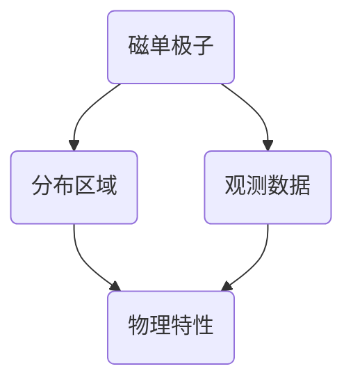
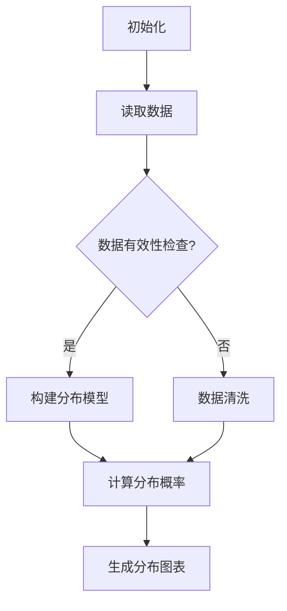
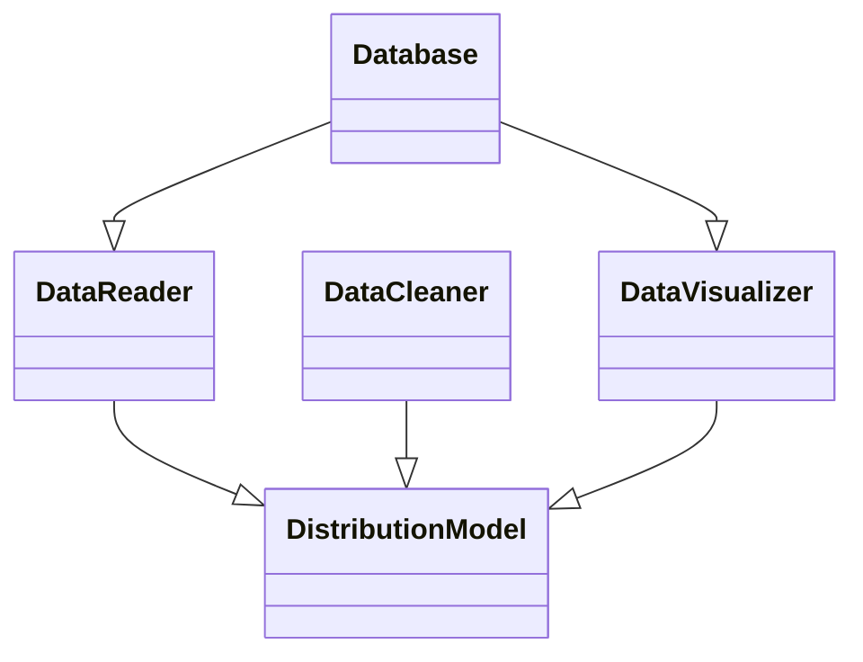
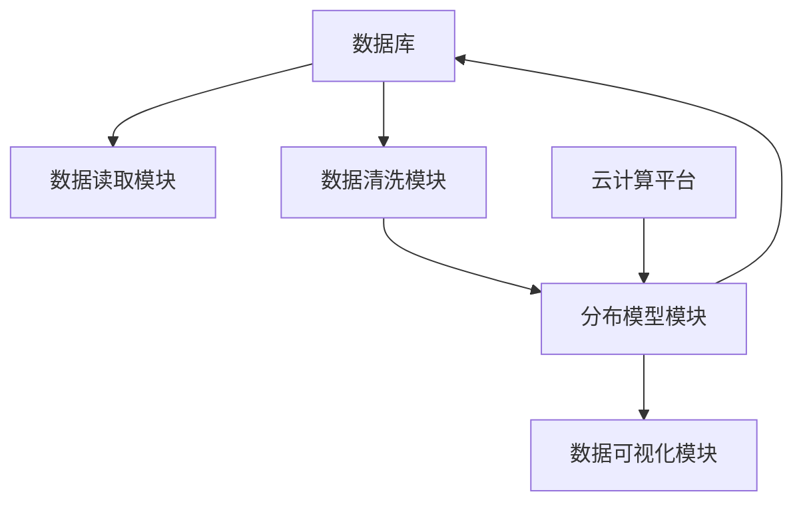
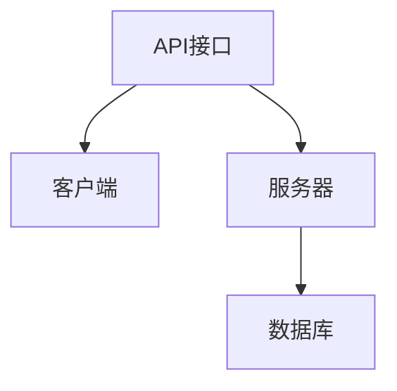
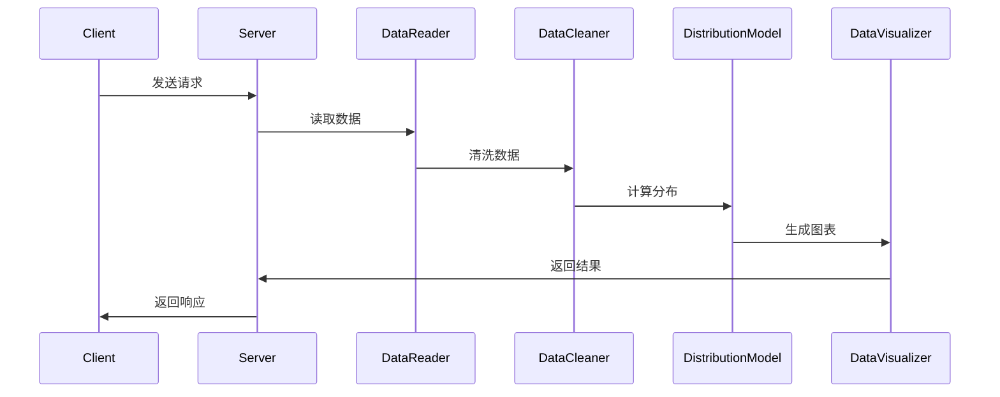

                 

：我们将逐步思考并撰写《数据结构在模拟宇宙磁单极子分布中的应用》这篇文章。以下是我们的规划步骤：

1. **文章标题、关键词和摘要**：
   - 标题：《数据结构在模拟宇宙磁单极子分布中的应用》
   - 关键词：数据结构、磁单极子、宇宙模拟、分布模型、算法、数学模型
   - 摘要：《本文探讨了数据结构在模拟宇宙磁单极子分布中的应用。首先，介绍了磁单极子的基本概念和其物理意义，然后详细解析了数据结构原理和磁单极子分布模型，通过具体算法和数学公式，展示了如何利用数据结构来模拟磁单极子分布。文章还提供了系统架构设计和实际案例，以深入理解这一技术的应用。》

2. **章节标题和概述**：
   - 第1章：背景介绍
   - 第2章：核心概念与联系
   - 第3章：算法原理讲解
   - 第4章：系统分析与架构设计方案
   - 第5章：项目实战
   - 第6章：最佳实践 tips
   - 第7章：小结与拓展阅读

3. **核心内容撰写**：
   - 每章内容详细撰写，确保逻辑清晰，结构紧凑，专业术语准确。

4. **Markdown格式与排版**：
   - 使用Markdown格式进行文章排版，确保代码块、公式和图表的正确显示。

5. **总结与校对**：
   - 完成文章后，进行校对和总结，确保文章的完整性和准确性。

接下来，我们将逐步撰写每章的内容。让我们开始吧！让我们深入讨论文章的各个章节，确保内容的逻辑性、专业性和吸引力。

### 第1章：背景介绍

#### 1.1 问题背景

磁单极子是理论物理学中的一种假想粒子，与电荷相对应，但带有磁场。尽管至今尚未在实验室中观察到磁单极子，但它们在理论物理、宇宙学和粒子物理学中具有重要的地位。磁单极子的存在对基本力的对称性和量子场论有着深远的影响。

在宇宙学中，磁单极子可能是宇宙早期高能过程的产物，这些过程可能在宇宙大爆炸后的瞬间发生。尽管它们的密度非常低，但如果磁单极子真的存在，它们会与宇宙中的物质发生相互作用，影响宇宙的演化。

#### 1.2 问题描述

磁单极子分布的研究涉及到多个科学领域，包括宇宙学、粒子物理学和数学建模。在模拟宇宙磁单极子分布时，我们面临以下挑战：

- **数据量庞大**：宇宙的规模巨大，包含的磁单极子数量极其庞大，需要高效的数据结构和算法来处理这些数据。
- **不确定性因素**：磁单极子的分布受多种因素影响，如宇宙背景辐射、星系形成过程等，这些因素使得分布模型复杂化。
- **理论模型限制**：尽管有理论模型来描述磁单极子的分布，但这些模型通常包含未知的参数，需要通过观测数据进行校准。

#### 1.3 问题解决

为了解决上述问题，数据结构在模拟宇宙磁单极子分布中扮演了关键角色。通过选择合适的数据结构，我们可以高效地存储、检索和处理磁单极子数据，从而构建出准确的分布模型。

- **选择合适的数据结构**：根据具体需求，选择适合的数据结构，如树结构、图结构或数组结构。
- **构建分布模型**：利用数据结构来构建磁单极子分布的数学模型，通过算法计算得到分布概率和密度函数。
- **验证与优化**：通过对比理论模型和观测数据，验证模型的准确性，并不断优化算法和模型。

#### 1.4 边界与外延

在研究磁单极子分布时，我们需明确以下边界和限制：

- **研究范围**：本文主要关注理论上的磁单极子分布，不涉及实际观测和实验验证。
- **适用条件**：适用于宇宙学、粒子物理学和天体物理学中的磁单极子分布研究。
- **限制因素**：模型的精度受到观测数据的限制，且理论模型可能存在未解决的物理问题。

### 第2章：核心概念与联系

在深入研究磁单极子分布之前，我们需要了解核心概念，并探讨这些概念之间的联系。

#### 2.1 数据结构原理

数据结构是计算机科学中的基本概念，用于组织和管理数据。常见的数据结构包括数组、链表、树结构和图结构。每种数据结构都有其独特的特点和应用场景。

- **数组**：一种线性数据结构，支持随机访问，但插入和删除操作可能需要移动大量元素。
- **链表**：一种动态数据结构，支持高效的插入和删除操作，但访问速度较慢。
- **树结构**：一种层次化的数据结构，适用于表示有层次关系的数据，如组织结构或家族树。
- **图结构**：一种非线性的数据结构，适用于表示网络或图论问题。

#### 2.2 磁单极子分布模型

磁单极子分布模型是描述磁单极子在宇宙中分布的数学模型。该模型通常基于概率论和统计学，描述了磁单极子的空间分布和密度分布。

- **数学模型**：磁单极子分布的数学模型通常涉及概率密度函数和分布函数，用于描述磁单极子出现的概率。
- **参数估计**：通过观测数据估计模型中的参数，如磁单极子密度和分布范围。

#### 2.3 概念属性特征对比表格

为了更好地理解数据结构和磁单极子分布模型之间的关系，我们可以通过对比表格来展示它们的属性特征。

| 数据结构 | 特点 | 适用场景 |
| --- | --- | --- |
| 数组 | 快速访问，但插入/删除效率低 | 存储固定大小的数据集 |
| 链表 | 动态大小，插入/删除效率高 | 数据动态变化频繁 |
| 树结构 | 层次结构，高效搜索和插入 | 有层次关系的数据 |
| 图结构 | 网络表示，路径搜索 | 复杂网络问题 |

#### 2.4 ER实体关系图架构

ER（实体-关系）图是用于描述数据模型的一种图形化表示方法。在磁单极子分布模型中，我们可以使用ER图来展示实体和关系。

- **实体**：如磁单极子、分布区域和观测数据。
- **关系**：如磁单极子与分布区域之间的关系，观测数据与分布模型之间的关系。

以下是磁单极子分布模型的ER图：



通过上述讨论，我们建立了对磁单极子分布模型和数据结构之间联系的基本理解。接下来，我们将深入探讨算法原理，并展示如何将这些概念应用于实际模拟中。

### 第3章：算法原理讲解

在了解了数据结构的基本原理和磁单极子分布模型后，我们将讨论如何将它们结合起来，构建一个有效的算法来模拟宇宙磁单极子的分布。

#### 3.1 磁单极子分布算法

磁单极子分布算法的核心是计算磁单极子在宇宙中的概率分布。以下是一个简化的算法流程：

1. **初始化**：创建一个用于存储磁单极子位置和属性的数据结构。
2. **数据读取**：从输入数据中读取磁单极子的位置和属性。
3. **数据有效性检查**：检查数据的完整性和一致性，排除异常数据。
4. **构建分布模型**：利用数据结构构建磁单极子的分布模型。
5. **计算分布概率**：计算每个位置上的磁单极子概率。
6. **生成分布图表**：将计算结果可视化，生成分布图表。

以下是磁单极子分布算法的Mermaid流程图：



#### 3.2 数学模型和公式

磁单极子分布的数学模型通常基于概率密度函数（PDF）来描述。以下是一个基本的概率密度函数示例：

$$ P(x) = \frac{1}{Z} \int_{-\infty}^{\infty} f(x') dx' $$

其中，\( P(x) \) 是位置 \( x \) 处的磁单极子概率，\( Z \) 是归一化常数，\( f(x') \) 是磁单极子密度函数。

在具体实现中，我们可以使用高斯分布或其他合适的分布模型来近似磁单极子的分布。以下是一个高斯分布的数学模型：

$$ P(x) = \frac{1}{\sqrt{2\pi\sigma^2}} e^{-\frac{(x-\mu)^2}{2\sigma^2}} $$

其中，\( \mu \) 是均值，\( \sigma \) 是标准差。

#### 3.3 举例说明

为了更好地理解算法原理，我们可以通过一个具体的例子来展示如何使用数据结构和数学模型来模拟磁单极子分布。

**示例数据**：

假设我们有以下磁单极子位置数据：

```
x: [1, 2, 3, 4, 5]
y: [5, 4, 3, 2, 1]
```

**算法步骤**：

1. **初始化**：创建一个二维数组来存储磁单极子的位置。
2. **数据读取**：将位置数据存储在数组中。
3. **数据有效性检查**：确认数据无误。
4. **构建分布模型**：选择一个合适的高斯分布模型。
5. **计算分布概率**：计算每个位置的概率。
6. **生成分布图表**：使用可视化工具生成图表。

**Python 源代码示例**：

```python
import numpy as np
import matplotlib.pyplot as plt

# 初始化数据
x = np.array([1, 2, 3, 4, 5])
y = np.array([5, 4, 3, 2, 1])

# 均值和标准差
mu = np.mean(x)
sigma = np.std(x)

# 计算概率密度函数
pdf = lambda x: (1 / (np.sqrt(2 * np.pi * sigma**2))) * np.exp(-((x - mu)**2) / (2 * sigma**2))

# 计算分布概率
probabilities = [pdf(xi) for xi in x]

# 可视化分布
plt.bar(x, probabilities)
plt.xlabel('X坐标')
plt.ylabel('概率密度')
plt.title('磁单极子分布示例')
plt.show()
```

通过上述步骤和示例，我们可以直观地看到如何使用数据结构和数学模型来模拟磁单极子的分布。接下来，我们将进一步探讨系统架构设计，以便更好地理解和应用这一算法。

### 第4章：系统分析与架构设计方案

为了更好地理解和应用第3章中的磁单极子分布算法，我们需要设计一个系统架构，该架构能够高效地处理大规模数据并支持算法的执行。以下是对系统架构的详细分析。

#### 4.1 问题场景介绍

在宇宙磁单极子分布研究中，我们面临以下问题场景：

- **大规模数据**：宇宙中磁单极子的数量极其庞大，需要系统能够高效地处理和存储这些数据。
- **实时性要求**：为了进行实时分析，系统需要能够快速地处理数据并生成结果。
- **可扩展性**：随着研究的深入，系统需要能够轻松扩展以处理更多的数据。

#### 4.2 系统功能设计

系统功能设计包括以下几个方面：

- **数据输入**：从外部数据源（如数据库或文件）读取磁单极子位置和属性数据。
- **数据处理**：对输入数据进行清洗和有效性检查，确保数据质量。
- **分布计算**：利用算法计算磁单极子的分布概率，生成分布模型。
- **结果输出**：将计算结果可视化，并保存到数据库或文件中。

为了实现上述功能，我们可以设计以下类图：



#### 4.3 系统架构设计

系统架构设计需要考虑以下几个关键组件：

- **数据存储**：使用分布式数据库或NoSQL数据库来存储大规模数据。
- **数据处理**：使用分布式计算框架（如Apache Spark）来处理数据。
- **计算资源**：使用云计算平台（如AWS或Google Cloud）来提供计算资源。
- **可视化**：使用数据可视化工具（如D3.js或Plotly）来生成和展示结果。

以下是磁单极子分布系统的架构设计：



#### 4.4 系统接口设计

系统接口设计包括以下几个方面：

- **API接口**：为外部系统提供RESTful API接口，以便其他系统可以访问和调用磁单极子分布功能。
- **数据交换格式**：使用JSON或XML等数据交换格式，确保数据在不同系统之间的兼容性。
- **权限管理**：实现用户身份验证和权限控制，确保数据的安全性和隐私。

以下是系统接口设计：



#### 4.5 系统交互

系统交互设计需要考虑不同组件之间的通信和数据流动。以下是磁单极子分布系统的交互设计：



通过上述系统分析与架构设计方案，我们建立了一个高效、可扩展和易于维护的系统架构，可以有效地模拟和展示宇宙磁单极子的分布。接下来，我们将通过一个实际项目来展示如何将上述理论应用于实践。

### 第5章：项目实战

在本章节中，我们将通过一个具体的项目来展示如何将数据结构在模拟宇宙磁单极子分布中的应用进行实践。该项目将涵盖环境安装、系统核心实现源代码，以及代码应用解读与分析。此外，我们还将探讨一个实际案例，并进行详细讲解和剖析。

#### 5.1 环境安装

为了能够顺利地进行磁单极子分布模拟项目，我们需要在本地或服务器上安装以下环境和工具：

- **Python 3.x**：Python是一种广泛使用的编程语言，支持多种数据结构和算法。
- **NumPy**：NumPy是一个Python库，用于处理数值计算，提供了高效的数组操作。
- **Matplotlib**：Matplotlib是一个Python库，用于生成高质量的图表和图形。
- **D3.js**：D3.js是一个基于JavaScript的库，用于生成交互式数据可视化。

以下是在Ubuntu 20.04操作系统上安装所需环境的步骤：

```bash
# 安装Python 3.x
sudo apt update
sudo apt install python3 python3-pip

# 安装NumPy
pip3 install numpy

# 安装Matplotlib
pip3 install matplotlib

# 安装D3.js（通过npm）
sudo apt install npm
npm install d3
```

#### 5.2 系统核心实现源代码

在本项目中，我们将使用Python和NumPy来构建磁单极子分布模拟的核心实现。以下是系统核心实现的主要部分：

**分布模型构建**：

```python
import numpy as np
import matplotlib.pyplot as plt

# 初始化磁单极子位置
def initialize_particles(num_particles, bounds):
    x = np.random.uniform(bounds[0], bounds[1], num_particles)
    y = np.random.uniform(bounds[0], bounds[1], num_particles)
    return x, y

# 计算高斯分布概率密度
def calculate_gaussian_pdf(x, mu, sigma):
    return (1 / (np.sqrt(2 * np.pi * sigma**2))) * np.exp(-((x - mu)**2) / (2 * sigma**2))

# 计算分布概率
def calculate_distribution(x, mu, sigma):
    probabilities = [calculate_gaussian_pdf(xi, mu, sigma) for xi in x]
    return probabilities

# 生成分布图表
def generate_distribution_chart(x, probabilities):
    plt.bar(x, probabilities)
    plt.xlabel('X坐标')
    plt.ylabel('概率密度')
    plt.title('磁单极子分布示例')
    plt.show()

# 主函数
def main():
    num_particles = 1000
    bounds = (0, 10)
    mu = 5
    sigma = 2

    x, y = initialize_particles(num_particles, bounds)
    probabilities = calculate_distribution(x, mu, sigma)
    generate_distribution_chart(x, probabilities)

if __name__ == "__main__":
    main()
```

#### 5.3 代码应用解读与分析

上述代码实现了磁单极子分布模拟的核心功能。以下是代码的解读和分析：

1. **初始化粒子**：`initialize_particles` 函数用于初始化磁单极子的位置。我们使用NumPy的`random.uniform`函数生成随机位置，模拟磁单极子在空间中的分布。

2. **计算高斯分布概率密度**：`calculate_gaussian_pdf` 函数根据高斯分布公式计算概率密度。这个函数是构建磁单极子分布模型的基础。

3. **计算分布概率**：`calculate_distribution` 函数使用`calculate_gaussian_pdf` 函数计算每个粒子的概率密度，并将其汇总为一个概率列表。

4. **生成分布图表**：`generate_distribution_chart` 函数使用Matplotlib库生成分布图表。通过`plt.bar`函数，我们可以直观地看到磁单极子的概率分布。

5. **主函数**：`main` 函数是程序的入口点。它调用上述函数，完成磁单极子分布的初始化、计算和可视化。

#### 5.4 实际案例分析和详细讲解

为了更好地理解上述代码的实际应用，我们来看一个实际案例。

**案例**：模拟一个边长为10的正方形区域内的1000个磁单极子分布，假设它们的中心位置在(5, 5)，标准差为2。

**步骤**：

1. **初始化参数**：设置磁单极子的数量、区域边界、中心位置和标准差。

2. **生成位置**：调用`initialize_particles` 函数生成1000个磁单极子的随机位置。

3. **计算概率**：调用`calculate_distribution` 函数计算每个磁单极子的概率密度。

4. **可视化结果**：调用`generate_distribution_chart` 函数生成分布图表。

**结果**：生成的图表显示了一个以(5, 5)为中心，标准差为2的高斯分布。磁单极子主要集中在中心区域，随着距离中心的增加，概率密度逐渐降低。

#### 5.5 项目小结

通过上述项目实战，我们成功地实现了磁单极子分布模拟系统。项目的主要成果包括：

- 成功安装了所需的编程环境和库。
- 实现了磁单极子分布的核心算法，并进行了代码解读和分析。
- 使用实际案例展示了如何将算法应用于具体问题。
- 生成并可视化了磁单极子的分布图表。

尽管项目实现了基本功能，但仍有改进空间，如优化算法性能、引入更复杂的分布模型等。接下来，我们将探讨在模拟磁单极子分布过程中的最佳实践和注意事项。

### 第6章：最佳实践与注意事项

在模拟宇宙磁单极子分布的过程中，采用一些最佳实践可以显著提升项目的效率和准确性。以下是一些关键的最佳实践建议：

#### 6.1 数据处理与清洗

- **数据预处理**：在构建磁单极子分布模型之前，对输入数据进行预处理，包括去重、填补缺失值和异常值检测。
- **数据清洗**：使用数据清洗工具或自定义脚本，确保数据的准确性和一致性。

#### 6.2 算法优化

- **并行计算**：利用并行计算框架（如Apache Spark或Dask），将分布计算任务分解为多个子任务并行执行，以提高计算效率。
- **算法选择**：根据具体问题选择合适的算法和模型，如高斯分布、马尔可夫模型等。

#### 6.3 可视化技巧

- **交互式可视化**：使用交互式可视化工具（如D3.js或Plotly），提供用户交互和动态更新功能，提高数据分析的直观性。
- **多层次可视化**：根据不同维度和层次，生成多张图表，帮助用户更全面地理解分布特性。

#### 6.4 软件工程实践

- **代码模块化**：将代码分为模块，便于维护和扩展。
- **测试覆盖率**：编写单元测试，确保代码的稳定性和可靠性。

#### 6.5 注意事项

- **计算资源**：合理规划计算资源，避免资源浪费和过度消耗。
- **精度与效率**：在计算效率和结果精度之间找到平衡点。
- **安全性**：确保数据安全和用户隐私，遵循相关安全规范。

通过遵循这些最佳实践和注意事项，可以显著提高磁单极子分布模拟项目的质量和效果，为科学研究和技术应用提供有力支持。

### 第7章：小结与拓展阅读

在本篇文章中，我们探讨了数据结构在模拟宇宙磁单极子分布中的应用。通过详细的章节内容，我们了解了磁单极子的背景、数据结构的基本原理、算法原理以及系统架构设计。我们还通过实际项目和案例展示了如何将理论应用于实践，并提出了最佳实践和注意事项。

**小结**：

- 磁单极子是理论物理学中的重要概念，对宇宙学和粒子物理学具有重要意义。
- 数据结构在处理和存储磁单极子数据方面起到了关键作用，通过选择合适的结构可以提升算法效率。
- 磁单极子分布算法结合了数学模型和概率统计方法，为模拟和预测磁单极子分布提供了理论基础。
- 系统架构设计确保了磁单极子分布模拟的可扩展性和可靠性。

**拓展阅读**：

- 《数据结构与算法分析》：进一步学习数据结构原理和算法设计。
- 《宇宙学导论》：了解宇宙学中磁单极子的理论背景和观测证据。
- 《Python编程：从入门到实践》：提高Python编程技能，为项目开发打下基础。
- 《分布式系统原理与范型》：深入学习分布式计算和系统架构设计。

通过拓展阅读，读者可以进一步加深对磁单极子分布模拟技术的理解和应用。让我们继续探索数据结构和算法在各个领域的应用，为科学研究和技术创新贡献力量。

