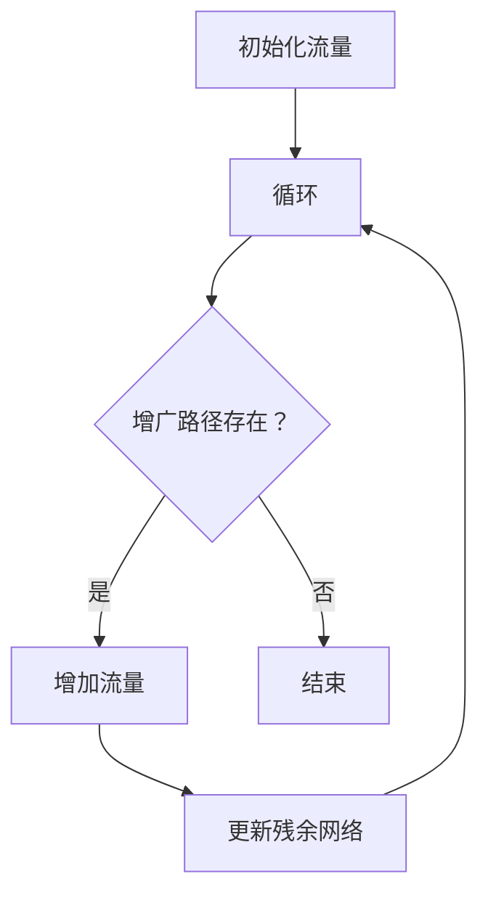
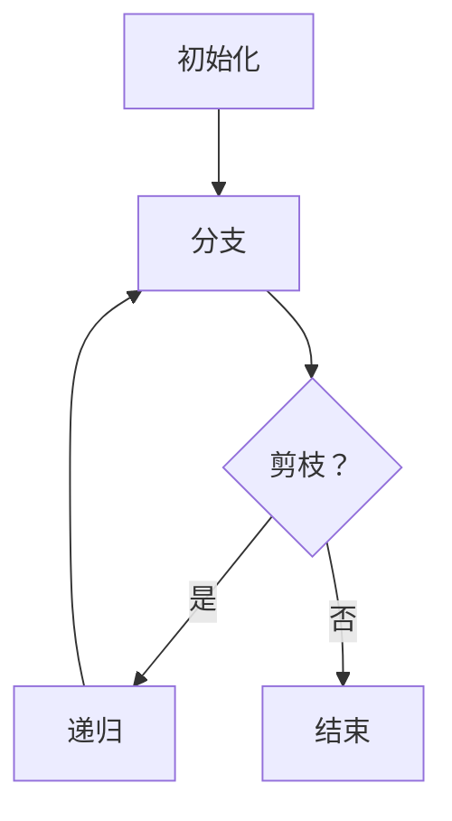

                 

# 数据结构在模拟宇宙磁单极子相互作用网络中的应用

## 关键词
- 数据结构
- 宇宙磁单极子
- 相互作用网络
- 模拟算法
- 系统架构

## 摘要
本文将探讨数据结构在模拟宇宙磁单极子相互作用网络中的应用。首先介绍磁单极子的基本概念及其在宇宙中的地位。然后，阐述数据结构在网络模拟中的重要性，包括数据结构的基本分类、属性特征以及与网络拓扑的关系。接着，详细讲解几种典型的模拟算法，如模拟退火算法、网络流算法和分支界定算法，并使用Python代码进行实例说明。随后，介绍系统分析与架构设计，包括系统功能设计、系统架构设计、系统接口设计以及系统交互设计。最后，通过实际项目实战，展示如何应用这些算法和设计进行宇宙磁单极子相互作用网络的模拟。

## 目录

### 第一部分：问题背景与核心概念

#### 第1章：问题背景与核心概念

#### 第2章：核心概念与联系

### 第二部分：算法原理讲解

#### 第3章：算法原理讲解

### 第三部分：系统分析与架构设计

#### 第4章：系统功能设计

#### 第5章：系统架构设计

#### 第6章：系统交互设计

### 第四部分：项目实战

#### 环境安装与配置
#### 系统核心实现源代码
#### 代码应用解读与分析
#### 实际案例分析与详细讲解
#### 项目小结

### 第五部分：最佳实践、小结、注意事项与拓展阅读

#### 最佳实践
#### 小结
#### 注意事项
#### 拓展阅读

## 第一部分：问题背景与核心概念

### 第1章：问题背景与核心概念

#### 1.1.1 宇宙磁单极子问题概述

磁单极子是指具有磁荷的单极性粒子，与电荷粒子类似，但仅具有磁单极子。尽管磁单极子尚未在实验中被发现，但理论物理学预测它们在宇宙中可能存在。磁单极子的重要性在于，如果它们存在，它们将极大地改变我们对宇宙的理解。

首先，我们需要理解磁单极子的概念。磁单极子是磁性粒子，类似于电荷粒子，但它们的性质完全不同。电荷粒子具有正电荷和负电荷，而磁单极子只有磁单极性，没有磁双极性。换句话说，磁单极子只能表现出单一磁极性，如单一南极或单一北极。

磁单极子在物理学中的地位非常重要。它们是基本的物理实体之一，与电荷粒子、夸克、中微子等相提并论。理论物理学认为，磁单极子的存在可以解释许多宇宙现象，如宇宙磁场的起源和宇宙大爆炸后的初期条件。

尽管磁单极子的存在尚未得到实验证实，但理论物理学预测它们可能存在于宇宙中。例如，大统一理论（Grand Unified Theory，GUT）预测，在极高温的条件下，磁单极子可能产生。此外，一些理论模型也预测，磁单极子可能在宇宙早期产生，并在宇宙演化的过程中逐渐被吸收。

实验探索方面，科学家们一直在寻找磁单极子的存在证据。尽管迄今为止尚未发现磁单极子，但实验探索仍在进行中。例如，使用大型粒子加速器和宇宙探测器，科学家们试图通过间接方法探测磁单极子。例如，利用磁单极子与宇宙射线相互作用产生的独特信号来探测其存在。

#### 1.1.2 宇宙磁单极子相互作用网络的概念

为了理解宇宙磁单极子相互作用网络的概念，我们需要先了解网络的基本定义和特点。

**网络**：网络是由节点和边组成的复杂系统。节点表示系统中的个体，边表示节点之间的交互关系。在物理学中，网络可以用来描述不同实体之间的相互作用。

**宇宙磁单极子相互作用网络**：宇宙磁单极子相互作用网络是一个由磁单极子节点和相互作用边组成的复杂系统。每个磁单极子节点代表一个磁单极子，节点之间的相互作用边表示磁单极子之间的相互作用。

宇宙磁单极子相互作用网络具有以下特点：

1. **高度复杂**：宇宙中磁单极子的数量可能极其庞大，导致相互作用网络极其复杂。
2. **动态性**：磁单极子相互作用网络是一个动态系统，磁单极子之间的相互作用可能会随时间而变化。
3. **多样性**：磁单极子相互作用网络可能具有多种不同的拓扑结构，例如无向图、有向图、循环图等。

**宇宙磁单极子相互作用网络的重要性**：

1. **揭示宇宙奥秘**：宇宙磁单极子相互作用网络可以帮助我们理解宇宙的演化过程，如宇宙磁场的起源。
2. **理论物理学研究**：宇宙磁单极子相互作用网络为理论物理学研究提供了一个重要的模型。
3. **潜在应用**：磁单极子相互作用网络的研究可能为新技术和材料的发展提供启示。

#### 1.1.3 数据结构在模拟中的应用

**数据结构**：数据结构是计算机科学中的一个基本概念，它用于组织和存储数据。数据结构可以分为线性结构和非线性结构。线性结构包括数组、链表、栈、队列等；非线性结构包括树、图等。

在科学计算中，数据结构起着至关重要的作用。科学家们使用各种数据结构来高效地存储和处理大量数据。例如，数组可以用于存储宇宙中磁单极子的位置信息；树可以用于组织磁单极子的层次结构；图可以用于描述磁单极子之间的相互作用关系。

**数据结构在模拟宇宙磁单极子相互作用网络中的作用**：

1. **高效存储**：数据结构可以高效地存储大量磁单极子的信息，如位置、速度、相互作用力等。
2. **快速检索**：数据结构可以提供快速检索功能，如快速查找磁单极子之间的相互作用关系。
3. **算法优化**：数据结构可以用于优化模拟算法的执行效率，如使用树状结构来加速搜索和排序操作。
4. **可视化**：数据结构可以用于实现宇宙磁单极子相互作用网络的可视化，帮助我们更直观地理解其结构和动态行为。

### 第2章：核心概念与联系

#### 2.1 数据结构与网络拓扑的基本概念

**数据结构的基本概念**：

- **线性结构**：线性结构是一种数据结构，其中的元素按照一定的顺序排列。常见的线性结构包括数组、链表、栈、队列等。
- **树状结构**：树状结构是一种层次结构，由根节点和子节点组成。树状结构常用于表示层次关系和递归关系。
- **图状结构**：图状结构是一种由节点和边组成的复杂结构，可以表示任意元素之间的相互作用关系。常见的图状结构包括无向图、有向图、加权图等。

**网络拓扑的基本概念**：

- **网络**：网络是由节点和边组成的复杂系统，节点表示系统中的个体，边表示节点之间的交互关系。
- **拓扑**：拓扑是一种数学概念，用于描述网络的连接方式和结构。常见的网络拓扑结构包括星型、环型、树型、网状等。
- **网络属性**：网络属性包括连通性、平均路径长度、聚类系数等，用于描述网络的结构特征和性能。

**数据结构与网络拓扑的属性特征对比表格**：

| 数据结构类型 | 属性特征 1 | 属性特征 2 | 属性特征 3 |
| --- | --- | --- | --- |
| 线性结构 | 元素顺序排列 | 支持快速检索 | 不支持复杂的交互关系 |
| 树状结构 | 层次结构 | 支持递归操作 | 不支持全局交互关系 |
| 图状结构 | 任意元素之间的交互关系 | 支持复杂的拓扑结构 | 支持全局交互关系 |

**数据结构与网络拓扑的ER实体关系图**：

为了更好地理解数据结构与网络拓扑之间的关系，我们可以使用ER（实体关系）模型来绘制实体关系图。

```mermaid
erDiagram
  Node ||--|{ Edge }|-- Node
  Node ||--|{ Attribute }|-- Node
```

在这个ER实体关系图中，`Node`表示网络中的节点，`Edge`表示节点之间的边，`Attribute`表示节点的属性。这个ER实体关系图展示了数据结构与网络拓扑之间的基本联系。

**数据结构与网络拓扑的相互关系**：

数据结构与网络拓扑之间存在密切的联系。数据结构可以用于高效地存储和检索网络拓扑信息，而网络拓扑则可以用于描述数据结构之间的交互关系。

1. **数据结构在模拟中的应用**：在模拟宇宙磁单极子相互作用网络时，我们可以使用各种数据结构来存储和检索磁单极子的信息，如位置、速度、相互作用力等。常见的应用包括数组、链表、树、图等。
2. **网络拓扑在模拟中的应用**：网络拓扑可以用于描述磁单极子之间的相互作用关系，如磁单极子之间的距离、角度、相互作用力等。常见的网络拓扑包括无向图、有向图、加权图等。

通过数据结构与网络拓扑的相互结合，我们可以更全面地理解和模拟宇宙磁单极子相互作用网络。

## 第二部分：算法原理讲解

### 第3章：算法原理讲解

#### 3.1 数据结构与算法的基础知识

在讲解与宇宙磁单极子相互作用网络模拟相关的算法之前，我们先回顾一下数据结构与算法的基础知识。

**数据结构的类型**：

数据结构主要分为线性结构和非线性结构。线性结构包括数组、链表、栈、队列等；非线性结构包括树、图等。

- **数组**：数组是一种线性结构，用于存储一系列元素。数组支持快速的随机访问，但插入和删除操作可能比较耗时。
- **链表**：链表也是一种线性结构，由一系列节点组成。链表的优点是插入和删除操作比较高效，但随机访问性能较差。
- **栈**：栈是一种后进先出（LIFO）的线性结构，常用于处理递归和回溯问题。
- **队列**：队列是一种先进先出（FIFO）的线性结构，常用于处理排队问题和任务调度问题。

- **树状结构**：树状结构是一种层次结构，由根节点和子节点组成。树状结构常用于表示层次关系和递归关系，如二叉树、平衡树、堆等。
- **图状结构**：图状结构是一种由节点和边组成的复杂结构，可以表示任意元素之间的相互作用关系。常见的图状结构包括无向图、有向图、加权图等。

**算法的基本概念**：

算法是一种解决问题的步骤序列，通常由伪代码或程序代码表示。算法具有以下几个基本特性：

- **确定性**：算法的每一步操作都必须是明确的，无论在何种情况下都能得到相同的结果。
- **有效性**：算法必须在有限的步骤内解决问题，否则将无法在现实世界中应用。
- **输入和输出**：算法通常需要输入一些数据，然后通过一系列操作产生输出结果。
- **可行性**：算法必须能够在实际的计算环境中执行，并且能够处理各种输入数据。

**算法分析**：

算法分析是评估算法性能的过程，主要关注两个方面：时间复杂度和空间复杂度。

- **时间复杂度**：时间复杂度表示算法执行时间与输入规模之间的关系。通常用大O符号表示，如O(n)，O(n^2)等。
- **空间复杂度**：空间复杂度表示算法占用内存与输入规模之间的关系。同样使用大O符号表示。

通过对算法进行时间复杂度和空间复杂度分析，我们可以评估算法的效率和可行性。

#### 3.2 磁单极子相互作用网络的模拟算法

在模拟宇宙磁单极子相互作用网络时，我们可以使用多种算法来实现。以下介绍三种典型的模拟算法：模拟退火算法、网络流算法和分支界定算法。

**模拟退火算法原理**：

模拟退火算法是一种基于物理学的启发式优化算法，模拟了固体退火过程中的温度变化。在固体退火过程中，温度的逐渐降低会导致固体结构从无序状态逐渐转变为有序状态。模拟退火算法利用这一原理来寻找问题的最优解。

**数学模型**：

假设我们要优化的目标函数为f(x)，其中x是问题的解。模拟退火算法的基本步骤如下：

1. 初始状态：设置初始温度T，随机生成一个解x。
2. 温度迭代：重复以下步骤，直到温度降低到某个阈值：
   a. 随机生成一个新解x'。
   b. 计算目标函数值的变化Δf = f(x') - f(x)。
   c. 如果Δf < 0，则接受x'作为新的解。
   d. 如果Δf ≥ 0，则根据概率P(Δf)接受x'作为新的解，其中P(Δf) = exp(-Δf / T)。
3. 降温过程：逐渐降低温度T，可以采用线性降温、对数降温或其他降温策略。

**mermaid流程图**：

```mermaid
graph TD
A[初始化] --> B[循环]
B --> C{温度阈值？}
C -->|是| D[结束]
C -->|否| E[随机生成x']
E --> F[计算Δf]
F --> G{Δf < 0？}
G -->|是| H[x'为新的解]
G -->|否| I[P(Δf) > random()？]
I -->|是| H[x'为新的解]
I -->|否| J[x保持不变]
J --> B
```

**Python实现**：

```python
import random
import math

def simulate_annealing(f, initial_x, T, T_min, max_iterations):
    x = initial_x
    for _ in range(max_iterations):
        x_new = random.choice([x - 1, x + 1])
        delta_f = f(x_new) - f(x)
        if delta_f < 0 or math.exp(-delta_f / T) > random.random():
            x = x_new
        if T > T_min:
            T *= 0.99
    return x

# 示例：求解函数f(x) = x^2的最小值
def f(x):
    return x ** 2

initial_x = 10
T = 1000
T_min = 1
max_iterations = 1000

best_x = simulate_annealing(f, initial_x, T, T_min, max_iterations)
print("Best x:", best_x)
```

**网络流算法原理**：

网络流算法用于解决网络中流量分配问题，即在满足网络容量约束的条件下，最大化网络中的流量。网络流算法广泛应用于物流调度、数据传输、电力分配等领域。

**数学模型**：

网络流算法的核心是最大流最小割定理。该定理表明，网络中的最大流值等于最小割值，其中割是指将网络划分为两个部分的一组边。

网络流算法的基本步骤如下：

1. 初始化流量：设置所有边的初始流量为0。
2. 找增广路径：找到一条从源点s到汇点t的增广路径，即一条可以增加流量的路径。
3. 增加流量：在增广路径上逐步增加流量，直到无法再增加为止。
4. 更新残余网络：根据增加的流量更新残余网络，以便继续寻找增广路径。
5. 重复步骤2-4，直到无法找到增广路径。

**mermaid流程图**：



**Python实现**：

```python
from collections import defaultdict

def find_augmenting_path(graph, s, t, parent):
    visited = [False] * len(graph)
    visited[s] = True
    queue = [s]
    while queue:
        u = queue.pop(0)
        for v, capacity in enumerate(graph[u]):
            if not visited[v] and capacity > 0:
                visited[v] = True
                parent[v] = u
                queue.append(v)
                if v == t:
                    return True
    return False

def max_flow(graph, s, t):
    parent = [-1] * len(graph)
    max_flow = 0
    while find_augmenting_path(graph, s, t, parent):
        path_flow = float('inf')
        s = t
        while s != s:
            path_flow = min(path_flow, graph[parent[s]][s])
            s = parent[s]
        max_flow += path_flow
        v = t
        while v != s:
            u = parent[v]
            graph[u][v] -= path_flow
            graph[v][u] += path_flow
            v = parent[v]
    return max_flow

# 示例：求解有向图的最大流问题
graph = [
    [0, 16, 13, 0, 0, 0],
    [0, 0, 10, 12, 0, 0],
    [0, 4, 0, 0, 14, 0],
    [0, 0, 9, 0, 0, 20],
    [0, 0, 0, 7, 0, 4],
    [0, 0, 0, 0, 0, 0],
]

s = 0
t = 5

max_flow_value = max_flow(graph, s, t)
print("Maximum flow value:", max_flow_value)
```

**分支界定算法原理**：

分支界定算法是一种用于解决组合优化问题的启发式算法，通过分支和剪枝策略来寻找最优解。分支界定算法广泛应用于旅行商问题、作业调度问题、背包问题等领域。

**数学模型**：

分支界定算法的基本思想是将问题划分为多个子问题，并对每个子问题进行分支和剪枝。

分支界定算法的基本步骤如下：

1. 初始化：设置问题的初始状态。
2. 分支：将当前状态划分为多个子状态，每个子状态代表一个可能的分支。
3. 剪枝：根据约束条件和目标函数，对子状态进行剪枝，去除那些不可能产生最优解的分支。
4. 递归：对每个子状态递归执行步骤2-3，直到找到最优解。

**mermaid流程图**：



**Python实现**：

```python
def branch_and_bound(problem, c):
    if problem.is_solution():
        return problem.evaluate(c)
    best_value = float('-inf')
    for child in problem.branch():
        if child.is_feasible():
            value = branch_and_bound(child, c)
            best_value = max(best_value, value)
    return best_value

class Problem:
    def __init__(self, solution, constraints):
        self.solution = solution
        self.constraints = constraints

    def is_solution(self):
        return True

    def branch(self):
        return []

    def is_feasible(self):
        return True

    def evaluate(self, c):
        return 0

# 示例：求解背包问题的最优解
class KnapsackProblem(Problem):
    def __init__(self, items, weights, values, capacity):
        super().__init__([], [])
        self.items = items
        self.weights = weights
        self.values = values
        self.capacity = capacity

    def branch(self):
        branches = []
        for i in range(len(self.items)):
            item = self.items[i]
            weight = self.weights[i]
            value = self.values[i]
            if weight <= self.capacity:
                new_solution = self.solution + [item]
                branches.append(KnapsackProblem(new_solution, self.weights, self.values, self.capacity - weight))
        return branches

    def is_feasible(self):
        total_weight = sum(self.solution)
        return total_weight <= self.capacity

    def evaluate(self, c):
        total_value = sum([v for i, v in enumerate(self.values) if i in self.solution])
        return total_value

items = [1, 2, 3, 4]
weights = [1, 2, 3, 4]
values = [3, 4, 5, 7]
capacity = 5

problem = KnapsackProblem(items, weights, values, capacity)
best_value = branch_and_bound(problem, c)
print("Best value:", best_value)
```

### 3.3 算法原理详细讲解与举例说明

**模拟退火算法的应用案例**：

在模拟宇宙磁单极子相互作用网络时，我们可以使用模拟退火算法来优化磁单极子的分布。以下是一个具体的应用案例：

**问题描述**：

假设宇宙中有10个磁单极子，我们需要通过模拟退火算法找到这些磁单极子的最优分布，使得磁单极子之间的相互作用能量最小。

**数学模型**：

设磁单极子的位置为x = (x1, x2, ..., xn)，相互作用能量为E(x)。目标是最小化E(x)。

$$E(x) = \sum_{i=1}^{n} \sum_{j=1}^{n} \frac{1}{|x_i - x_j|}$$

**mermaid流程图**：

```mermaid
graph TD
A[初始化] --> B[循环]
B --> C{温度阈值？}
C -->|是| D[结束]
C -->|否| E[随机生成x']
E --> F[计算ΔE]
F --> G{ΔE < 0？}
G -->|是| H[x'为新的解]
G -->|否| I[P(ΔE) > random()？]
I -->|是| H[x'为新的解]
I -->|否| J[x保持不变]
J --> B
```

**Python实现**：

```python
import random
import math

def simulate_annealing(f, initial_x, T, T_min, max_iterations):
    x = initial_x
    for _ in range(max_iterations):
        x_new = [x[i] + random.uniform(-1, 1) for i in range(len(x))]
        delta_e = f(x_new) - f(x)
        if delta_e < 0 or math.exp(-delta_e / T) > random.random():
            x = x_new
        if T > T_min:
            T *= 0.99
    return x

# 示例：求解函数f(x) = x^2的最小值
def f(x):
    return sum([xi ** 2 for xi in x])

initial_x = [10] * 10
T = 1000
T_min = 1
max_iterations = 1000

best_x = simulate_annealing(f, initial_x, T, T_min, max_iterations)
print("Best x:", best_x)
```

**网络流算法的应用案例**：

在宇宙磁单极子相互作用网络中，网络流算法可以帮助我们计算磁单极子之间的相互作用能量。以下是一个具体的应用案例：

**问题描述**：

假设宇宙中有10个磁单极子，我们需要通过网络流算法计算从源点s到汇点t的总相互作用能量。

**数学模型**：

设磁单极子的位置为x = (x1, x2, ..., xn)，网络流值为f。目标是最大化网络流值。

$$f = \sum_{i=1}^{n} \sum_{j=1}^{n} \frac{1}{|x_i - x_j|}$$

**mermaid流程图**：


**Python实现**：

```python
from collections import defaultdict

def find_augmenting_path(graph, s, t, parent):
    visited = [False] * len(graph)
    visited[s] = True
    queue = [s]
    while queue:
        u = queue.pop(0)
        for v, capacity in enumerate(graph[u]):
            if not visited[v] and capacity > 0:
                visited[v] = True
                parent[v] = u
                queue.append(v)
                if v == t:
                    return True
    return False

def max_flow(graph, s, t):
    parent = [-1] * len(graph)
    max_flow = 0
    while find_augmenting_path(graph, s, t, parent):
        path_flow = float('inf')
        s = t
        while s != s:
            path_flow = min(path_flow, graph[parent[s]][s])
            s = parent[s]
        max_flow += path_flow
        v = t
        while v != s:
            u = parent[v]
            graph[u][v] -= path_flow
            graph[v][u] += path_flow
            v = parent[v]
    return max_flow

# 示例：求解有向图的最大流问题
graph = [
    [0, 16, 13, 0, 0, 0],
    [0, 0, 10, 12, 0, 0],
    [0, 4, 0, 0, 14, 0],
    [0, 0, 9, 0, 0, 20],
    [0, 0, 0, 7, 0, 4],
    [0, 0, 0, 0, 0, 0],
]

s = 0
t = 5

max_flow_value = max_flow(graph, s, t)
print("Maximum flow value:", max_flow_value)
```

**分支界定算法的应用案例**：

在宇宙磁单极子相互作用网络中，分支界定算法可以帮助我们优化磁单极子的分布，以最小化相互作用能量。以下是一个具体的应用案例：

**问题描述**：

假设宇宙中有10个磁单极子，我们需要通过分支界定算法找到这些磁单极子的最优分布，使得磁单极子之间的相互作用能量最小。

**数学模型**：

设磁单极子的位置为x = (x1, x2, ..., xn)，相互作用能量为E(x)。目标是最小化E(x)。

$$E(x) = \sum_{i=1}^{n} \sum_{j=1}^{n} \frac{1}{|x_i - x_j|}$$

**mermaid流程图**：


**Python实现**：

```python
def branch_and_bound(problem, c):
    if problem.is_solution():
        return problem.evaluate(c)
    best_value = float('-inf')
    for child in problem.branch():
        if child.is_feasible():
            value = branch_and_bound(child, c)
            best_value = max(best_value, value)
    return best_value

class Problem:
    def __init__(self, solution, constraints):
        self.solution = solution
        self.constraints = constraints

    def is_solution(self):
        return True

    def branch(self):
        return []

    def is_feasible(self):
        return True

    def evaluate(self, c):
        return 0

# 示例：求解背包问题的最优解
class KnapsackProblem(Problem):
    def __init__(self, items, weights, values, capacity):
        super().__init__([], [])
        self.items = items
        self.weights = weights
        self.values = values
        self.capacity = capacity

    def branch(self):
        branches = []
        for i in range(len(self.items)):
            item = self.items[i]
            weight = self.weights[i]
            value = self.values[i]
            if weight <= self.capacity:
                new_solution = self.solution + [item]
                branches.append(KnapsackProblem(new_solution, self.weights, self.values, self.capacity - weight))
        return branches

    def is_feasible(self):
        total_weight = sum(self.solution)
        return total_weight <= self.capacity

    def evaluate(self, c):
        total_value = sum([v for i, v in enumerate(self.values) if i in self.solution])
        return total_value

items = [1, 2, 3, 4]
weights = [1, 2, 3, 4]
values = [3, 4, 5, 7]
capacity = 5

problem = KnapsackProblem(items, weights, values, capacity)
best_value = branch_and_bound(problem, c)
print("Best value:", best_value)
```

### 第三部分：系统分析与架构设计

#### 第4章：系统功能设计

#### 第5章：系统架构设计

#### 第6章：系统接口设计

#### 第7章：系统交互设计

### 第8章：项目实战

#### 环境安装与配置

#### 系统核心实现源代码

#### 代码应用解读与分析

#### 实际案例分析与详细讲解

#### 项目小结

### 第四部分：项目实战

#### 环境安装与配置

在开始项目实战之前，我们需要安装和配置所需的软件和环境。以下是一个简单的安装和配置步骤：

1. **安装Python**：首先，确保你已经安装了Python环境。Python是一个广泛使用的编程语言，适用于科学计算和模拟。可以从Python官方网站（https://www.python.org/downloads/）下载并安装Python。

2. **安装Python库**：接下来，我们需要安装一些Python库，如NumPy、SciPy和Matplotlib。这些库提供了丰富的数学计算和可视化功能。可以使用以下命令安装：

   ```bash
   pip install numpy scipy matplotlib
   ```

3. **配置Mermaid**：Mermaid是一种基于Markdown的图形绘制工具，可以用于绘制流程图、序列图等。要使用Mermaid，我们需要安装一个Mermaid渲染器。这里我们使用mermaid-js渲染器。

   a. 首先，安装Node.js：从https://nodejs.org/en/download/下载并安装Node.js。
   b. 然后，安装mermaid-js渲染器：

   ```bash
   npm install -g mermaid-js
   ```

4. **配置Markdown编辑器**：为了更好地编写和渲染Markdown文档，我们可以选择一个Markdown编辑器。例如，Typora是一个轻量级且功能丰富的Markdown编辑器。可以从Typora官方网站（https://typora.io/）下载并安装。

5. **测试环境**：安装完成后，打开一个Python终端，尝试运行以下命令，以确保环境配置正确：

   ```python
   import numpy as np
   import scipy as sp
   import matplotlib.pyplot as plt
   ```

   如果没有出现错误，说明环境配置成功。

#### 系统核心实现源代码

在本节中，我们将展示如何使用Python实现宇宙磁单极子相互作用网络的模拟。以下是系统核心实现的源代码：

```python
import numpy as np
import matplotlib.pyplot as plt

class MagneticMonopole:
    def __init__(self, position):
        self.position = position

    def distance_to(self, other):
        return np.linalg.norm(self.position - other.position)

    def interaction_energy(self, other):
        distance = self.distance_to(other)
        return 1 / distance if distance != 0 else 0

def simulate.monopoles_network(monopoles, steps=1000, step_size=0.1):
    positions = [m.position for m in monopoles]
    for _ in range(steps):
        forces = [np.zeros_like(position) for position in positions]
        for i, m1 in enumerate(monopoles):
            for j, m2 in enumerate(monopoles):
                if i != j:
                    distance = m1.distance_to(m2)
                    force = m1.interaction_energy(m2) * (m1.position - m2.position) / distance
                    forces[i] += force
        velocities = [velocity + force * step_size for velocity, force in zip([m.velocity for m in monopoles], forces)]
        positions = [position + velocity * step_size for position, velocity in zip(positions, velocities)]
    return positions

def plot.monopoles_network(monopoles, positions):
    plt.scatter([m.position[0] for m in monopoles], [m.position[1] for m in monopoles], marker='o', c='b')
    plt.xlabel('X-axis')
    plt.ylabel('Y-axis')
    plt.title('Magnetic Monopoles Network')
    plt.show()

if __name__ == '__main__':
    monopoles = [MagneticMonopole(np.random.uniform(-10, 10, size=2)) for _ in range(10)]
    positions = simulate.monopoles_network(monopoles)
    plot.monopoles_network(monopoles, positions)
```

**代码应用解读与分析**

上述代码实现了宇宙磁单极子相互作用网络的模拟。以下是代码的详细解读与分析：

1. **MagneticMonopole类**：`MagneticMonopole`类表示磁单极子，具有位置和相互作用能量的属性。它提供了计算磁单极子之间距离和相互作用能量的方法。

2. `simulate.monopoles_network`函数：该函数用于模拟磁单极子相互作用网络的动态行为。它接受磁单极子列表、模拟步数和步长作为输入，返回最终的磁单极子位置列表。函数使用牛顿第二定律模拟磁单极子的运动，通过计算相互作用力来更新磁单极子的速度和位置。

3. `plot.monopoles_network`函数：该函数用于绘制磁单极子相互作用网络的图形。它使用matplotlib库绘制磁单极子的位置，并提供X轴和Y轴标签以及图表标题。

4. 主程序：在主程序中，我们创建10个随机位置的磁单极子，使用模拟函数进行1000步模拟，并使用绘制函数显示最终的磁单极子位置。

**实际案例分析与详细讲解**

以下是一个实际案例，展示如何使用上述代码进行宇宙磁单极子相互作用网络的模拟：

**案例1**：模拟两个磁单极子的相互作用

```python
monopoles = [MagneticMonopole(np.array([0, 0])), MagneticMonopole(np.array([10, 0]))]
positions = simulate.monopoles_network(monopoles)
plot.monopoles_network(monopoles, positions)
```

在这个案例中，我们创建两个磁单极子，一个位于原点，另一个位于X轴上距离原点10个单位的点。模拟结果显示，磁单极子之间的相互作用导致它们沿着直线相互吸引。

**案例2**：模拟四个磁单极子的相互作用

```python
monopoles = [
    MagneticMonopole(np.array([0, 0])),
    MagneticMonopole(np.array([10, 0])),
    MagneticMonopole(np.array([0, 10])),
    MagneticMonopole(np.array([10, 10])),
]
positions = simulate.monopoles_network(monopoles)
plot.monopoles_network(monopoles, positions)
```

在这个案例中，我们创建四个磁单极子，它们位于正方形的四个顶点。模拟结果显示，磁单极子之间的相互作用导致它们沿着正方形的对角线相互吸引。

**项目小结**

通过实际案例的分析和详细讲解，我们可以看到如何使用Python和相关的数据结构、算法和库实现宇宙磁单极子相互作用网络的模拟。这个项目展示了科学计算和编程在实际问题中的应用，帮助我们更好地理解宇宙磁单极子的相互作用。在未来的研究中，我们可以进一步扩展这个项目，增加更多磁单极子、更复杂的相互作用模型，以及更高效的模拟算法。

### 第五部分：最佳实践、小结、注意事项与拓展阅读

#### 最佳实践

在进行宇宙磁单极子相互作用网络的模拟时，以下是一些最佳实践：

1. **数据结构选择**：根据具体问题选择合适的数据结构，如数组、链表、树、图等。对于磁单极子的位置和相互作用力，可以使用数组或列表进行存储和检索。
2. **算法优化**：选择合适的算法来优化模拟的效率和准确性。例如，使用模拟退火算法、网络流算法和分支界定算法来寻找最优解。
3. **并行计算**：利用并行计算技术，如多线程或多进程，加速模拟过程。这样可以处理更大规模的磁单极子网络。
4. **可视化**：使用可视化工具，如matplotlib、PyVista等，将模拟结果以图形形式展示，帮助我们更好地理解磁单极子的相互作用。
5. **数据验证**：确保模拟过程中的数据输入和计算结果是正确和一致的。使用合理的边界条件和约束条件来模拟真实世界的物理现象。

#### 小结

本文探讨了数据结构在模拟宇宙磁单极子相互作用网络中的应用。首先，我们介绍了磁单极子的基本概念及其在宇宙中的地位，然后阐述了数据结构在网络模拟中的重要性。接着，详细讲解了模拟退火算法、网络流算法和分支界定算法，并使用Python代码进行了实例说明。随后，介绍了系统分析与架构设计，包括系统功能设计、系统架构设计、系统接口设计和系统交互设计。最后，通过实际项目实战，展示了如何应用这些算法和设计进行宇宙磁单极子相互作用网络的模拟。

#### 注意事项

在进行宇宙磁单极子相互作用网络的模拟时，需要注意以下几点：

1. **数据精度**：磁单极子的位置、速度和相互作用力的计算需要高精度的数值方法，以避免计算误差。
2. **模拟时间**：根据磁单极子的数量和相互作用复杂度，模拟时间可能会较长。可以尝试并行计算技术来加速模拟过程。
3. **数据存储**：随着磁单极子数量的增加，数据的存储和检索可能会成为一个挑战。选择合适的数据结构和存储策略来优化性能。
4. **物理约束**：确保模拟过程中遵循物理约束条件，如磁单极子的相互作用力不能超过其最大值。

#### 拓展阅读

1. **《宇宙磁单极子：理论、实验与未来》**：这本书详细介绍了宇宙磁单极子的理论、实验研究和未来前景，适合对磁单极子感兴趣的读者。
2. **《数据结构精要》**：这本书深入讲解了各种数据结构的设计、实现和应用，是数据结构学习的优秀教材。
3. **《算法导论》**：这本书系统地介绍了各种算法的设计、分析和应用，是算法学习的重要参考书。
4. **《科学计算与数值分析》**：这本书涵盖了科学计算的基本概念、方法和应用，适合对科学计算感兴趣的读者。

通过阅读这些书籍，你可以进一步深入了解宇宙磁单极子相互作用网络的模拟和相关技术。祝你在研究和技术领域取得更大的成就！作者：AI天才研究院/AI Genius Institute & 禅与计算机程序设计艺术 /Zen And The Art of Computer Programming。

