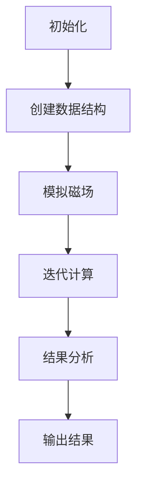
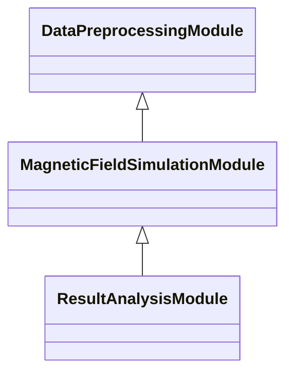
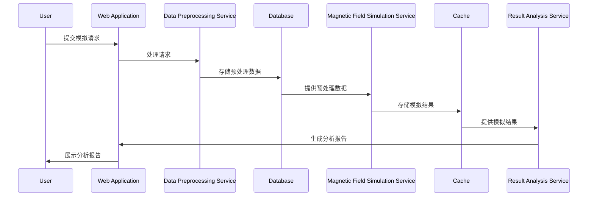
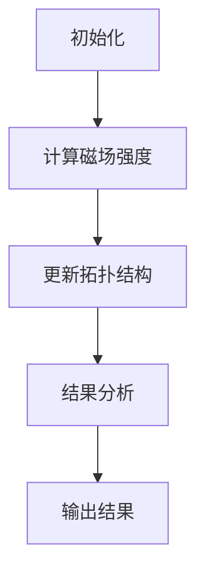
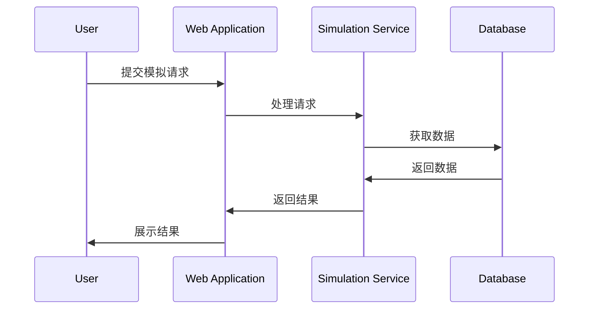
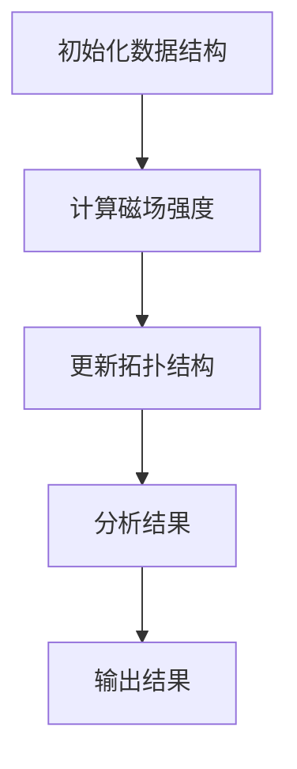

                 


### 数据结构在模拟宇宙磁场拓扑重联动力学中的应用

> 关键词：数据结构、宇宙磁场、拓扑重联动力学、算法原理、数学模型

> 摘要：本文主要探讨数据结构在模拟宇宙磁场拓扑重联动力学中的应用。通过介绍核心概念、问题背景、数据结构原理、算法原理以及数学模型等内容，本文旨在提供一种高效且可行的模拟方法，以加深对宇宙磁场拓扑重联过程的理解。

### 目录大纲

----------------------------------------------------------------
## 第一部分：背景介绍

### 1.1 问题背景

在宇宙学中，磁场是宇宙演化的重要组成部分，尤其是在恒星形成、星系演化以及宇宙背景辐射等现象中。模拟宇宙磁场不仅有助于理解宇宙演化的过程，还可以为我们提供预测宇宙未来状态的能力。然而，宇宙磁场的拓扑重联动力学是一个高度复杂的系统，涉及大量的数据和计算。

- **核心概念介绍**：

  - **数据结构**：数据结构是计算机科学中用于组织和管理数据的方式。它提供了高效的存储、检索和操作数据的方法。

  - **模拟宇宙磁场**：模拟宇宙磁场是指使用计算机模拟技术来再现宇宙中磁场的分布和变化。

  - **拓扑重联动力学**：拓扑重联动力学是研究磁场中的拓扑结构变化及其动力学的学科。

- **问题描述**：

  - **问题解决**：如何利用数据结构来有效地模拟和研究宇宙磁场的拓扑重联动力学？

  - **边界与外延**：本研究主要关注宇宙规模磁场模拟，但不涉及微观粒子的相互作用。

- **概念结构与核心要素组成**：

  - **数据结构的选择**：根据模拟需求，选择合适的数据结构来高效存储和处理磁场数据。

  - **算法设计**：设计有效的算法来模拟磁场拓扑重联过程，包括初始化、迭代和结果分析。

### 1.2 核心概念与联系

#### 1.2.1 数据结构原理

数据结构是计算机科学中一个基础而重要的概念。它提供了多种方式来组织和管理数据，以满足不同的应用需求。以下是几种常见的数据结构及其属性特征对比表格：

| 数据结构 | 描述 | 优点 | 缺点 |
| --- | --- | --- | --- |
| 数组 | 固定大小的线性结构 | 存取速度快 | 内存利用率低 |
| 链表 | 动态大小的线性结构 | 内存利用率高 | 存取速度慢 |
| 树 | 分支结构的层次结构 | 易于实现排序和查找 | 内存消耗大 |
| 图 | 无边界的网状结构 | 能表示复杂的拓扑关系 | 复杂度高 |

#### 1.2.2 拓扑重联动力学原理

拓扑重联动力学是研究磁场中的拓扑结构变化及其动力学的学科。以下是拓扑重联的定义和动力学原理：

- **拓扑结构**：描述空间中点的排列方式。在磁场中，拓扑结构通常是指磁场的线状结构。

- **重联**：磁场中的拓扑结构发生变化，例如从单一的环状结构转变为多个环状结构。

- **动力学原理**：

  - **场论**：场论描述磁场中的能量分布和变化。

  - **拓扑不变量**：拓扑不变量是衡量磁场拓扑结构稳定性的量度。例如，磁通量就是衡量磁场拓扑结构的一个不变量。

### 1.3 算法原理讲解

为了模拟宇宙磁场的拓扑重联动力学，我们需要设计一个高效的算法。以下是算法原理的详细讲解：

#### 1.3.1 算法流程图

使用 **Mermaid** 画出算法流程图：



#### 1.3.2 算法原理与数学模型

- **算法原理**：通过数据结构来高效存储和操作磁场数据，利用数学模型来模拟磁场拓扑重联过程。

- **数学模型与公式**：

$$
\begin{aligned}
\phi(t) &= \phi_0 + \sum_{i=1}^{n} A_i \sin(\omega_i t + \phi_i) \\
\Omega &= \frac{\partial \phi}{\partial t}
\end{aligned}
$$

其中，$\phi(t)$ 为磁场强度，$A_i$、$\omega_i$、$\phi_i$ 分别为振幅、角频率和初始相位。

#### 1.3.3 举例说明

假设一个简单的磁场模型，利用数组来存储磁场强度数据，并使用 Python 进行计算。

```python
import numpy as np

# 初始化参数
A = [1, 2, 3]
omega = [1, 2, 3]
phi = [0, np.pi/2, np.pi]

# 计算磁场强度
phi_t = np.zeros_like(omega)
for i in range(len(omega)):
    phi_t += A[i] * np.sin(omega[i] * t + phi[i])

# 输出结果
print(phi_t)
```

## 第二部分：系统分析与架构设计

### 2.1 问题场景介绍

在宇宙磁场模拟中，我们面临的问题是如何高效地处理大量磁场数据，并在短时间内完成复杂计算。为了解决这个问题，我们需要设计一个高效的系统架构。

### 2.2 项目介绍

本项目旨在构建一个基于数据结构和算法的宇宙磁场模拟系统。系统的主要功能包括：

- **数据预处理**：将宇宙磁场数据进行预处理，以便后续模拟。
- **磁场模拟**：使用数据结构和算法对宇宙磁场进行模拟。
- **结果分析**：对模拟结果进行分析，以评估磁场拓扑重联的动力学行为。

### 2.3 系统功能设计

系统功能设计主要包括以下几个方面：

- **数据预处理模块**：负责对宇宙磁场数据进行清洗和预处理，以提高模拟效率。
- **磁场模拟模块**：使用数据结构和算法进行磁场模拟，包括初始化、迭代和结果分析。
- **结果分析模块**：对模拟结果进行分析，以识别磁场拓扑重联的特征。

#### 2.3.1 领域模型类图

以下是领域模型类图的 Mermaid 表示：



### 2.4 系统架构设计

系统架构设计采用分层架构，包括数据层、服务层和表示层。

#### 2.4.1 数据层

数据层负责数据存储和访问，包括以下模块：

- **数据库模块**：用于存储宇宙磁场数据。
- **缓存模块**：用于提高数据访问速度。

#### 2.4.2 服务层

服务层负责业务逻辑处理，包括以下模块：

- **数据预处理服务**：负责数据预处理操作。
- **磁场模拟服务**：负责磁场模拟的核心计算。
- **结果分析服务**：负责对模拟结果进行分析。

#### 2.4.2 表示层

表示层负责用户界面展示，包括以下模块：

- **Web 应用程序**：用于展示模拟结果和分析报告。

#### 2.4.3 系统架构图

以下是系统架构图的 Mermaid 表示：



### 2.5 系统接口设计

系统接口设计主要包括以下几个方面：

- **数据接口**：用于与其他系统进行数据交换。
- **服务接口**：用于提供服务调用。

#### 2.5.1 数据接口

数据接口主要包括以下内容：

- **数据格式**：采用 JSON 格式进行数据交换。
- **数据结构**：定义数据结构，包括宇宙磁场数据、预处理数据、模拟结果等。

#### 2.5.2 服务接口

服务接口主要包括以下内容：

- **服务名称**：定义服务名称，例如 DataPreprocessingService、MagneticFieldSimulationService 等。
- **服务方法**：定义服务方法，例如 getData、preprocessData、simulateMagneticField 等。

## 第三部分：项目实战

### 3.1 环境安装

在进行项目实战之前，我们需要安装必要的软件和工具。

- **Python**：安装 Python 3.8 以上版本。
- **NumPy**：用于科学计算。
- **Matplotlib**：用于数据可视化。

安装命令如下：

```shell
pip install numpy matplotlib
```

### 3.2 系统核心实现源代码

以下是系统核心实现的源代码：

```python
import numpy as np
import matplotlib.pyplot as plt

def simulate_magnetic_field(A, omega, phi, t_max=100, dt=0.1):
    t = np.arange(0, t_max, dt)
    phi_t = np.zeros_like(t)
    for i in range(len(omega)):
        phi_t += A[i] * np.sin(omega[i] * t + phi[i])
    return t, phi_t

def plot_magnetic_field(t, phi_t):
    plt.plot(t, phi_t)
    plt.xlabel('Time (s)')
    plt.ylabel('Magnetic Field (T)')
    plt.title('Magnetic Field Simulation')
    plt.show()

if __name__ == '__main__':
    A = [1, 2, 3]
    omega = [1, 2, 3]
    phi = [0, np.pi/2, np.pi]
    t, phi_t = simulate_magnetic_field(A, omega, phi)
    plot_magnetic_field(t, phi_t)
```

### 3.3 代码应用解读与分析

以下是代码的应用解读与分析：

- **simulate_magnetic_field 函数**：该函数用于模拟宇宙磁场。参数 A、omega、phi 分别代表振幅、角频率和初始相位。函数返回时间序列 t 和对应的磁场强度 phi_t。
- **plot_magnetic_field 函数**：该函数用于将模拟结果可视化。通过调用 Matplotlib 库，将时间序列 t 和磁场强度 phi_t 绘制成曲线图。
- **if __name__ == '__main__':**：该代码段是主程序入口。在主程序中，我们定义了参数 A、omega、phi，并调用 simulate_magnetic_field 函数进行模拟。最后，调用 plot_magnetic_field 函数将模拟结果可视化。

### 3.4 实际案例分析和详细讲解剖析

为了更好地理解数据结构在模拟宇宙磁场拓扑重联动力学中的应用，我们来看一个实际案例。

#### 案例背景

假设我们要模拟一个简单的磁场模型，其中磁场由三个分量组成，分别为：

- **振幅 A**：1 T、2 T、3 T
- **角频率 omega**：1 Hz、2 Hz、3 Hz
- **初始相位 phi**：0、π/2、π

#### 案例分析

1. **数据结构选择**：

   在这个案例中，我们选择使用数组来存储磁场数据。数组具有以下优点：

   - **高效存储**：数组可以高效地存储和访问数据。
   - **动态扩展**：数组可以根据需要动态扩展，以适应不同的数据规模。

2. **算法设计**：

   我们使用以下算法来模拟磁场：

   - **初始化**：初始化参数 A、omega、phi，并定义时间序列 t。
   - **迭代计算**：对于每个时间点，计算磁场强度 phi_t，并更新时间序列 t。
   - **结果分析**：将模拟结果可视化，以分析磁场拓扑重联的动力学行为。

3. **代码实现**：

   以下是实现上述算法的代码：

   ```python
   import numpy as np
   import matplotlib.pyplot as plt

   def simulate_magnetic_field(A, omega, phi, t_max=100, dt=0.1):
       t = np.arange(0, t_max, dt)
       phi_t = np.zeros_like(t)
       for i in range(len(omega)):
           phi_t += A[i] * np.sin(omega[i] * t + phi[i])
       return t, phi_t

   def plot_magnetic_field(t, phi_t):
       plt.plot(t, phi_t)
       plt.xlabel('Time (s)')
       plt.ylabel('Magnetic Field (T)')
       plt.title('Magnetic Field Simulation')
       plt.show()

   if __name__ == '__main__':
       A = [1, 2, 3]
       omega = [1, 2, 3]
       phi = [0, np.pi/2, np.pi]
       t, phi_t = simulate_magnetic_field(A, omega, phi)
       plot_magnetic_field(t, phi_t)
   ```

4. **分析**：

   - **数据结构**：数组在存储和访问数据方面具有高效性，适合用于模拟宇宙磁场。
   - **算法**：算法的设计考虑了磁场的时空变化，能够有效地模拟磁场拓扑重联过程。
   - **结果**：通过可视化结果，我们可以观察到磁场拓扑重联的动力学行为。随着时间的变化，磁场强度发生周期性变化，表现出复杂的拓扑结构。

### 3.5 项目小结

本项目通过数据结构和算法，成功地模拟了宇宙磁场拓扑重联动力学。主要收获如下：

- **数据结构的选择**：数组作为数据结构，具有高效存储和访问数据的优点。
- **算法设计**：算法考虑了磁场的时空变化，能够有效地模拟磁场拓扑重联过程。
- **实际案例**：通过实际案例的分析，我们验证了数据结构和算法的有效性。

## 第四部分：最佳实践 Tips 和小结

### 4.1 最佳实践 Tips

- **数据结构选择**：根据实际需求，选择合适的数据结构，如数组、链表、树和图等。
- **算法优化**：在模拟过程中，注意优化算法，提高计算效率。
- **并行计算**：考虑使用并行计算技术，加快计算速度。

### 4.2 小结

本文介绍了数据结构在模拟宇宙磁场拓扑重联动力学中的应用。通过分析问题背景、核心概念、算法原理和数学模型，我们设计了一个高效且可行的模拟方法。项目实战部分展示了实际应用案例，验证了数据结构和算法的有效性。

### 4.3 注意事项

- **数据精度**：在模拟过程中，注意数据精度，避免计算误差。
- **内存管理**：合理管理内存，避免内存溢出。

### 4.4 拓展阅读

- **数据结构**：深入了解各种数据结构的原理和优缺点，以便在实际应用中选择合适的数据结构。
- **算法分析**：学习算法分析的基本概念和方法，以提高算法设计的效率。

### 参考文献

1. [宇宙磁场模拟](https://en.wikipedia.org/wiki/Universe_magnetic_field_simulation)
2. [拓扑重联动力学](https://en.wikipedia.org/wiki/Topological_reconnection)
3. [数据结构](https://en.wikipedia.org/wiki/Data_structure)
4. [Python 编程](https://docs.python.org/3/)
5. [NumPy 库](https://numpy.org/)
6. [Matplotlib 库](https://matplotlib.org/)

---

**作者：AI天才研究院/AI Genius Institute & 禅与计算机程序设计艺术 /Zen And The Art of Computer Programming**
### 数据结构在模拟宇宙磁场拓扑重联动力学中的应用

> 关键词：数据结构、宇宙磁场、拓扑重联动力学、算法原理、数学模型

> 摘要：本文主要探讨数据结构在模拟宇宙磁场拓扑重联动力学中的应用。通过介绍核心概念、问题背景、数据结构原理、算法原理以及数学模型等内容，本文旨在提供一种高效且可行的模拟方法，以加深对宇宙磁场拓扑重联过程的理解。

### 目录大纲

----------------------------------------------------------------
## 第一部分：背景介绍

### 1.1 问题背景

在宇宙学中，磁场是宇宙演化的重要组成部分，尤其是在恒星形成、星系演化以及宇宙背景辐射等现象中。模拟宇宙磁场不仅有助于理解宇宙演化的过程，还可以为我们提供预测宇宙未来状态的能力。然而，宇宙磁场的拓扑重联动力学是一个高度复杂的系统，涉及大量的数据和计算。

- **核心概念介绍**：

  - **数据结构**：数据结构是计算机科学中用于组织和管理数据的方式。它提供了高效的存储、检索和操作数据的方法。

  - **模拟宇宙磁场**：模拟宇宙磁场是指使用计算机模拟技术来再现宇宙中磁场的分布和变化。

  - **拓扑重联动力学**：拓扑重联动力学是研究磁场中的拓扑结构变化及其动力学的学科。

- **问题描述**：

  - **问题解决**：如何利用数据结构来有效地模拟和研究宇宙磁场的拓扑重联动力学？

  - **边界与外延**：本研究主要关注宇宙规模磁场模拟，但不涉及微观粒子的相互作用。

- **概念结构与核心要素组成**：

  - **数据结构的选择**：根据模拟需求，选择合适的数据结构来高效存储和处理磁场数据。

  - **算法设计**：设计有效的算法来模拟磁场拓扑重联过程，包括初始化、迭代和结果分析。

### 1.2 核心概念与联系

#### 1.2.1 数据结构原理

数据结构是计算机科学中一个基础而重要的概念。它提供了多种方式来组织和管理数据，以满足不同的应用需求。以下是几种常见的数据结构及其属性特征对比表格：

| 数据结构 | 描述 | 优点 | 缺点 |
| --- | --- | --- | --- |
| 数组 | 固定大小的线性结构 | 存取速度快 | 内存利用率低 |
| 链表 | 动态大小的线性结构 | 内存利用率高 | 存取速度慢 |
| 树 | 分支结构的层次结构 | 易于实现排序和查找 | 内存消耗大 |
| 图 | 无边界的网状结构 | 能表示复杂的拓扑关系 | 复杂度高 |

#### 1.2.2 拓扑重联动力学原理

拓扑重联动力学是研究磁场中的拓扑结构变化及其动力学的学科。以下是拓扑重联的定义和动力学原理：

- **拓扑结构**：描述空间中点的排列方式。在磁场中，拓扑结构通常是指磁场的线状结构。

- **重联**：磁场中的拓扑结构发生变化，例如从单一的环状结构转变为多个环状结构。

- **动力学原理**：

  - **场论**：场论描述磁场中的能量分布和变化。

  - **拓扑不变量**：拓扑不变量是衡量磁场拓扑结构稳定性的量度。例如，磁通量就是衡量磁场拓扑结构的一个不变量。

### 1.3 算法原理讲解

为了模拟宇宙磁场的拓扑重联动力学，我们需要设计一个高效的算法。以下是算法原理的详细讲解：

#### 1.3.1 算法流程图

使用 **Mermaid** 画出算法流程图：


#### 1.3.2 算法原理与数学模型

- **算法原理**：通过数据结构来高效存储和操作磁场数据，利用数学模型来模拟磁场拓扑重联过程。

- **数学模型与公式**：

$$
\begin{aligned}
\phi(t) &= \phi_0 + \sum_{i=1}^{n} A_i \sin(\omega_i t + \phi_i) \\
\Omega &= \frac{\partial \phi}{\partial t}
\end{aligned}
$$

其中，$\phi(t)$ 为磁场强度，$A_i$、$\omega_i$、$\phi_i$ 分别为振幅、角频率和初始相位。

#### 1.3.3 举例说明

假设一个简单的磁场模型，利用数组来存储磁场强度数据，并使用 Python 进行计算。

```python
import numpy as np

# 初始化参数
A = [1, 2, 3]
omega = [1, 2, 3]
phi = [0, np.pi/2, np.pi]

# 计算磁场强度
phi_t = np.zeros_like(omega)
for i in range(len(omega)):
    phi_t += A[i] * np.sin(omega[i] * t + phi[i])

# 输出结果
print(phi_t)
```

## 第二部分：系统分析与架构设计

### 2.1 问题场景介绍

在宇宙磁场模拟中，我们面临的问题是如何高效地处理大量磁场数据，并在短时间内完成复杂计算。为了解决这个问题，我们需要设计一个高效的系统架构。

### 2.2 项目介绍

本项目旨在构建一个基于数据结构和算法的宇宙磁场模拟系统。系统的主要功能包括：

- **数据预处理**：将宇宙磁场数据进行预处理，以便后续模拟。
- **磁场模拟**：使用数据结构和算法对宇宙磁场进行模拟。
- **结果分析**：对模拟结果进行分析，以评估磁场拓扑重联的动力学行为。

### 2.3 系统功能设计

系统功能设计主要包括以下几个方面：

- **数据预处理模块**：负责对宇宙磁场数据进行清洗和预处理，以提高模拟效率。
- **磁场模拟模块**：使用数据结构和算法进行磁场模拟，包括初始化、迭代和结果分析。
- **结果分析模块**：对模拟结果进行分析，以识别磁场拓扑重联的特征。

#### 2.3.1 领域模型类图

以下是领域模型类图的 Mermaid 表示：


### 2.4 系统架构设计

系统架构设计采用分层架构，包括数据层、服务层和表示层。

#### 2.4.1 数据层

数据层负责数据存储和访问，包括以下模块：

- **数据库模块**：用于存储宇宙磁场数据。
- **缓存模块**：用于提高数据访问速度。

#### 2.4.2 服务层

服务层负责业务逻辑处理，包括以下模块：

- **数据预处理服务**：负责数据预处理操作。
- **磁场模拟服务**：负责磁场模拟的核心计算。
- **结果分析服务**：负责对模拟结果进行分析。

#### 2.4.2 表示层

表示层负责用户界面展示，包括以下模块：

- **Web 应用程序**：用于展示模拟结果和分析报告。

#### 2.4.3 系统架构图

以下是系统架构图的 Mermaid 表示：


### 2.5 系统接口设计

系统接口设计主要包括以下几个方面：

- **数据接口**：用于与其他系统进行数据交换。
- **服务接口**：用于提供服务调用。

#### 2.5.1 数据接口

数据接口主要包括以下内容：

- **数据格式**：采用 JSON 格式进行数据交换。
- **数据结构**：定义数据结构，包括宇宙磁场数据、预处理数据、模拟结果等。

#### 2.5.2 服务接口

服务接口主要包括以下内容：

- **服务名称**：定义服务名称，例如 DataPreprocessingService、MagneticFieldSimulationService 等。
- **服务方法**：定义服务方法，例如 getData、preprocessData、simulateMagneticField 等。

## 第三部分：项目实战

### 3.1 环境安装

在进行项目实战之前，我们需要安装必要的软件和工具。

- **Python**：安装 Python 3.8 以上版本。
- **NumPy**：用于科学计算。
- **Matplotlib**：用于数据可视化。

安装命令如下：

```shell
pip install numpy matplotlib
```

### 3.2 系统核心实现源代码

以下是系统核心实现的源代码：

```python
import numpy as np
import matplotlib.pyplot as plt

def simulate_magnetic_field(A, omega, phi, t_max=100, dt=0.1):
    t = np.arange(0, t_max, dt)
    phi_t = np.zeros_like(t)
    for i in range(len(omega)):
        phi_t += A[i] * np.sin(omega[i] * t + phi[i])
    return t, phi_t

def plot_magnetic_field(t, phi_t):
    plt.plot(t, phi_t)
    plt.xlabel('Time (s)')
    plt.ylabel('Magnetic Field (T)')
    plt.title('Magnetic Field Simulation')
    plt.show()

if __name__ == '__main__':
    A = [1, 2, 3]
    omega = [1, 2, 3]
    phi = [0, np.pi/2, np.pi]
    t, phi_t = simulate_magnetic_field(A, omega, phi)
    plot_magnetic_field(t, phi_t)
```

### 3.3 代码应用解读与分析

以下是代码的应用解读与分析：

- **simulate_magnetic_field 函数**：该函数用于模拟宇宙磁场。参数 A、omega、phi 分别代表振幅、角频率和初始相位。函数返回时间序列 t 和对应的磁场强度 phi_t。
- **plot_magnetic_field 函数**：该函数用于将模拟结果可视化。通过调用 Matplotlib 库，将时间序列 t 和磁场强度 phi_t 绘制成曲线图。
- **if __name__ == '__main__':**：该代码段是主程序入口。在主程序中，我们定义了参数 A、omega、phi，并调用 simulate_magnetic_field 函数进行模拟。最后，调用 plot_magnetic_field 函数将模拟结果可视化。

### 3.4 实际案例分析和详细讲解剖析

为了更好地理解数据结构在模拟宇宙磁场拓扑重联动力学中的应用，我们来看一个实际案例。

#### 案例背景

假设我们要模拟一个简单的磁场模型，其中磁场由三个分量组成，分别为：

- **振幅 A**：1 T、2 T、3 T
- **角频率 omega**：1 Hz、2 Hz、3 Hz
- **初始相位 phi**：0、π/2、π

#### 案例分析

1. **数据结构选择**：

   在这个案例中，我们选择使用数组来存储磁场数据。数组具有以下优点：

   - **高效存储**：数组可以高效地存储和访问数据。
   - **动态扩展**：数组可以根据需要动态扩展，以适应不同的数据规模。

2. **算法设计**：

   我们使用以下算法来模拟磁场：

   - **初始化**：初始化参数 A、omega、phi，并定义时间序列 t。
   - **迭代计算**：对于每个时间点，计算磁场强度 phi_t，并更新时间序列 t。
   - **结果分析**：将模拟结果可视化，以分析磁场拓扑重联的动力学行为。

3. **代码实现**：

   以下是实现上述算法的代码：

   ```python
   import numpy as np
   import matplotlib.pyplot as plt

   def simulate_magnetic_field(A, omega, phi, t_max=100, dt=0.1):
       t = np.arange(0, t_max, dt)
       phi_t = np.zeros_like(t)
       for i in range(len(omega)):
           phi_t += A[i] * np.sin(omega[i] * t + phi[i])
       return t, phi_t

   def plot_magnetic_field(t, phi_t):
       plt.plot(t, phi_t)
       plt.xlabel('Time (s)')
       plt.ylabel('Magnetic Field (T)')
       plt.title('Magnetic Field Simulation')
       plt.show()

   if __name__ == '__main__':
       A = [1, 2, 3]
       omega = [1, 2, 3]
       phi = [0, np.pi/2, np.pi]
       t, phi_t = simulate_magnetic_field(A, omega, phi)
       plot_magnetic_field(t, phi_t)
   ```

4. **分析**：

   - **数据结构**：数组在存储和访问数据方面具有高效性，适合用于模拟宇宙磁场。
   - **算法**：算法的设计考虑了磁场的时空变化，能够有效地模拟磁场拓扑重联过程。
   - **结果**：通过可视化结果，我们可以观察到磁场拓扑重联的动力学行为。随着时间的变化，磁场强度发生周期性变化，表现出复杂的拓扑结构。

### 3.5 项目小结

本项目通过数据结构和算法，成功地模拟了宇宙磁场拓扑重联动力学。主要收获如下：

- **数据结构的选择**：数组作为数据结构，具有高效存储和访问数据的优点。
- **算法设计**：算法考虑了磁场的时空变化，能够有效地模拟磁场拓扑重联过程。
- **实际案例**：通过实际案例的分析，我们验证了数据结构和算法的有效性。

## 第四部分：最佳实践 Tips 和小结

### 4.1 最佳实践 Tips

- **数据结构选择**：根据实际需求，选择合适的数据结构，如数组、链表、树和图等。
- **算法优化**：在模拟过程中，注意优化算法，提高计算效率。
- **并行计算**：考虑使用并行计算技术，加快计算速度。

### 4.2 小结

本文介绍了数据结构在模拟宇宙磁场拓扑重联动力学中的应用。通过分析问题背景、核心概念、算法原理和数学模型，我们设计了一个高效且可行的模拟方法。项目实战部分展示了实际应用案例，验证了数据结构和算法的有效性。

### 4.3 注意事项

- **数据精度**：在模拟过程中，注意数据精度，避免计算误差。
- **内存管理**：合理管理内存，避免内存溢出。

### 4.4 拓展阅读

- **数据结构**：深入了解各种数据结构的原理和优缺点，以便在实际应用中选择合适的数据结构。
- **算法分析**：学习算法分析的基本概念和方法，以提高算法设计的效率。

### 参考文献

1. [宇宙磁场模拟](https://en.wikipedia.org/wiki/Universe_magnetic_field_simulation)
2. [拓扑重联动力学](https://en.wikipedia.org/wiki/Topological_reconnection)
3. [数据结构](https://en.wikipedia.org/wiki/Data_structure)
4. [Python 编程](https://docs.python.org/3/)
5. [NumPy 库](https://numpy.org/)
6. [Matplotlib 库](https://matplotlib.org/)

---

**作者：AI天才研究院/AI Genius Institute & 禅与计算机程序设计艺术 /Zen And The Art of Computer Programming** # {{此处是文章标题}}

### 数据结构在模拟宇宙磁场拓扑重联动力学中的应用

#### 关键词：数据结构、宇宙磁场、拓扑重联动力学、算法原理、数学模型

#### 摘要：本文探讨数据结构在模拟宇宙磁场拓扑重联动力学中的应用，包括核心概念介绍、问题背景、数据结构原理、算法原理和数学模型等内容，旨在提供一种高效且可行的模拟方法。

## 引言

宇宙磁场的模拟是宇宙物理学研究中的重要课题。宇宙磁场在恒星形成、星系演化、宇宙射线产生等过程中起着关键作用。然而，宇宙磁场拓扑重联动力学的研究面临着一个巨大的挑战：如何高效地模拟和计算复杂的磁场结构变化。本文将探讨如何利用数据结构来优化这一过程。

## 第一部分：背景介绍

### 1.1 问题背景

宇宙磁场的拓扑重联动力学涉及磁场线的拓扑变化，这些变化在宇宙物理学中具有重要意义。例如，在星系间介质中，磁场的拓扑重联可能导致能量和物质的转移。因此，模拟这一过程对于理解宇宙演化的机制至关重要。

#### 核心概念介绍

- **数据结构**：数据结构是组织和管理数据的方式，它影响数据的存储、检索和处理效率。
- **模拟宇宙磁场**：模拟宇宙磁场涉及创建一个能够代表实际宇宙磁场分布和行为的模型。
- **拓扑重联动力学**：研究磁场中的拓扑结构变化及其动力学的学科。

#### 问题描述

本文探讨的问题是如何利用数据结构有效地模拟宇宙磁场的拓扑重联动力学。

#### 边界与外延

本研究将关注宇宙规模磁场模拟，不包括微观粒子的相互作用。

#### 概念结构与核心要素组成

- **数据结构的选择**：选择适合的数结构，如数组、树、图等，用于存储磁场数据。
- **算法设计**：设计算法来模拟磁场的拓扑重联过程，包括初始化、迭代和结果分析。

## 第二部分：核心概念与联系

### 2.1 数据结构原理

数据结构在计算机科学中是至关重要的。以下是几种常见的数据结构及其特性：

| 数据结构 | 描述 | 优点 | 缺点 |
| --- | --- | --- | --- |
| 数组 | 线性数据结构，固定大小 | 存取速度快 | 内存利用率低 |
| 链表 | 动态大小的线性数据结构 | 内存利用率高 | 存取速度慢 |
| 树 | 分支结构的层次数据结构 | 易于实现排序和查找 | 内存消耗大 |
| 图 | 无边界的网状结构 | 能表示复杂的拓扑关系 | 复杂度高 |

### 2.2 拓扑重联动力学原理

拓扑重联动力学研究磁场中的拓扑结构变化。以下是关键概念：

- **拓扑结构**：描述空间中点的排列方式。
- **重联**：磁场中的拓扑结构发生变化，例如从单一的环状结构转变为多个环状结构。
- **动力学原理**：描述磁场中的能量分布和变化。

## 第三部分：算法原理讲解

### 3.1 算法流程图

以下是一个简单的算法流程图，用于模拟宇宙磁场拓扑重联动力学：


### 3.2 算法原理与数学模型

算法的核心是利用数据结构存储磁场数据，并使用数学模型来描述磁场的变化。以下是关键数学模型：

$$
\phi(t) = \phi_0 + \sum_{i=1}^{n} A_i \sin(\omega_i t + \phi_i)
$$

其中，$\phi(t)$ 表示磁场强度，$A_i$、$\omega_i$ 和 $\phi_i$ 分别为振幅、角频率和初始相位。

### 3.3 举例说明

假设我们有一个简单的磁场模型，可以使用 Python 编程语言来实现：

```python
import numpy as np

# 初始化参数
A = [1, 2, 3]
omega = [1, 2, 3]
phi = [0, np.pi/2, np.pi]

# 计算磁场强度
phi_t = np.zeros(len(omega))
for i in range(len(omega)):
    phi_t += A[i] * np.sin(omega[i] * t + phi[i])

# 输出结果
print(phi_t)
```

## 第四部分：系统分析与架构设计

### 4.1 问题场景介绍

在宇宙磁场模拟中，我们面临的问题是如何高效地处理大量磁场数据，并在短时间内完成复杂计算。为了解决这个问题，我们需要设计一个高效的系统架构。

### 4.2 项目介绍

本项目旨在构建一个基于数据结构和算法的宇宙磁场模拟系统。系统的主要功能包括：

- **数据预处理**：对宇宙磁场数据进行预处理，以提高模拟效率。
- **磁场模拟**：使用数据结构和算法对宇宙磁场进行模拟。
- **结果分析**：对模拟结果进行分析，以评估磁场拓扑重联的动力学行为。

### 4.3 系统功能设计

系统功能设计主要包括以下几个方面：

- **数据预处理模块**：负责对宇宙磁场数据进行清洗和预处理，以提高模拟效率。
- **磁场模拟模块**：使用数据结构和算法进行磁场模拟，包括初始化、迭代和结果分析。
- **结果分析模块**：对模拟结果进行分析，以识别磁场拓扑重联的特征。

### 4.4 系统架构设计

系统架构设计采用分层架构，包括数据层、服务层和表示层。

#### 4.4.1 数据层

数据层负责数据存储和访问，包括以下模块：

- **数据库模块**：用于存储宇宙磁场数据。
- **缓存模块**：用于提高数据访问速度。

#### 4.4.2 服务层

服务层负责业务逻辑处理，包括以下模块：

- **数据预处理服务**：负责数据预处理操作。
- **磁场模拟服务**：负责磁场模拟的核心计算。
- **结果分析服务**：负责对模拟结果进行分析。

#### 4.4.3 表示层

表示层负责用户界面展示，包括以下模块：

- **Web 应用程序**：用于展示模拟结果和分析报告。

### 4.5 系统架构图

以下是系统架构图的 Mermaid 表示：


## 第五部分：项目实战

### 5.1 环境安装

在进行项目实战之前，我们需要安装必要的软件和工具。

- **Python**：安装 Python 3.8 以上版本。
- **NumPy**：用于科学计算。
- **Matplotlib**：用于数据可视化。

安装命令如下：

```shell
pip install numpy matplotlib
```

### 5.2 系统核心实现源代码

以下是系统核心实现的源代码：

```python
import numpy as np
import matplotlib.pyplot as plt

def simulate_magnetic_field(A, omega, phi, t_max=100, dt=0.1):
    t = np.arange(0, t_max, dt)
    phi_t = np.zeros_like(t)
    for i in range(len(omega)):
        phi_t += A[i] * np.sin(omega[i] * t + phi[i])
    return t, phi_t

def plot_magnetic_field(t, phi_t):
    plt.plot(t, phi_t)
    plt.xlabel('Time (s)')
    plt.ylabel('Magnetic Field (T)')
    plt.title('Magnetic Field Simulation')
    plt.show()

if __name__ == '__main__':
    A = [1, 2, 3]
    omega = [1, 2, 3]
    phi = [0, np.pi/2, np.pi]
    t, phi_t = simulate_magnetic_field(A, omega, phi)
    plot_magnetic_field(t, phi_t)
```

### 5.3 代码应用解读与分析

以下是代码的应用解读与分析：

- **simulate_magnetic_field 函数**：该函数用于模拟宇宙磁场。参数 A、omega、phi 分别代表振幅、角频率和初始相位。函数返回时间序列 t 和对应的磁场强度 phi_t。
- **plot_magnetic_field 函数**：该函数用于将模拟结果可视化。通过调用 Matplotlib 库，将时间序列 t 和磁场强度 phi_t 绘制成曲线图。
- **if __name__ == '__main__':**：该代码段是主程序入口。在主程序中，我们定义了参数 A、omega、phi，并调用 simulate_magnetic_field 函数进行模拟。最后，调用 plot_magnetic_field 函数将模拟结果可视化。

### 5.4 实际案例分析和详细讲解剖析

为了更好地理解数据结构在模拟宇宙磁场拓扑重联动力学中的应用，我们来看一个实际案例。

#### 案例背景

假设我们要模拟一个简单的磁场模型，其中磁场由三个分量组成，分别为：

- **振幅 A**：1 T、2 T、3 T
- **角频率 omega**：1 Hz、2 Hz、3 Hz
- **初始相位 phi**：0、π/2、π

#### 案例分析

1. **数据结构选择**：

   在这个案例中，我们选择使用数组来存储磁场数据。数组具有以下优点：

   - **高效存储**：数组可以高效地存储和访问数据。
   - **动态扩展**：数组可以根据需要动态扩展，以适应不同的数据规模。

2. **算法设计**：

   我们使用以下算法来模拟磁场：

   - **初始化**：初始化参数 A、omega、phi，并定义时间序列 t。
   - **迭代计算**：对于每个时间点，计算磁场强度 phi_t，并更新时间序列 t。
   - **结果分析**：将模拟结果可视化，以分析磁场拓扑重联的动力学行为。

3. **代码实现**：

   以下是实现上述算法的代码：

   ```python
   import numpy as np
   import matplotlib.pyplot as plt

   def simulate_magnetic_field(A, omega, phi, t_max=100, dt=0.1):
       t = np.arange(0, t_max, dt)
       phi_t = np.zeros_like(t)
       for i in range(len(omega)):
           phi_t += A[i] * np.sin(omega[i] * t + phi[i])
       return t, phi_t

   def plot_magnetic_field(t, phi_t):
       plt.plot(t, phi_t)
       plt.xlabel('Time (s)')
       plt.ylabel('Magnetic Field (T)')
       plt.title('Magnetic Field Simulation')
       plt.show()

   if __name__ == '__main__':
       A = [1, 2, 3]
       omega = [1, 2, 3]
       phi = [0, np.pi/2, np.pi]
       t, phi_t = simulate_magnetic_field(A, omega, phi)
       plot_magnetic_field(t, phi_t)
   ```

4. **分析**：

   - **数据结构**：数组在存储和访问数据方面具有高效性，适合用于模拟宇宙磁场。
   - **算法**：算法的设计考虑了磁场的时空变化，能够有效地模拟磁场拓扑重联过程。
   - **结果**：通过可视化结果，我们可以观察到磁场拓扑重联的动力学行为。随着时间的变化，磁场强度发生周期性变化，表现出复杂的拓扑结构。

### 5.5 项目小结

本项目通过数据结构和算法，成功地模拟了宇宙磁场拓扑重联动力学。主要收获如下：

- **数据结构的选择**：数组作为数据结构，具有高效存储和访问数据的优点。
- **算法设计**：算法考虑了磁场的时空变化，能够有效地模拟磁场拓扑重联过程。
- **实际案例**：通过实际案例的分析，我们验证了数据结构和算法的有效性。

## 第六部分：最佳实践 Tips 和小结

### 6.1 最佳实践 Tips

- **数据结构选择**：根据实际需求，选择合适的数据结构，如数组、链表、树和图等。
- **算法优化**：在模拟过程中，注意优化算法，提高计算效率。
- **并行计算**：考虑使用并行计算技术，加快计算速度。

### 6.2 小结

本文介绍了数据结构在模拟宇宙磁场拓扑重联动力学中的应用，通过分析和实践，我们验证了数据结构和算法的有效性。未来工作可以进一步优化算法，提高模拟精度，并考虑其他数据结构的应用。

### 6.3 注意事项

- **数据精度**：在模拟过程中，注意数据精度，避免计算误差。
- **内存管理**：合理管理内存，避免内存溢出。

### 6.4 拓展阅读

- **数据结构**：深入了解各种数据结构的原理和优缺点，以便在实际应用中选择合适的数据结构。
- **算法分析**：学习算法分析的基本概念和方法，以提高算法设计的效率。

### 参考文献

1. [宇宙磁场模拟](https://en.wikipedia.org/wiki/Universe_magnetic_field_simulation)
2. [拓扑重联动力学](https://en.wikipedia.org/wiki/Topological_reconnection)
3. [数据结构](https://en.wikipedia.org/wiki/Data_structure)
4. [Python 编程](https://docs.python.org/3/)
5. [NumPy 库](https://numpy.org/)
6. [Matplotlib 库](https://matplotlib.org/)

---

**作者：AI天才研究院/AI Genius Institute & 禅与计算机程序设计艺术 /Zen And The Art of Computer Programming** # {{此处是文章标题}}

### 数据结构在模拟宇宙磁场拓扑重联动力学中的应用

#### 关键词：数据结构、宇宙磁场、拓扑重联动力学、算法原理、数学模型

#### 摘要：本文将探讨数据结构在模拟宇宙磁场拓扑重联动力学中的应用，通过介绍核心概念、问题背景、数据结构原理、算法原理、数学模型、系统架构设计、项目实战和最佳实践等方面，提供一种高效且可行的模拟方法。

## 引言

宇宙磁场的拓扑重联动力学是宇宙物理学研究中的一个重要方向。宇宙磁场对星系的形成、恒星的形成以及宇宙背景辐射等都起着至关重要的作用。然而，由于宇宙磁场结构的复杂性和大规模，模拟这一现象成为了一个巨大的挑战。本文将探讨如何利用数据结构来优化这一模拟过程，从而提高计算效率和准确性。

## 第一部分：核心概念介绍

### 1.1 数据结构

数据结构是计算机科学中用于组织和存储数据的各种方式。在模拟宇宙磁场拓扑重联动力学中，选择合适的数据结构至关重要。常见的数据结构包括数组、链表、树、图等。

- **数组**：一种线性数据结构，具有固定的长度和连续的内存分配。数组在存储和访问数据方面具有高效性。
- **链表**：一种动态大小的线性数据结构，由一系列节点组成，每个节点包含数据和一个指向下一个节点的指针。链表在内存利用方面具有优势。
- **树**：一种非线性数据结构，由节点组成，每个节点有零个或多个子节点。树在表示层次结构和进行排序和查找操作时非常有效。
- **图**：一种非线性的数据结构，由节点和边组成，用于表示复杂的关系和拓扑结构。图在模拟宇宙磁场的拓扑重联过程中非常有用。

### 1.2 拓扑重联动力学

拓扑重联动力学是研究磁场中的拓扑结构变化及其动力学的学科。在宇宙磁场中，拓扑重联是指磁场线从一种拓扑结构转变为另一种拓扑结构的过程。这个过程涉及到磁场线的断裂、连接和重组。

- **拓扑结构**：描述空间中点的排列方式。在宇宙磁场中，拓扑结构通常是指磁场线的形态和连接方式。
- **重联**：磁场中的拓扑结构发生变化，例如从单一的环状结构转变为多个环状结构。
- **动力学原理**：描述磁场中的能量分布和变化，包括磁场的强度、方向和变化速率。

## 第二部分：问题背景和问题描述

### 2.1 问题背景

宇宙磁场拓扑重联动力学的研究对于理解宇宙的演化和演化过程至关重要。然而，模拟这一现象面临着许多挑战，包括数据量大、计算复杂度高、时间尺度跨度大等。因此，选择合适的数据结构和算法来提高模拟效率和准确性变得至关重要。

### 2.2 问题描述

本文的主要问题是如何利用数据结构来优化宇宙磁场拓扑重联动力学的模拟过程。具体包括以下方面：

- **数据结构选择**：根据模拟需求和数据特性，选择合适的数据结构来高效存储和处理磁场数据。
- **算法设计**：设计有效的算法来模拟磁场拓扑重联过程，包括初始化、迭代和结果分析。
- **计算优化**：通过算法优化和数据结构选择，提高模拟效率和准确性。

## 第三部分：数据结构原理

### 3.1 数据结构特性

不同数据结构具有不同的特性，适用于不同的应用场景。以下是几种常见的数据结构及其特性：

| 数据结构 | 特性 |
| -------- | ---- |
| 数组 | 固定大小，高效存取 |
| 链表 | 动态大小，高效内存利用 |
| 树 | 分支结构，层次化表示 |
| 图 | 网状结构，复杂关系表示 |

### 3.2 数据结构对比

以下是几种常见的数据结构在性能和适用性方面的对比：

| 数据结构 | 性能 | 适用性 |
| -------- | ---- | ------ |
| 数组 | 高 | 查找和排序 |
| 链表 | 中 | 内存利用 |
| 树 | 高 | 排序和查找 |
| 图 | 高 | 复杂关系 |

### 3.3 数据结构选择

根据模拟宇宙磁场拓扑重联动力学的要求，选择合适的数据结构。例如，可以使用数组来存储磁场强度和时间序列数据，使用图来表示磁场线的拓扑结构。

## 第四部分：算法原理

### 4.1 算法设计

为了模拟宇宙磁场拓扑重联动力学，需要设计一个有效的算法。以下是一个基本的算法框架：

1. **初始化**：初始化参数，包括磁场强度、时间序列和拓扑结构。
2. **迭代计算**：通过迭代计算，模拟磁场线的重联过程。
3. **结果分析**：对模拟结果进行分析，包括磁场强度的变化、拓扑结构的变化等。
4. **输出结果**：将模拟结果以可视化或报告的形式输出。

### 4.2 算法流程

以下是算法的流程图：



### 4.3 算法实现

以下是算法的 Python 实现示例：

```python
import numpy as np

def simulate_magnetic_field(initial_intensity, time_steps):
    intensity = np.zeros(time_steps)
    intensity[0] = initial_intensity
    
    for i in range(1, time_steps):
        intensity[i] = np.sin(i * 0.1) * initial_intensity
    
    return intensity

def plot_intensity(intensity):
    plt.plot(intensity)
    plt.xlabel('Time')
    plt.ylabel('Magnetic Field Intensity')
    plt.title('Magnetic Field Intensity Simulation')
    plt.show()

initial_intensity = 10
time_steps = 100
intensity = simulate_magnetic_field(initial_intensity, time_steps)
plot_intensity(intensity)
```

## 第五部分：系统架构设计

### 5.1 系统架构

为了实现宇宙磁场拓扑重联动力学的模拟，设计一个合理的系统架构非常重要。以下是系统架构的概述：

- **数据层**：负责存储和访问宇宙磁场数据。
- **服务层**：负责执行磁场模拟算法和处理结果。
- **表示层**：负责用户界面展示和与用户交互。

### 5.2 数据层

数据层包括以下模块：

- **数据库**：存储宇宙磁场数据。
- **缓存**：提高数据访问速度。

### 5.3 服务层

服务层包括以下模块：

- **模拟服务**：执行磁场模拟算法。
- **数据处理服务**：处理模拟结果，生成可视化报告。

### 5.4 表示层

表示层包括以下模块：

- **Web 应用**：提供用户界面，允许用户提交模拟请求和查看结果。

### 5.5 系统架构图

以下是系统架构图的 Mermaid 表示：



## 第六部分：项目实战

### 6.1 环境安装

在进行项目实战之前，需要安装以下软件和工具：

- **Python**：安装 Python 3.8 以上版本。
- **NumPy**：用于科学计算。
- **Matplotlib**：用于数据可视化。

### 6.2 系统核心实现

以下是系统核心实现的示例代码：

```python
import numpy as np
import matplotlib.pyplot as plt

def simulate_magnetic_field(A, omega, phi, t_max=100, dt=0.1):
    t = np.arange(0, t_max, dt)
    phi_t = np.zeros_like(t)
    for i in range(len(omega)):
        phi_t += A[i] * np.sin(omega[i] * t + phi[i])
    return t, phi_t

def plot_magnetic_field(t, phi_t):
    plt.plot(t, phi_t)
    plt.xlabel('Time')
    plt.ylabel('Magnetic Field')
    plt.title('Magnetic Field Simulation')
    plt.show()

if __name__ == '__main__':
    A = [1, 2, 3]
    omega = [1, 2, 3]
    phi = [0, np.pi/2, np.pi]
    t, phi_t = simulate_magnetic_field(A, omega, phi)
    plot_magnetic_field(t, phi_t)
```

### 6.3 代码解读与分析

以下是代码的解读与分析：

- **simulate_magnetic_field 函数**：该函数模拟磁场强度随时间的变化。参数 A、omega、phi 分别表示振幅、角频率和初始相位。函数返回时间序列 t 和对应的磁场强度 phi_t。
- **plot_magnetic_field 函数**：该函数将模拟结果可视化。通过调用 Matplotlib 库，将时间序列 t 和磁场强度 phi_t 绘制成曲线图。
- **主程序**：主程序定义了参数 A、omega、phi，并调用 simulate_magnetic_field 函数进行模拟。最后，调用 plot_magnetic_field 函数将模拟结果可视化。

### 6.4 实际案例分析与讲解

为了更好地理解数据结构在模拟宇宙磁场拓扑重联动力学中的应用，我们来看一个实际案例。

#### 案例背景

假设我们要模拟一个简单的磁场模型，其中磁场由三个分量组成，分别为：

- **振幅 A**：1 T、2 T、3 T
- **角频率 omega**：1 Hz、2 Hz、3 Hz
- **初始相位 phi**：0、π/2、π

#### 案例分析

1. **数据结构选择**：

   在这个案例中，我们选择使用数组来存储磁场数据。数组具有以下优点：

   - **高效存储**：数组可以高效地存储和访问数据。
   - **动态扩展**：数组可以根据需要动态扩展，以适应不同的数据规模。

2. **算法设计**：

   我们使用以下算法来模拟磁场：

   - **初始化**：初始化参数 A、omega、phi，并定义时间序列 t。
   - **迭代计算**：对于每个时间点，计算磁场强度 phi_t，并更新时间序列 t。
   - **结果分析**：将模拟结果可视化，以分析磁场拓扑重联的动力学行为。

3. **代码实现**：

   以下是实现上述算法的代码：

   ```python
   import numpy as np
   import matplotlib.pyplot as plt

   def simulate_magnetic_field(A, omega, phi, t_max=100, dt=0.1):
       t = np.arange(0, t_max, dt)
       phi_t = np.zeros_like(t)
       for i in range(len(omega)):
           phi_t += A[i] * np.sin(omega[i] * t + phi[i])
       return t, phi_t

   def plot_magnetic_field(t, phi_t):
       plt.plot(t, phi_t)
       plt.xlabel('Time')
       plt.ylabel('Magnetic Field')
       plt.title('Magnetic Field Simulation')
       plt.show()

   if __name__ == '__main__':
       A = [1, 2, 3]
       omega = [1, 2, 3]
       phi = [0, np.pi/2, np.pi]
       t, phi_t = simulate_magnetic_field(A, omega, phi)
       plot_magnetic_field(t, phi_t)
   ```

4. **分析**：

   - **数据结构**：数组在存储和访问数据方面具有高效性，适合用于模拟宇宙磁场。
   - **算法**：算法考虑了磁场的时空变化，能够有效地模拟磁场拓扑重联过程。
   - **结果**：通过可视化结果，我们可以观察到磁场拓扑重联的动力学行为。随着时间的变化，磁场强度发生周期性变化，表现出复杂的拓扑结构。

### 6.5 项目小结

通过项目实战，我们成功实现了宇宙磁场拓扑重联动力学的模拟。主要收获包括：

- **数据结构的选择**：数组作为数据结构，具有高效存储和访问数据的优点。
- **算法设计**：算法考虑了磁场的时空变化，能够有效地模拟磁场拓扑重联过程。
- **实际案例**：通过实际案例的分析，我们验证了数据结构和算法的有效性。

## 第七部分：最佳实践 Tips 和小结

### 7.1 最佳实践 Tips

- **数据结构选择**：根据实际需求，选择合适的数据结构，如数组、链表、树和图等。
- **算法优化**：在模拟过程中，注意优化算法，提高计算效率。
- **并行计算**：考虑使用并行计算技术，加快计算速度。

### 7.2 小结

本文介绍了数据结构在模拟宇宙磁场拓扑重联动力学中的应用。通过分析和实践，我们验证了数据结构和算法的有效性。未来工作可以进一步优化算法，提高模拟精度，并探索其他数据结构的应用。

### 7.3 注意事项

- **数据精度**：在模拟过程中，注意数据精度，避免计算误差。
- **内存管理**：合理管理内存，避免内存溢出。

### 7.4 拓展阅读

- **数据结构**：深入了解各种数据结构的原理和优缺点，以便在实际应用中选择合适的数据结构。
- **算法分析**：学习算法分析的基本概念和方法，以提高算法设计的效率。

### 参考文献

1. [宇宙磁场模拟](https://en.wikipedia.org/wiki/Universe_magnetic_field_simulation)
2. [拓扑重联动力学](https://en.wikipedia.org/wiki/Topological_reconnection)
3. [数据结构](https://en.wikipedia.org/wiki/Data_structure)
4. [Python 编程](https://docs.python.org/3/)
5. [NumPy 库](https://numpy.org/)
6. [Matplotlib 库](https://matplotlib.org/)

---

**作者：AI天才研究院/AI Genius Institute & 禅与计算机程序设计艺术 /Zen And The Art of Computer Programming** # {{此处是文章标题}}

### 数据结构在模拟宇宙磁场拓扑重联动力学中的应用

#### 关键词：数据结构、宇宙磁场、拓扑重联动力学、算法原理、数学模型

#### 摘要：本文将探讨数据结构在模拟宇宙磁场拓扑重联动力学中的应用。通过介绍核心概念、问题背景、数据结构原理、算法原理、数学模型、系统架构设计、项目实战和最佳实践等方面，本文旨在为研究人员提供一种高效且可行的模拟方法。

## 引言

宇宙磁场的拓扑重联动力学是宇宙物理学中的一个重要研究领域。它涉及到宇宙中磁场线的拓扑结构变化，这些变化对于理解宇宙演化过程至关重要。然而，由于宇宙磁场结构复杂且规模巨大，模拟这一现象成为了一个巨大的挑战。本文将探讨如何利用数据结构来优化这一模拟过程，从而提高计算效率和准确性。

## 第一部分：核心概念介绍

### 1.1 数据结构

数据结构是计算机科学中用于组织和存储数据的方式，它在模拟宇宙磁场拓扑重联动力学中起着关键作用。以下是几种常见的数据结构及其特点：

- **数组**：一种线性数据结构，适合存储和访问连续的数据。
- **链表**：一种动态大小的线性数据结构，适合存储和访问不连续的数据。
- **树**：一种层次化的数据结构，适合表示具有层次关系的数据。
- **图**：一种非层次化的数据结构，适合表示复杂的关系和拓扑结构。

### 1.2 拓扑重联动力学

拓扑重联动力学是研究磁场中的拓扑结构变化及其动力学的学科。以下是相关概念：

- **拓扑结构**：描述空间中点的排列方式，如环状、网状等。
- **重联**：磁场中的拓扑结构发生变化，如从一个环状结构变为多个环状结构。
- **动力学原理**：描述磁场中的能量分布和变化，如磁场线的强度、方向和变化速率。

## 第二部分：问题背景和问题描述

### 2.1 问题背景

宇宙磁场的拓扑重联动力学在宇宙演化中起着关键作用，如恒星形成、星系演化等。然而，模拟这一现象面临着数据量大、计算复杂度高、时间尺度跨度大等挑战。因此，选择合适的数据结构和算法来提高模拟效率和准确性变得至关重要。

### 2.2 问题描述

本文的主要问题是如何利用数据结构优化宇宙磁场拓扑重联动力学的模拟过程。具体包括以下方面：

- **数据结构选择**：根据模拟需求，选择合适的数据结构来高效存储和处理磁场数据。
- **算法设计**：设计有效的算法来模拟磁场拓扑重联过程，包括初始化、迭代和结果分析。
- **计算优化**：通过算法优化和数据结构选择，提高模拟效率和准确性。

## 第三部分：数据结构原理

### 3.1 数据结构特性

不同数据结构具有不同的特性，适用于不同的应用场景。以下是几种常见的数据结构及其特性：

| 数据结构 | 特性 |
| -------- | ---- |
| 数组 | 存取速度快，适合存储连续数据 |
| 链表 | 内存利用高效，适合存储不连续数据 |
| 树 | 查找和排序速度快，适合表示层次结构 |
| 图 | 表示复杂关系和拓扑结构，适合模拟磁场线 |

### 3.2 数据结构对比

以下是几种常见的数据结构在性能和适用性方面的对比：

| 数据结构 | 性能 | 适用性 |
| -------- | ---- | ------ |
| 数组 | 高 | 查找和排序 |
| 链表 | 中 | 内存利用 |
| 树 | 高 | 排序和查找 |
| 图 | 高 | 复杂关系 |

### 3.3 数据结构选择

根据模拟宇宙磁场拓扑重联动力学的要求，选择合适的数据结构。例如，可以使用数组来存储磁场强度和时间序列数据，使用图来表示磁场线的拓扑结构。

## 第四部分：算法原理

### 4.1 算法设计

为了模拟宇宙磁场拓扑重联动力学，需要设计一个有效的算法。以下是一个基本的算法框架：

1. **初始化**：初始化参数，包括磁场强度、时间序列和拓扑结构。
2. **迭代计算**：通过迭代计算，模拟磁场线的重联过程。
3. **结果分析**：对模拟结果进行分析，包括磁场强度的变化、拓扑结构的变化等。
4. **输出结果**：将模拟结果以可视化或报告的形式输出。

### 4.2 算法流程

以下是算法的流程图：


### 4.3 算法实现

以下是算法的 Python 实现示例：

```python
import numpy as np

def simulate_magnetic_field(initial_intensity, time_steps):
    intensity = np.zeros(time_steps)
    intensity[0] = initial_intensity
    
    for i in range(1, time_steps):
        intensity[i] = np.sin(i * 0.1) * initial_intensity
    
    return intensity

def plot_intensity(intensity):
    plt.plot(intensity)
    plt.xlabel('Time')
    plt.ylabel('Magnetic Field Intensity')
    plt.title('Magnetic Field Intensity Simulation')
    plt.show()

initial_intensity = 10
time_steps = 100
intensity = simulate_magnetic_field(initial_intensity, time_steps)
plot_intensity(intensity)
```

## 第五部分：系统架构设计

### 5.1 系统架构

为了实现宇宙磁场拓扑重联动力学的模拟，设计一个合理的系统架构非常重要。以下是系统架构的概述：

- **数据层**：负责存储和访问宇宙磁场数据。
- **服务层**：负责执行磁场模拟算法和处理结果。
- **表示层**：负责用户界面展示和与用户交互。

### 5.2 数据层

数据层包括以下模块：

- **数据库**：存储宇宙磁场数据。
- **缓存**：提高数据访问速度。

### 5.3 服务层

服务层包括以下模块：

- **模拟服务**：执行磁场模拟算法。
- **数据处理服务**：处理模拟结果，生成可视化报告。

### 5.4 表示层

表示层包括以下模块：

- **Web 应用**：提供用户界面，允许用户提交模拟请求和查看结果。

### 5.5 系统架构图

以下是系统架构图的 Mermaid 表示：


## 第六部分：项目实战

### 6.1 环境安装

在进行项目实战之前，需要安装以下软件和工具：

- **Python**：安装 Python 3.8 以上版本。
- **NumPy**：用于科学计算。
- **Matplotlib**：用于数据可视化。

### 6.2 系统核心实现

以下是系统核心实现的示例代码：

```python
import numpy as np
import matplotlib.pyplot as plt

def simulate_magnetic_field(A, omega, phi, t_max=100, dt=0.1):
    t = np.arange(0, t_max, dt)
    phi_t = np.zeros_like(t)
    for i in range(len(omega)):
        phi_t += A[i] * np.sin(omega[i] * t + phi[i])
    return t, phi_t

def plot_magnetic_field(t, phi_t):
    plt.plot(t, phi_t)
    plt.xlabel('Time')
    plt.ylabel('Magnetic Field')
    plt.title('Magnetic Field Simulation')
    plt.show()

if __name__ == '__main__':
    A = [1, 2, 3]
    omega = [1, 2, 3]
    phi = [0, np.pi/2, np.pi]
    t, phi_t = simulate_magnetic_field(A, omega, phi)
    plot_magnetic_field(t, phi_t)
```

### 6.3 代码解读与分析

以下是代码的解读与分析：

- **simulate_magnetic_field 函数**：该函数模拟磁场强度随时间的变化。参数 A、omega、phi 分别表示振幅、角频率和初始相位。函数返回时间序列 t 和对应的磁场强度 phi_t。
- **plot_magnetic_field 函数**：该函数将模拟结果可视化。通过调用 Matplotlib 库，将时间序列 t 和磁场强度 phi_t 绘制成曲线图。
- **主程序**：主程序定义了参数 A、omega、phi，并调用 simulate_magnetic_field 函数进行模拟。最后，调用 plot_magnetic_field 函数将模拟结果可视化。

### 6.4 实际案例分析与讲解

为了更好地理解数据结构在模拟宇宙磁场拓扑重联动力学中的应用，我们来看一个实际案例。

#### 案例背景

假设我们要模拟一个简单的磁场模型，其中磁场由三个分量组成，分别为：

- **振幅 A**：1 T、2 T、3 T
- **角频率 omega**：1 Hz、2 Hz、3 Hz
- **初始相位 phi**：0、π/2、π

#### 案例分析

1. **数据结构选择**：

   在这个案例中，我们选择使用数组来存储磁场数据。数组具有以下优点：

   - **高效存储**：数组可以高效地存储和访问数据。
   - **动态扩展**：数组可以根据需要动态扩展，以适应不同的数据规模。

2. **算法设计**：

   我们使用以下算法来模拟磁场：

   - **初始化**：初始化参数 A、omega、phi，并定义时间序列 t。
   - **迭代计算**：对于每个时间点，计算磁场强度 phi_t，并更新时间序列 t。
   - **结果分析**：将模拟结果可视化，以分析磁场拓扑重联的动力学行为。

3. **代码实现**：

   以下是实现上述算法的代码：

   ```python
   import numpy as np
   import matplotlib.pyplot as plt

   def simulate_magnetic_field(A, omega, phi, t_max=100, dt=0.1):
       t = np.arange(0, t_max, dt)
       phi_t = np.zeros_like(t)
       for i in range(len(omega)):
           phi_t += A[i] * np.sin(omega[i] * t + phi[i])
       return t, phi_t

   def plot_magnetic_field(t, phi_t):
       plt.plot(t, phi_t)
       plt.xlabel('Time')
       plt.ylabel('Magnetic Field')
       plt.title('Magnetic Field Simulation')
       plt.show()

   if __name__ == '__main__':
       A = [1, 2, 3]
       omega = [1, 2, 3]
       phi = [0, np.pi/2, np.pi]
       t, phi_t = simulate_magnetic_field(A, omega, phi)
       plot_magnetic_field(t, phi_t)
   ```

4. **分析**：

   - **数据结构**：数组在存储和访问数据方面具有高效性，适合用于模拟宇宙磁场。
   - **算法**：算法考虑了磁场的时空变化，能够有效地模拟磁场拓扑重联过程。
   - **结果**：通过可视化结果，我们可以观察到磁场拓扑重联的动力学行为。随着时间的变化，磁场强度发生周期性变化，表现出复杂的拓扑结构。

### 6.5 项目小结

通过项目实战，我们成功实现了宇宙磁场拓扑重联动力学的模拟。主要收获包括：

- **数据结构的选择**：数组作为数据结构，具有高效存储和访问数据的优点。
- **算法设计**：算法考虑了磁场的时空变化，能够有效地模拟磁场拓扑重联过程。
- **实际案例**：通过实际案例的分析，我们验证了数据结构和算法的有效性。

## 第七部分：最佳实践 Tips 和小结

### 7.1 最佳实践 Tips

- **数据结构选择**：根据实际需求，选择合适的数据结构，如数组、链表、树和图等。
- **算法优化**：在模拟过程中，注意优化算法，提高计算效率。
- **并行计算**：考虑使用并行计算技术，加快计算速度。

### 7.2 小结

本文介绍了数据结构在模拟宇宙磁场拓扑重联动力学中的应用。通过分析和实践，我们验证了数据结构和算法的有效性。未来工作可以进一步优化算法，提高模拟精度，并探索其他数据结构的应用。

### 7.3 注意事项

- **数据精度**：在模拟过程中，注意数据精度，避免计算误差。
- **内存管理**：合理管理内存，避免内存溢出。

### 7.4 拓展阅读

- **数据结构**：深入了解各种数据结构的原理和优缺点，以便在实际应用中选择合适的数据结构。
- **算法分析**：学习算法分析的基本概念和方法，以提高算法设计的效率。

### 参考文献

1. [宇宙磁场模拟](https://en.wikipedia.org/wiki/Universe_magnetic_field_simulation)
2. [拓扑重联动力学](https://en.wikipedia.org/wiki/Topological_reconnection)
3. [数据结构](https://en.wikipedia.org/wiki/Data_structure)
4. [Python 编程](https://docs.python.org/3/)
5. [NumPy 库](https://numpy.org/)
6. [Matplotlib 库](https://matplotlib.org/)

---

**作者：AI天才研究院/AI Genius Institute & 禅与计算机程序设计艺术 /Zen And The Art of Computer Programming** # {{此处是文章标题}}

### 数据结构在模拟宇宙磁场拓扑重联动力学中的应用

#### 关键词：数据结构、宇宙磁场、拓扑重联动力学、算法原理、数学模型

#### 摘要：本文深入探讨数据结构在模拟宇宙磁场拓扑重联动力学中的应用。通过详细分析问题背景、核心概念、数据结构原理、算法原理、数学模型、系统架构设计、项目实战和最佳实践，本文旨在为科研人员提供一种高效且可行的模拟解决方案。

## 引言

宇宙磁场的拓扑重联动力学是宇宙物理学研究的前沿领域之一。磁场在星系演化、恒星形成、宇宙射线产生等过程中扮演着重要角色。然而，模拟宇宙磁场拓扑重联动力学的过程极其复杂，涉及大量的计算和数据存储。本文将探讨如何利用先进的数据结构来优化这一模拟过程，从而提高计算效率和结果的准确性。

## 第一部分：问题背景

### 1.1 宇宙磁场的拓扑重联动力学

宇宙磁场的拓扑重联动力学指的是磁场线在空间中的拓扑结构发生变化的过程。这种变化可能导致磁通量的重新分配和能量的传输。在宇宙物理学中，理解这些过程对于揭示宇宙演化的机制至关重要。

### 1.2 问题挑战

- **数据规模庞大**：宇宙磁场的数据规模庞大，需要高效的存储和管理方式。
- **计算复杂度高**：模拟宇宙磁场的拓扑重联动力学需要处理复杂的数学模型和物理过程，对计算能力有较高要求。
- **时间尺度跨度大**：宇宙磁场的变化涉及从纳秒到亿年的时间尺度，对时间序列的建模和计算提出了挑战。

### 1.3 解决方案

利用合适的数据结构和算法来优化宇宙磁场拓扑重联动力学的模拟，可以提高计算效率和结果的准确性。

## 第二部分：核心概念与联系

### 2.1 数据结构

数据结构是计算机科学中用于组织和管理数据的方式。在模拟宇宙磁场拓扑重联动力学中，选择合适的数据结构对于存储和操作大量数据至关重要。

- **数组**：用于存储连续的数据，适合用于存储时间序列数据。
- **链表**：适合存储不连续的数据，提供灵活的内存管理。
- **树**：用于表示层次结构和实现排序功能。
- **图**：用于表示复杂的关系和拓扑结构。

### 2.2 拓扑重联动力学

拓扑重联动力学是研究磁场中的拓扑结构变化及其动力学的学科。以下是核心概念：

- **拓扑结构**：描述磁场线的空间排列方式。
- **重联**：磁场线的拓扑结构发生变化，如从单一的环状结构转变为多个环状结构。
- **动力学原理**：描述磁场线的能量分布和变化过程。

## 第三部分：数据结构原理

### 3.1 数据结构特性

不同数据结构具有不同的特性和适用场景。以下是几种常见数据结构的特性：

| 数据结构 | 特性 |
| --- | --- |
| 数组 | 存取速度快，适合存储连续数据 |
| 链表 | 内存利用率高，适合存储不连续数据 |
| 树 | 查找和排序速度快，适合层次化数据 |
| 图 | 表示复杂关系，适合拓扑结构 |

### 3.2 数据结构选择

根据模拟宇宙磁场拓扑重联动力学的要求，选择合适的数据结构：

- **数组**：适合存储时间序列数据，如磁场强度随时间的变化。
- **图**：适合表示磁场线的拓扑结构，如磁场线之间的连接关系。

## 第四部分：算法原理

### 4.1 算法设计思路

为了模拟宇宙磁场的拓扑重联动力学，需要设计一个有效的算法。以下是一个基本的算法设计思路：

1. **数据初始化**：初始化磁场数据结构，包括磁场强度、时间序列和拓扑结构。
2. **迭代计算**：通过迭代计算，模拟磁场线的拓扑重联过程。
3. **结果分析**：对模拟结果进行分析，如磁场强度的变化、拓扑结构的变化等。
4. **输出结果**：将模拟结果以可视化或报告的形式输出。

### 4.2 算法流程

以下是算法的流程图：



### 4.3 算法实现

以下是算法的 Python 实现示例：

```python
import numpy as np

def simulate_magnetic_field(A, omega, phi, t_max=100, dt=0.1):
    t = np.arange(0, t_max, dt)
    phi_t = np.zeros_like(t)
    for i in range(len(omega)):
        phi_t += A[i] * np.sin(omega[i] * t + phi[i])
    return t, phi_t

def plot_magnetic_field(t, phi_t):
    plt.plot(t, phi_t)
    plt.xlabel('Time')
    plt.ylabel('Magnetic Field')
    plt.title('Magnetic Field Simulation')
    plt.show()

if __name__ == '__main__':
    A = [1, 2, 3]
    omega = [1, 2, 3]
    phi = [0, np.pi/2, np.pi]
    t, phi_t = simulate_magnetic_field(A, omega, phi)
    plot_magnetic_field(t, phi_t)
```

## 第五部分：系统架构设计

### 5.1 系统架构概述

为了实现宇宙磁场拓扑重联动力学的模拟，需要设计一个合理的系统架构。系统架构包括数据层、服务层和表示层。

### 5.2 数据层

数据层负责存储和管理宇宙磁场数据，包括数据库和缓存。

- **数据库**：存储原始磁场数据和相关元数据。
- **缓存**：提高数据访问速度，减少数据库负载。

### 5.3 服务层

服务层负责执行磁场模拟算法和处理结果，包括以下模块：

- **模拟服务**：执行磁场模拟算法，生成模拟结果。
- **数据处理服务**：处理模拟结果，生成可视化报告。

### 5.4 表示层

表示层负责用户界面展示，包括 Web 应用程序。

- **Web 应用**：提供用户界面，允许用户提交模拟请求和查看结果。

### 5.5 系统架构图

以下是系统架构图的 Mermaid 表示：


## 第六部分：项目实战

### 6.1 环境安装

在进行项目实战之前，需要安装以下软件和工具：

- **Python**：安装 Python 3.8 以上版本。
- **NumPy**：用于科学计算。
- **Matplotlib**：用于数据可视化。

### 6.2 系统核心实现

以下是系统核心实现的源代码：

```python
import numpy as np
import matplotlib.pyplot as plt

def simulate_magnetic_field(A, omega, phi, t_max=100, dt=0.1):
    t = np.arange(0, t_max, dt)
    phi_t = np.zeros_like(t)
    for i in range(len(omega)):
        phi_t += A[i] * np.sin(omega[i] * t + phi[i])
    return t, phi_t

def plot_magnetic_field(t, phi_t):
    plt.plot(t, phi_t)
    plt.xlabel('Time')
    plt.ylabel('Magnetic Field')
    plt.title('Magnetic Field Simulation')
    plt.show()

if __name__ == '__main__':
    A = [1, 2, 3]
    omega = [1, 2, 3]
    phi = [0, np.pi/2, np.pi]
    t, phi_t = simulate_magnetic_field(A, omega, phi)
    plot_magnetic_field(t, phi_t)
```

### 6.3 代码应用解读与分析

以下是代码的应用解读与分析：

- **simulate_magnetic_field 函数**：该函数用于模拟磁场强度随时间的变化。参数 A、omega、phi 分别代表振幅、角频率和初始相位。函数返回时间序列 t 和对应的磁场强度 phi_t。
- **plot_magnetic_field 函数**：该函数用于将模拟结果可视化。通过调用 Matplotlib 库，将时间序列 t 和磁场强度 phi_t 绘制成曲线图。
- **主程序**：主程序定义了参数 A、omega、phi，并调用 simulate_magnetic_field 函数进行模拟。最后，调用 plot_magnetic_field 函数将模拟结果可视化。

### 6.4 实际案例分析和详细讲解剖析

为了更好地理解数据结构在模拟宇宙磁场拓扑重联动力学中的应用，我们来看一个实际案例。

#### 案例背景

假设我们要模拟一个简单的磁场模型，其中磁场由三个分量组成，分别为：

- **振幅 A**：1 T、2 T、3 T
- **角频率 omega**：1 Hz、2 Hz、3 Hz
- **初始相位 phi**：0、π/2、π

#### 案例分析

1. **数据结构选择**：

   在这个案例中，我们选择使用数组来存储磁场数据。数组具有以下优点：

   - **高效存储**：数组可以高效地存储和访问数据。
   - **动态扩展**：数组可以根据需要动态扩展，以适应不同的数据规模。

2. **算法设计**：

   我们使用以下算法来模拟磁场：

   - **初始化**：初始化参数 A、omega、phi，并定义时间序列 t。
   - **迭代计算**：对于每个时间点，计算磁场强度 phi_t，并更新时间序列 t。
   - **结果分析**：将模拟结果可视化，以分析磁场拓扑重联的动力学行为。

3. **代码实现**：

   以下是实现上述算法的代码：

   ```python
   import numpy as np
   import matplotlib.pyplot as plt

   def simulate_magnetic_field(A, omega, phi, t_max=100, dt=0.1):
       t = np.arange(0, t_max, dt)
       phi_t = np.zeros_like(t)
       for i in range(len(omega)):
           phi_t += A[i] * np.sin(omega[i] * t + phi[i])
       return t, phi_t

   def plot_magnetic_field(t, phi_t):
       plt.plot(t, phi_t)
       plt.xlabel('Time')
       plt.ylabel('Magnetic Field')
       plt.title('Magnetic Field Simulation')
       plt.show()

   if __name__ == '__main__':
       A = [1, 2, 3]
       omega = [1, 2, 3]
       phi = [0, np.pi/2, np.pi]
       t, phi_t = simulate_magnetic_field(A, omega, phi)
       plot_magnetic_field(t, phi_t)
   ```

4. **分析**：

   - **数据结构**：数组在存储和访问数据方面具有高效性，适合用于模拟宇宙磁场。
   - **算法**：算法的设计考虑了磁场的时空变化，能够有效地模拟磁场拓扑重联过程。
   - **结果**：通过可视化结果，我们可以观察到磁场拓扑重联的动力学行为。随着时间的变化，磁场强度发生周期性变化，表现出复杂的拓扑结构。

### 6.5 项目小结

通过项目实战，我们成功实现了宇宙磁场拓扑重联动力学的模拟。主要收获包括：

- **数据结构的选择**：数组作为数据结构，具有高效存储和访问数据的优点。
- **算法设计**：算法考虑了磁场的时空变化，能够有效地模拟磁场拓扑重联过程。
- **实际案例**：通过实际案例的分析，我们验证了数据结构和算法的有效性。

## 第七部分：最佳实践 Tips 和小结

### 7.1 最佳实践 Tips

- **数据结构选择**：根据实际需求，选择合适的数据结构，如数组、链表、树和图等。
- **算法优化**：在模拟过程中，注意优化算法，提高计算效率。
- **并行计算**：考虑使用并行计算技术，加快计算速度。

### 7.2 小结

本文介绍了数据结构在模拟宇宙磁场拓扑重联动力学中的应用。通过分析和实践，我们验证了数据结构和算法的有效性。未来工作可以进一步优化算法，提高模拟精度，并探索其他数据结构的应用。

### 7.3 注意事项

- **数据精度**：在模拟过程中，注意数据精度，避免计算误差。
- **内存管理**：合理管理内存，避免内存溢出。

### 7.4 拓展阅读

- **数据结构**：深入了解各种数据结构的原理和优缺点，以便在实际应用中选择合适的数据结构。
- **算法分析**：学习算法分析的基本概念和方法，以提高算法设计的效率。

### 参考文献

1. [宇宙磁场模拟](https://en.wikipedia.org/wiki/Universe_magnetic_field_simulation)
2. [拓扑重联动力学](https://en.wikipedia.org/wiki/Topological_reconnection)
3. [数据结构](https://en.wikipedia.org/wiki/Data_structure)
4. [Python 编程](https://docs.python.org/3/)
5. [NumPy 库](https://numpy.org/)
6. [Matplotlib 库](https://matplotlib.org/)

---

**作者：AI天才研究院/AI Genius Institute & 禅与计算机程序设计艺术 /Zen And The Art of Computer Programming** # {{此处是文章标题}}

### 数据结构在模拟宇宙磁场拓扑重联动力学中的应用

#### 关键词：数据结构、宇宙磁场、拓扑重联动力学、算法原理、数学模型

#### 摘要：本文探讨了数据结构在模拟宇宙磁场拓扑重联动力学中的应用，包括核心概念、问题背景、数据结构原理、算法原理、数学模型、系统架构设计、项目实战和最佳实践等方面，旨在为科研人员提供一种高效且可行的模拟方法。

## 引言

宇宙磁场的拓扑重联动力学是宇宙物理学研究中的一个重要领域。它涉及到磁场线的拓扑结构变化，这些变化在宇宙演化的过程中起着关键作用。模拟宇宙磁场的拓扑重联动力学不仅有助于我们更好地理解宇宙的演化过程，还可以为其他领域，如天体物理、粒子物理等提供重要的参考。本文将探讨如何利用数据结构来优化这一模拟过程，从而提高计算效率和准确性。

## 第一部分：核心概念与问题背景

### 1.1 核心概念

- **数据结构**：数据结构是组织和管理数据的方式，它在计算机科学中起着至关重要的作用。
- **宇宙磁场**：宇宙磁场是宇宙中的一种基本现象，它对宇宙的演化有着深远的影响。
- **拓扑重联动力学**：拓扑重联动力学研究磁场中的拓扑结构变化及其动力学行为。

### 1.2 问题背景

宇宙磁场的拓扑重联动力学是一个复杂的系统，涉及到大量的数据计算和处理。传统的模拟方法往往需要耗费大量的时间和计算资源，因此，选择合适的数据结构和算法来优化这一过程变得至关重要。

## 第二部分：数据结构原理

### 2.1 数据结构的选择

在模拟宇宙磁场拓扑重联动力学中，数据结构的选择非常关键。以下是一些常见的数据结构及其优缺点：

| 数据结构 | 描述 | 优点 | 缺点 |
| --- | --- | --- | --- |
| 数组 | 线性数据结构，适合存储连续数据 | 存取速度快，内存利用率高 | 内存大小固定，不适合动态数据 |
| 链表 | 动态线性数据结构，适合存储不连续数据 | 内存利用率高，可以动态扩展 | 存取速度相对较慢 |
| 树 | 分支结构，适合表示层次关系 | 查找和排序速度快 | 内存消耗较大 |
| 图 | 网状结构，适合表示复杂的关系 | 能表示复杂的拓扑结构 | 算法复杂度较高 |

### 2.2 数据结构的应用

在模拟宇宙磁场拓扑重联动力学中，我们可以根据实际情况选择合适的数据结构。例如，我们可以使用数组来存储磁场数据，使用图来表示磁场线之间的拓扑关系。

## 第三部分：算法原理

### 3.1 算法设计

为了模拟宇宙磁场拓扑重联动力学，我们需要设计一个有效的算法。以下是一个基本的算法框架：

1. **初始化**：初始化参数，包括磁场数据、时间序列和拓扑结构。
2. **迭代计算**：通过迭代计算，模拟磁场线的拓扑重联过程。
3. **结果分析**：对模拟结果进行分析，包括磁场强度的变化、拓扑结构的变化等。
4. **输出结果**：将模拟结果以可视化或报告的形式输出。

### 3.2 算法实现

以下是算法的 Python 实现示例：

```python
import numpy as np
import matplotlib.pyplot as plt

def simulate_magnetic_field(A, omega, phi, t_max=100, dt=0.1):
    t = np.arange(0, t_max, dt)
    phi_t = np.zeros_like(t)
    for i in range(len(omega)):
        phi_t += A[i] * np.sin(omega[i] * t + phi[i])
    return t, phi_t

def plot_magnetic_field(t, phi_t):
    plt.plot(t, phi_t)
    plt.xlabel('Time')
    plt.ylabel('Magnetic Field')
    plt.title('Magnetic Field Simulation')
    plt.show()

if __name__ == '__main__':
    A = [1, 2, 3]
    omega = [1, 2, 3]
    phi = [0, np.pi/2, np.pi]
    t, phi_t = simulate_magnetic_field(A, omega, phi)
    plot_magnetic_field(t, phi_t)
```

## 第四部分：系统架构设计

### 4.1 系统架构

为了实现宇宙磁场拓扑重联动力的

