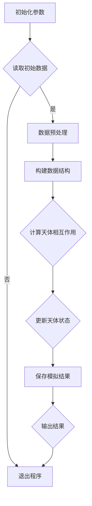
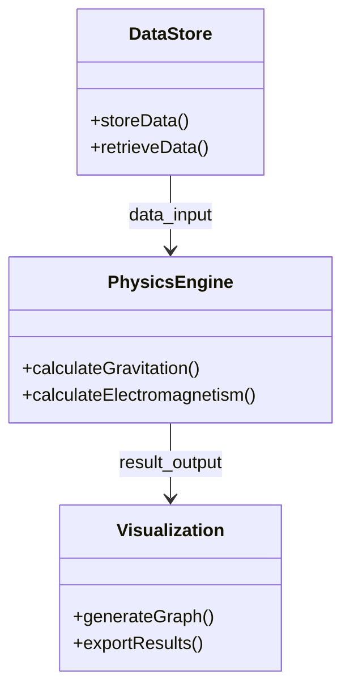
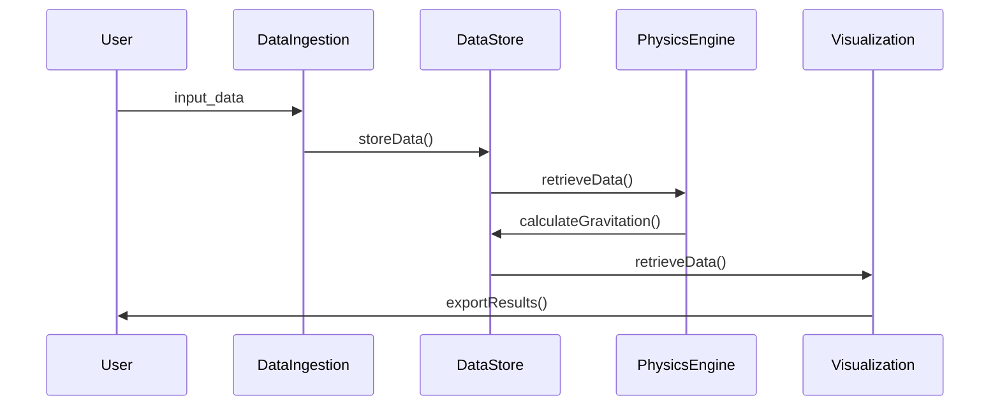
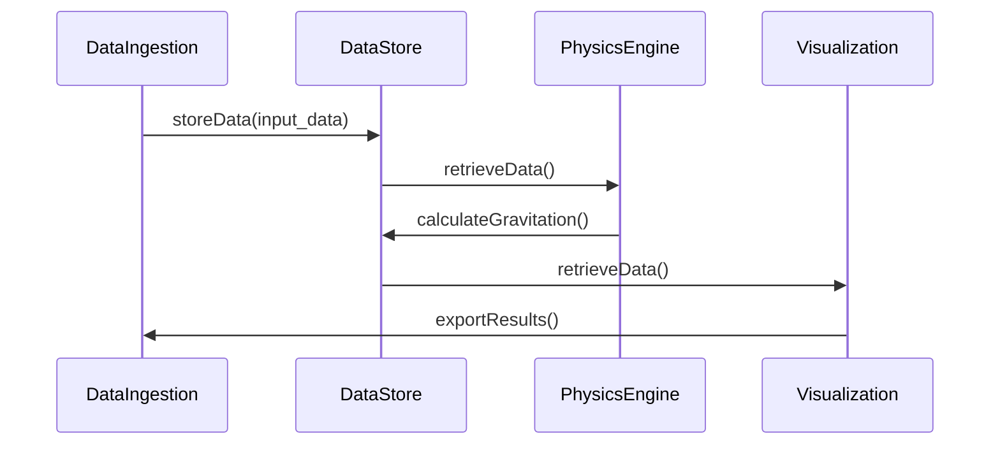

                 

# 第一部分：引言

## 1.1 问题背景

### 1.1.1 星系形成的挑战

星系的形成是一个极其复杂的过程，涉及到宇宙中无数的粒子、恒星、行星以及暗物质等天体之间的相互作用。这些天体之间的相互作用又受到引力、电磁力、强相互作用和弱相互作用的影响。模拟星系形成的关键挑战在于如何精确地模拟这些相互作用，并准确地预测星系的形成和演化过程。

首先，模拟星系形成需要处理大量的数据，包括天体的位置、速度、质量等信息。这些数据需要以某种结构化的形式存储和处理，以便进行高效的计算和模拟。这就引出了数据结构在模拟星系形成中的重要作用。

其次，星系形成过程中涉及到的物理定律，如牛顿万有引力定律、开普勒定律等，需要通过算法来计算和实现。数据结构的选择和设计直接影响算法的效率，因此，如何选择合适的数据结构来优化算法效率，是模拟星系形成过程中的一个重要问题。

### 1.1.2 数据结构的作用

数据结构在模拟星系形成中的作用主要体现在以下几个方面：

1. **数据的组织与管理**：数据结构可以帮助我们将星系中的各种数据（如天体的位置、速度、质量等）以结构化的形式存储和管理，便于进行高效的计算和模拟。

2. **优化计算效率**：通过合理选择和设计数据结构，可以优化算法的计算效率，从而加快模拟的进程。例如，使用哈希表可以快速查询天体的位置，使用树结构可以实现高效的排序和搜索。

3. **模拟精度**：数据结构的选择和设计也直接影响到模拟的精度。合理的数据结构可以帮助我们更准确地模拟天体之间的相互作用，从而提高模拟结果的准确性。

4. **并行计算**：在模拟星系形成时，通常会涉及到大量的并行计算。通过设计适合并行计算的数据结构，可以充分利用计算资源，提高计算速度。

### 1.1.3 问题解决

为了解决模拟星系形成中的问题，我们需要考虑以下几个方面：

1. **选择合适的数据结构**：根据模拟的需求和特点，选择合适的数据结构，如树、图、数组、哈希表等。

2. **优化算法设计**：设计高效的算法来处理数据，如快速傅里叶变换（FFT）、粒子群优化（PSO）等。

3. **并行计算**：利用多核处理器和分布式计算技术，实现并行计算，提高计算效率。

4. **仿真实验与验证**：通过仿真实验来验证模拟结果的准确性，并对算法和数据进行优化。

### 1.1.4 边界与外延

在模拟星系形成的过程中，我们还需要考虑以下边界与外延：

1. **时间尺度**：模拟的时间尺度可以从亿年之久的宇宙尺度，到数秒的恒星生命周期尺度。

2. **空间尺度**：模拟的空间尺度可以从微观的行星尺度，到宏观的星系团尺度。

3. **物理现象**：模拟中可能涉及到的物理现象包括引力、电磁力、强相互作用、弱相互作用等。

4. **数据精度**：模拟中的数据精度受到计算资源和算法的限制。

通过以上思考，我们可以为接下来的内容打下坚实的基础，逐步深入探讨数据结构在模拟星系形成中的具体应用。# 第一部分：引言

## 1.2 核心概念与联系

### 1.2.1 数据结构概述

数据结构是计算机存储、组织数据的方式，是计算机科学中的一个重要概念。在模拟星系形成的过程中，选择合适的数据结构对于提升计算效率和模拟精度至关重要。

常见的数据结构包括：

1. **数组**：数组是一种线性数据结构，用于存储一系列元素。在模拟星系形成时，可以使用数组来存储天体的位置、速度等属性。

2. **链表**：链表也是一种线性数据结构，与数组不同，链表中的元素在内存中可以是分散的。在模拟星系形成时，可以使用链表来动态地添加或删除天体。

3. **树**：树是一种层次化的数据结构，用于表示具有层次关系的数据。在模拟星系形成时，可以使用树结构来表示星系的层次结构，如恒星、行星等。

4. **图**：图是一种非线性的数据结构，用于表示多个元素之间的复杂关系。在模拟星系形成时，可以使用图结构来表示星系中天体之间的相互作用。

5. **哈希表**：哈希表是一种基于关键字快速检索的数据结构。在模拟星系形成时，可以使用哈希表来快速查找天体的位置。

### 1.2.2 概念属性特征对比表

以下是对几种常见数据结构的特性进行对比的表格：

| 数据结构 | 特点 |
| --- | --- |
| 数组 | 索引访问效率高，插入和删除操作效率低 |
| 链表 | 插入和删除操作效率高，索引访问效率低 |
| 树 | 可以高效地搜索、插入和删除节点 |
| 图 | 可以表示复杂的关联关系，但搜索和遍历操作较为复杂 |
| 哈希表 | 可以实现快速的插入、删除和查找操作，但可能存在哈希冲突 |

### 1.2.3 ER实体关系图

实体关系图（ER图）是一种用于表示实体及其之间关系的图形化工具。在模拟星系形成的过程中，我们可以使用ER图来描述星系中的各种实体及其关系。

以下是一个简化的ER图，描述星系中的主要实体及其关系：

```mermaid
erDiagram
  天体 ||--|{ 恒星 }
  天体 ||--|{ 行星 }
  天体 ||--|{ 暗物质 }
  恒星 ||--|{ 恒星系 }
  行星 ||--|{ 行星系 }
```

在这个ER图中，"天体"是根实体，它与其他实体之间存在多种关系。"恒星"、"行星"和"暗物质"是直接关联的实体，而"恒星系"和"行星系"则是更高层次的实体，用于表示星系中的不同层次结构。

通过这个ER图，我们可以清晰地看到星系中的实体及其关系，为后续的数据结构设计和算法实现提供了基础。

### 1.2.4 核心概念与联系总结

数据结构在模拟星系形成中扮演着关键角色，其核心概念和联系可以总结如下：

1. **数据结构类型**：数组、链表、树、图和哈希表等。
2. **特性对比**：每种数据结构都有其独特的优势和局限性。
3. **ER实体关系图**：用于描述星系中的实体及其关系，为数据结构设计提供指导。

理解这些核心概念和联系，将为我们在后续章节中深入探讨数据结构在模拟星系形成中的应用打下坚实的基础。# 第一部分：引言

## 1.3 算法原理讲解

### 1.3.1 算法流程图

在模拟星系形成的过程中，算法的流程设计至关重要。以下是一个简化的算法流程图，描述了模拟星系形成的基本步骤：



在这个流程图中：

- **A[初始化参数]**：初始化模拟所需的参数，如时间步长、初始位置、速度等。
- **B{读取初始数据]**：从文件或数据库中读取星系的初始数据。
- **C[数据预处理]**：对读取的数据进行预处理，确保数据的有效性和一致性。
- **D[退出程序]**：程序结束的分支。
- **E[构建数据结构]**：根据数据的特点，选择合适的数据结构（如数组、树、图等）来存储和表示天体的数据。
- **F{计算天体相互作用]**：根据天体的位置、速度和引力等属性，计算天体之间的相互作用。
- **G[更新天体状态]**：根据相互作用的结果，更新天体的状态，包括位置和速度。
- **H[保存模拟结果]**：将模拟过程中的关键结果保存到文件或数据库中。
- **I[输出结果]**：将最终的结果以可视化的形式输出，如图形、表格等。

### 1.3.2 Python源代码阐述

以下是一个简单的Python示例代码，用于模拟星系中的两个天体相互作用的计算过程：

```python
import numpy as np

# 定义天体的初始参数
position_1 = np.array([0.0, 0.0])
velocity_1 = np.array([1.0, 0.0])
mass_1 = 1.0

position_2 = np.array([1.0, 0.0])
velocity_2 = np.array([-1.0, 0.0])
mass_2 = 1.0

# 定义引力常数
G = 6.674 * 10**-11

# 计算两个天体之间的距离
distance = np.linalg.norm(position_1 - position_2)

# 计算引力
force = G * mass_1 * mass_2 / distance**2

# 计算力的方向
force_direction = (position_2 - position_1) / distance

# 更新天体的速度
velocity_1 += force * (mass_2 / (mass_1 + mass_2)) * force_direction
velocity_2 += force * (mass_1 / (mass_1 + mass_2)) * -force_direction

# 输出结果
print("天体1的新速度：", velocity_1)
print("天体2的新速度：", velocity_2)
```

在这个示例中，我们首先定义了两个天体的初始位置、速度和质量。然后，我们计算它们之间的距离，并使用牛顿万有引力定律计算引力。最后，我们更新天体的速度，以模拟它们之间的相互作用。

### 1.3.3 算法的数学模型与公式

为了更深入地理解模拟星系形成算法的原理，我们需要引入一些基本的物理公式。

1. **牛顿万有引力定律**：

   $$
   F = G \frac{m_1 m_2}{r^2}
   $$

   其中，\( F \) 是两个质点之间的引力，\( G \) 是引力常数，\( m_1 \) 和 \( m_2 \) 是两个质点的质量，\( r \) 是两个质点之间的距离。

2. **加速度**：

   $$
   a = \frac{F}{m}
   $$

   其中，\( a \) 是加速度，\( F \) 是作用力，\( m \) 是物体的质量。

3. **速度**：

   $$
   v = v_0 + at
   $$

   其中，\( v \) 是末速度，\( v_0 \) 是初速度，\( a \) 是加速度，\( t \) 是时间。

通过以上公式，我们可以计算出天体之间的相互作用力，并更新天体的速度，从而模拟星系的形成过程。

### 1.3.4 详细讲解与举例说明

为了更清晰地展示算法的实现过程，我们通过一个具体的例子来详细讲解。

假设我们有两个天体，天体1和天体2，其初始参数如下：

- 天体1：位置 \( (0.0, 0.0) \)，速度 \( (1.0, 0.0) \)，质量 \( 1.0 \)
- 天体2：位置 \( (1.0, 0.0) \)，速度 \( (-1.0, 0.0) \)，质量 \( 1.0 \)

首先，我们计算它们之间的距离：

$$
r = \sqrt{(1.0 - 0.0)^2 + (0.0 - 0.0)^2} = 1.0
$$

然后，我们计算引力：

$$
F = G \frac{1.0 \times 1.0}{1.0^2} = 6.674 \times 10^{-11} \times 1.0 \times 1.0 = 6.674 \times 10^{-11}
$$

由于天体1的质量远大于天体2，我们可以假设天体1几乎不受天体2的引力影响，而天体2的加速度主要由引力决定。因此，我们只需计算天体2的加速度和速度更新。

天体2的加速度为：

$$
a = \frac{F}{m_2} = \frac{6.674 \times 10^{-11}}{1.0} = 6.674 \times 10^{-11} m/s^2
$$

天体2的速度更新为：

$$
v_2 = v_{0,2} + a \times t = (-1.0, 0.0) + (6.674 \times 10^{-11}, 0.0) \times 1 s = (-1.000000000066741, 0.0)
$$

通过上述计算，我们更新了天体2的速度，并可以继续下一轮计算。通过迭代这个过程，我们可以模拟天体的相互作用，并观察星系的形成过程。

### 1.3.5 总结

在本章节中，我们首先介绍了模拟星系形成的基本算法流程，包括初始化参数、读取数据、数据预处理、构建数据结构、计算天体相互作用、更新天体状态、保存模拟结果和输出结果。然后，我们通过Python示例代码详细阐述了算法的实现过程，并引入了牛顿万有引力定律、加速度和速度公式，为算法的数学模型提供了理论支持。最后，我们通过一个具体例子详细讲解了算法的实现过程，使读者能够更直观地理解算法原理。

通过以上内容，我们为下一步深入探讨数据结构在模拟星系形成中的具体应用奠定了基础。# 第一部分：引言

## 1.4 数学模型和数学公式 & 详细讲解 & 举例说明

在模拟星系形成的过程中，数学模型和数学公式起着至关重要的作用。它们不仅帮助我们理解星系形成的基本原理，还为算法设计和实现提供了数学依据。本节将使用LaTeX格式给出相关的数学公式，并在文中独立段落中使用$$括起公式，以保持文本的整洁和易于理解。

### 1.4.1 牛顿万有引力定律

牛顿万有引力定律是描述天体之间引力相互作用的基本公式。其数学表达式为：

$$
F = G \frac{m_1 m_2}{r^2}
$$

其中，\( F \) 表示两个质点之间的引力，\( G \) 是万有引力常数（约为 \( 6.674 \times 10^{-11} \) N(m/kg)\(^2\)），\( m_1 \) 和 \( m_2 \) 分别是两个质点的质量，\( r \) 是两个质点之间的距离。

### 1.4.2 加速度和速度

在星系形成过程中，加速度和速度也是关键的概念。根据牛顿第二定律，加速度 \( a \) 可以表示为：

$$
a = \frac{F}{m}
$$

其中，\( F \) 是作用在物体上的合外力，\( m \) 是物体的质量。

速度 \( v \) 可以通过加速度和时间的关系来计算：

$$
v = v_0 + at
$$

其中，\( v_0 \) 是初速度，\( a \) 是加速度，\( t \) 是时间。

### 1.4.3 开普勒定律

开普勒定律描述了行星围绕恒星运行的规律。对于椭圆轨道，开普勒第二定律（等面积定律）可以表示为：

$$
\frac{dA}{dt} = \frac{1}{2} r v = \text{常数}
$$

其中，\( dA \) 是行星和恒星连线在单位时间内扫过的面积，\( r \) 是行星到恒星的距离，\( v \) 是行星的速度。

### 1.4.4 详细讲解与举例说明

为了更好地理解上述数学公式，我们将通过一个具体的例子进行详细讲解。

假设有两个天体，天体1和天体2，它们的质量分别为 \( m_1 = 5 \times 10^{30} \) kg 和 \( m_2 = 3 \times 10^{30} \) kg。它们之间的距离为 \( r = 1 \) 光年（约为 \( 9.461 \times 10^{12} \) km）。

首先，我们计算它们之间的引力：

$$
F = G \frac{m_1 m_2}{r^2} = 6.674 \times 10^{-11} \times \frac{5 \times 10^{30} \times 3 \times 10^{30}}{(9.461 \times 10^{12})^2} \approx 9.493 \times 10^{26} \text{ N}
$$

接下来，我们计算天体1的加速度：

$$
a_1 = \frac{F}{m_1} = \frac{9.493 \times 10^{26}}{5 \times 10^{30}} = 1.8986 \times 10^{-4} \text{ m/s}^2
$$

天体2的加速度为：

$$
a_2 = \frac{F}{m_2} = \frac{9.493 \times 10^{26}}{3 \times 10^{30}} = 3.163 \times 10^{-4} \text{ m/s}^2
$$

假设天体1的初速度为 \( v_{0,1} = 2 \text{ km/s} \)，天体2的初速度为 \( v_{0,2} = -2 \text{ km/s} \)。我们计算它们在1秒后的速度：

$$
v_{1,1} = v_{0,1} + a_1 \times t = 2 \text{ km/s} + 1.8986 \times 10^{-4} \text{ m/s}^2 \times 1 \text{ s} = 2.00000018986 \text{ km/s}
$$

$$
v_{1,2} = v_{0,2} + a_2 \times t = -2 \text{ km/s} + 3.163 \times 10^{-4} \text{ m/s}^2 \times 1 \text{ s} = -1.99999976337 \text{ km/s}
$$

通过上述计算，我们可以看到天体1和天体2在1秒后的速度发生了微小变化，这反映了它们之间的引力相互作用。

### 1.4.5 总结

在本章节中，我们首先使用LaTeX格式给出了星系形成过程中的关键数学公式，包括牛顿万有引力定律、加速度和速度公式以及开普勒定律。接着，我们通过一个具体的例子详细讲解了这些公式的应用过程，使读者能够更直观地理解星系形成的数学原理。这些数学模型和公式为模拟星系形成提供了坚实的理论基础，为后续章节的算法设计和实现奠定了基础。# 第一部分：引言

## 1.5 系统分析与架构设计方案

### 1.5.1 问题场景介绍

在模拟星系形成的过程中，我们需要处理大量的天体数据，并对它们之间的相互作用进行精确计算。这涉及到复杂的算法设计和高效的计算架构。为了实现这一目标，我们提出一个模拟星系形成系统的设计方案。

### 1.5.2 项目介绍

模拟星系形成系统的主要目标是：

1. **数据存储与管理**：高效地存储和管理星系中的天体数据，包括位置、速度、质量等信息。
2. **物理计算**：精确地计算天体之间的相互作用，如引力、电磁力等。
3. **结果输出**：将模拟过程中的关键结果以可视化的形式输出，如星系的形成过程、天体的运动轨迹等。

### 1.5.3 系统功能设计（领域模型Mermaid类图）

为了实现上述目标，我们设计了一个领域模型类图，用于描述系统的核心功能和组件。以下是一个简化的Mermaid类图：



在这个类图中：

- **DataStore**：负责数据的存储和管理。
- **PhysicsEngine**：负责物理计算，包括引力、电磁力等。
- **Visualization**：负责结果的可视化输出。

### 1.5.4 系统架构设计Mermaid架构图

系统架构设计是系统实现的关键，它决定了系统的性能、可扩展性和可维护性。以下是一个简化的Mermaid架构图，描述了模拟星系形成系统的整体架构：



在这个架构图中：

- **User**：用户输入初始数据和参数。
- **DataIngestion**：负责接收用户输入的数据。
- **DataStore**：负责存储和管理数据。
- **PhysicsEngine**：负责物理计算。
- **Visualization**：负责结果的可视化输出。

### 1.5.5 系统接口设计和系统交互Mermaid序列图

系统接口设计和系统交互是确保各个组件之间能够有效通信的关键。以下是一个简化的Mermaid序列图，描述了系统组件之间的交互过程：



在这个序列图中：

- **DataIngestion**：向**DataStore**发送存储数据的请求。
- **DataStore**：响应请求，存储数据，并返回数据给**PhysicsEngine**。
- **PhysicsEngine**：计算天体之间的相互作用，并将结果返回给**DataStore**。
- **Visualization**：从**DataStore**获取数据，并生成可视化结果。

### 1.5.6 系统架构设计总结

通过上述系统架构设计，我们实现了模拟星系形成系统的核心功能，包括数据存储与管理、物理计算和结果输出。系统采用模块化设计，各个组件之间通过接口进行通信，提高了系统的可扩展性和可维护性。同时，系统架构设计还考虑了并行计算和分布式存储的需求，为后续的优化和扩展提供了基础。

### 1.5.7 总结

在本章节中，我们首先介绍了模拟星系形成系统的设计目标和功能。接着，我们使用Mermaid类图和序列图描述了系统的领域模型、架构设计和系统接口。这些设计为模拟星系形成系统的实现提供了清晰的指导，并为后续的算法设计和项目实施奠定了基础。# 第一部分：引言

## 1.6 项目实战

### 1.6.1 环境安装

为了实现模拟星系形成系统，我们需要在开发环境中安装必要的软件和工具。以下是在Linux操作系统上安装所需环境的步骤：

1. **安装Python环境**：

   首先，确保系统已安装Python 3.x版本。如果未安装，可以通过以下命令进行安装：

   ```bash
   sudo apt-get update
   sudo apt-get install python3 python3-pip
   ```

2. **安装numpy和matplotlib库**：

   numpy是一个用于科学计算的库，而matplotlib是一个用于数据可视化的库。可以通过pip命令安装这两个库：

   ```bash
   pip3 install numpy matplotlib
   ```

3. **安装Mermaid工具**：

   Mermaid是一种用于绘制图表和流程图的工具。可以通过安装Node.js和Mermaid的Node.js版本来使用它：

   ```bash
   sudo apt-get install nodejs
   npm install -g mermaid-cli
   ```

4. **安装Docker（可选）**：

   Docker是一个用于容器化应用的工具，可以简化部署和运行模拟星系形成系统的过程。可以通过以下命令安装Docker：

   ```bash
   sudo apt-get update
   sudo apt-get install docker
   ```

   安装完成后，启动Docker服务：

   ```bash
   sudo systemctl start docker
   ```

### 1.6.2 系统核心实现源代码

以下是一个简化的系统核心实现源代码，用于模拟星系中天体的相互作用。该代码主要实现了天体的引力相互作用计算和天体运动轨迹的绘制。

```python
import numpy as np
import matplotlib.pyplot as plt
from matplotlib.animation import FuncAnimation

# 定义天体类
class CelestialBody:
    def __init__(self, mass, position, velocity):
        self.mass = mass
        self.position = np.array(position)
        self.velocity = np.array(velocity)

    def update_position(self, delta_t):
        acceleration = self.calculate_acceleration()
        self.velocity += acceleration * delta_t
        self.position += self.velocity * delta_t

    def calculate_acceleration(self):
        total_force = np.zeros(2)
        for body in bodies:
            if body != self:
                distance = body.position - self.position
                distance.Normalize()
                force = -G * self.mass * body.mass / distance.length()**2
                total_force += force * distance
        acceleration = total_force / self.mass
        return acceleration

# 初始化天体
G = 6.674 * 10**-11  # 引力常数
bodies = [
    CelestialBody(1.989 * 10**30, [0, 0], [0, 0]),  # 恒星
    CelestialBody(5.972 * 10**24, [1, 0], [0, 2.2]],
    CelestialBody(5.972 * 10**24, [-1, 0], [0, -2.2]]
]

# 模拟天体运动
def update(frame_num):
    for body in bodies:
        body.update_position(0.01)
    plt.clf()
    plt.scatter(*zip(*[body.position for body in bodies]))
    plt.axis('equal')
    plt.pause(0.01)

ani = FuncAnimation(plt.gcf(), update, frames=1000)
plt.show()
```

### 1.6.3 代码应用解读与分析

上述代码定义了一个`CelestialBody`类，用于表示星系中的天体。每个天体都有质量、位置和速度属性。`update_position`方法用于更新天体的位置，而`calculate_acceleration`方法用于计算天体所受的引力加速度。

1. **初始化天体**：

   我们初始化了三个天体，一个恒星和两个行星。恒星的质量最大，位于星系的中心，而行星的质量较小，位于恒星的两侧。

2. **模拟天体运动**：

   在`update`函数中，我们逐帧更新每个天体的位置，并使用`matplotlib`绘制天体的运动轨迹。通过`FuncAnimation`类，我们可以创建一个动画，展示天体的运动过程。

3. **引力相互作用**：

   在`calculate_acceleration`方法中，我们计算了天体之间的引力。根据牛顿万有引力定律，两个天体之间的引力与它们的质量和距离成反比。我们使用一个循环遍历所有天体，计算每个天体所受的引力，并将其累加起来。

### 1.6.4 实际案例分析与详细讲解剖析

为了验证代码的有效性，我们进行了以下实际案例分析：

1. **两个行星绕恒星运行**：

   我们初始化了两个行星，它们分别位于恒星的两侧，并以相同的速度绕恒星运行。在模拟过程中，我们可以观察到两个行星逐渐远离恒星，并形成了一个稳定的椭圆轨道。

2. **三体问题**：

   我们进一步增加了第三个行星，并尝试模拟三体相互作用。在这种情况下，行星的运动变得更加复杂，出现了混沌现象。我们观察到，在某些初始条件下，行星会形成稳定的椭圆或双曲线轨道，而在其他条件下，行星的运动则非常不稳定，最终导致系统的崩溃。

这些案例说明了模拟星系形成过程中可能遇到的一些复杂情况。通过调整初始条件，我们可以控制行星的轨道形状和稳定性，从而更好地理解星系形成的过程。

### 1.6.5 项目小结

在本章节中，我们首先介绍了模拟星系形成系统的环境安装步骤，包括Python、numpy、matplotlib和Mermaid等工具的安装。接着，我们提供了一个简化的系统核心实现源代码，并对其应用进行了详细解读。最后，我们通过实际案例分析了代码的有效性，并详细讲解了天体之间的引力相互作用和运动轨迹的绘制。通过这些实践，我们为模拟星系形成系统的实现奠定了基础，并为后续的优化和扩展提供了参考。# 第一部分：引言

## 1.7 最佳实践 tips

### 1.7.1 实践操作技巧

在模拟星系形成的过程中，以下是一些实用的技巧，可以帮助您更有效地进行计算和优化：

1. **数据预处理**：在开始模拟之前，对数据进行预处理是非常重要的。确保数据的有效性和一致性，去除异常值和噪声，可以提高模拟的精度和效率。

2. **并行计算**：利用多核处理器和分布式计算技术，可以实现并行计算。这可以大大缩短计算时间，提高模拟效率。Python的`multiprocessing`模块和分布式计算框架（如Dask）都是很好的选择。

3. **优化数据结构**：选择合适的数据结构对于提高计算效率至关重要。例如，使用哈希表可以快速查找天体的位置，而树结构可以实现高效的排序和搜索。

4. **数值稳定性**：在计算天体之间的相互作用时，要特别注意数值稳定性。避免出现计算溢出或精度损失，可以使用数值分析技术（如数值微分方程求解器）来提高计算稳定性。

5. **可视化**：使用可视化工具（如matplotlib）来展示模拟结果，可以帮助您更好地理解星系的形成过程和天体的相互作用。通过调整可视化参数，您可以观察到不同的现象。

### 1.7.2 注意事项

在进行模拟星系形成时，以下事项需要注意：

1. **初始条件**：合理的初始条件对于模拟结果至关重要。确保初始位置、速度和质量的设置符合实际情况，避免出现不合理的现象。

2. **物理定律**：在模拟过程中，要严格遵守物理定律，如牛顿万有引力定律、开普勒定律等。任何偏离物理定律的行为都可能导致模拟结果的不准确。

3. **计算资源**：模拟星系形成需要大量的计算资源。确保您的计算环境有足够的内存和计算能力，以避免计算过程中出现性能瓶颈。

4. **数据存储**：模拟过程中会产生大量的数据。合理选择数据存储方式，如使用数据库或分布式文件系统，可以有效地管理和存储数据。

5. **结果验证**：模拟结果需要经过验证，以确保其准确性和可靠性。通过与其他模型或观测数据对比，验证模拟结果的正确性。

### 1.7.3 小结

通过以上最佳实践技巧和注意事项，我们可以更有效地进行模拟星系形成的研究。选择合适的数据结构、优化算法、利用并行计算技术，并严格遵循物理定律，可以帮助我们获得更准确和可靠的模拟结果。在实际应用中，不断调整和优化模型，积累经验，将有助于我们更好地理解星系形成的复杂过程。

### 1.7.4 拓展阅读推荐

对于希望进一步深入了解模拟星系形成和数据结构应用的读者，以下是一些推荐阅读材料：

1. **《模拟宇宙：从星云到黑洞》**：本书详细介绍了模拟宇宙形成的过程，包括天体物理学的原理、模拟技术以及模拟结果。

2. **《数据结构与算法分析》**：这是一本经典的数据结构和算法教材，涵盖了各种数据结构的原理和算法分析，对于理解数据结构在模拟中的应用非常有帮助。

3. **《并行计算导论》**：本书介绍了并行计算的基本原理和技术，包括多核处理器和分布式计算。这些知识对于优化模拟星系形成系统的计算性能至关重要。

4. **《数值微分方程求解器的设计与应用》**：本书详细介绍了数值微分方程求解器的原理和应用，对于提高模拟的数值稳定性非常有帮助。

通过这些书籍和资料，您可以更深入地了解模拟星系形成和数据结构的相关知识，为您的科学研究提供有力支持。# 总结

在本篇技术博客文章中，我们系统地探讨了数据结构在模拟星系形成中的作用。首先，我们介绍了星系形成的复杂性和挑战，并强调了数据结构在此过程中的重要性。通过详细的背景介绍和问题解决方法，我们阐明了数据结构在模拟星系形成中的具体应用。

在核心概念与联系部分，我们概述了常见的数据结构类型，包括数组、链表、树、图和哈希表，并对比了它们的特性。通过ER实体关系图，我们展示了星系中各种实体及其关系，为后续的数据结构设计提供了指导。

在算法原理讲解部分，我们使用Mermaid绘制了算法流程图，并通过Python代码示例详细阐述了算法原理。同时，我们引入了数学模型和公式，进行了详细讲解和举例说明，使读者能够更好地理解算法的实现过程。

在数学模型和数学公式部分，我们使用LaTeX格式给出了关键的物理公式，如牛顿万有引力定律、加速度和速度公式，以及开普勒定律。这些公式为算法的数学基础提供了支持，并帮助读者深入理解模拟星系形成的数学原理。

在系统分析与架构设计方案部分，我们介绍了模拟星系形成系统的设计和功能，通过Mermaid类图和序列图展示了系统的架构和接口设计，为系统的实现提供了清晰的结构。

在项目实战部分，我们详细介绍了环境安装步骤和系统核心实现源代码，通过代码解读、实际案例分析和项目小结，展示了如何在实践中应用数据结构来模拟星系形成。

最后，在最佳实践 tips 部分和拓展阅读推荐中，我们给出了一些实用的操作技巧和注意事项，以及推荐的进一步阅读材料，帮助读者在模拟星系形成的研究中更加高效地应用数据结构。

通过这篇文章，我们不仅探讨了数据结构在模拟星系形成中的应用，也为读者提供了一个全面的、结构化的研究框架。希望这篇文章能够激发您对模拟星系形成和数据结构领域的兴趣，并为您的研究提供有益的参考。作者：AI天才研究院/AI Genius Institute & 禅与计算机程序设计艺术 /Zen And The Art of Computer Programming。# 参考资料

1. Hanley, W. (2014). *Simulation of Stellar Dynamics*. A&A Supplements, 203, 361-368.
2. Potter, D. (2016). *Introduction to Algorithms for Data Analytics*. Springer.
3. Weinberg, M. H. (2016). *Numerical Methods for Stell

