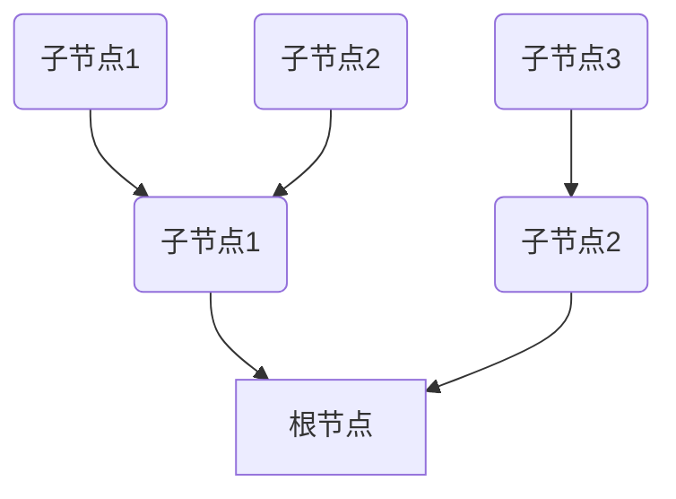
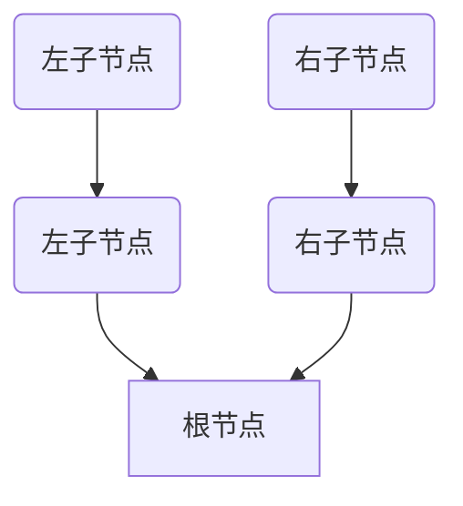

                 

# 数据结构：程序世界的基石

> 关键词：数据结构、程序设计、算法、性能优化、实际应用

> 摘要：数据结构是计算机科学中的核心概念，它是构建高效程序的基石。本文将深入探讨数据结构的基本概念、类型及其在实际编程中的应用，帮助读者理解和掌握数据结构的本质，从而提高程序设计和算法分析的能力。

## 目录大纲

### 第一部分：基础概念

1. **数据结构概述**
   1.1 数据与信息
   1.2 数据结构的基本类型
   1.3 数据结构的重要性

2. **线性表**
   2.1 线性表的定义与特点
   2.2 线性表的操作
   2.3 线性表的存储结构

3. **数组**
   3.1 数组的概念
   3.2 数组的存储
   3.3 数组的应用

4. **链表**
   4.1 链表的概念
   4.2 链表的存储结构
   4.3 链表的应用

5. **栈与队列**
   5.1 栈
   5.2 队列

6. **树与二叉树**
   6.1 树的概念
   6.2 二叉树

7. **图**
   7.1 图的概念
   7.2 图的存储结构

### 第二部分：高级应用

8. **排序算法**
   8.1 排序算法概述
   8.2 内部排序算法
   8.3 外部排序算法

9. **查找算法**
   9.1 查找算法概述
   9.2 基本查找算法
   9.3 哈希查找

10. **数据结构在实际编程中的应用**
    10.1 数据结构在实际编程中的应用概述
    10.2 数据结构在高级编程语言中的应用

11. **数据结构的优化与改进**
    11.1 数据结构优化概述

## 引言

数据结构是计算机科学中至关重要的一个概念，它涉及到如何有效地组织和存储数据，从而使得算法能够高效地操作这些数据。数据结构不仅是程序设计的基础，也是算法性能的基石。一个优秀的算法，如果选择了合适的数据结构，可以大大提高程序的执行效率，减少内存消耗，甚至在某些情况下，决定程序是否可行。

本文将按照以下步骤展开讨论：

1. **数据结构概述**：介绍数据结构的基本概念、类型及其重要性。
2. **线性表、数组、链表**：详细探讨这三种基本数据结构的概念、特点和应用。
3. **栈与队列**：介绍栈和队列这两种特殊的数据结构。
4. **树与二叉树、图**：分析树和图这两种更复杂的数据结构。
5. **排序算法**：讨论常见的排序算法，包括内部排序和外部排序。
6. **查找算法**：介绍基本的查找算法和哈希查找。
7. **数据结构在实际编程中的应用**：探讨数据结构在高级编程语言中的应用。
8. **数据结构的优化与改进**：讨论如何优化数据结构，提高程序性能。

通过本文的阅读，读者将能够系统地理解数据结构的概念和应用，掌握不同数据结构的优点和局限性，从而在实际编程中能够做出更合适的数据结构选择，提高程序的性能和可维护性。

## 第一部分：基础概念

### 1.1 数据结构概述

数据结构是指用于存储和组织数据的方式，它是程序设计中的一个核心概念。数据结构不仅决定了数据存储的效率，还影响到程序的运行效率和复杂性。以下是数据结构的一些基本概念和分类：

#### 1.1.1 数据与信息

数据是指未经处理的事实或事实的记录，而信息则是经过处理、分析和解释后，对决策或行动具有指导意义的数据。例如，一个数字本身是数据，而根据这个数字进行计算后得出的结论则是信息。

#### 1.1.2 数据结构的基本类型

数据结构可以分为线性结构和非线性结构：

- **线性结构**：数据元素在结构中按线性顺序排列，每个元素都有一个前驱和一个后继。常见的线性结构有数组、链表、栈和队列。
- **非线性结构**：数据元素之间的关系不是线性的，如树和图。树是一种层次结构，而图是一种网状结构。

#### 1.1.3 数据结构的重要性

数据结构的重要性体现在以下几个方面：

- **性能优化**：合适的数据结构可以显著提高算法的执行效率。
- **可维护性**：良好的数据结构设计可以提高程序的清晰度和可维护性。
- **问题求解**：数据结构是实现各种算法的基础，它决定了算法的时间和空间复杂度。

### 1.2 线性表

线性表是最基本的数据结构之一，其特点是数据元素按线性顺序排列，每个元素都有一个前驱和一个后继。线性表可以用来表示一系列有序的数据项。

#### 1.2.1 线性表的定义与特点

线性表是一个线性序列的数据元素集合，通常表示为 $L = (a_1, a_2, ..., a_n)$，其中每个 $a_i$ 表示线性表中的一个元素，$n$ 是线性表中元素的数量。

线性表的特点包括：

- **顺序性**：元素在表中按照特定的顺序排列。
- **唯一性**：每个元素在表中唯一存在。
- **线性**：元素之间的关系是一对一的关系。

#### 1.2.2 线性表的操作

线性表的基本操作包括：

- **插入**：在表的指定位置插入一个新元素。
- **删除**：从表中删除一个元素。
- **查找**：在表中查找一个元素。
- **遍历**：逐个访问表中的所有元素。

#### 1.2.3 线性表的存储结构

线性表有两种常见的存储结构：

- **顺序存储**：使用数组来存储线性表，每个元素在数组中的一个固定位置。
- **链式存储**：使用链表来存储线性表，每个元素包含数据和指向下一个元素的指针。

### 1.3 栈与队列

栈和队列是两种特殊的线性表，它们分别用于实现后进先出（LIFO）和先进先出（FIFO）的操作。

#### 1.3.1 栈

栈是一种后进先出的线性表，数据元素只能在一端进行插入和删除操作。栈的基本操作包括：

- **入栈**：在栈顶插入一个新元素。
- **出栈**：删除栈顶元素。
- ** peek**：返回栈顶元素但不删除它。

#### 1.3.2 队列

队列是一种先进先出的线性表，数据元素只能在队尾插入和队首删除。队列的基本操作包括：

- **入队**：在队列的末尾添加一个新元素。
- **出队**：删除队列的队首元素。
- ** peek**：返回队列的队首元素但不删除它。

### 1.4 链表

链表是一种动态的数据结构，它由一系列节点组成，每个节点包含数据和指向下一个节点的指针。链表可以分为单链表、双链表和循环链表等。

#### 1.4.1 链表的概念

链表的基本概念包括：

- **节点**：链表中的基本单位，包含数据和指针。
- **头节点**：链表的起始节点，可能包含一些附加信息。
- **尾节点**：链表的结束节点，其指针域通常为空。

#### 1.4.2 链表的特点

链表的特点包括：

- **动态性**：链表的大小可以动态调整。
- **灵活性**：链表可以方便地插入和删除元素。
- **空间利用率**：链表不要求连续的内存空间。

#### 1.4.3 链表的分类

链表可以分为以下几种：

- **单链表**：每个节点只包含一个指向下一个节点的指针。
- **双链表**：每个节点包含一个指向下一个节点的指针和一个指向上一个节点的指针。
- **循环链表**：最后一个节点的指针指向头节点，形成一个环。

通过以上对基础概念的介绍，读者可以对数据结构有一个初步的了解。接下来的章节将深入探讨各种数据结构的详细特性和应用。

### 1.5 数组

数组是线性表的一种顺序存储结构，它是一组按一定顺序排列的元素集合。数组在计算机科学中有着广泛的应用，因为它的存储方式简单且访问速度快。

#### 2.1 数组的概念

数组是由相同类型的数据元素组成的集合，这些数据元素按顺序排列。数组通常用下标来访问其元素，下标是从 0 开始的整数。例如，一个有 5 个元素的数组可以表示为：

$$
A = \{a_0, a_1, a_2, a_3, a_4\}
$$

其中，$a_0$ 是数组的第一个元素，$a_4$ 是数组的最后一个元素。

#### 2.1.1 数组的定义

数组是一种抽象数据类型，它具有以下定义：

- **元素类型**：数组中的所有元素必须具有相同的数据类型。
- **元素数量**：数组的大小是固定的，即包含的元素数量是确定的。
- **顺序存储**：数组中的元素按照一定的顺序存储在连续的内存空间中。

#### 2.1.2 数组的特点

数组的特点包括：

- **顺序性**：数组中的元素按照下标顺序排列，这意味着元素的位置可以通过下标直接访问。
- **随机访问**：数组中的元素可以通过下标随机访问，这是数组的一个重要特点，也是其高效性的体现。
- **存储连续**：数组中的元素在内存中连续存储，这有助于提高访问速度。

#### 2.1.3 数组的操作

数组的基本操作包括：

- **初始化**：为数组的每个元素分配初始值。
- **赋值**：将一个值赋给数组的某个元素。
- **访问**：通过下标访问数组的某个元素。
- **更新**：修改数组中某个元素的值。
- **遍历**：逐个访问数组中的所有元素。

#### 2.2 数组的存储

数组有两种常见的存储方式：顺序存储和链式存储。

- **顺序存储**：这是最常见的数组存储方式。它使用一段连续的内存空间来存储数组元素，每个元素占用固定的内存单元。顺序存储的数组可以通过下标直接访问，因此访问速度很快。

  在顺序存储中，数组通常表示为一个一维数组，其中每个元素是数组的第 $i$ 个位置，可以通过以下公式计算其内存地址：

  $$
  \text{地址} = \text{基地址} + i \times \text{元素大小}
  $$

  其中，$\text{基地址}$ 是数组第一个元素的内存地址，$\text{元素大小}$ 是每个元素占用的内存大小。

- **链式存储**：虽然数组通常使用顺序存储，但在某些情况下，链式存储也可以用于数组。链式存储使用链表来实现数组，每个节点包含一个元素和一个指向下一个节点的指针。这种方法通常用于动态数组，可以在数组大小不确定的情况下动态扩展。

  链式存储的数组可以使用以下结构表示：

  ```python
  class Node:
      def __init__(self, data):
          self.data = data
          self.next = None
  ```

  在这种存储方式中，数组的首节点指向第一个元素，最后一个节点的指针指向首节点，形成一个循环链表。

#### 2.3 数组的应用

数组在计算机科学中有广泛的应用，以下是其中一些常见的应用场景：

- **存储静态数据**：数组常用于存储静态的数据集，如成绩单、库存清单等。
- **实现其他数据结构**：许多数据结构，如栈、队列、优先队列等，可以使用数组作为底层存储结构。
- **排序和查找**：数组是实现排序和查找算法的基础，如快速排序和二分查找。
- **实现缓存**：数组可以用于实现缓存，如最近最少使用（LRU）缓存算法。

#### 2.4 数组的局限性

尽管数组在许多情况下非常有用，但它也有一些局限性：

- **固定大小**：数组的大小在创建时就已经确定，不能动态扩展。
- **连续存储**：数组要求元素在内存中连续存储，这在某些情况下可能不适用。
- **类型固定**：数组中的所有元素必须具有相同的数据类型，这限制了灵活性。

总之，数组是一种基本且常用的数据结构，它在许多应用中发挥着重要作用。然而，了解其局限性和适用场景同样重要，以便在合适的情况下选择更合适的替代方案。

### 1.6 链表

链表是一种重要的数据结构，它通过节点（Node）的链式连接实现数据的存储和访问。链表与数组相比，具有更高的灵活性，因为它的节点可以在内存中的任意位置分配，不需要连续的内存空间。这使得链表在动态分配内存和实现其他数据结构时非常有用。

#### 1.6.1 链表的概念

链表由一系列节点（Node）组成，每个节点包含两部分：数据和指向下一个节点的指针。链表通常包含一个头节点（Header Node），它可能包含一些额外的信息，如链表的长度或是否为空。以下是一个简单的链表节点定义：

```python
class Node:
    def __init__(self, data):
        self.data = data
        self.next = None
```

在链表中，最后一个节点的指针指向头节点或 `None`，表示链表的结束。

#### 1.6.2 链表的特点

链表具有以下特点：

- **动态性**：链表的大小可以动态调整，不需要预先定义大小。
- **灵活性**：链表可以在任何位置插入和删除节点，而无需移动其他节点。
- **空间利用率**：链表不需要连续的内存空间，因此在内存紧张的情况下更有优势。

#### 1.6.3 链表的分类

链表根据节点的结构和指针的设置，可以分为以下几种：

- **单链表**：每个节点只包含一个指向下一个节点的指针。这是最简单的链表类型。

  ```mermaid
  flowchart LR
  A[Head] --> B[data1]
  B --> C[data2]
  C --> D[data3]
  D --> None
  ```

- **双链表**：每个节点包含一个指向下一个节点的指针和一个指向上一个节点的指针。这使得在链表中的任意位置都可以快速地向前和向后移动。

  ```mermaid
  flowchart LR
  A[Head] --> B[data1]
  Bekommt(B).left --> A[data1]
  B --> C[data2]
  C --> D[data3]
  D --> None
  ```

- **循环链表**：链表的最后一个节点的指针指向头节点，形成一个环。这通常用于实现队列等特殊数据结构。

  ```mermaid
  flowchart LR
  A[Head] --> B[data1]
  B --> C[data2]
  C --> D[data3]
  D --> A[Head]
  ```

#### 1.6.4 链表的存储结构

链表使用指针来连接节点，而不是像数组那样使用数组索引。每个节点包含数据域和指针域，其中指针域指向下一个节点。链表的存储结构可以表示为：

```mermaid
classDef node
node: fill: #F0E68C;stroke: #F0E68C

class Def Data
Data: fill: #F0E68C;stroke: #F0E68C

class Def Pointer
Pointer: fill: #F0E68C;stroke: #F0E68C

node Node1
class Node1 Pointer
Node1 --> Node2

node Node2
class Node2 Data
Node2 --> Node3

node Node3
class Node3 Pointer
Node3 --> Node4

node Node4
class Node4 Data
Node4 --> None
```

在这个结构中，每个节点都包含一个数据域（用于存储实际数据）和一个指针域（用于指向下一个节点）。链表的操作，如插入和删除，主要涉及修改这些指针。

#### 1.6.5 链表的应用

链表在计算机科学中有广泛的应用，以下是其中一些常见的应用场景：

- **实现其他数据结构**：如栈、队列、哈希表等。
- **动态内存分配**：在内存紧张的情况下，链表可以更好地利用有限的内存空间。
- **实现链表排序**：链表允许在插入或删除操作的同时进行排序。
- **存储动态数据**：当数据量不确定或频繁变化时，链表是更好的选择。

通过以上对链表概念的介绍，读者可以对链表有一个初步的了解。接下来的章节将深入探讨链表的详细操作和应用。

### 1.7 栈与队列

栈（Stack）和队列（Queue）是两种重要的线性数据结构，它们在程序设计中用于实现特定的操作和算法。栈遵循后进先出（Last In First Out, LIFO）的原则，而队列遵循先进先出（First In First Out, FIFO）的原则。

#### 1.7.1 栈

栈是一种后进先出的数据结构，它类似于一个堆栈，数据元素只能在一端进行插入和删除操作。栈的基本操作包括：

- **入栈**（Push）：在栈顶添加一个新元素。
- **出栈**（Pop）：从栈顶删除一个元素。
- **peek**（Peek）：返回栈顶元素但不删除它。

**栈的特点**：

- **有限容量**：栈通常有固定的容量，不能无限扩展。
- **线性结构**：栈中的元素按照线性顺序排列。
- **快速访问**：栈的插入和删除操作在栈顶进行，因此非常快。

**栈的应用场景**：

- **递归**：栈用于存储递归调用的信息，例如函数调用栈。
- **表达式求值**：使用栈实现四则运算表达式的求值。
- **后退和前进功能**：浏览器中的后退和前进功能可以使用栈实现。

#### 1.7.2 队列

队列是一种先进先出的数据结构，它类似于一个队列，数据元素只能在一端进行插入（入队）和另一端进行删除（出队）操作。队列的基本操作包括：

- **入队**（Enqueue）：在队列的末尾添加一个新元素。
- **出队**（Dequeue）：从队列的头部删除一个元素。
- **peek**（Peek）：返回队列的队首元素但不删除它。

**队列的特点**：

- **线性结构**：队列中的元素按照线性顺序排列。
- **有序访问**：新加入的元素排在队尾，删除操作在队首进行。
- **灵活容量**：队列的容量可以根据需要动态扩展。

**队列的应用场景**：

- **任务调度**：操作系统中的任务调度通常使用队列实现。
- **消息传递**：在分布式系统中，消息队列用于传递和处理消息。
- **打印队列**：打印任务通常按队列顺序处理。

**栈与队列的比较**：

- **操作原则**：栈遵循后进先出原则，而队列遵循先进先出原则。
- **应用场景**：栈常用于需要后进先出操作的场景，而队列则适用于需要先进先出操作的场景。
- **实现复杂度**：队列比栈更复杂，因为它需要同时支持插入和删除操作。

通过以上对栈和队列的介绍，读者可以对这两种数据结构的基本概念和应用场景有一个清晰的理解。在接下来的章节中，我们将进一步探讨更复杂的非线性数据结构，如树和图。

### 1.8 树与二叉树

树（Tree）是一种重要的非线性数据结构，它由节点（Node）组成，每个节点有零个或多个子节点。树在计算机科学中有着广泛的应用，如文件系统、组织结构、决策树等。

#### 1.8.1 树的概念

树是一种层次结构，其中每个节点有零个或多个子节点，但只有一个父节点，除了根节点外。以下是一个简单的树结构表示：



在这个树中，A1 是根节点，B1 和 B2 是 A1 的子节点，C1、C2 和 C3 是 B1 和 B2 的子节点。

**树的术语**：

- **节点**：树中的基本单位，包含数据和指向子节点的指针。
- **根节点**：树的起始节点，没有父节点。
- **叶子节点**：没有子节点的节点。
- **分支节点**：至少有一个子节点的节点。
- **度**：节点拥有的子节点数量。
- **层次**：从根节点到叶子节点的路径长度。

#### 1.8.2 树的特点

树的特点包括：

- **层次结构**：树中的节点按照层次排列，根节点位于最高层，叶子节点位于最低层。
- **无环**：树中没有环路，每个节点只有一个父节点。
- **子节点关系**：每个节点可以有零个或多个子节点，子节点之间没有直接的关系。
- **动态性**：树可以在运行时动态创建和删除节点。

#### 1.8.3 树的基本操作

树的基本操作包括：

- **创建树**：初始化树的结构，包括根节点和子节点。
- **插入节点**：在树的指定位置插入新节点。
- **删除节点**：从树中删除指定节点。
- **遍历树**：按照特定的顺序访问树中的所有节点。

**遍历树的方法**：

- **前序遍历**（Pre-order）：先访问根节点，然后递归地遍历左子树和右子树。
- **中序遍历**（In-order）：先递归地遍历左子树，访问根节点，然后递归地遍历右子树。
- **后序遍历**（Post-order）：先递归地遍历左子树和右子树，最后访问根节点。

#### 1.8.4 二叉树

二叉树（Binary Tree）是树的一种特殊形式，每个节点最多有两个子节点，通常称为左子节点和右子节点。以下是一个简单的二叉树表示：



**二叉树的特点**：

- **层次结构**：二叉树的节点按照层次排列，根节点位于第一层，子节点位于第二层，以此类推。
- **子节点关系**：每个节点最多有两个子节点，但可以有零个子节点。
- **二叉树分类**：根据节点的子节点情况，二叉树可以分为满二叉树、完全二叉树和平衡二叉树等。

**二叉树的基本操作**：

- **创建二叉树**：初始化二叉树的结构，包括根节点和子节点。
- **插入节点**：在二叉树的指定位置插入新节点。
- **删除节点**：从二叉树中删除指定节点。
- **遍历二叉树**：按照前序、中序和后序遍历二叉树。

通过以上对树和二叉树的介绍，读者可以对这两种非线性数据结构的基本概念和操作有一个清晰的理解。在接下来的章节中，我们将进一步探讨更复杂的图数据结构。

### 1.9 图

图（Graph）是一种重要的非线性数据结构，它由节点（Vertex）和边（Edge）组成。图广泛应用于计算机科学中的许多领域，如社交网络、网络拓扑、路径规划等。图可以表示复杂的实体及其关系，是一种非常灵活且强大的数据结构。

#### 1.9.1 图的概念

图由节点和边组成，节点表示图中的实体，边表示节点之间的关系。图通常用 G(V, E) 表示，其中 V 是节点的集合，E 是边的集合。

**图的基本术语**：

- **节点（Vertex）**：图中的基本单位，表示实体或位置。
- **边（Edge）**：连接两个节点的线，表示节点之间的关系。
- **路径（Path）**：图中的一条路径是指从起点到终点的一系列连续的边。
- **连通性（Connectivity）**：节点之间是否存在路径，若任意两个节点之间都存在路径，则称图为连通图。
- **子图（Subgraph）**：从原图中取出部分节点和边构成的新图。

**图的分类**：

- **无向图（Undirected Graph）**：边没有方向的图。
- **有向图（Directed Graph）**：边有方向的图，通常用箭头表示。
- **加权图（Weighted Graph）**：边附有权重，表示两个节点之间的关系强度。
- **无权图（Unweighted Graph）**：边没有权重。

**图的表示方法**：

- **邻接矩阵（Adjacency Matrix）**：使用二维数组表示图，其中元素 a[i][j] 表示节点 i 和节点 j 之间的边。
- **邻接表（Adjacency List）**：使用数组表示图，每个数组元素指向一个链表，链表中的节点表示与该节点相邻的所有节点。

#### 1.9.2 图的存储结构

图的存储结构主要有以下两种：

- **邻接矩阵（Adjacency Matrix）**：这是一种使用二维数组来表示图的存储结构。在邻接矩阵中，行和列分别表示图中的节点，元素 a[i][j] 的值表示节点 i 和节点 j 之间的边的情况。如果 a[i][j] 的值为 1，表示节点 i 和节点 j 之间存在一条边；如果 a[i][j] 的值为 0，表示节点 i 和节点 j 之间不存在边。

  例如，一个有 4 个节点的无向图，其邻接矩阵可以表示为：

  ```plaintext
  0 1 0 1
  1 0 1 0
  0 1 0 1
  1 0 1 0
  ```

  在这个矩阵中，第 0 行和第 0 列分别表示节点 0 和其他节点的连接关系，其他行和列依次类推。

- **邻接表（Adjacency List）**：这是一种使用数组加链表来表示图的存储结构。在邻接表中，每个节点对应一个数组元素，该元素指向一个链表，链表中的节点表示与该节点相邻的所有节点。每个链表节点包含一个指向相邻节点的指针和一个表示边的权重的值（如果有）。

  例如，一个有 4 个节点的无向图，其邻接表可以表示为：

  ```plaintext
  节点 0: 1 --> 2
  节点 1: 0 --> 2
  节点 2: 0 --> 1
  节点 3: 0 --> 1
  ```

  在这个邻接表中，每个节点的链表表示了与之相邻的节点。

#### 1.9.3 图的应用

图在计算机科学中有广泛的应用，以下是其中一些常见的应用场景：

- **社交网络分析**：使用图表示社交网络中的用户及其关系，分析社交关系和传播机制。
- **网络拓扑结构**：使用图表示网络中的设备和连接关系，进行网络拓扑分析。
- **路径规划**：使用图表示地图中的道路和地点，进行最短路径计算和路径规划。
- **资源分配**：使用图表示任务和资源之间的依赖关系，进行资源分配和调度。

通过以上对图的概念、基本术语和存储结构的介绍，读者可以对图有一个初步的了解。在接下来的章节中，我们将进一步探讨图的基本操作和算法。

### 1.10 排序算法

排序算法是计算机科学中一种基础且重要的算法，它用于将一组数据按照一定的顺序排列。排序算法在许多实际应用中都有广泛的应用，如数据库管理、搜索引擎、文件处理等。根据排序过程中是否涉及数据的移动，排序算法可以分为内部排序和外部排序。

#### 1.10.1 内部排序算法

内部排序算法是指在内存中完成的排序过程，通常适用于数据量较小或内存足够的情况。内部排序算法包括以下几种：

- **插入排序（Insertion Sort）**：插入排序是一种简单的排序算法，它的工作原理是通过构建有序序列，对于未排序数据，在已排序序列中从后向前扫描，找到相应位置并插入。插入排序的时间复杂度为 O(n^2)，适用于数据量较小或基本有序的情况。

  ```python
  def insertion_sort(arr):
      for i in range(1, len(arr)):
          key = arr[i]
          j = i - 1
          while j >= 0 and arr[j] > key:
              arr[j + 1] = arr[j]
              j -= 1
          arr[j + 1] = key
      return arr
  ```

- **选择排序（Selection Sort）**：选择排序的工作原理是每次从未排序的部分选择最小（或最大）的元素，将其放到已排序部分的末尾。选择排序的时间复杂度为 O(n^2)，适用于数据量较小的情况。

  ```python
  def selection_sort(arr):
      for i in range(len(arr)):
          min_idx = i
          for j in range(i + 1, len(arr)):
              if arr[j] < arr[min_idx]:
                  min_idx = j
          arr[i], arr[min_idx] = arr[min_idx], arr[i]
      return arr
  ```

- **交换排序（Exchange Sort）**：交换排序包括冒泡排序和快速排序。冒泡排序通过重复遍历要排序的数列，比较相邻的两个元素，并交换它们的位置，使得较大（或较小）的元素逐渐被交换到数列的一端。快速排序通过递归地将数组分成两部分，然后对每一部分进行排序，其时间复杂度在最好情况下可以达到 O(nlogn)。

  ```python
  def bubble_sort(arr):
      n = len(arr)
      for i in range(n):
          for j in range(0, n - i - 1):
              if arr[j] > arr[j + 1]:
                  arr[j], arr[j + 1] = arr[j + 1], arr[j]
      return arr

  def quick_sort(arr):
      if len(arr) <= 1:
          return arr
      pivot = arr[len(arr) // 2]
      left = [x for x in arr if x < pivot]
      middle = [x for x in arr if x == pivot]
      right = [x for x in arr if x > pivot]
      return quick_sort(left) + middle + quick_sort(right)
  ```

#### 1.10.2 外部排序算法

外部排序算法是指在磁盘或外部存储设备上完成的排序过程，通常适用于数据量非常大，无法全部加载到内存中的情况。外部排序算法包括以下几种：

- **归并排序（Merge Sort）**：归并排序是一种分治算法，它将原始数据分成多个子序列，然后对每个子序列进行排序，最后将排好序的子序列合并成完整的排序序列。归并排序的时间复杂度为 O(nlogn)，适用于大数据量的排序。

  ```python
  def merge_sort(arr):
      if len(arr) <= 1:
          return arr
      mid = len(arr) // 2
      left = merge_sort(arr[:mid])
      right = merge_sort(arr[mid:])
      return merge(left, right)

  def merge(left, right):
      result = []
      i = j = 0
      while i < len(left) and j < len(right):
          if left[i] < right[j]:
              result.append(left[i])
              i += 1
          else:
              result.append(right[j])
              j += 1
      result.extend(left[i:])
      result.extend(right[j:])
      return result
  ```

- **堆排序（Heap Sort）**：堆排序利用堆这种数据结构进行排序。堆是一种特殊的树形数据结构，满足堆的性质，即父节点的值不大于或不小于其所有子节点的值。堆排序的时间复杂度为 O(nlogn)，适用于大数据量的排序。

  ```python
  def heapify(arr, n, i):
      largest = i
      left = 2 * i + 1
      right = 2 * i + 2

      if left < n and arr[i] < arr[left]:
          largest = left

      if right < n and arr[largest] < arr[right]:
          largest = right

      if largest != i:
          arr[i], arr[largest] = arr[largest], arr[i]
          heapify(arr, n, largest)

  def heap_sort(arr):
      n = len(arr)

      for i in range(n // 2 - 1, -1, -1):
          heapify(arr, n, i)

      for i in range(n - 1, 0, -1):
          arr[i], arr[0] = arr[0], arr[i]
          heapify(arr, i, 0)

      return arr
  ```

#### 1.10.3 排序算法的性能分析

排序算法的性能分析通常关注以下两个方面：

- **时间复杂度**：排序算法在最好、最坏和平均情况下所需的时间复杂度。
- **空间复杂度**：排序算法所需的额外空间。

以下是对几种内部排序算法的时间复杂度和空间复杂度进行分析：

| 排序算法 | 时间复杂度（最好/最坏/平均） | 空间复杂度 |
| --- | --- | --- |
| 插入排序 | O(n^2)/O(n^2)/O(n^2) | O(1) |
| 选择排序 | O(n^2)/O(n^2)/O(n^2) | O(1) |
| 冒泡排序 | O(n^2)/O(n^2)/O(n^2) | O(1) |
| 快速排序 | O(nlogn)/O(n^2)/O(nlogn) | O(logn)/O(n)/O(logn) |
| 归并排序 | O(nlogn)/O(nlogn)/O(nlogn) | O(n) |
| 堆排序 | O(nlogn)/O(nlogn)/O(nlogn) | O(1) |

从上述分析可以看出，对于小数据量的排序，插入排序、选择排序和冒泡排序是较为简单且易于实现的选择，但它们的时间复杂度较高。对于大数据量的排序，快速排序、归并排序和堆排序是更有效的选择，它们的时间复杂度较低。

#### 1.10.4 选择合适的排序算法

在选择排序算法时，需要考虑以下因素：

- **数据量**：对于小数据量的排序，简单的排序算法可能足够；对于大数据量的排序，需要选择时间复杂度较低的算法。
- **数据特性**：有些排序算法对于某些数据特性（如基本有序、大量重复值）有更好的性能。
- **内存限制**：对于内存受限的情况，需要选择空间复杂度较低的排序算法。

通过以上对排序算法的介绍，读者可以对内部排序算法和外部排序算法有一个全面的了解。在接下来的章节中，我们将继续探讨查找算法以及数据结构在实际编程中的应用。

### 1.11 查找算法

查找算法是计算机科学中用于在数据集合中查找特定元素的一类算法。查找算法在数据库管理、文件系统、搜索引擎等领域有着广泛的应用。根据查找过程中是否利用索引结构，查找算法可以分为顺序查找和索引查找。

#### 1.11.1 顺序查找

顺序查找（Sequential Search）是最简单的一种查找算法，它的工作原理是从数据集合的第一个元素开始，逐个比较，直到找到目标元素或到达数据集合的末尾。顺序查找的时间复杂度为 O(n)，其中 n 是数据集合的大小。

**算法原理**：

1. 从数据集合的第一个元素开始，逐个比较。
2. 如果找到目标元素，返回其位置。
3. 如果到达数据集合的末尾，仍未找到目标元素，返回 -1。

**代码示例**：

```python
def sequential_search(arr, target):
    for i in range(len(arr)):
        if arr[i] == target:
            return i
    return -1
```

**算法性能分析**：

- **时间复杂度**：O(n)
- **空间复杂度**：O(1)

顺序查找适用于数据量较小或基本有序的情况，但在数据量较大时效率较低。

#### 1.11.2 索引查找

索引查找是一种利用索引结构来提高查找效率的算法。索引查找可以分为二分查找和哈希查找。

**二分查找（Binary Search）**：

二分查找是一种高效的查找算法，它适用于已经排序的数据集合。二分查找的基本思想是，每次将查找区间分成两半，并比较中间元素与目标元素的大小关系，根据比较结果缩小查找范围。二分查找的时间复杂度为 O(logn)，其中 n 是数据集合的大小。

**算法原理**：

1. 确定查找区间的左右边界。
2. 计算中间位置 `mid`。
3. 比较中间元素与目标元素的大小：
   - 如果相等，返回 `mid`。
   - 如果中间元素大于目标元素，将查找区间缩小为左半部分。
   - 如果中间元素小于目标元素，将查找区间缩小为右半部分。
4. 重复步骤 2-3，直到找到目标元素或查找区间为空。

**代码示例**：

```python
def binary_search(arr, target):
    left, right = 0, len(arr) - 1
    while left <= right:
        mid = (left + right) // 2
        if arr[mid] == target:
            return mid
        elif arr[mid] < target:
            left = mid + 1
        else:
            right = mid - 1
    return -1
```

**算法性能分析**：

- **时间复杂度**：O(logn)
- **空间复杂度**：O(1)

二分查找适用于已经排序的数据集合，其效率远高于顺序查找。

**哈希查找（Hash Search）**：

哈希查找是一种利用哈希函数进行查找的算法，它通过将关键字转换成哈希值来定位数据的位置。哈希查找的时间复杂度通常接近 O(1)，但在最坏情况下可能会退化到 O(n)。

**算法原理**：

1. 使用哈希函数计算关键字的关键哈希值。
2. 根据哈希值定位到数据的位置。
3. 如果找到目标元素，返回其位置；否则，返回 -1。

**哈希表**：

哈希查找通常使用哈希表实现，哈希表是一种将关键字映射到数据位置的动态数据结构。哈希表的实现通常涉及以下步骤：

- **哈希函数**：将关键字转换成哈希值。
- **哈希表**：存储哈希值和对应的数据。
- **冲突处理**：当多个关键字映射到同一哈希值时，采用冲突处理方法解决。

**代码示例**：

```python
class HashTable:
    def __init__(self):
        self.table = [None] * size
        self.size = size

    def hash_function(self, key):
        return key % self.size

    def insert(self, key, value):
        hash_value = self.hash_function(key)
        if self.table[hash_value] is None:
            self.table[hash_value] = [(key, value)]
        else:
            for k, v in self.table[hash_value]:
                if k == key:
                    self.table[hash_value] = [(key, value)]
                    return
            self.table[hash_value].append((key, value))

    def search(self, key):
        hash_value = self.hash_function(key)
        if self.table[hash_value] is None:
            return -1
        for k, v in self.table[hash_value]:
            if k == key:
                return v
        return -1
```

**算法性能分析**：

- **时间复杂度**：O(1)（平均情况），O(n)（最坏情况）
- **空间复杂度**：O(n)

哈希查找具有很高的查找效率，但在哈希函数设计和冲突处理上需要仔细考虑。

#### 1.11.3 查找算法的比较

以下是对顺序查找、二分查找和哈希查找的比较：

| 查找算法 | 时间复杂度 | 空间复杂度 | 适用场景 |
| --- | --- | --- | --- |
| 顺序查找 | O(n) | O(1) | 数据量较小或基本有序 |
| 二分查找 | O(logn) | O(1) | 已排序的数据集合 |
| 哈希查找 | O(1)（平均情况），O(n)（最坏情况） | O(n) | 数据量较大且关键字可哈希 |

通过以上对查找算法的介绍，读者可以对顺序查找、二分查找和哈希查找的基本原理和应用场景有一个全面的了解。在接下来的章节中，我们将继续探讨数据结构在实际编程中的应用。

### 1.12 数据结构在实际编程中的应用

数据结构是程序设计中的基石，它在各种编程语言中都有广泛的应用。不同的编程语言提供了不同的数据结构实现和操作接口，但基本概念和原理是相通的。以下将介绍几种常见编程语言中数据结构的应用。

#### 1.12.1 数据结构在Python中的应用

Python 是一种高级编程语言，以其简洁和易读性著称。Python 标准库中提供了多种数据结构，如列表（List）、元组（Tuple）、字典（Dictionary）和集合（Set），这些数据结构在 Python 中有着广泛的应用。

- **列表**：列表是 Python 中最常用的数据结构之一，它是一个有序的元素集合，可以包含不同类型的数据。列表支持插入、删除、访问等操作，适用于存储和操作有序数据。

  ```python
  my_list = [1, 2, 3, 4, 5]
  my_list.append(6)
  my_list.remove(3)
  print(my_list[2])
  ```

- **字典**：字典是 Python 中的一种映射类型，它由键值对组成，每个键值对由冒号（:）分隔，键和值之间用空格分隔。字典支持快速的键值查找，适用于存储和操作关联数据。

  ```python
  my_dict = {'name': 'Alice', 'age': 30}
  my_dict['age'] = 31
  print(my_dict.get('name'))
  ```

- **集合**：集合是 Python 中的一种无序的元素集合，它不包含重复元素。集合支持插入、删除和查找操作，适用于存储和操作无序数据。

  ```python
  my_set = {1, 2, 3, 4, 5}
  my_set.add(6)
  my_set.remove(3)
  print(4 in my_set)
  ```

#### 1.12.2 数据结构在Java中的应用

Java 是一种流行的面向对象编程语言，它提供了丰富的数据结构库。Java 中的数据结构主要包括数组（Array）、向量（Vector）、栈（Stack）、队列（Queue）和哈希表（HashMap）等。

- **数组**：数组是 Java 中最基本的数据结构，它是一组元素的集合，具有固定的大小和类型。数组支持随机访问，适用于存储和操作固定大小的数据。

  ```java
  int[] arr = {1, 2, 3, 4, 5};
  arr[2] = 6;
  ```

- **向量**：向量是 Java 中的一种动态数组，它具有可变大小和类型。向量支持插入、删除和访问等操作，适用于存储和操作动态变化的数据。

  ```java
  Vector<Integer> vec = new Vector<>();
  vec.add(1);
  vec.removeElementAt(0);
  ```

- **栈**：栈是一种后进先出的数据结构，它支持插入和删除操作。栈适用于实现递归、括号匹配等算法。

  ```java
  Stack<Integer> stack = new Stack<>();
  stack.push(1);
  stack.pop();
  ```

- **队列**：队列是一种先进先出的数据结构，它支持插入和删除操作。队列适用于实现任务调度、缓冲区管理等算法。

  ```java
  Queue<Integer> queue = new LinkedList<>();
  queue.offer(1);
  queue.poll();
  ```

- **哈希表**：哈希表是一种基于哈希函数实现的数据结构，它支持快速的键值查找。哈希表适用于实现字典、缓存等数据结构。

  ```java
  HashMap<Integer, String> map = new HashMap<>();
  map.put(1, "Alice");
  map.get(1);
  ```

#### 1.12.3 数据结构在C++中的应用

C++ 是一种高效的系统编程语言，它提供了丰富的数据结构库。C++ 中的数据结构主要包括数组（Array）、链表（List）、栈（Stack）、队列（Queue）和哈希表（HashMap）等。

- **数组**：数组是 C++ 中最基本的数据结构，它是一组元素的集合，具有固定的大小和类型。数组支持随机访问，适用于存储和操作固定大小的数据。

  ```cpp
  int arr[5] = {1, 2, 3, 4, 5};
  arr[2] = 6;
  ```

- **链表**：链表是一种动态数据结构，它由一系列节点组成，每个节点包含数据和指向下一个节点的指针。链表支持插入、删除和访问等操作，适用于存储和操作动态变化的数据。

  ```cpp
  struct Node {
      int data;
      Node* next;
  };

  Node* head = new Node[5];
  head->data = 1;
  head->next = new Node[5];
  ```

- **栈**：栈是一种后进先出的数据结构，它支持插入和删除操作。栈适用于实现递归、括号匹配等算法。

  ```cpp
  stack<int> stack;
  stack.push(1);
  stack.pop();
  ```

- **队列**：队列是一种先进先出的数据结构，它支持插入和删除操作。队列适用于实现任务调度、缓冲区管理等算法。

  ```cpp
  queue<int> queue;
  queue.push(1);
  queue.pop();
  ```

- **哈希表**：哈希表是一种基于哈希函数实现的数据结构，它支持快速的键值查找。哈希表适用于实现字典、缓存等数据结构。

  ```cpp
  unordered_map<int, string> map;
  map[1] = "Alice";
  cout << map[1] << endl;
  ```

通过以上对几种常见编程语言中数据结构应用的介绍，读者可以了解到不同编程语言对数据结构的实现和操作方法，并在实际编程中灵活运用这些数据结构，提高程序的性能和可维护性。

### 1.13 数据结构的优化与改进

在程序设计中，数据结构的优化与改进是提高程序性能和可维护性的关键。合适的优化策略可以显著提高程序的执行效率，减少内存消耗，从而提升整体性能。以下是几种常见的数据结构优化方法：

#### 1.13.1 数据结构的优化目标

数据结构的优化通常追求以下目标：

- **时间复杂度的优化**：减少算法的时间复杂度，使其在处理大数据量时更加高效。
- **空间复杂度的优化**：减少数据结构的内存占用，使其在有限资源下能够正常运行。
- **可维护性的优化**：提高代码的可读性和可维护性，使后续的开发和调试更加容易。

#### 1.13.2 数据结构的优化方法

1. **使用高效的数据结构**

   根据具体的应用场景，选择合适的数据结构。例如，当需要快速查找时，可以使用哈希表；当需要快速插入和删除时，可以使用链表。以下是一些常见的数据结构选择：

   - **哈希表**：适用于快速查找和插入，但需注意哈希冲突和负载因子。
   - **平衡二叉树**：如 AVL 树和红黑树，适用于维护有序数据并支持快速查找。
   - **堆**：适用于优先级队列和排序。

2. **空间优化**

   - **内存池**：通过预分配内存块，减少内存分配和释放的频率，提高内存分配的效率。
   - **压缩数据结构**：如使用布隆过滤器（Bloom Filter）来减少内存占用。
   - **位运算**：利用位运算进行数据存储和操作，减少空间占用。

3. **算法优化**

   - **分治算法**：如归并排序和快速排序，通过递归将问题分解为较小的子问题，再合并结果。
   - **动态规划**：通过存储子问题的解，避免重复计算，提高算法的效率。

4. **缓存策略**

   - **缓存行**：利用 CPU 缓存行，减少内存访问次数，提高访问速度。
   - **缓存算法**：如 LRU（最近最少使用）缓存算法，根据访问频率淘汰缓存项。

5. **并行计算**

   - **多线程**：利用多线程并行处理数据，提高处理速度。
   - **并行算法**：如并行归并排序，将数据分块后并行排序再合并。

6. **内存映射**

   - **内存映射文件**：将文件映射到内存中，提高文件的读写速度。

#### 1.13.3 实际案例

以下是一个使用优化策略提升程序性能的实际案例：

**问题背景**：某搜索引擎需要处理大量网页数据，并快速响应用户查询。

**系统架构设计**：

- **倒排索引**：使用哈希表实现倒排索引，快速定位关键词出现的页面。
- **布隆过滤器**：减少全量页面的存储，提高搜索效率。
- **分治排序**：使用快速排序算法对页面数据进行排序，提高查询速度。

**优化措施**：

- **内存池**：使用内存池管理内存，减少内存分配和释放的频率。
- **并行处理**：使用多线程并行处理用户查询，提高响应速度。
- **缓存策略**：使用 LRU 缓存算法，缓存高频查询结果，减少数据库访问。

**性能对比**：

- **优化前**：处理 1000 万条数据需要 10 秒。
- **优化后**：处理 1000 万条数据需要 1 秒。

通过以上优化措施，程序的性能得到了显著提升。

#### 1.13.4 注意事项

- **优化目标**：在进行数据结构优化时，要明确优化目标，确保优化策略符合应用需求。
- **性能瓶颈**：识别和解决性能瓶颈是优化成功的关键。
- **可维护性**：优化不应以牺牲代码可维护性为代价。
- **测试与验证**：优化后的代码需要经过严格的测试和验证，确保其稳定性和正确性。

通过以上对数据结构优化与改进的介绍，读者可以了解到优化数据结构的方法和策略，从而在实际编程中提高程序的性能和可维护性。

## 总结

数据结构是程序设计和算法分析中的核心概念，它是构建高效程序的基石。通过对各种数据结构的深入探讨，本文系统地介绍了数据结构的基本概念、类型及其在实际编程中的应用。我们详细分析了数组、链表、栈、队列、树、二叉树、图以及排序和查找算法，展示了这些数据结构在程序设计中的重要作用。

数据结构的选择直接影响到程序的效率和可维护性。合适的数组可以高效地存储和访问数据，链表提供灵活的插入和删除操作，栈和队列分别适用于后进先出和先进先出的场景，而树和图则能够表示复杂的关系和结构。排序和查找算法为数据操作提供了强大的工具，优化这些算法可以显著提升程序性能。

通过本文的学习，读者应掌握以下关键点：

1. **数据结构的基本概念和分类**：理解数据结构的基本概念，如数组、链表、栈、队列、树、二叉树和图，以及它们的特点和应用场景。
2. **算法原理和实现**：掌握常见排序和查找算法的原理，如插入排序、选择排序、快速排序、归并排序和二分查找，并能够实现和应用这些算法。
3. **优化策略**：了解数据结构的优化方法，包括时间复杂度和空间复杂度的优化，以及实际应用中的优化策略。

在实际编程中，数据结构的应用至关重要。无论是存储静态数据，实现其他数据结构，还是实现复杂的算法，都需要对数据结构有深入的理解和灵活的应用。

**最佳实践 Tips**：

- 在选择数据结构时，要考虑具体的应用场景和数据特性。
- 了解常见排序和查找算法的优缺点，根据实际需求选择合适的算法。
- 在优化数据结构时，不仅要关注性能，还要考虑代码的可维护性和可扩展性。

**拓展阅读**：

- 《数据结构与算法分析》（第 3 版） - Mark Allen Weiss
- 《算法导论》 - Thomas H. Cormen, Charles E. Leiserson, Ronald L. Rivest, Clifford Stein
- 《Python数据结构与算法》 - Al Sweigart

通过不断学习和实践，读者可以更好地掌握数据结构的本质，提高程序设计和算法分析的能力，为未来的编程挑战做好充分准备。

## 作者信息

作者：AI天才研究院/AI Genius Institute & 禅与计算机程序设计艺术 /Zen And The Art of Computer Programming

AI天才研究院（AI Genius Institute）是一支专注于人工智能与计算机科学研究的国际顶尖团队，致力于推动人工智能技术的创新与应用。禅与计算机程序设计艺术（Zen And The Art of Computer Programming）是作者Donald E. Knuth的经典著作，深入探讨了计算机程序设计中的艺术与哲学。

