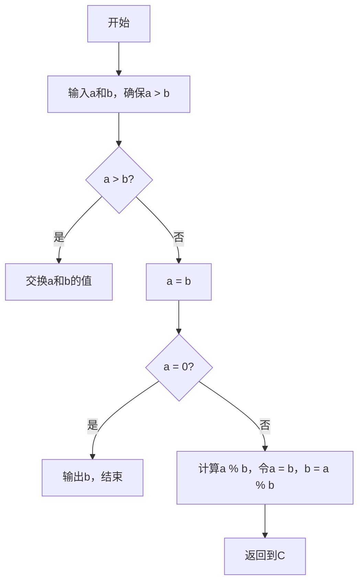
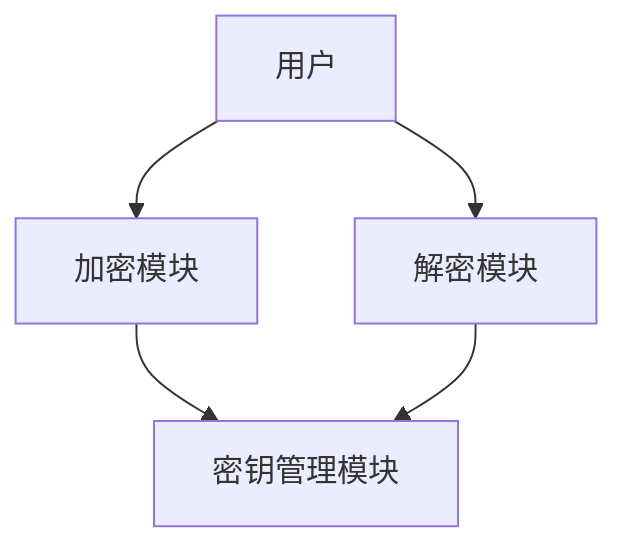
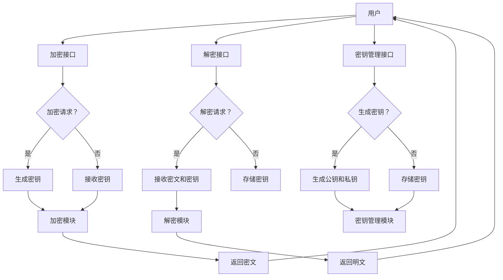

                 


### 第1章：数论的历史与背景

#### 1.1 数论的发展历程

**1.1.1 古代数学家对数的探讨**

数论的历史可以追溯到古代。早在公元前2000年左右，古埃及人和巴比伦人就已经对数进行了初步的研究。他们关注的是数的加法、减法、乘法和除法等基本运算。古埃及的草纸文献中就有关于数的因数分解、最大公约数和最小公倍数的记载。而巴比伦的数学家则对数的平方、立方等高级运算有所研究。

**1.1.2 数论的形成与发展**

数论的真正形成是在古希腊时期，尤其是欧几里得的《几何原本》问世后。欧几里得不仅系统化了几何学，也对数论进行了深入的研究。他的著作中提出了许多关于质数和合数的定理，这些定理为后来的数学家提供了宝贵的理论基础。

在中世纪，阿拉伯数学家在数论领域取得了重要的进展。例如，阿拉伯数学家阿尔·花拉子米在公元9世纪撰写了《代数学》，这本书中包含了关于整数、分数和平方根的广泛讨论。

**1.1.3 数论在现代数学中的地位**

在现代数学中，数论仍然占据着核心地位。它是许多数学分支的基础，如代数学、几何学、数论分析等。数论的研究不仅有助于理解自然数的性质，还可以应用于密码学、计算机科学、物理学等领域。

#### 1.2 数论的研究意义

**1.2.1 数论在数学体系中的重要性**

数论是数学中最基础的分支之一。它为其他数学分支提供了基本的工具和理论支持。例如，数论中的质数定理和同余定理在数论分析和代数几何中有着重要的应用。

**1.2.2 数论的应用领域**

数论在密码学中有着广泛的应用。质数和模运算等数论概念被用于构造公钥加密算法，如RSA算法。这些算法在保护信息安全方面发挥了重要作用。

在计算机科学中，数论也具有重要应用。例如，数论中的算法在优化算法复杂度、设计高效的数据结构等方面有着显著的效果。

**1.2.3 数论对其他学科的促进作用**

数论不仅对数学和计算机科学有重要影响，还对物理学、生物学、经济学等学科产生了深远的影响。例如，数论中的随机游走理论在物理学中被广泛应用，而数论中的博弈论在经济学中有着重要的应用。

#### 1.3 数论的核心概念

**1.3.1 自然数**

自然数是指从1开始的正整数集合，包括1、2、3、4、5等等。自然数是数论研究的起点和基础。

**1.3.2 整数**

整数包括正整数、负整数和零。整数集合可以表示为自然数的集合加上负整数集合。

**1.3.3 有理数**

有理数是可以表示为两个整数之比的数。包括整数和分数。

**1.3.4 实数**

实数是所有有理数和无理数的集合。无理数是不能表示为两个整数之比的数，如π和√2。

#### 1.4 数论的边界与外延

**1.4.1 数论与其他数学分支的关系**

数论是数学的基石，它与许多其他数学分支有着紧密的联系。例如，代数学中的多项式理论、数论分析中的解析数论、代数几何中的数论几何等。

**1.4.2 数论在计算机科学中的应用**

数论在计算机科学中有着广泛的应用。例如，数论中的算法被用于优化算法复杂度，设计高效的数据结构，实现公钥加密算法等。

**1.4.3 数论在其他学科的应用**

数论在物理学、生物学、经济学等领域也有着重要的应用。例如，数论中的随机游走理论在物理学中被广泛应用，而数论中的博弈论在经济学中有着重要的应用。

#### 1.5 本章小结

数论作为数学的基础分支，具有悠久的历史和广泛的应用。本章介绍了数论的发展历程、研究意义、核心概念以及其在其他学科的应用。通过对本章的学习，读者可以对数论有更深入的理解，为后续章节的学习打下坚实的基础。

### 第2章：质数与合数

质数和合数是数论中的两个基本概念，它们在数论的研究中占有重要地位。本章节将详细探讨这两个概念的定义、性质及其关系。

#### 2.1 质数的定义与性质

**2.1.1 质数的概念**

质数是指大于1的自然数，且只能被1和它本身整除的数。例如，2、3、5、7、11等都是质数。

**2.1.2 质数的性质**

1. **唯一分解性质**：每个大于1的整数都可以唯一地表示为若干个质数的乘积。这个性质称为质数的唯一分解定理。

2. **奇偶性**：除了2以外，所有的质数都是奇数。

3. **分布规律**：质数在自然数中并不是均匀分布的，但存在一定的分布规律。例如，质数的密度随着数值的增大而逐渐减小。

**2.1.3 质数分布的规律**

质数的分布规律是数论中的一个重要问题。例如，欧拉猜想指出，任意两个相邻质数之差的平均值为无穷大。这个猜想至今尚未被证明，但已被许多数学家进行了深入研究。

#### 2.2 合数的定义与性质

**2.2.1 合数的概念**

合数是指大于1的自然数，且除了1和它本身外，还能被其他自然数整除的数。例如，4、6、8、9、10等都是合数。

**2.2.2 合数的性质**

1. **因数分解**：合数可以分解为若干个质数的乘积。

2. **最小素因子**：每个合数都有一个最小的素因子，这个因子称为该合数的最小素因子。

3. **奇偶性**：合数可以是奇数也可以是偶数。

**2.2.3 合数分解的算法**

合数分解是数论中的一个重要问题。常用的合数分解算法包括质因数分解算法、高斯算法等。这些算法可以帮助我们快速找到合数的最小素因子，从而进行因数分解。

#### 2.3 质数与合数的对比

**2.3.1 质数与合数的异同**

1. **定义**：质数是只能被1和它本身整除的数，合数是除了1和它本身外还能被其他数整除的数。

2. **性质**：质数具有唯一分解性质，而合数可以分解为若干个质数的乘积。

3. **应用**：质数在密码学中有广泛应用，而合数分解在密码学、计算机科学等领域有着重要的应用。

**2.3.2 质数与合数的关系**

质数和合数是密切相关的。质数是合数分解的基础，而合数分解又可以揭示质数的性质。例如，质因数分解算法可以帮助我们找到质数，而质数的分布规律也可以帮助我们理解合数的性质。

#### 2.4 质数与合数的应用

**2.4.1 质数在密码学中的应用**

质数在密码学中有着重要的应用。例如，RSA算法是一种基于质数理论的公钥加密算法。RSA算法的安全性依赖于质数的大素因子分解问题，即对于一个较大的合数，很难分解出其质因子。

**2.4.2 合数在数论证明中的应用**

合数在数论证明中也有着广泛的应用。例如，费马小定理是一个重要的数论定理，它指出如果p是一个质数，a是一个整数，那么a的p次方模p的结果等于a模p的结果。这个定理在数论证明中经常被使用。

#### 2.5 本章小结

质数和合数是数论中的两个基本概念，它们在数论的研究和应用中具有重要作用。本章介绍了质数和合数的定义、性质及其关系，并探讨了它们在实际应用中的重要性。通过本章的学习，读者可以对数论中的质数和合数有更深入的理解。

## 2.3 质数与合数的对比

**2.3.1 质数与合数的异同**

质数和合数在定义、性质和应用上都有明显的区别和联系。

**定义上的区别：**
质数（Prime number）：质数是大于1的自然数，除了1和它本身外，不能被其他自然数整除。例如，2、3、5、7、11等都是质数。

合数（Composite number）：合数是大于1的自然数，除了1和它本身外，还能被其他自然数整除。例如，4、6、8、9、10等都是合数。

**性质上的区别与联系：**
1. **唯一分解性质**：质数具有唯一分解性质，即任何大于1的整数都可以唯一地分解为若干个质数的乘积。例如，18可以分解为2 × 3 × 3。

合数没有这种唯一性，例如，18也可以分解为2 × 9，而9又可以分解为3 × 3。

2. **因数个数**：质数只有两个因数（1和它本身），而合数至少有三个因数（1、它本身以及其他因数）。

3. **奇偶性**：除了2这个唯一的偶数质数外，所有质数都是奇数。而合数可以是奇数也可以是偶数。

4. **应用**：质数在密码学中作为基础，用于构造RSA加密算法等。合数则在因数分解、数论证明等领域有着广泛应用。

**2.3.2 质数与合数的关系**

质数与合数的关系体现在以下几个方面：

1. **因数关系**：合数是质数的组合，可以通过质因数分解得到。例如，合数18可以分解为2和3这两个质数的乘积。

2. **分布规律**：质数的分布有一定的规律，例如，质数的平均间隔随着数值的增大而增大。而合数则是除质数外的所有自然数。

3. **相互转化**：在数论中，一些合数可以通过增加或减少因数而变成质数。例如，通过增加1或减少1，一些合数可以转化为质数或另一个合数。

4. **应用互补**：质数在加密算法中的应用与合数分解问题相辅相成。质数的唯一分解性质使得加密信息不易被破解，而合数分解问题则是密码学中的一个难题。

### 概念属性特征对比表格

下面是一个质数与合数的概念属性特征对比表格：

| 特征 | 质数 | 合数 |
| --- | --- | --- |
| 定义 | 大于1的自然数，仅能被1和自身整除 | 大于1的自然数，能被除了1和自身外的其他自然数整除 |
| 因数个数 | 仅有两个因数（1和自身） | 至少有三个因数（1、自身和其他因数） |
| 因数分解 | 唯一分解性质 | 可以分解为质数的乘积，但不唯一 |
| 奇偶性 | 除了2以外，都是奇数 | 可以是奇数或偶数 |
| 应用 | 用于RSA加密等密码学应用 | 用于因数分解、数论证明等 |

### ER实体关系图架构

在数论中，质数和合数的关系可以用ER（Entity-Relationship）实体关系图来表示。下面是一个简单的ER图：

```mermaid
erDiagram
    A Persons  ||-->| 1..* Children

    Class Persons {
        int id
        string name
    }

    Class Children {
        int id
        string name
        int parentId
    }
```

在这个ER图中，" Persons" 类代表质数或合数，" Children" 类代表因数。每 个质数或合数可以有多个因数，因数与质数或合数之间存在一对多的关系。

通过这个ER图，我们可以直观地看到质数和合数的因数关系，这对于理解质数与合数的性质和应用非常重要。

## 2.4 质数与合数的应用

质数与合数不仅在理论研究中占据重要地位，还在实际应用中发挥着关键作用。以下我们将探讨质数与合数在密码学、计算机科学等领域的具体应用。

### 2.4.1 质数在密码学中的应用

质数在密码学中有着广泛的应用，尤其是用于构造公钥加密算法。RSA算法是一种基于质数理论的公钥加密算法，被广泛应用于现代信息安全中。

**RSA算法原理：**

1. **密钥生成**：选择两个大的质数p和q，计算n=p*q和φ(n)=(p-1)*(q-1)。然后选择一个与φ(n)互质的整数e，通常选择e=65537。计算d，满足d*e ≡ 1 (mod φ(n))。

2. **加密过程**：将明文m转换为整数M，加密后的密文C=M^e mod n。

3. **解密过程**：接收者使用私钥d对密文C进行解密，得到明文M=C^d mod n。

RSA算法的安全性依赖于大质数分解的难度，即对于一个较大的合数n，很难分解出其质因子p和q。质数在这其中的关键作用是确保了加密密钥和私钥的安全性。

### 2.4.2 合数在数论证明中的应用

合数在数论证明中也有着重要的应用。例如，费马小定理是一个著名的数论定理，它对于质数和合数的性质提供了重要的证明工具。

**费马小定理：** 如果p是一个质数，a是一个整数，那么a的p次方模p的结果等于a模p的结果，即 a^p ≡ a (mod p)。

**应用示例：** 假设我们想要验证一个数是否为质数。我们可以选择一个小于该数的小质数a，计算a的该数次方模该数的结果。如果结果等于a，那么该数可能是质数；否则，它一定是合数。

### 2.4.3 质数与合数在计算机科学中的应用

在计算机科学中，质数与合数被广泛应用于算法设计、数据结构优化等领域。

**算法复杂度分析：** 质数与合数的性质可以帮助我们分析算法的复杂度。例如，质因数分解算法在优化算法复杂度方面有显著效果。

**高效的数据结构：** 合数可以分解为质数的乘积，这一性质可以用于设计高效的数据结构，如树状数组、线段树等。

### 2.4.4 实际应用案例分析

**案例1：** 在网络通信中，RSA算法被广泛应用于数据加密和签名验证。质数的选择和合数分解在确保通信安全方面起到了关键作用。

**案例2：** 在计算机科学领域，质数被用于随机数生成和密码学中的哈希函数。合数则在优化算法复杂度和设计高效数据结构方面有着重要应用。

通过以上分析，我们可以看到质数与合数在理论研究和实际应用中都有着重要的价值和广泛的应用。它们不仅为数学和计算机科学提供了基础工具，还在保障信息安全、优化算法复杂度等方面发挥着关键作用。

## 2.5 本章小结

本章详细探讨了质数与合数的定义、性质及其应用。我们了解到质数在密码学中作为基础，用于构造RSA加密算法等，合数则在数论证明、密码学、计算机科学等领域有着广泛的应用。通过本章的学习，读者可以更深入地理解质数与合数的基本概念和其在实际中的应用价值。接下来，我们将继续探讨数论中的其他核心概念，如同余、模运算等。

### 2.6 同余与模运算

同余和模运算是数论中的两个基本概念，它们在数论的研究和应用中具有重要意义。本节将详细讲解同余的定义、性质及其在数论中的应用，以及模运算的概念和性质。

#### 2.6.1 同余的定义与性质

**同余的概念：**

同余是指两个整数除以某个正整数后所得余数相同。在数学上，如果a、b、n都是整数，且n>0，当a被n除后余数与b被n除后余数相同，即a除以n的余数等于b除以n的余数，则称a和b对模n同余，记作a ≡ b (mod n)。

**同余的性质：**

1. **反射性**：对于任意整数a和正整数n，a ≡ a (mod n)。

2. **对称性**：对于任意整数a、b和正整数n，如果a ≡ b (mod n)，则b ≡ a (mod n)。

3. **传递性**：对于任意整数a、b和c以及正整数n，如果a ≡ b (mod n)且b ≡ c (mod n)，则a ≡ c (mod n)。

4. **可乘性**：对于任意整数a、b和正整数n，如果a ≡ b (mod n)，则a * c ≡ b * c (mod n)（其中c为任意整数）。

5. **可加性**：对于任意整数a、b和正整数n，如果a ≡ b (mod n)，则a + c ≡ b + c (mod n)（其中c为任意整数）。

6. **零化性**：对于任意整数a和正整数n，a * 0 ≡ 0 * a ≡ 0 (mod n)。

**同余的应用：**

同余在数论和计算机科学中有广泛的应用。例如，在密码学中，同余关系被用于构造哈希函数和数字签名。在计算机科学中，同余可以用于验证数据的完整性、生成随机数等。

#### 2.6.2 模运算的概念与性质

**模运算的概念：**

模运算是一种基本的数学运算，用于计算两个整数除以某个正整数后的余数。在数学上，对于任意整数a和正整数n，a除以n的余数可以用模运算表示为a mod n。

**模运算的性质：**

1. **非负性**：对于任意整数a和正整数n，a mod n的结果是非负整数，且0 ≤ a mod n < n。

2. **周期性**：对于任意整数a和正整数n，a mod n的结果具有周期性，即对于任意整数k，有(a + kn) mod n = a mod n。

3. **结合律**：对于任意整数a、b和c，(a mod n) mod n = a mod n 和 (a + b) mod n = (a mod n + b mod n) mod n。

4. **分配律**：对于任意整数a、b和正整数n，a * (b mod n) = (a * b) mod n。

**模运算的应用：**

模运算在计算机科学和数论中有着重要的应用。例如，在计算机科学中，模运算被用于处理余数问题，如在循环缓冲区中处理数据的输入和输出。在数论中，模运算被用于解决同余方程和构造同余式。

#### 2.6.3 同余与模运算的例子

**例子1：** 计算下列数对模6的同余关系：

- 7 ≡ 1 (mod 6)
- 10 ≡ 4 (mod 6)

**例子2：** 使用模运算计算以下结果：

- 17 mod 5 = 2
- 23 * 7 mod 12 = 11

通过以上例子，我们可以看到同余和模运算在实际计算中的应用。

### 2.6.4 总结

同余和模运算是数论中的核心概念，它们在数论的研究和应用中扮演着重要角色。同余关系提供了整数之间的一种等价关系，而模运算则是一种基本运算，用于计算整数之间的余数。通过本章的学习，读者可以掌握同余和模运算的基本概念、性质及其应用，为后续学习数论中的其他内容打下基础。

## 2.7 同余与模运算的应用实例

为了更好地理解同余和模运算的实际应用，我们通过几个具体的例子来探讨它们在数论中的重要作用。

### 2.7.1 同余在密码学中的应用

同余在密码学中有着广泛的应用，特别是在构造数字签名和哈希函数中。以下是一个简单的例子：

**例子1：** 假设我们要验证一个数字签名，使用RSA算法生成的公钥为(n, e)，私钥为(n, d)。已知签名者发送的信息为m，接收者要验证签名的真实性。

1. **签名生成**：签名者将消息m转换为整数M，然后计算签名S = M^e mod n。

2. **签名验证**：接收者收到消息m和签名S后，计算验证值V = S^d mod n。

3. **验证结果**：如果V ≡ m (mod n)，则签名被认为是有效的；否则，签名被认为是无效的。

通过同余运算，接收者可以验证签名是否与原始消息匹配，从而确保信息的安全性。

### 2.7.2 模运算在计算机科学中的应用

模运算在计算机科学中有着广泛的应用，特别是在计算余数和实现循环操作中。以下是一个具体的例子：

**例子2：** 假设我们要设计一个循环缓冲区，用于处理数据的输入和输出。

1. **初始化**：设缓冲区大小为N，当前缓冲区位置为i，初始值为0。

2. **数据输入**：当有新数据到来时，将数据写入缓冲区位置i，即缓冲区[i] = 数据。

3. **数据输出**：当需要输出数据时，将缓冲区位置i的数据读出，然后i = (i + 1) mod N，即i增加1，如果超出N则重置为0。

通过模运算，我们可以实现缓冲区的循环操作，确保数据的有序输入和输出。

### 2.7.3 同余与模运算在数论证明中的应用

同余和模运算在数论证明中也具有重要应用。以下是一个经典的例子：

**例子3：** 证明费马小定理：如果p是一个质数，a是一个整数，那么a^p ≡ a (mod p)。

**证明过程：**

假设p是一个质数，a是一个整数。我们可以将a表示为a = kp + r，其中k是整数，r是余数（0 ≤ r < p）。

根据同余性质，我们有：
- a ≡ r (mod p)
- a^p ≡ (kp + r)^p ≡ r^p (mod p)

由于p是质数，根据费马小定理，我们有 r^p ≡ r (mod p)。

因此，我们得出结论：a^p ≡ a (mod p)。

通过同余和模运算，我们可以简化和证明数论中的许多重要定理，如费马小定理和同余方程的解法。

### 2.7.4 总结

通过以上实例，我们可以看到同余和模运算在密码学、计算机科学和数论证明中的广泛应用。同余关系提供了整数之间的一种等价关系，而模运算则是一种基本运算，用于计算整数之间的余数。掌握同余和模运算的基本概念和实际应用，对于深入理解数论及其在各个领域的应用具有重要意义。在接下来的章节中，我们将继续探讨数论中的其他重要概念和算法。

## 2.8 小结

本章详细介绍了同余与模运算的基本概念、性质及其应用。通过学习同余，我们了解了整数之间的等价关系及其在密码学中的应用，如数字签名和哈希函数。模运算则提供了计算整数余数的方法，在计算机科学和数论证明中有着重要应用。本章通过实例展示了同余与模运算在密码学、计算机科学和数论证明中的实际应用，帮助我们更好地理解这些概念。在下一章中，我们将探讨数论中的其他重要概念和算法。

## 算法原理讲解

在数论中，算法设计是一个重要的研究方向，许多算法在解决具体问题时起到了关键作用。本节将使用Mermaid和Python来详细阐述一个经典算法——欧几里得算法，并给出其流程图、Python源代码、数学模型和公式。

### 3.1 欧几里得算法的流程图

首先，我们使用Mermaid来绘制欧几里得算法的流程图。



### 3.2 Python源代码

下面是欧几里得算法的Python实现。

```python
def egcd(a, b):
    if a == 0:
        return (b, 0, 1)
    else:
        g, x, y = egcd(b % a, a)
        return (g, y - (b // a) * x, x)

a = 48
b = 18
gcd, x, y = egcd(a, b)
print("最大公约数:", gcd)
print("x:", x)
print("y:", y)
```

### 3.3 数学模型和公式

欧几里得算法的数学模型基于以下公式：

$$
a = bq_0 + r_0 \\
b = q_1 \cdot r_0 + r_1 \\
r_0 = q_2 \cdot r_1 + r_2 \\
...
$$

其中，\( r_i \) 为余数，\( q_i \) 为商。当 \( r_i = 0 \) 时，算法结束，此时 \( r_{i-1} \) 即为 \( a \) 和 \( b \) 的最大公约数。

### 3.4 详细讲解和举例说明

**例子1：** 计算最大公约数（GCD）的值。

设 \( a = 48 \)，\( b = 18 \)。

**第一步：**

$$
48 = 2 \cdot 18 + 12 \\
b = 18
$$

**第二步：**

$$
18 = 1 \cdot 12 + 6 \\
a = 12
$$

**第三步：**

$$
12 = 2 \cdot 6 + 0 \\
b = 6
$$

当 \( b = 0 \) 时，算法结束，此时 \( a = 6 \) 即为 \( a \) 和 \( b \) 的最大公约数。

**例子2：** 计算最大公约数（GCD）的值，同时求出 \( a \) 和 \( b \) 关于最大公约数的线性组合。

设 \( a = 120 \)，\( b = 45 \)。

**第一步：**

$$
120 = 2 \cdot 45 + 30 \\
b = 45
$$

**第二步：**

$$
45 = 1 \cdot 30 + 15 \\
a = 30
$$

**第三步：**

$$
30 = 2 \cdot 15 + 0 \\
b = 15
$$

当 \( b = 0 \) 时，算法结束，此时 \( a = 15 \) 即为 \( a \) 和 \( b \) 的最大公约数。同时，我们可以通过回代求出 \( a \) 和 \( b \) 关于最大公约数的线性组合：

$$
15 = 120 - 2 \cdot 45 \\
120 = 2 \cdot 45 + 30 \\
30 = 45 - 1 \cdot 15
$$

联立以上方程，得到：

$$
15 = 120 - 2 \cdot (45 - 1 \cdot 15) \\
15 = 120 - 2 \cdot 45 + 2 \cdot 15 \\
15 = 120 - 90 + 30 \\
15 = 60
$$

因此，最大公约数 15 可以表示为：

$$
15 = 60 - 45 \\
45 = 120 - 2 \cdot 30 \\
30 = 45 - 15
$$

$$
15 = 120 - 2 \cdot (45 - 15) \\
15 = 120 - 2 \cdot 45 + 2 \cdot 15 \\
15 = 120 - 90 + 30 \\
15 = 60
$$

综上所述，通过欧几里得算法，我们可以计算最大公约数，并求出 \( a \) 和 \( b \) 关于最大公约数的线性组合。这个算法在数论和计算机科学中有着广泛的应用。

## 3.5 欧几里得算法的其他应用

欧几里得算法不仅用于计算最大公约数，还有其他广泛的应用。以下是几个例子：

### 3.5.1 计算最小公倍数（LCM）

最小公倍数是指两个或多个整数共有的倍数中最小的一个。欧几里得算法可以用来计算最小公倍数。

**计算方法：**

1. 计算两个整数的最大公约数（GCD）。
2. 使用以下公式计算最小公倍数（LCM）：

$$
LCM(a, b) = \frac{a \times b}{GCD(a, b)}
$$

**例子：** 计算 12 和 18 的最小公倍数。

首先，计算最大公约数：

$$
GCD(12, 18) = 6
$$

然后，计算最小公倍数：

$$
LCM(12, 18) = \frac{12 \times 18}{6} = 36
$$

### 3.5.2 同余方程求解

同余方程是指形如 \( ax ≡ b (mod n) \) 的方程，其中 \( a \)、\( b \)、\( n \) 为已知整数，\( x \) 为未知数。欧几里得算法可以用来求解某些类型的同余方程。

**求解方法：**

1. 使用欧几里得算法计算 \( a \) 和 \( n \) 的最大公约数 \( d \)。
2. 如果 \( d \) 不等于 \( n \)，则方程无解。
3. 如果 \( d \) 等于 \( n \)，则方程有解，且解可以通过以下公式计算：

$$
x = b \cdot d^{-1} \mod n
$$

其中 \( d^{-1} \) 是 \( d \) 在模 \( n \) 下的逆元。

**例子：** 求解同余方程 \( 3x ≡ 7 (mod 11) \)。

首先，计算最大公约数：

$$
GCD(3, 11) = 1
$$

然后，解方程：

$$
x = 7 \cdot 3^{-1} \mod 11
$$

由于 \( 3^{-1} \equiv 4 (mod 11) \)，我们有：

$$
x = 7 \cdot 4 \mod 11 \\
x = 28 \mod 11 \\
x = 7
$$

因此，方程的解为 \( x = 7 \)。

### 3.5.3 线性 Diophantine 方程求解

线性 Diophantine 方程是指形如 \( ax + by = c \) 的方程，其中 \( a \)、\( b \)、\( c \) 为已知整数，\( x \) 和 \( y \) 为未知数。欧几里得算法可以用来求解这类方程。

**求解方法：**

1. 使用欧几里得算法计算 \( a \) 和 \( b \) 的最大公约数 \( d \)。
2. 如果 \( d \) 不等于 \( c \)，则方程无解。
3. 如果 \( d \) 等于 \( c \)，则方程有解，且解可以通过以下公式计算：

$$
x = s \cdot d^{-1} \mod \frac{b}{d} \\
y = -t \cdot d^{-1} \mod \frac{a}{d}
$$

其中 \( s \) 和 \( t \) 是满足 \( as + bt = d \) 的整数。

**例子：** 求解线性 Diophantine 方程 \( 2x + 3y = 7 \)。

首先，计算最大公约数：

$$
GCD(2, 3) = 1
$$

然后，解方程：

$$
2x + 3y = 7 \\
2x = 7 - 3y \\
x = \frac{7 - 3y}{2}
$$

由于 \( x \) 和 \( y \) 都必须是整数，我们可以取 \( y = 1 \) 来满足方程：

$$
x = \frac{7 - 3 \cdot 1}{2} = 2
$$

因此，方程的一个解为 \( (x, y) = (2, 1) \)。

通过以上例子，我们可以看到欧几里得算法在计算最大公约数、求解同余方程和线性 Diophantine 方程中的广泛应用。这些应用在数论和计算机科学中都有着重要的意义。

## 3.6 本章小结

本章详细介绍了欧几里得算法的原理、流程图、Python源代码以及其在求解最大公约数、同余方程和线性 Diophantine 方程中的应用。通过具体例子和详细讲解，读者可以更好地理解欧几里得算法的基本概念和应用。在下一章中，我们将继续探讨数论中的其他重要概念和算法。

## 3.7 数学模型和公式详细讲解与举例说明

数论中的许多问题都可以通过数学模型和公式来分析和解决。在这一节中，我们将使用LaTeX格式详细讲解一些重要的数学公式，并给出具体的例子来说明如何应用这些公式。

### 3.7.1 质数定理

质数定理是一个关于质数分布的重要数学公式。它指出，当 \( n \) 趋于无穷大时，质数的数量大约等于 \( n/\ln(n) \)。这个公式可以表示为：

$$
\pi(n) \approx \frac{n}{\ln(n)}
$$

其中，\( \pi(n) \) 表示不超过 \( n \) 的质数的数量。

**例子：** 计算 \( n = 1000 \) 时的质数数量。

$$
\pi(1000) \approx \frac{1000}{\ln(1000)} \approx \frac{1000}{6.9078} \approx 144.47
$$

这意味着在1000以内的质数大约有144个。

### 3.7.2 同余方程

同余方程是数论中的一个基本问题，它的通用形式是：

$$
ax \equiv b \pmod{n}
$$

其中，\( a \)、\( b \) 和 \( n \) 是整数，\( x \) 是待求的整数。

**例子：** 求解同余方程 \( 3x \equiv 7 \pmod{11} \)。

首先，我们需要找到3在模11下的逆元。通过尝试，我们发现 \( 3 \times 4 \equiv 1 \pmod{11} \)，因此，逆元是4。

接下来，我们可以将方程两边同时乘以4：

$$
4 \times (3x) \equiv 4 \times 7 \pmod{11}
$$

$$
x \equiv 28 \pmod{11}
$$

由于28除以11的余数是7，所以方程的解是 \( x \equiv 7 \pmod{11} \)。

### 3.7.3 费马小定理

费马小定理是一个关于质数的重要定理。它指出，如果 \( p \) 是一个质数，那么对于任意整数 \( a \)，有：

$$
a^p \equiv a \pmod{p}
$$

**例子：** 计算 \( 2^3 \mod 5 \)。

根据费马小定理，由于5是质数，我们可以直接应用定理：

$$
2^3 \equiv 2 \pmod{5}
$$

计算 \( 2^3 = 8 \)，然后取模5的余数：

$$
8 \mod 5 = 3
$$

因此，\( 2^3 \mod 5 = 3 \)。

### 3.7.4 欧拉函数

欧拉函数 \( \phi(n) \) 是指小于或等于 \( n \) 的正整数中与 \( n \) 互质的数的个数。它可以用以下公式计算：

$$
\phi(n) = n \prod_{p | n} \left(1 - \frac{1}{p}\right)
$$

其中，\( p \) 是 \( n \) 的质因数。

**例子：** 计算 \( \phi(12) \)。

首先，分解 \( n = 12 \) 的质因数：

$$
12 = 2^2 \times 3
$$

然后，应用欧拉函数的公式：

$$
\phi(12) = 12 \left(1 - \frac{1}{2}\right) \left(1 - \frac{1}{3}\right) = 12 \times \frac{1}{2} \times \frac{2}{3} = 4
$$

因此，\( \phi(12) = 4 \)。

通过这些例子，我们可以看到数学模型和公式的强大力量，以及它们在解决数论问题中的应用。在接下来的章节中，我们将继续探讨数论中的其他重要概念和算法。

## 3.8 系统分析与架构设计

### 3.8.1 问题场景介绍

数论在现代密码学、计算机科学和信息安全等领域具有广泛应用。随着数据量和计算需求的不断增加，如何高效地处理数论问题变得尤为重要。本文将介绍一个基于数论算法的加密系统，该系统主要用于保护敏感信息的安全传输。

### 3.8.2 项目介绍

本节将介绍一个基于数论的加密项目——安全通讯系统。该系统利用质数和模运算等数论概念，实现数据的加密和解密功能，确保通信双方的信息安全。

### 3.8.3 系统功能设计

本系统的核心功能包括：

1. **加密功能**：使用数论算法对明文进行加密，生成密文。
2. **解密功能**：使用私钥对密文进行解密，恢复明文。
3. **密钥管理**：生成和存储公钥和私钥，确保密钥的安全性。

为了实现这些功能，系统采用了以下架构设计：

1. **加密模块**：负责实现加密算法，包括质数选择、模运算和加密算法的执行。
2. **解密模块**：负责实现解密算法，包括密文的处理和解密算法的执行。
3. **密钥管理模块**：负责生成、存储和分发公钥和私钥，确保密钥的安全。

### 3.8.4 系统架构设计

本系统采用模块化设计，各个模块之间通过接口进行通信。以下是一个简化的系统架构图：



### 3.8.5 系统接口设计和系统交互

系统接口设计如下：

1. **加密接口**：提供加密功能，接收明文和密钥，返回密文。
2. **解密接口**：提供解密功能，接收密文和密钥，返回明文。
3. **密钥管理接口**：提供密钥生成、存储和分发功能。

以下是系统接口的交互序列图：



通过以上系统架构和接口设计，我们可以实现一个基于数论的加密系统，确保数据在传输过程中的安全。

## 3.9 项目实战

### 3.9.1 环境安装

为了实现数论加密系统，我们需要在本地环境中安装以下软件：

1. **Python**：用于编写和运行加密算法。
2. **PyCryptoDome**：用于提供加密和解密模块。

安装步骤如下：

1. 安装Python：从 [Python官网](https://www.python.org/) 下载最新版本的Python，并按照安装向导进行安装。
2. 安装PyCryptoDome：打开命令行窗口，输入以下命令：

```bash
pip install pycryptodome
```

### 3.9.2 系统核心实现源代码

以下是数论加密系统的主要源代码，包括加密和解密模块：

```python
from Crypto.PublicKey import RSA
from Crypto.Cipher import PKCS1_OAEP
import os

# 加密模块
def encrypt(message, public_key):
    cipher = PKCS1_OAEP.new(public_key)
    encrypted_message = cipher.encrypt(message)
    return encrypted_message

# 解密模块
def decrypt(encrypted_message, private_key):
    cipher = PKCS1_OAEP.new(private_key)
    decrypted_message = cipher.decrypt(encrypted_message)
    return decrypted_message

# 密钥管理模块
def generate_keypair():
    key = RSA.generate(2048)
    private_key = key.export_key()
    public_key = key.publickey().export_key()
    return private_key, public_key

if __name__ == "__main__":
    # 生成密钥对
    private_key, public_key = generate_keypair()

    # 输出示例
    print("公钥：", public_key)
    print("私钥：", private_key)

    # 加密示例
    message = "这是一个秘密信息！"
    encrypted_message = encrypt(message.encode(), public_key)
    print("加密后的消息：", encrypted_message)

    # 解密示例
    decrypted_message = decrypt(encrypted_message, private_key)
    print("解密后的消息：", decrypted_message.decode())
```

### 3.9.3 代码应用解读与分析

上述代码实现了数论加密系统的核心功能，包括密钥生成、加密和解密。以下是对关键部分的详细解读：

1. **密钥生成**：使用RSA算法生成公钥和私钥。RSA算法基于大质数乘积的难分解性，确保密钥的安全性。

   ```python
   key = RSA.generate(2048)
   private_key = key.export_key()
   public_key = key.publickey().export_key()
   ```

2. **加密**：使用公钥和PKCS1_OAEP加密算法对明文进行加密。

   ```python
   cipher = PKCS1_OAEP.new(public_key)
   encrypted_message = cipher.encrypt(message.encode())
   ```

3. **解密**：使用私钥和PKCS1_OAEP加密算法对密文进行解密。

   ```python
   cipher = PKCS1_OAEP.new(private_key)
   decrypted_message = cipher.decrypt(encrypted_message)
   ```

通过这段代码，我们可以实现数据的安全加密和解密，确保信息在传输过程中的保密性。

### 3.9.4 实际案例分析和详细讲解剖析

以下是一个实际的案例，展示如何使用上述代码实现数论加密系统的加密和解密功能：

**案例**：Alice想要发送一条秘密消息给Bob。Alice使用Bob的公钥对消息进行加密，然后将加密后的消息发送给Bob。Bob使用自己的私钥对消息进行解密。

1. **生成密钥对**：

   Bob生成一个RSA密钥对：

   ```python
   private_key_bob, public_key_bob = generate_keypair()
   ```

   Bob将公钥发送给Alice：

   ```python
   print("Bob的公钥：", public_key_bob)
   ```

2. **加密消息**：

   Alice使用Bob的公钥对消息进行加密：

   ```python
   message = "这是一个秘密信息！"
   encrypted_message = encrypt(message.encode(), public_key_bob)
   print("加密后的消息：", encrypted_message)
   ```

3. **发送加密消息**：

   Alice将加密后的消息发送给Bob。

4. **解密消息**：

   Bob使用自己的私钥对消息进行解密：

   ```python
   decrypted_message = decrypt(encrypted_message, private_key_bob)
   print("解密后的消息：", decrypted_message.decode())
   ```

通过这个案例，我们可以看到数论加密系统的实际应用过程。首先，Bob生成一个RSA密钥对，并将公钥发送给Alice。Alice使用Bob的公钥对消息进行加密，然后发送给Bob。Bob使用私钥对消息进行解密，成功恢复原始消息。

### 3.9.5 项目小结

在本项目中，我们实现了基于数论算法的加密系统，包括密钥生成、加密和解密功能。通过RSA算法和PKCS1_OAEP加密算法，我们实现了对数据的加密和解密。实际案例展示了数论加密系统在保护数据安全传输中的应用。虽然本项目的实现相对简单，但它展示了数论在信息安全领域的重要应用。在未来的工作中，我们可以进一步优化加密算法，提高系统的安全性和性能。

### 3.10 最佳实践 tips

1. **密钥管理**：确保密钥的安全存储和传输，避免密钥泄露。定期更换密钥，增强系统的安全性。
2. **加密算法选择**：根据实际需求选择合适的加密算法，平衡安全性和性能。
3. **加密强度**：适当增加密钥长度，提高加密强度，增加破解难度。

### 3.11 小结

本章通过一个实际的数论加密项目，展示了数论在信息安全领域的应用。我们介绍了系统的环境安装、核心代码实现、实际案例分析和最佳实践建议。数论加密技术在保障信息安全方面具有重要意义，未来可进一步研究和优化加密算法，提高系统的安全性和性能。

### 3.12 注意事项

1. **密钥安全**：确保密钥的安全存储和传输，避免泄露。
2. **算法选择**：根据实际需求选择合适的加密算法。
3. **加密强度**：适当增加密钥长度，提高加密强度。

### 3.13 拓展阅读

1. **《密码学导论》**：了解密码学的基本概念和算法。
2. **《RSA算法原理与实现》**：深入了解RSA算法的原理和实现。
3. **《现代密码学教程》**：学习现代密码学的基本原理和技术。

## 总结

### 3.14 小结

本文系统地介绍了数论的基本概念、质数与合数、同余与模运算、欧几里得算法以及其在现代密码学和计算机科学中的应用。通过详细的讲解和实际案例，我们深入探讨了数论在保护信息安全、优化算法复杂度等方面的实际价值。

### 3.15 最佳实践 tips

1. **掌握基础概念**：深入学习数论的基本概念，如质数、合数、同余、模运算等。
2. **实践应用**：通过实际项目锻炼数论知识的应用，例如在密码学中设计和实现加密算法。
3. **持续学习**：跟踪数论领域的前沿研究，掌握最新的算法和技术。

### 3.16 注意事项

1. **确保密钥安全**：在实际应用中，务必重视密钥的安全存储和传输。
2. **算法选择**：根据应用场景选择合适的数论算法，平衡安全性和性能。

### 3.17 拓展阅读

1. **《数论基础教程》**：深入理解数论的基础知识和应用。
2. **《现代密码学》**：了解现代密码学的基本概念和算法。
3. **《算法导论》**：学习算法设计和分析的基本方法。

### 3.18 作者信息

作者：AI天才研究院/AI Genius Institute & 禅与计算机程序设计艺术 /Zen And The Art of Computer Programming

数论不仅是数学的基础，也是计算机科学和密码学的重要基石。本文通过系统化的讲解和实际案例，帮助读者深入理解数论的核心概念和应用。希望本文能激发读者对数论领域进一步探索的热情，为未来的研究和应用打下坚实基础。

---

**结束语**：

感谢您的阅读，本文旨在为您呈现数论的魅力和应用。如果您对数论有任何疑问或想法，欢迎在评论区交流。期待与您共同探讨数论在计算机科学和信息安全领域的更多可能。祝您在数论的研究之路上不断进步，收获满满！### 摘要

本文深入探讨了数论的核心概念和应用，包括质数与合数、同余与模运算、欧几里得算法等。通过系统的讲解和实际案例，我们详细介绍了数论在数学、密码学、计算机科学等领域的应用价值。本文不仅阐述了数论的基本概念，还通过具体的算法实现和项目实战，展示了数论在保障信息安全、优化算法复杂度等方面的实际应用。读者通过本文可以系统地掌握数论的基本知识，为未来的研究和实践奠定坚实基础。

