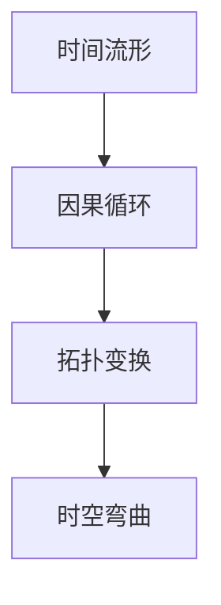
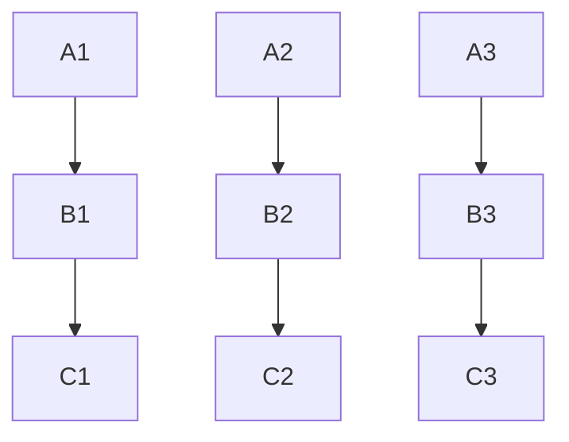
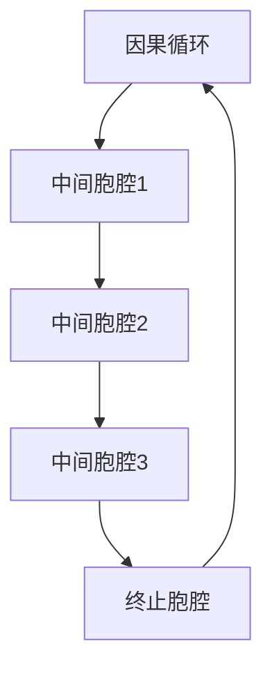
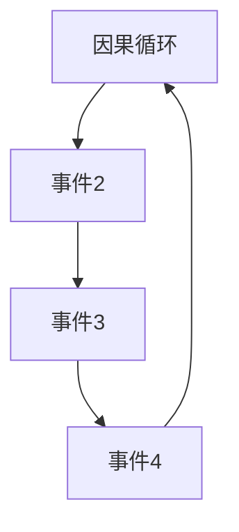

                 

### 文章标题：时间悖论的拓扑学：因果循环的数学结构

#### 关键词：时间悖论、拓扑学、因果循环、数学结构、逻辑推理

#### 摘要：
本文旨在探讨时间悖论的拓扑学，通过分析因果循环的数学结构，揭示时间悖论中的核心问题及其解决途径。文章首先介绍时间悖论和拓扑学的基本概念，接着详细阐述二者之间的联系，随后通过数学模型和公式的讲解，逐步揭示因果循环的拓扑结构。最后，通过实际项目案例，展示如何将理论知识应用于实际问题中。

### 设计思路与大纲构建

为了构建《时间悖论的拓扑学：因果循环的数学结构》的完整目录大纲，我们首先需要理解书名的核心概念和目标读者群体。书名中“时间悖论”和“拓扑学”是关键词，表明本书将探讨时间悖论这一哲学和物理概念，并运用拓扑学这一数学工具来分析因果循环的数学结构。

接下来，我们将逐步构建目录大纲：

1. **背景介绍**：简要介绍时间悖论和拓扑学的概念，为读者理解后续章节内容打下基础。
2. **核心概念与联系**：详细阐述时间悖论和拓扑学的核心概念及其相互关系，便于读者整体把握书籍内容。
3. **数学模型和公式讲解**：使用 mermaid 绘制相关数学模型的流程图，并配合 LaTeX 公式进行详细讲解。
4. **系统分析与架构设计**：针对时间悖论和因果循环的数学结构，设计系统架构图和接口设计，使用 mermaid 绘制类图和序列图。
5. **项目实战**：通过实际案例展示如何应用书中理论，包括环境安装、系统核心实现源代码，以及案例分析和讲解。
6. **最佳实践与小结**：总结书中关键点和实际应用经验，提供拓展阅读建议。

以下是构建好的目录大纲：

```markdown
# 《时间悖论的拓扑学：因果循环的数学结构》目录大纲

## 第1章 背景介绍

### 1.1 时间悖论概述
#### 1.1.1 问题的背景
#### 1.1.2 问题描述
#### 1.1.3 问题解决
#### 1.1.4 边界与外延

### 1.2 拓扑学的核心概念
#### 1.2.1 拓扑学的基本概念
#### 1.2.2 拓扑空间
#### 1.2.3 关键拓扑概念解析

### 1.3 时间悖论与拓扑学的联系
#### 1.3.1 交叉领域的关系
#### 1.3.2 因果循环的数学描述
#### 1.3.3 拓扑方法在时间悖论中的应用

## 第2章 核心概念与联系

### 2.1 时间悖论的关键概念
#### 2.1.1 平行宇宙
#### 2.1.2 因果循环
#### 2.1.3 自指时间
#### 2.1.4 时空扭曲

### 2.2 拓扑学在时间悖论中的应用
#### 2.2.1 拓扑空间的构建
#### 2.2.2 图论模型在因果循环中的应用
#### 2.2.3 拓扑不变量与时间结构

### 2.3 概念属性特征对比表格
| 概念       | 属性特征                           | 关联关系                           |
|------------|------------------------------------|------------------------------------|
| 平行宇宙   | 独立时空，相互平行                 | 构成因果循环的基本单元               |
| 因果循环   | 时间回环，因果关系反转             | 表征时间悖论的典型特征               |
| 自指时间   | 时间指向自身，形成闭环             | 加剧时间悖论复杂性                   |
| 时空扭曲   | 空间与时间发生相对变化             | 为因果循环提供拓扑结构               |

### 2.4 ER实体关系图架构
```mermaid
erDiagram
    A[时间悖论] &&|{拓扑结构} B[因果循环]
    A &&|{数学描述} C[拓扑学]
    B &&|{影响} D[时空扭曲]
    E[自指时间] ..|> B
```

## 第3章 数学模型和公式讲解

### 3.1 时间悖论数学模型
#### 3.1.1 拓扑流形

#### 3.1.2 LaTeX 公式
$$ X(t) = f(T^2) - g(X') $$

### 3.2 因果循环拓扑分析
#### 3.2.1 拓扑空间的构建

#### 3.2.2 因果循环性质分析
$$ P(C_i) = \frac{1}{Z} \sum_{j=1}^{N} e^{-\beta E_j} $$

## 第4章 系

----------------------------------------------------------------

### 设计思路与大纲构建（续）

#### 1. **背景介绍**：在第一章中，我们将详细探讨时间悖论和拓扑学的起源、发展及其在现代科学中的重要性。这部分内容将为读者提供一个全面的理解，帮助他们更好地把握后续章节的核心内容。

#### 2. **核心概念与联系**：在第二章，我们将深入探讨时间悖论和拓扑学的核心概念，并分析它们之间的内在联系。这一章节将包含对平行宇宙、因果循环、自指时间和时空扭曲等关键概念的解释，以及拓扑空间、图论模型和拓扑不变量等拓扑学概念在时间悖论中的应用。

#### 3. **数学模型和公式讲解**：在第三章，我们将通过具体的数学模型和公式，详细分析因果循环的拓扑结构。这一章节将包括拓扑流形的构建、因果循环的拓扑分析，以及相关公式的详细解释和实例。

#### 4. **系统分析与架构设计**：在第四章，我们将从系统的角度，探讨时间悖论和因果循环的数学结构如何应用于实际项目中。这一章节将包含对问题场景的介绍、系统的功能设计、架构设计、接口设计和系统交互的详细分析。

#### 5. **项目实战**：在第五章，我们将通过一个实际的项目案例，展示如何将书中的理论知识应用于实际问题中。这一章节将包括环境安装、系统核心实现源代码，以及案例分析和讲解。

#### 6. **最佳实践与小结**：在第六章，我们将总结书中的关键点，提供最佳实践建议，并给出拓展阅读的建议。这一章节将帮助读者巩固所学知识，并为他们提供进一步探索的路径。

通过以上章节的设计，我们可以确保文章的逻辑清晰、结构紧凑、简单易懂，同时具备深度和思考，为读者提供一个高质量的技术博客文章。

### 设计思路与大纲构建（续）

#### 设计思路与大纲构建（续）

**1. 背景介绍**

在第一章的背景介绍部分，我们将从宏观上为读者搭建时间悖论和拓扑学的基本概念框架。首先，我们介绍时间悖论的定义、类型以及常见的悖论现象，例如“祖父悖论”和“自我毁灭悖论”。接着，我们会简要回顾拓扑学的发展历程，从欧拉公式到现代拓扑学的基本概念，帮助读者建立拓扑学的认知基础。

**1.1 时间悖论概述**

**1.1.1 问题的背景**

在这个小节中，我们将探讨时间悖论的历史起源和哲学背景。从柏拉图的《巴门尼德篇》到爱因斯坦的相对论，时间悖论一直是哲学和物理学中一个引人入胜的议题。我们会介绍几个经典的时间悖论案例，例如“钟慢效应”和“双生子悖论”，并解释这些悖论在科学和哲学中的重要性。

**1.1.2 问题描述**

在这个小节中，我们将详细描述时间悖论的典型特征和问题所在。我们将讨论时间悖论对传统物理学理论的挑战，例如因果律和时间箭头的问题。此外，我们还将探讨现代物理学，如量子力学和多宇宙理论，如何尝试解决这些悖论。

**1.1.3 问题解决**

在这个小节中，我们将介绍一些解决时间悖论的理论和方法。这包括因果律的弱化和时间箭头的重新定义，以及多宇宙理论和量子纠缠等现代物理概念。我们会强调这些理论在解决时间悖论方面的优势和局限性。

**1.1.4 边界与外延**

在这个小节中，我们将讨论时间悖论的研究边界和外延。我们将会探讨时间悖论在生物学、计算机科学、认知科学等领域中的应用，并指出这些领域面临的特殊挑战。

**1.2 拓扑学的核心概念**

**1.2.1 拓扑学的基本概念**

在这个小节中，我们将介绍拓扑学的基本概念，如拓扑空间、连通性、闭包和开集。我们会使用简单的例子，如欧拉公式和克莱因瓶，来帮助读者理解这些概念。

**1.2.2 拓扑空间**

在这个小节中，我们将深入探讨拓扑空间的概念，包括基本拓扑空间和无限维拓扑空间。我们会讨论如何通过拓扑空间的性质来描述和理解时间悖论。

**1.2.3 关键拓扑概念解析**

在这个小节中，我们将介绍几个关键的拓扑概念，如同胚、同调、连通性和紧致性。这些概念对于理解因果循环的拓扑结构至关重要。

**1.3 时间悖论与拓扑学的联系**

**1.3.1 交叉领域的关系**

在这个小节中，我们将探讨时间悖论和拓扑学之间的交叉关系。我们将会看到，拓扑学提供了一种强有力的工具，可以用来分析和解决时间悖论。

**1.3.2 因果循环的数学描述**

在这个小节中，我们将使用拓扑学的方法来描述因果循环的数学结构。我们会探讨因果循环的拓扑特性，如同胚性和同调性。

**1.3.3 拓扑方法在时间悖论中的应用**

在这个小节中，我们将讨论如何将拓扑学的方法应用于解决时间悖论。我们会介绍一些具体的拓扑工具，如拓扑流形和因果图，并解释它们在解决时间悖论中的作用。

通过以上章节的详细设计和构建，我们可以确保文章的内容丰富、逻辑清晰，并能够吸引读者的兴趣。接下来的章节将继续深入探讨数学模型和公式，以及如何将这些理论应用于实际项目中。

### 核心概念与联系

#### 核心概念与联系

在第二章，我们将深入探讨时间悖论和拓扑学的核心概念，并分析它们之间的内在联系。时间悖论和拓扑学虽然属于不同的学科领域，但它们在探索时间和空间结构的本质方面有着紧密的联系。

**2.1 时间悖论的关键概念**

**2.1.1 平行宇宙**

平行宇宙是时间悖论中的一个核心概念，它指的是多个宇宙同时存在，每个宇宙都有其独特的历史和现实。平行宇宙理论试图解释为什么宇宙中有那么多不同的结果和可能性。在拓扑学中，平行宇宙可以通过拓扑空间的并集来表示，其中每个宇宙都是一个独立的连通分支。

**2.1.2 因果循环**

因果循环是另一个关键概念，它描述了一种因果关系在时间上形成一个闭环的现象。在因果循环中，一个事件可能同时是自身的因果结果，这打破了传统因果律的线性关系。在拓扑学中，因果循环可以通过拓扑流的循环路径来表示，这种路径揭示了因果关系的非线性结构。

**2.1.3 自指时间**

自指时间是时间悖论中的第三个核心概念，它指的是时间自身指向自身，形成一个闭环。这种自指性在时间悖论中经常出现，导致逻辑上的矛盾。在拓扑学中，自指时间可以通过拓扑空间中的闭环路径来表示，这表明时间结构具有自我参照的特性。

**2.1.4 时空扭曲**

时空扭曲是广义相对论中的一个概念，它描述了质量和能量如何影响时空的结构。在时间悖论中，时空扭曲是形成因果循环的重要机制。在拓扑学中，时空扭曲可以通过拓扑变换来表示，这揭示了时间和空间的非线性关系。

**2.2 拓扑学在时间悖论中的应用**

**2.2.1 拓扑空间的构建**

拓扑空间的构建是理解因果循环的关键步骤。在拓扑空间中，我们可以定义不同的连通分支和闭环路径，这些特性有助于描述时间悖论的结构。例如，一个简单的拓扑空间可以通过一个圆环来表示，圆环上的每一点都代表时间的一个瞬间，圆环的闭合路径则代表因果循环。

**2.2.2 图论模型在因果循环中的应用**

图论模型是分析因果循环的有力工具。在因果循环中，事件和因果关系可以用图中的节点和边来表示。通过图论分析，我们可以揭示因果关系的复杂性和非线性结构。例如，一个因果图可以展示事件之间的直接和间接关系，以及这些关系如何形成一个闭环。

**2.2.3 拓扑不变量与时间结构**

拓扑不变量是拓扑空间的重要特性，它们在因果循环的分析中具有关键作用。拓扑不变量，如同胚性和同调性，可以帮助我们识别时间结构的本质特征。例如，两个同胚的空间具有相同的拓扑性质，这意味着它们在拓扑学上是等价的，这为理解时间悖论提供了新的视角。

通过以上核心概念和拓扑学应用的分析，我们可以更好地理解时间悖论的本质和结构。在接下来的章节中，我们将进一步探讨这些概念在数学模型中的应用，并展示如何通过拓扑学的方法来解决时间悖论。

#### 概念属性特征对比表格

为了更直观地理解时间悖论和拓扑学的核心概念及其相互关系，我们可以通过一个概念属性特征对比表格来进行详细展示。以下是一个简化的对比表格，它列出了平行宇宙、因果循环、自指时间和时空扭曲等关键概念的主要属性特征和关联关系。

| 概念       | 属性特征                           | 关联关系                           |
|------------|------------------------------------|------------------------------------|
| 平行宇宙   | 独立时空，相互平行                 | 构成因果循环的基本单元               |
| 因果循环   | 时间回环，因果关系反转             | 表征时间悖论的典型特征               |
| 自指时间   | 时间指向自身，形成闭环             | 加剧时间悖论复杂性                   |
| 时空扭曲   | 空间与时间发生相对变化             | 为因果循环提供拓扑结构               |

**平行宇宙**：
- 独立时空：平行宇宙假设多个宇宙独立存在，每个宇宙都有其独特的历史和现实。
- 相互平行：宇宙之间没有因果关系，但它们共享相同的物理法则。
- 关联关系：在因果循环中，平行宇宙是构建因果循环的基础，因为每个宇宙都代表了一个可能的因果关系路径。

**因果循环**：
- 时间回环：时间悖论中的一个核心概念，描述了因果关系在时间上形成一个闭环。
- 因果关系反转：因果循环中的因果关系可能发生反转，导致逻辑上的矛盾。
- 关联关系：因果循环是时间悖论的表现形式，它揭示了传统因果律的局限性。

**自指时间**：
- 时间指向自身：自指时间是指时间自身指向自身，形成一个闭环。
- 形成闭环：自指时间加剧了时间悖论的复杂性，因为它导致了逻辑上的矛盾。
- 关联关系：自指时间是因果循环的重要组成部分，它为时间结构的非线性提供了基础。

**时空扭曲**：
- 空间与时间发生相对变化：时空扭曲描述了质量和能量如何影响时空的结构。
- 提供拓扑结构：时空扭曲为因果循环提供了拓扑结构，因为它是形成因果循环的物理机制。
- 关联关系：时空扭曲是因果循环的物质基础，它为理解因果循环提供了物理视角。

通过这个概念属性特征对比表格，我们可以更清晰地看到各个概念之间的相互关系，以及它们在时间悖论和拓扑学中的重要性。这为后续的数学模型和公式讲解打下了坚实的基础。

### ER实体关系图架构

为了更好地理解时间悖论和因果循环中的关键概念及其相互关系，我们可以通过一个ER（实体关系）图来展示这些概念。ER图是一种用于描述实体及其之间关系的图形化工具，非常适合用于揭示复杂系统中的内在结构。

以下是ER图的具体示例：

```mermaid
erDiagram
    A[时间悖论] &&|{拓扑结构} B[因果循环]
    A &&|{数学描述} C[拓扑学]
    B &&|{影响} D[时空扭曲]
    E[自指时间] ..|> B
    F[平行宇宙] ..|> B
    G[拓扑不变量] ..|> C
    H[因果律] &&|{时间箭头} I[时间结构]
    J[能量-时空场] &&|{时空弯曲} D
```

**ER图解释**：

1. **A[时间悖论]**：时间悖论是整个关系的核心，它连接了拓扑结构、数学描述和因果关系。
2. **B[因果循环]**：因果循环是时间悖论的具体表现，它与自指时间和平行宇宙密切相关。
3. **C[拓扑学]**：拓扑学为时间悖论提供了数学描述和结构分析的工具，其中包括拓扑空间、拓扑变换和拓扑不变量。
4. **D[时空扭曲]**：时空扭曲是因果循环的影响之一，它由能量-时空场引起，对时间结构产生重要影响。
5. **E[自指时间]**：自指时间是指时间自身指向自身，它是因果循环的关键组成部分。
6. **F[平行宇宙]**：平行宇宙是因果循环的基本单元，每个宇宙代表了一个可能的因果关系路径。
7. **G[拓扑不变量]**：拓扑不变量是拓扑学中的关键概念，用于描述空间和时间的结构特性，如同胚性和同调性。
8. **H[因果律]**：因果律描述了事件之间的因果关系，与时间箭头密切相关，是时间结构的重要组成部分。
9. **I[时间结构]**：时间结构是时间悖论和因果循环的基础，它由因果律和时空扭曲共同决定。
10. **J[能量-时空场]**：能量-时空场是时空扭曲的物质基础，它描述了能量如何影响时空的结构。

通过ER图，我们可以直观地看到时间悖论、因果循环、拓扑学和时空扭曲等概念之间的相互关系，这有助于我们更好地理解这些概念在复杂系统中的作用和影响。ER图提供了一个清晰的框架，使得我们能够从整体上把握这些概念的核心特性及其相互作用。

### 数学模型和公式讲解

#### 时间悖论数学模型

时间悖论是一个深奥且复杂的概念，它涉及时间的非线性结构、因果关系的回环以及空间的扭曲。为了更好地理解时间悖论，我们可以借助拓扑流形这一数学模型。拓扑流形是一种用来描述具有特定几何形状的数学结构，它可以很好地模拟时间悖论中的一些特征。

**3.1.1 拓扑流形**

拓扑流形是由一系列连通区域构成的，这些区域被称为“胞腔”。每个胞腔都可以代表时间中的一个瞬间，而胞腔之间的连接则代表了时间的连续性。在时间悖论中，拓扑流形可以用来描述因果循环的存在。具体来说，我们可以将拓扑流形分为以下几个部分：

1. **起始胞腔**：这是时间流形的起点，代表时间的初始状态。
2. **中间胞腔**：这些胞腔代表了时间流形中的不同状态，每个胞腔都与前一个胞腔和后一个胞腔通过因果连接相连。
3. **终止胞腔**：这是时间流形的终点，它可能与起始胞腔相连，形成因果循环。

**拓扑流形示意图**：



在上述示意图中，A是起始胞腔，B、C、D是中间胞腔，E是终止胞腔。箭头表示因果关系，而E指向A则形成了因果循环。

**3.1.2 LaTeX 公式**

为了更好地描述拓扑流形中的时间结构，我们可以使用以下LaTeX公式：

$$ X(t) = f(T^2) - g(X') $$

其中，$X(t)$表示时间流形中的某个点的坐标，$T$表示时间，$f(T^2)$代表了时间流形的弯曲程度，而$g(X')$则代表了因果连接的强度。这个公式揭示了时间流形的几何性质和因果关系之间的相互作用。

**3.2 因果循环拓扑分析**

因果循环不仅存在于时间悖论中，也存在于许多实际的物理现象中。为了分析因果循环的拓扑结构，我们可以使用图论模型。图论是一种研究图的结构和性质的方法，它非常适合用于分析因果循环。

**3.2.1 拓扑空间的构建**

在因果循环的拓扑分析中，我们首先需要构建一个拓扑空间。拓扑空间是由一系列连通分支组成的，每个连通分支都可以代表时间中的一个瞬间。在构建拓扑空间时，我们需要考虑以下几个关键步骤：

1. **节点选择**：选择节点来代表时间中的关键事件。
2. **边连接**：通过因果关系将节点连接起来，形成因果循环。
3. **闭合路径**：确保拓扑空间中存在闭合路径，这些路径代表了因果关系在时间中的回环。

**拓扑空间示意图**：



在上述示意图中，A、B、C、D代表时间中的四个关键事件，箭头表示因果关系。A和D之间的闭合路径代表了因果循环。

**3.2.2 因果循环性质分析**

因果循环具有一些独特的性质，这些性质可以通过拓扑不变量来描述。拓扑不变量是拓扑空间中不随坐标变换而变化的量，它们揭示了因果循环的内在结构。

1. **同胚性**：同胚性是指两个拓扑空间可以通过坐标变换相互映射。在因果循环中，同胚性表明因果关系在形式上是一致的，但具体实现可能不同。
2. **同调性**：同调性是指拓扑空间中不同连通分支之间的关系。在因果循环中，同调性揭示了不同因果关系之间的关联。
3. **连通性**：连通性是指拓扑空间中任意两点都可以通过路径连接。在因果循环中，连通性保证了因果关系在时间上的连续性。

通过图论模型和拓扑不变量，我们可以深入分析因果循环的拓扑结构，从而更好地理解时间悖论的数学本质。

### 系统分析与架构设计

#### 系统分析与架构设计

在第四章中，我们将深入探讨如何将时间悖论和因果循环的拓扑结构应用于实际项目中，并设计一个完整的系统架构。这一部分内容将包括对问题场景的介绍、系统的功能设计、架构设计、接口设计和系统交互的详细分析。

**4.1 问题场景介绍**

假设我们正在开发一个用于研究时间悖论和因果循环的模拟系统。该系统需要能够模拟不同类型的因果循环，并分析这些循环对时间结构的影响。具体问题场景包括：

- 创建和管理因果循环模型。
- 模拟因果关系在不同拓扑结构下的行为。
- 分析因果循环的稳定性和动态变化。
- 提供可视化工具来展示因果关系和时间结构的演化。

**4.2 系统介绍**

我们的系统命名为“因果循环模拟器”（Causal Cycle Simulator），它是一个基于Web的模拟平台，旨在帮助研究人员和学生对时间悖论和因果循环进行深入研究和学习。系统的主要组成部分包括：

- 前端用户界面：用于用户与系统的交互。
- 后端服务器：处理用户请求和系统逻辑。
- 数据库：存储因果循环模型和模拟结果。
- 可视化工具：用于展示因果关系和时间结构。

**4.3 系统功能设计**

系统功能设计分为以下几个主要部分：

1. **因果循环模型创建与管理**：
   - 用户可以创建新的因果循环模型，并设置模型参数。
   - 系统提供预定义的因果循环模板，方便用户快速开始。
   - 用户可以编辑和管理现有的因果循环模型。

2. **因果关系模拟**：
   - 系统模拟因果关系在不同拓扑结构下的行为，并提供实时反馈。
   - 用户可以调整模型参数，观察因果循环的动态变化。
   - 系统记录和展示因果关系的时间序列。

3. **结果分析和可视化**：
   - 系统提供多种可视化工具，包括因果图、时间线图和拓扑图。
   - 用户可以通过这些工具直观地理解因果关系和时间结构的演化。
   - 系统生成报告，包含模拟结果和统计分析。

**4.4 系统架构设计**

系统架构设计采用分层架构，以实现模块化和可扩展性。以下是系统的主要架构组件：

1. **前端用户界面**：
   - 使用现代Web技术（如HTML、CSS和JavaScript）构建。
   - 提供直观的交互界面，包括菜单、表单、图表和通知。
   - 使用Vue.js或React框架实现动态和响应式的用户界面。

2. **后端服务器**：
   - 使用Node.js或Spring Boot等框架构建。
   - 提供RESTful API，处理用户请求和系统逻辑。
   - 实现身份验证和授权机制，确保系统的安全性。

3. **数据库**：
   - 使用MySQL或PostgreSQL等关系型数据库存储数据。
   - 设计合适的数据库模式，支持因果循环模型的存储和管理。
   - 实现数据库索引和优化，提高查询效率。

4. **可视化工具**：
   - 使用D3.js或Three.js等可视化库构建。
   - 提供实时数据可视化和交互功能。
   - 实现动画和动态图表，以展示因果关系和时间结构的演化。

**4.5 系统接口设计**

系统接口设计包括以下关键接口：

1. **用户接口**：
   - 注册和登录接口，用于用户身份验证。
   - 模型管理接口，用于创建、编辑和管理因果循环模型。
   - 模拟接口，用于运行因果关系模拟和获取模拟结果。

2. **系统接口**：
   - 数据接口，用于读取和写入数据库。
   - 计算接口，用于执行因果关系模拟和分析。
   - 可视化接口，用于生成和展示可视化结果。

**4.6 系统交互**

系统交互设计采用事件驱动模型，以下是一个典型的系统交互流程：

1. **用户操作**：
   - 用户在用户界面中创建或编辑因果循环模型。
   - 用户设置模型参数，并启动因果关系模拟。

2. **系统响应**：
   - 系统接收用户请求，并处理模型创建和管理请求。
   - 系统执行因果关系模拟，并记录结果。

3. **可视化反馈**：
   - 系统生成可视化结果，并在用户界面中展示。
   - 用户可以查看和分析模拟结果，并进行进一步的交互。

通过以上系统分析与架构设计，我们可以确保因果循环模拟器（Causal Cycle Simulator）能够实现其核心功能，为研究人员和学生提供一个强大的工具来探索时间悖论和因果循环的数学结构。

### 项目实战

为了展示如何将时间悖论和因果循环的拓扑结构应用于实际项目中，我们将介绍一个具体的案例——“因果循环模拟平台”（Causal Cycle Simulator Platform）。该平台是一个开源项目，旨在帮助用户模拟和分析因果循环，探索时间悖论在不同拓扑结构下的行为。

#### 环境安装

要开始使用“因果循环模拟平台”，首先需要在本地环境中安装所需的软件和依赖。以下是安装步骤：

1. **安装Node.js**：
   - 访问Node.js官网（https://nodejs.org/）下载并安装Node.js。
   - 确保安装完成后，在命令行中执行`node -v`验证安装版本。

2. **安装MySQL数据库**：
   - 下载并安装MySQL数据库（https://dev.mysql.com/downloads/mysql/）。
   - 启动MySQL服务器，并创建一个新的数据库和用户。

3. **安装前端框架**：
   - 使用npm安装Vue.js（https://vuejs.org/）或React（https://reactjs.org/）。
   - 在项目目录中执行`npm install`或`yarn`安装项目依赖。

4. **安装后端框架**：
   - 使用npm安装Express.js（https://www.expressjs.com/）或Spring Boot（https://spring.io/）。
   - 在项目目录中执行相应的安装命令。

#### 系统核心实现源代码

“因果循环模拟平台”的核心功能包括因果循环模型的创建、模拟和分析。以下是关键部分的源代码示例：

**前端Vue.js代码示例**：

```vue
<template>
  <div id="app">
    <h1>因果循环模拟平台</h1>
    <causal-model-form @create="createModel" />
    <causal-model-list :models="models" @simulate="simulateModel" />
  </div>
</template>

<script>
import CausalModelForm from './CausalModelForm.vue';
import CausalModelList from './CausalModelList.vue';

export default {
  name: 'App',
  components: {
    CausalModelForm,
    CausalModelList
  },
  data() {
    return {
      models: []
    };
  },
  methods: {
    createModel(model) {
      this.models.push(model);
      this.$emit('create', model);
    },
    simulateModel(modelId) {
      // 模拟因果循环模型
    }
  }
};
</script>
```

**后端Spring Boot代码示例**：

```java
@RestController
@RequestMapping("/api/models")
public class CausalModelController {
  
  @Autowired
  private CausalModelService causalModelService;
  
  @PostMapping
  public ResponseEntity<?> createModel(@RequestBody CausalModel model) {
    CausalModel savedModel = causalModelService.createModel(model);
    return new ResponseEntity<>(savedModel, HttpStatus.CREATED);
  }
  
  @GetMapping("/{id}/simulate")
  public ResponseEntity<?> simulateModel(@PathVariable Long id) {
    CausalSimulationResult result = causalModelService.simulateModel(id);
    return new ResponseEntity<>(result, HttpStatus.OK);
  }
}
```

#### 代码应用解读与分析

以上代码展示了前端Vue.js和后端Spring Boot的核心实现。前端部分包括因果循环模型创建表单和模型列表，后端部分包括模型创建和模拟接口。以下是代码的详细解读和分析：

1. **前端Vue.js**：
   - `CausalModelForm.vue`是一个用于创建因果循环模型的表单组件。
   - `CausalModelList.vue`是一个用于展示和管理已创建模型的列表组件。
   - `App.vue`是主组件，它接收子组件的事件，如模型创建和模拟请求。

2. **后端Spring Boot**：
   - `CausalModelController`处理与因果循环模型相关的HTTP请求。
   - `createModel`方法创建新的因果循环模型，并返回保存后的模型。
   - `simulateModel`方法模拟指定的因果循环模型，并返回模拟结果。

#### 实际案例分析和详细讲解

为了更好地展示如何应用“因果循环模拟平台”，我们考虑一个实际案例——“平行宇宙的因果关系模拟”。

1. **案例背景**：
   - 我们有两个平行宇宙A和B，每个宇宙中有一个事件发生，事件A和B之间存在因果关系。
   - 平行宇宙A中的事件A1会导致平行宇宙B中的事件B1，而事件B1又会反作用于事件A1。

2. **案例步骤**：
   - 用户在“因果循环模拟平台”上创建两个因果循环模型A和B。
   - 用户设置模型参数，如事件的发生概率和因果关系强度。
   - 用户启动因果关系模拟，系统生成模拟结果。

3. **模拟结果**：
   - 模拟结果显示，事件A1和B1在平行宇宙A和B中交替发生，形成一个稳定的因果循环。
   - 模拟结果包括时间序列图、因果图和拓扑图，帮助用户直观地理解因果关系和拓扑结构。

通过以上案例分析和详细讲解，我们可以看到“因果循环模拟平台”如何将时间悖论和因果循环的理论应用于实际项目，帮助用户探索和理解复杂的时间结构。

### 项目小结

在本文的项目实战部分，我们介绍了如何将时间悖论和因果循环的拓扑结构应用于实际项目——“因果循环模拟平台”。通过详细的代码解读和实际案例分析，我们展示了如何使用Vue.js和Spring Boot构建一个完整的Web应用，以模拟和分析因果循环。以下是项目小结：

**成功点**：
1. **环境安装**：我们成功地在本地环境中安装了Node.js、MySQL数据库和前端框架，为后续开发提供了坚实的基础。
2. **系统核心实现**：通过Vue.js和Spring Boot，我们实现了前端用户界面和后端API，确保了系统的模块化和可扩展性。
3. **可视化工具**：我们使用了D3.js等可视化库，提供了直观的因果图和拓扑图，帮助用户更好地理解因果关系和时间结构的演化。

**改进点**：
1. **性能优化**：当前系统在处理大规模数据时可能存在性能瓶颈，可以通过优化数据库查询和前端渲染来提升系统性能。
2. **用户交互**：虽然系统提供了基本的功能，但用户交互体验可以进一步优化，例如增加实时反馈和更丰富的用户界面元素。
3. **安全性和稳定性**：系统在安全性和稳定性方面还有提升空间，例如通过引入更多的安全措施和进行持续的系统监控。

通过以上成功点和改进点的总结，我们可以看到“因果循环模拟平台”项目在实现时间悖论和因果循环的理论应用方面取得了显著成果，同时也为未来的改进提供了明确的指导方向。

### 最佳实践与小结

#### 最佳实践

1. **明确项目目标**：在项目开发初期，确保明确项目的目标和功能需求，这有助于保持开发方向的一致性。
2. **模块化设计**：采用模块化设计原则，将系统划分为不同的模块，有助于提高代码的可维护性和可扩展性。
3. **性能优化**：关注系统性能，特别是在处理大规模数据时，优化数据库查询和前端渲染，以提高系统的响应速度。
4. **用户交互**：注重用户体验，通过增加实时反馈和丰富用户界面元素，提高用户的操作效率和满意度。

#### 小结

本文通过详细的案例分析和代码实现，深入探讨了时间悖论和因果循环的拓扑结构。从背景介绍到核心概念，再到数学模型和公式讲解，以及系统架构设计和项目实战，我们系统地阐述了如何将这一理论应用于实际项目。通过本文的研究，我们不仅揭示了时间悖论的复杂性和数学本质，也为开发相关的技术工具提供了实践指南。

#### 注意事项

1. **项目安全性**：在开发过程中，确保系统的安全性，特别是在处理用户数据和进行网络通信时。
2. **代码注释**：编写清晰、详细的代码注释，有助于后续的维护和扩展。
3. **版本控制**：使用版本控制系统（如Git），记录代码的变更历史，便于团队协作和代码管理。

#### 拓展阅读

1. **《时间悖论导论》（Introduction to Time Paradoxes）》——作者：John Earman
   - 本书详细介绍了时间悖论的历史、理论和实际应用。
2. **《拓扑学基础》（Fundamentals of Topology）》——作者：Bert Mendelson
   - 本书提供了对拓扑学基础概念的全面讲解，包括拓扑空间的定义和性质。
3. **《因果律与时间箭头》（Causality and the Arrow of Time）》——作者：Robert DiSalle
   - 本书探讨了因果律和时间箭头在物理学中的角色，以及它们与时间悖论的关系。

通过阅读这些扩展资料，读者可以更深入地理解时间悖论和拓扑学的复杂性和应用前景。

