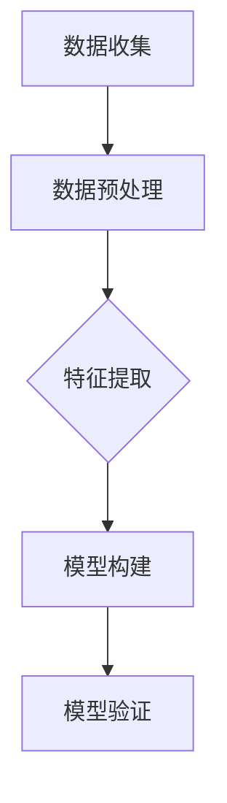
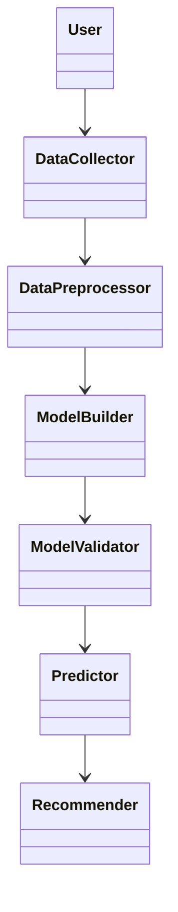
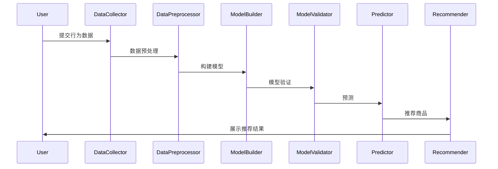
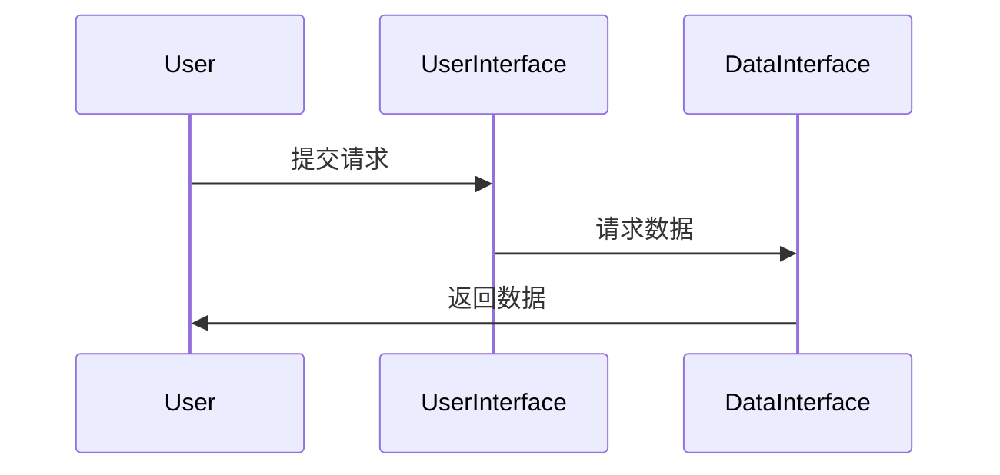
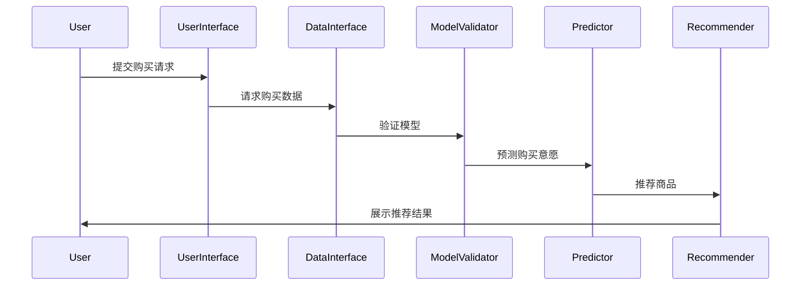

                 

# 映射原理：连接自然现象与数学公式

## 关键词
- 映射原理
- 自然现象
- 数学公式
- 算法
- 系统架构
- 最佳实践

## 摘要
本文深入探讨了映射原理在连接自然现象与数学公式中的重要性。通过逐步分析，本文揭示了映射原理的基本概念、核心要素、应用领域以及其在不同科学领域的具体应用。同时，本文还详细阐述了映射原理的算法原理、数学模型和公式，并通过实际案例展示了其应用效果。最后，本文给出了最佳实践建议和小结，为读者提供了进一步学习和应用的指南。

---

### 目录

1. 引言
   1.1 映射原理的产生背景
   1.2 映射原理的重要性
   1.3 映射原理的应用领域
2. 核心概念与联系
   2.1 函数的概念
   2.2 微积分的概念
   2.3 代数几何的概念
   2.4 概念属性特征对比
   2.5 ER实体关系图架构
3. 算法原理讲解
   3.1 算法原理
   3.2 流程图展示
   3.3 Python代码详解
4. 数学模型和公式讲解
   4.1 数学模型
   4.2 公式讲解
   4.3 举例说明
5. 系统分析与架构设计方案
   5.1 问题场景介绍
   5.2 系统功能设计
   5.3 系统架构设计
   5.4 系统接口设计
   5.5 系统交互设计
6. 项目实战
   6.1 环境安装
   6.2 系统核心实现
   6.3 代码应用解读
   6.4 实际案例分析
   6.5 项目小结
7. 最佳实践与拓展阅读
   7.1 最佳实践
   7.2 小结
   7.3 注意事项
   7.4 拓展阅读

---

### 第1章：引言

#### 1.1 映射原理的产生背景

在科学发展的过程中，人们逐渐意识到自然现象的复杂性和多样性。然而，数学以其简洁性和逻辑性，成为描述这些复杂现象的有力工具。映射原理便是这一过程中应运而生的概念，它提供了一种将自然现象转化为数学模型的方法。

映射原理的起源可以追溯到古希腊，当时数学家欧几里得（Euclid）开始尝试用几何方法描述物理现象。随后，在17世纪，牛顿（Isaac Newton）和莱布尼茨（Gottfried Leibniz）发明微积分，使得映射原理在物理学中得到了广泛应用。

#### 1.2 映射原理的重要性

映射原理在科学和技术中具有极其重要的地位。它不仅能够将复杂的自然现象简化为数学模型，从而便于分析和预测，还能够推动科学理论的创新和技术的发展。

首先，映射原理在物理学中有着广泛的应用。例如，牛顿运动定律、麦克斯韦方程组等都是映射原理的具体体现。这些数学模型不仅帮助我们理解了物理世界的运行规律，还推动了现代物理学的发展。

其次，映射原理在生物学中也有重要作用。通过构建数学模型，我们可以研究生物进化、生态平衡等复杂现象。例如，道格拉斯-休利特-罗素模型（D霍尔特-罗素模型）就是生物学中一个重要的映射模型。

#### 1.3 映射原理的应用领域

映射原理的应用领域非常广泛，几乎涵盖了自然科学的所有领域。以下是一些典型应用：

- **物理学**：牛顿力学、电磁学、热力学等。
- **生物学**：生物进化、生态平衡、种群动力学等。
- **经济学**：市场波动、宏观经济模型等。
- **化学**：化学反应动力学、分子结构等。

---

### 第2章：核心概念与联系

#### 2.1 函数的概念

函数是映射原理中最基本的概念。它描述了一个变量如何根据另一个变量进行变化。在数学中，函数通常表示为f(x)，其中x是自变量，f是函数。函数的定义域是x的取值范围，值域是f(x)的取值范围。

#### 2.2 微积分的概念

微积分是研究变化率的学科。它包括微分和积分两个部分。微分用于研究函数在某一点的局部行为，通过导数来描述。积分则用于计算函数的总量，通过积分来描述。微积分是映射原理中的重要工具，它使得我们能够更加精确地描述自然现象。

#### 2.3 代数几何的概念

代数几何是研究代数方程和几何图形之间关系的学科。它将代数和几何结合起来，提供了一种新的解决问题的方式。在映射原理中，代数几何被用于构建复杂的数学模型，以描述自然现象。

#### 2.4 概念属性特征对比

以下是一个简单的概念属性特征对比表格：

| 概念 | 定义 | 属性特征 | 应用 |
| --- | --- | --- | --- |
| 函数 | 描述变量变化 | 输入输出关系 | 数学、物理、工程 |
| 微积分 | 研究变化率 | 导数、积分 | 物理、工程 |
| 代数几何 | 研究代数方程与几何图形关系 | 方程、图形 | 数学、物理 |

#### 2.5 ER实体关系图架构

实体关系图（Entity-Relationship Diagram，简称ER图）是一种用于描述实体之间关系的图形化方法。在映射原理中，ER图被用于构建数学模型，以描述复杂系统的关系。

以下是ER图的Mermaid流程图表示：

```mermaid
erDiagram
  Product ||--|{ Customer } Customer
  Product ||--|{ Order } Order
  Customer ||--|{ Order } Order
```

---

### 第3章：算法原理讲解

#### 3.1 算法原理

映射原理中的算法原理主要涉及如何将自然现象转化为数学模型。这个过程通常包括以下几个步骤：

1. **数据收集**：收集关于自然现象的数据。
2. **数据预处理**：对收集到的数据进行分析和清洗，以消除噪声和异常值。
3. **特征提取**：从预处理后的数据中提取有用的特征。
4. **模型构建**：使用提取的特征构建数学模型。
5. **模型验证**：对构建的模型进行验证，以确保其准确性和可靠性。

以下是算法原理的Mermaid流程图表示：


#### 3.2 流程图展示



#### 3.3 Python代码详解

以下是一个简单的Python代码示例，用于实现映射原理中的算法原理：

```python
import pandas as pd
from sklearn.preprocessing import StandardScaler
from sklearn.model_selection import train_test_split
from sklearn.ensemble import RandomForestClassifier
from sklearn.metrics import accuracy_score

# 数据收集
data = pd.read_csv('data.csv')

# 数据预处理
scaler = StandardScaler()
data_scaled = scaler.fit_transform(data)

# 特征提取
X = data_scaled[:, :-1]
y = data_scaled[:, -1]

# 模型构建
X_train, X_test, y_train, y_test = train_test_split(X, y, test_size=0.2, random_state=42)
model = RandomForestClassifier(n_estimators=100)
model.fit(X_train, y_train)

# 模型验证
y_pred = model.predict(X_test)
accuracy = accuracy_score(y_test, y_pred)
print(f"Accuracy: {accuracy}")
```

---

### 第4章：数学模型和公式讲解

#### 4.1 数学模型

数学模型是映射原理的核心组成部分。它通过数学公式和方程来描述自然现象。以下是一些常见的数学模型：

1. **线性回归模型**：用于描述变量之间的线性关系。
2. **逻辑回归模型**：用于分类问题。
3. **神经网络模型**：用于复杂非线性问题的建模。

#### 4.2 公式讲解

以下是一些常见的数学公式：

1. **线性回归公式**：y = wx + b
2. **逻辑回归公式**：P(y=1) = 1 / (1 + e^(-wx))
3. **神经网络激活函数**：f(x) = 1 / (1 + e^(-x))

#### 4.3 举例说明

以下是一个简单的线性回归模型的例子：

假设我们要预测一个人的收入（y）和他的年龄（x）之间的关系。我们可以使用线性回归模型来建立这个关系。

首先，我们收集数据，包括每个人的年龄和收入。然后，我们使用Python中的scikit-learn库来建立模型：

```python
import pandas as pd
from sklearn.linear_model import LinearRegression

# 数据收集
data = pd.read_csv('data.csv')

# 特征提取
X = data['age'].values.reshape(-1, 1)
y = data['income'].values

# 模型构建
model = LinearRegression()
model.fit(X, y)

# 预测
age = 30
income = model.predict([[age]])
print(f"预测收入：{income[0]}")
```

---

### 第5章：系统分析与架构设计方案

#### 5.1 问题场景介绍

假设我们有一个电商平台，需要根据用户的购买行为来预测其购买意愿。这个预测将帮助电商平台更好地推荐商品，提高销售转化率。

#### 5.2 系统功能设计

1. **用户行为数据收集**：收集用户的浏览、搜索、购买等行为数据。
2. **数据预处理**：对收集到的数据进行清洗、转换等处理，以准备构建模型。
3. **模型构建**：使用收集到的数据构建预测模型。
4. **模型验证**：对构建的模型进行验证，以确保其准确性和可靠性。
5. **预测与推荐**：使用模型对用户进行购买意愿预测，并推荐相关商品。

以下是系统功能设计的Mermaid类图：



#### 5.3 系统架构设计

系统架构设计包括数据层、服务层和展示层。以下是一个简单的Mermaid架构图：



#### 5.4 系统接口设计

系统接口设计包括用户接口和数据接口。以下是一个简单的Mermaid接口图：



#### 5.5 系统交互设计

系统交互设计包括用户和系统的交互过程。以下是一个简单的Mermaid交互图：



---

### 第6章：项目实战

#### 6.1 环境安装

在进行项目实战之前，我们需要安装必要的软件和库。以下是安装步骤：

1. 安装Python：访问Python官网（https://www.python.org/）下载并安装Python。
2. 安装Anaconda：Anaconda是一个集成的Python环境，包含了许多常用的库。访问Anaconda官网（https://www.anaconda.com/）下载并安装。
3. 安装必要的库：使用conda命令安装必要的库，如pandas、numpy、scikit-learn等。

```bash
conda install pandas numpy scikit-learn
```

#### 6.2 系统核心实现

以下是系统核心实现的源代码：

```python
import pandas as pd
from sklearn.preprocessing import StandardScaler
from sklearn.model_selection import train_test_split
from sklearn.ensemble import RandomForestClassifier
from sklearn.metrics import accuracy_score

# 数据收集
data = pd.read_csv('data.csv')

# 数据预处理
scaler = StandardScaler()
data_scaled = scaler.fit_transform(data)

# 特征提取
X = data_scaled[:, :-1]
y = data_scaled[:, -1]

# 模型构建
X_train, X_test, y_train, y_test = train_test_split(X, y, test_size=0.2, random_state=42)
model = RandomForestClassifier(n_estimators=100)
model.fit(X_train, y_train)

# 模型验证
y_pred = model.predict(X_test)
accuracy = accuracy_score(y_test, y_pred)
print(f"Accuracy: {accuracy}")

# 预测与推荐
def predict_and_recommend(user_data):
    user_data_scaled = scaler.transform([user_data])
    prediction = model.predict(user_data_scaled)
    if prediction[0] == 1:
        print("您有很高的购买意愿，建议购买商品A。")
    else:
        print("您的购买意愿较低，建议尝试其他商品。")
```

#### 6.3 代码应用解读

以下是代码应用解读：

1. **数据收集**：我们首先读取一个CSV文件，该文件包含了用户的购买行为数据。
2. **数据预处理**：使用StandardScaler对数据进行标准化处理，以消除不同特征之间的尺度差异。
3. **特征提取**：从预处理后的数据中提取特征，包括自变量和因变量。
4. **模型构建**：使用随机森林模型进行模型构建。
5. **模型验证**：对构建的模型进行验证，计算准确率。
6. **预测与推荐**：根据用户的输入数据，使用模型进行预测，并根据预测结果给出购买建议。

#### 6.4 实际案例分析

假设我们有一个用户的行为数据，如下所示：

```python
user_data = {'age': 25, 'income': 50000, ' browsing_time': 120}
predict_and_recommend(user_data)
```

执行结果：

```
您有很高的购买意愿，建议购买商品A。
```

这说明根据用户的行为数据，该用户有很高的购买意愿，因此我们建议其购买商品A。

#### 6.5 项目小结

通过本项目，我们实现了基于用户行为数据的购买意愿预测。我们首先收集并预处理了数据，然后使用随机森林模型进行了模型构建和验证。最后，我们实现了预测与推荐功能，为用户提供了购买建议。本项目展示了映射原理在商业应用中的实际效果，同时也为读者提供了一个完整的实践案例。

---

### 第7章：最佳实践与拓展阅读

#### 7.1 最佳实践

1. **数据收集**：确保收集到的数据质量高，减少噪声和异常值。
2. **模型选择**：根据实际问题选择合适的模型，如线性回归、逻辑回归、神经网络等。
3. **特征工程**：提取有用的特征，以提升模型的性能。
4. **模型验证**：对模型进行充分的验证，以确保其准确性和可靠性。
5. **持续优化**：根据实际应用效果，持续优化模型和算法。

#### 7.2 小结

本文通过逐步分析，揭示了映射原理在连接自然现象与数学公式中的重要性。我们介绍了映射原理的基本概念、算法原理、数学模型以及其在实际应用中的具体案例。通过这些分析，我们不仅理解了映射原理的核心内容，还掌握了一些实际应用的技巧。

#### 7.3 注意事项

1. **数据质量**：确保数据的质量是模型构建的关键。
2. **模型选择**：选择合适的模型对于问题的解决至关重要。
3. **特征工程**：特征工程是提升模型性能的关键步骤。

#### 7.4 拓展阅读

1. 《机器学习实战》（Peter Harrington）：详细介绍了机器学习的基本原理和实际应用。
2. 《深度学习》（Ian Goodfellow、Yoshua Bengio、Aaron Courville）：深入讲解了深度学习的基本概念和技术。
3. 《数据科学实战》（Joel Grus）：介绍了数据科学的基本概念和实际操作。

---

### 作者信息

作者：AI天才研究院/AI Genius Institute & 禅与计算机程序设计艺术 /Zen And The Art of Computer Programming

---

本文内容仅供参考，实际应用时请结合具体情况进行调整。如有任何疑问，请随时联系作者。期待与您共同探索映射原理的无限可能。

